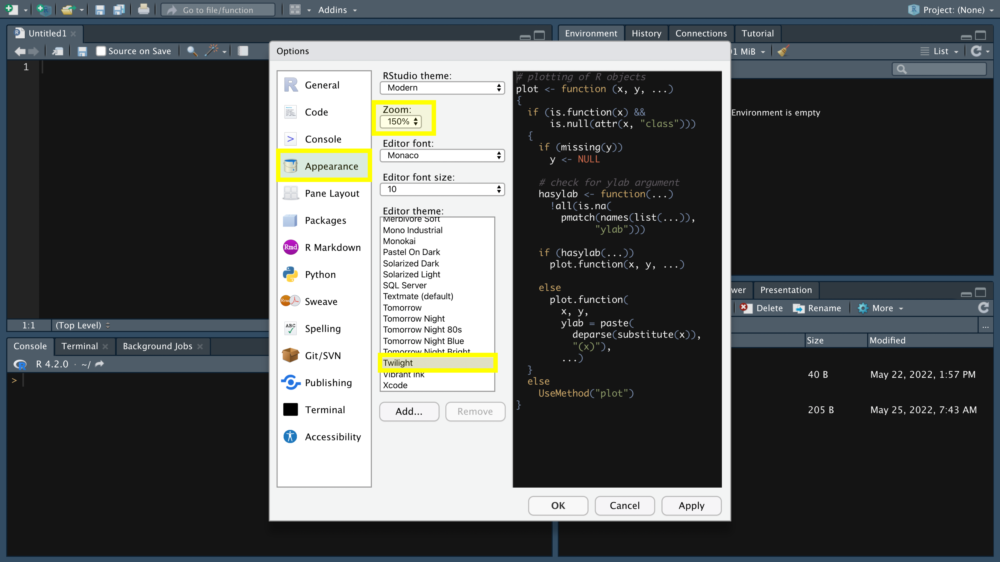
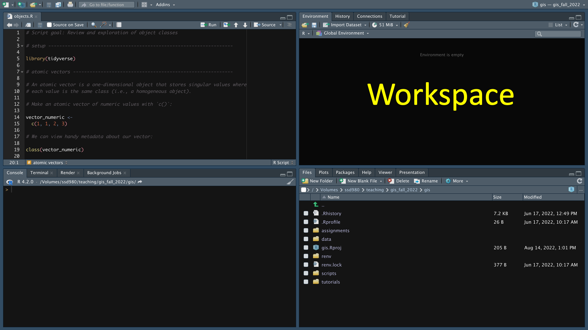
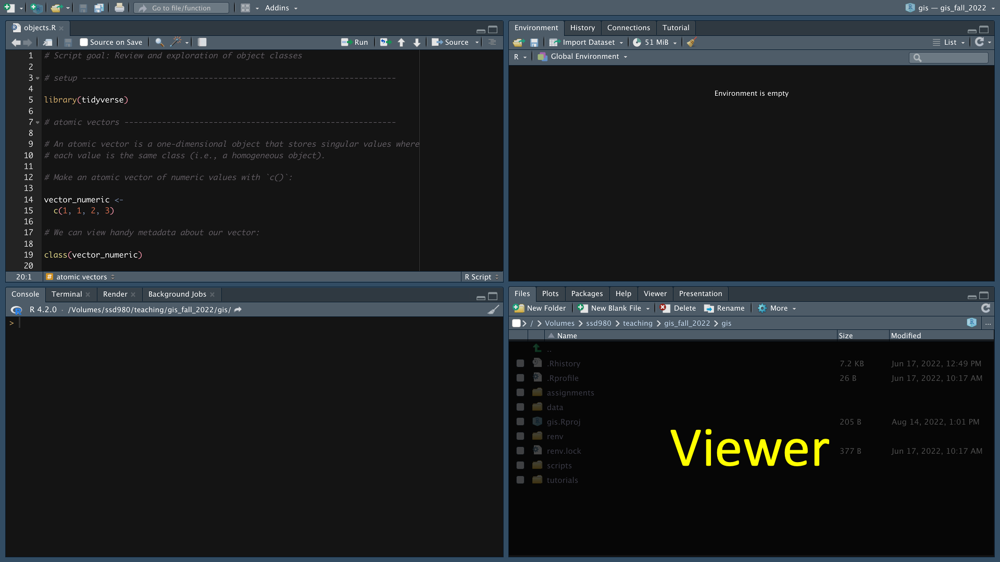



<hr>

<div>

{.intro_image}

Program []{style="color: blue;"} is a computer language that identifies itself as "a language and environment for statistical computing and graphics". Members of the R community have extended this functionality to address a wide array of applications, from data engineering and management to using R as a Geographic Information System (GIS).

The introductory documents in this series will begin to prepare you for the material presented in this course. Even if you are entering this class with loads of R experience, please thoroughly read and complete each lesson, as they may contain unfamiliar terminology or concepts.

In this lesson, you will learn:

* How to install and set up R and RStudio, including recommended global options
* The core RStudio panes (source, console, workspace, and viewer) and what each is used for

</div>

## Navigating preliminary course content

Throughout these preliminary lessons there are a number of icons and formats to pay special attention to:

* Key **vocabulary terms** are provided in bold-face font. There is a glossary of terms at the end of each lesson.

* [Keyboard shortcuts and file paths are provided in the Courier font-family.]{style="font-family: monospace;"}. A table of keyboard shortcuts is provided at the end of each lesson.

*  :::{style="font-family: monospace; background-color: #f0f0f0; font-size: 0.75em;"}
Sections that appear exactly as they would in R are provided in the Courier font-family and are highlighted in gray. A table of functions used is provided at the end of each lesson.
:::

* ::: now_you
 [Sections where user input is necessary start with a user circle icon and are highlighted in blue.]{style="padding-left: 0.5em;"}
:::

* ::: mysecret
 [Tips and tricks start with a user secret icon and are highlighted in light yellow.]{style="padding-left: 0.5em;"}
:::

## Before you begin

To get the most out of this lesson, please:

* Open RStudio in a clean session;
* Open a new, blank script file and save it as "lesson_0.1.R";
* Code along with the content!

## 1. Installing R and the RStudio

:::{style="display: flow-root;"}
{style="float:left; height: 10em; padding-right: 15px;"}

In this course, we will use R within the RStudio IDE (Integrated Development Environment). RStudio is an interface to R and Python (and a number of other computer languages) that has numerous advantages over using R's built-in interface. The RStudio IDE provides loads of tools for an effective and well-organized R data workflow.
:::

::: now_you
 [Install and open RStudio]{style="font-size: 1.25em; padding-left: 0.5em;"}

1. If you do not have *the most recent version* of  installed on your computer, <a href="https://www.r-project.org/" target="_blank"> **please visit this link**</a> and follow the directions to do so. *Note: R updates often! If you already have R on your computer, please ensure that your version is the most recent version by downloading the latest version.*

2. If you do not have *the most recent version* of RStudio Desktop installed on your computer, <a href="https://www.rstudio.com/products/rstudio/download/" target="_blank"> **visit this link** </a> and follow the directions to do so. *Note: RStudio updates often! If you already have RStudio Desktop on your computer, please ensure that your version is the most recent version by downloading the latest version.*

3. Please ensure that both programs are properly installed on your computer.

4. Open RStudio and create a blank script file by pressing the keyboard shortcut [CTRL+Shift+N]{style="font-family: monospace"} (Mac: [&#8984;+Shift+N]{style="font-family: monospace"})
:::

### 1.1 RStudio global options

Before getting started with using R and RStudio, let's set the global options for the RStudio IDE. Global options provide controls for how we interact with code in RStudio.

::: now_you
 [Open global options]{style="font-size: 1.25em; padding-left: 0.5em;"}

To open RStudio's global options:

* Windows: Go to Tools/Global Options ... (top menu bar)
* Mac: As above or (better yet), press the keyboard shortcut [&#8984;+,]{style="font-family: monospace"}.
:::

This opens a window for setting your global options:

{style="width: 100%;"}

#### 1.1.1 General options

RStudio gives us the opportunity to automatically save the data that we're working on and a history of code that we ran. We don't want to accept either of these opportunities! Doing so can lead to a very sloppy coding workflow. More importantly, as the tasks that you undertake in R become more complex, these "opportunities" become more of a hindrance than a help. It's best to avoid them from the get-go.

::: now_you
 [Set General options]{style="font-size: 1.25em; padding-left: 0.5em;"}

1. Go to "General > Basic":
2. Set "Save workspace to .RData on exit to "Never"
3. Ensure that there is no check mark to the left of "Always save history (even when not saving .RData)
:::

{style="width: 100%;"}

#### 1.1.2 Code options

Options in the "Code" tab can really improve your workflow!

"Soft-wrapping" source files ensures that long lines of code are shown inside of your coding window. This avoids having to scroll horizontally to view your all of your code.

::: now_you
 [Set Soft-wrap]{style="font-size: 1.25em; padding-left: 0.5em;"}

1. Go to "Code > Editing"
2. Ensure that there is a check mark to the left of "Soft-wrap R source files".
:::

{style="width: 100%;"}

::: mysecret
 [You shouldn't rely too heavily on soft-wrapping!]{style="font-size: 1.25em; padding-left: 0.5em;"}

Long lines of code are hard to read and, more importantly, it can be challenging to spot errors. In this course we'll cover how to format your code to avoid this.
:::

"Rainbow parentheses" are an option for displaying code in a way that can really help avoid problems (the reason for this will become apparent in time). *Note: If you have an older version of RStudio, you will not see this option ... be sure to install the most recent version of the program!*

::: now_you
 [Set Rainbow parentheses]{style="font-size: 1.25em; padding-left: 0.5em;"}

1. Go to "Code > Display"
2. Ensure that there is a check mark to the left of "Rainbow parentheses".
:::

{style="width: 100%;"}

#### 1.1.3 Appearance options

Eye fatigue can become a big problem when coding. The default appearance options in RStudio can lead to problems if you're not careful. To address this, I recommend that you modify the Zoom level and Editor theme.

::: now_you
 [Set General options]{style="font-size: 1.25em; padding-left: 0.5em;"}

Go to "Appearance":

* Set the Zoom to at least 125%
* Set the Editor theme to something with a dark background (I use "Twilight", but play around with the options to see which you find most comfortable)
:::

{style="width: 100%;"}

## 2. Core R concepts

Regardless of the application, coding in program R involves working with:

* **Environments**: Data structures used to reference objects located in your system's memory.
* **Functions**: Sets of instructions for accomplishing a given task. *Everything that happens in R is the result of a function call* (J. Chambers)!
* **Objects**: Collections of one or more values or functions. *Everything that exists in R is an object* (J. Chambers)!

For example, consider the following statement:

```{webr}
1 + 1 + 2
```

The above statement was executed within the R **environment**. The numbers and the addition symbol are all R **objects**. The addition symbol is a type of object called a **function**. When you execute the code, R used the `+` function to calculate the sum of the values.

*Note: In the remainder of this lesson we'll finish our tour of the RStudio IDE. Environments, functions, and some "best practices" in R coding are the topic of the next lesson. Data objects in R will be the topic of the third and fourth lessons of this series.*

## 3. The RStudio IDE

RStudio is organized into four panes, as described in the image below. We will use pane names and explore their functionality considerably throughout this class.

{style="width: 100%;"}

### 3.1 The source pane

The **source pane** provides an interface for writing and editing scripts. An R **script** is a text file that contains a set of commands to read, manipulate, and analyze data. Any code that you will use more than once or upon which future lines of code depend should always be written in a script file and executed from the source pane.

{style="width: 100%;"}

#### 3.1.1 R scripts

Even before you begin writing any code, it's good practice to save the script you will be working on.

::: now_you
 [Saving script files]{style="font-size: 1.25em; padding-left: 0.5em;"}

Save the file on your computer using the keyboard combination [CTRL+S]{style="font-family: monospace"} (Mac: [⌘+S]{style="font-family: monospace"}). Name the file "rstudio_intro". The file extension, ".R" will be assigned automatically.
:::

::: mysecret
 [Save your script files somewhere easy to find!]{style="font-size: 1.25em; padding-left: 0.5em;"}

Save your script files in a location that can easily be found on your computer's hard drive. In doing so, ensure that:

* The folders where your files are stored do not contain a space
* R script files are not stored in a cloud storage location (e.g., iCloud, OneDrive, Dropbox, Box, Google Drive)
:::

Notice that I named the file in all lowercase and replaced the space with `_`? When working with code, you should never include spaces in your file names and avoiding uppercase letters helps you access files more quickly.

::: now_you
 [Closing script files]{style="font-size: 1.25em; padding-left: 0.5em;"}

Close the script file using the keyboard combination [CTRL+W]{style="font-family: monospace"} (Mac: [⌘+W]{style="font-family: monospace"}).
:::

::: mysecret
 [Close scripts you're not using]{style="font-size: 1.25em; padding-left: 0.5em;"}

You should strive to minimize the number of script files you have open at any given time. When you are finished working on a script, you should close it!
:::

Of course, we're not done with this one yet ... let's open it in our source pane again.

::: now_you
 [Opening script files]{style="font-size: 1.25em; padding-left: 0.5em;"}

Use the keyboard combination [CTRL+O]{style="font-family: monospace"} (Mac: [&#8984;+O]{style="font-family: monospace"}) to open your script file again.
:::

#### 3.1.2 Code execution from the source pane

To execute code from the source pane, place your cursor on the line you would like to run and use the keyboard shortcut [CTRL+Enter]{style="font-family: monospace"} (Mac: [&#8984;+return]{style="font-family: monospace"}).

::: now_you
 [Type `1 + 1 + 2` on the first line of your script in the source pane. Use the keyboard shortcut [CTRL+Enter]{style="font-family: monospace"} (Mac: [&#8984;+return]{style="font-family: monospace"}) to execute the line of code that the cursor is on.]{style="padding-left: 0.5em;"}

You may also use your mouse and [CTRL+Enter]{style="font-family: monospace"} (Mac: [&#8984;+return]{style="font-family: monospace"}) to run a subset of a line of code. Using your entry above, highlight just `1 + 2` with your mouse and run the code.
:::

*Note: Make sure that you have [CTRL+Enter]{style="font-family: monospace"} (Mac: [&#8984;+return]{style="font-family: monospace"}) in your muscle memory -- you are going to be using it a lot!*

::: mysecret
 [Use the source pane for anything you'll reuse!]{style="font-size: 1.25em; padding-left: 0.5em;"}

Any code that you will use more than once or upon which future lines of code depend should always be written and executed in the source pane.
:::

### 3.2 The console pane

The **console pane** contains RStudio's interface to program R. When a line of code is run from the command prompt (the symbol `>`) on the console, the interface sends the code to R which evaluates it and returns any potential output.

{style="width: 100%;"}

When you ran the above sections of code from the source pane, you may have noticed that the input and output appeared in the console pane. This highlights a component of how RStudio works: code written in the source pane is sent to the console pane, the console pane sends the code to R for evaluation, and R prints the results in the console pane (if applicable).

You can also run code directly from the console pane. To do so, simply type the code you would like to run and press enter.

::: now_you
 [Running a line of code in the console pane]{style="font-size: 1.25em; padding-left: 0.5em;"}

Type `1 + 1 + 2` after the command prompt on the console pane and press enter to run the code.
:::

You can use the up and down arrows on your keyboard to navigate between lines of code you've run in the console pane. This can be especially useful for modifying part of a section of code.

::: now_you
 [Navigating the console pane]{style="font-size: 1.25em; padding-left: 0.5em;"}

Use the up arrow on your keyboard to change the line `1 + 1 + 2` to `1 + 1 + 2 + 3`.
:::

::: mysecret
 [Use the console pane for one-off code!]{style="font-size: 1.25em; padding-left: 0.5em;"}

Any code that you will use only once should be written and executed in the console pane. Do not write code into the console pane if future code elements will depend on the code's output!
:::

### 3.3 The workspace pane

Whenever you open RStudio, you initiate an **R session**. An R session is defined by all R operations conducted since R was opened. The **workspace pane** provides information on your current R session.

{style="width: 100%;"}

The workspace pane is separated into a number of tabs (the tabs listed on your workspace pane may be different from mine).

#### 3.3.1 Workspace pane: Environment tab

When you start an R session, you create a personal workspace known as the **global environment**. The environment tab provides a glimpse of the names assigned to files that you have stored in your system's memory (we'll go more in-depth on this subject in the next lesson!).

*Note: The environment tab of the workspace pane also provides tools for a number of tasks, including importing and exporting data and managing memory. You may want to explore these features.*

#### 3.3.2 Workspace pane: History tab

In addition to managing your global environment, you can use the workspace pane to view and manage your **session history**.

::: now_you
 [View your session history]{style="font-size: 1.25em; padding-left: 0.5em;"}

Click on the "History" tab of the workspace pane to view the commands that you have run so far.
:::

You can use the history tab to search for lines of code that you have written and even run them again!

::: now_you
 [Restore code from your session history]{style="font-size: 1.25em; padding-left: 0.5em;"}

* To your console pane: Double-clicking the line of code with your mouse.
* To your source pane: Select a line of code with your mouse, hold down the shift key and double-click the line of code.
* Multiple lines of code: Use your mouse to select the first line of code in the sequence then hold down the shift key and select the last line of code. In the menu bar, click "To Console" or "To Source".
:::

### 3.4 The viewer pane

There is a lot going on in the viewer pane, but basically it provides tools for file management and viewing anything other than command line output.

{style="width: 100%;"}

The tabs on this pane include:

* Files: A file manager window. This shows the files located in your working directory, which is the folder on your computer that R is reading from and writing to.
* Plots: Any plots that you create can be viewed here.
* Packages: R libraries that have been installed onto your system.
* Help: Help files that provide in-depth information into any R function that you will use.
* Viewer: Images and maps can be viewed here.
* Presentation: View slide presentations (similar to PowerPoint).

*Note: The viewer pane also contains tools for a number of other tasks, including tools for loading and installing libraries and managing files.*

## 4. Exercises
 
::: now_you
 [Test your knowledge!]{style="padding-left: 0.5em;"}
 
1. Which pane of the RStudio IDE would be best to use to search for code that you previously executed in the console pane?
 
`r longmcq(c("Source", "Console", answer = "Workspace", "Viewer"))`
 
2. You are writing a line of code whose output later lines will depend on. In which pane should you write and run it?
 
`r longmcq(c(answer = "Source pane", "Console pane", "Viewer pane", "History tab"))`
 
3. TRUE/FALSE: In this course, you should set RStudio to "Save workspace to .RData on exit" so that your objects are automatically restored the next time you open R.
 
`r torf(FALSE)`
:::

## Take-home points

Before we dive deeper, let’s pin down the essentials from this lesson:

* We work in R through the RStudio IDE, and it’s worth keeping both R and RStudio updated to their most recent versions so you have the latest features (like rainbow parentheses).
* Set your global options up front: never auto-save your workspace or history, turn on soft-wrapping and rainbow parentheses, and pick a comfortable dark theme with the zoom bumped up to spare your eyes.
* RStudio has four panes: the source pane for writing and running reusable code (or anything later lines depend on), the console pane for one-off code, the workspace pane for your environment and history, and the viewer pane for files, plots, packages, and help.
* Use the source pane for anything you’ll reuse, and use the console pane for quick, one-off code, remembering that the up arrow recalls previous console commands so you can tweak and rerun them.
* Get CTRL+Enter (Mac: ⌘+return) into your muscle memory, since that’s how you’ll run code from the source pane throughout the course.

## Reference

```{r}
#| label: glossary
#| message: false
#| echo: false
#| results: "asis"

lesson_refs$terms %>%
  glossary_panel_html(.button_label = "Glossary") %>%
  cat()
```

<button class="accordion">Functions</button>
::: panel
**Important!** Primitive functions as well as functions in the *base* and *graphics* packages are loaded by default when you start an R session.

::: function_table

```{r}
#| label: functions
#| message: false
#| echo: false

lesson_refs$functions %>%
  function_table_kable()
```

:::
:::

<button class="accordion">Keyboard shortcuts</button>
::: panel


:::

<button class="accordion">R Studio panes</button>
::: panel

:::
