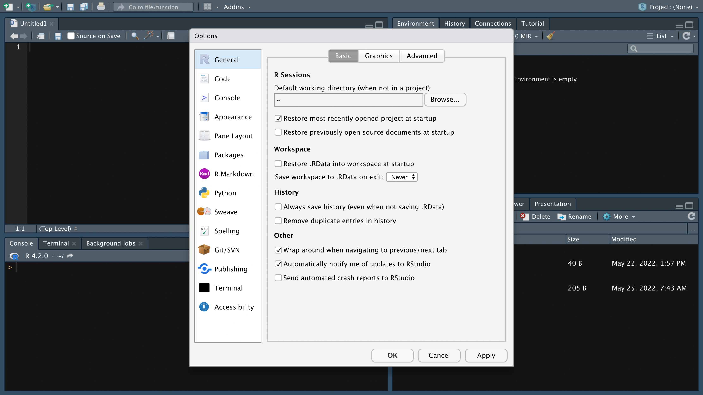
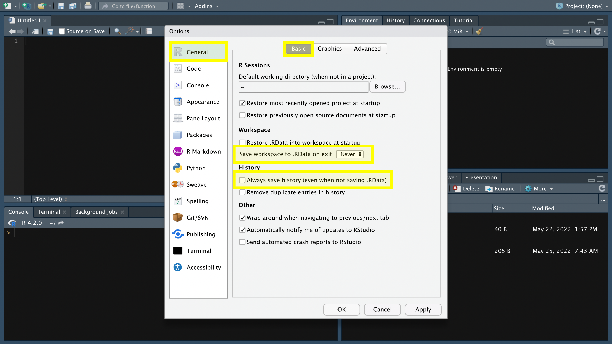
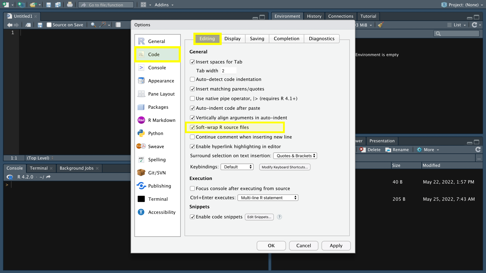
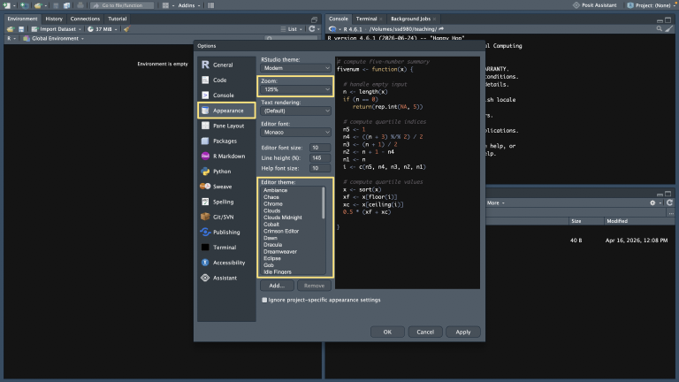
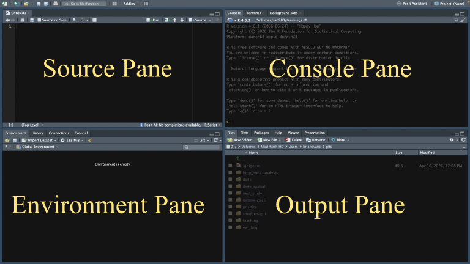
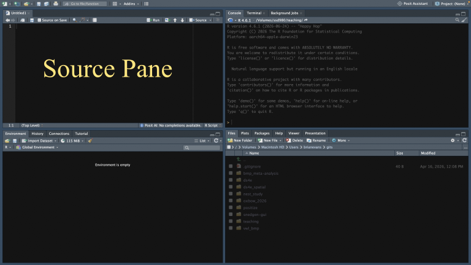
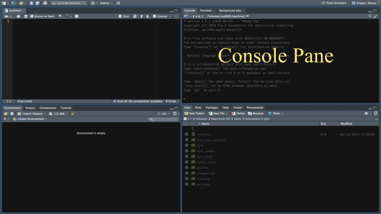
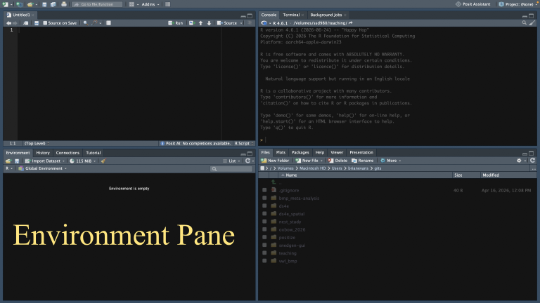
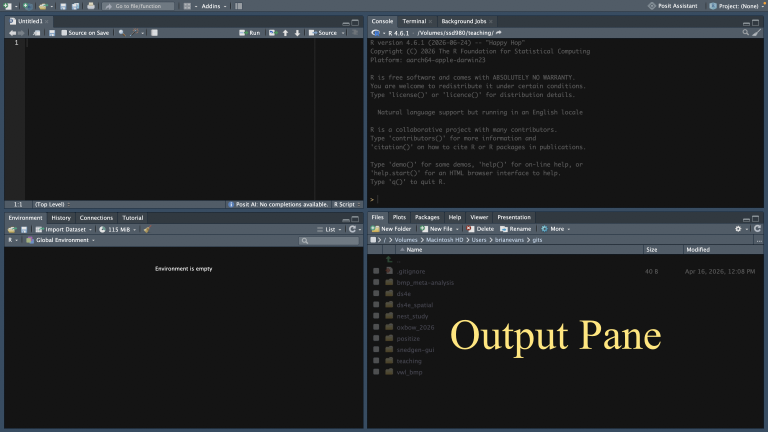



<hr>

<div>

{.intro_image}

R is a programming language and environment for statistical computing and graphics. Members of the R community have extended this functionality to address a wide array of applications, from data engineering and management to using R as a Geographic Information System (GIS).

The introductory documents in this series will begin to prepare you for the material presented in this course. Even if you are entering this class with loads of R experience, please thoroughly read and complete each lesson -- these preliminary lessons contain terminology and concepts that are critical for understanding the course content.

In this lesson, you will install and set up R and RStudio. You will learn:

* How to adjust global options for a comfortable and reproducible coding workflow
* The core RStudio panes (Source, Console, Environment, and Output) and what each is used for
* How to manage and run script files with keyboard shortcuts


</div>

## Navigating preliminary course content

Throughout these preliminary lessons there are a number of icons and formats to pay special attention to:

* Key **vocabulary terms** are provided in boldface font. There is a glossary of terms at the end of each lesson.

* [Keyboard shortcuts and file paths are provided in a monospace font]{style="font-family: monospace;"}. A table of keyboard shortcuts is provided at the end of each lesson.

*  :::{style="font-family: monospace; background-color: #f0f0f0; font-size: 0.75em;"}
Sections that appear exactly as they would in R are provided in a monospace font and are highlighted in gray. A table of functions used is provided at the end of each lesson.
:::

* ::: now_you
 [Sections where user input is necessary start with a user circle icon and are highlighted in blue.]{style="padding-left: 0.5em;"}
:::

* ::: mysecret
 [Tips and tricks start with a user secret icon and are highlighted in yellow.]{style="padding-left: 0.5em;"}
:::

## 1. Installing R and RStudio

:::{style="display: flow-root;"}
{style="float:left; height: 10em; padding-right: 15px;"}

In this course, we will use R within the RStudio IDE (Integrated Development Environment). RStudio is an interface to R that has numerous advantages over using R's built-in interface. The RStudio IDE provides a wide range of tools for an effective and well-organized R data workflow.
:::

::: now_you
 [Install and open RStudio]{style="font-size: 1.25em; padding-left: 0.5em;"}

1. If you do not have  version `r glue::glue("{R.version$major}.{R.version$minor}")` or later installed on your computer, <a href="https://www.r-project.org/" target="_blank"> **please visit this link**</a> and follow the directions to do so.

2. If you do not have *the most recent version* of RStudio Desktop installed on your computer, <a href="https://www.rstudio.com/products/rstudio/download/" target="_blank"> **visit this link** </a> and follow the directions to do so. *Note: RStudio updates often! If you already have RStudio Desktop on your computer, please ensure that your version is up-to-date.*

3. Please ensure that both programs are properly installed on your computer.

:::

### 1.1 RStudio global options

Before getting started with using R and RStudio, let's set the global options for the RStudio IDE. Global options provide controls for how we interact with code in RStudio.

::: callout-tip

## Global options are not universal!

The options I will have you set below represent a few of *my* personal preferences when coding. My recommendations are based on long days spent creating, cleaning, and fixing code and I have found that they make long coding sessions more comfortable and reproducible. Please do not hesitate to set options in a way that is most comfortable for you.

:::

::: now_you
 [Open global options]{style="font-size: 1.25em; padding-left: 0.5em;"}

To open RStudio's global options:

* Windows: Go to Tools &rarr; Global Options&hellip; (top menu bar)
* Mac: As above or (better yet), press the keyboard shortcut [&#8984;+,]{style="font-family: monospace"}.
:::

This opens a window for setting your global options:

{style="width: 100%;" fig-alt="The global options window in RStudio"}

#### 1.1.1 General options

RStudio can restore a previously saved workspace at startup, save the current workspace when you exit, and preserve your command history across sessions. Although these features may seem convenient, disabling them encourages you to create complete, reproducible scripts that can rebuild your work from a clean R session.

::: now_you
 [Set General options]{style="font-size: 1.25em; padding-left: 0.5em;"}

1. Go to "General &rarr; Basic".
2. Ensure that "Restore .RData into workspace at startup" is *not* checked.
3. Ensure that "Save workspace to .RData on exit" is set to "Never".
4. Ensure that "Always save history (even when not saving .RData)" is *not* checked.
:::

{style="width: 100%;" fig-alt="Screenshot highlighting the settings described above"}

::: mysecret

 [Why should I avoid saving the workspace and command history across sessions?]{style="font-size: 1.25em; padding-left: 0.5em;"}

* Saving your workspace across sessions is generally considered bad practice because it can negatively impact the reproducibility of your analysis. 
* I choose to avoid saving history across sessions to ensure that the information provided is limited to the most recent, relevant commands.

:::

#### 1.1.2 Code options

Options in the "Code" tab can really improve your workflow!

Enabling "soft wrapping" ensures that long lines remain visible within the editor. This avoids having to scroll horizontally to view all of your code.

"Rainbow parentheses" ensure that matching parentheses share colors and, when code is nested, each nested set of parentheses has its own color. This makes it easier to debug your code (i.e., find and fix problems).

::: now_you
 [Soft-wrapping and rainbow parentheses]{style="font-size: 1.25em; padding-left: 0.5em;"}

1. Go to "Code &rarr; Display".
2. Ensure that there is a check mark to the left of "Soft-wrap R source files".
3. Ensure that there is a check mark to the left of "Rainbow parentheses".
:::

{style="width: 100%;" fig-alt="Image highlighting the process of setting the code display options as described above"}

#### 1.1.3 Appearance options

Eye fatigue can become a big problem when coding. To address this, I recommend that you modify the Zoom level and Editor theme.

::: now_you
 [Set Appearance options]{style="font-size: 1.25em; padding-left: 0.5em;"}

1. Navigate to "Appearance".
2. Experiment with the zoom and themes to find comfortable settings for long coding sessions.

:::

{style="width: 100%;" fig-alt="Image showing where you can experiment with appearance settings"}

## 2. The RStudio IDE

RStudio is organized into four panes, as described in the image below. We will use pane names and explore their functionality considerably throughout this class.

{style="width: 100%;" fig-alt="Image of RStudio panes: Source, Console, Environment, and Output"}

### 2.1 The Source Pane

The **Source Pane** provides an interface for writing and editing scripts. An R **script** is a text file that contains a set of commands to read, manipulate, and analyze data. Code that you will use more than once or upon which future lines of code depend should be written in a script file and executed from the Source Pane.

{style="width: 100%;" fig-alt="Image highlighting the location of the source pane"}

The source pane is where you will write code that future operations will depend on. The code is written within a **script file**, which often includes sequences of instructions that are run line-by-line in order.

Here are some basic processes to get us started with R scripts:

* **Create an R script**: We can create a new script file with the keyboard shortcut [Ctrl+&#8679;+N]{style="font-family: monospace"} (Windows) or [&#8984;+&#8679;+N]{style="font-family: monospace"} (Mac).
* **Open an R script**: We can open an existing script file with the keyboard shortcut [Ctrl+O]{style="font-family: monospace"} (Windows) or [&#8984;+O]{style="font-family: monospace"} (Mac).
* **Save an R script**: We can save the script file using the keyboard shortcut [Ctrl+S]{style="font-family: monospace"} (Windows) or [&#8984;+S]{style="font-family: monospace"} (Mac).
* **Close an R script**: We can close the script file using the keyboard shortcut [Ctrl+W]{style="font-family: monospace"} (Windows) or [&#8984;+W]{style="font-family: monospace"} (Mac).
* **Execute code**: To run code from the Source Pane, place your cursor on the line you would like to run and use the keyboard shortcut [Ctrl+Enter]{style="font-family: monospace"} (Windows) or [&#8984;+Return]{style="font-family: monospace"} (Mac).
* **Execute a subset of code**: To run a subset of a line of code, highlight the portion you want to execute and use the keyboard shortcut [Ctrl+Enter]{style="font-family: monospace"} (Windows) or [&#8984;+Return]{style="font-family: monospace"} (Mac).

::: now_you
 [Saving script files]{style="font-size: 1.25em; padding-left: 0.5em;"}

Using keyboard shortcuts:

1. Create a new R script file.
2. Save the file on your computer and name the file "rstudio_intro". *Note: The ".R" file extension will be added automatically.*
3. Close the script file.
:::

::: mysecret
 [Recommended practices]{style="font-size: 1.25em; padding-left: 0.5em;"}

#### On saving scripts:

Save your script files in a location that can easily be found on your computer's hard drive. In doing so, here are some recommendations:

* Avoid including spaces in your folders or filenames -- spaces can have specific meanings in programming languages and command-line contexts. For example, we will use the bash shell in this course, where spaces separate commands and their arguments.
* Avoid running R scripts from a cloud storage location (e.g., iCloud, OneDrive, Dropbox, Box, Google Drive) -- this is usually not an issue, but if the cloud drive and RStudio get out of sync it can cause a conflict in your project state. Solutions to this problem can be a time sink because you will sometimes have to resolve duplicate files, restart R, or even close RStudio.
* Avoid including uppercase letters in your filenames. Using lowercase filenames consistently improves readability and prevents capitalization errors.

#### On closing scripts:

Strive to minimize the number of script files you have open at any given time. This helps reduce clutter and thus makes your coding sessions more efficient. When you are finished working on a script, you should close it!
:::

Of course, we're not done with this one yet ... let's open it in our Source Pane again and add some content.

::: now_you
 [Try coding in an R script!]{style="padding-left: 0.5em;"}

Using keyboard shortcuts:

1. Open `rstudio_intro.R` with a keyboard shortcut.

2. Copy-and-paste the following line of code into your script:

```{r}
#| eval: false

1 + 1 + 2
```


3. Run the line of code.

4. In your script file, highlight just `1 + 2` with your mouse and run the code.

5. Close the script file.

:::

*Note: Make sure that you have [Ctrl+Enter]{style="font-family: monospace"} (Mac: [&#8984;+Return]{style="font-family: monospace"}) in your muscle memory -- you are going to be using it a lot!*

::: mysecret
 [Use the Source Pane for anything you'll reuse!]{style="font-size: 1.25em; padding-left: 0.5em;"}

A rule of thumb is that any code that you will use more than once or upon which future lines of code depend should be written and executed in the Source Pane.
:::

### 2.2 The Console Pane

The **Console Pane** contains RStudio's interface to R. When a line of code is run from the command prompt (the symbol `>`) on the Console, the interface sends the code to R which evaluates it and displays any resulting output in the Console.

{style="width: 100%;" fig-alt="Image highlighting the location of the Console Pane"}

When you ran the preceding commands from the Source Pane, you may have noticed that the input and output appeared in the Console Pane. This highlights a component of how RStudio works: code written in the Source Pane is submitted to the active R session, and the submitted command and any resulting output appear in the Console.

You can also run code directly from the Console. To do so, simply type the code you would like to run and press Enter.

::: now_you
 [Running a line of code in the Console Pane]{style="font-size: 1.25em; padding-left: 0.5em;"}

Type `1 + 1 + 2` after the command prompt on the Console Pane and press Enter to run the code.
:::

You can use the up and down arrows on your keyboard to navigate between lines of code you've run in the Console Pane. This can be especially useful for editing and rerunning a previous command.

::: now_you
 [Navigating the Console Pane]{style="font-size: 1.25em; padding-left: 0.5em;"}

Use the up arrow on your keyboard to change the line `1 + 1 + 2` to `1 + 1 + 2 + 3`.
:::

::: mysecret
 [Use the Console Pane for one-off code!]{style="font-size: 1.25em; padding-left: 0.5em;"}

Any code that you will use only once should typically be written and executed in the Console Pane. Do not write code into the Console Pane if future code elements will depend on the code's output!
:::

### 2.3 The Environment Pane

Whenever you open RStudio, you initiate an **R session**. An R session is a running R process and its current state. The **Environment Pane** provides information on your current R session.

{style="width: 100%;" fig-alt="Image highlighting the location of the environment pane"}

The Environment Pane is separated into a number of tabs (the tabs listed on your Environment Pane may be different from mine).

#### 2.3.1 Environment Pane: Environment tab

When you start an R session, you create a personal workspace known as the **global environment**. The environment tab provides a glimpse of the names assigned to objects that R maintains in memory (we'll go more in-depth on this subject in the next lesson!).

*Note: The environment tab of the Environment Pane also provides tools for a number of tasks, including importing data and managing memory. You may want to explore these features.*

#### 2.3.2 Environment Pane: History tab

In addition to managing your global environment, you can use the Environment Pane to view and manage your **session history**.

::: now_you
 [View your session history]{style="font-size: 1.25em; padding-left: 0.5em;"}

Click on the "History" tab of the Environment Pane to view the commands that you have run so far.
:::

You can use the history tab to search for lines of code that you have written and even run them again!

::: now_you
 [Restore code from your session history]{style="font-size: 1.25em; padding-left: 0.5em;"}

1. Send a line of code from your history to your Console Pane by double-clicking the line of code with your mouse.
2. Send a line of code from your history to your Source Pane by selecting a line of code with your mouse, holding down the shift key (&#8679;) and double-clicking the line.
:::

### 2.4 The Output Pane

The **Output Pane** organizes several tools and outputs into the following tabs:

* Files: A file manager window. This shows the files located in your working directory, which is the folder on your computer that R is reading from and writing to.
* Plots: Any plots that you create can be viewed here.
* Packages: Installed R packages available through the current R session's configured library paths.
* Help: Help files that provide in-depth information about R functions, packages, and related topics.
* Viewer: Web content (e.g., HTML and interactive HTML widgets) can be viewed and interacted with here.
* Presentation: View slide presentations (similar to PowerPoint).

*Note: The Output Pane also contains tools for a number of other tasks, including those for loading and installing packages and managing files.*

{style="width: 100%;"  fig-alt="Image highlighting the location of the output pane"}

## 3. Exercises
 
::: now_you
 [Test your knowledge!]{style="padding-left: 0.5em;"}
 
1. Which pane of the RStudio IDE would be best to use to search for code that you previously executed in the Console Pane?
 
`r longmcq(c("Source", "Console", answer = "Environment", "Output"))`
 
2. You are writing a line of code whose output later lines will depend on. In which pane should you write and run it?
 
`r longmcq(c(answer = "Source", "Console", "Environment", "Output"))`
 
3. TRUE/FALSE: In this course, you should set RStudio to "Save workspace to .RData on exit" so that your objects are automatically restored the next time you open R.
 
`r torf(FALSE)`

4. Match each RStudio keyboard shortcut to what it does. Click a shortcut, then click its action; when you're finished, select "Check My Matches".

```{r}
#| echo: false
#| results: asis

matching_game(
  .id = "m-0-1-01",
  .os_switch = TRUE,
  .pairs =
    tribble(
      ~mac,          ~windows,        ~right,
      "Cmd+Shift+N", "Ctrl+Shift+N",  "Create a new R script",
      "Cmd+O",       "Ctrl+O",        "Open an R script",
      "Cmd+W",       "Ctrl+W",        "Close an R script",
      "Cmd+S",       "Ctrl+S",        "Save an R script",
      "Cmd+Return",  "Ctrl+Enter",    "Execute a line of code"
    )
)
```
:::

## Take-home points

Before we dive deeper, let’s pin down the essentials from this lesson:

* We work in R through the RStudio IDE, and it’s worth keeping both R and RStudio updated to their most recent versions so you have the latest features (like rainbow parentheses).
* Set your global options up front. I recommend avoiding the auto-save feature for your workspace or history, turning on soft-wrapping and rainbow parentheses, and picking a comfortable theme and zoom to spare your eyes.
* RStudio has four panes: the Source Pane for writing and running reusable code (or anything later lines depend on), the Console Pane for one-off code, the Environment Pane for your environment and history, and the Output Pane for files, plots, packages, and help.
* Use the Source Pane for anything you’ll reuse, and use the Console Pane for quick, one-off code, remembering that the up arrow recalls previous Console commands so you can tweak and rerun them.
* Get Ctrl+Enter (Mac: ⌘+Return) into your muscle memory, since that’s how you’ll run code from the Source Pane throughout the course.


