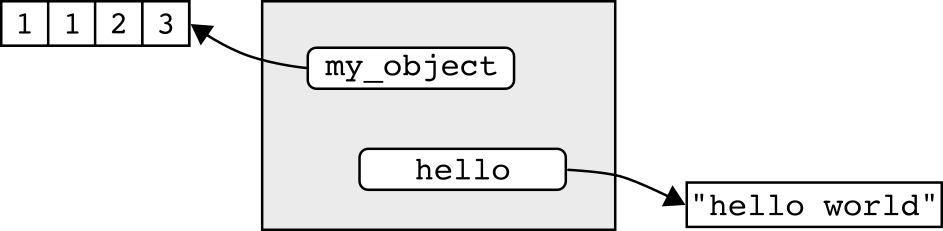
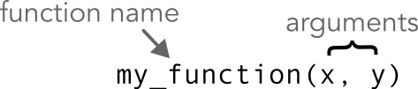
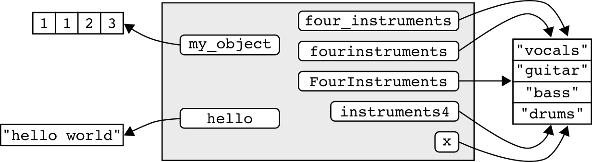
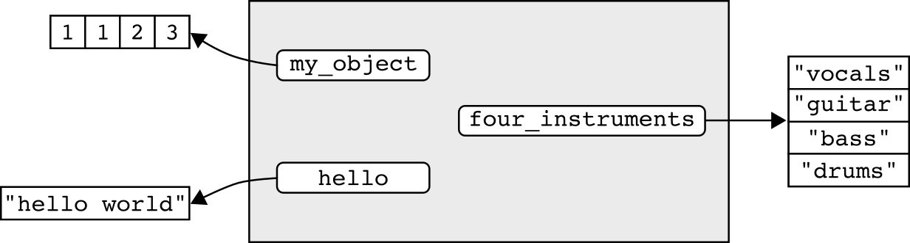
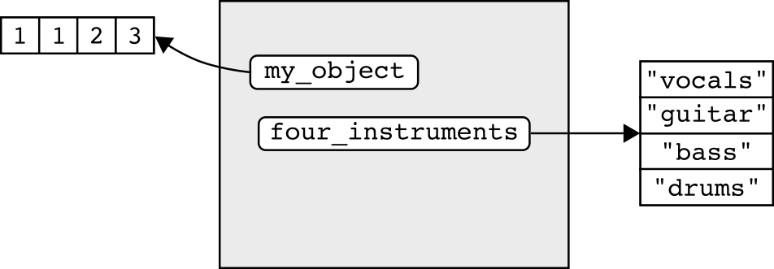

```{r}
#| include: false

source("src/r/course_functions.R")
```
```{r}
#| label: setup
#| include: false

library(webexercises)

knitr::opts_chunk$set(
  echo = TRUE,
  eval = TRUE,
  error = TRUE
)
```



<hr>

<div>

{.intro_image}

In the last lesson we installed R and RStudio and toured the RStudio IDE. Now we'll dig into the two concepts that everything else in this course builds on: the **environment**, where R keeps track of the names you've assigned, and **functions**, the building blocks of every task R performs. We'll close out with some best practices that will make your code easier to read (and easier to debug!) from the very start.

In this lesson, you will learn:

* What an environment is and how assignment (`<-`) works
* When quotation marks are (and are not) necessary
* How functions, arguments, and nested functions work
* How to install and load packages
* Best practices for commenting your code, naming your objects, and managing your global environment

[ Important!]{style="color: red;"} This lesson assumes that you have completed [Preliminary Lesson 1: R & RStudio](0.1_intro_to_r_and_rstudio.qmd){target="_blank"}. As the material covered herein will build on the content in that lesson, please do not proceed until its completion.

</div>

## Before you begin

To get the most out of this lesson, please:

* Open RStudio in a clean session;
* Open a new, blank script file and save it as "lesson_0.2.R";
* Code along with the content!

## 1. The environment

An **environment** is a data structure that associates a set of **names** (also called *keys* or *bindings*) with objects located in your computer's memory. R can use these names to retrieve the objects they are associated with.

<figure style="margin-bottom: 2em; text-align: center;">
  
  <figcaption style="font-size: 0.8em; font-style: italic; margin-top: 15px;">
    Adapted from <a
          href = "http://adv-r.had.co.nz/Environments.html"
          target="_blank">Advanced R</a>
    , Hadley Wickham
  </figcaption>
</figure>

In the diagram above, the "environment" (the gray box) associates names (white boxes with rounded edges) with data objects (white boxes with square edges). The objects stored are the numbers 1, 1, 2, and 3 and the phrase "hello world". Note that the environment does not contain the objects themselves -- it contains names that "point to" the objects. The objects are stored in your computer's memory.

::: mysecret
 [Names have objects; objects don't have names.]{style="font-size: 1.25em; padding-left: 0.5em;"}

-- Hadley Wickham
:::

### 1.1 Assignment

When you execute code in R, the objects returned are, by default, not stored by your system's memory. For example, run the following in your console pane:

::: now_you
```{webr}
"Hello world"
```
:::

My nerdy greeting existed for a moment, but just long enough to print the results. To use objects like this in the future, we need to ensure that the object can be maintained in our system's memory. One way to do so is to associate a name with the object. This is a process known as "**assignment**". We assign objects to our global environment with `<-`, which is a function called an **assignment operator**.

::: now_you
 [Working in the source pane]{style="font-size: 1.25em; padding-left: 0.5em;"}

1. Type `hello`;
2. Add an assignment operator with the keyboard shortcut [Alt + -]{style="font-family: monospace"} (Mac: [option + -]{style="font-family: monospace"});
4. Type `"hello world"` (with quotes);
5. Run the code with the keyboard shortcut [CTRL + Enter]{style="font-family: monospace"} (Mac: [&#8984; + Enter]{style="font-family: monospace"}).

Your code should look like:

```{webr}
#| autorun: true

hello <- "hello world"
```
:::

Have a look at the Environment tab of the workspace pane. You should notice that the name `hello` has been assigned to your global environment. We can use this name (`hello`) to retrieve the object ("hello world") from our system's memory.

::: now_you
 [Calling objects]{style="font-size: 1.25em; padding-left: 0.5em;"}

Type `hello` in your console pane and run it to see what it returns.
:::

::: mysecret
 [Watch how many names you have in your global environment!]{style="font-size: 1.25em; padding-left: 0.5em;"}

Warning! Be aware of how many names are in your global environment. Each name represents an object that is stored in your system's memory -- accumulation of objects can greatly reduce performance.
:::

### 1.2 On the use of "quotes"

In every one of our classes we are invariably asked why some words must be quoted and others do not. The environment is a good place to start with this common source of confusion.

Words (or even letters) do not require quotes if they can be found within their parent environment. For example, we assigned the name `hello` to the global environment above. Therefore, when we type and run `hello` in the console pane, the following is returned:

```{webr}
hello
```

Conversely, watch what happens when we type `my_object` into R:

```{r}
#| error: true

my_object
```

We get an error! That's because the name `my_object` is not assigned to an environment that R has access to (it will be!).

We can, however, wrap my_object in quotation marks and R will not return an error:

```{webr}
"my_object"
```

What gives? This behavior occurs because words inside of quotes are treated as a data object whereas a words outside of quotes are treated as a reference point (i.e., an assigned name).

::: mysecret
 [Single or double quotes?]{style="font-size: 1.25em; padding-left: 0.5em;"}

Single and double quotation marks can largely be used interchangeably for words or phrases. We'll learn best practices when using quotation marks in a later lesson.
:::

## 2. Functions

**Functions** are what data-wrangling guru Hadley Wickham calls the "fundamental building block of R". Functions are a special type of R object that contain instructions for executing a given task. You invoke a function any time you run R code.

For example, you actually used an R function when you ran `1 + 2`. The plus sign is a special type of R function called an **operator**. An operator is a function that is expressed as a symbol.

### 2.1 Using a named function

::: {.row}
When you download R you have access to thousands of functions. Most functions have names and users run them by providing (in order):

:::{.column style="width: 55%"}
1. The name of the function
2. An opening parentheses `(`
3. The argument(s) of the function
4. A closing parentheses `)`
:::

:::{.column style="width: 45%"}
{style="width: 100%; float: right; margin: 0px 0px 15px 10px;"}
:::
:::

The **name** of a function is a pointer that your computer uses to find the instructions to execute when running the function. The **parentheses** are an operator that provides an enclosing environment for a function's arguments and instructs R to execute the function. The **arguments** of a function determine what you want your function to evaluate (usually the data) and often the behavior of the evaluation. If the function you are using contains more than one argument, each argument is separated by a **comma** -- a comma is not a function but is instead a special character used exclusively for separating arguments in a function.

::: now_you
 [Copy-and-paste the code below into your console panel and run it:]{style="padding-left: 0.5em;"}

```{webr}
c(1, 1, 2, 3)
```
:::

In the above, `c` is the name of the R function used to combine multiple values into a single object. The arguments of this function are the values that we would like to combine. Each argument is separated by a comma. Note that, because the parentheses, `()`, is an operator, there are actually two functions in the above code!

::: mysecret
 [Space out your commas!]{style="font-size: 1.25em; padding-left: 0.5em;"}

When using commas to delineate a function's arguments, it's best practice to include a trailing (but not leading) space after each comma.
:::

If we wanted to use this object in the future, we can assign a name using the `<-` operator:

```{webr}
#| autorun: true

my_object <-
  c(1, 1, 2, 3)
```

*Note: The code now has three functions, the assignment operator, `<-`, the combine function `c`, and the parentheses operator, `()`.*

Probably the most important function in all of R is the `?` operator. We use `?` to show the help file for a given function in the viewer pane. The documentation includes a description of the function, how it is used, important details on its usage, the type of value returned, and even examples.

::: now_you
 [Getting help]{style="font-size: 1.25em; padding-left: 0.5em;"}

Copy-paste-and-run the code below in your console pane:

```{webr}
?c
```
:::

By running the `?` function above, we are provided with a description of the function, how it is used, the arguments of the function, a detailed description of considerations when using the function, and returned values. `?` will often return references to related functions and examples of the functions usage.

::: mysecret
 [Read the help files!]{style="font-size: 1.25em; padding-left: 0.5em;"}

It's *super important* to be able to read and understand R help files! When using an R function for the first time, be sure to read the help file for that function!
:::

### 2.2 Nested functions

Functions can be nested inside other functions. In other words, you can run a function from within another function. This can help us avoid making unnecessary assignments.

For example, we assigned our data object `c(1, 1, 2, 3)` to the name `my_object`. The function `mean` can be used to calculate the average of a set of values. Because R can use the name `my_object` to locate the data object from our system's memory, this could be written as:

```{webr}
mean(my_object)
```

Recall, however, the name is really just a reference point to the object. As such, the name associated with the object, `my_object`, can be used interchangeably with the code used to create it. In practice, this means that we can also calculate the mean of these values using:

```{webr}
mean(
  c(1, 1, 2, 3)
)
```

This is what's known as a **nested function** because `c()` is nested inside of the parentheses of `mean`. It's important to note the rather unfortunate order of operations here -- the function `c` must be evaluated prior to calculating the mean!

### 2.3 Arguments that modify a function's behavior

Many functions contain arguments in addition to the data object that you are evaluating. These arguments may modify the behavior of the function (*Note: Some arguments are necessary while some are optional*).

Let's look at what happens when we try to calculate the mean of set of values where one of the values is `NA` (unknown):

```{webr}
mean(
  c(5, 8, 13, NA)
)
```

If one of the values of a set are unknown, the value returned by `mean()` is also unknown by default. To address this we can use an argument that modifies the default behavior of the function.

The `mean` function contains an argument, `na.rm`, that tells R whether you want to remove `NA` prior to calculating the average (see `?mean`). We supply the additional argument after a comma:

```{webr}
mean(
  c(5, 8, 13, NA),
  na.rm = TRUE
)
```

::: mysecret
 [Be careful!]{style="font-size: 1.25em; padding-left: 0.5em;"}

* When functions contain more than one argument, placing each argument on its own line improves readability.
* Before you're familiar with a function and its applications, it's a good idea to read and re-read the function's documentation (`?`) to get a sense of its arguments and usage.
:::

::: now_you
 [Test your knowledge!]{style="padding-left: 0.5em;"}

1. What does the `na.rm = TRUE` argument do in `mean(c(5, 8, 13, NA), na.rm = TRUE)`?

`r longmcq(c(answer = "Removes the NA value before computing the mean", "Replaces NA with 0", "Returns NA because a value is missing", "Rounds the result to a whole number"))`

2. Parsons Problem: Reorder the lines below into a valid nested function call that calculates the mean of `c(5, 8, 13, NA)`, ignoring the missing value. One line doesn't belong -- leave it in the trash.

<div class="parsons-problem">
<div id="p-0-2-01-trash" class="sortable-code"></div>
<div id="p-0-2-01-sortable" class="sortable-code"></div>
<div style="clear: both;"></div>
<button id="p-0-2-01-check" class="parsons-btn parsons-btn-check" type="button">Check My Order</button>
<button id="p-0-2-01-reset" class="parsons-btn parsons-btn-reset" type="button">Shuffle Again</button>
<p id="p-0-2-01-feedback" class="parsons-feedback"></p>
</div>

<script>
window.parsonsProblems = window.parsonsProblems || [];
window.parsonsProblems.push({
  id: "p-0-2-01",
  maxDistractors: 1,
  code: "mean(\n  c(5, 8, 13, NA),\n  na.rm = TRUE\n)\n  na.rm = \"TRUE\" #distractor"
});
</script>
:::

### 2.4 Packages of functions

:::{.row}
{style="float:left; height: 11em; margin-top: 10px; padding-right: 15px;"}

Though R provides a huge set of functions that were pre-loaded when you downloaded R, there are countless numbers of functions that have been written by members of the R community and assembled into **packages** that you can download. Many of these community-built packages are very powerful and some are crucial to a modern workflow in R. The package we'll use the most in this class is the "tidyverse" package. It's actually a **metapackage** -- meaning it's a package comprised of other smaller packages. To download a package or packages, you use the function `install.packages`. This function evaluates the name of a package, in quotation marks, and installs it on your computer.
:::

::: now_you
 [Installing packages]{style="font-size: 1.25em; padding-left: 0.5em;"}

Please install the tidyverse metapackage:

```{r}
#| eval: false

install.packages("tidyverse")
```
:::

::: mysecret
 [Install packages from the console pane!]{style="font-size: 1.25em; padding-left: 0.5em;"}

Installing packages is not something you do every time you run a script in R. As such, package installation should occur in the Console pane.
:::

Once a package is installed on your computer, it is *almost* ready to use, but not quite. For example, the tidyverse metapackage contains the function `str_c` that can be used to combine two words. Can we use the function yet?

```{r}
#| error: true

str_c(
  c("Hello", "world"),
  collapse = " "
)
```

R couldn't find it! That's because we haven't provided a reference to the package. The location of the package on your computer is called a **library**. To use the package, we need to "go to the library" -- in other words, associate the library with our current R session. To do so, we use the function `library`. Installed libraries are defined, therefore quotes are not necessary when loading them.

::: now_you
 [Loading libraries]{style="font-size: 1.25em; padding-left: 0.5em;"}

Load the tidyverse metapackage, then run `str_c()` to combine "Hello" and "world" into a single value:

```{webr}
#| edit: true
#| min-lines: 5

library(tidyverse)

str_c(
  c("Hello", "world"),
  collapse = " "
)
```
:::

*Note: the practice boxes in these lessons run inside a browser-based R session that has tidyverse preloaded behind the scenes for performance reasons -- so `library(tidyverse)` above won't produce the usual startup messages you'll see the first time you run it for real in RStudio. Get in the habit of typing it anyway; in RStudio (and in every script you write from here on) it's a required step, not an optional one.*

*Note: The *`library` *function needs to be run each time a new R session is initiated. Because future lines of code may depend on the library or libraries loaded, loading should always occur in the source pane.*

::: mysecret
 [Watch out for the "package trap"!]{style="font-size: 1.25em; padding-left: 0.5em;"}

Warning! In the early stages of learning R, or even later if you have not spent much time learning the language, you will find yourself falling into what I call the "package trap". The package trap works like this:

1. You need to manipulate your data in some way that you are unfamiliar with
2. You visit Stack Overflow and, reading through the answers, find a package that will do what you want
3. You install and load the package and *potentially* move past the issue

*Why is this a problem?* Some of the packages you stumble on in this way will be critical to your current and future workflows -- most will not. This workflow turns scripts into a sloppy patchwork of packages. It can make your code very confusing to follow and lead to unseen errors (if the function does not do exactly what you perceive it should). If the issue can be solved with Base R or the packages you are currently working with, it will make your code more clear, help you avoid problems, and save you time in the future.
:::

::: now_you
 [Test your knowledge!]{style="padding-left: 0.5em;"}

1. True or false: `install.packages()` needs to be run only once per package and is best run in the console pane, whereas `library()` must be run in every new session and belongs in the source pane.

`r torf(TRUE)`

2. True or false: When loading an installed package with `library()`, the package name must be enclosed in quotation marks, exactly as it is for `install.packages()`.

`r torf(FALSE)`

3. Parsons Problem: Reorder the lines below into the correct install, load, use sequence. Two lines don't belong -- leave them in the trash.

<div class="parsons-problem">
<div id="p-0-2-02-trash" class="sortable-code"></div>
<div id="p-0-2-02-sortable" class="sortable-code"></div>
<div style="clear: both;"></div>
<button id="p-0-2-02-check" class="parsons-btn parsons-btn-check" type="button">Check My Order</button>
<button id="p-0-2-02-reset" class="parsons-btn parsons-btn-reset" type="button">Shuffle Again</button>
<p id="p-0-2-02-feedback" class="parsons-feedback"></p>
</div>

<script>
window.parsonsProblems = window.parsonsProblems || [];
window.parsonsProblems.push({
  id: "p-0-2-02",
  maxDistractors: 2,
  code: "install.packages(\"tidyverse\")\nlibrary(tidyverse)\nstr_c(c(\"Hello\", \"world\"), collapse = \" \")\ninstall.packages(tidyverse) #distractor\nlibrary(\"tidyverse\") #distractor"
});
</script>
:::

## 3. Best practices in R coding

Throughout this course, you'll learn a number of "best practices" that will make your code easier to read and limit some of the inevitable frustrations associated with coding in R.

### 3.1 Commenting code

It's important to provide descriptive content that communicates your code to your future self and others. This is known as commenting a script. In R, you add a comment using a hashtag, `#`. R will not evaluate any text entered after a hashtag.

::: now_you
 [Observe what happens when your run the following code with and without the preceding hashtag.]{style="padding-left: 0.5em;"}

```{webr}
#| edit: true
#| min-lines: 3

# 1 + 1 + 2

```
:::

#### 3.1.1 Comments should be simple and clear

Adding comments is a bit of an art form. You want your comments to be descriptive enough to communicate a process but short enough such that they don't contain unnecessary information.

Here's an example of a very descriptive, but unnecessarily detailed, comment:

```{webr}
# To practice adding numbers with the `+` function, I am
# adding the numbers 1, 2, and 3, with each number separated
# by `+`:

1 + 2 + 3
```

In the above, we can already see the values that are being added and that each number is separated by a `+` -- that makes those elements of the comment unnecessary. The comment can therefore be reduced to to:

```{webr}
# To practice adding numbers:

1 + 2 + 3
```

... and of course we probably don't need to know that the purpose of this line of code is "to practice". We can therefore simplify our comment to:

```{webr}
# Add numbers:

1 + 2 + 3
```

::: mysecret
 [Think about your audience!]{style="font-size: 1.25em; padding-left: 0.5em;"}

Take your target audience into consideration when commenting a script. If you are new to R or writing code for someone who is just starting out, your script should be full of comments that explain every potentially confusing process. When communicating to more advanced R users, you will likely need less commenting.
:::

#### 3.1.2 Comments should occur before executed code

Always add comments **before steps in a code** rather than on the same line. In other words ...

**Do not do this**:

```{webr}
1 + 2 + 3 # Add numbers
```

**Do this**:

```{webr}
# Add numbers:

1 + 2 + 3
```

::: mysecret
 [Format your comments consistently!]{style="font-size: 1.25em; padding-left: 0.5em;"}

Consistent formatting of comments really helps with the legibility of your scripts. It's best practice to:

* Include a blank line of space before and after your comment;
* Include one blank space between the hashtag and comment text.
:::

### 3.2 Naming conventions

There are a few important rules to consider when assigning names to your global environment.

#### 3.2.1 Assignments should be easy to remember!

It's important to assign names that convey meaning about the object. For example, let's define the instruments used in a rock band and assign the name `x` to the object:

```{webr}
#| autorun: true

x <-
  c(
    "vocals",
    "guitar",
    "bass",
    "drums"
  )
```

The assignment above isn't great if our global environment begins to accumulate a lot of names. Assignments such as this usually lead to a lot of time wasted ("*What did I call those instruments again?*").

#### 3.2.2 Assignments and numbers

In our hunt for a more communicative assignment, we might be tempted to start our assigned name with a number:

```{r}
#| error: true

4instruments <-
  c(
    "vocals",
    "guitar",
    "bass",
    "drums"
  )
```

We get an error above because assignments cannot start with numbers. They can, however, include numbers in other locations:

```{webr}
#| autorun: true

instruments4 <-
  c(
    "vocals",
    "guitar",
    "bass",
    "drums"
  )
```

#### 3.2.3 Assignments with two or more words

The name we assigned, `instruments4`, is perhaps not a great convention to describe this object. We want to limit the amount of thought that has to go into understanding what an assignment means. In this case, it's probably better to provide our number first and simply spell it out:

```{webr}
#| autorun: true

fourinstruments <-
  c(
    "vocals",
    "guitar",
    "bass",
    "drums"
  )
```

The name above still takes too much interpretation because it's difficult to see where one word stops and another begins. We might, therefore, be tempted to add a space between the words:

```{r}
#| error: true

four instruments <-
  c(
    "vocals",
    "guitar",
    "bass",
    "drums"
  )
```

Due to the space, we get an error message that there is an `unexpected symbol` in our assignment. This is because the space suggests that `four` and `instruments` refer to two separate objects.

To address our spacing issues, we must search for a different way to define the boundaries between words. There are three common conventions for this:

* PascalCase (sometimes called UpperCamelCase):

```{webr}
#| autorun: true

FourInstruments <-
  c(
    "vocals",
    "guitar",
    "bass",
    "drums"
  )
```

* camelCase (sometimes called lowerCamelCase)

```{webr}
#| autorun: true

fourInstruments <-
  c(
    "vocals",
    "guitar",
    "bass",
    "drums"
  )
```

* snake_case:

```{webr}
four_instruments <-
  c(
    "vocals",
    "guitar",
    "bass",
    "drums"
  )
```

Among the naming conventions above, snake_case has quickly become the convention because it is considered to be easier to read.

#### 3.2.4 Use all lowercase letters when assigning names

The use of snake_case also avoids the use of uppercase letters. By specifying your assigned names in all lowercase, you limit the amount of information you have to remember when retrieving your assigned objects.

::: mysecret
 [A naming convention to avoid]{style="font-size: 1.25em; padding-left: 0.5em;"}

A naming convection that I did not cover above is the use of a period to separate words (e.g., `four.instruments`). While this was a common convention at one time, it should be avoided at all costs, because a the use of `.` should be reserved for file extensions.
:::

::: now_you
 [Which object-naming convention does the course favor, and why?]{style="padding-left: 0.5em;"}

`r longmcq(c(answer = "snake_case, because it is considered the easiest to read", "PascalCase, because it is the shortest", "period.case, because periods clearly separate words", "camelCase, because it avoids underscores"))`
:::

### 3.3 Managing your global environment

Managing the assignments in your global environment helps you better organize your workflow and avoid performance issues due to memory limitations. In doing so, it's important to **maintain only the assignments that you'll need**. Let's take a moment to explore the names assigned to our global environment.

We can view these names with the function `ls()`:

```{webr}
ls()
```

*Note: Notice in the above that we didn't have to supply any arguments inside the parentheses? That's because the *`ls()` *searches within our global environment by default.*

We can see that our global environment currently contains a number of names. Here's a visualization of its current state of our R session:

{width="100%"}

Looks crazy right? One glaring issue that we might notice is that we have five different names assigned to the same data object. This reveals something special about how R uses assignments -- because the names point to the *same* data object, R is able to reduce the amount of data that must be stored in memory. That being said, this redundancy is not necessary.

::: now_you
 [True or false: Assigning two different names to the same set of values stores two independent copies of the data in memory, one for each name.]{style="padding-left: 0.5em;"}

`r torf(FALSE)`
:::

We can remove names from the global environment using the `rm()` function. Inside of the parentheses, we supply the names that we would like to remove, with each name separated by a comma.

```{webr}
#| autorun: true

rm(
  fourinstruments,
  FourInstruments,
  instruments4,
  fourInstruments,
  x
)
```

*Note: If you've been running the example code on your own computer, please run the code above on your own global environment as well!*

This yields a much more manageable global environment:

```{webr}
ls()
```

{width="100%"}

Though we've improved the organization of the global environment, we haven't really saved much in terms of memory allocation. That's because R only had to store the additional names of `four_instruments`, not copies of the data object itself. To save memory, we need to remove a name that is uniquely assigned to an object.

::: now_you
 [Use `rm()` to remove the assignment `hello` from our global environment.]{style="padding-left: 0.5em;"}

```{webr}
#| edit: true
#| min-lines: 3

```
:::

<button class="accordion" style="margin-bottom: 1em;">Solution</button>
::: panel

```{r}
rm(hello)
```
:::

::: now_you
 [List the current files in the global environment.]{style="padding-left: 0.5em;"}

```{webr}
#| edit: true
#| min-lines: 3

```
:::

<button class="accordion" style="margin-bottom: 1em;">Solution</button>
::: panel

```{r}
ls()
```
:::

By removing the assignment `hello` above, the data object "hello world" was left without a reference in the global environment. Because of this, the data will be automatically removed from memory (*Note: This process is known as garbage collection*).

{width="100%"}

::: mysecret
 [Some key rules regarding assignments]{style="font-size: 1.25em; padding-left: 0.5em;"}

* Only define an object if you truly want to use it in the future.
* Do not overwrite assignments (i.e., do not assign the same name to a modified version of an object)
* Do not assign names to multiple versions of the same object (e.g., `fourInstruments` and `four_instruments`).
:::

::: now_you
 [Parsons Problem: Reorder the lines below into the correct assign, retrieve, remove lifecycle for a name called `hello`. Two lines don't belong -- leave them in the trash.]{style="padding-left: 0.5em;"}

<div class="parsons-problem">
<div id="p-0-2-03-trash" class="sortable-code"></div>
<div id="p-0-2-03-sortable" class="sortable-code"></div>
<div style="clear: both;"></div>
<button id="p-0-2-03-check" class="parsons-btn parsons-btn-check" type="button">Check My Order</button>
<button id="p-0-2-03-reset" class="parsons-btn parsons-btn-reset" type="button">Shuffle Again</button>
<p id="p-0-2-03-feedback" class="parsons-feedback"></p>
</div>

<script>
window.parsonsProblems = window.parsonsProblems || [];
window.parsonsProblems.push({
  id: "p-0-2-03",
  maxDistractors: 2,
  code: "hello &lt;- \"hello world\"\nhello\nrm(hello)\nrm(\"hello\") #distractor\n\"hello world\" &lt;- hello #distractor"
});
</script>
:::

## 4. Exercises

::: now_you
 [Test your knowledge!]{style="padding-left: 0.5em;"}

1. Which of the following statements is TRUE?

`r longmcq(c("An operator is not a function", "All functions are follow by parentheses", answer = "An R function is a type of object", "The arguments of a function cannot include more than one data object"))`

2. Consider the following code, then answer the questions that follow:

```{webr}
my_values <-
  c(1, 1, 2)
```

3. TRUE/FALSE: Upon execution, this code stores the data object in the global environment.

`r torf(FALSE)`

4. How many functions are present in the above code?

`r longmcq(c("0", answer = "3", "1", "2"))`

5. TRUE/FALSE: The above code should be written in the source pane.

`r torf(TRUE)`
:::

## Take-home points

Here's the short version of what to carry forward from this lesson:

* An **environment** maps names to objects. Remember Hadley's line -- "names have objects; objects don't have names" -- so several names can point to the very same object, and R is smart enough not to duplicate that object in memory.
* Use the assignment operator `<-` to give an object a name so it sticks around in your global environment. Without assignment, an object exists just long enough to print and is then gone.
* Whether a word needs quotes depends on how you want R to treat it: a bare word is a reference (a name R looks up in the environment), while a quoted word is treated as plain data.
* A function is a **name plus parentheses plus comma-separated arguments** -- and don't forget the parentheses are themselves a function that tells R to run the thing. Get in the habit of reading a function's help file with `?` before you rely on it.
* Nested functions evaluate from the inside out, so the inner function (like `c()`) runs before the outer one (like `mean()`) ever sees its result.
* Many functions take extra arguments that change their behavior -- `na.rm = TRUE` in `mean()` is the classic example, telling R to drop missing values before computing.
* Install packages once with `install.packages()` (name in quotes, run from the console), but load them every session with `library()` (name unquoted, kept in your source pane). And watch out for the "package trap" -- don't collect a new package every time Stack Overflow suggests one.
* Comment your code on the line *before* the code, with one space after the `#`, and name your objects in snake_case: all lowercase, no spaces, never starting with a number, and save the `.` for file extensions.
* Keep your global environment tidy -- use `ls()` to see what's there and `rm()` to clear out names you no longer need. Once the last name pointing to an object is gone, garbage collection frees that object from memory.

## Reference

<button class="accordion">Glossary</button>
::: panel
* **Arguments**: The subject of an evaluation or condition that modifies a behavior of a function
* **Assignment**: The process of providing a name (binding) for an R object
* **Assignment operator**: A function used to assign an object to a name
* **Environment**: A data structure used to reference objects stored in memory
* **Function**: An R object that contains instructions for executing a given task
* **Library**: The location of a package on your computer
* **Metapackage**: A package that is comprised of more than one smaller packages
* **Names**: Reference points to objects stored in your system's memory. These may also be called "keys" or "bindings"
* **Nested function**: A function that is run inside of another function
* **Operator**: A function expressed that is expressed as a symbol and is not followed by parentheses.
* **Package**: A set of pre-written functions that can be downloaded (*note: There are also data packages!*)
:::

<button class="accordion">Functions</button>
::: panel
**Important!** Primitive functions as well as functions in the *base* and *graphics* packages are loaded by default when you start an R session.

::: function_table

```{r}
#| echo: false
#| message: false

render_function_table("functions_0.2_environment_and_functions.csv")
```

:::
:::

<button class="accordion">Keyboard shortcuts</button>
::: panel


:::

<button class="accordion">R Studio panes</button>
::: panel

:::
