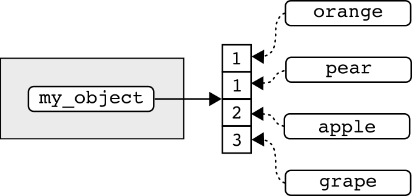
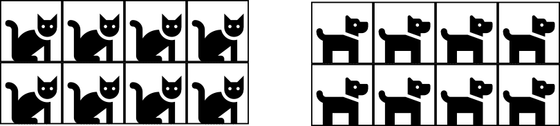
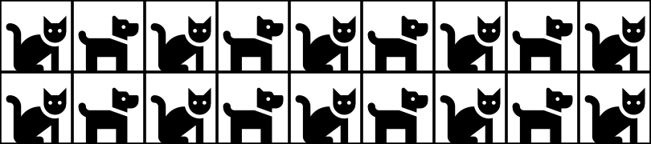



<hr>

<div>

{.intro_image}

Objects are containers that hold instructions for code execution, functions, values, or other objects. Recall that *everything that exists in R is an object* (John Chambers). Data within objects may be structured in different ways and these differences define when and how we work with them.

In this lesson we'll address what I will call "data objects", which I define here as containers used to organize values within an environment.

In this lesson, you will learn:

* The two traits -- dimensions and homogeneity -- that distinguish atomic vectors, matrices, lists, and data frames
* How to construct atomic vectors and describe, assign, and remove their attributes
* How to construct and describe matrices
* How to construct and describe lists, including how lists can be used to inform other functions
* How to construct data frames and tibbles
* How to read and write data objects with the *readr* package

[ Important!]{style="color: red;"} This lesson assumes that you have completed [Preliminary Lesson 3: Values](https://evansbrians.github.io/gis_2026/module_0/0.3_values/){target="_blank"}. The material here builds on that lesson, so please complete it before moving on.

</div>

## Before you begin

To get the most out of this lesson, please:

* Open RStudio in a clean session.
* Open a new, blank script file and save it as "lesson_0.4.R".
* Code along with the content.

## 1. Types of objects

The four data objects examined in this lesson can be compared by their conceptual dimensionality and whether their components must share an underlying type.

::: {style="width: 40%; margin-left: 0px"}
| Conceptual dimensions | Homogeneous   | Can be heterogeneous |
|:---------------------:|:-------------:|:--------------------:|
| 1-D                   | Atomic vector | List                 |
| 2-D                   | Matrix        | Data frame           |
:::

**Dimensions** describe the arrangement of values within an object:

* **One-dimensional** objects are also known as **vectors**, and their elements are accessed along a single axis.
* Data in **two-dimensional** objects are arranged as rows and columns.

**Homogeneity** describes whether an object's elements or components must share one underlying type:

* **Homogeneous** objects contain values of a single underlying type.
* Objects that **can be heterogeneous** may contain components with different types or classes.

*Note: Recall that an object's **type** describes how it is stored, while its **class** affects how R treats the object. An object's class may differ from its underlying type.*

::: now_you
 [Which data object is two-dimensional AND can contain columns with different underlying types?]{style="padding-left: 0.5em;"}

`r longmcq(c(answer = "Data frame", "Matrix", "Atomic vector", "List"))`
:::

## 2. Atomic vectors

An **atomic vector** is a **one-dimensional** collection of values (but recall that a single value is, by default, also an atomic vector). Values in an atomic vector are homogeneous -- all values must be of the same underlying type.

{style="width: 100%;"}

We've already learned how to create an atomic vector -- this is the type of object that we created using the combine function, `c()`:

```{webr}
#| autorun: true

my_object <-
  c(1, 1, 2, 3)
```

### 2.1 The structure of atomic vectors

The **structure** of an object describes the class of object, an object's dimensions, how the data are stored, and metadata that describe the object. In the previous lesson we used `class()` and `typeof()` to observe an object's class and type.

::: now_you
 [Determine the class and type of the atomic vector `my_object`.]{style="padding-left: 0.5em;"}

```{webr}
#| edit: true
#| min-lines: 5

```
:::

<button class="accordion" style="margin-bottom: 1em;">Solution</button>
::: panel

```{r}
#| eval: false

class(my_object)

typeof(my_object)
```
:::

We can use `length()` to determine the number of values that make up the atomic vector:

```{webr}
length(my_object)
```

#### 2.1.1 Attributes of atomic vectors

The **attributes** of an object provide information about the values (i.e., metadata) not contained in the values themselves. You can print the attributes of an object using the function `attributes()`:

```{webr}
attributes(my_object)
```

As we can see, atomic vectors do not have any attributes by default -- we have to add them. For example, a vector may have a `names` attribute that labels its elements. We can assign these labels using the `names()` function.

The argument of `names()` is the object whose element names we want to access or replace. In `names(my_object)`, R evaluates the name `my_object` to obtain the atomic vector. We then use the `<-` operator and provide a character vector of element names:

```{webr}
names(my_object) <-
  c(
    "orange",
    "pear",
    "apple",
    "grape"
  )
```

Conversely, we can also add names during the creation of an atomic vector using the `=` operator -- the same operator we use to name a function's arguments (here, each `name = value` pair is supplied as an argument to `c()`):

```{webr}
#| autorun: true

my_object <-
  c(
    orange = 1,
    pear = 1,
    apple = 2,
    grape = 3
  )
```

To view the names assigned to each value we can use `names()` to print the names attribute:

```{webr}
names(my_object)
```

... view the names with `attributes()`:

```{webr}
attributes(my_object)
```

... or view the names just by printing the object itself:

```{webr}
my_object
```

::: mysecret
 [What's in a name?]{style="font-size: 1.25em; padding-left: 0.5em;"}

We've previously addressed assignment as it relates to the global environment. A name bound in the global environment (e.g., `my_object`) is different from a name stored in an object's `names` attribute (e.g., `"apple"`, which labels the value 2 in `my_object`).

When a name is bound in the global environment, R can use that name to access the object:

```{r}
#| eval: false

my_object
```

Names assigned to a vector's elements are stored in the vector's `names` attribute -- they are not bindings in the global environment!

```{r}
#| error: true

apple
```

We might visualize this as:

{style="width: 100%;"}

In the above, the global environment (the gray box) contains the binding `my_object`. The vector and its `names` attribute are accessed through that binding; the element label `"apple"` is not itself a binding in the global environment. We'll learn how to use element names in our next preliminary lesson.
:::

We can remove the `names` attribute from an atomic vector by setting the attribute to `NULL`:

```{webr}
#| autorun: true

names(my_object) <- NULL

attributes(my_object)
```

The above might seem a little strange. Why can't you write `NULL <- names(my_object)`? The expression `names(my_object) <- NULL` uses the replacement form of `names()` to set the vector's `names` attribute to `NULL`, which removes the attribute. Reversing the expression instead attempts to assign a value to the constant `NULL`, which is not a valid assignment target.

Removing the `names` attribute leaves the vector's values unchanged:

```{webr}
my_object
```

### 2.2 Exercise

::: now_you
 [Test your atomic vector skills ... let's form a rock band! Without assigning a name to your global environment, generate a character vector with the values "vocals", "guitar", "bass", and "drums".]{style="padding-left: 0.5em;"}

```{webr}
#| edit: true
#| min-lines: 4

```
:::

<button class="accordion" style="margin-bottom: 1em;">Solution</button>
::: panel

```{r}
c(
  "vocals",
  "guitar",
  "bass",
  "drums"
)
```
:::

::: now_you
 [Repeat the above, using the `=` operator to assign band members to their instruments. Assign roger to vocals, pete to guitar, john to bass, and keith to drums.]{style="padding-left: 0.5em;"}

```{webr}
#| edit: true
#| min-lines: 4

```
:::

<button class="accordion" style="margin-bottom: 1em;">Solution</button>
::: panel

```{r}
c(
  roger = "vocals",
  pete = "guitar",
  john = "bass",
  keith = "drums"
)
```
:::

::: now_you
 [Repeat the above and print the attributes of the resulting object.]{style="padding-left: 0.5em;"}

```{webr}
#| edit: true
#| min-lines: 4

```
:::

<button class="accordion" style="margin-bottom: 1em;">Solution</button>
::: panel

```{r}
attributes(
  c(
    roger = "vocals",
    pete = "guitar",
    john = "bass",
    keith = "drums"
  )
)
```
:::

## 3. Matrix objects

A **matrix** is a vector with a two-element `dim` attribute that arranges its elements into rows and columns. In this course, we will construct matrices from atomic vectors, so the matrices that we use will be homogeneous. Base R can also create list matrices, but we will not use them in this course.

{style="width: 100%;"}

### 3.1 Constructing a matrix

You can use the function `matrix()` to create a matrix. This function contains the following arguments:

* `data = {vector}`: The vector you would like to convert to a matrix (we will use atomic vectors).
* `nrow = {number}`: The number of rows in the matrix (optional).
* `ncol = {number}`: The number of columns in the matrix (optional).
* `byrow = {logical}`: Whether the matrix is filled by column (FALSE, the default) or row (TRUE).

Let's start with the default options and convert `my_object` to a matrix (*Note: this is the same `my_object` that you worked with above*):

```{webr}
matrix(my_object)
```

This converted `my_object` to a two-dimensional object, a table with four rows and one column. The data are arranged in a single column.

If we want to change the dimensional structure of the data (i.e., number of rows or columns) we can explicitly set the number of rows or columns:

```{webr}
matrix(
  my_object,
  nrow = 1
)
```

By explicitly setting the number of rows to 1, the number of columns used to express the data was increased to 4. We could have also rearranged the data this way by setting the number of columns to 4:

```{webr}
matrix(
  my_object,
  ncol = 4
)
```

This makes `matrix()` a pretty smart function (you only need to set the number of rows *or* columns)!

There is rarely a need for a matrix with just a single column or row (atomic vectors are much easier to use)! Let's see what happens if we set the number of columns to 2:

```{webr}
matrix(
  my_object,
  ncol = 2
)
```

This restructured the data into a 2 x 2 square. Given the four values in `my_object` and the two columns requested with `ncol = 2`, `matrix()` determined that it needed two rows.

Notice the order of the values. They are filled column-wise by default -- from top to bottom. To understand how this works, watch what happens when we specify `byrow = TRUE`:

```{webr}
matrix(
  my_object,
  ncol = 2,
  byrow = TRUE
)
```

In the above, `matrix(..., byrow = TRUE)` filled in the values from left to right.

::: now_you
 [True or false: By default, `matrix()` fills its values row by row, completing the first row before moving to the next.]{style="padding-left: 0.5em;"}

`r torf(FALSE)`
:::

::: mysecret
 [Know your data!]{style="font-size: 1.25em; padding-left: 0.5em;"}

When building a matrix, it's super important to have a good sense of the data going in. For example, notice what happens when we generate a 4-column matrix with an atomic vector that contains only three values:

```{r}
matrix(
  c(
    "hello",
    "world",
    "howdy"
  ),
  ncol = 4
)
```

We can see that `matrix()` recycled the first value in the set! Thankfully, R also provided us with a warning message ( Always pay attention to warning messages!).
:::

### 3.2 The structure of matrices

#### 3.2.1 Matrix dimensions

We can evaluate the dimensional structure of the data using the functions `nrow()` and `ncol()`, which represent the number of rows and columns, respectively:

```{webr}
nrow(
  matrix(my_object)
)

ncol(
  matrix(my_object)
)
```

The function `dim()` will return the number of rows *and* columns:

```{webr}
dim(
  matrix(my_object)
)
```

This returned an integer vector with two values, where the first value is the number of rows and the second value is the number of columns.

We can use `length()` to determine the number of values in the matrix:

```{webr}
length(
  matrix(my_object)
)
```

#### 3.2.2 Matrix class and type

Recall that when we use the `class()` function, the class of object is returned:

```{webr}
class(
  matrix(my_object)
)
```

Here we see that the object is *both* a matrix and an array. An **array** is a more general term for a vector with a `dim` attribute; a matrix is specifically a two-dimensional array. Because this matrix was constructed from an atomic vector, it remains an atomic vector with attributes describing its dimensions.

```{webr}
attributes(
  matrix(my_object)
)
```

Because this matrix was constructed from an atomic vector, the function `typeof()` shows us the underlying type of its values:

```{webr}
typeof(
  matrix(my_object)
)
```

::: mysecret
 [Don't forget that matrices are homogeneous!]{style="font-size: 1.25em; padding-left: 0.5em;"}

Because the matrices that we use are constructed from atomic vectors, all their values must share a common type. When values of different types are combined, R coerces them to a common type. In the following example, the presence of a character value causes all the numeric values to be coerced to character:

```{r}
matrix(
  c(1, "one", 2, 3)
)
```

The above is still an atomic matrix, and therefore homogeneous, but the numeric values (`1`, `2`, and `3`) have been coerced to character!
:::

::: now_you
 [True or false: An atomic matrix can hold values of different underlying types in different columns, the way a data frame can.]{style="padding-left: 0.5em;"}

`r torf(FALSE)`
:::

#### 3.2.3 Row and column names of a matrix

We've seen that matrices have one attribute by default -- the dimensions of the matrix. Additional attributes, such as row and column names, can be added during matrix construction.

Let's generate a simple two-column matrix:

```{webr}
matrix(
  my_object,
  ncol = 2
)
```

We can assign names to rows after a matrix has been assigned with the `rownames()` function:

```{webr}
#| autorun: true

my_matrix <-
  matrix(
    my_object,
    ncol = 2
  )

rownames(my_matrix) <-
  c("a", "b")

my_matrix
```

... and assign column names with the `colnames()` function:

```{webr}
#| autorun: true

colnames(my_matrix) <-
  c("x", "y")

my_matrix
```

::: mysecret
 [Attributes are metadata!]{style="font-size: 1.25em; padding-left: 0.5em;"}

The row and column names that we added above haven't altered the data, they've altered attributes that describe the data!

```{r}
#| eval: false

attributes(my_matrix)
```
:::

### 3.3 Exercise

::: now_you
 [Test your matrix skills! The object `bunnies` is assigned to a numeric vector. Convert `bunnies` to a two-column matrix where the values are filled by row, save the object to memory by assigning the name `bunny_matrix` to the global environment, and assign the names "hello" and "world" to the columns of the matrix (*Note: To ensure that your code worked, call `bunny_matrix` after completing this problem*).]{style="padding-left: 0.5em;"}

```{webr}
#| autorun: true
#| edit: false

bunnies <-
  c(1, 1, 2, 3, 5, 8)
```

```{webr}
#| edit: true
#| min-lines: 8

```
:::

<button class="accordion" style="margin-bottom: 1em;">Solution</button>
::: panel

```{r}
#| eval: false

bunny_matrix <-
  matrix(
    bunnies,
    ncol = 2,
    byrow = TRUE
  )

colnames(bunny_matrix) <-
  c("hello", "world")

bunny_matrix
```
:::

::: now_you
 [Parsons Problem: Reorder the lines below to build `bunny_matrix` from `bunnies` (a two-column matrix filled by row), name its columns "hello" and "world", then print it. Two lines don't belong -- leave them in the trash.]{style="padding-left: 0.5em;"}

<div class="parsons-problem">
<div id="p-0-4-01-trash" class="sortable-code"></div>
<div id="p-0-4-01-sortable" class="sortable-code"></div>
<div style="clear: both;"></div>
<button id="p-0-4-01-check" class="parsons-btn parsons-btn-check" type="button">Check My Order</button>
<button id="p-0-4-01-reset" class="parsons-btn parsons-btn-reset" type="button">Shuffle Again</button>
<p id="p-0-4-01-feedback" class="parsons-feedback"></p>
</div>

<script>
window.parsonsProblems = window.parsonsProblems || [];
window.parsonsProblems.push({
  id: "p-0-4-01",
  maxDistractors: 2,
  code: "bunny_matrix &lt;-\n  matrix(\n    bunnies,\n    ncol = 2,\n    byrow = TRUE\n  )\ncolnames(bunny_matrix) &lt;-\n  c(\"hello\", \"world\")\nbunny_matrix\n    byrow = FALSE #distractor\nrownames(bunny_matrix) &lt;- c(\"hello\", \"world\") #distractor"
});
</script>
:::

## 4. List objects

A **list** is a one-dimensional object constructed by combining ANY objects with ANY dimensionality. Because of their flexibility, lists can be very powerful (and often challenging!).

{style="width: 100%;"}

### 4.1 Constructing a list

A list is created using `list()`. The arguments of the `list()` function are the items contained within the list. We can generate lists that contain:

A homogeneous list of values:

```{webr}
list(1, 1, 2, 3)
```

A heterogeneous list of values:

```{webr}
list(1, "one", 2)
```

A list of objects with different dimensions:

```{webr}
list(my_object, my_matrix)
```

As with all objects, we can access the data in the future if we assign a name to the list:

```{webr}
#| autorun: true

my_list <-
  list(my_object, my_matrix)
```

### 4.2 The structure of lists

Lists are vectors whose elements may be any R objects. A list can be homogeneous, but unlike an atomic vector, it can also contain elements with different types, classes, or dimensions. We can view the structure of list objects in a similar way to atomic vectors.

The class of a list and how the data are stored are both "list":

```{webr}
class(my_list)

typeof(my_list)
```

The function `length()` can be used to return the number of items in a list:

```{webr}
length(my_list)
```

Notice in the above that this returns the number of list items, not the number of values. For example, the list items of `my_list` are the objects `my_object` and `my_matrix`. Each object is composed of four values. There are currently eight values in the list, but the values are stored within two separate list items.

#### 4.2.1 Assigning names

Like atomic vectors, a list has no attributes by default:

```{webr}
attributes(my_list)
```

When we create a list, we can assign name attributes to the component objects using the `=` operator:

```{webr}
list(
  vector = my_object,
  matrix = my_matrix
)
```

With our list assigned to the global environment, we can assign names using the function `names()`:

```{webr}
#| autorun: true

names(my_list) <-
  c("vector", "matrix")
```

... or use `names()` to print the names assigned to each component object:

```{webr}
names(my_list)
```

### 4.3 List application: Object attributes

#### 4.3.1 Adding names to a matrix

Some function arguments accept lists to organize related inputs. For example, the `matrix()` function contains an optional `dimnames =` argument (the default is `NULL`). We supply the names in a list where the first list item is a character vector of row names and the second list item is a character vector of column names:

```{webr}
matrix(
  my_object,
  ncol = 2,
  dimnames =
    list(
      c("a", "b"),
      c("x", "y")
    )
)
```

If we wanted column names but no row names, we can set the row names to `NULL`:

```{webr}
matrix(
  my_object,
  ncol = 2,
  dimnames =
    list(
      NULL,
      c("x", "y")
    )
)
```

Likewise, if we wanted row names and no column names, we can set the column names to `NULL`:

```{webr}
matrix(
  my_object,
  ncol = 2,
  dimnames =
    list(
      c("a", "b"),
      NULL
    )
)
```

::: now_you
 [Parsons Problem: Reorder and nest the lines below into a call that turns `my_object` into a two-column matrix with row names "a", "b" and column names "x", "y". The two-item list must end up inside `dimnames =`, with row names first. One line doesn't belong -- leave it in the trash.]{style="padding-left: 0.5em;"}

<div class="parsons-problem">
<div id="p-0-4-02-trash" class="sortable-code"></div>
<div id="p-0-4-02-sortable" class="sortable-code"></div>
<div style="clear: both;"></div>
<button id="p-0-4-02-check" class="parsons-btn parsons-btn-check" type="button">Check My Order</button>
<button id="p-0-4-02-reset" class="parsons-btn parsons-btn-reset" type="button">Shuffle Again</button>
<p id="p-0-4-02-feedback" class="parsons-feedback"></p>
</div>

<script>
window.parsonsProblems = window.parsonsProblems || [];
window.parsonsProblems.push({
  id: "p-0-4-02",
  maxDistractors: 1,
  code: "matrix(\n  my_object,\n  ncol = 2,\n  dimnames =\n    list(\n      c(\"a\", \"b\"),\n      c(\"x\", \"y\")\n    )\n)\n  dimnames = c(\"a\", \"b\"), #distractor"
});
</script>
:::

::: mysecret
 [Avoid unnecessary functions!]{style="font-size: 1.25em; padding-left: 0.5em;"}

Defining the matrix names with a list is my preferred method. If we are aware of the arguments in the `matrix()` function, using `rownames()` or `colnames()` after a matrix has been created is rarely necessary. Moreover, introducing a new function into our code requires us to:

1. Find out the function exists (which can sometimes be challenging!)
2. Read the help documentation for the function to find out how to use it

My coding philosophy is that, for a given task, we should strive to code with as few functions as possible. Understanding the functions that we're using helps us achieve this goal.

 Read the documentation (`?function`) for every function you use!

{style="width: 100%;"}
:::

#### 4.3.2 Adding attributes to an existing matrix

We have thus far used `attributes()` to view the attributes of an object:

```{webr}
attributes(my_matrix)
```

We've seen the above before, but what sort of object is this?

```{webr}
class(
  attributes(my_matrix)
)
```

The attributes themselves are a list!

We can also use `attributes()` to assign attributes to an object. This is a very powerful and flexible method for adding informative metadata to an object! Be careful, though: assigning with `attributes()` **replaces the object's full attribute list** with the list that you provide. For the object to remain a matrix, our list must therefore include the `dim` attribute -- and any row or column names must be supplied as `dimnames`:

```{webr}
attributes(my_matrix) <-
  list(
    dim = c(2, 2),
    dimnames =
      list(
        NULL,
        c("hello", "world")
      ),
    author = "Brian",
    reason = "To show attribute lists"
  )

attributes(my_matrix)
```

::: mysecret
 [Replacement means replacement!]{style="font-size: 1.25em; padding-left: 0.5em;"}

Because `attributes()` assignment replaces the full attribute list, leaving an attribute out of the list *removes* it from the object. If we had omitted `dim` above, `my_matrix` would have stopped being a matrix altogether -- it would have been reduced to a plain atomic vector! When you assign attributes this way, always include the attributes that define the object's structure.
:::

::: now_you
 [Parsons Problem: Reorder the lines below to assign a `dim`, `author`, and `reason` attribute to `my_matrix` all at once via `attributes()<-` (keeping it a matrix!), then print the resulting attributes. Two lines don't belong -- leave them in the trash.]{style="padding-left: 0.5em;"}

<div class="parsons-problem">
<div id="p-0-4-03-trash" class="sortable-code"></div>
<div id="p-0-4-03-sortable" class="sortable-code"></div>
<div style="clear: both;"></div>
<button id="p-0-4-03-check" class="parsons-btn parsons-btn-check" type="button">Check My Order</button>
<button id="p-0-4-03-reset" class="parsons-btn parsons-btn-reset" type="button">Shuffle Again</button>
<p id="p-0-4-03-feedback" class="parsons-feedback"></p>
</div>

<script>
window.parsonsProblems = window.parsonsProblems || [];
window.parsonsProblems.push({
  id: "p-0-4-03",
  maxDistractors: 2,
  code: "attributes(my_matrix) &lt;-\n  list(\n    dim = c(2, 2),\n    author = \"Brian\",\n    reason = \"To show attribute lists\"\n  )\nattributes(my_matrix)\n    colnames = c(\"hello\", \"world\"), #distractor\nattributes(my_matrix) &lt;- c(\"hello\", \"world\") #distractor"
});
</script>
:::

### 4.4 Exercise

::: now_you
 [Test your list skills! Recall that we generated an atomic vector and assigned the name `my_object` to the data. Use the `attributes()` function and `list()` to assign the names "orange", "pear", "apple", and "grape" to the values in `my_object` (*Note: To ensure that your code worked, call `my_object` after completing this problem*).]{style="padding-left: 0.5em;"}

```{webr}
#| autorun: true
#| edit: false

my_object <-
  c(1, 1, 2, 3)
```

```{webr}
#| edit: true
#| min-lines: 8

```
:::

<button class="accordion" style="margin-bottom: 1em;">Solution</button>
::: panel

```{r}
#| eval: false

attributes(my_object) <-
  list(
    names =
      c(
        "orange",
        "pear",
        "apple",
        "grape"
      )
  )

my_object
```
:::

## 5. Data frames

A **data frame** is the object class that is most often used for storing data. Like a matrix, a data frame has two dimensions with data arranged into rows and columns. Unlike an atomic matrix, a data frame is a restrictive type of list whose columns can have different underlying types.

{style="width: 100%;"}

### 5.1 Constructing a data frame

In a finished data frame:

* Every column has the same number of rows.
* Each column is a vector (*almost* always an atomic vector).

When constructing a data frame, the supplied vectors should have compatible lengths. `data.frame()` can recycle a shorter atomic vector when its length divides the final number of rows exactly.

One method for arranging values into data frames is to use the `data.frame()` function. The arguments of this function are the vectors that make up the object (`data.frame({vector_1}, {vector_2})`):

```{webr}
data.frame(
  c(
    "hello",
    "hello",
    "world",
    "world"
  ),
  1:4
)
```

This created a data frame successfully, though the names are a bit of a mess. Because of that, let's head straight to the "attributes" section ...

### 5.2 The attributes of a data frame

As we have with the other objects, we can use `attributes()` to see important metadata about the object:

```{webr}
attributes(
  data.frame(
    c(
      "hello",
      "hello",
      "world",
      "world"
    ),
    1:4
  )
)
```

Here, we see that there are three sets of attributes associated with a data frame upon creation:

* A vector of names (albeit terrible ones)
* The class of the object
* A vector of row names

Why does `attributes()` return the class of a data frame? That's because a data frame *is* a list where the list items are arranged as columns -- this structure applied to the data is defined by the object's class.

We can verify this by looking at how the data are stored:

```{webr}
typeof(
  data.frame(
    c(
      "hello",
      "hello",
      "world",
      "world"
    ),
    1:4
  )
)
```

We get another clue into the true nature of a data frame as we start digging into the dimensions. First, let's look at the dimensions of the object:

```{webr}
dim(
  data.frame(
    c(
      "hello",
      "hello",
      "world",
      "world"
    ),
    1:4
  )
)
```

This returned an integer vector and the results are what we may have expected -- the data are arranged into four rows (the first value) and two columns (the second value). But watch what happens when we ask the `length` of the object:

```{webr}
length(
  data.frame(
    c(
      "hello",
      "hello",
      "world",
      "world"
    ),
    1:4
  )
)
```

Perhaps surprisingly, we see that the length of the data frame is 2! This value represents the number of list items in the data frame. Not to beleaguer the point but ... a data frame is a list!

::: now_you
 [Test your knowledge!]{style="padding-left: 0.5em;"}

1. For a data frame with 4 rows and 2 columns, what does `length()` return?

`r longmcq(c(answer = "2 -- the number of columns (list items)", "4 -- the number of rows", "8 -- the number of values", "1"))`

2. True or false: A data frame's underlying type, revealed by `typeof()`, is `"list"`, and `length()` of a data frame returns its number of columns (list items), not its number of rows.

`r torf(TRUE)`
:::

*Note: Like matrices, you can also use* `nrow()` *and* `ncol()` *to explore a data frame's dimensions.*

#### 5.2.1 Assigning names to a data frame

Finally! We can assign names to the list items that comprise a data frame during the construction of the object:

```{webr}
data.frame(
  greetings =
    c(
      "hello",
      "hello",
      "world",
      "world"
    ),
  numbers = 1:4
)
```

If a name for our data frame has been assigned to the global environment, we can use `names()` to assign names to the list items:

```{webr}
#| autorun: true

my_data_frame <-
  data.frame(
    c(
      "hello",
      "hello",
      "world",
      "world"
    ),
    1:4
  )

names(my_data_frame) <-
  c("hello", "world")

my_data_frame
```

Why do we not have to specify column names? Because a data frame is a list and each column is a list item, `names()` is associated with the columns of the object.

Similar to matrices, we can also assign names to the rows:

```{webr}
row.names(my_data_frame) <-
  c("a", "b", "c", "d")

my_data_frame
```

*I would caution against the above, however -- there's rarely a need for naming rows!*

We can assign names to columns and rows in a single step using `attributes()`. Recall from our matrix example that assigning with `attributes()` replaces *all* of an object's attributes -- for the object to remain a data frame, the list must include its `class` attribute:

```{webr}
#| autorun: true

attributes(my_data_frame) <-
  list(
    names = c("hello", "world"),
    class = "data.frame",
    row.names = c("a", "b", "c", "d")
  )

my_data_frame
```

**Note**: If you build a data frame from objects that have been assigned names in your global environment, `data.frame()` will use those object names as column names by default:

```{webr}
boy <- 1:4

howdy <- 5:8

data.frame(boy, howdy)
```

### 5.3 The tibble: A very special data frame

The tidyverse gives us access to a special kind of data frame called a **tibble**. Before we can use it, we need to load the package:

```{webr}
library(tidyverse)
```

*Note: As in Preliminary Lesson 2, the practice boxes in this lesson have the tidyverse pre-loaded behind the scenes, so the code above won't print the usual startup messages here. In RStudio, however, this step is required -- without it, the function below will not be found!*

The construction of a tibble is largely equivalent to that of a data frame (except we use the `tibble()` function):

```{webr}
#| autorun: true

my_tibble <-
  tibble(
    greetings =
      c(
        "hello",
        "hello",
        "world",
        "world"
      ),
    numbers = 1:4
  )
```

The magic of a tibble (or at least *part* of the magic of a tibble) is its informative printed output:

```{webr}
my_tibble
```

In the above, we can see the dimensions of the tibble (`a tibble: 4 x 2`), the abbreviation describing each column, and the data!

As useful as tibbles are, some functions require traditional data frames as an input. To address this we can use the `data.frame()` function:

```{webr}
data.frame(my_tibble)
```

Likewise, we can use `as_tibble()` to convert a traditional data frame to a tibble:

```{webr}
as_tibble(my_data_frame)
```

::: mysecret
 [Use tibbles!]{style="font-size: 1.25em; padding-left: 0.5em;"}

Because tibbles are so informative, I almost never use traditional data frames. I highly recommend making the tibble your default data frame.
:::

### 5.4 Exercise

::: now_you
 [A rock band data frame! Our rock band can be defined by the musicians and the instruments that they play. Use `tibble()` to generate a two-column data frame where the first column is the musician and the second column is their role in the band.]{style="padding-left: 0.5em;"}

```{webr}
#| autorun: true
#| edit: false

musicians <-
  c(
    "roger",
    "pete",
    "john",
    "keith"
  )

role <-
  c(
    "vocals",
    "guitar",
    "bass",
    "drums"
  )
```

```{webr}
#| edit: true
#| min-lines: 5

```
:::

<button class="accordion" style="margin-bottom: 1em;">Solution</button>
::: panel

```{r}
#| eval: false

tibble(musicians, role)
```
:::

## 6. Read & write objects

As a final step in our objects lesson, let's look at how we might read objects into R and save objects to our hard disk. For these tasks, I do not use base R functions. Instead, I primarily use the `readr` package, which is a part of the `tidyverse` metapackage.

We loaded the `tidyverse` package in the previous section, so the readr functions are ready to use (*Note: In a new R session, you would need to run `library(tidyverse)` again before these functions are available*).

### 6.1 Read and write atomic vectors

To read in an atomic vector we use `read_lines()` and supply the path to the file inside of the parentheses (*Note: This is an example only. You have not been given `my_object.txt` and the file path in the example is specific to my own folder structure.*):

```{r}
#| eval: false

read_lines("intro_material/data/my_object.txt")
```

To use the object, we need to assign a name to the object in our global environment:

```{r}
#| eval: false

my_object <-
  read_lines("intro_material/data/my_object.txt")
```

This produces a character vector with one value for each line in the file.

To write an atomic vector to your hard disk, use `write_lines()`. Here you supply the atomic vector and the path to the file:

```{r}
#| eval: false

write_lines(
  c(1, 1, 2, 3),
  "intro_material/data/my_object.txt"
)
```

... or the name assigned to the atomic vector and the path to the file:

```{r}
#| eval: false

write_lines(
  my_object,
  "intro_material/data/my_object.txt"
)
```

### 6.2 Read and write tabular data

To read in tabular data, we use `read_csv()` and supply the path to the file inside of the parentheses:

```{r}
#| eval: false

my_tibble <-
  read_csv("intro_material/data/my_tibble.csv")
```

This produces a tibble.

**Note**: "CSV" stands for comma-separated values. This is the preferred method for storing spreadsheet data because it is not platform-specific. When using Microsoft Excel, you can create a CSV file by using the "Save as ..." option.

To write a data frame to your hard disk, use `write_csv()`. Here you supply the data frame and the path to the file:

```{r}
#| eval: false

write_csv(
  tibble(musicians, role),
  "intro_material/data/my_tibble.csv"
)
```

... or the name assigned to the data frame and the path to the file:

```{r}
#| eval: false

write_csv(
  my_tibble,
  "intro_material/data/my_tibble.csv"
)
```

### 6.3 Read and write R objects

One of my favorite ways to read and write data is with RDS files, R's native format for serializing a single object. RDS files are incredibly useful because an object's class, type, and attributes are maintained.

We can read in any class of object using `read_rds()` by supplying the path to the file inside of the parentheses.

Read in an atomic vector:

```{r}
#| eval: false

my_object <-
  read_rds("intro_material/data/my_object.rds")
```

Read in a tibble:

```{r}
#| eval: false

my_tibble <-
  read_rds("intro_material/data/my_tibble.rds")
```

Of course, you have to save an RDS file to your hard disk before you can read it later. You can do so with the function `write_rds()`. Here you supply the object and the path to the file:

```{r}
#| eval: false

write_rds(
  tibble(musicians, role),
  "intro_material/data/my_tibble.rds"
)
```

... or the name assigned to the data frame and the path to the file:

```{r}
#| eval: false

write_rds(
  my_tibble,
  "intro_material/data/my_tibble.rds"
)
```

**Note**: A disadvantage of RDS files is that they are intended for use in R. That's not a problem if you have an all-R workflow, but might be an issue if you're working across multiple programs (e.g., Microsoft Excel and R) or collaborating with people who are not R users.

::: now_you
 [Which readr function saves an R object so that its class, type, and attributes are preserved when it is read back?]{style="padding-left: 0.5em;"}

`r longmcq(c(answer = "write_rds()", "write_csv()", "write_lines()", "save.image()"))`
:::

## Take-home points

Here are the big ideas to carry forward from our tour of data objects:

* The four data objects in this lesson can be compared by their **conceptual dimensions** and **homogeneity**. Atomic vectors are one-dimensional and homogeneous; the atomic matrices used in this course are two-dimensional and homogeneous; lists are one-dimensional and can be heterogeneous; and data frames are two-dimensional and can contain columns with different types.
* **Attributes** are metadata -- information about an object that isn't stored in the values themselves. Names are a common example, and adding or removing them (setting `names()` to `NULL`) changes the metadata, not the underlying data.
* The matrices used in this course are atomic vectors with a two-element `dim` attribute, which is why they are homogeneous. When values of different types are combined, R coerces them to a common type; if any value is character, the numeric values become character too.
* A matrix fills **column-wise by default** (top to bottom); set `byrow = TRUE` to fill left to right by row. If the supplied vector does not contain enough values to fill the requested shape, R recycles its values. It may warn when the data length is incompatible with the requested dimensions, so always read those warnings.
* A **list** is the most flexible container -- it can hold any objects of any dimensionality. Note that `length()` on a list counts the number of list items, not the total number of values tucked inside them.
* A **data frame** is really a restrictive type of list made of equal-length columns. That's why `typeof()` reports `"list"` and `length()` returns the number of columns, not the number of rows.
* Make the **tibble** your default data frame. Its informative printing shows you the dimensions and a compact type abbreviation for each column right away, which is why I almost never reach for a plain data frame.
* Read and write with *readr*: use `read_csv()`/`write_csv()` for portable, cross-program data, and `read_rds()`/`write_rds()` when you want an R-native file that preserves an object's class, type, and attributes.


