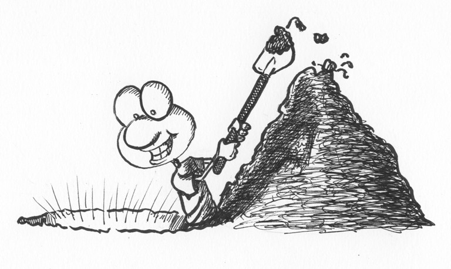
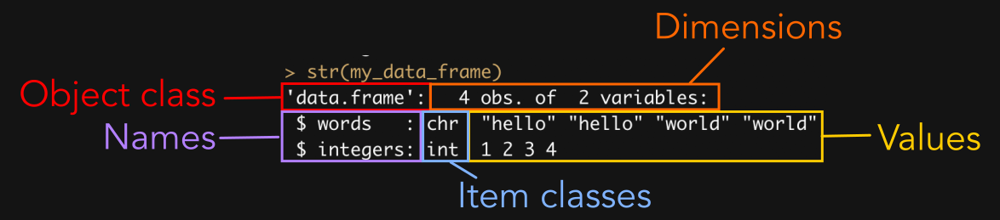
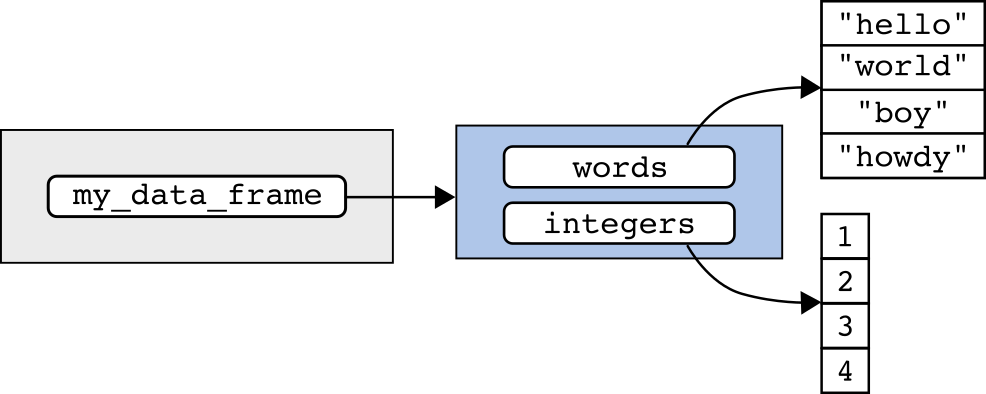



<hr>

<div>

{.intro_image}

A data object in R may contain one or multiple values. Depending on the type of object, these values may be atomic (as all values in atomic vectors and the atomic matrices used in this course must be) or may themselves be stored in more complex data objects (e.g., lists). When using or managing data, we often need to reduce a data object to just the component or components of interest. This process is known as **subsetting**.

A key trait of data objects is that their components are ordered -- in other words each of an object's components (e.g., values in an atomic vector) occupies a position within the object. In this lesson, we'll look at the foundational method of subsetting -- **indexing**. Indexing uses subscripts to extract or replace parts of an object by position, name, or logical condition. We'll also look at how to subset a data frame by condition -- a process called **filtering** -- using the tidyverse function `filter()`.

In this lesson, you will learn:

* How to extract single elements or structure-preserving subsets from atomic vectors, matrices, lists, and data frames using `[[...]]` and `[...]`
* The tidyverse alternative to `[[...]]` for single-element extraction, `pluck()`
* How to use name attributes and the `$` operator to extract data by name
* How to subset a vector by condition, and how to subset a data frame by condition using `filter()`

[ Important!]{style="color: red;"} This lesson assumes that you have completed [Preliminary Lesson 4: Objects](0.4_objects.qmd){target="_blank"}. The material here builds on that lesson, so please complete it before moving on.

</div>

## Before you begin

To get the most out of this lesson, please:

* Open RStudio in a clean session.
* Open a new, blank script file and save it as "lesson_0.5.R".
* Code along with the content.

## 1. Positions in an object

Before we can subset an object using indexing, it's important to consider how positions within an object are represented.

### 1.1 Atomic vectors

An atomic vector is a one-dimensional object where each value in the vector has a position. The position of a value in an object is known as its **index**. In an atomic vector, this may be denoted as `[i]`.

Let's create the object that we'll use throughout this lesson, `my_object`:

```{webr}
#| autorun: true

my_object <-
  c(1, 1, 2, 3)

my_object
```

The values and indices of `my_object` could be summarized as:

::: {style="width: 50%;"}
|  index     |  notation |  value  |
|:----------:|:---------:|:-------:|
| 1          | [1]       | 1       |
| 2          | [2]       | 1       |
| 3          | [3]       | 2       |
| 4          | [4]       | 3       |
:::

This would more succinctly yield the following table of indices and their associated values:

::: {style="width: 50%;"}
|  [1]  |  [2] |  [3]  |  [4]  |
|:-----:|:----:|:-----:|:-----:|
| 1     | 1    | 2     |   3   |
:::

### 1.2 Matrices

Recall that the matrices used in this course are atomic vectors with a `dim` attribute that arranges the data as rows and columns. Values in an atomic matrix have a row (`i`) and column (`j`) position, denoted by `[i, j]`. It may be useful for you to think of a value's position as `[row, column]`.

Let's create `my_matrix`:

```{webr}
#| autorun: true

my_matrix <-
  matrix(
    my_object,
    ncol = 2,
    dimnames =
      list(
        c("a", "b"),
        c("x", "y")
      )
  )

my_matrix
```

This matrix could be visualized as:

::: {style="width: 50%;"}
|          |  [, 1] | [, 2] |
|:--------:|:------:|:-----:|
| **[1, ]** |    1   |   2   |
| **[2, ]** |    1   |   3   |
:::

::: mysecret
 [Our matrices are still atomic vectors!]{style="font-size: 1.25em; padding-left: 0.5em;"}

Because the matrices used here are constructed from atomic vectors, each position in the underlying vector may also be described by `[i]`.
:::

### 1.3 Lists

A list is a vector where each item in the list can be an object of any class. A single list item can be extracted with `[[i]]`.

Let's create `my_list`:

```{webr}
#| autorun: true

my_list <-
  list(
    my_object,
    my_matrix
  )

my_list
```

The object `my_list` could also be visualized as:

<div class = "flex-container"
style="flex-direction: row; flex-wrap: wrap; justify-content: flex-start;">

<div style="display: flex;">
**[[1]]**
<div style="width: 40%; margin-left: 15px;">
|  [1]  |  [2] |  [3]  |  [4]  |
|:-----:|:----:|:-----:|:-----:|
| 1     | 1    | 2     |   3   |
</div>
</div>

<div style="display: flex;">
**[[2]]**
<div style="width: 40%; margin-left: 15px;">
|          |  [, 1] | [, 2] |
|:--------:|:------:|:-----:|
| **[1, ]** |    1   |   2   |
| **[2, ]** |    1   |   3   |
</div>
</div>
</div>

### 1.4 Data frames

Data frames are lists arranged into rows and columns. Each column represents a list item and each list item must be of the same length. Like matrices, values in a data frame have a row (`i`) and column (`j`) position, denoted by `[i, j]` (i.e., `[row, column]`).

Let's create `my_data_frame`:

```{webr}
#| autorun: true

my_data_frame <-
  data.frame(
    words =
      c(
        "hello",
        "hello",
        "world",
        "world"
      ),
    integers = 1:4
  )

my_data_frame
```

Because a data frame is two-dimensional (rows and columns), we might visualize `my_data_frame` as:

::: {style="width: 50%;"}
|          | [, 1]    | [, 2]    |
|:--------:|:--------:|:--------:|
| **[1, ]** | "hello"  | 1        |
| **[2, ]** | "hello"  | 2        |
| **[3, ]** | "world"  | 3        |
| **[4, ]** | "world"  | 4        |
:::

## 2. Indexing data by position

Square brackets (`[...]` and `[[...]]`) are operator functions used to extract parts of an object.

### 2.1 Extract individual values or list items

We use the double-square-bracket operator function (`[[...]]`) to extract exactly one element or component and simplify it from its surrounding container.

#### 2.1.1 One-dimensional objects

Recall the structure of `my_object`:

```{webr}
my_object
```

::: {style="width: 50%;"}
|  [1]  |  [2] |  [3]  |  [4]  |
|:-----:|:----:|:-----:|:-----:|
| 1     | 1    | 2     |   3   |
:::

To extract the value at position `i` of `my_object` we provide:

1. The name of the object
2. An opening double-square bracket, `[[`
3. The index of the value, `i`
4. A closing double-square bracket `]]`

For example, to extract the value at position 3, we would write:

```{webr}
my_object[[3]]
```

In plain English, you would read the above as "`my_object` *at* position 3" or "`my_object` *where* the position is three".

The above also works for list objects.

```{webr}
my_list
```

To extract the list item at position 2 of `my_list`:

```{webr}
my_list[[2]]
```

*Note: Square-bracket operators include both the opening and closing brackets. In this lesson, `[[...]]` represents the complete double-bracket operator function, as used in `my_list[[2]]`.*

#### 2.1.2 Two-dimensional objects

For two-dimensional objects (matrices and data frames), we can use the row and column position of the value. To do so, we provide:

1. The name of the object
2. An opening extraction operator, `[[`
3. The index of the row position, `i`
4. A comma (optimally followed by a space for readability)
5. The index of the column position, `j`
6. A closing extraction operator `]]`

Let's use `my_matrix` as an example:

```{webr}
my_matrix
```

To extract the value at the first row and second column of `my_matrix` we would conduct the following operation:

```{webr}
my_matrix[[1, 2]]
```

Likewise, to extract the value in the first row and second column of `my_data_frame`:

```{webr}
my_data_frame

my_data_frame[[1, 2]]
```

Because the matrices used in this course are atomic vectors with an additional `dim` attribute, we can also extract a value by its position in the underlying vector:

```{webr}
my_matrix[[4]]
```

Because *data frames are a type of list*, we can extract an individual list item in the same manner as any other list:

```{webr}
my_data_frame[[2]]
```

::: mysecret
 [Choose brackets based on the result you need!]{style="font-size: 1.25em; padding-left: 0.5em;"}

The double-bracket operator function `[[...]]` extracts exactly one element or component and simplifies the result from its surrounding container. The single-bracket operator function `[...]` creates a subset that generally preserves the surrounding structure, and it can select either one or multiple elements. For example, `my_data_frame[[1]]` returns the first column as a vector, while `my_data_frame[1]` returns a one-column data frame.
:::

#### 2.1.3 A tidyverse alternative: `pluck()`

The *purrr* package (a **core tidyverse** package) gives us another way to extract a single value or list item -- the function `pluck()`. To use it, we first need to load the tidyverse:

```{webr}
library(tidyverse)
```

*Note: As in the previous lessons, the practice boxes here have the tidyverse pre-loaded behind the scenes, so the code above won't print its usual startup messages. In RStudio, however, this step is required!*

Rather than wrapping the object in brackets, we supply the object as the first argument and the position as the second:

```{webr}
pluck(my_object, 3)

pluck(my_list, 2)
```

For the successful, single-level extractions shown here, this produces the same result as `[[...]]`. More generally, `pluck()` can extract through multiple levels and return a default value when an element is absent. You'll see `pluck()` used often later in this course, especially for pulling a single item out of a list (e.g., one table out of a list of related tables), so it's worth getting comfortable with both forms now.

::: mysecret
 [So which should I use, `[[...]]` or `pluck()`?]{style="font-size: 1.25em; padding-left: 0.5em;"}

Either is fine for the successful single-element extraction we're doing here -- I use `pluck()` most often when the extraction is one step in a longer sequence of tidyverse functions, and `[[...]]` most often when I'm working with an object on its own. We'll come back to this distinction, and to `pull()` (a close relative of `pluck()` for data frame columns specifically), when we cover subsetting data frames later in the course.
:::

### 2.2 Extract structure-preserving subsets

We use the single-square-bracket operator function (`[...]`) to create a subset that generally preserves the surrounding structure. The subset may contain one or multiple elements or components.

#### 2.2.1 One-dimensional objects

To extract a subset from a one-dimensional object, we provide:

1. The name of the object
2. An opening extraction operator, `[`
3. A numeric or integer vector of indices
4. A closing extraction operator `]`

For example, let's look again at the values in `my_object`:

```{webr}
my_object
```

If we want to extract the values at the first and second positions of the object, we can index the object with the integer vector `1:2`:

```{webr}
my_object[1:2]
```

If we want to extract the values at the first and third positions of the object, we can index the object with the numeric vector `c(1, 3)`:

```{webr}
my_object[c(1, 3)]
```

The above will work with atomic vectors *and* lists (although, given that `my_list` only contains two items, it's not super useful here):

```{webr}
my_list[1:2]
```

What would happen if we supply no index inside the square brackets?

```{webr}
my_object[]
```

It returns the whole vector! That's an important behavior. The index provided inside the square brackets represents the position or positions you would like to retain. By not specifying any indices, we are telling R that we want to return all of the values.

#### 2.2.2 Two-dimensional objects

For two-dimensional objects (matrices and data frames), we can use the row and column position of the value (`[i, j]`). To do so, we provide:

1. The name of the object
2. An opening extraction operator, `[`
3. A numeric or integer vector of indices for position `i` (rows)
4. A comma (optimally followed by a space for readability)
5. A numeric or integer vector of indices for position `j` (columns)
6. A closing extraction operator `]`

Let's use `my_data_frame` as an example:

```{webr}
my_data_frame
```

We can extract the second and third rows of the first column with:

```{webr}
my_data_frame[2:3, 1]
```

Empty values return all values for a given dimension (row or column). If neither `i` (row) nor `j` (column) indices are provided, all values are returned:

```{webr}
my_data_frame[, ]
```

If `i` (row) indices are left blank but `j` (column) indices are provided, all rows are returned for the specified column or columns:

```{webr}
my_data_frame[, 2]
```

*Note: With the two-dimensional form used above, `my_data_frame[, 2]` simplifies to the column vector because base data frames use `drop = TRUE` by default. In contrast, the list-style form `my_data_frame[2]` preserves a one-column data frame. Tibbles do not simplify in the two-dimensional form: `my_tibble[, 2]` remains a tibble.*

If `j` (column) indices are left blank but `i` (row) indices are provided, all columns are returned for the specified row or rows:

```{webr}
my_data_frame[2, ]
```

::: now_you
 [True or false: `[[...]]` extracts exactly one element or component and simplifies the result, while `[...]` creates a structure-preserving subset that may contain one or multiple elements.]{style="padding-left: 0.5em;"}

`r torf(TRUE)`
:::

### 2.3 Adding and modifying values with indexing

Indexing can also be used to assign new values to a dataset. For example, `my_list` contains the values associated with `my_object` and `my_matrix` but does not contain the values associated with `my_data_frame`.

We can add a new item to the list by assigning an object to a new index:

```{webr}
#| autorun: true

my_list[[3]] <- my_data_frame

my_list
```

We can also change the assigned values with indexing:

```{webr}
#| autorun: true

my_data_frame[, 1] <-
  c(
    "hello",
    "world",
    "hello",
    "world"
  )

my_data_frame
```

... or change *some* of the assigned values:

```{webr}
#| autorun: true

my_data_frame[3:4, 1] <-
  c(
    "boy",
    "howdy"
  )

my_data_frame
```

### 2.4 Digging deeper

::: {.row}
{style="float: left; margin: 0px 15px 5px 0px; width: 30%;"}

Because evaluating a name retrieves the object bound to that name, a name and the object it resolves to can often be used interchangeably within an expression. This will allow you to "tunnel in" to the value or values of interest without generating a lot of intermediate objects.

Recall that `my_object` is just a name assigned to the set of values created with `c(1, 1, 2, 3)`. As such, we can extract the values at the first and second indices of the vector using the name assigned to the object:
:::

```{webr}
my_object[1:2]
```

Or the function that created the vector of values:

```{webr}
c(1, 1, 2, 3)[1:2]
```

Likewise, this object is also the list item at position one of `my_list`:

```{webr}
my_list[[1]]
```

Because data stored in `my_object`, `c(1, 1, 2, 3)`, and `my_list[[1]]` are identical, this allows us to generate the same data subset with:

```{webr}
my_list[[1]][1:2]
```

## 3. Using name attributes

In the previous lesson on objects, we used the `names()` and `attributes()` functions to assign names to the individual elements or components of data objects. These names provide a handy method for extracting data!

### 3.1 Indexing with names

We can use indexing notation (e.g., `[i]` or `[i, j]`) to extract values from an object by name. Let's start by adding names to `my_object`:

```{webr}
#| autorun: true

names(my_object) <-
  c(
    "orange",
    "pear",
    "apple",
    "grape"
  )

my_object
```

To extract an element by name, we replace its numeric position with the name that labels it. For example, to extract the value from the third position of `my_object`, you could provide the number 3:

```{webr}
my_object[[3]]
```

... or, in quotes, the name associated with the third value:

```{webr}
my_object[["apple"]]
```

*Note: Quotes are necessary because `"apple"` is supplied as a literal character index. Without quotes, R would try to evaluate `apple` as the name of an object containing the index.*

`pluck()` (introduced above) works with names just the same way -- so `pluck(my_object, "apple")` is equivalent to `my_object[["apple"]]`:

```{webr}
pluck(my_object, "apple")
```

To index with multiple names, you provide a vector of names with `c()`:

```{webr}
my_object[c("apple", "grape")]
```

For two-dimensional data, this can be used in conjunction with numeric indices. Let's look again at `my_data_frame`:

```{webr}
my_data_frame
```

To extract the first and third values of the "words" column, we can supply the numeric vector of row indices before the comma and name of the column (in quotes) after the comma:

```{webr}
my_data_frame[c(1, 3), "words"]
```

### 3.2 The structure function

Before we dive deeper into the application of names, I'm going to introduce another function for observing the metadata associated with an object, the structure function `str()`:

```{webr}
str(my_data_frame)
```

Let's take a moment to marvel at what `str()` produced above:

{style="float: left; margin-bottom: 1em; width: 100%;"}

In one fell swoop, the `str()` function printed the class of the object, the number of items in each dimension, its names, the underlying types or classes of its components, and even some of their values (*Note: If there were many values, it would print only a subset of them*).

Notice that the names are preceded here by a dollar sign (`$`) ... we're about to use this to our benefit! But first ...

### 3.3 A recursive interlude

A list is a **recursive object** because each of its elements may itself be an R object. A data frame is recursive because it is a list of column vectors. Those columns are components of the data frame even when they do not contain further lists. Understanding recursive objects will help explain why `$` can extract components from lists and data frames.

Let's have another peek at our recursive object `my_data_frame`:

```{webr}
my_data_frame
```

We might visualize `my_data_frame` and its environment as:

{style="float: left; margin-bottom: 1em; width: 100%;"}

In the above, the global environment (gray box) contains a binding for the name `my_data_frame`. That binding resolves to a data-frame object (blue box) in memory. The data frame's `names` attribute labels its column components; those labels are not bindings in the global environment.

Recursive objects and environments both support access by name, but their structures differ. An environment contains bindings from names to objects and has reference semantics; a list contains elements whose optional `names` attribute supplies labels.

{style="float: left; margin-bottom: 1em; width: 100%;"}

You might be thinking to yourself that this journey into the weeds isn't very helpful, but ...

### 3.4 The dollar-sign operator function

For lists (including data frames), we can use the `$` operator function to extract a named component. Write the object name, `$`, and then the component name -- which is a column name for a data frame:

```{webr}
my_data_frame$words
```

Why don't we need quotation marks? The `$` operator treats the name on its right as a literal component name rather than evaluating it as an object. Thus, `my_data_frame$words` is approximately equivalent to `my_data_frame[["words", exact = FALSE]]`.

We can use the dollar-sign operator in conjunction with indexing notation to further subset the data:

```{webr}
my_data_frame$words[c(1, 4)]
```

... add an item to the list:

```{webr}
#| autorun: true

my_data_frame$bunnies <-
  c(1, 1, 2, 3)

my_data_frame
```

... replace an item in the list:

```{webr}
#| autorun: true

my_data_frame$bunnies <-
  c(5, 8, 14, 20)

my_data_frame
```

... or, when used in conjunction with `[i]`, modify components within a list item:

```{webr}
#| autorun: true

my_data_frame$bunnies[3:4] <-
  c(13, 21)

my_data_frame
```

::: now_you
 [Parsons Problem: Reorder the lines below to add a `bunnies` column to `my_data_frame`, then overwrite just its 3rd and 4th values. One line doesn't belong -- leave it in the trash.]{style="padding-left: 0.5em;"}

<div class="parsons-problem">
<div id="p-0-5-01-trash" class="sortable-code"></div>
<div id="p-0-5-01-sortable" class="sortable-code"></div>
<div style="clear: both;"></div>
<button id="p-0-5-01-check" class="parsons-btn parsons-btn-check" type="button">Check My Order</button>
<button id="p-0-5-01-reset" class="parsons-btn parsons-btn-reset" type="button">Shuffle Again</button>
<p id="p-0-5-01-feedback" class="parsons-feedback"></p>
</div>

<script>
window.parsonsProblems = window.parsonsProblems || [];
window.parsonsProblems.push({
  id: "p-0-5-01",
  maxDistractors: 1,
  code: "my_data_frame$bunnies &lt;-\n  c(1, 1, 2, 3)\nmy_data_frame$bunnies[3:4] &lt;-\n  c(13, 21)\nmy_data_frame\nmy_data_frame$bunnies &lt;-\n  c(13, 21) #distractor"
});
</script>
:::

#### What about atomic objects?

Can we use `$` with an atomic vector?

```{webr}
my_object$apple
```

How about a matrix?

```{webr}
my_matrix$y
```

In both cases, the answer is the same ... no! To see why, let's use `str()` to print the structure of `my_object`:

```{webr}
str(my_object)
```

Names in an atomic vector are stored as an attribute of the object -- just as they are in a list. The difference is that an atomic vector is not recursive: it contains values of one atomic type rather than component objects, and the `$` operator works with recursive objects such as lists and data frames. To extract a named value from an atomic vector, use `[[...]]` with a quoted character index.

::: now_you
 [Test your knowledge!]{style="padding-left: 0.5em;"}

1. True or false: The `$` operator can be used to extract a named value from an atomic vector, e.g., `my_object$apple`.

`r torf(FALSE)`

2. Why can you write `my_data_frame$words` without quotes, while `my_object[["apple"]]` requires them?

`r longmcq(c(answer = "$ treats the name on its right literally, whereas [[...]] requires a character index such as \"apple\"", "$ never needs quotes and [[...]] always does", "It is an arbitrary style choice", "Data frames cannot be indexed with quotes"))`
:::

## 4. Subsetting by condition

Our final task of this lesson will be to explore subsetting an object by condition -- a process often called **filtering**.

Filtering relies heavily on the logical operators that we learned in [Preliminary Lesson 3: Values](0.3_values.qmd){target="_blank"}:

| Operator |  Usage     |       Meaning                              |
|:--------:|:----------:|:------------------------------------------:|
| `==`     | `x == y`   | x is equal to y                            |
| `!=`     | `x != y`   | x is NOT equal to y                        |
| `!`      | `!(x)`     | NOT x                                      |
| `\|`     | `x \| y`   | x OR y                                     |
| `&`      | `x & y`    | x AND y                                    |
| `%in%`   | `x %in% y` | each value of x is found within y          |
| `<`      | `x < y`    | x is less than y                           |
| `<=`     | `x <= y`   | x is less than or equal to y               |
| `>`      | `x > y`    | x is greater than y                        |
| `>=`     | `x >= y`   | x is greater than or equal to y            |

### 4.1 Filtering a vector by condition

Let's review `my_object`:

```{webr}
my_object
```

We see that the object has four values. The first two values are equal to one and the last two are greater than one. We can test this directly using logic:

```{webr}
my_object > 1
```

The third and fourth values evaluate to `TRUE` because they are greater than one. We can extract the indices where this is the case using the function `which()` -- we provide the logical test inside the parentheses:

```{webr}
which(my_object > 1)
```

Armed with this knowledge, we *could* subset `my_object` to this vector of positions:

```{webr}
my_object[3:4]
```

But notice that `which()` already returns a vector of positions:

```{webr}
class(
  which(my_object > 1)
)
```

As such, writing in the indices by hand is unnecessary. Instead, we might subset the data using:

```{webr}
my_object[which(my_object > 1)]
```

Explicitly calling `which()`, however, is rarely necessary. When a logical test is supplied inside `[...]`, the extract operator returns the values at positions that evaluate to `TRUE`. Therefore, the above could be more simply written as:

```{webr}
my_object[my_object > 1]
```

*Important: The statement above assumes that the condition contains only `TRUE` and `FALSE`. If the condition contains `NA`, base R's `[...]` preserves the unknown position as `NA`, whereas `which()` omits `NA` positions. The tidyverse `filter()` function, introduced next, drops rows when its condition evaluates to `NA`.*

Because of this behavior, I like to think of `[...]` as representing the word "where". In the above we are extracting values from `my_object` where the values are greater than 1.

*Note: `filter()`, which we turn to next, is built specifically for data frames. When you need to subset a bare vector like `my_object`, the approach above is the way to go!*

::: now_you
 [Test your knowledge!]{style="padding-left: 0.5em;"}

1. True or false: To return the matching values when a logical test is placed inside `[...]` (e.g., `my_object[my_object > 1]`), you must wrap the test in `which()`.

`r torf(FALSE)`

2. Parsons Problem: Assemble the simplest way to subset `my_object` to values greater than 1. One line is an unneeded extra step that produces the identical result -- leave it in the trash.

<div class="parsons-problem">
<div id="p-0-5-02-trash" class="sortable-code"></div>
<div id="p-0-5-02-sortable" class="sortable-code"></div>
<div style="clear: both;"></div>
<button id="p-0-5-02-check" class="parsons-btn parsons-btn-check" type="button">Check My Order</button>
<button id="p-0-5-02-reset" class="parsons-btn parsons-btn-reset" type="button">Shuffle Again</button>
<p id="p-0-5-02-feedback" class="parsons-feedback"></p>
</div>

<script>
window.parsonsProblems = window.parsonsProblems || [];
window.parsonsProblems.push({
  id: "p-0-5-02",
  maxDistractors: 1,
  code: "my_object[my_object &gt; 1]\nmy_object[which(my_object &gt; 1)] #distractor"
});
</script>
:::

### 4.2 Filtering a data frame by condition: `filter()`

Vectors are one-dimensional, so `[...]` only has one job to do -- decide which *values* to keep. A data frame is two-dimensional, so `[...]` suddenly has to juggle two jobs at once (which *rows*? which *columns*?) using nothing but the position of your logical test relative to a comma. That's a lot to track, and it's the single biggest source of indexing frustration I see in this course.

Instead, we're going to use the tidyverse function `filter()`, from the *dplyr* package (a **core tidyverse** package), to subset the *rows* of a data frame by condition. `filter()` takes the data frame as its first argument and a logical test as its second -- no brackets, no comma, no dimensions to keep straight:

```{webr}
filter(my_data_frame, bunnies < 10)
```

Notice that we simply wrote `bunnies`, not `my_data_frame$bunnies` or `my_data_frame[, "bunnies"]` -- `filter()` already knows to look for `bunnies` *inside* `my_data_frame`, so there's no need to tell it twice.

::: now_you
 [Which tidyverse function subsets the ROWS of a data frame by condition?]{style="padding-left: 0.5em;"}

`r longmcq(c(answer = "filter()", "pluck()", "which()", "select()"))`
:::

We can filter on a character column the same way:

```{webr}
filter(my_data_frame, words == "hello")
```

**Filtering by more than one condition:** Separate each condition with a comma. Below, I filter `my_data_frame` to rows where `bunnies` is greater than 5 *and* `words` is "world":

```{webr}
filter(
  my_data_frame,
  bunnies > 5,
  words == "world"
)
```

::: mysecret
 [What does this look like in base R?]{style="font-size: 1.25em; padding-left: 0.5em;"}

You'll still encounter base R conditional indexing in other people's code (and, occasionally, in older tutorials or Stack Overflow answers), so it's worth recognizing it. Filtering `my_data_frame` to rows where `bunnies` is less than 10 with `[...]` looks like this:

```{r}
#| eval: false

my_data_frame[my_data_frame$bunnies < 10, ]
```

Two things trip students up almost every time they try this:

* The logical test must be able to run **in isolation**, outside of `[...]` -- `bunnies < 10` fails on its own because `bunnies` doesn't exist in the global environment, so you have to spell out `my_data_frame$bunnies < 10` (or an equivalent) instead.
* The condition has to go in the **row** position, *before* the comma. Put it after the comma (`my_data_frame[, my_data_frame$bunnies < 10]`) and R tries to use the logical vector to select *columns*. Depending on its values and length, this may select unintended columns or produce an error. In the current example, the condition is `TRUE, TRUE, FALSE, FALSE`, so R selects the first two columns rather than filtering rows.

`filter()` sidesteps both problems: there's no comma to place a condition around, and the condition is evaluated *inside* the data frame automatically, so you never have to write `my_data_frame$` (or `$` at all) inside it.
:::

::: now_you
 [In base R, `my_data_frame[my_data_frame$bunnies < 10, ]`, why must the condition be written as `my_data_frame$bunnies < 10` rather than just `bunnies < 10`?]{style="padding-left: 0.5em;"}

`r longmcq(c(answer = "The logical test must be able to run in isolation, and bunnies does not exist in the global environment", "Base R requires $ in every expression", "It forces column selection", "bunnies is a reserved word"))`
:::

::: mysecret
 [Filter with care!]{style="font-size: 1.25em; padding-left: 0.5em;"}

It's easy to make mistakes when you're exhausted and frantically coding a manuscript or the next chapter of your thesis. There are points in the coding process where a little warning light should go on -- filtering is one of those points. A bad filter can drastically alter your data and, especially because our data are often rather large, filtering mistakes can be hard to detect. Take your time when filtering and ensure that the filter you've applied does *exactly* what you'd hoped that it would. Generating smaller subsets of your data can be a great tool for testing your filter.
:::

## 5. Exercises

### Exercise

::: now_you
 [Use indexing to extract the value in the first row and first column of `my_data_frame`.]{style="padding-left: 0.5em;"}

```{webr}
#| edit: true
#| min-lines: 2

```
:::

<button class="accordion" style="margin-bottom: 1em;">Solution</button>
::: panel

```{r}
#| eval: false

my_data_frame[[1, 1]]
```
:::

### Exercise

::: now_you
 [Use indexing to extract the values in the first and third rows of the first column of `my_data_frame`.]{style="padding-left: 0.5em;"}

```{webr}
#| edit: true
#| min-lines: 2

```
:::

<button class="accordion" style="margin-bottom: 1em;">Solution</button>
::: panel

```{r}
#| eval: false

my_data_frame[c(1, 3), 1]
```
:::

### Exercise

::: now_you
 [Use `filter()` to subset `my_list[[3]]` (*Hint: You could also use `pluck()` to extract this list item!*) to rows where `words` contains the value "hello".]{style="padding-left: 0.5em;"}

```{webr}
#| edit: true
#| min-lines: 6

my_list[[3]] <-
  my_data_frame

# Modify the below:

my_list[[3]]
```
:::

<button class="accordion" style="margin-bottom: 1em;">Solution</button>
::: panel

```{r}
#| eval: false

my_list[[3]] <-
  my_data_frame

filter(
  pluck(my_list, 3),
  words == "hello"
)
```
:::

::: now_you
 [Test your knowledge!]{style="padding-left: 0.5em;"}

1. Parsons Problem: Reorder the lines below to assign `my_data_frame` into `my_list[[3]]`, then pluck it back out and filter it to rows where `words` is `"hello"`. One line doesn't belong -- leave it in the trash.

<div class="parsons-problem">
<div id="p-0-5-03-trash" class="sortable-code"></div>
<div id="p-0-5-03-sortable" class="sortable-code"></div>
<div style="clear: both;"></div>
<button id="p-0-5-03-check" class="parsons-btn parsons-btn-check" type="button">Check My Order</button>
<button id="p-0-5-03-reset" class="parsons-btn parsons-btn-reset" type="button">Shuffle Again</button>
<p id="p-0-5-03-feedback" class="parsons-feedback"></p>
</div>

<script>
window.parsonsProblems = window.parsonsProblems || [];
window.parsonsProblems.push({
  id: "p-0-5-03",
  maxDistractors: 1,
  code: "my_list[[3]] &lt;-\n  my_data_frame\nfilter(\n  pluck(my_list, 3),\n  words == \"hello\"\n)\n  my_list, #distractor"
});
</script>

2. Which of the following is TRUE about recursive data objects?

`r longmcq(c("The atomic matrix used in this lesson is a recursive object", answer = "A data frame is a type of recursive object", "Quotation marks must be used when calling names assigned within an object", "The values of recursive objects are stored within the object itself"))`
:::

## Take-home points

Here are the big ideas to carry with you from this lesson:

* The components of an object are **ordered by position**, and that position is called an **index**. In one-dimensional objects we notate a position as `[i]`; in two-dimensional objects (matrices and data frames) as `[i, j]`, which is always `[row, column]`.
* Use the **double-bracket operator function `[[...]]`** to extract exactly one element or component and simplify it from its surrounding container. Use the **single-bracket operator function `[...]`** to make a structure-preserving subset containing one or multiple elements.
* An **empty index** returns everything -- `my_object[]` hands back the whole vector, and a blank row or column position (`my_data_frame[, ]`) returns all of that dimension. The index tells R which positions you want, so leaving it blank means "all of them."
* For successful one-level extraction, tidyverse `pluck()` returns the same result as `[[...]]`. It can also extract through multiple levels and supply a default when an element is absent. Reach for it when extraction is one step in a longer tidyverse sequence, and `[[...]]` when you're working with an object on its own.
* You can index by **name** just as easily as by position. Supply the name as a quoted character index (e.g., `my_object[["apple"]]`) so R treats it as literal text rather than evaluating it as the name of another object.
* The **`$` operator function** treats the name on its right as a literal component name, so it extracts a list item or data-frame column **without quotes**. It does not work on atomic vectors or atomic matrices; use `[[...]]` with a quoted character index for those objects.
* Use **`str()`** to reveal an object's structure -- its class, dimensions, names, the types or classes of its components, and a peek at their values -- whenever you need to remind yourself what you're working with.
* A logical test placed inside `[...]` selects the `TRUE` positions, so wrapping a `TRUE`/`FALSE` test in `which()` is an unnecessary extra step. If the test contains `NA`, however, `[...]` preserves that unknown position as `NA`, while `which()` omits it. Think of `[...]` as the word "where": `my_object[my_object > 1]` reads as "the values of `my_object` where they're greater than 1."
* For data frames, prefer the tidyverse **`filter()`** to subset rows by condition. The condition is evaluated *inside* the data frame, so there's no `$` to write and no comma to place a condition around -- which neatly sidesteps the classic base-R `[ , ]` pitfalls.


