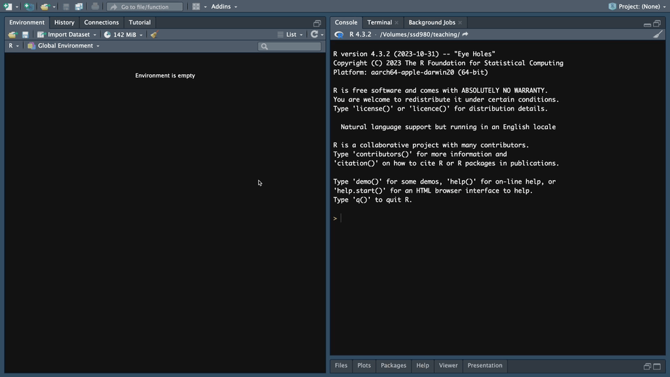
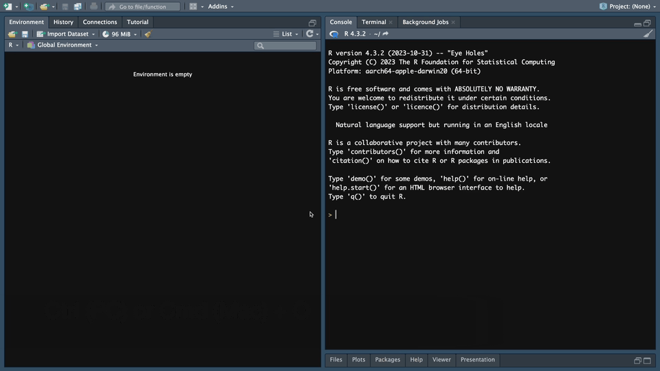
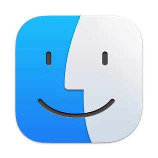
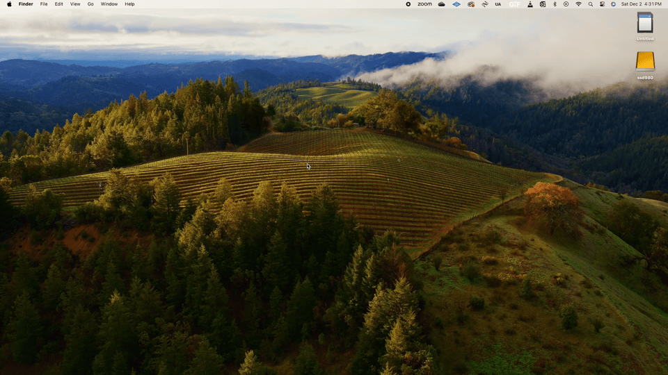
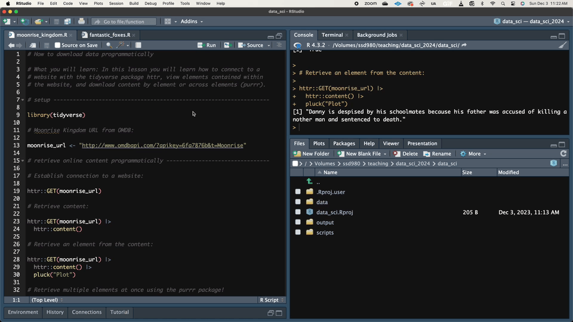
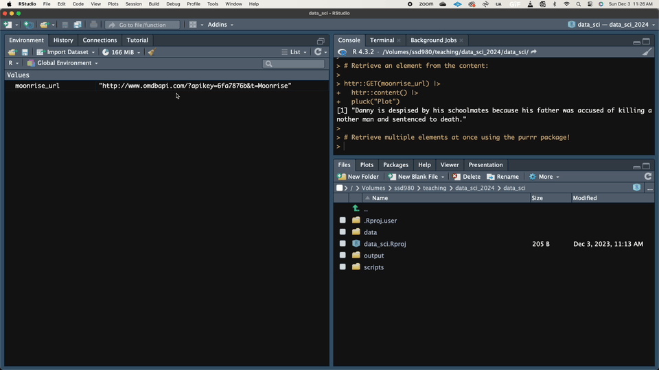
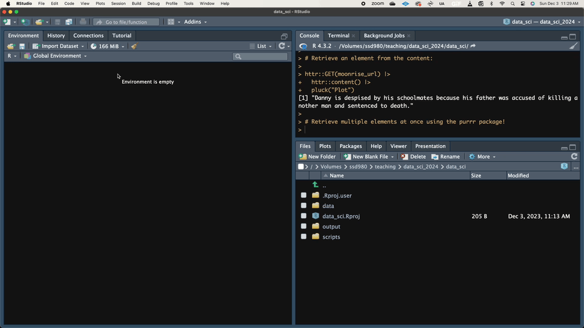

```{r, include = FALSE}
source("../../src/r/course_functions.R")
```
<hr>

<div>
{.intro_image}

All course modules will start with a *Before you begin* section. In these sections, you will download data and scripts required to complete the module, install any required packages, and take other necessary steps before diving into the material. Because we are just starting our journey, this "before you begin" section will be a bit more in-depth -- in this lesson, you will learn:

-   How to open an RStudio project;
-   Steps that you should take each time you initiate a session.

[ **Important!**]{style="color: red;"} This lesson assumes that you have completed [Preliminary Lesson 1: R & RStudio](../module_0/0.1_intro_to_r_and_rstudio.qmd){target="_blank"}, have set your global options as illustrated in that lesson, and are familiar with the concepts and terminology covered in its RStudio IDE section.

</div>

## Download content for Module 1

I have created an RStudio project for you. We will use the same project throughout most of the course. 

::: now_you
 [Please complete the following steps to set up your project for this course:]{style="padding-left: 0.5em;"}

1. **Download** the attached file "gis_in_r.zip". 
2. **Save** the file to a location on your computer that is: 
* Easy to find: For Windows users, I suggest saving the file to your Desktop. Mac users, I suggest saving the file to the top level of your user folder (this level can be accessed in Finder with Command+Shift+H). 
* Not in a folder with a space in the name: R abhors spaces in names (e.g., "My documents") -- and you should too!
* Not in a folder associated with cloud storage: Saving the project file in a cloud drive (e.g., OneDrive, Dropbox, or Google Drive) or a on drive that is backed up in the cloud (e.g., on Macs your desktop folder is backed up in iCloud by default) can introduce problems when executing code.
3. **Unzip** the file: As the extension "\*.zip" suggests, this is a compressed folder (i.e., "zipped"). Mac users can unzip the file just by double-clicking on the zipped folder. Windows users must *explicitly* unzip the file (e.g., with the free [7-Zip](https://www.7-zip.org/){target="_blank"} program).
:::

## Check your version of R and RStudio

R is the program that we will be writing in and running throughout this course and RStudio is an "Integrated Development Environment" -- the interface that we will be using for running program R. In other words, we will be writing R code (not RStudio code) and using RStudio as our medium for talking to R. It is important to recognize that these are two different programs. As such, we need to ensure that both programs are up-to-date before proceeding with course content.

::: now_you
 [Check your RStudio and R versions]{style="padding-left: 0.5em;"}

1. Please open RStudio.
2. **RStudio**: In the top menu bar, click on "Help/Check for Updates". If a new version is available, please go to [this link](https://posit.co/download/rstudio-desktop/){target="_blank"} and follow the website's instructions to download and install the latest version.
3. **R**: Please type `R.version.string` into your console pane and run the code. Go to [this link](https://www.r-project.org/){target="_blank"} to view the most current version of R. If the version information printed in your console differs from the current version listed on the website, please follow the website's instructions to download and install the latest version of R.
:::

*Note: It is considered to be best practice to check for RStudio and R updates at least once every three months. I try to regularly visit the R NEWS ([link](https://cran.r-project.org/doc/manuals/r-release/NEWS.html){target="_blank"}) and RStudio Workbench Release notes ([link](https://docs.posit.co/ide/news/){target="_blank"}) to read about any updates to the programs.*

## Your RStudio session

An R Studio **session** represents the time spent and operations conducted since opening R. The following steps should be followed each time you conduct an R session (each covered in some depth below):

1. Open your project: A session should always be initiated by opening a **project** in RStudio. 
2. Conduct housekeeping steps: Ensuring that you are working in a clean environment really helps!
3. Install packages (if necessary)
4. Add or open an R script -- because that's where the magic happens!

### 1. Open the RStudio project

A project is a folder that contains a collection of files (e.g., scripts, data, output) and sub-folders. The parent folder is designated as a project if it includes a [.Rproj]{style="font-family: monospace"} file. All content for this course will be stored in a project and all code will be executed from within this project.

::: now_you
 [Please open our course project using one of the four following methods.]{style="padding-left: 0.5em;"}
:::

[The project menu ()]{style="font-size: 1.5em"}


*Note: If you use this method, you can open a recent project by simply clicking on the name from the list of options at the bottom of the dropdown menu.*

1.  Open RStudio
2.  Click the blue square in the upper right of the window
3.  Navigate to "Open Project..."
4.  Navigate to your project in the window that opens
5.  Double-click on the [.Rproj]{style="font-family: monospace;"} file.

[The {style="height: 1.5em; width: auto; padding-right: 0.25em;"} file menu]{style="font-size: 1.5em"}



1.  Open RStudio
2.  In the top menu bar, click "File"
3.  Navigate to "Open Project..."
4.  Navigate to your project in the window that opens
5.  Double-click on the [.Rproj]{style="font-family: monospace;"} file.

[Using a keyboard shortcut]{style="font-size: 1.5em"}



1.  Open RStudio
2.  Hit the keyboard shortcut Control + O (Windows) or Command + O (Mac)
3.  Navigate to your project in the window that opens
4.  Double-click on the [.Rproj]{style="font-family: monospace;"} file.
5.  Hit enter on the following pop-up menu.

[Windows Explorer ({style="height: 1.25em; width: auto;"}) or Finder ({style="height: 1.25em; width: auto;"})]{style="font-size: 1.5em"}



1.  Open your system's file explorer (e.g. "Finder" on Macs)
2.  Navigate to your project in the window that opens
3.  Double-click on the [.Rproj]{style="font-family: monospace;"} file.

::: mysecret
 [Always work within a project!]{style="font-size: 1.25em; padding-left: 0.5em;"}

Please be sure to follow one of the steps above *every time* you open your project. When opening R Studio, have a look at the project icon on the upper-right hand corner of your screen -- if it says "Project: none" or is open to a different project, be sure to open the project before continuing.

Working in an RStudio project offers lots of advantages. These include (but are not limited to):

-   Your project folder is the root directory for reading and writing files. In other words, you read in files relative to their location within the project folder.
-   Projects ensure that your data and scripts are stored in one, easy-to-find, space.
-   Through sharing projects, rather than individual files, it is easy to generate reproducible scripts.
-   Projects provide you with the opportunity to use different versions of packages for various applications.

We will explore these advantages and more in coming lessons!
:::

### 2. Housekeeping steps

At the beginning of each session, I like to do a series of what I call "housekeeping steps". These include clearing any open scripts, any names assigned to your global environment, and your code history. Doing so helps you better organize your workflow, may reduce your computer's memory usage, and ensures that you can make the most out of RStudio's tools for managing your code and data during a session.

I *strongly* recommend following the steps below at the start of each session:

1.  If there are any script files open in your source pane. Close them. *Note: If any of your script titles are blue, you might want to save them prior to closing!*

{style="margin-left: 2em;" width="93%" height="auto"}

2.  In the *Environment* **tab** of your **workspace pane**, ensure that your **Global Environment** is empty. If it is not, click the *broom* to remove all objects.

{style="margin-left: 2em;" width="93%" height="auto"}

3.  In the *History* tab of your **workspace pane**, ensure that your history is empty. If it is not, click the *broom* to remove your history.

{style="margin-left: 2em;" width="93%" height="auto"}

By completing the steps above, your current session will always be dedicated, in its entirety, to the task at hand!

### 3. Install packages

An R package contains a series of functions (i.e., instructions) and sometimes data. When you **install** a package, the functions and data are downloaded to your computer. Packages are installed with the `install.packages` function -- when installing a single package, you simply supply the name of the package inside of quotes.

::: now_you
 [Install the *lobstr* package]{style="padding-left: 0.5em;"}

Copy-and-paste the code below into your console pane and run it to install the *lobstr* package:

```{r, eval=FALSE}
install.packages("lobstr")
```
:::

If you wish to install more than one package at a time, you must provide a character vector of package names to install. To do so, you use the function `c`, provide the name of each package in quotes, and separate each name with a comma:

::: now_you
 [Install multiple packages]{style="padding-left: 0.5em;"}

Copy-and-paste the code below into your console pane and run it to install the *janitor* and *arrow* packages:

```{r, eval=FALSE}
install.packages(
  c(
    "janitor", "arrow"
  )
)
```
:::

::: mysecret
 [Always install packages from the console pane!]{style="font-size: 1.25em; padding-left: 0.5em;"}

... or more to the point: **Do not install packages in R script files!**. Installing packages is a big move. Doing so in a script file should be avoided because:

* It does not need to happen every time you run a script;
* It can "break" the script if the your code relies on a previous package version;
* You might change your mind and decide that the package is not required for the script;
* If you share the script, you can override your collaborator's version of the package.
:::

*Note: When coding outside of this course, you will sometimes need to install packages during an R session (instead of before). That is completely acceptable ... just make sure to install them from your console pane!*

#### **Updating installed packages**

Because packages are often updated (e.g., fixing bugs), keeping your packages up-to-date is important. If you already have a package installed on your computer, installing that package again will typically update the packages to the most recent version.

For the packages in the tidyverse, things are a little different -- because *tidyverse* is a metapackage, simply re-installing *tidyverse* does not update all of the package. Instead, for tidyverse packages, we use the function `tidyverse_update`. This will check whether each of the packages in the tidyverse are up-to-date and provide you with an opportunity to update them.

::: now_you
 [Update the packages in the tidyverse]{style="padding-left: 0.5em;"}

```{r, eval = FALSE}
tidyverse_update()
```
:::

You can check to see if your packages are up-to-date in the Tools menu ("Tools/Check for Package Updates..."). If you find packages that require updates, you may either install the packages by following the prompts in the Tools menu or installing the package again in the console pane (my preference).

::: mysecret
 [Update your packages often!]{style="font-size: 1.25em; padding-left: 0.5em;"}

For packages that you use less than one day per week, I suggest checking for new versions at the beginning of each session. For packages that you use more often, it is considered best practice to check for updates at least once per week. 

To view potential changes to the package since your last installation, I strongly recommend reading the "NEWS" file associated with the package. The NEWS file typically shows any changes to the package across the history of the package -- this is known as a package's **version history**. To do so, we use the function `news` with the argument `package = ...` and the name of the package in quotes. 

For example, to view the version history of the *dplyr* package, run the following code:

```{r, eval=FALSE}
news(package = "dplyr")
```

*Note: Pay close attention to functions or arguments that have been deprecated or superseded, as these often suggest that significant improvements have been made and the functions or arguments should be avoided.*
:::

### 4. Add or open an R script

Most of the script files for this course will be provided for you.

**Open existing script files**: To open an existing R script file in your source pane, use the keyboard shortcut Ctrl+O (Windows or Mac) or Command+O (Mac). You *could* go to the top menu bar, then click on the "File" dropdown menu, then click on "Open File...", but that should really be avoided.

**Create a new script file**: To create a new script file, use the keyboard shortcut Ctrl+shift+N (Windows or Mac) or Command+shift+N (Mac).

::: mysecret
 [Use keyboard shortcuts!]{style="font-size: 1.25em; padding-left: 0.5em;"}

It is important to get your fingers to remember keyboard shortcuts like the above because it will save you loads of time in the long run! 
:::

## Reference

<button class="accordion">Glossary of terms (I am a button ... click me!)</button>
::: panel

::: glossary_table
```{r, message = FALSE, echo = FALSE}
library(tidyverse)

source("../../dev_scripts/glossary/glossary_source.R")

get_glossary_table_lesson(
  module = 1, 
  lesson = "1.2_getting_started.qmd"
) %>% 
  kableExtra::kable(
    align = c("c", "l")
  ) %>%
  kableExtra::kable_styling(
    font_size = 12,
    bootstrap_options = "hover")
```
:::
:::

<button class="accordion">Functions</button>
::: panel
**Important!** Primitive functions and functions in the *utils* packages are attached by default when you start an R session.

::: function_table

```{r, message = FALSE, echo = FALSE}
render_function_table("functions_1.2_getting_started.csv")
```

:::
:::


<button class="accordion">Keyboard shortcuts</button>
::: panel


:::

<button class="accordion">R Studio panes</button>
::: panel

:::

