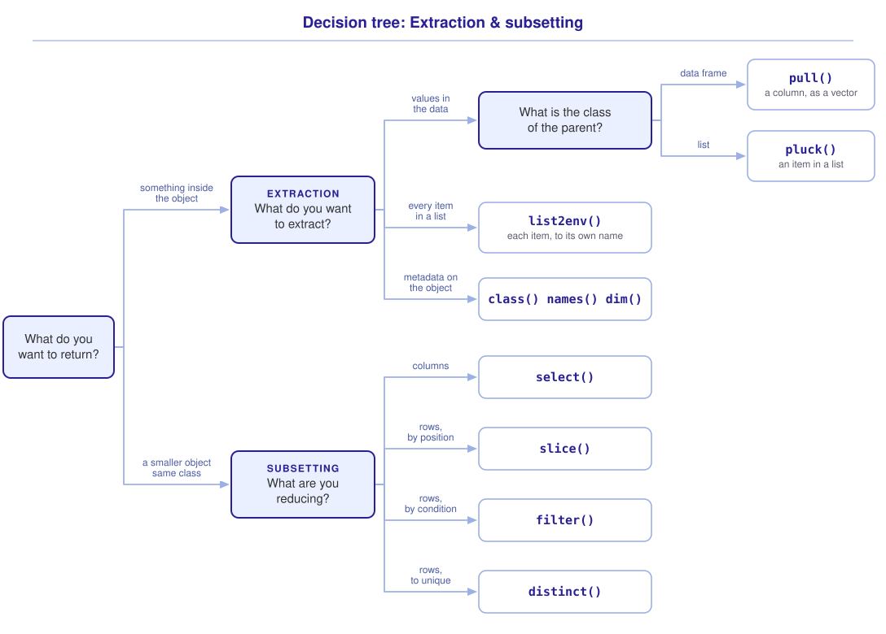

```{r}
#| include: false

library(webexercises)
library(tidyverse)

source("src/r/course_functions.R")
source("src/r/reference_lookup.R")

lesson_refs <- find_lesson_references()
```

<hr>

<div>
{.intro_image fig-alt="Course logo"}

Subsetting and extraction are almost certainly the most common things that we do when managing or exploring data. **Subsetting** describes the process of reducing the number of items in a list (including columns in a data frame!), rows in a data frame, or values in an atomic vector. **Extraction** describes the process of returning something held inside a parent object. Understanding the distinction between the two operations is often crucial as they can produce very different resultant objects. For example, subsetting a data frame to a single column returns a data frame that has one column, whereas extracting that same column returns the vector that was stored inside it.

We have previously used base R and the tidyverse to subset and extract data (see ***Preliminary Lesson 5: Indexing***). Now, we will more fully integrate (or even *embrace*) tidyverse code styling and functionality into our coding process! Much of this lesson will be a review of operations that you have already used (diving a bit more deeply) -- my goal here is to place all of our subsetting and extraction tools in one place. This should help you build a mental model for when each method is appropriate and which functions to turn to when applying these techniques.

In completing this lesson, you will learn to extract:

* Extract an item from a list with `pluck()`
* Extract a column from a data frame as a vector with `pull()`
* Bind every item in a list to a name of its own with `list2env()`
* Extract metadata with `class()` and `names()`

... and to subset:

* Subset columns by name with `select()`
* Change column names with `select()`
* Subset rows with the `slice()` family of functions
* Subset rows by condition with `filter()`
* Remove duplicate rows with `distinct()`

**Important!** Before starting this tutorial, be sure that you have completed all preliminary and previous lessons!

</div>

## Data for this lesson

<button class="accordion">Please click on the button below to explore the metadata for this lesson!</button>
::: panel
In this lesson, we will explore:

```{r}
#| echo: false
#| output: asis

lesson_metadata(
  .dataset = "district_birds.rds",
  .tables = c("birds", "captures", "visits")
) %>%
  cat()
```
:::

## Set up your session

Please complete the following to ensure that you are working in a clean session:

1. Please ensure that your **Global Environment** is empty.
2. In the *History* tab of your **workspace pane**, ensure that your **session history** is empty.

Now that we are working in a clean session:

1. Create a script file.
2. Save your script file as `scripts/subsetting_and_extraction.R`.
3. Add metadata as a comment on the top of the file.
4. Following your metadata, create a new **code section** and call it "`setup`".
5. Following your section header, attach the packages that comprise the **core tidyverse**.

At this point, your script should look something like:

```{r}
#| eval: false

# My code for the subsetting and extraction tutorial

# setup --------------------------------------------------------

library(tidyverse)
```

Now let's have *you* read in the data ...

::: now_you
 [Now you!]{style="font-size: 1.25em; padding-left: 0.5em;"}

Read in `"data/raw/district_birds.rds"` and assign the object to the name `bird_list`.

*Hint: This was covered in **1.4 Importing, exploring, and exporting data**.*

[Click here to see my answer]{.answer_link data-answer="a-2-1-setup-2"}

::: {.answer_body #a-2-1-setup-2}

```{r}
# Read in `district_birds.rds` and assign the object to the name `bird_list`:

bird_list <- read_rds("data/raw/district_birds.rds")
```

`read_rds()` reads the file at the path we supply, which R resolves from the working directory, and the `<-` operator (a function!) assigns the object to the name `bird_list`.

At this point, your script should resemble:

```{r}
#| eval: false

# My code for the subsetting and extraction tutorial

# setup --------------------------------------------------------

library(tidyverse)

# Read in `district_birds.rds` and assign the object to the name `bird_list`:

bird_list <- read_rds("data/raw/district_birds.rds")
```

:::
:::

## Extraction vs. subsetting

We have been using extraction and subsetting in this course since ***Preliminary Lesson 5: Indexing***, where the double-square-bracket operator function (`[[...]]`) returned the child object itself and the single-square-bracket operator function (`[...]`) returned a subset with the class of the parent. Those two operators are extraction and subsetting in their simplest form:

```{r}
# Extraction -- the tibble held in the list item:

bird_list[["birds"]]
```

```{r}
# Subsetting -- a list that holds one item:

bird_list["birds"]
```

Notice in the above that the `[[...]]` function returned a tibble whereas the `[...]` function returned a list that contained a tibble. This is extraction vs. subsetting in action!

## Extraction

**Extraction** returns something held inside a parent object: a child object, or information about the object itself.

### Extracting from a list

In ***Preliminary Lesson 5: Indexing***, we used `purrr::pluck()` to extract items from vectors by index. In this course, we will use `pluck()` as our primary tool for extracting an item from a list.

```{r}
bird_list %>%
  pluck("birds")
```

This is equivalent to using the `$` operator in base R:

```{r}
bird_list$birds
```

While the base R version is more parsimonious, I typically prefer using `pluck()` in all but the simplest of applications. This is because it separates an operation into easy-to-understand steps -- evaluating the name retrieves its associated object, and `pluck()` extracts the item of interest from that object. This helps make our code more communicable. We will learn the programmatic advantages of using `pluck()` in future lessons.

Each name that we supply specifies one level deeper, so a single call reaches the `common_name` column of the `birds` table from within the list:

```{r}
bird_list %>%
  pluck("birds", "common_name")
```

The above worked because a data frame is also a list (***Preliminary Lesson 4: Objects***) -- each column is a list item that can be extracted with `pluck()`.

*Note: When we address a list item by name, `pluck()` requires that name as a character value, so quotes are necessary. It will also accept a position, as we used it in **Preliminary Lesson 5: Indexing**, but a name survives a change in the order of the list.*

### Extracting from a data frame

If the **parent** object is a data frame, we can use the *dplyr* function `pull()` to extract a vector. We supply the following arguments:

* The target data frame (typically passed to the function via a pipe)
* The column that we would like to extract

We can extract `common_name` from `"birds"` in `bird_list` using:

```{r}
bird_list %>%
  pluck("birds") %>%
  pull(common_name)
```

This is equivalent to:

```{r}
#| eval: false

bird_list %>%
  pluck("birds") %>%
  .$common_name
```

I prefer `pull()` to `$` because it names the operation, and because the placeholder can make the code more challenging to interpret.

The above, of course, is also equivalent to:

```{r}
#| eval: false

bird_list %>%
  pluck("birds", "common_name")
```

I prefer the version that uses `pull()` because, in the above, `pluck()` is collapsing two different extraction operations into a single step.

When extracting from a data frame column, I recommend choosing `pull()`. This enhances your code's readability, in part because it makes it clear that the parent object is a data frame.

Note that `pull()` works on **data frames** and **tibbles**. Using it on a list generates an error:

```{r}
#| error: true

bird_list %>%
  pull(birds)
```

::: mysecret

 [Why does one function need quotation marks and the other does not?]{style="font-size: 1.25em; padding-left: 0.5em;"}

In ***Preliminary Lesson 2: Environment & Functions***, we saw that R evaluates an unquoted name by searching the accessible environments for a binding associated with that name, while a quoted character value is returned directly. This is referred to as **standard evaluation** and is the mechanism that `purrr::pluck()` uses for extraction.

If we were to run `pluck(bird_list, birds)`, R would search for a binding named `birds`, and there is none. This is because a list's item names are stored in its `names` attribute, not as bindings in the global environment (***Preliminary Lesson 4: Objects***). The quoted name gives `pluck()` a character value to match against those attribute names.

`pull()` also captures the name rather than evaluating it, then matches `common_name` against the column names of the data frame it was given. This is **tidy selection**. Other tidyverse functions use related mechanisms. `select()` also uses tidy selection, while `filter()` and `mutate()` use **data masking**, and all of them resolve a bare name against the data rather than against your global environment.

:::

### Extraction while reading in data

An `*.rds` file is a handy way to pass lists across R sessions, but we are often interested in working with list items rather than the list object itself. We can bind each item to a name of its own in the global environment using the base R function `list2env()`. It performs the extraction above once per item, taking each name from the list's `names` attribute and binding it to the item stored there. We supply the following arguments:

* The list (typically passed to the function via a pipe)
* The environment in which to create the bindings (`envir = `)

```{r}
#| results: hide

# Bind each list item to a name in the global environment:

bird_list %>%
  list2env(envir = .GlobalEnv)
```

*Note: `.GlobalEnv` is R's name for the global environment (see **Preliminary Lesson 2: Environment & Functions**). Take care -- if a name in the list is already bound to something in your global environment, `list2env()` replaces it.*

We will not be using `bird_list`, `counts`, or `sites` again, so let's have you remove those names from the global environment.

::: now_you
 [Now you!]{style="font-size: 1.25em; padding-left: 0.5em;"}

1. Remove the names `bird_list`, `counts`, and `sites` from your global environment.

   *Hint: We removed names from the global environment in **Preliminary Lesson 2: Environment & Functions**.*

   [Click here to see my answer]{.answer_link data-answer="a-2-1-rm"}

   ::: {.answer_body #a-2-1-rm}

   ```{r}
   # Remove `bird_list`, `counts`, and `sites` from the global environment:

   rm(
     bird_list,
     counts,
     sites
   )
   ```

   `rm()` takes the names themselves, unquoted, and we can remove multiple names with a single call to the function.

   :::

2. Why is it *not* necessary to quote the names that you pass to `rm()`?

   *Hint: We distinguished a name from the object that it is bound to in **Preliminary Lesson 2: Environment & Functions**.*

   `r longmcq(c("Quotation marks would cause an error, because rm() accepts only unquoted names", answer = "rm() acts on the name itself, not on the object that the name is bound to", "Quotation marks are never required in R -- the ones in pluck() are a stylistic choice", "rm() is a base R function, and base R functions do not require quotation marks"))`

:::

### Extracting metadata

It is often useful to extract information *about* an object, **metadata**, rather than values themselves. Metadata describes everything from how data were collected to how we interact with data objects in R. Here we are after the second kind: the information that R stores on the object itself.

For example, the class of an object often determines which functions we can use when working with it. We have used the extraction function `class()` for this.

```{r}
class(birds)
```

Column names in a data frame are also a type of metadata -- they provide a reference point that R can use to access the data in the column:

```{r}
names(birds)
```

We have used a number of functions to extract metadata from data objects. Other examples include `typeof()`, `dim()`, `nrow()`, and `ncol()`.

We will explore metadata in much more depth in future lessons, as it is an important concept in data science and GIS!

::: now_you
 [Now you!]{style="font-size: 1.25em; padding-left: 0.5em;"}

1. You have read `district_birds.rds` into a list named `district_birds`. A function has stopped with the message ``must be a data frame, not a `list` ``. You passed it `district_birds["birds"]`. What does `class(district_birds["birds"])` return?

   `r longmcq(c("tbl_df, tbl, data.frame", answer = "list", "character", "birds"))`

2. True or false: `list2env()` removes the list that you pass to it, leaving only the names of its items.

   `r torf(FALSE)`

3. Parsons Problem: Reorder the lines below to build a character vector of the common names in the `birds` table of `district_birds`. One line refers to a list item without quoting its name. Leave it in the trash.

   <div class="parsons-problem">
   <div id="p-2-1-02-trash" class="sortable-code"></div>
   <div id="p-2-1-02-sortable" class="sortable-code"></div>
   <div style="clear: both;"></div>
   <button id="p-2-1-02-check" class="parsons-btn parsons-btn-check" type="button">Check My Order</button>
   <button id="p-2-1-02-reset" class="parsons-btn parsons-btn-reset" type="button">Shuffle Again</button>
   <p id="p-2-1-02-feedback" class="parsons-feedback"></p>
   </div>

   <script>
   window.parsonsProblems = window.parsonsProblems || [];
   window.parsonsProblems.push({
     id: "p-2-1-02",
     maxDistractors: 1,
     code: 'district_birds %>%\n  pluck("birds") %>%\n  pull(common_name)\n  pluck(birds) #distractor'
   });
   </script>
:::

## Subsetting

**Subsetting** reduces the number of items in an object and returns an object of the parent's class.

### Subset data frame columns

The `select()` function is used to subset data frame columns.

Let's take a look at the full `captures` data frame:

```{r}
captures
```

#### Subset by column name

**Single column:** To select a single column, we can provide the name of the column (*quotes are not necessary!*):

```{r}
captures %>%
  select(band_number)
```

::: mysecret

 [What about selecting columns with a number?]{style="font-size: 1.25em; padding-left: 0.5em;"}

You can also use a column's number to select it. I do not recommend doing so because:

* The order of columns in a data frame may change;
* It does a poor job of communicating which column or columns are being selected.
:::

**Adjacent columns:** We can select a vector of adjacent columns by adding a colon between the first and last column names of interest:

```{r}
captures %>%
  select(band_number:age)
```

**Non-adjacent columns:** We can select a vector of non-adjacent columns simply by separating our column names with a comma:

```{r}
captures %>%
  select(band_number, age)
```

**Sets of columns:** We can combine adjacent and non-adjacent selections in a single call:

```{r}
captures %>%
  select(
    capture_id,
    band_number:color_combo,
    wing:mass
  )
```

#### Remove columns

**Remove a single column:** A **negated selection** will return all columns except for those specified by the negation operator, `!`. Here, we will remove the column `capture_id`:

```{r}
captures %>%
  select(!capture_id)
```

**Remove sets of columns:** Negation works with multiple columns too. We can remove a range of adjacent columns with `:`:

```{r}
captures %>%
  select(!capture_id:color_combo)
```

To remove non-adjacent columns, we wrap our column names in the combine function, `c()`:

```{r}
captures %>%
  select(
    !c(capture_id:visit_id, color_combo)
  )
```

#### Changing column names

We can rename a column as we select it:

```{r}
captures %>%
  select(
    band_number,
    color_combo,
    species = spp
  )
```

::: now_you
 [Now you!]{style="font-size: 1.25em; padding-left: 0.5em;"}

Subset `captures` to the fields band number, spp, sex, wing, tl (tail length), and mass. Globally assign the resultant object to the name `measures`.

*Hint: We selected sets of adjacent and non-adjacent columns in **Subset by column name**, above.*

[Click here to see my answer]{.answer_link data-answer="a-2-1-measures"}

::: {.answer_body #a-2-1-measures}

```{r}
#| results: hide

measures <-
  captures %>%
  select(
    band_number,
    spp:sex,
    wing:mass
  )
```

I prefer this answer because it takes the two runs of adjacent columns as ranges, which is the most parsimonious way to name six columns. It also communicates the shape of the table: a reader can see that `spp` and `sex` sit beside one another, and that `wing`, `tl`, and `mass` do too.

**This could have been solved in base R with:**

```{r}
#| eval: false

measures <-
  captures[
    c(
      "band_number",
      "spp",
      "sex",
      "wing",
      "tl",
      "mass"
    )
  ]
```

*I have provided the base R alternative for users who are still getting comfortable with tidyverse coding. Please note that in this class you are expected to use tidyverse solutions to problems whenever possible.*

:::
:::

::: mysecret

 [Should I use negated selection?]{style="font-size: 1.25em; padding-left: 0.5em;"}

When subsetting, you will sometimes have to choose between naming your columns of interest and negating the ones you do not want. I choose whichever requires the least coding.

:::

::: mysecret
 [Subsetting and extraction return different objects!]{style="font-size: 1.25em; padding-left: 0.5em;"}

Both of the calls below name a single column, and the two results are not interchangeable:

```{r}
birds %>%
  select(foraging)

birds %>%
  pull(foraging)
```

`select()` subsets the data frame and returns a data frame with one column. `pull()` extracts the column and returns the character vector stored inside it. When a function requires a vector and you supply a one-column data frame, this is almost always the reason.
:::

### Subset data frame rows

We can subset the rows of a data frame in three ways:

* `slice()` and its variants subset rows by position;
* `filter()` subsets rows by condition;
* `distinct()` subsets the data to unique rows.

#### Subset rows by position

Subsetting rows by their number is straightforward, and it is typically most useful for data exploration.

We use `slice()` to subset the data frame to the row number that we would like to retrieve:

```{r}
measures %>%
  slice(1)
```

We can slice adjacent rows by providing a range of row numbers with the `:` operator:

```{r}
measures %>%
  slice(1:5)
```

For non-adjacent rows, we supply a vector of row numbers with `c()`:

```{r}
measures %>%
  slice(
    c(2, 3, 5)
  )
```

`slice_head()` returns rows from the top, with the number set by its `n = ` argument:

```{r}
measures %>%
  slice_head(n = 5)
```

The opposite of `slice_head()` is `slice_tail()`, which takes the same argument and returns rows from the bottom:

```{r}
measures %>%
  slice_tail(n = 5)
```

The `slice_*()` functions become far more powerful alongside `arrange()`. For example, to see the five lowest mass values in `measures`:

```{r}
measures %>%
  arrange(mass) %>%
  slice_head(n = 5)
```

`slice_min()` does this in a single step (see `?slice`):

```{r}
measures %>%
  slice_min(mass, n = 5)
```

`slice_max()` returns the top five:

```{r}
measures %>%
  slice_max(mass, n = 5)
```

Both functions keep tied values, so they can return more rows than you asked for. Asking for the three lowest masses returns four rows, because two birds weighed 7.1 grams:

```{r}
measures %>%
  slice_min(mass, n = 3)
```

Add `with_ties = FALSE` when you need exactly `n` rows -- the tied row that appears first in the data frame is the one that is kept.

#### Subset rows by condition

We can subset rows based on whether values satisfy a given condition. This is called **filtering** and is predominantly achieved using the `filter()` function.

**Filter by one variable:** We provide the name of the target column, a logical operator, and the condition. For example, we subset `measures` to rows where the wing value is greater than 80 mm:

```{r}
measures %>%
  filter(wing > 80)
```

... and where the value is greater than or equal to 80 mm:

```{r}
measures %>%
  filter(wing >= 80)
```

We can also filter on a character value. Here, we subset `birds` to rows where `species` is "GRCA" (Gray catbird):

```{r}
birds %>%
  filter(species == "GRCA")
```

::: mysecret

 [A word of warning!]{style="font-size: 1.25em; padding-left: 0.5em;"}

A row is kept only when the condition evaluates to `TRUE`. A comparison against `NA` returns `NA` rather than `TRUE`, so every row with an `NA` **in the column being tested** is dropped along with the rows that fail the test. Missing values elsewhere in the row do not matter: `filter(measures, wing > 80)` returns 3,017 rows, and 2,108 of them have an `NA` in `tl`. That can lead to unexpected behavior if you are not careful.

:::

##### Filter & summary statistics

A condition can be a derived summary statistic. For example, we subset `measures` to rows where `wing` equals the maximum wing length (`min()` works the same way):

```{r}
measures %>%
  filter(
    wing == max(wing, na.rm = TRUE)
  )
```

::: mysecret

 [Remove NA values for summary statistics ...]{style="font-size: 1.25em; padding-left: 0.5em;"}

It is often necessary to include `na.rm = TRUE` when conducting statistical summaries. Otherwise, summaries of columns that contain missing values will return a value of `NA`.
:::

##### Filter with logical negation

Negation is a powerful tool for filtering. With the `!=` operator, we filter to values that are NOT equal to the condition:

```{r}
birds %>%
  filter(diet != "omnivore")
```

We can also use the logical negation operator itself, `!`, to negate a filtering statement:

```{r}
birds %>%
  filter(!diet == "omnivore")
```

The above works because the negation operator converts `TRUE` to `FALSE` and `FALSE` to `TRUE`:

```{r}
!c(TRUE, FALSE)
```

::: mysecret

 [A new opportunity for filtering with logical negation!]{style="font-size: 1.25em; padding-left: 0.5em;"}

In February 2026, the *dplyr* package provided a new function for filtering with logical negation -- `filter_out()`. It works similarly to `filter()`, but in reverse:

```{r}
captures %>%
  filter_out(mass > 10)
```

The above removed the rows where the mass of a bird is greater than 10 grams. It should be noted, however, that the above is *not* equivalent to:

```{r}
captures %>%
  filter(!mass > 10)
```

Did you notice that there are more rows in the object returned from `filter_out()`? That is because `filter()` removes `NA` values by default, whereas `filter_out()` maintains them!
:::

##### Filter `NA` values

We sometimes want to remove **`NA`** values (missing values) from a vector. Notice that the logical test below does not work:

```{r}
c(
  1,
  NA,
  2
) == NA
```

Instead, we test whether a value is `NA` with the primitive `is.na()` function:

```{r}
c(
  1,
  NA,
  2
) %>%
  is.na()
```

*Because a logical test already returns `TRUE` or `FALSE`, it is unnecessary to supply a relational operator.*

Below, I subset `measures` to where `tl` (tail length) values are `NA`:

```{r}
measures %>%
  filter(
    is.na(tl)
  )
```

We can filter to values that are not `NA` using the negation operator, `!`:

```{r}
measures %>%
  filter(
    !is.na(tl)
  )
```

Recall, however, my warning about `NA` values above. A value that is not missing is equal to itself, so `tl == tl` is `TRUE` for every real measurement -- but `NA == NA` returns `NA`, not `TRUE`, and `filter()` drops that row. The following statement is therefore equivalent to filtering on `!is.na(tl)`:

```{r}
measures %>%
  filter(tl == tl)
```

*Notice that the two examples above return the same number of rows!*

::: mysecret

 [There is a handy alternative for filtering `NA` values!]{style="font-size: 1.25em; padding-left: 0.5em;"}

The *tidyr* (core tidyverse) function `drop_na()` removes `NA` values without `filter()`. With no arguments, the data frame is subset to rows that do not contain an `NA` in any variable (use carefully!):

```{r}
measures %>%
  drop_na()
```

... or we can name the variable of interest and remove only rows with an `NA` in that variable:

```{r}
measures %>%
  drop_na(tl)
```

:::

##### Filter by multiple conditions

When we want to filter based on whether a given value or values match *multiple* conditions, we could chain together sets of filtering statements:

```{r}
measures %>%
  filter(wing > 80) %>%
  filter(wing < 90)
```

... or *much more parsimoniously*, separate filtering statements with the logical operator `&` (*Note: Recall that an operator is a function!*):

```{r}
measures %>%
  filter(
    wing > 80 &
      wing < 90
  )
```

... or, *even more parsimoniously*, simply separate the two filters with a comma:

```{r}
measures %>%
  filter(
    wing > 80,
    wing < 90
  )
```

In the above, the comma acts like the `&` operator: each condition must be met. Sometimes, though, we want the rows where *either* condition is met.

Let's see what happens when we try to filter the data to Gray catbird (GRCA) *AND* Northern cardinal (NOCA):

```{r}
birds %>%
  filter(
    species == "GRCA",
    species == "NOCA"
  )
```

This returns no rows, because no species is both Gray catbird *and* Northern cardinal!

To address this, we can use the *or* operator, `|`:

```{r}
birds %>%
  filter(
    species == "GRCA" |
      species == "NOCA"
  )
```

We explain the above as testing whether the species is equal to Gray catbird *or* the species is equal to Northern cardinal.

... or, more parsimoniously, use the `%in%` operator, which tests whether a value is within a vector of provided values:

```{r}
birds %>%
  filter(
    species %in% c("GRCA", "NOCA")
  )
```

*Note: For a more in-depth discussion of the use of `%in%` versus `==`, see the "Logical values" section of "Preliminary Lesson 3: Values".*

The *dplyr* helper function `when_any()` combines its conditions with `|` rather than `&`, so we can separate them with commas. Here that gives us the same rows as `%in%`, because our two conditions are equality tests against the same column:

```{r}
birds %>%
  filter(
    when_any(
      species == "GRCA",
      species == "NOCA"
    )
  )
```

##### Filter with a reference vector

Tidy data can present a challenge when the values that we want to filter by are held in another table. To address this, we subset that table to the records of interest, then `pull()` the column we need out of it as a **reference vector** -- the vector of values that our logical test compares against.

For example, perhaps we want capture records for birds caught in 2018. Capture dates are recorded in `visits`, and `visit_id` connects the two tables -- the **primary key** of `visits` and a **foreign key** in `captures`.

We can use the *lubridate* (core tidyverse) function `year()` to subset the `visits` table:

```{r}
visits %>%
  filter(
    year(date) == 2018
  )
```

... then `pull()` the matching visit IDs out of that subset. This is our reference vector, and we assign it to the name `visit_ids_2018`:

```{r}
visit_ids_2018 <-
  visits %>%
  filter(
    year(date) == 2018
  ) %>%
  pull(visit_id)
```

We can then subset `captures` to the rows where `visit_id` is `%in%` our reference vector:

```{r}
captures %>%
  filter(visit_id %in% visit_ids_2018)
```

::: now_you
 [Now you!]{style="font-size: 1.25em; padding-left: 0.5em;"}

Subset the `birds` data frame to species that are *NOT* represented in the `captures` data frame (*Note: The foreign key in this table is `spp`*).

*Hint: We filtered with `%in%` in **Filter by multiple conditions**, and negated a filter with `!` in **Filter with logical negation**, both above. We extracted a column as a vector with `pull()` in **Extracting from a data frame**.*

[Click here to see my answer]{.answer_link data-answer="a-2-1-notin"}

::: {.answer_body #a-2-1-notin}

```{r}
captured_spp <-
  captures %>%
  pull(spp)

birds %>%
  filter(!species %in% captured_spp)
```

I prefer this answer because it reads as the question does: keep the rows where the species is *not* within the species codes of the capture records. The negation operator applies to the whole `%in%` test, so it is the test that is reversed, not the values.

**This could have been solved in base R with:**

```{r}
#| eval: false

birds[!birds$species %in% captures$spp, ]
```

:::
:::

Every form above works across variables as readily as within one. Here we filter on wing length *and* species in a single call:

```{r}
measures %>%
  filter(
    wing > 80,
    wing < 90,
    spp == "GRCA"
  )
```

#### Subset to unique rows

Our final subsetting operation is `distinct()`, which subsets the data to unique rows -- any duplicates are removed.

For example, we can `select()` the `spp` field and then remove duplicate rows with `distinct()`:

```{r}
measures %>%
  select(spp) %>%
  distinct()
```

You can skip `select()` altogether by naming your columns of interest inside `distinct()`:

```{r}
measures %>%
  distinct(spp)
```

We can then use `pull()` to extract a vector of data:

```{r}
measures %>%
  distinct(spp) %>%
  pull()
```

You can also name multiple columns, which is super useful for finding errors in the data we manage. For example:

* *Only* males have a cloacal protuberance.
* For most of our species, males should not have a brood patch (BP) -- though the males of some species *may* have a BP.
* All birds with a CP or BP should have a known sex.

We can explore this using `distinct()`:

```{r}
captures %>%
  drop_na(sex, bp_cp) %>%
  distinct(sex, bp_cp) %>%
  arrange(sex, bp_cp)
```

A quick look at the data with `distinct()` (and some helper functions) has revealed that there are errors in the data that must be fixed!

::: now_you
 [Now you!]{style="font-size: 1.25em; padding-left: 0.5em;"}

1. `select(captures, spp, sex)` and `select(captures, c(spp, sex))` return the same two columns, so the `c()` did no work. When is the `c()` **required**?

   `r longmcq(c("Whenever you select more than one column", "Whenever you select a range of columns, as in select(captures, spp:age)", answer = "When you negate more than one column, as in select(captures, !c(spp, sex))", "Whenever the columns are not next to each other in the data frame"))`

2. True or false: `distinct(captures, spp, sex)` returns a tibble with two columns.

   `r torf(TRUE)`

3. You want the ten heaviest captures. Which call returns them in a single step?

   `r longmcq(c("filter(captures, mass > 100)", answer = "slice_max(captures, mass, n = 10)", "slice_head(captures, n = 10)", "distinct(captures, mass)"))`

:::

## Putting it all together

At this point my hope is that you have a mental model for the subsetting and extraction process. It might look something like this (click to expand):

{.zoomable data-title="Decision tree: Extraction & subsetting" data-pdf-key="subsetting_extraction" fig-alt="Decision tree. The first question is what you want to return. Returning something from inside the object is extraction; the next question is what you want to extract. Values in the data lead to a further question, the class of the parent: a data frame gives pull() and a list gives pluck(). Every item in a list gives list2env(). Metadata on the object gives class(), names(), or dim(). Returning a smaller object of the same class is subsetting; the next question is what you are reducing. Columns give select(), rows by position give slice(), rows by condition give filter(), and rows reduced to unique give distinct()."}



::: {.callout-note}

We will continue to build decision trees throughout this course. Please know that these trees represent a visualization of *my* mental model for these functions. It is totally okay if your model differs! What is important is that you have a *working* model -- a system in place that allows you to retrieve the function or functions that you need to solve a problem.

:::

## Take-home points

* Subsetting returns an object of the parent's class with fewer children; extraction returns what is held inside the parent -- a child object, or metadata about the parent itself. An error reporting that a vector was required almost always means that a one-column data frame was supplied in its place.
* Extract with `pull()` when the parent is a data frame and `pluck()` when it is a list. `class()`, `names()`, and `dim()` extract **metadata** -- information about an object rather than the values that it holds.
* `list2env()` does a different job: it binds every item in a list to a name of its own, so you can call the items directly.
* Subset columns with `select()`, and rows with `slice()` by position, `filter()` by condition, or `distinct()` to reduce rows to unique combinations. Name your columns rather than counting their positions: column order can change, but names communicate your intent.
* `filter()` drops a row when the condition evaluates to `NA`, along with the rows that fail the test -- a silent loss unless you go looking for it. Missing values in other columns are untouched.

## Exercises

::: now_you
 [Test your knowledge!]{style="font-size: 1.25em; padding-left: 0.5em;"}

1. `select(birds, foraging)` and `pull(birds, foraging)` are both given a single column name. What is the difference between them?

   `r longmcq(c(answer = "select() subsets the data frame and returns a data frame with one column; pull() extracts the column and returns the atomic vector inside it", "They return the same object, but pull() is faster", "select() returns a vector and pull() returns a data frame", "pull() returns a data frame with one column, but drops the column name"))`

2. A function has stopped with the message ``must be a vector, not a `<tbl_df>` ``. You passed it `measures %>% select(spp)`. What is the fix?

   `r longmcq(c(answer = "Replace select() with pull()", "Wrap the call in c()", "Add distinct() to the end of the pipe", "Replace select() with filter()"))`

3. Drag and drop: Each of the functions below either subsets or extracts. Drag the **extraction** functions into your answer, and leave the subsetting functions in the trash. The order of your answer does not matter.

   <div class="parsons-problem">
   <div id="p-2-1-02-trash" class="sortable-code"></div>
   <div id="p-2-1-02-sortable" class="sortable-code"></div>
   <div style="clear: both;"></div>
   <button id="p-2-1-02-check" class="parsons-btn parsons-btn-check" type="button">Check My Answer</button>
   <button id="p-2-1-02-reset" class="parsons-btn parsons-btn-reset" type="button">Shuffle Again</button>
   <p id="p-2-1-02-feedback" class="parsons-feedback"></p>
   </div>

   <script>
   window.parsonsProblems = window.parsonsProblems || [];
   window.parsonsProblems.push({
     id: "p-2-1-02",
     unordered: true,
     answerNoun: "functions",
     maxDistractors: 4,
     code: "pull()\npluck()\nlist2env()\nclass()\nnames()\ndim()\nselect() #distractor\nslice() #distractor\nfilter() #distractor\ndistinct() #distractor"
   });
   </script>

4. Drag and drop: From the same set of functions, drag the **subsetting** functions into your answer, and leave the extraction functions in the trash. The order of your answer does not matter.

   <div class="parsons-problem">
   <div id="p-2-1-03-trash" class="sortable-code"></div>
   <div id="p-2-1-03-sortable" class="sortable-code"></div>
   <div style="clear: both;"></div>
   <button id="p-2-1-03-check" class="parsons-btn parsons-btn-check" type="button">Check My Answer</button>
   <button id="p-2-1-03-reset" class="parsons-btn parsons-btn-reset" type="button">Shuffle Again</button>
   <p id="p-2-1-03-feedback" class="parsons-feedback"></p>
   </div>

   <script>
   window.parsonsProblems = window.parsonsProblems || [];
   window.parsonsProblems.push({
     id: "p-2-1-03",
     unordered: true,
     answerNoun: "functions",
     maxDistractors: 6,
     code: "select()\nslice()\nfilter()\ndistinct()\npull() #distractor\npluck() #distractor\nlist2env() #distractor\nclass() #distractor\nnames() #distractor\ndim() #distractor"
   });
   </script>

5. True or false: `filter(measures, wing > 80)` returns every row in which `wing` is greater than 80, plus the rows in which `wing` is `NA`.

   `r torf(FALSE)`

6. Parsons Problem: Reorder the lines below to build a character vector of the `band_number` values for captures of Northern Cardinals. One line returns a one-column tibble where a vector is required. Leave it in the trash.

   <div class="parsons-problem">
   <div id="p-2-1-01-trash" class="sortable-code"></div>
   <div id="p-2-1-01-sortable" class="sortable-code"></div>
   <div style="clear: both;"></div>
   <button id="p-2-1-01-check" class="parsons-btn parsons-btn-check" type="button">Check My Order</button>
   <button id="p-2-1-01-reset" class="parsons-btn parsons-btn-reset" type="button">Shuffle Again</button>
   <p id="p-2-1-01-feedback" class="parsons-feedback"></p>
   </div>

   <script>
   window.parsonsProblems = window.parsonsProblems || [];
   window.parsonsProblems.push({
     id: "p-2-1-01",
     maxDistractors: 1,
     code: "captures %>%\n  filter(\n    spp == \"NOCA\"\n  ) %>%\n  pull(band_number)\n  select(band_number) #distractor"
   });
   </script>
:::


