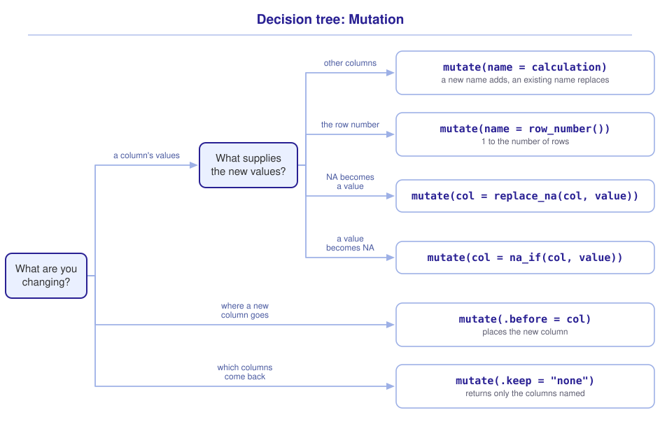

```{r}
#| include: false

library(webexercises)
library(tidyverse)

source("src/r/course_functions.R")
source("src/r/reference_lookup.R")

lesson_refs <- find_lesson_references()
```

<hr>

<div>
{.intro_image fig-alt="Course logo"}

**Mutation** describes the process of adding columns to a **data frame**, or modifying the columns that are already there. In completing this lesson, you will learn how to:

* Modify a single column or multiple columns with `mutate()`
* Set `NA` values to a different value
* Set values to `NA`
* Add columns while dropping others, using `mutate()` and its `.keep` argument

**Important!** Before starting this tutorial, be sure that you have completed all preliminary and previous lessons.

</div>

## Data for this lesson

<button class="accordion">Please click on the button below to explore the metadata for this lesson!</button>
::: panel
In this lesson, we will explore:

```{r}
#| echo: false
#| output: asis

lesson_metadata(
  .dataset = "district_birds.rds",
  .tables = "captures"
) %>%
  cat()
```
:::

## Set up your session

Please complete the following to ensure that you are working in a clean session:

1. Please ensure that your **Global Environment** is empty.
2. In the *History* tab of your **workspace pane**, ensure that your **session history** is empty.

Now that we are working in a clean session:

1. Create a script file.
2. Save your script file as `scripts/mutation.R`.
3. Add metadata as a comment on the top of the file.
4. Following your metadata, create a new **code section** and call it "`setup`".
5. Following your section header, attach the packages that comprise the **core tidyverse**.

At this point, your script should look something like:

```{r}
#| eval: false

# My code for the mutation tutorial

# setup --------------------------------------------------------

library(tidyverse)
```

Now we are going to add our data for this lesson ... let's do it as a "Now you!" challenge:

::: now_you
 [Now you!]{style="font-size: 1.25em; padding-left: 0.5em;"}

In a single piped statement:

* Read in the file `district_birds.rds`;
* Extract the list item assigned to the name `captures`;
* Subset `captures` to the columns `spp`, `sex`, `age`, `wing`, `tl`, `mass`, `bp_cp`, and `fat`;
* Assign the resultant object to your global environment with the name `measures`.

*Hint: We read `.rds` files with `read_rds()` in **1.4 Importing, exploring, and exporting data**, and extracted a list item with `pluck()` and subset columns with `select()` in **2.1 Introduction to subsetting and extraction**.*

[Click here to see my answer]{.answer_link data-answer="a-2-2-measures"}

::: {.answer_body #a-2-2-measures}

```{r}
# Read in the data and subset to the list item and variables of
# interest:

measures <-
  read_rds("data/raw/district_birds.rds") %>%
  pluck("captures") %>%
  select(spp:fat)

# Or, naming the columns we do not want:

measures <-
  read_rds("data/raw/district_birds.rds") %>%
  pluck("captures") %>%
  select(!capture_id:color_combo)
```

:::
:::

## Add or modify a column

The `mutate()` function can be used to modify an existing column or columns in a data frame, or to add new columns.

For example, a commonly used measure of avian body condition is the ratio of a bird's mass to the length of its wing. Below, I calculate the ratio between the `mass` and `wing` of each observation in `measures` and assign the data to a new column named `mass_wing`:

```{r}
measures %>%
  mutate(mass_wing = mass / wing)
```

It might seem obvious, but `mutate()` divided the values in the `mass` column by the values in the `wing` column. Let's have a look at what that means, though. Both columns are vectors of the same length. In R, when you divide one vector by another, the calculation is conducted *by position*. You can verify this with the following calculation:

```{r}
1:2 / 4:5
```

In the above, the value 1 is divided by 4 and 2 is divided by 5.

::: mysecret

 [A peek under the hood!]{style="font-size: 1.25em; padding-left: 0.5em;"}

A *huge* advantage of **data-masking** functions like `mutate()` is that a data frame's column names are made available inside the function -- you can refer to a column by its bare name. Not every tidyverse function works this way, and base R has data-masking functions of its own (see ***2.1 Introduction to subsetting and extraction***).

For example, the following two statements are equivalent (but the version without the `$` function is much more parsimonious!):

```{r}
#| eval: false

measures %>%
  mutate(mass_wing = mass / wing)

measures %>%
  mutate(mass_wing = .$mass / .$wing)
```

:::

I should note that naming the result is not required, but is worth doing, because we can end up with some ugly (and difficult to use) column names without it:

```{r}
measures %>%
  mutate(mass / wing)
```

Naming is also an important consideration when you want to modify an existing column. For example, perhaps we want to change the unit of `mass` from grams to ounces (1 gram is ~0.0353 ounces). Notice what happens if we do not add a new column name:

```{r}
measures %>%
  mutate(mass * 0.0353)
```

To replace `mass` in the returned data frame, we assign the new vector to the existing column name, `mass` (*Note: `measures` itself is unchanged -- as always, we would have to assign the result to keep it*):

```{r}
measures %>%
  mutate(mass = mass * 0.0353)
```

We can also use `mutate()` to add new data to the data frame. The only rule is that the added vector (i.e., column) must be either length 1 or the same length as the number of rows in the data frame.

For example, let's add an `id`, which will basically just be the row number (*Note: This does not make a good **primary key**, though!*):

```{r}
measures %>%
  mutate(
    id = 1:nrow(.)
  )
```

I like to use the *dplyr* function `row_number()` for this task. This function generates a sequence of integer values from 1 to the number of rows in a data frame:

```{r}
measures %>%
  mutate(
    id = row_number()
  )
```

We can specify the location of our new column using the `.before = ` argument of `mutate()` (see `?mutate` for more options):

```{r}
measures %>%
  mutate(
    id = row_number(),
    .before = spp
  )
```

::: mysecret

 [But do not use row numbers as a primary key!]{style="font-size: 1.25em; padding-left: 0.5em;"}

Row numbers should rarely (if ever) be used as primary key values. I use them during R sessions in a pinch, and I never save a dataset to my hard drive with a row number as a variable. We will learn more about what makes a good primary key in a future lesson.
:::

## Mutate multiple columns

We often want to modify or add multiple columns in a single step. For example, perhaps we want to change the unit of wing measurement from millimeters to centimeters (1 cm = 10 mm) *and* the unit of mass measurement from grams to ounces (1 gram is ~0.0353 ounces). We *could* chain together multiple mutate statements:

```{r}
measures %>%
  mutate(wing = wing / 10) %>%
  mutate(mass = mass * 0.0353)
```

Instead, however, it is more parsimonious to perform both mutations in the same `mutate()` call. We simply separate each mutate argument with a comma:

```{r}
measures %>%
  mutate(
    wing = wing / 10,
    mass = mass * 0.0353
  )
```

If a given mutation is dependent on another operation inside the `mutate()` function, you have to be careful regarding the order of operations. For example, perhaps we want to calculate the ratio of mass to wing length, with wing length in centimeters and mass in ounces. We *could* conduct the calculation with a new `mutate()` call:

```{r}
measures %>%
  mutate(
    wing = wing / 10,
    mass = mass * 0.0353
  ) %>%
  mutate(mass_wing = mass / wing)
```

Or, more parsimoniously, within the *same* mutate call (but *after* the unit conversion):

```{r}
measures %>%
  mutate(
    wing = wing / 10,
    mass = mass * 0.0353,
    mass_wing = mass / wing
  )
```

The resultant `mass_wing` value is correct. However, the *same* calculation returns the wrong value if we place it *before* our unit conversion:

```{r}
measures %>%
  mutate(
    mass_wing = mass / wing,
    wing = wing / 10,
    mass = mass * 0.0353
  )
```

Nothing changed but the position of the `mass_wing` line, and the first value went from 0.134 to 0.379 -- the ratio was calculated in grams and millimeters, because the conversions had not run yet. The arguments inside `mutate()` are evaluated in order!

::: now_you
 [Now you!]{style="font-size: 1.25em; padding-left: 0.5em;"}

In a single `mutate()` call, convert `tl` from millimeters to centimeters and add a column named `mass_tl` that holds the ratio of `mass` to the converted `tl`.

*Hint: The answer depends on the order of your arguments -- see the example directly above.*

[Click here to see my answer]{.answer_link data-answer="a-2-2-order"}

::: {.answer_body #a-2-2-order}

```{r}
measures %>%
  mutate(
    tl = tl / 10,
    mass_tl = mass / tl
  )
```

The conversion has to come first. Placing `mass_tl` above it would divide grams by millimeters, and the column would be wrong by a factor of ten. Most capture records have no `tl` measurement, so the top rows of `mass_tl` are `NA` -- we take up missing values in the next section.

:::
:::

## Special case: `NA` values

An `NA` value represents missing data -- such values may be inappropriate if the data are not actually missing. For example, in the `captures` data frame, the column `bp_cp` represents the breeding condition of a bird. "BP" stands for brood patch, a measure of female breeding condition. "CP" stands for cloacal protuberance, a measure of male breeding condition. If a bird does not have a BP or CP, the bird is not in breeding condition. This variable was measured each time a bird was in the hand, but it was often not recorded when a bird was not in breeding condition.

Let's look at the distribution of values in this column with the `table()` function (see `?table`):

```{r}
measures %>%
  pull(bp_cp) %>%
  table(useNA = "always")
```

We see that, in this dataset, there are 5,965 `NA` values! Given that this variable was measured during each capture event, this is a problem. In talking with the field manager of the project, I discovered that field biologists were initially told to record BP and CP only if they saw an indication of breeding condition. Later they were told to enter a dash ("-") if there was no indication. Given that they measured this variable upon every capture, those `NA` values should actually be "-"!

### Replace `NA`

We can replace `NA` values with the *tidyr* function `replace_na()`. Working inside of `mutate()`, we:

* Assign the name of the column we would like to modify;
* Add the function `replace_na()`;
* Supply the name assigned to the target vector as the first argument of `replace_na()`;
* Supply the value to replace `NA` values with as the second argument of `replace_na()`.

```{r}
measures %>%
  mutate(
    bp_cp = replace_na(bp_cp, "-")
  )
```

Below, after our mutation, I extract the column of interest with `pull()` and use `table()` again so that we can really see the results:

```{r}
measures %>%
  mutate(
    bp_cp = replace_na(bp_cp, "-")
  ) %>%
  pull(bp_cp) %>%
  table(useNA = "always")
```

### Convert to `NA`

It is often necessary to convert a value *to* `NA`. The value "U" in the variable `bp_cp` represents "unknown". This value was recorded when the breeding condition of a bird was not measured (for example, the bird escaped before the measurement was taken). As such, the value "U" truly *should be* `NA`. Let's look again at the original distribution of `bp_cp`:

```{r}
measures %>%
  pull(bp_cp) %>%
  table(useNA = "always")
```

We can use the *dplyr* function `na_if()` to convert a value to `NA`. Working inside of `mutate()`, we:

* Assign the name of the column we would like to modify;
* Add the function `na_if()`;
* Supply the name assigned to the target vector as the first argument of `na_if()`;
* Supply the value to replace with `NA` as the second argument of `na_if()`.

```{r}
measures %>%
  mutate(
    bp_cp = na_if(bp_cp, "U")
  ) %>%
  pull(bp_cp) %>%
  table(useNA = "always")
```

What if we wanted to convert `NA` values to "-" and "U" to `NA`? This is a situation in which the order of operations is important!

We *could* pipe the mutate statements together:

```{r}
measures %>%
  mutate(
    bp_cp = replace_na(bp_cp, "-")
  ) %>%
  mutate(
    bp_cp = na_if(bp_cp, "U")
  ) %>%
  pull(bp_cp) %>%
  table(useNA = "always")
```

... but, because variables in a mutate statement are evaluated in order, we can conduct both operations inside of the same `mutate()` function:

```{r}
measures %>%
  mutate(
    bp_cp = replace_na(bp_cp, "-"),
    bp_cp = na_if(bp_cp, "U")
  ) %>%
  pull(bp_cp) %>%
  table(useNA = "always")
```

::: mysecret

 [You can pipe inside of `mutate()` too!]{style="font-size: 1.25em; padding-left: 0.5em;"}

Notice that the second `bp_cp` assignment uses the version of `bp_cp` created by the preceding expression in the same `mutate()` call. Such intermediate assignments are not necessary.

We *could* avoid the intermediate assignment by nesting the operation:

```{r}
#| eval: false

measures %>%
  mutate(
    bp_cp =
      na_if(
        replace_na(
          bp_cp,
          "-"
        ),
        "U"
      )
  )
```

... but I find the above *very* hard to read (even though the operation is only nested two levels deep).

A (great) alternative is to chain the `replace_na()` and `na_if()` functions together with a pipe:

```{r}
#| eval: false

measures %>%
  mutate(
    bp_cp =
      replace_na(bp_cp, "-") %>%
      na_if("U")
  )
```

Notice in the above that the output of `replace_na(bp_cp, "-")` is passed to the first argument of `na_if()`. I like to make the process even clearer by beginning with the original column:

```{r}
#| eval: false

measures %>%
  mutate(
    bp_cp =
      bp_cp %>%
      replace_na("-") %>%
      na_if("U")
  )
```

:::

::: now_you
 [Now you!]{style="font-size: 1.25em; padding-left: 0.5em;"}

The `sex` column records "U" where the sex of a bird was unknown, but it also holds `NA` values. Record every unknown the same way: convert the `NA` values in `sex` to "U".

*Hint: We converted `NA` to a value with `replace_na()` in **Replace `NA`**, above.*

[Click here to see my answer]{.answer_link data-answer="a-2-2-sex"}

::: {.answer_body #a-2-2-sex}

```{r}
measures %>%
  mutate(
    sex = replace_na(sex, "U")
  ) %>%
  pull(sex) %>%
  table(useNA = "always")
```

The 1,820 capture records already coded "U" and the 305 with a missing value now count as 2,125 records of unknown sex.

:::
:::

## Add columns while dropping others

We often want to add a column *and* keep only some of the columns that were already in the data frame. We *could* do this in two steps -- mutate, then select:

```{r}
measures %>%
  mutate(mass_wing = mass / wing) %>%
  select(spp, mass_wing)
```

`mutate()` can do both jobs in a single step, using its `.keep` argument. Setting `.keep = "none"` tells `mutate()` to return *only* the columns that are named inside the function call:

```{r}
measures %>%
  mutate(
    mass_wing = mass / wing,
    .keep = "none"
  )
```

That dropped all of the other columns! To carry `spp` along with our new column, we simply name it inside `mutate()`:

```{r}
measures %>%
  mutate(
    spp,
    mass_wing = mass / wing,
    .keep = "none"
  )
```

We can also rename a column in the same step:

```{r}
measures %>%
  mutate(
    species = spp,
    mass_wing = mass / wing,
    .keep = "none"
  )
```

The `.keep` argument takes four values (see `?mutate`):

* `"all"` (the default): Keep every column in the data frame.
* `"used"`: Keep the new columns plus the columns that were *used* to calculate them.
* `"unused"`: Keep the new columns plus the columns that were *not* used to calculate them.
* `"none"`: Keep only the columns named inside `mutate()`.

Compare `"used"` and `"unused"` on the same calculation:

```{r}
measures %>%
  mutate(
    mass_wing = mass / wing,
    .keep = "used"
  )
```

```{r}
measures %>%
  mutate(
    mass_wing = mass / wing,
    .keep = "unused"
  )
```

::: mysecret

 [You will see `transmute()` in older code]{style="font-size: 1.25em; padding-left: 0.5em;"}

Before `.keep` was added to `mutate()`, this job was done by a separate function, `transmute()`. It behaved exactly like `mutate(..., .keep = "none")`:

```{r}
#| eval: false

measures %>%
  transmute(
    species = spp,
    mass_wing = mass / wing
  )
```

`transmute()` has since been **superseded**, meaning that the tidyverse team has developed a better alternative (here, the `.keep` argument). A superseded function will not receive new features but will receive any critical bug fixes needed to keep it working, so old code that uses it still runs. See the Posit team's description of a function's [lifecycle stages](https://lifecycle.r-lib.org/articles/stages.html){target="_blank"} for more information.

You will still encounter `transmute()` in scripts, blog posts, and Stack Overflow answers written before 2021. In your own code, and in this course, please use `mutate()` with `.keep`.

:::

## Putting it all together

At this point my hope is that you have a mental model for the mutation process. It might look something like this (click to expand):

{.zoomable data-title="Decision tree: Mutation" data-pdf-key="mutation" fig-alt="Decision tree. Every operation in this lesson is a mutate() call, and the tree chooses what goes inside it. The first question is what you are changing. A column's values leads to a further question, what supplies the new values: other columns give mutate(name = calculation), where a new name adds a column and an existing name replaces one; the row number gives mutate(name = row_number()), which counts from 1 to the number of rows; NA becoming a value gives mutate(col = replace_na(col, value)); and a value becoming NA gives mutate(col = na_if(col, value)). Where a new column goes gives mutate(.before = col). Which columns come back gives mutate(.keep = 'none'), which returns only the columns named."}



::: {.callout-note}

As in ***2.1 Introduction to subsetting and extraction***, this tree is a visualization of *my* mental model for these functions. It is totally okay if your model differs! What is important is that you have a *working* model -- a system in place that allows you to retrieve the function or functions that you need to solve a problem.

:::

## Take-home points

* `mutate()` adds a column or modifies an existing one. Assign a name to the result, or you will end up with a column name like `mass/wing`.
* To replace a column, assign the result to the existing column name. `mutate()` returns a new data frame; the original is unchanged unless you assign the result.
* Arguments inside a single `mutate()` call are evaluated in order, so a calculation can use a column that was created earlier in the same call. Order matters.
* An added column must be either length 1 or the same length as the number of rows in the data frame. `row_number()` is a convenient way to generate the latter.
* Use `replace_na()` to convert `NA` to a value and `na_if()` to convert a value to `NA`. Both are used inside `mutate()`, and both can be chained with a pipe within a single argument.
* Use the `.keep` argument of `mutate()` to drop columns as you add them. `transmute()` does the same job but has been superseded.

## Exercises

::: now_you
 [Test your knowledge!]{style="font-size: 1.25em; padding-left: 0.5em;"}

1. Which call converts `wing` from millimeters to centimeters *and* calculates the ratio of `mass` to the converted `wing`, correctly?

   `r longmcq(c("mutate(mass_wing = mass / wing, wing = wing / 10)", answer = "mutate(wing = wing / 10, mass_wing = mass / wing)", "mutate(mass_wing = mass / wing) %>% mutate(wing = wing / 10)", "All three return the same result"))`

2. The `bp_cp` column records "-" for a bird that is not in breeding condition and "U" when the measurement was not taken. Which function converts the "U" values to `NA`?

   `r longmcq(c("replace_na()", answer = "na_if()", "drop_na()", "is.na()"))`

3. True or false: `mutate(mass_wing = mass / wing, .keep = "used")` returns a data frame containing `mass`, `wing`, and `mass_wing`.

   `r torf(TRUE)`

4. Parsons Problem: Reorder the lines below to replace `NA` values in `bp_cp` with "-", convert "U" values to `NA`, and return only that one column. One line uses a function that removes rows rather than replacing values. Leave it in the trash. (*Order matters here!*)

   <div class="parsons-problem">
   <div id="p-2-2-01-trash" class="sortable-code"></div>
   <div id="p-2-2-01-sortable" class="sortable-code"></div>
   <div style="clear: both;"></div>
   <button id="p-2-2-01-check" class="parsons-btn parsons-btn-check" type="button">Check My Order</button>
   <button id="p-2-2-01-reset" class="parsons-btn parsons-btn-reset" type="button">Shuffle Again</button>
   <p id="p-2-2-01-feedback" class="parsons-feedback"></p>
   </div>

   <script>
   window.parsonsProblems = window.parsonsProblems || [];
   window.parsonsProblems.push({
     id: "p-2-2-01",
     maxDistractors: 1,
     code: "measures %>%\n  mutate(\n    bp_cp = replace_na(bp_cp, \"-\"),\n    bp_cp = na_if(bp_cp, \"U\"),\n    .keep = \"none\"\n  )\n    bp_cp = drop_na(bp_cp), #distractor"
   });
   </script>
:::


