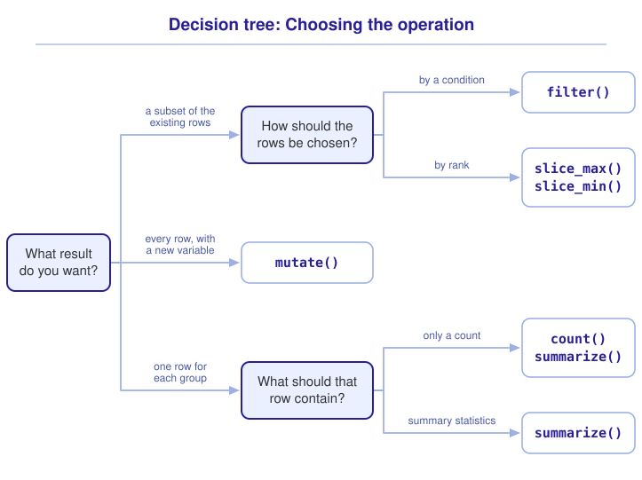
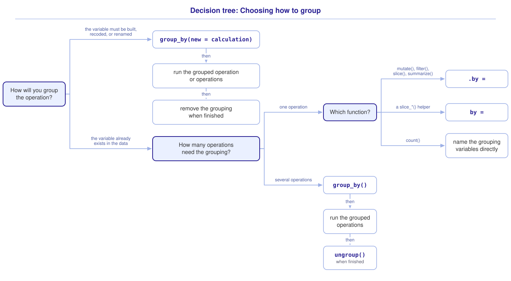

```{r}
#| include: false

library(webexercises)
library(tidyverse)

source("src/r/course_functions.R")
source("src/r/reference_lookup.R")

lesson_refs <- find_lesson_references()
```

<hr>

<div>
{.intro_image fig-alt="Course logo"}

To **group** a data frame is to divide its rows by the values in a variable, so that an operation is conducted on each group separately. We often want results for groups in our data, such as the mean wing length of each species, the number of captures at each site, or the number of sites at which birds were captured in a given year. A number of functions that we have used in this course can operate on groups. Here, we will explore that usage and introduce the `summarize()` function. To **summarize** a data frame is to calculate one or more summary statistics and return the result as a data frame.

In completing this lesson, you will learn how to:

* Conduct operations on grouped data frames using the `.by = ` argument and `group_by()`
* Calculate summary statistics for a data frame with `summarize()`, `n()`, and `count()`
* Distinguish when to use `.by = ` vs. `group_by()`

**Important!** Before starting this tutorial, be sure that you have completed all preliminary and previous lessons!

</div>

## Data for this lesson

<button class="accordion">Please click on the button below to explore the metadata for this lesson!</button>
::: panel
In this lesson, we will explore:

```{r}
#| echo: false
#| output: asis

lesson_metadata(
  .dataset = "district_birds.rds",
  .tables = "captures"
) %>%
  cat()
```
:::

## Set up your session

Please complete the following to ensure that you are working in a clean session:

1. Please ensure that your **Global Environment** is empty.
2. In the *History* tab of your **workspace pane**, ensure that your **session history** is empty.

Now that we are working in a clean session:

1. Create a script file.
2. Save your script file as `scripts/grouping_and_summarizing.R`.
3. Add metadata as a comment on the top of the file.
4. Following your metadata, create a new **code section** and call it "`setup`".
5. Following your section header, attach the packages that comprise the **core tidyverse**.

At this point, your script should look something like:

```{r}
#| eval: false

# My code for the grouping and summarizing tutorial

# setup --------------------------------------------------------

library(tidyverse)
```

Now we are going to add our data for this lesson ... let's do it as a "Now you!" challenge:

::: now_you
 [Now you!]{style="font-size: 1.25em; padding-left: 0.5em;"}

In a single piped statement:

* Read in the file `district_birds.rds`;
* Extract the list item assigned to the name `captures`;
* Subset `captures` to the columns `spp`, `sex`, `wing`, and `mass`;
* Assign the resultant object to your global environment with the name `measures`.

*Hint: We extracted a list item with `pluck()` and subset columns with `select()` in **2.1 Introduction to subsetting and extraction**.*

[Click here to see my answer]{.answer_link data-answer="a-2-3-measures"}

::: {.answer_body #a-2-3-measures}

```{r}
measures <-

  # Read in the file:

  read_rds("data/raw/district_birds.rds") %>%

  # Extract the list item assigned to the name "captures":

  pluck("captures") %>%

  # Select the columns of interest:

  select(
    spp:sex,
    wing,
    mass
  )
```

:::
:::

Each row of `measures` is a capture record that represents observations of a given bird during a sampling event.

## Group the data

We specify the grouping variable (unquoted) with the `.by = ` argument, which is accepted by many *dplyr* functions. The functions `mutate()` and `filter()` both accept it. Because those functions conduct different operations, the functions return different results:

* `mutate()` adds a column, so a grouped `mutate()` returns every row of the original data frame;
* `filter()` subsets rows by condition, so a grouped `filter()` returns the rows that satisfy the condition within each group.

### Group a mutation

In ***2.2 Introduction to mutation*** we used `mutate()` to add a column that was calculated from other columns. Below, we calculate mean mass of the capture records in `measures`:

```{r}
measures %>%
  mutate(
    mean_mass =
      mean(mass, na.rm = TRUE)
  )
```

Every row received the same value, because `mean()` was given the whole `mass` column. `measures` contains species as different in size as chickadees and robins, so these mass values are not particularly interesting or useful. Let's supply `spp` to the `.by = ` argument:

```{r}
measures %>%
  mutate(
    mean_mass =
      mean(mass, na.rm = TRUE),
    .by = spp
  )
```

In each row, `mean_mass` is now the mean mass among capture records for the species in that row. Notice that every row of `measures` is still here -- a grouped `mutate()` is still a `mutate()`.

With that column, we can compare the mass in each capture record with the other mass measurements for that species:

```{r}
measures %>%
  mutate(
    mean_mass =
      mean(mass, na.rm = TRUE),
    mass_index = mass / mean_mass,
    .by = spp
  )
```

Note that `mass_index` was calculated from `mean_mass`, which we created on the line above it. This is because arguments inside a `mutate()` call are evaluated in order (see ***2.2 Introduction to mutation***).

::: now_you
 [Now you!]{style="font-size: 1.25em; padding-left: 0.5em;"}

Add a column named `wing_index` that contains each capture record's wing length divided by the mean wing length of its species. Every row of `measures` should be maintained.

*Hint: You will need two named arguments and the `.by = `, in that order.*

[Click here to see my answer]{.answer_link data-answer="a-2-3-index"}

::: {.answer_body #a-2-3-index}

```{r}
measures %>%
  mutate(
    mean_wing =
      mean(wing, na.rm = TRUE),
    wing_index = wing / mean_wing,
    .by = spp
  )
```

:::
:::

### Group a filter

In ***2.1 Introduction to subsetting and extraction*** we used `filter()` to subset a data frame by condition. Below, we subset `measures` to the records in which the mass was greater than the average mass across records:

```{r}
measures %>%
  filter(
    mass > mean(mass, na.rm = TRUE)
  )
```

Have a look at the `spp` column. We can see that this omitted small species. For example, the greatest recorded House Wren mass is less than the mean across capture records, so no House Wren record can satisfy this condition.

Supplying `spp` to `.by = ` retains capture records where mass is greater than the mean for that species:

```{r}
measures %>%
  filter(
    mass > mean(mass, na.rm = TRUE),
    .by = spp
  )
```

Each capture record is now compared with the mean mass among records of the same species, so the small species are represented.

The `slice_*()` functions from ***2.1*** are grouped in the same way. Below, we subset `measures` to the capture record with the greatest mass for each species:

```{r}
measures %>%
  slice_max(
    mass,
    n = 1,
    by = spp
  )
```

::: mysecret

 [Watch the dot!]{style="font-size: 1.25em; padding-left: 0.5em;"}

The grouping argument is `.by = ` in `mutate()`, `filter()`, `slice()`, and `summarize()`. It is `by = `, with no dot, in `slice_max()`, `slice_min()`, `slice_head()`, `slice_sample()`, and the rest of the `slice_*()` functions.

It is worth committing this to memory!
:::

::: now_you
 [Now you!]{style="font-size: 1.25em; padding-left: 0.5em;"}

Subset `measures` to the longest-winged capture record of each `sex`, maintaining all four columns.

*Hint: Watch the dot.*

[Click here to see my answer]{.answer_link data-answer="a-2-3-slice"}

::: {.answer_body #a-2-3-slice}

```{r}
measures %>%
  slice_max(
    wing,
    n = 1,
    by = sex
  )
```

:::
:::

## Summarize

In ***1.4 Importing, exploring, and exporting data*** we used the `summary()` function to look at the summary statistics of a data frame:

```{r}
summary(measures)
```

`summary()` returns a fixed set of statistics across columns in a data frame. With the *dplyr* function `summarize()` we choose the statistics and variables of interest using the following arguments:

* The target data frame (typically passed to the function via a pipe)
* A name and a calculation for each column of the result

For example, let's calculate the mean and standard deviation of wing length with `mean()` and `sd()` (from ***1.4 Importing, exploring, and exporting data***):

```{r}
measures %>%
  summarize(
    mean_wing =
      mean(wing, na.rm = TRUE),
    sd_wing =
      sd(wing, na.rm = TRUE)
  )
```

*Note: Recall that `na.rm = TRUE` is an argument of `mean()` and `sd()`. Without that argument, a vector that contains an `NA` returns `NA`.*

The result does not include the number of records that went into those statistics. We can add that with the *dplyr* function `n()`, which is a row counter:

```{r}
measures %>%
  summarize(
    n = n(),
    mean_wing =
      mean(wing, na.rm = TRUE),
    sd_wing =
      sd(wing, na.rm = TRUE)
  )
```

Notice what our `n` counted, though. Every row of `measures` went into that count, while `mean_wing` and `sd_wing` were calculated after `na.rm = TRUE` set the missing values aside. The count and the statistics describe different sets of records.

We can address this by removing the missing values before we summarize. To do so, let's use the *tidyr* function `drop_na()` (see ***2.1 Introduction to subsetting and extraction***):

```{r}
measures %>%
  drop_na(wing) %>%
  summarize(
    n = n(),
    mean_wing = mean(wing),
    sd_wing = sd(wing)
  )
```

The mean and standard deviation are unchanged, and `n` now counts the records that they describe.

*Note: While `drop_na()` should be used carefully, reducing the repetition of `na.rm = TRUE` enhances the parsimony of our code!*

::: mysecret

 [Avoid using `summarize()` for a single statistic!]{style="font-size: 1.25em; padding-left: 0.5em;"}

We can calculate a single statistic with `summarize()`:

```{r}
measures %>%
  summarize(
    mean_wing =
      mean(wing, na.rm = TRUE)
  )
```

The result is a **tibble** that contains a single value. Unless you need to use a tibble for a downstream operation, that is an overly complicated data structure for a single value. As such, it is far more parsimonious to extract the column and calculate the statistic directly (see ***2.1 Introduction to subsetting and extraction***):

```{r}
measures %>%
  pull(wing) %>%
  mean(na.rm = TRUE)
```

Favor `summarize()` when you want a table of statistics. Favor `pull()` and a summary function when you want to return a value.
:::

### Summarize by group

`summarize()` accepts the `.by = ` argument in the same way as `filter()` and `mutate()` -- here, a grouped `summarize()` returns a row for each group. We can produce a summary of `wing` for each species by supplying `.by = spp`:

```{r}
measures %>%
  drop_na(wing) %>%
  summarize(
    n = n(),
    mean_wing = mean(wing),
    sd_wing = sd(wing),
    .by = spp
  )
```

Notice that `n()` now represents the number of rows per group and each statistic is calculated for each group separately.

*Note: The species that were never measured for wing length are absent here, because `drop_na(wing)` removed all of their records. Had we used `na.rm = TRUE` instead, those species would be returned with a `mean_wing` of `NaN` -- the value that `mean()` returns when it receives an empty vector.*

We can group by more than one variable by supplying them to `.by = ` inside of `c()`:

```{r}
measures %>%
  summarize(
    n = n(),
    .by = c(spp, sex)
  )
```

Each row in the result now represents one observed combination of species and sex. Notice that the records with an `NA` in `sex` form a group of their own, as `.by = ` treats `NA` like any other value.

::: now_you
 [Now you!]{style="font-size: 1.25em; padding-left: 0.5em;"}

In a single `summarize()` call, return the number of capture records and the mean mass of each `sex`. Values that are missing from `mass` should be excluded from the mean.

*Hint: You will need two named arguments before the `.by = `.*

[Click here to see my answer]{.answer_link data-answer="a-2-3-by"}

::: {.answer_body #a-2-3-by}

```{r}
measures %>%
  summarize(
    n = n(),
    mean_mass =
      mean(mass, na.rm = TRUE),
    .by = sex
  )
```

:::
:::

### Count the records in each group

We have used `n()` to count the records in each group alongside other statistics. When a count is the only thing that we want, the statement reduces to:

```{r}
measures %>%
  summarize(
    n = n(),
    .by = spp
  )
```

Counting records is a common enough task that *dplyr* provides a function that does only that. We supply `count()` with the variables to group by, and it returns the count in a column named `n`:

```{r}
measures %>%
  count(spp)
```

`count()` accepts more than one grouping variable, and it does not need `c()` to do so:

```{r}
measures %>%
  count(spp, sex)
```

*Note: `count()` sorts its result by the grouping variables, while `.by = ` returns the groups in the order that they appear in the data.*

Favor `count()` when a count is all that you want. Favor `summarize()` when you want a count alongside another statistic, or a statistic that is not a count.

## When to use `group_by()`

There is a second way to group a data frame. The *dplyr* function `group_by()` predates the `.by = ` argument, and much of the code that you read will use it. One advantage of `group_by()` here is that it can compute or rename grouping variables.

Let's look again at our summary of species and sex. The records with an `NA` in `sex` formed a group of their own, and we know from ***2.2 Introduction to mutation*** that "U" is the code that this project uses for a bird whose sex could not be determined. We would like to recode `sex` and group by it in the same statement.

The `.by = ` argument cannot do this:

```{r}
#| error: true

measures %>%
  summarize(
    n = n(),
    .by =
      c(
        spp,
        sex = replace_na(sex, "U")
      )
  )
```

::: mysecret

 [Why `.by = ` cannot build a grouping variable]{style="font-size: 1.25em; padding-left: 0.5em;"}

The error message reports that the object `sex` was not found, which is strange to read when `sex` is a column of `measures`. The reason is one that we met in ***2.1 Introduction to subsetting and extraction***: the `.by = ` argument uses **tidy selection**, the same mechanism that `select()` and `pull()` use. Tidy selection matches a bare name against the names of a data frame and returns the columns that it finds. The values in those columns are not made available, so `replace_na()` has nothing to modify.

The `group_by()` function uses **data masking**, the mechanism that `mutate()` and `filter()` use. Data masking makes the values in each column available inside of the function, so an argument to `group_by()` can be an expression.
:::

The `group_by()` function builds its grouping variables in the way that `mutate()` builds columns:

```{r}
measures %>%
  group_by(
    spp,
    sex = replace_na(sex, "U")
  ) %>%
  summarize(
    n = n(),
    .groups = "drop"
  )
```

The `NA` group has been combined with "U" for every species. Note that we did not add a recoded column to `measures` -- the recoding took place inside of `group_by()`, and it is present only in the result.

`group_by()` is not the only way to group by a variable that is not yet a column. We can build the column with `mutate()` and then group by it with `.by = `:

```{r}
measures %>%
  mutate(
    sex = replace_na(sex, "U")
  ) %>%
  summarize(
    n = n(),
    .by = c(spp, sex)
  )
```

The two statements return the same counts, and both pass a recoded `sex` column to `summarize()`. The rows arrive in a different order because `group_by()` sorts its groups, while `.by = ` returns them in the order that they appear in the data.

The primary difference between the two statements is the grouping. `mutate()` recodes the column and passes on an ungrouped data frame, so the `summarize()` that follows has to state its own grouping. `group_by()` recodes the column and passes on a grouped data frame, so every step that follows is grouped until the grouping is removed.

We can also rename a grouping variable as we group by it, which is useful when a field name is not informative for our readers:

```{r}
measures %>%
  group_by(species = spp) %>%
  summarize(n = n())
```

### When more than one step uses the grouping

The `.by = ` argument groups a single operation, so a pipe that groups twice names the grouping variable twice. The `group_by()` function attaches the grouping to the data frame, and every step that follows is grouped until the grouping is removed.

In ***Group a filter***, above, we subset `measures` to the capture records with masses above the mean for their species. Suppose that we now want the records *below* the mean for their species, and a count of those records for each species. That is a grouped `filter()` followed by a grouped `summarize()`:

```{r}
measures %>%
  group_by(spp) %>%
  filter(
    mass < mean(mass, na.rm = TRUE)
  ) %>%
  summarize(n = n())
```

The `filter()` compared the mass in each capture record with the mean for its species, and `summarize()` counted the records that remained within each species. Both operations used the grouping that `group_by()` attached, and we named `spp` once.

The `.by = ` argument returns the same counts, but `spp` has to be named in both calls:

```{r}
#| eval: false

measures %>%
  filter(
    mass < mean(mass, na.rm = TRUE),
    .by = spp
  ) %>%
  summarize(
    n = n(),
    .by = spp
  )
```

Neither version is wrong. As a chain grows, though, the grouping variable has to be repeated in every call, and each repetition is a place where one call can disagree with another.

A grouped `mutate()` works in the same way, with one difference: `summarize()` removed the grouping as it calculated the summary, while a `mutate()` leaves the data frame grouped. That brings us to the cleanup required when later operations should no longer use the grouping.

### Remove the grouping when you are finished

A grouping that `group_by()` attaches is maintained until it is removed, and a step that we did not intend to group is grouped along with the ones that we did.

Below, we count the captures of each species and sex, then subset the result to the largest group:

```{r}
measures %>%
  group_by(spp, sex) %>%
  summarize(n = n()) %>%
  slice_max(
    n,
    n = 1,
    with_ties = FALSE
  )
```

We received a row for each species rather than the single row that we asked for. By default, the `summarize()` function removes only the last grouping variable, so the result was still grouped by `spp`, and `slice_max()` returned the largest group *within each species*. The message and the tibble header both report that the result remains grouped by species. Neither can show whether that grouping was intended.

The `.groups = "drop"` argument of `summarize()` removes the grouping as the summary is calculated:

```{r}
measures %>%
  group_by(spp, sex) %>%
  summarize(
    n = n(),
    .groups = "drop"
  ) %>%
  slice_max(
    n,
    n = 1,
    with_ties = FALSE
  )
```

The *dplyr* function `ungroup()` removes a grouping at any point in a pipe:

```{r}
measures %>%
  group_by(spp, sex) %>%
  summarize(n = n()) %>%
  ungroup() %>%
  slice_max(
    n, 
    n = 1,
    with_ties = FALSE
  )
```

## Choosing a grouping method

We have now seen how the methods differ, which is what we need in order to choose between them:

* Group with `.by = ` when the grouping is needed for this call alone. It returns an ungrouped result, so there is no grouping to affect a later step.
* Group with `group_by()` when a later step uses the same grouping, so that the grouping variable is named once rather than in every call.
* `.by = ` uses tidy selection, so its grouping variable has to be a column already. `group_by()` uses data masking, so it can build one -- and so can a `mutate()` placed before a `.by = `.
* When no later step needs the grouping, remove it with `ungroup()`, or with `.groups = "drop"` when the last grouped step is a `summarize()`.

::: now_you
 [Now you!]{style="font-size: 1.25em; padding-left: 0.5em;"}

Which grouping method would you use for each of the following, and why?

1. The mean wing length of each species.
2. The number of captures of each species and sex, with the `NA` values in `sex` recoded to "U".
3. A column that contains each capture record's mass divided by the mean mass of its sex.
4. The number of capture records of each species that fall below the mean mass of that species.

[Click here to see my answer]{.answer_link data-answer="a-2-3-choose"}

::: {.answer_body #a-2-3-choose}

1. `.by = spp`. The grouping variable is already a column, so tidy selection is all that we need.
2. Either `group_by()`, ending with `.groups = "drop"`, or a `mutate()` that recodes `sex` followed by `.by = c(spp, sex)`. The grouping variable does not exist yet, and `.by = ` cannot build one on its own.
3. `.by = sex`, inside of `mutate()`. Grouping is not only for summarizing, and this question asks for a column rather than a table.
4. `group_by(spp)`. A grouped `filter()` and a grouped `summarize()` both use the same grouping, so `group_by()` lets us name `spp` once.

:::
:::

## Putting it all together

At this point my hope is that you have a mental model for grouped operations. Choosing the operation
might look something like this (click to expand):

{.zoomable data-title="Decision tree: Choosing the operation" data-pdf-key="grouped_operations" fig-alt="Decision tree. The first question is what result you want. A subset of the existing rows leads to a further question, how the rows should be chosen: by a condition gives filter(), and by rank gives slice_max() or slice_min(). Every row, with a new variable, gives mutate(). One row for each group leads to a further question, what that row should contain: only a count gives count() or summarize(), and summary statistics give summarize()."}



Choosing how to group that operation is a separate question, with a tree of its own (click to expand):

{.zoomable data-title="Decision tree: Choosing how to group" data-pdf-key="grouping_method" fig-alt="Decision tree. The first question is how you will group the operation. If the grouping variable must be built, recoded, or renamed, build it inside group_by(), run the grouped operation or operations, and remove the grouping when you are finished. If the grouping variable already exists in the data, the next question is how many operations need the grouping. For one operation, the grouping argument is .by = in mutate(), filter(), slice() and summarize(), it is by = in the slice_*() helpers, and count() names its grouping variables directly. For several operations, use group_by(), run the grouped operations, and ungroup() when you are finished."}



::: {.callout-note}

As in ***2.1 Introduction to subsetting and extraction***, these trees are a visualization of *my* mental model for these functions. It is totally okay if your model differs! What is important is that you have a *working* model, a system in place that allows you to retrieve the function or functions that you need to solve a problem.

:::

## Take-home points

* To group a data frame is to divide its rows by the values in a variable, so that an operation is conducted on each group separately.
* The `.by = ` argument groups the operation of the function that it is supplied to. A grouped `mutate()` returns every row, a grouped `filter()` and `slice_max()` return the rows chosen within each group, and a grouped `summarize()` returns a row for each group.
* The grouping argument is `.by = ` in `mutate()`, `filter()`, `slice()`, and `summarize()`. It is `by = ` in the `slice_*()` helpers.
* `summarize()` calculates summary statistics and returns them as a data frame. Use `pull()` and a summary function when you want a value rather than a table.
* The `n()` function counts rows. The `na.rm = TRUE` argument belongs to `mean()` and its relatives, not to `summarize()`.
* `count()` returns the number of records in each group and nothing else. Favor `summarize()` when you want a count alongside another statistic.
* Where a summary reports a count alongside a statistic, consider whether you should remove the missing values with `drop_na()` before you summarize.
* `.by = ` uses tidy selection and *cannot* build a grouping variable. `group_by()` uses data masking and *can*, and so can a `mutate()` placed before a `.by = `.
* Favor `group_by()` when a later step uses the same grouping, so that the grouping variable is named once rather than in every call.
* A `group_by()` grouping is maintained until it is removed. `ungroup()` removes it anywhere in a pipe; `.groups = "drop"` removes it as a `summarize()` calculates, and belongs to `summarize()` alone.

## Exercises

::: now_you
 [Test your knowledge!]{style="font-size: 1.25em; padding-left: 0.5em;"}

1. Which statement returns the mean mass across all capture records in `measures` as a value?

   `r longmcq(c("summarize(measures, mean_mass = mean(mass, na.rm = TRUE))", answer = "measures %>% pull(mass) %>% mean(na.rm = TRUE)", "mutate(measures, mean_mass = mean(mass, na.rm = TRUE))", "slice_max(measures, mass, n = 1, with_ties = FALSE)"))`

2. How many rows does `mutate(measures, mean_mass = mean(mass, na.rm = TRUE), .by = spp)` return?

   `r longmcq(c(answer = "Every row of measures, because mutate() does not change the number of rows", "A row for each species", "A single row", "It depends on how many species have a recorded mass"))`

3. True or false: `filter(measures, mass > mean(mass, na.rm = TRUE), .by = spp)` and the same statement without `.by = spp` ask the same question of the data.

   `r torf(FALSE)`

4. `summarize(measures, n = n(), .by = c(sex = replace_na(sex, "U")))` reports that the object `sex` was not found. Why?

   `r longmcq(c("replace_na() may only be used inside of mutate()", answer = "The .by argument uses tidy selection, which matches column names rather than supplying the values in those columns", "The sex column contains NA values, which cannot be grouped", "c() may not be used with .by"))`

5. You group `measures` by `spp` and `sex` with `group_by()`, summarize, and pipe the result into `slice_max(n, n = 1, with_ties = FALSE)` without removing the grouping. What is returned?

   `r longmcq(c("An error, because the data frame is still grouped", "A single row: the largest group in the dataset", answer = "A row for each species, because slice_max() ran within each group", "The summary, unchanged"))`

6. You want the number of capture records of each species and the mean mass of each species, in a single data frame. Which function do you need?

   `r longmcq(c(answer = "summarize(), because count() returns a count and nothing else", "count(), supplied with two grouping variables", "count(), piped into pull()", "Neither -- this requires group_by()"))`

7. Parsons Problem: Reorder the lines below to subset `measures` to the heaviest capture record of each species. One line uses the wrong spelling of the grouping argument. Leave it in the trash.

   <div class="parsons-problem">
   <div id="p-2-3-01-trash" class="sortable-code"></div>
   <div id="p-2-3-01-sortable" class="sortable-code"></div>
   <div style="clear: both;"></div>
   <button id="p-2-3-01-check" class="parsons-btn parsons-btn-check" type="button">Check My Order</button>
   <button id="p-2-3-01-reset" class="parsons-btn parsons-btn-reset" type="button">Shuffle Again</button>
   <p id="p-2-3-01-feedback" class="parsons-feedback"></p>
   </div>

   <script>
   window.parsonsProblems = window.parsonsProblems || [];
   window.parsonsProblems.push({
     id: "p-2-3-01",
     maxDistractors: 1,
     code: "measures %>%\n  slice_max(\n    mass,\n    n = 1,\n    by = spp\n  )\n    .by = spp #distractor"
   });
   </script>
:::


