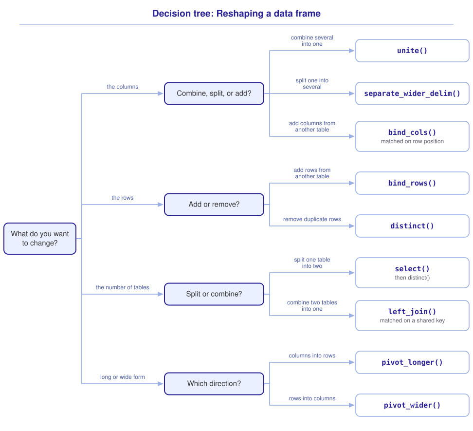

```{r}
#| include: false

library(webexercises)
library(tidyverse)

source("src/r/course_functions.R")
source("src/r/reference_lookup.R")

lesson_refs <- find_lesson_references()
```

<hr>

<div>
{.intro_image fig-alt="Course logo"}

**Reshaping** a data frame describes the process of altering how information is distributed across the structure of rows, columns, and even tables. Ecological datasets are often organized in ways that make them difficult to analyze, so reshaping is often one of the first things that we do.

In this lesson we will reshape a dataset of iNaturalist observations, and we will use the subsetting, extraction, and grouping tools from the previous three lessons as we go.

In completing this lesson, you will learn how to:

* Combine data frames by row with `bind_rows()`
* Combine columns with `unite()` and `bind_cols()`
* Split columns with `separate_wider_delim()`
* Combine tables by a shared key with `left_join()`, and recognize when `bind_cols()` is unsafe
* Change a data frame between long and wide form with `pivot_longer()` and `pivot_wider()`

During this process, we will apply `select()`, `distinct()`, and `count()` to the reshaping process.

**Important!** Before starting this tutorial, be sure that you have completed all preliminary and previous lessons!

</div>

## Data for this lesson

<button class="accordion">Please click on the button below to explore the metadata for this lesson!</button>
::: panel
In this lesson, we will explore:

```{r}
#| echo: false
#| output: asis

lesson_metadata(.dataset = "angola_ungulates.rds") %>%
  cat()
```
:::

## Set up your session

Please complete the following to ensure that you are working in a clean session:

1. Please ensure that your **Global Environment** is empty.
2. In the *History* tab of your **workspace pane**, ensure that your **session history** is empty.

Now that we are working in a clean session:

1. Create a script file.
2. Save your script file as `scripts/2.4_reshaping_data_frames.R`.
3. Add metadata as a comment on the top of the file.
4. Following your metadata, create a new **code section** and call it "`setup`".
5. Following your section header, attach the packages that comprise the **core tidyverse**.

At this point, your script should look something like:

```{r}
#| eval: false

# My code for the reshaping data frames tutorial

# setup --------------------------------------------------------

library(tidyverse)
```

*Note: This is already done for you in the script file for this lesson, which you downloaded from Canvas.*

To read in `angola_ungulates.rds`, we will use the *readr* function `read_rds()`.

```{r}
# Read rds file:

angola_ungulates_list <-
  read_rds("data/raw/angola_ungulates.rds")
```

To explore this object, let's have a look at its reference tree:

```{r}
lobstr::ref(angola_ungulates_list)
```

We can see that the data are structured as a list in which:

* Each list item is a tibble
* Each tibble is assigned to a name in the list
* Each tibble contains a number of variables (columns)
* The names assigned to each of the columns are equivalent for both tibbles

*Note: The orders Perissodactyla and Artiodactyla comprise odd-toed and even-toed ungulates, respectively.*

The list is the **parent** object and each tibble is a **child** object held inside it. Because we can pipe the object returned by `read_rds()` directly into the next function, binding it to the name `angola_ungulates_list` was not necessary.

::: now_you
 [Now you!]{style="font-size: 1.25em; padding-left: 0.5em;"}

In a single piped statement, read in `angola_ungulates.rds` and extract each of its list items to a name in your global environment.

*Hint: We extracted every child of a list to a name of its own with `list2env()` in **2.1 Introduction to subsetting and extraction**, specifying `.GlobalEnv` as the target environment.*

[Click here to see my answer]{.answer_link data-answer="a-2-4-list2env"}

::: {.answer_body #a-2-4-list2env}

```{r}
#| results: hide

read_rds("data/raw/angola_ungulates.rds") %>%
  list2env(envir = .GlobalEnv)
```

:::
:::

Print the names assigned to your global environment to see the result:

```{r}
ls()
```

We will not use `angola_ungulates_list` again, so let's remove the assignment:

```{r}
# Remove the name angola_ungulates_list from the global environment:

rm(angola_ungulates_list)
```

## Bind rows

Let's take a moment to look at the head of each of the datasets with the *dplyr* function `slice_head()`:

```{r}
perissodactyla %>%
  slice_head()

artiodactyla %>%
  slice_head()
```

We can see that the two datasets have the same column names, in the same order, and each of the variables is the same class (all are atomic character vectors). Moreover, the taxonomic order that defines the split of each data frame is present in the `taxonomy` column of the data. Let's extract that column with `pull()` (see ***2.1 Introduction to subsetting and extraction***) and look at its unique values:

```{r}
perissodactyla %>%
  pull(taxonomy) %>%
  unique()

artiodactyla %>%
  pull(taxonomy) %>%
  unique()
```

Because the two data frames use the same observational unit and compatible columns, and the taxonomic order remains recorded in `taxonomy`, we can combine them without losing information.

To combine tables by row, we use the *dplyr* function `bind_rows()`. The arguments that we supply are simply the names assigned to the data frames that we would like to combine:

```{r}
perissodactyla %>%
  bind_rows(artiodactyla)
```

Here, the pipe passes `perissodactyla` to the first argument of `bind_rows()` and `artiodactyla` remains as the second argument. If we wanted `perissodactyla` to come after `artiodactyla`, but still maintain the same order of operations, we can use the period placeholder:

```{r}
perissodactyla %>%
  bind_rows(artiodactyla, .)
```

::: now_you
 [Now you!]{style="font-size: 1.25em; padding-left: 0.5em;"}

Combine the two data frames by row so that the rows of `perissodactyla` come first, but pipe `artiodactyla` into `bind_rows()`.

*Hint: The period placeholder marks the position that the piped object should take.*

[Click here to see my answer]{.answer_link data-answer="a-2-4-bind-rows"}

::: {.answer_body #a-2-4-bind-rows}

```{r}
artiodactyla %>%
  bind_rows(perissodactyla, .)
```

:::
:::

The `bind_rows()` function can also be used (carefully!) to combine items in a list. Knowing what we do now about each list item in `angola_ungulates.rds`, we could have completed the reading and combining of the two list items in a single step. We will bind the resulting data frame to the name `angola_ungulates` in the global environment:

```{r}
# Read in the list, bind the list items, and then globally assign to a name:

angola_ungulates <-
  read_rds("data/raw/angola_ungulates.rds") %>%
  bind_rows()

angola_ungulates
```

In a real coding session, I would have used the version that binds the rows while reading in the data rather than the version that uses `list2env()`. As such, we have no need for the `perissodactyla` or `artiodactyla` data frames. Let's remove them:

```{r}
# Remove the names perissodactyla and artiodactyla from the global environment:

rm(perissodactyla, artiodactyla)
```

::: now_you
 [Now you!]{style="font-size: 1.25em; padding-left: 0.5em;"}

Return a data frame of the iNaturalist observers who contributed to `angola_ungulates`, with one row for each observer.

*Hint: We subset rows to their unique combinations with `distinct()` in **2.1 Introduction to subsetting and extraction**.*

[Click here to see my answer]{.answer_link data-answer="a-2-4-observers"}

::: {.answer_body #a-2-4-observers}

```{r}
angola_ungulates %>%
  distinct(user_login)
```

:::
:::

## Combine columns

A single variable is often stored across multiple columns. This is a common problem that I encounter when helping others with their data. In this dataset, we see year, month, and day columns -- these data could be represented by a single variable, "date".

We can combine columns using the *tidyr* function `unite()`. We provide the name of the new column within quotes (`col = `), the selection of columns that we would like to combine, and the separator between the values (`sep = `), provided in quotes.

```{r}
angola_ungulates %>%
  unite(
    col = "date",
    year:day,
    sep = "-"
  )
```

*Note: This date format is specified by ISO 8601, an international standard. We will soon cover this in depth!*

Let's assign the name `angola_ungulates_date_fix` to the resultant object:

```{r}
# Unite date columns and globally assign to the name
# angola_ungulates_date_fix:

angola_ungulates_date_fix <-
  angola_ungulates %>%
  unite(
    col = "date",
    year:day,
    sep = "-"
  )
```

The data also have separate columns for `genus` and `species`. By convention, a binomial scientific name combines the genus and specific epithet. Let's combine these two columns, separating the genus and specific epithet with a space:

```{r}
# Unite genus and species columns and globally assign to the name
# angola_ungulates_spp_fix:

angola_ungulates_spp_fix <-
  angola_ungulates_date_fix %>%
  unite(
    col = "sci_name",
    genus:species,
    sep = " "
  )
```

We will not work with `angola_ungulates_spp_fix` or `angola_ungulates_date_fix` again, so let's remove the assignments from our global environment:

```{r}
# Remove the names angola_ungulates_spp_fix and angola_ungulates_date_fix
# from the global environment:

rm(angola_ungulates_spp_fix, angola_ungulates_date_fix)
```

::: now_you
 [Now you!]{style="font-size: 1.25em; padding-left: 0.5em;"}

Some datasets record the time of sampling only to the month. Combine `year` and `month` in `angola_ungulates` into a single column named `year_month`, with a hyphen between the values.

*Hint: The columns to combine are provided as a selection, in the same way that we select columns with `select()`.*

[Click here to see my answer]{.answer_link data-answer="a-2-4-unite"}

::: {.answer_body #a-2-4-unite}

```{r}
angola_ungulates %>%
  unite(
    col = "year_month",
    year:month,
    sep = "-"
  )
```

:::
:::

::: mysecret

 [Avoid assignments that are only used once!]{style="font-size: 1.25em; padding-left: 0.5em;"}

Given that we only used `angola_ungulates_spp_fix` and `angola_ungulates_date_fix` once, it makes sense to avoid the preliminary assignments altogether. In the real world, I would have simply chained the above operations together as I read in the data:

```{r}
# Complete in a single chained analysis and globally assign a name:

angola_ungulates <-

  # Read in the data:

  read_rds("data/raw/angola_ungulates.rds") %>%

  # Combine the datasets by row:

  bind_rows() %>%

  # Combine the date columns:

  unite(
    col = "date",
    year:day,
    sep = "-"
  ) %>%

  # Combine the scientific name columns:

  unite(
    col = "sci_name",
    genus:species,
    sep = " "
  )
```

:::

## Split columns

In many datasets that I have encountered, multiple variables are provided within a single column. Let's look at the current state of our data:

```{r}
angola_ungulates
```

Here, we see that the taxonomic information is stored in a single column -- each taxonomic level should be a column of its own. To split one column into several, we use the *tidyr* function `separate_wider_delim()`. We supply the following arguments:

* The column that we would like to split (`cols = `)
* The delimiter that separates the values (`delim = `)
* A character vector of names for the resulting columns (`names = `)

```{r}
angola_ungulates %>%
  separate_wider_delim(
    cols = taxonomy,
    delim = "-",
    names =
      c(
        "class",
        "order",
        "family"
      )
  )
```

Notice that `taxonomy` is supplied as a bare name while the names in `names = ` are supplied within quotes. The `taxonomy` column is already in the data frame, so R has something to retrieve. The three new columns do not exist yet, because the point of running this code is to create them.

Let's assign the name `angola_ungulates_taxonomy_fix` to the resultant object:

```{r}
# Separate the taxonomy columns and globally assign a name:

angola_ungulates_taxonomy_fix <-
  angola_ungulates %>%
  separate_wider_delim(
    cols = taxonomy,
    delim = "-",
    names =
      c(
        "class",
        "order",
        "family"
      )
  )
```

We could have, of course, completed the above operation while reading and reshaping the file!

```{r}
# Complete in a single chained analysis and globally assign a name:

angola_ungulates <-

  # Read in the data:

  read_rds("data/raw/angola_ungulates.rds") %>%

  # Combine the datasets by row:

  bind_rows() %>%

  # Combine the date columns:

  unite(
    col = "date",
    year:day,
    sep = "-"
  ) %>%

  # Combine the scientific name columns:

  unite(
    col = "sci_name",
    genus:species,
    sep = " "
  ) %>%

  # Separate the taxonomy into multiple columns:

  separate_wider_delim(
    cols = taxonomy,
    delim = "-",
    names =
      c(
        "class",
        "order",
        "family"
      )
  )
```

::: mysecret

 [You will see `separate()` in older code]{style="font-size: 1.25em; padding-left: 0.5em;"}

This job used to be done by the *tidyr* function `separate()`, which took the new column names as `into = ` and the delimiter as `sep = `:

```{r}
#| eval: false

angola_ungulates %>%
  separate(
    col = "taxonomy",
    into =
      c(
        "class",
        "order",
        "family"
      ),
    sep = "-"
  )
```

`separate()` has since been **superseded** (see ***2.2 Introduction to mutation***), and `separate_wider_delim()` is one of the functions that replaced it. You will still encounter `separate()` in scripts, blog posts, and Stack Overflow answers. In your own code, and in this course, please use `separate_wider_delim()`.

*Note: `separate_wider_delim()` is currently in the **experimental** stage of its life cycle, which means that its arguments may still change.*

:::

Let's remove `angola_ungulates_taxonomy_fix`:

```{r}
# Remove the name angola_ungulates_taxonomy_fix from the global environment:

rm(angola_ungulates_taxonomy_fix)
```

::: now_you
 [Now you!]{style="font-size: 1.25em; padding-left: 0.5em;"}

We united `genus` and `species` into `sci_name` earlier in this lesson. Split `sci_name` back into a `genus` column and a `species` column.

*Hint: The character that you provide to `delim = ` is the character that you used to separate the values in `unite()`.*

[Click here to see my answer]{.answer_link data-answer="a-2-4-separate"}

::: {.answer_body #a-2-4-separate}

```{r}
angola_ungulates %>%
  separate_wider_delim(
    cols = sci_name,
    delim = " ",
    names = c("genus", "species")
  )
```

:::
:::

## Split table by columns

Looking at the data, we can see that some of the values repeat down the rows. One of the species observed is *Hippopotamus amphibius*, and the class, order, and family of a hippopotamus do not change when another hippopotamus is observed -- every one of those rows records the same three facts again. When a set of columns describes a different entity from the observational unit, repeated values can signal that the table should be split. Here, the taxonomic fields describe each species rather than each iNaturalist observation.

We subset columns with the *dplyr* function `select()` (see ***2.1 Introduction to subsetting and extraction***). For observations, I will choose date, user, and observed taxa:

```{r}
# Subset to observations of ungulates and globally assign the name
# observations:

observations <-
  angola_ungulates %>%
  select(date:user_login, sci_name)

observations
```

For taxonomic information, I will choose scientific name, class, order, family, and common name:

```{r}
# Subset to taxonomic information and globally assign the name taxonomy:

taxonomy <-
  angola_ungulates %>%
  select(
    sci_name,
    class:family,
    common_name
  )

taxonomy
```

I placed `sci_name` first to emphasize that the remaining columns describe that taxon. I retained `sci_name` in both tables so that it can connect each observation to its taxonomic information. Common names are less suitable because their usage is not always consistent.

Looking at our taxonomy table above, it appears that the class column is likely not needed. Of course, all even- and odd-toed ungulates are mammals -- as such, every `class` in the data frame should be "Mammalia". Let's verify this by extracting that column with `pull()` and assessing the unique values:

```{r}
taxonomy %>%
  pull(class) %>%
  unique()
```

There is indeed a single value repeated across all rows. This column really provides little taxonomic information about the species. To address this, we can remove it with a **negated selection** (see ***2.1***), which selects all columns *except* the one named:

```{r}
taxonomy %>%
  select(!class)
```

A better alternative would be to select the columns of interest during the initial subsetting process:

```{r}
# Subset to taxonomic information (but do not include class) and globally
# assign the name taxonomy (preferred):

taxonomy <-
  angola_ungulates %>%
  select(
    sci_name,
    order:family,
    common_name
  )
```

*Note: In a real coding session, I would make this change when creating `taxonomy`, rather than after assigning it.*

::: now_you
 [Now you!]{style="font-size: 1.25em; padding-left: 0.5em;"}

Subset `angola_ungulates` to the observer, the scientific name, and the taxonomic family, in that order.

*Hint: Naming the columns in the order that you want them is all that `select()` requires.*

[Click here to see my answer]{.answer_link data-answer="a-2-4-select"}

::: {.answer_body #a-2-4-select}

```{r}
angola_ungulates %>%
  select(
    user_login,
    sci_name,
    family
  )
```

:::
:::

## Remove duplicates

When we split the table into two, the taxonomy table kept one row for every observation, so the taxonomy of each species is still repeated many times over. We are no better off than we were: a value that is written down in many rows can be edited in one of them and missed in the rest.

To subset the rows to their unique combinations, we use the *dplyr* function `distinct()` (see ***2.1 Introduction to subsetting and extraction***):

```{r}
taxonomy %>%
  distinct()
```

... or (better yet), we can subset the columns and reduce the result to its unique rows in a single statement:

```{r}
# Subset to taxonomy columns, make distinct, and assign a name to the
# global environment:

taxonomy_distinct <-
  angola_ungulates %>%
  select(
    sci_name,
    order:family,
    common_name
  ) %>%
  distinct()
```

*Note: We are going to use `taxonomy` and `taxonomy_distinct` again, so we will not remove these assignments from the global environment.*

::: mysecret

 [Is `distinct()` not doing what you expected?]{style="font-size: 1.25em; padding-left: 0.5em;"}

`distinct()` will only remove what I call "true duplicates" -- in other words, rows that are duplicated in their entirety. If you notice that a row appears to be a duplicate but is not removed by `distinct()`, the difference is often worth investigating. A frequent cause is hidden blank spaces in a character variable.
:::

## Combine tables

Separate observation and taxonomy tables reduce redundancy, but some analyses require information from both. For example, we may want to group observations by taxonomic family. In that case, we can use one of the joining functions in the tidyverse.

### Combine by binding columns (usually unsafe)

The version of the taxonomy dataset in which duplicates were maintained is a columnar subset of the original data frame. Therefore, all we need to do is bind the two datasets together by column. This is done with the *dplyr* function `bind_cols()`; we simply provide the names of the two datasets that we would like to bind:

```{r}
observations %>%
  bind_cols(taxonomy)
```

Notice that the column `sci_name` has been given an odd notation. That is because it is contained in both datasets. As such, we need to remove it from one of the datasets. Here, I choose to remove it from observations:

```{r}
# The function bind_cols() can be used to join if you are certain that the
# row orders of the two tables are equivalent:

observations %>%
  select(!sci_name) %>%
  bind_cols(taxonomy)
```

The above works, and I sometimes use this method programmatically, but it is rarely safe in situations like this. For example, perhaps you sorted the `taxonomy` dataset alphabetically by species name. This would yield:

```{r}
# But this is often unsafe!

observations %>%
  select(!sci_name) %>%
  bind_cols(
    taxonomy %>%
      arrange(sci_name)
  )
```

The second observation was actually a Hippopotamus, but it appears here as a Common Impala! You might find the error hard to spot. That is exactly the danger of combining data frames with `bind_cols()`.

### Combine by joining data frames (usually safe)

A much safer method is joining two datasets by a common key. A **key** is one or more columns whose values identify rows in a table. `sci_name` uniquely identifies rows in `taxonomy_distinct`; the same column in `observations` connects each observation to its taxonomic row.

The *dplyr* function `left_join()` uses a common key to add matching columns from a right-hand data frame to a left-hand data frame. It retains every row of the left table and adds matching non-key columns from the right table.

```{r}
# A join is much safer than bind_cols!

observations %>%
  left_join(
    taxonomy_distinct,
    by = "sci_name"
  )
```

Watch what happens when we try to join `observations` and `taxonomy` (the version with the duplicated rows):

```{r}
# ... but can also be unsafe if you are not careful!

observations %>%
  left_join(
    taxonomy,
    by = "sci_name"
  )
```

We get a warning message and over 2,000 rows of data (for just 186 observations)! That's because `left_join()` joined all data in which the common values in the key columns matched. This brings us to two tips for best practices ...

::: mysecret

 [Join carefully!]{style="font-size: 1.25em; padding-left: 0.5em;"}

Watch for warning messages and always anticipate the number of resultant rows after a join.
:::

Understanding the dangers of `bind_cols()` and joining data with duplicate rows, let's remove `taxonomy`:

```{r}
# Remove the name taxonomy from the global environment:

rm(taxonomy)
```

As a final note on joins (for now), my preference is to join only the variables that I am interested in (plus the key). For example, if I were only interested in the taxonomic families of iNaturalist observations, I would use:

```{r}
# Join the taxonomic family to each observation and globally assign a name:

families <-
  observations %>%
  select(sci_name) %>%
  left_join(
    taxonomy_distinct %>%
      select(sci_name, family),
    by = "sci_name"
  )
```

While the columns of interest may be subset at the end of the process, you have to read through a lot of column names to do so. That's time-consuming and can sometimes be frustrating. In the above version, you decide on the output that you want *before* you execute the function, which avoids the annoyance of a lot of unnecessary columns.

### Reshape and summarize

We sometimes want to reshape a data frame while calculating a summary statistic. In ***2.3 Grouped operations and summarizing*** we counted the records in each group with `count()`:

```{r}
families %>%
  count(family)
```

That is the long form of our family counts, with one row per family. We will pivot it to wide form in the next section.

::: now_you
 [Now you!]{style="font-size: 1.25em; padding-left: 0.5em;"}

In a single piped statement, add the taxonomic information in `taxonomy_distinct` to `observations` and return the number of observations of each taxonomic `order`.

*Hint: You will need `left_join()` from this lesson and the `.by = ` argument from **2.3 Grouped operations and summarizing**.*

[Click here to see my answer]{.answer_link data-answer="a-2-4-join-count"}

::: {.answer_body #a-2-4-join-count}

```{r}
observations %>%
  left_join(
    taxonomy_distinct,
    by = "sci_name"
  ) %>%
  summarize(
    n = n(),
    .by = order
  )
```

:::
:::

## Pivot data frames

A *very* common task is to change the shape of our dataset from long form (every row is an observation) to wide form (observations are stored in columns) or from wide to long form. We will return to the reasons for this in ***2.6 Tidy data***. For now, I'll provide the methods for reshaping our data.

### Pivot from long to wide form

Many statistical methods in ecology (unfortunately) require data to be provided in wide format. This is especially the case for community analyses.

To convert a data frame from long to wide form, we use the *tidyr* function `pivot_wider()`, which moves values from rows into additional columns. We provide (at a minimum):

* The dataset to pivot (first argument)
* `names_from = `: The existing column that contains the new column names
* `values_from = `: The existing column that contains the cell values to place in each column and row

Let's pivot the family counts so that family names become columns and their counts become cell values in a single row:

```{r}
# We often need to pivot from long-form data to wide-form data:

wide_families <-
  families %>%
  count(family) %>%
  pivot_wider(
    names_from = family,
    values_from = n
  )
```

... and have a look at the output:

```{r}
wide_families
```

*Note: Many statistical methods call for wide-form data, and you will also use this operation when a data frame is stored in long form and your analysis requires it in wide form.*

::: now_you
 [Now you!]{style="font-size: 1.25em; padding-left: 0.5em;"}

Count the observations of each scientific name in `families` and pivot the result to wide form, with one column per species.

*Hint: `names_from = ` takes the column whose values will become the new column names, and `values_from = ` takes the column that holds the cell values.*

[Click here to see my answer]{.answer_link data-answer="a-2-4-pivot-wider"}

::: {.answer_body #a-2-4-pivot-wider}

```{r}
families %>%
  count(sci_name) %>%
  pivot_wider(
    names_from = sci_name,
    values_from = n
  )
```

:::
:::

### Pivot from wide to long form

Many data frames built in Excel arrive in wide form, so we often need to convert them to long form. Long form is also often useful when we plot several variables in a single plot (e.g., with variables mapped to different facets of a plot or a color aesthetic mapped to a given variable).

For this, we'll return our `wide_families` data frame to its original long form. We'll use the *tidyr* function `pivot_longer()`, which moves information from multiple column names into rows. We provide (at a minimum):

* The dataset to pivot (first argument)
* `cols = `: The columns that we would like to pivot from wide to long form
* `names_to = `: The name of the new column that will hold the former column names (a character value, provided in quotes)
* `values_to = `: The name of the new column that will hold cell values drawn from the pivoted column (a character value, provided in quotes)

```{r}
# When working with data supplied by others, the need to pivot from wide to
# long form is more common:

wide_families %>%
  pivot_longer(
    cols = Bovidae:Suidae,
    names_to = "family",
    values_to = "n"
  )
```

::: now_you
 [Now you!]{style="font-size: 1.25em; padding-left: 0.5em;"}

Return `wide_families` to long form, naming the column that receives the family names `taxonomic_family` and the column that receives the counts `observations_n`.

*Hint: The names of the two new columns are values rather than objects, so they are provided in quotes.*

[Click here to see my answer]{.answer_link data-answer="a-2-4-pivot-longer"}

::: {.answer_body #a-2-4-pivot-longer}

```{r}
wide_families %>%
  pivot_longer(
    cols = Bovidae:Suidae,
    names_to = "taxonomic_family",
    values_to = "observations_n"
  )
```

:::
:::

## Putting it all together

At this point my hope is that you have a mental model for reshaping a data frame. It might look something like this (click to expand):

{.zoomable data-title="Decision tree: Reshaping a data frame" data-pdf-key="reshaping" fig-alt="Decision tree. The first question is what you want to change. Choosing columns leads to a further question, combine, split, or add: combining several columns into one gives unite(), splitting one column into several gives separate_wider_delim(), and adding columns from another table gives bind_cols(), which matches on row position. Choosing rows leads to a further question, add or remove: adding rows from another table gives bind_rows(), and removing duplicate rows gives distinct(). The number of tables leads to a further question, split or combine: splitting one table into two gives select(), followed by distinct(), and combining two tables into one gives left_join(), which matches on a shared key. Long or wide form leads to a further question, which direction: columns into rows gives pivot_longer(), and rows into columns gives pivot_wider()."}



::: {.callout-note}

As in ***2.1 Introduction to subsetting and extraction***, this tree is a visualization of *my* mental model for these functions. It is totally okay if your model differs! What is important is that you have a *working* model, a system in place that allows you to retrieve the function or functions that you need to solve a problem.

:::

## Take-home points

* Reshaping changes how information is distributed or represented across rows, columns, and tables.
* Combine tables by row with `bind_rows()`, combine columns with `unite()`, and split a column into several with `separate_wider_delim()`.
* Repeated values can be a signal when columns describe a different entity from the observational unit. Split the table with `select()` and reduce the result to its unique rows with `distinct()`.
* Join tables by a shared key with `left_join()` rather than `bind_cols()`. A join matches on values; `bind_cols()` can silently misalign values when the row order changes.
* Always anticipate the number of rows a join should return, and read the warning messages that `left_join()` prints.
* Reshape a data frame between long and wide form with `pivot_wider()` and `pivot_longer()`.

## Exercises

::: now_you
 [Test your knowledge!]{style="padding-left: 0.5em;"}

1. A tibble of iNaturalist observations contains a `date` column and columns representing taxonomy (`class`, `order`, `family`, `species`). Values in the taxonomy columns are repeated because a species can be observed more than once. Assuming no other functions are used, which of the below could generate a tibble that only includes unique combinations of class, order, family, and species?

`r longmcq(c(answer = "distinct()", "unite(), then separate_wider_delim()", "pivot_wider(), then count()", "unique()", "bind_cols(), then left_join()"))`

2. Why is `left_join()` usually safer than `bind_cols()` for combining two tables that describe the same observations?

`r longmcq(c("It is faster on large data frames", answer = "It matches rows on the values in a key column rather than on row order", "It always returns fewer rows than either input", "It removes duplicated rows automatically"))`

3. True or false: `distinct()` will remove a row that differs from another row only by a trailing space in one character column.

`r torf(FALSE)`

4. Parsons Problem: Reorder the lines below to add the taxonomic information in `taxonomy_distinct` to each row of `observations`, matching on the shared `sci_name` key. One line combines the tables by position instead of by key. Leave it in the trash.

<div class="parsons-problem">
<div id="p-2-4-01-trash" class="sortable-code"></div>
<div id="p-2-4-01-sortable" class="sortable-code"></div>
<div style="clear: both;"></div>
<button id="p-2-4-01-check" class="parsons-btn parsons-btn-check" type="button">Check My Order</button>
<button id="p-2-4-01-reset" class="parsons-btn parsons-btn-reset" type="button">Shuffle Again</button>
<p id="p-2-4-01-feedback" class="parsons-feedback"></p>
</div>

<script>
window.parsonsProblems = window.parsonsProblems || [];
window.parsonsProblems.push({
  id: "p-2-4-01",
  maxDistractors: 1,
  code: "observations %>%\n  left_join(\n    taxonomy_distinct,\n    by = \"sci_name\"\n  )\n  bind_cols(taxonomy_distinct) %>% #distractor"
});
</script>
:::


