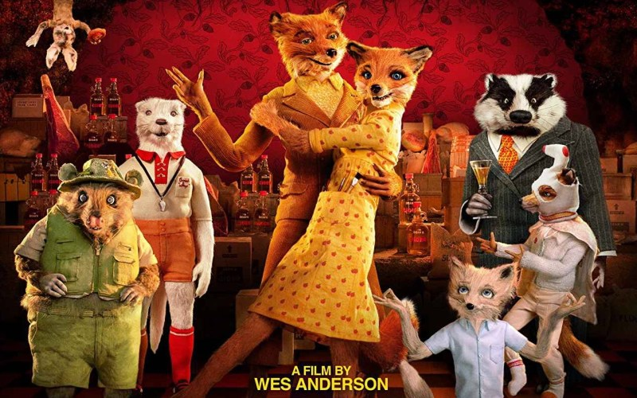
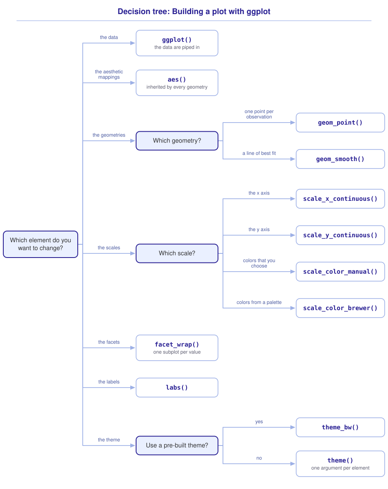

```{r}
#| include: false

source("src/r/course_functions.R")
source("src/r/reference_lookup.R")

lesson_refs <- find_lesson_references()
```

```{r}
#| label: setup
#| include: false

library(webexercises)
library(tidyverse)

knitr::opts_chunk$set(
  echo = TRUE,
  eval = TRUE,
  message = FALSE
)
```

<hr>

<div>
{.intro_image fig-alt="Course logo"}

Visualization is a fundamental part of the entire data science workflow, from visual inspection of the data we are processing to communicating our results to others. In this lesson we will explore, create, and modify a plot using the core tidyverse package *ggplot2* -- an extraordinarily powerful and well-designed plotting system. This lesson provides:

* A complete written guide that serves as a reference for ggplot2 and demonstrates how to incorporate pipes into plotting scripts
* An optional video introduction to ggplot (runtime: 32:24) for students who prefer a narrated demonstration

You will learn:

* The grammar of graphics
* Aesthetic mappings
* Geometries
* Modifying scales
* Labels
* Facets
* Themes

**Important!** Before starting this tutorial, be sure that you have completed all preliminary and previous lessons!

</div>

## Data for this lesson

<button class="accordion">Please click on the button below to explore the metadata for this lesson!</button>
::: panel
In this lesson, we will explore:

```{r}
#| echo: false
#| output: asis

lesson_metadata(.dataset = "chickadees.csv") %>%
  cat()
```
:::

## Background

The *ggplot2* package is built on the design principles of Leland Wilkinson's book [The Grammar of Graphics](https://www.amazon.com/Grammar-Graphics-Statistics-Computing/dp/0387245448){target="_blank"}.

The grammar of graphics considers the structure of a given data visualization to be defined by the:

* **Data**: The information being plotted
* **Aesthetic mappings**: How the data are mapped to visual attributes
* **Geometries**: The geometric objects used to display observations, such as points, lines, or bars.
* **Scales**: Maps from data to aesthetic space
* **Coordinate system**: Projection of data (e.g., x and y Cartesian coordinates)
* **Facets**: Subsets of data within a given plot (i.e., plots are broken into subplots based on some grouping variable)
* **Theme**: Styling of non-data elements in a plot

## Applying the grammar of graphics

Consider the plot below.

```{r}
#| echo: false

chickadees <-
  read_csv("data/raw/chickadees.csv")

chickadees %>%

  # Initialize the plot with the data:

  ggplot() +

  # Map data to visual elements:

  aes(
    x = fct_rev(sex)
  ) +

  # Add geometries:

  geom_bar(
    color = "black",
    fill = "#9eb8c5"
  ) +

  # Define scale elements:

  scale_y_continuous(
    limits = c(0, 500),
    expand = c(0, 0)
  ) +

  # Divide the plot into facets:

  facet_wrap(
    ~ spp,
    nrow = 2
  ) +
  coord_flip() +

  # Add labels:

  labs(
    title = "Number of chickadee captures by species and sex",
    x = "Sex",
    y = "Count"
  ) +

  # Modify the theme:

  theme_bw() +
  theme(
    axis.title =
      element_text(size = 14),
    plot.title =
      element_text(size = 14),
    strip.text =
      element_text(size = 14)
  )
```

## Set up your session

Please do the following to ensure that you are working in a clean session:

1. Please ensure that your **Global Environment** is empty.
2. In the *History* tab of your **workspace pane**, ensure that your **session history** is empty.

Now that we are working in a clean session:

1. Create a script file.
2. Save your script file as `scripts/ggplot_worksheet.R`.
3. Add metadata as a comment on the top of the file.
4. Following your metadata, create a new **code section** and call it "`setup`".
5. Following your section header, attach the packages that comprise the **core tidyverse**.

At this point, your script should look something like:

```{r}
#| eval: false

# My code for the ggplot tutorial

# setup --------------------------------------------------------

library(tidyverse)
```

In your script file, please provide a comment stating that you are reading in a file, then read `chickadees.csv` and bind the resulting data frame to the name `chickadees` in the global environment.

```{r}
# Chickadee captures:

chickadees <-
  read_csv("data/raw/chickadees.csv")
```

Let's take a quick look at the `chickadees` tibble:

```{r}
chickadees
```

## Plotting data

We begin a plot by adding the grammar of graphics data element with the *ggplot2* function `ggplot()`. We can supply the target data frame directly with `ggplot(data = chickadees)`. Because data is the first argument of `ggplot()`, it can also be piped in:

```{r}
chickadees %>%

  # Initialize the plot with the data:

  ggplot()
```

::: {.callout-note}

Although specifying `ggplot(data = chickadees)` is equally valid, piping data into `ggplot()` fits our left-to-right workflow and can enhance readability. This will become more apparent once we add more elements to our plot ...

:::

## Aesthetic mappings

After piping our data into ggplot, we need to decide which aesthetic mappings are appropriate for our question. It entirely depends on what we want to explore or visualize with our dataset. In this case, let's create a plot that compares wing length with mass. The relationship between body size and mass is commonly studied for birds and other wildlife. We will visualize wing as the predictor variable (x axis) and mass as the response variable (y axis).

Aesthetic mappings are supplied with the *ggplot2* function `aes()`. We supply the following arguments:

* The variable to map to the horizontal position (`x = `)
* The variable to map to the vertical position (`y = `)
* Any further variables to map to a visual attribute, such as `color = `, `fill = `, `shape = `, or `size = `

```{r}
chickadees %>%

  # Initialize the plot with the data:

  ggplot() +

  # Map data to visual elements:

  aes(
    x = wing,
    y = mass
  )
```

Notice that ggplot assigned the scale element to the visualization automatically. It chose the scale based on the limits of the data. By default, a continuous position scale adds padding equal to 5% of the data range on both ends.

::: mysecret

 [`+` is a different kind of pipe]{style="font-size: 1.25em; padding-left: 0.5em;"}

A plot has two kinds of connectors in it. We use `%>%` to move a data frame into `ggplot()` and `+` to add plot elements.

Let's look a little more deeply at the `+` sign. That function predates pipes in R but is conceptually similar. A traditional function-composition pipe passes the left-hand results of a process to an argument of the function on the right. The `+` function iteratively adds components to a plot. `+` exists because the code to generate plots with its predecessor (*ggplot*) was difficult to write and interpret due to deep nesting. The `+` function is a workaround to this issue. To distinguish `%>%` and base R's `|>` from ggplot's `+`, consider:

* `%>%` and `|>` perform function composition: noun → verb → result.
* ggplot2’s `+` performs object accumulation: noun + noun → updated noun.

In his [Personal history of the tidyverse](https://hadley.github.io/25-tidyverse-history){target="_blank"}, Hadley Wickham, the creator of *ggplot* and *ggplot2*, stated: "there would have been no need for ggplot2 had I discovered the pipe earlier, as ggplot was based on function composition."

:::

## Geometries

With our data mapped to our aesthetics, it is now time to add geometries to our plot. Each geometry function is written as `geom_` followed by the type of geometry.

### Scatterplot

To create a scatterplot, we want to add point geometries to our plot with the *ggplot2* function `geom_point()`. We supply the following arguments:

* The size of each point (`size = `)
* The transparency of each point, from 0 to 1 (`alpha = `)

```{r}
chickadees %>%

  # Initialize the plot with the data:

  ggplot() +

  # Map data to visual elements:

  aes(
    x = wing,
    y = mass
  ) +

  # Add geometries:

  geom_point()
```

We can add another geometry to the plot, a line of best fit, with the *ggplot2* function `geom_smooth()`. We supply the following arguments:

* The model used to fit the line (`method = `)
* The predictor and response variables (`formula = `)
* Whether to draw the standard error around the line (`se = `)

```{r}
chickadees %>%

  # Initialize the plot with the data:

  ggplot() +

  # Map data to visual elements:

  aes(
    x = wing,
    y = mass
  ) +

  # Add geometries:

  geom_point() +
  geom_smooth(
    method = "lm",
    formula = y ~ x,
    se = FALSE
  )
```

Black-capped chickadees are larger than Carolina chickadees. Let's add a new aesthetic mapping to the data that applies to both geometries. We could color the points and the line by species by adding individual aesthetic mapping arguments to both `geom_point()` and `geom_smooth()` ...

```{r}
chickadees %>%

  # Initialize the plot with the data:

  ggplot() +

  # Map data to visual elements:

  aes(
    x = wing,
    y = mass
  ) +

  # Add geometries:

  geom_point(
    aes(color = spp)
  ) +
  geom_smooth(
    aes(color = spp),
    method = "lm",
    formula = y ~ x,
    se = FALSE
  )
```

... or we can simplify our argument above by specifying the color aesthetic in our initial mapping.

```{r}
chickadees %>%

  # Initialize the plot with the data:

  ggplot() +

  # Map data to visual elements:

  aes(
    x = wing,
    y = mass,
    color = spp
  ) +

  # Add geometries:

  geom_point() +
  geom_smooth(
    method = "lm",
    formula = y ~ x,
    se = FALSE
  )
```

We have a lot of control over the style of our geometries. Perhaps we want our points to be a little larger, so we can use the `size = ` argument in `geom_point()`. To avoid a crazy-looking plot, we can add transparency with `alpha = `. We can further emphasize the trends by making the fitted lines wider with `linewidth = ` in `geom_smooth()`:

```{r}
chickadees %>%

  # Initialize the plot with the data:

  ggplot() +

  # Map data to visual elements:

  aes(
    x = wing,
    y = mass,
    color = spp
  ) +

  # Add geometries:

  geom_point(
    size = 2.75,
    alpha = 0.25
  ) +
  geom_smooth(
    method = "lm",
    formula = y ~ x,
    se = FALSE,
    linewidth = 1.5
  )
```

Plots like this say to me "I am more interested in seeing the trends, but I want others to also notice the underlying data."

## Modifying scales

We have thus far created a reasonable plot that perhaps conveys the information we would like to communicate. Our plot is not very pretty yet, though.

### Scales: numeric range

Let's start by modifying the range of the x and y axes. Before I scale an axis, I usually like to be sure what the limits of my data actually are. We can use `summary()` to figure that out.

```{r}
summary(chickadees)
```

We use the *ggplot2* functions `scale_y_continuous()` and `scale_x_continuous()` to scale the y and x axes. We supply the following arguments to each:

* A vector of the lower and upper limits of the values that we want to plot (`limits = `)
* How far the axis should extend beyond those limits (`expand = `)

The summary suggests limits of 7 to 13 g for mass and 50 to 70 mm for wing length. Setting `expand = c(0, 0)` ensures that each axis stops at our chosen values:

```{r}
chickadees %>%

  # Initialize the plot with the data:

  ggplot() +

  # Map data to visual elements:

  aes(
    x = wing,
    y = mass,
    color = spp
  ) +

  # Add geometries:

  geom_point(
    size = 2.75,
    alpha = 0.25
  ) +
  geom_smooth(
    method = "lm",
    formula = y ~ x,
    se = FALSE,
    linewidth = 1.5
  ) +

  # Define scale elements:

  scale_y_continuous(
    limits = c(7, 13),
    expand = c(0, 0)
  ) +
  scale_x_continuous(
    limits = c(50, 70),
    expand = c(0, 0)
  )
```

::: {.callout-warning}

`scale_*_continuous(limits = )` is not simply a visual zoom. Values outside of the defined limits are censored! This is especially problematic with geometries that call statistical functions like `geom_smooth()` -- observations outside of the scale are removed before the statistics are calculated.

:::

### Scales: colors

Color and fill are aesthetics. When a variable is mapped to one of them, a color or fill scale maps each data value to a displayed color. Colors can be specified with names such as `"orange"` or with hexadecimal codes such as `"#CA621E"`.

We can use the *ggplot2* function `scale_color_manual()` to change the color scale associated with a color mapping. We supply the following arguments:

* The title to give the legend, within quotes
* A vector of the colors to use, one per value of the mapped variable (`values = `)

To begin, I could choose colors by name:

```{r}
chickadees %>%

  # Initialize the plot with the data:

  ggplot() +

  # Map data to visual elements:

  aes(
    x = wing,
    y = mass,
    color = spp
  ) +

  # Add geometries:

  geom_point(
    size = 2.75,
    alpha = 0.25
  ) +
  geom_smooth(
    method = "lm",
    formula = y ~ x,
    se = FALSE,
    linewidth = 1.5
  ) +

  # Define scale elements:

  scale_y_continuous(
    limits = c(7, 13),
    expand = c(0, 0)
  ) +
  scale_x_continuous(
    limits = c(50, 70),
    expand = c(0, 0)
  ) +
  scale_color_manual(
    "Species",
    values = c("orange", "green")
  )
```

Or we can use hexadecimal color codes. One way to do this is by using a color picker app to find colors that we like online. I am going to use this image from the Fantastic Mr. Fox.

{fig-alt="A still from the film Fantastic Mr. Fox" style="width: 100%; padding-top: 15px; padding-bottom: 15px;"}

With this picture, I have chosen to go with a color from Kylie Sven Opossum's jacket (#595B18) and from the coat of Mr. Fox himself (#CA621E).

```{r}
chickadees %>%

  # Initialize the plot with the data:

  ggplot() +

  # Map data to visual elements:

  aes(
    x = wing,
    y = mass,
    color = spp
  ) +

  # Add geometries:

  geom_point(
    size = 2.75,
    alpha = 0.25
  ) +
  geom_smooth(
    method = "lm",
    formula = y ~ x,
    se = FALSE,
    linewidth = 1.5
  ) +

  # Define scale elements:

  scale_y_continuous(
    limits = c(7, 13),
    expand = c(0, 0)
  ) +
  scale_x_continuous(
    limits = c(50, 70),
    expand = c(0, 0)
  ) +
  scale_color_manual(
    values = c("#595B18", "#CA621E")
  )
```

This plot is probably great for Wes Anderson fans who do not suffer from red-green color blindness, but is not likely optimal otherwise.

I will stay with this version for now, but you give it a try. See if you can find a color scheme that you like (especially with a color picker app) and modify the plot to suit your color preference.

#### Brewed colors

One option for generating plots with colors is using a pre-made palette from the package *RColorBrewer*. We can see available default palettes with `RColorBrewer::display.brewer.all()`. To use an RColorBrewer palette, replace `scale_color_manual()` in the plot above with the *ggplot2* function `scale_color_brewer()`. We supply the following argument:

* The name of the palette, within quotes (`palette = `)

```{r}
#| eval: false

scale_color_brewer(palette = "Dark2")
```

*Note: I typically like to generate my own palettes, though!*

#### Colors that everyone can see

The palette from the film has a problem that has nothing to do with taste. Red-green combinations can be difficult for readers with common forms of color vision deficiency, and in this plot those colors carry the entire distinction between the species.

A **colorblind-safe** palette is one whose colors stay distinguishable to those readers. Masataka Okabe and Kei Ito published [such a palette](https://jfly.uni-koeln.de/color/){target="_blank"} that is now widely used, and it ships with R as `palette.colors(palette = "Okabe-Ito")`. I will take the blue and the vermillion from it:

```{r}
chickadees %>%

  # Initialize the plot with the data:

  ggplot() +

  # Map data to visual elements:

  aes(
    x = wing,
    y = mass,
    color = spp
  ) +

  # Add geometries:

  geom_point(
    size = 2.75,
    alpha = 0.25
  ) +
  geom_smooth(
    method = "lm",
    formula = y ~ x,
    se = FALSE,
    linewidth = 1.5
  ) +

  # Define scale elements:

  scale_y_continuous(
    limits = c(7, 13),
    expand = c(0, 0)
  ) +
  scale_x_continuous(
    limits = c(50, 70),
    expand = c(0, 0)
  ) +
  scale_color_manual(
    values = c("#0072B2", "#D55E00")
  )
```

## Facets

Facets separate a single plot into subplots. They can really help us visualize data because they support comparisons among groups while keeping the same mappings and geometry.

For example, perhaps we want to compare the relationship between wing length and mass across species, separately for female and male birds. We will keep our points and lines colored by species and add a facet for each sex with the *ggplot2* function `facet_wrap()`. We supply the following arguments:

* The variable to facet by, preceded by a tilde (`~ sex`)

```{r}
chickadees %>%

  # Initialize the plot with the data:

  ggplot() +

  # Map data to visual elements:

  aes(
    x = wing,
    y = mass,
    color = spp
  ) +

  # Add geometries:

  geom_point(
    size = 2.75,
    alpha = 0.25
  ) +
  geom_smooth(
    method = "lm",
    formula = y ~ x,
    se = FALSE,
    linewidth = 1.5
  ) +

  # Define scale elements:

  scale_y_continuous(
    limits = c(7, 13),
    expand = c(0, 0)
  ) +
  scale_x_continuous(
    limits = c(50, 70),
    expand = c(0, 0)
  ) +
  scale_color_manual(
    values = c("#0072B2", "#D55E00")
  ) +

  # Divide the plot into facets:

  facet_wrap(~ sex)
```

We have not made the most compelling labels for those facets. The way that I normally deal with this is changing the data to a factor and using the factor labels. Let's explore the sex variable:

```{r}
chickadees %>%
  count(sex)
```

We can use `factor()` to change this variable to a factor (*Note: We will learn a tidyverse approach to this in a future lesson!*):

```{r}
chickadees %>%
  mutate(
    sex =
      factor(
        sex,
        levels = c("F", "M"),
        labels = c("Female", "Male")
      )
  )
```

::: now_you
 [Now you!]{style="font-size: 1.25em; padding-left: 0.5em;"}

We specified `levels = ` as one of the arguments of the above `factor()` operation. Why was specifying `levels = ` not necessary to obtain the same result in this example?

*Hint: We first met `factor()` in **Preliminary Lesson 3: Values**.*

[Click here to see my answer]{.answer_link data-answer="a-2-5-levels"}

::: {.answer_body #a-2-5-levels}

By default, `factor()` sorts the levels of a factor alphanumerically. The values "F" and "M" are already in alphabetical order, so the default would have produced the same result. Supplying `levels = ` matters when the order that you want differs from the alphanumeric one, and it makes the order that you intended visible to anyone reading your code.

:::
:::

Let's see how it looks now when we plot it:

```{r}
chickadees %>%

  # Convert sex to factor:

  mutate(
    sex =
      factor(
        sex,
        levels = c("F", "M"),
        labels = c("Female", "Male")
      )
  ) %>%

  # Initialize the plot with the data:

  ggplot() +

  # Map data to visual elements:

  aes(
    x = wing,
    y = mass,
    color = spp
  ) +

  # Add geometries:

  geom_point(
    size = 2.75,
    alpha = 0.25
  ) +
  geom_smooth(
    method = "lm",
    formula = y ~ x,
    se = FALSE,
    linewidth = 1.5
  ) +

  # Define scale elements:

  scale_y_continuous(
    limits = c(7, 13),
    expand = c(0, 0)
  ) +
  scale_x_continuous(
    limits = c(50, 70),
    expand = c(0, 0)
  ) +
  scale_color_manual(
    values = c("#0072B2", "#D55E00")
  ) +

  # Divide the plot into facets:

  facet_wrap(~ sex)
```

## Labels

Now we will add some labels to our plot. In my data frames, I always use lowercase as my convention. It makes it easier on my fingers to call columns (no extra shift button to hit) and does not really affect the readability of the table. When it comes time to plot the data, however, it is pretty suboptimal.

We use the *ggplot2* function `labs()` to add labels. We supply the following arguments:

* The title to place above the plot (`title = `)
* The label for the horizontal axis, with units (`x = `)
* The label for the vertical axis, with units (`y = `)

The legend still carries the column name, `spp`. We change it by supplying a title as the first argument of `scale_color_manual()`:

```{r}
chickadees %>%

  # Initialize the plot with the data:

  ggplot() +

  # Map data to visual elements:

  aes(
    x = wing,
    y = mass,
    color = spp
  ) +

  # Add geometries:

  geom_point(
    size = 2.75,
    alpha = 0.25
  ) +
  geom_smooth(
    method = "lm",
    formula = y ~ x,
    se = FALSE,
    linewidth = 1.5
  ) +

  # Define scale elements:

  scale_y_continuous(
    limits = c(7, 13),
    expand = c(0, 0)
  ) +
  scale_x_continuous(
    limits = c(50, 70),
    expand = c(0, 0)
  ) +
  scale_color_manual(
    "Species",
    values = c("#0072B2", "#D55E00")
  ) +

  # Divide the plot into facets:

  facet_wrap(~ sex) +

  # Add labels:

  labs(
    title = "Wing length and mass of Black-capped and Carolina chickadees",
    x = "Wing length (mm)",
    y = "Mass (g)"
  )
```

## Themes

Now that we have a plot that we like (maybe ... my color choices were questionable at best ... hopefully you found better ones?), it is time to specify the **themes**. Recall that themes determine how the non-data elements look.

My preferred theme is `theme_bw()`. I usually use this as a starting point for my plots:

```{r}
chickadees %>%

  # Initialize the plot with the data:

  ggplot() +

  # Map data to visual elements:

  aes(
    x = wing,
    y = mass,
    color = spp
  ) +

  # Add geometries:

  geom_point(
    size = 2.75,
    alpha = 0.25
  ) +
  geom_smooth(
    method = "lm",
    formula = y ~ x,
    se = FALSE,
    linewidth = 1.5
  ) +

  # Define scale elements:

  scale_y_continuous(
    limits = c(7, 13),
    expand = c(0, 0)
  ) +
  scale_x_continuous(
    limits = c(50, 70),
    expand = c(0, 0)
  ) +
  scale_color_manual(
    "Species",
    values = c("#0072B2", "#D55E00")
  ) +

  # Divide the plot into facets:

  facet_wrap(~ sex) +

  # Add labels:

  labs(
    title = "Wing length and mass of Black-capped and Carolina chickadees",
    x = "Wing length (mm)",
    y = "Mass (g)"
  ) +

  # Modify the theme:

  theme_bw()
```

Now we can modify specific theme elements inside the *ggplot2* function `theme()`. We supply the following arguments:

* One argument per element that we would like to restyle, named for that element (e.g., `axis.text = `, `plot.title = `, `strip.text = `)

Each element is restyled by a matching function, so text elements are modified by passing arguments to `element_text()`. Note that `axis.text` names the tick labels along the axes. The axis titles are named by `axis.title`, and the title above the plot by `plot.title`.

The two facets in the plot above are close enough that the tick label at the right edge of one panel touches the tick label at the left edge of the next. The gap between panels is named by `panel.spacing`, and it is restyled by `unit()`, which takes a size and the units to measure it in. Let's make our tick labels larger and separate the panels:

```{r}
chickadees %>%

  # Initialize the plot with the data:

  ggplot() +

  # Map data to visual elements:

  aes(
    x = wing,
    y = mass,
    color = spp
  ) +

  # Add geometries:

  geom_point(
    size = 2.75,
    alpha = 0.25
  ) +
  geom_smooth(
    method = "lm",
    formula = y ~ x,
    se = FALSE,
    linewidth = 1.5
  ) +

  # Define scale elements:

  scale_y_continuous(
    limits = c(7, 13),
    expand = c(0, 0)
  ) +
  scale_x_continuous(
    limits = c(50, 70),
    expand = c(0, 0)
  ) +
  scale_color_manual(
    "Species",
    values = c("#0072B2", "#D55E00")
  ) +

  # Divide the plot into facets:

  facet_wrap(~ sex) +

  # Add labels:

  labs(
    title = "Wing length and mass of Black-capped and Carolina chickadees",
    x = "Wing length (mm)",
    y = "Mass (g)"
  ) +

  # Modify the theme:

  theme_bw() +
  theme(
    axis.text =
      element_text(size = 12),
    panel.spacing =
      unit(1.5, "lines")
  )
```

Be sure to look through the help file (`?theme`) at all of the various options that you have for changing the theme of a plot.

::: mysecret
 [Put `theme()` at the end of your ggplot code!]{style="font-size: 1.25em; padding-left: 0.5em;"}

I adjust my themes at the very end of my ggplot code. You typically need to adjust themes iteratively when you save a file. Having `theme()` at the end of your ggplot code section makes it easier to find and modify.
:::

## Putting it all together

At this point my hope is that you have a mental model for building a plot. It might look something like this (click to expand):

{.zoomable data-title="Decision tree: Building a plot with ggplot" data-pdf-key="ggplot" fig-alt="Decision tree. The first question is which element of the grammar of graphics you want to change. The data gives ggplot(), into which the data are piped. The aesthetic mappings give aes(), which is inherited by every geometry. The geometries lead to a further question, which geometry: one point per observation gives geom_point(), and a line of best fit gives geom_smooth(). The scales lead to a further question, which scale: the x axis gives scale_x_continuous(), the y axis gives scale_y_continuous(), colors that you choose give scale_color_manual(), and colors from a palette give scale_color_brewer(). The facets give facet_wrap(), which draws one subplot per value. The labels give labs(). The theme leads to a further question, whether to use a pre-built theme: yes gives theme_bw(), and no gives theme(), which takes one argument per element."}



::: {.callout-note}

As in ***2.1 Introduction to subsetting and extraction***, this tree is a visualization of *my* mental model for these functions. It is totally okay if your model differs! What is important is that you have a *working* model, a system in place that allows you to retrieve the function or functions that you need to solve a problem.

:::

## Take-home points

* A plot is built from the elements of the grammar of graphics. Naming the element that you want to change is the fastest way to find the function that changes it.
* Pipe the data into `ggplot()` with `%>%`, then add every element after that with `+`.
* An aesthetic mapping supplied to `aes()` is inherited by every geometry in the plot. A mapping supplied inside a single `geom_` function applies to that geometry alone.
* Scales govern more than the axes. The range of an axis and the colors assigned to a variable are both scaling operations.
* Choose a colorblind-safe palette. A distinction carried by colors that a reader cannot tell apart is lost to that reader.
* Facets split one plot into subplots by the values of a variable, so the labels on those subplots are the values themselves. Change the values, and you change the labels.
* A pre-built theme such as `theme_bw()` sets every non-data element at once. `theme()` restyles the elements you name, one argument each. Adjust the theme last: themes are tuned iteratively against a saved file, and keeping `theme()` at the end of the chain makes it easy to find.

## Exercises

::: now_you
 [Test your knowledge!]{style="padding-left: 0.5em;"}

1. Every function below was used to build the plot above. Match each one to the element of the grammar of graphics that it represents. Click a function, then click its element; when you are finished, select **Check My Matches**.

```{r}
#| echo: false
#| results: asis

matching_game(
  .id = "m-2-5-01",
  .pairs =
    tibble(
      left =
        c(
          "<code>ggplot()</code>",
          "<code>aes()</code>",
          "<code>geom_bar()</code>",
          "<code>scale_y_continuous()</code>",
          "<code>coord_flip()</code>",
          "<code>facet_wrap()</code>",
          "<code>element_text()</code>"
        ),
      right =
        c(
          "Data",
          "Aesthetic mappings",
          "Geometries",
          "Scales",
          "Coordinate system",
          "Facets",
          "Theme"
        )
    )
)
```
:::


2. You want to keep species mapped to color but replace ggplot2's default colors with two colorblind-safe colors. Which element of the grammar of graphics should you alter?

`r longmcq(c("Aesthetic mappings", "Geometries", answer = "Scales", "Theme"))`

3. You want the points in a scatterplot colored by species, and you want that same coloring to apply to a line of best fit drawn on the same plot. Where should the color mapping go?

`r longmcq(c(answer = "In the aes() call that follows ggplot(), so that both geometries inherit it", "In geom_point() only", "In geom_smooth() only", "In labs(), because color is a label"))`

4. Parsons Problem: Reorder the lines below to plot mass against wing length, color the points by species, facet by sex, label the axes, and apply `theme_bw()`. One line pipes a geometry rather than adding it. Leave it in the trash.

<div class="parsons-problem">
<div id="p-2-5-01-trash" class="sortable-code"></div>
<div id="p-2-5-01-sortable" class="sortable-code"></div>
<div style="clear: both;"></div>
<button id="p-2-5-01-check" class="parsons-btn parsons-btn-check" type="button">Check My Order</button>
<button id="p-2-5-01-reset" class="parsons-btn parsons-btn-reset" type="button">Shuffle Again</button>
<p id="p-2-5-01-feedback" class="parsons-feedback"></p>
</div>

## Optional introductory video



<script>
window.parsonsProblems = window.parsonsProblems || [];
window.parsonsProblems.push({
  id: "p-2-5-01",
  maxDistractors: 1,
  code: "chickadees %>%\n  ggplot() +\n  aes(\n    x = wing,\n    y = mass,\n    color = spp\n  ) +\n  geom_point() +\n  facet_wrap(~ sex) +\n  labs(\n    x = \"Wing length (mm)\",\n    y = \"Mass (g)\"\n  ) +\n  theme_bw()\n  %>% geom_point() #distractor"
});
</script>
:::


