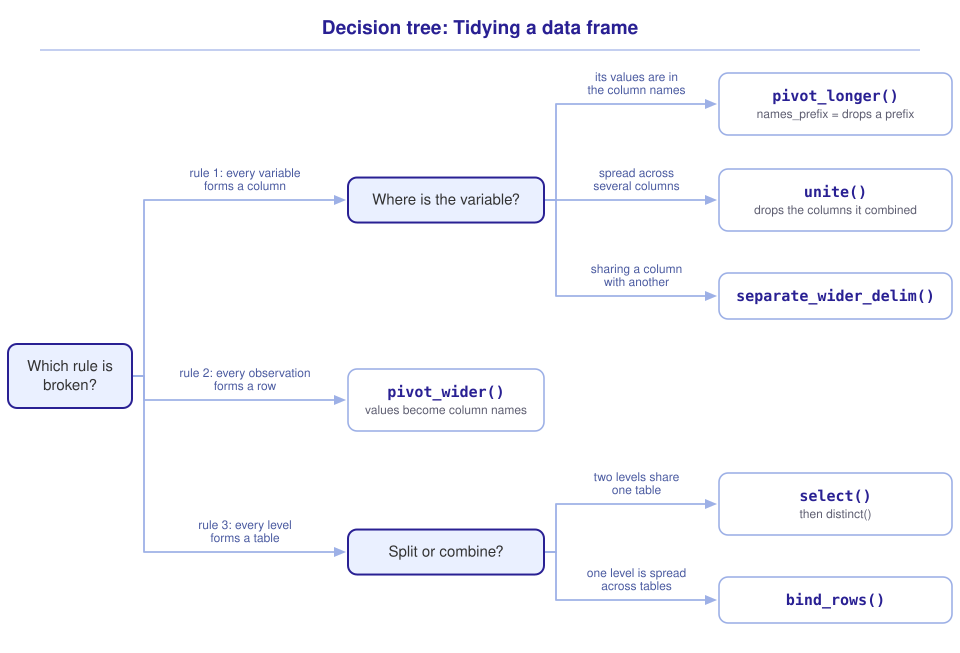

```{r}
#| include: false

source("src/r/course_functions.R")
source("src/r/reference_lookup.R")

lesson_refs <- find_lesson_references()
```

```{r}
#| label: setup
#| include: false

library(webexercises)
library(tidyverse)

knitr::opts_chunk$set(
  echo = TRUE,
  eval = TRUE,
  error = TRUE
)
```

<hr>

<div>
{.intro_image fig-alt="Course logo"}

You will hear me say this a lot, but the tidyverse is not simply a set of functions or packages built for working with data. Instead, it is built around a consistent way of using R that draws on long-established standards in data engineering. At the foundation of the tidyverse are the rules that govern **tidy data**. These rules represent a recommended structure for your data that ensures that your data are robust against errors, easy to modify, and easy to work with. In this lesson, you will learn:

* Why tidy data is an important consideration in data management
* The three tidy data rules and their relationship to database normalization
* How to recognize the most common ways that a dataset violates those rules
* How redundant information can make a dataset disagree with itself
* How data tidying differs from data cleaning
* How to tidy a messy dataset with *dplyr* and *tidyr* functions

**Important!** Before starting this lesson, be sure that you have completed all preliminary and previous lessons!

</div>

## Data for this lesson

<button class="accordion">Please click on the button below to explore the metadata for this lesson!</button>
::: panel

In this lesson, we will explore:

```{r}
#| echo: false
#| output: asis

lesson_metadata(.dataset = "messy_weather.csv") %>%
  cat()
```
:::

## Set up your session

Please do the following to ensure that you are working in a clean session:

1. Please ensure that your **Global Environment** is empty.
2. In the *History* tab of your **workspace pane**, ensure that your **session history** is empty.

Now that we are working in a clean session:

1. Create a script file.
2. Save your script file as `scripts/tidy_data_written_content.R`.
3. Add metadata as a comment on the top of the file.
4. Following your metadata, create a new **code section** and call it "`setup`".
5. Following your section header, attach the packages that comprise the **core tidyverse**.

At this point, your script should look something like:

```{r}
#| eval: false

# My code for the tidy data tutorial

# setup --------------------------------------------------------

library(tidyverse)
```

Let's read in the data and have a look at the object:

```{r}
#| message: false

weather <-
  read_csv("data/raw/messy_weather.csv")

weather
```

We have 165 rows and 40 columns. Before we can decide what to do about this file, we need a vocabulary for describing what is wrong with it.

## The vocabulary of tidy data

The tidy data rules were formalized by Hadley Wickham in a 2014 paper in the *Journal of Statistical Software* ([Wickham 2014](https://vita.had.co.nz/papers/tidy-data.pdf){target="_blank"}). The rules rest on four terms that have a specific meaning in this context:

* A **value** is a single recorded entry in a dataset. The number 37.9 in the first row of the latitude column is formally a value.
* A **variable** is the full set of values that measure the same attribute. Elevation is a variable in our dataset because every elevation value measures the same attribute of a station: its height above sea level.
* An **observation** is the full set of values measured on the same observational unit across attributes. In this dataset, one day at one weather station is an observation.
* An **observational unit** is the *kind of entity* that is being measured. Wickham uses this term for what I will more often call a **level of observation**. In our weather file there are two levels of observation, because some of the recorded values describe a station and some of them describe a day at a station.

With that vocabulary in place, the three rules of tidy data are:

1. Every variable forms a column.
2. Every observation forms a row.
3. Every type of observational unit forms a table. I state this rule as **every level of observation forms a table**, and that is the phrasing I would like you to use.

Wickham's tidy data rules are a restatement, in statistical language, of the third normal form of relational database design ([Codd 1990](https://dl.acm.org/doi/book/10.5555/77708){target="_blank"}). Database engineers have relied on these rules for decades. Wickham added the translation, and the recognition that a single standard structure allows a set of tools to work together.

::: {.callout-tip}

What constitutes a value, variable, observation, or observational unit is not dependent on the current structure of a dataset nor is it defined by the dataset. For example, although precipitation, snow, and temperature on a given day at a given station collectively form an observation, `messy_weather.csv` is not formatted in this way. Our goal is to use the tidy data rules to govern how we structure the data.

:::

## Rule 1: Every variable forms a column

One variable forms one column, and one column represents one variable. This rule can be broken from either direction: a dataset can record a variable that no column represents, and a single column can represent more than one variable.

### Recognizing a violation of rule 1

Our weather file breaks this rule in three ways.

**Column headers are values rather than variable names.** The day of the month is a variable, because every one of its values measures the same attribute. In `messy_weather.csv` the days are stored as the column names `march_1` through `march_31`, which puts the values of the day variable in the header row and leaves the variable itself without a column.

**One variable is split across several columns.** For the analyses in this course, we will treat the date on which a measurement was taken as one variable. This file records it in three places: the `year` column, the `month` column, and the column names. Moving the days into a column will not settle this. It will leave the date split across three columns rather than across two columns and a header row.

**More than one variable is stored in a single column.** The rows in which `variable` is "temperature_min_max" record a daily minimum and a daily maximum separated by a colon. These measure two different attributes, so they are two variables sharing one column.

### Fixing the first violation of rule 1

Let's start with the day variable, whose values are stored as column names. To move a set of columns into rows, we use the *tidyr* function `pivot_longer()`, supplying the columns to stack along with `names_to = ` and `values_to = `:

```{r}
weather %>%
  pivot_longer(
    march_1:march_31,
    names_to = "day",
    values_to = "value"
  )
```

We now have 5,115 rows, which is 165 rows multiplied by the 31 columns that we stacked. The `day` column now records what used to be column names, and the `value` column records the measurements.

::: mysecret
 [Why do I need quotes for `names_to` and `values_to`?]{style="font-size: 1.25em; padding-left: 0.5em;"}

Recall from Module 1 that a **name** is a symbol that R evaluates to retrieve an object. We supplied `march_1` through `march_31` as bare names because the first argument of `pivot_longer()` uses tidy-selection syntax to select columns from the data frame.

The `names_to = ` and `values_to = ` arguments have a different interface. Their job is to receive the text of the new column names, and each argument requires a character value. That is why we supply `"day"` and `"value"` within quotes.

**Whether a column name is bare or quoted depends on the interface of the function and argument.** Here, the columns that we select use bare names, while `names_to = ` and `values_to = ` require the new names as character values.
:::

::: now_you
 [Now you!]{style="font-size: 1.25em; padding-left: 0.5em;"}

Have a look at the values in the `day` column. What are they carrying that this data frame already records somewhere else?

[Click here to see my answer]{.answer_link data-answer="a-2-6-day"}

::: {.answer_body #a-2-6-day}

Every value begins with "march_". The month of a record is already stored in the `month` column, so each `day` value repeats a fact that this data frame records somewhere else.

:::
:::

Each column in a table should describe the observation directly. The month carried inside each `day` value repeats the information in the `month` column, so the same fact has been written down in two places. The "march_" prefix is **redundant information**.

Removing redundancy like this is a primary goal of normalizing data.

*Note: A transitive dependence is more specific. It occurs when a non-key attribute depends on another non-key attribute that, in turn, depends on the key. The "march_" prefix is a simpler case of redundant information.*

::: callout-note

## Why is redundant information an issue?

Managing datasets that record the same information more than once can cause problems. In our example, if a record's `month` were corrected from 3 to 4 and its `day` values were left as "march_1", the row would disagree with itself. Removing the prefix leaves one place where the month of a record is written down.

:::

The `names_prefix = ` argument of `pivot_longer()` removes a prefix from each column name as that name is stacked into the new column:

```{r}
weather_long <-
  weather %>%
  pivot_longer(
    march_1:march_31,
    names_to = "day",
    names_prefix = "march_",
    values_to = "value"
  )

weather_long
```

The day of the month is now recorded in a single column, and the month is written down in one place.

### Fixing the second violation of rule 1

The date on which a measurement was taken is still spread across the `year`, `month`, and `day` columns. To combine several columns into one, we use the *tidyr* function `unite()`, supplying `col = `, the columns to combine, and `sep = `:

```{r}
weather_dated <-
  weather_long %>%
  unite(
    col = "date",
    year,
    month,
    day,
    sep = "-"
  )

weather_dated
```

The date of a measurement is now recorded in one column. Notice that `unite()` removed the three columns that went into it. Had it left them in place, the same date would have been recorded both as a whole and as three separate parts.

*Note: The values in `date` are character values, and they are not written in the international standard format for dates (ISO 8601), which records the first of March 2010 as "2010-03-01" rather than "2010-3-1". We will cover date formats, and how to convert a date to the standard, later in the course.*

::: mysecret
 [We will treat a date as one variable!]{style="font-size: 1.25em; padding-left: 0.5em;"}

For the analyses in this course, the moment at which an observation was made is one attribute of that observation. Other analyses may treat year, month, or day as variables in their own right.

The cost of the split appears whenever you need to work with the date as a whole. Measuring the days between two events, for example, begins by rebuilding and converting it. Keeping the date together gives everyone who uses the data the same representation of that moment.

**If your analysis treats the time of day as part of that moment, include it in the same variable.** A measurement taken at 14:30 on the first of March 2010 was made at one moment, which the international standard writes as "2010-03-01T14:30:00".
:::

Our third violation of rule 1 is still out of reach. The minimum and maximum temperatures are in the `value` column, and the label "temperature_min_max" is in the `variable` column, so there is no temperature column to split yet. We will return to it once rule 2 is satisfied.

## Rule 2: Every observation forms a row

Each observation forms one row. In `messy_weather.csv`, one day at one station is an observation, so a tidy version of this file has one row for each station on each day.

### Recognizing a violation of rule 2

Our weather file breaks this rule in one way.

**Variables are spread across both rows and columns.** The `variable` column records the *names* of variables rather than measured values, which puts precipitation, snowfall, and temperature down the rows while the days run across the columns. One day at one station is therefore scattered across three rows, contributing one measurement to each. Wickham singles this arrangement out as the hardest kind of messiness to untangle, and it is the violation that takes the longest to see.

*Note: A single problem often breaks more than one rule. Storing the days as column names breaks rule 1 because the day variable has no column, and it breaks rule 2 because each row records 31 observations rather than one.*

::: now_you
 [Now you!]{style="font-size: 1.25em; padding-left: 0.5em;"}

The paragraph above states that the `variable` column records the names of three variables. Check that claim against `weather_dated`.

*Hint: We extracted a column and assessed its unique values with `pull()` in **2.1 Introduction to subsetting and extraction**.*

[Click here to see my answer]{.answer_link data-answer="a-2-6-variable"}

::: {.answer_body #a-2-6-variable}

```{r}
weather_dated %>%
  pull(variable) %>%
  unique()
```

:::
:::

### Fixing the violation of rule 2

Next is the `variable` column, which contains variable names rather than measured values. The remedy is the inverse of what we just did, which is to move the values of a column back out into separate columns. For this we use the *tidyr* function `pivot_wider()`, supplying `names_from = ` and `values_from = `:

```{r}
weather_wide <-
  weather_dated %>%
  pivot_wider(
    names_from = variable,
    values_from = value
  )

weather_wide
```

We are down to 1,705 rows, which is 5 stations multiplied by 11 years multiplied by 31 days. Each row is now a single day at a single station, and precipitation, snowfall, and temperature each have a column.

::: now_you
 [Now you!]{style="font-size: 1.25em; padding-left: 0.5em;"}

That accounting assumes every station contributed the same number of rows. Return the number of rows that each station contributes to `weather_wide`.

*Hint: We counted the records in each group with `count()` in **2.3 Grouped operations and summarizing**.*

[Click here to see my answer]{.answer_link data-answer="a-2-6-count-station"}

::: {.answer_body #a-2-6-count-station}

```{r}
weather_wide %>%
  count(station)
```

:::
:::

### Returning to the third violation of rule 1

That leaves `temperature_min_max`, which records two measurements separated by a colon. We split one column into several with the *tidyr* function `separate_wider_delim()` (see ***2.4 Reshaping data frames***), supplying the column that we would like to split, the delimiter (`delim = `), and a character vector of names for the resulting columns (`names = `):

```{r}
weather_split <-
  weather_wide %>%
  separate_wider_delim(
    temperature_min_max,
    delim = ":",
    names = c("temperature_min", "temperature_max")
  )

weather_split
```

Every variable in this table now forms one column, and every column represents one variable.

## Rule 3: Every level of observation forms a table

A dataset that records some values about stations and other values about days has two levels of observation, and each of those levels forms a table. A table that breaks this rule still looks perfectly ordinary, which is what makes the violation easy to miss.

### Recognizing a violation of rule 3

A useful signal of this violation is a set of attributes that repeats for every record belonging to the same higher-level unit. Repetition alone is not enough, because legitimate observation-level values can also repeat. In our weather file, the latitude of the Berkeley station is recorded 33 times alongside its other station attributes. Latitude is an attribute of a station, not of a March day, so this pattern is evidence of a second level of observation in this table.

**More than one level of observation is stored in a single table.** The columns `longitude`, `latitude`, `elevation`, `state`, and `name` describe a station. The daily measurements describe a day at a station. Our file stores both levels together.

::: mysecret
 [Repeated attributes can be the signal!]{style="font-size: 1.25em; padding-left: 0.5em;"}

When station attributes are copied onto every station-day record, each copy can be edited in one row and missed in another. This is how the same station comes to be recorded with two different latitudes.

Splitting a table by its levels of observation records each fact exactly once, which is the whole reason that the third rule exists.
:::

### Fixing the violation of rule 3

Our data now satisfy the first two rules of tidy data, but the station attributes are still repeated on every one of the 1,705 rows. To satisfy the third rule, we need to split this table into one table per level of observation.

The station table is the smaller of the two. We first select the columns that describe a station, then use the *dplyr* function `distinct()` to return one row per station:

```{r}
stations <-
  weather_split %>%
  select(
    station,
    longitude,
    latitude,
    elevation,
    state,
    name
  ) %>%
  distinct()

stations
```

Five rows for five stations. The `station` column is the **primary key** of this table because its values uniquely identify each row.

The observation table records everything that was measured on a given day at a given station, which we subset to with `select()`:

```{r}
observations <-
  weather_split %>%
  select(
    station,
    date,
    precip,
    snow,
    temperature_min,
    temperature_max
  )

observations
```

Here, `station` is a **foreign key** that refers back to the primary key of `stations`, and the combination of `station` and `date` forms the **compound key** of this table (i.e., neither column identifies a row on its own, but together they do).

::: now_you
 [Now you!]{style="font-size: 1.25em; padding-left: 0.5em;"}

Splitting the table into two did not sever the connection between them. In a single piped statement, attach the `name` of each station to the observation table, without carrying any other station column along with it.

*Hint: We joined two tables on a shared key with `left_join()` in **2.4 Reshaping data frames**, where I also recommended joining only the columns that you want.*

[Click here to see my answer]{.answer_link data-answer="a-2-6-join-name"}

::: {.answer_body #a-2-6-join-name}

```{r}
observations %>%
  left_join(
    stations %>%
      select(station, name),
    by = "station"
  )
```

:::
:::

::: mysecret
 [Tidy data is a structure, not a function!]{style="font-size: 1.25em; padding-left: 0.5em;"}

Tidying is a decision that you make about what your variables and your levels of observation are, followed by whichever functions carry out that decision. No single function can determine how to tidy an arbitrary dataset. Two people given the same messy file may reasonably produce different tidy versions of it, because they have defined the observational units differently.

This is why I ask you to write down what each level of observation is *before* you write any code. The functions are the easy part.
:::

::: now_you
 [Now you!]{style="font-size: 1.25em; padding-left: 0.5em;"}

In a single piped statement, and without using any of the objects we assigned along the way:

* Read in `messy_weather.csv`;
* Stack the day columns into a `day` column and a `value` column, dropping the "march_" prefix;
* Build a `date` column, dropping the three columns that went into it;
* Move the values of `variable` out into their own columns;
* Split `temperature_min_max` into `temperature_min` and `temperature_max`;
* Subset to the six columns of the observation table;
* Assign the resultant object to your global environment with the name `daily_weather`.

*Hint: We used `pivot_longer()`, `pivot_wider()`, `unite()`, and `separate_wider_delim()` in **2.4 Reshaping data frames**.*

[Click here to see my answer]{.answer_link data-answer="a-2-6-tidy"}

::: {.answer_body #a-2-6-tidy}

```{r}
#| message: false

daily_weather <-
  read_csv("data/raw/messy_weather.csv") %>%
  pivot_longer(
    march_1:march_31,
    names_to = "day",
    names_prefix = "march_",
    values_to = "value"
  ) %>%

  # Combine the year, month, and day columns into one date:

  unite(
    col = "date",
    year,
    month,
    day,
    sep = "-"
  ) %>%
  pivot_wider(
    names_from = variable,
    values_from = value
  ) %>%
  separate_wider_delim(
    temperature_min_max,
    delim = ":",
    names = c("temperature_min", "temperature_max")
  ) %>%
  select(
    station,
    date,
    precip,
    snow,
    temperature_min,
    temperature_max
  )

daily_weather
```

:::
:::

## Tidying is not cleaning

Our data now satisfy all three tidy data rules, and the measurements are still character vectors. Have a look:

```{r}
observations
```

Converting those columns to numeric is a **data cleaning** step. Cleaning corrects the *content* of a dataset, which includes classes, units, misspellings, impossible values, and missing data codes. Tidying corrects the *structure* of a dataset, which is what the three rules govern. A dataset can be perfectly tidy and full of errors, and it can be scrupulously clean and completely untidy.

The distinction matters because the two are done for different reasons and at different points in a workflow, and because a tidy dataset is far easier to clean than a messy one. Now that each variable has a column, we can convert all four of them in one step. The *dplyr* function `across()` applies the same change to a selection of columns, and we call it inside `mutate()`. To `across()` we supply the following arguments:

* The columns that we would like to modify
* The function to apply to each of them

```{r}
observations <-
  observations %>%
  mutate(
    across(precip:temperature_max, as.numeric)
  )

observations
```

*Note: The `across()` function allows you to apply a function to a selection of columns inside of `mutate()` or `summarize()`. We will use it a lot in this course.*

## Working with the tidy data

Tidy structure is not a matter of taste. Every question that we are about to ask of these data is now a short pipe, whereas each was much more difficult when the lesson began.

Both temperatures shared a column at the start, and a single day at a single station was spread across three rows. Now that each variable has a column, a grouped summary is one statement (see ***2.3 Grouped operations and summarizing***):

```{r}
observations %>%
  summarize(
    mean_min = mean(temperature_min, na.rm = TRUE),
    mean_max = mean(temperature_max, na.rm = TRUE),
    .by = station
  )
```

A plot of the daily minimum against the daily maximum was equally out of reach, because the two measurements sat in one column and the days ran across the header row. We can now map each of them to an axis, and draw a panel for each station by joining its name from the `stations` table (see ***2.4 Reshaping data frames*** and ***2.5 Introduction to data visualization with ggplot2***):

```{r}
#| warning: true
#| fig-alt: "Five faceted scatterplots show a positive relationship between daily minimum and maximum March temperatures at five weather stations. Berkeley occupies the narrowest temperature range, while Madison and Ithaca span much wider ranges."

observations %>%
  left_join(
    stations %>%
      select(station, name),
    by = "station"
  ) %>%
  ggplot() +
  aes(
    x = temperature_min,
    y = temperature_max
  ) +
  geom_point(
    size = 1.5,
    alpha = 0.15
  ) +
  geom_smooth(
    method = "lm",
    formula = y ~ x,
    se = FALSE,
    color = "#0072B2",
    linewidth = 1.2
  ) +
  facet_wrap(~ name) +
  labs(
    title = "Daily March temperatures, 2010 to 2020",
    x = "Minimum temperature (°C)",
    y = "Maximum temperature (°C)"
  ) +
  theme_bw()
```

*Note: ggplot2 reports the 23 rows that it left out, which are the days on which a minimum or a maximum temperature was not recorded.*

The Berkeley panel occupies a narrow corner of the plot, while the Madison and Ithaca panels stretch across it.

::: now_you
 [Now you!]{style="font-size: 1.25em; padding-left: 0.5em;"}

In a single piped statement, return the highest maximum temperature recorded at each station, labelled with the station's name rather than its code.

*Hint: You will need `left_join()` from **2.4 Reshaping data frames** and the `.by = ` argument from **2.3 Grouped operations and summarizing**.*

[Click here to see my answer]{.answer_link data-answer="a-2-6-max-temperature"}

::: {.answer_body #a-2-6-max-temperature}

```{r}
observations %>%
  left_join(
    stations %>%
      select(station, name),
    by = "station"
  ) %>%
  summarize(
    max_temperature = max(temperature_max, na.rm = TRUE),
    .by = name
  )
```

:::
:::

## Putting the rules together

We have now met all three rules, seen how `messy_weather.csv` broke each of them, and repaired the damage. Let's step back and look at the whole picture again.

My mental model for that picture looks like this (click to expand):

{.zoomable data-title="Decision tree: Tidying a data frame" data-pdf-key="tidying" fig-alt="Decision tree. The first question is which tidy data rule is broken. Rule 1, every variable forms a column, leads to a further question, where is the variable: its values are in the column names gives pivot_longer(), whose names_prefix argument drops a prefix; spread across several columns gives unite(), which drops the columns it combined; and sharing a column with another gives separate_wider_delim(). Rule 2, every observation forms a row, gives pivot_wider(), where the values become column names. Rule 3, every level forms a table, leads to a further question, split or combine: two levels share one table gives select(), followed by distinct(), and one level is spread across tables gives bind_rows()."}



::: {.callout-note}

As in ***2.1 Introduction to subsetting and extraction***, this tree is a visualization of *my* mental model for these functions. It is totally okay if your model differs! What is important is that you have a *working* model, a system in place that allows you to retrieve the function or functions that you need to solve a problem.

:::

::: mysecret
 [Five ways that data go messy!]{style="font-size: 1.25em; padding-left: 0.5em;"}

Wickham catalogues five problems that account for most messy datasets ([Wickham 2014](https://vita.had.co.nz/papers/tidy-data.pdf){target="_blank"}). Each one breaks a rule that we have now covered:

* Column headers are values rather than variable names (rule 1).
* More than one variable is stored in a single column (rule 1).
* Variables are spread across both rows and columns (rule 2).
* More than one level of observation is stored in a single table (rule 3).
* One level of observation is spread across multiple tables (rule 3).

Our weather file has the first four. You will meet the fifth the first time a colleague hands you a folder of files with one year, site, or species in each.
:::

::: now_you
 [Check your understanding]{style="padding-left: 0.5em;"}

Match each problem in `messy_weather.csv` to the rule that it breaks. Click a problem, then click its rule; when you are finished, select **Check My Matches**.

```{r}
#| echo: false
#| results: asis

matching_game(
  .id = "m-2-6-01",
  .pairs =
    tibble(
      left =
        c(
          "The days of the month are stored as the column names <code>march_1</code> through <code>march_31</code>",
          "<code>temperature_min_max</code> records a daily minimum and a daily maximum, separated by a colon",
          "The <code>variable</code> column records the names precip, snow, and temperature_min_max",
          "<code>longitude</code>, <code>latitude</code>, <code>elevation</code>, <code>state</code>, and <code>name</code> repeat across all records belonging to the same station"
        ),
      right =
        c(
          "Rule 1: no column represents the day variable",
          "Rule 1: one column represents two variables",
          "Rule 2: one day at one station is spread across three rows",
          "Rule 3: two levels of observation share one table"
        )
    )
)
```
:::

## Saving the tidy data

Because our tidy dataset is two tables that belong together, we can store them as a single list and write that list to a `.rds` file:

```{r}
#| eval: false

list(
  stations = stations,
  observations = observations
) %>%
  write_rds("data/processed/weather_tidy.rds")
```

You will meet `weather_tidy.rds` again in later lessons, and it will be a great deal more pleasant to work with than the file we started from.

## Take-home points

* Tidy data is a set of structural rules, not a set of functions. Data that follow the rules are easier to modify, easier to plot, and errors within them are far easier to find.
* Every variable forms a column, every observation forms a row, and every level of observation forms a table.
* A level of observation (Wickham's "observational unit") is the kind of entity that is being measured. A set of attributes that repeats for every record belonging to the same higher-level unit is a useful signal that a table records more than one level.
* Most messiness comes from a short list of problems, and each of those problems has a matching *tidyr* or *dplyr* remedy.
* Tidying corrects the structure of a dataset and cleaning corrects its content. The three rules govern structure alone, so a class conversion is a cleaning step no matter how untidy the data look.
* When the same information is recorded in more than one place, the copies can disagree. Removing redundant information leaves one place where each fact is recorded.
* Tables that describe different levels of observation are reconnected by a primary key and its matching foreign key, rather than by being stored together in one wide table.

## Exercises

::: now_you
 [Test your knowledge!]{style="padding-left: 0.5em;"}

1. A table of bird captures repeats the common name, foraging strategy, and diet of a species alongside every capture record. Which tidy data rule does this table violate?

   `r longmcq(c("Every variable forms a column", "Every observation forms a row", answer = "Every level of observation forms a table", "None -- the table is tidy"))`

2. In `messy_weather.csv`, the column names `march_1` through `march_31` are values of a day variable. Which function moves those column names into a single column?

   `r longmcq(c(answer = "pivot_longer()", "pivot_wider()", "separate_wider_delim()", "distinct()"))`

3. True or false: An observational unit is the kind of entity being measured, so a dataset with measurements taken on both stations and days has two levels of observation.

   `r torf(TRUE)`

4. Parsons Problem: Reorder the lines below to read `messy_weather.csv` and stack its day columns into a `day` column and a `value` column. One line assigns the column names to the wrong destination. Leave it in the trash.

   <div class="parsons-problem">
   <div id="p-2-6-01-trash" class="sortable-code"></div>
   <div id="p-2-6-01-sortable" class="sortable-code"></div>
   <div style="clear: both;"></div>
   <button id="p-2-6-01-check" class="parsons-btn parsons-btn-check" type="button">Check My Order</button>
   <button id="p-2-6-01-reset" class="parsons-btn parsons-btn-reset" type="button">Shuffle Again</button>
   <p id="p-2-6-01-feedback" class="parsons-feedback"></p>
   </div>

   <script>
   window.parsonsProblems = window.parsonsProblems || [];
   window.parsonsProblems.push({
     id: "p-2-6-01",
     maxDistractors: 1,
     code: "read_csv(\"data/raw/messy_weather.csv\") %>%\n  pivot_longer(\n    march_1:march_31,\n    names_to = \"day\",\n    values_to = \"value\"\n  )\n    names_to = \"value\", #distractor"
   });
   </script>
:::


