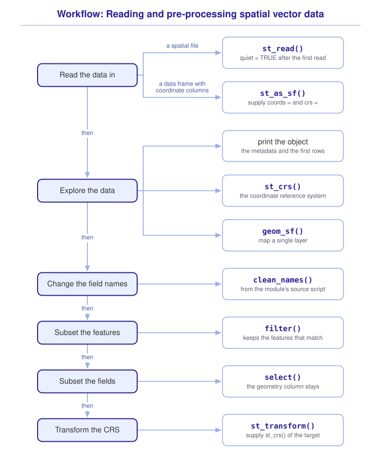

```{r}
#| include: false

library(webexercises)

source("src/r/course_functions.R")
source("src/r/reference_lookup.R")

lesson_refs <- find_lesson_references()
```
<hr>

## Overview

{.intro_image fig-alt="Course logo"}

This tutorial is our first foray into using R as a GIS! An optional video provides another route through some of the same ideas. In this lesson, we will explore how to read and preprocess spatial vector data. Material covered will include:

* Reading spatial vector data with `st_read()`
* Converting coordinate columns to a simple features object
* Source scripts!
* Functions for data exploration
* Subsetting features and fields
* Transforming a CRS

**Important!** Before starting this tutorial, be sure that you have completed all of the previous lessons in this course!

## Data for this lesson

Please click on the buttons below to explore the metadata for this lesson!

<button class="accordion">Metadata: Written lesson</button>
::: panel
In the written portion of this lesson, we will explore:

```{r}
#| echo: false
#| output: asis

lesson_metadata(
  .dataset =
    c(
      "capital_bike_share_locations.csv",
      "census",
      "counties.geojson"
    ),
  .variables =
    list(
      `counties.geojson` =
        c(
          "STATEFP",
          "COUNTYFP",
          "GEOID",
          "NAME",
          "STUSPS",
          "STATE_NAME",
          "ALAND",
          "AWATER"
        )
    )
) %>%
  cat()
```
:::

<button class="accordion">Metadata: Video lesson</button>
::: panel
In the video portion of this lesson, we will explore:

```{r}
#| echo: false
#| output: asis

lesson_metadata(.dataset = c("dc_census", "sites.csv", "states")) %>%
  cat()
```
:::

## Setup

1. Open RStudio and a new script file. Remember that it is best practice to start with a clean RStudio session!

2. Add a new code section and call it "setup".

3. Leave a blank line after the section break, then include and run the following:

:::{style="margin-left: 40px"}
```{r}
#| results: hide
#| message: false

library(sf)
library(tidyverse)
```
:::

:::{class="mysecret" style="margin-left: 40px;"}
<i class="fa fa-user-secret" aria-hidden="true" style = "font-size: 150%; padding-right: 5px;"></i>Notice that I always load the tidyverse last. This ensures that R finds the tidyverse version first when attached packages export functions with the same name.
:::

4. **Load a source script**

::::{style="margin-left: 40px"}
A **source script** is an R file that typically contains functions that are used often enough that writing out the functions during each coding session would be cumbersome. Sometimes source scripts are also used for preliminary data processing if repetitive data loading and processing steps are run across multiple scripts. We run a source script using the function `source()`.

Before we add and run the source script, have a look at your global environment (the environment pane). You should see no function names currently stored in the environment.

Now copy-and-paste the following line of code at the end of your setup section:

```{r}

# Load the source script:

source("scripts/source_script_module_3.R")
```

... and run the line of code.

You should notice that your environment now lists several new function names ... we will use a couple of these later in the tutorial.

```{r}
#| eval: false

# Script to accompany the Introduction to spatial vector data compendium

# setup -------------------------------------------------------------------

library(sf)
library(tidyverse)

# Load the source script:

source("scripts/source_script_module_3.R")
```

:::

### Read spatial vector files

The primary function for reading spatial vector files is `st_read()` from the *sf* package. Let's read the `census` ESRI Shapefile:

```{r}
census <-
  st_read("data/raw/shapefiles/census.shp")
```

The above extension, `.shp`, denotes an ESRI-formatted shapefile. ESRI shapefiles consist of multiple files, but the `sf::st_read()` function only requires specifying the file that ends with `.shp` -- the remaining files are loaded by default.

We can also read in GeoJSON files using `sf::st_read()`:

```{r}
counties <-
  st_read("data/raw/shapefiles/counties.geojson")
```

*Note: GeoJSON, GEOgraphic JavaScript Object Notation, is my preference for storing spatial vector data!*

In the two operations above, executing `sf::st_read()` prints a lot of metadata about the file that you are reading in. We are given:

* The number of features (rows, each associated with one geometry, which may be multipart);
* The number of fields (data columns);
* The type of geometry (here, both objects contain MULTIPOLYGON geometries);
* Dimensions (almost always XY);
* The bounding box (the coordinates of the smallest box that can be drawn around all features);
* The coordinate reference system (CRS).

:::{class="mysecret"}
<i class="fa fa-user-secret" aria-hidden="true" style = "font-size: 150%; padding-right: 5px;"></i>We should always read the metadata carefully! The last bit of metadata, the CRS, is the most important. When we compare or combine simple features objects spatially, their CRSs must be equivalent. If not, we must transform one of them.
:::

Once we have read the metadata, we do not need it printed every time that we run our script. We suppress it by adding the argument `quiet = TRUE` to the call that we have already run:

```{r}
census <-
  st_read(
    "data/raw/shapefiles/census.shp",
    quiet = TRUE
  )
```

Let's do the same for the `counties` file:

```{r}
counties <-
  st_read(
    "data/raw/shapefiles/counties.geojson",
    quiet = TRUE
  )
```

:::{class="mysecret"}
<i class="fa fa-user-secret" aria-hidden="true" style = "font-size: 150%; padding-right: 5px;"></i>
Read a file once with the metadata printed, read that metadata carefully, and then add `quiet = TRUE` to the call. Setting `quiet = TRUE` on the first read means that you never see the metadata at all!
:::

::: now_you
 [Check your understanding]{style="padding-left: 0.5em;"}

An ESRI shapefile is composed of multiple files. Which file do we supply to `st_read()`?

`r longmcq(c("Every file, as a vector of file paths", answer = "The file that ends in .shp", "The file that ends in .dbf", "The folder that contains the files"))`

True or false: Adding `quiet = TRUE` to `st_read()` changes the metadata of the resultant object.

`r torf(FALSE)`
:::

### Data frames to simple features objects

To convert a data frame (that has coordinates!) to a simple features object, we use the `sf::st_as_sf()` function. We need to supply:

* A vector of coordinate-column names in X, Y order with `coords = c("x", "y")` (longitude and latitude for geographic coordinates);
* The coordinate reference system (CRS) that the data **were collected in**.

Below, I am reading in bike share locations in the District of Columbia downloaded from <a href = "https://opendata.dc.gov/" target = "_blank">Open Data DC</a>. I first read in the data frame using `readr::read_csv()` and then convert the data to an sf object. The data contain `LONGITUDE` and `LATITUDE` coordinates for each location and the CRS of the records is EPSG 4326 (*Note: This was determined from the metadata on the website*).

```{r}
#| message: false

dc_bikes <-
  read_csv("data/raw/capital_bike_share_locations.csv") %>%
  st_as_sf(
    coords = c("LONGITUDE", "LATITUDE"),
    crs = 4326
  )
```

:::{class="mysecret"}
<i class="fa fa-user-secret" aria-hidden="true" style = "font-size: 150%; padding-right: 5px;"></i>
Always read in the data in the CRS in which it was recorded!
:::

Please highlight `dc_bikes` with your mouse and run it to have a look at the object.

```{r}
#| echo: false

dc_bikes
```

Before moving on, I should note that it is almost always best practice to read in your data near the top of your scripts. I either read in spatial vector files in the "setup" section, or in a section I call "read and pre-process data". Here, I'll choose the latter and the top of my script would look something like:

```{r}
#| eval: false

# Script to accompany the Introduction to spatial vector data compendium

# setup -------------------------------------------------------------------

library(sf)
library(tidyverse)

# Load the source script:

source("scripts/source_script_module_3.R")

# read and pre-process data -----------------------------------------------

# Census data:

census <-
  st_read("data/raw/shapefiles/census.shp")

# Counties:

counties <-
  st_read("data/raw/shapefiles/counties.geojson")

# Bike share locations:

dc_bikes <-
  read_csv("data/raw/capital_bike_share_locations.csv") %>%
  st_as_sf(
    coords = c("LONGITUDE", "LATITUDE"),
    crs = 4326
  )
```

::: now_you
 [Check your understanding]{style="padding-left: 0.5em;"}

A colleague's data frame contains animal locations that were recorded with a GPS unit set to EPSG 4326. Which CRS should be supplied to the `crs = ` argument of `st_as_sf()`?

`r longmcq(c(answer = "EPSG 4326, because the coordinates were recorded in that CRS", "The CRS of the simple features object with the most vertices", "Any CRS, because the argument transforms the coordinates", "No CRS, because data frames do not contain one"))`

True or false: The `coords = ` argument of `st_as_sf()` is supplied with the coordinate columns in X, Y order.

`r torf(TRUE)`
:::

### Pre-processing steps

I typically like to do a lot of pre-processing as I read spatial vector files. Typical pre-processing steps include (usually in this order):

1. Explore the data;
2. Change the format of field (i.e., column) names;
3. Subset to features of interest (e.g., filter rows of the data frame);
4. Subset to fields of interest;
5. Transform each simple features object to a common CRS.

#### Explore the data

Before we change anything, we should look at what we have. When we print a simple features object, we see its metadata and the first rows of the data frame:

```{r}
census
```

The header repeats what `st_read()` printed when we first read the file. Below it, we see the fields, the values in the first rows, and the geometry column.

We can print the coordinate reference system with `st_crs()`:

```{r}
st_crs(census)
```

The output includes the *well-known text* (WKT) description of the CRS. We will explore WKT representations in more depth in ***3.4 The coordinate reference system***. For now, the piece to notice is the name on the first line.

Finally, we should look at the data themselves. We map a single layer by piping the object into `ggplot()` and adding the geometry function `geom_sf()`:

```{r}
census %>%
  ggplot() +
  geom_sf()
```

Note that we did not supply any aesthetic mappings. `geom_sf()` is an unusual geom: it draws different geometric objects depending on which geometry types are present in the data, so the same code will map points, lines, or polygons. We will build much richer maps in ***3.5 Introduction to tmap***.

:::{class="mysecret"}
<i class="fa fa-user-secret" aria-hidden="true" style = "font-size: 150%; padding-right: 5px;"></i>
A map is a quick way to see the extent of what you have read in. Problems that are not apparent in the printed output are often obvious in a map.
:::

::: now_you
 [Now you!]{style="font-size: 1.25em; padding-left: 0.5em;"}

Explore the `counties` object: print it, print its coordinate reference system, and map it.

[Click here to see my answer]{.answer_link data-answer="a-3-2-explore"}

::: {.answer_body #a-3-2-explore}

```{r}
#| eval: false

counties

st_crs(counties)

counties %>%
  ggplot() +
  geom_sf()
```

:::
:::

#### Change field names

Let's see the field names of the `census` object:

```{r}
names(census)
```

We can see that *most* of the names are in all uppercase. This is common for files that were created with ESRI products. It does not, however, follow our course naming style.

We could repair the names with `set_names()` each time we read in a file, but that is a lot to add. This is where the source script comes in! I have included a function called `clean_names()` in the source script that will do it for us in one step. Let's just run it and make sure that it works:

```{r}
census %>%
  clean_names() %>%

  # Extracting just the names for illustration purposes:

  names()
```

The `clean_names()` function converts names to lowercase, replaces blank spaces with underscores, and separates words written in camel case.

I typically clean the field names as I read in an object:

```{r}
census <-
  st_read("data/raw/shapefiles/census.shp") %>%
  clean_names()
```

Let's modify our code setup section to clean the field names of the other objects as they are read in as well:

```{r}
#| eval: false

# Script to accompany the Introduction to spatial vector data compendium

# setup -------------------------------------------------------------------

library(sf)
library(tidyverse)

# Load the source script:

source("scripts/source_script_module_3.R")

# read and pre-process data -----------------------------------------------

# Census data:

census <-
  st_read("data/raw/shapefiles/census.shp") %>%
  clean_names()

# Counties:

counties <-
  st_read("data/raw/shapefiles/counties.geojson") %>%
  clean_names()

# Bike share locations:

dc_bikes <-
  read_csv("data/raw/capital_bike_share_locations.csv") %>%
  clean_names() %>%
  st_as_sf(
    coords = c("longitude", "latitude"),
    crs = 4326
  )
```

*Note: I also modified the `coords = ` argument in `st_as_sf()` to account for the modified names.*

#### Subset features

Our next step will be to select only the features that we expect to use during our session.

Let's look again at the `census` data:

```{r}
census
```

If we are only interested in exploring `census` data associated with the District of Columbia, we'll want to remove any other features from the dataset. Let's see if other states are present in the data.

```{r}
census %>%
  pull(state_name) %>%
  unique()
```

Because `state_name` is a field in the data, we can use `dplyr::filter()` to subset the `census` data to just the District of Columbia. I do this as I read in a file:

```{r}
# Census data:

census <-
  st_read("data/raw/shapefiles/census.shp") %>%
  clean_names() %>%
  filter(state_name == "DC")
```

:::{class="mysecret"}
<i class="fa fa-user-secret" aria-hidden="true" style = "font-size: 150%; padding-right: 5px;"></i>
It is important to recognize that the printed output of `sf::st_read()` represents the metadata *before* any subsequent step in a chained analysis -- this is often a source of confusion for early `sf` users.
:::

Above we can see that the simple feature collection contains 3,492 features. Let's see how many there are now:

```{r}
nrow(census)
```

The metadata printed by `st_read()` no longer describes the final object produced by the chain. This can cause confusion that can be avoided by setting `quiet = TRUE`:

```{r}
# Census data:

census <-
  st_read(
    "data/raw/shapefiles/census.shp",
    quiet = TRUE
  ) %>%
  clean_names() %>%
  filter(state_name == "DC")
```

We can (and should) do the same for our `counties` dataset.

::: now_you
 [Now you!]{style="font-size: 1.25em; padding-left: 0.5em;"}

Read `data/raw/shapefiles/counties.geojson` without printing its metadata, clean its field names, and subset it to the District of Columbia. Assign the result to the name `counties`.

*Hint: The `counties` file also has a `state_name` field, but here the district is spelled out in full.*

[Click here to see my answer]{.answer_link data-answer="a-3-2-counties"}

::: {.answer_body #a-3-2-counties}

```{r}
# Counties:

counties <-
  st_read(
    "data/raw/shapefiles/counties.geojson",
    quiet = TRUE
  ) %>%
  clean_names() %>%
  filter(state_name == "District of Columbia")
```

:::
:::

I typically subset features in the same code block used to read the data. Before assigning the result, I first run the chain with a quick diagnostic plot:

```{r}
st_read(
  "data/raw/shapefiles/counties.geojson",
  quiet = TRUE
) %>%
  clean_names() %>%
  filter(state_name == "District of Columbia") %>%
  ggplot() +
  geom_sf()
```

Assign a name after you are confident that your subsetting produces the desired result:

```{r}
counties <-
  st_read(
    "data/raw/shapefiles/counties.geojson",
    quiet = TRUE
  ) %>%
  clean_names() %>%
  filter(state_name == "District of Columbia")
```

*Note: I often work in a temporary scratchpad script. Data exploration steps like the `ggplot()` operation above would not be included in my final script.*

#### Subset fields

With our features selected, let's now reduce the fields in the data to just those that we are interested in exploring during our session.

Some fields should obviously be removed. For example, we subset `census` to `state_name == "DC"`, so the columns that refer to the state no longer provide any information. Exploring the remaining fields can yield further candidates for removal, but such exploration can also be time-consuming. We should really let our interest in the data dictate the columns we maintain -- because we retain the raw file and rarely write these spatial vector files, we can add or remove columns later if our needs change.

For the census data, I am currently interested in the land area (`aland`), `income`, and `population`. I typically also maintain any `geoid` column, because this serves as a primary key for the data:

```{r}
census %>%
  select(
    geoid,
    aland,
    income,
    population
  )
```

Notice in the above that the `geometry` column stayed! I call this a "sticky" column because most tidyverse functions maintain it while the object retains its `sf` class. If we convert the object to a tibble, it no longer has the `sf` class or its sticky geometry behavior. *Also notice that the `geometry` column is not counted among the "fields" of the sf object.*

How about the columns in the `counties` file?

```{r}
counties
```

After we filtered the data to just the District of Columbia, we were only left with one feature. As such, it makes little sense to maintain *any* of the fields. The function `everything()` represents all selectable fields, and `!` negates that selection. We can therefore use `!everything()` to remove all ordinary fields. The geometry column remains because the result retains its `sf` class:

```{r}
counties %>%
  select(
    !everything()
  )
```

That leaves `dc_bikes`.

::: now_you
 [Now you!]{style="font-size: 1.25em; padding-left: 0.5em;"}

Modify the code block that reads in and assigns `dc_bikes` such that it only includes the fields `objectid` (a primary key), `name`, and `region_name`.

[Click here to see my answer]{.answer_link data-answer="a-3-2-bikes"}

::: {.answer_body #a-3-2-bikes}

```{r}
# Bike share locations:

dc_bikes <-
  read_csv("data/raw/capital_bike_share_locations.csv") %>%
  clean_names() %>%
  st_as_sf(
    coords = c("longitude", "latitude"),
    crs = 4326
  ) %>%
  select(
    objectid,
    name,
    region_name
  )
```

:::
:::


#### Transform the CRS

As our final pre-processing step, our goal will be to transform the coordinate reference system of our simple features objects such that they share *the same CRS*.

Recall that we can view the CRS of a simple features object using `st_crs()`. This function returns a `crs` object whose WKT (well-known text) describes the coordinate reference system. WKT is the current international standard for representing coordinate reference systems (Wikipedia has a nice <a href="https://en.wikipedia.org/wiki/Well-known_text_representation_of_coordinate_reference_systems" target="_blank">description</a>).

I am typically only interested in seeing the EPSG (European Petroleum Survey Group) code, which is a compact identifier for a CRS in the EPSG registry. We can extract the EPSG code with `$epsg`. Let's look at the EPSG code for each of our objects:

```{r}
st_crs(census)$epsg

st_crs(counties)$epsg

st_crs(dc_bikes)$epsg
```

##### Choosing a CRS

We can choose the CRS of an existing simple features object or transform all objects to a new CRS. There are a couple of rules of thumb you can follow during pre-processing:

* First, choose a CRS that is appropriate for the task and spatial extent. We will explore this decision in ***3.4 The coordinate reference system***.
* If multiple candidate CRSs are appropriate, consider the complexity of the objects. Transforming fewer vertices usually requires less processing.

Let's look at this second point a bit deeper. For this demonstration, either geodetic CRS is appropriate for our immediate task of displaying these local layers together. We can look at the number of features present in each object using `nrow()`:

```{r}
nrow(census)

nrow(counties)

nrow(dc_bikes)
```

Given that `census` and `counties` share the same CRS, we may be more interested in the total features that might be transformed:

```{r}
nrow(census) +
  nrow(counties)

nrow(dc_bikes)
```

On the surface, it may seem that `dc_bikes` *still* has more features and thus should be the target CRS. Recall, however, that `dc_bikes` has `POINT` geometry. Let's print just the geometry and CRS of `dc_bikes` using the function `st_geometry()`:

```{r}
st_geometry(dc_bikes)
```

Conversely, notice that the geometries of the `census` and `counties` data are `MULTIPOLYGON`:

```{r}
st_geometry(census)

st_geometry(counties)
```

Recall from lesson ***3.1 What is a GIS?*** that polygons are made up of three or more vertices. To figure out which object is the most complex, we need to see how many vertices are present in the polygons. The `count_vertices()` function in your source script can be used to determine this.

```{r}
count_vertices(census) +
  count_vertices(counties)

nrow(dc_bikes)
```

*Note: For a POINT geometry, there is one point per row. Thus, `nrow()` is equivalent to `count_vertices()`.*

##### Transforming a CRS

We use the `st_transform()` function to transform a simple features object from one CRS to another. There are a couple of options for doing so. We could choose to transform the CRS of `dc_bikes` by specifying the EPSG code that we determined above:

```{r}
dc_bikes %>%
  st_transform(crs = 4269)
```

Another option is to provide the target CRS using `st_crs(census)`. Thus:

```{r}
dc_bikes %>%
  st_transform(
    st_crs(census)
  )
```

:::{class="mysecret"}
<i class="fa fa-user-secret" aria-hidden="true" style = "font-size: 150%; padding-right: 5px;"></i>
Despite the nested function, I find the method that uses `st_crs(census)` to be much more straightforward. It can be used even if the target CRS has no EPSG code, requires less exploration of the data, and, in my opinion, does a better job of communicating the transformation.
:::

::: now_you
 [Check your understanding]{style="padding-left: 0.5em;"}

Two simple features objects use different CRSs, and both CRSs are appropriate for your task and spatial extent. One object has 10 point features; the other is a polygon object with many thousands of vertices. Which object should be transformed?

`r longmcq(c(answer = "The points, because as few vertices as possible should be transformed", "The polygons, because polygons should always match the CRS of points", "Both objects, to a third CRS", "Neither object, because spatial operations do not require a shared CRS"))`

True or false: `select()` removes the `geometry` column of a simple features object unless that column is included in the selection.

`r torf(FALSE)`
:::

:::{class="mysecret"}
<i class="fa fa-user-secret" aria-hidden="true" style = "font-size: 150%; padding-right: 5px;"></i>
You might be tempted to write your transformed data to your hard disk, but I typically advise against that. Even if transforming the CRS was the only modification you made to your object, it *no longer represents raw data*. If you do save your transformed object to your hard drive, I suggest giving it a new name.
:::

I typically complete all pre-processing steps in the same code blocks that I read in my data. For example, here is how my (now complete) code would look for my setup, reading, and pre-processing steps:

```{r}

# Script to accompany the Introduction to spatial vector data compendium

# setup -------------------------------------------------------------------

library(sf)
library(tidyverse)

# Load the source script:

source("scripts/source_script_module_3.R")

# read and pre-process data -----------------------------------------------

# Census data:

census <-
  st_read(
    "data/raw/shapefiles/census.shp",
    quiet = TRUE
  ) %>%
  clean_names() %>%
  filter(state_name == "DC") %>%
  select(
    geoid,
    aland,
    income,
    population
  )

# Counties:

counties <-
  st_read(
    "data/raw/shapefiles/counties.geojson",
    quiet = TRUE
  ) %>%
  clean_names() %>%
  filter(state_name == "District of Columbia") %>%
  select(
    !everything()
  )

# Bike share locations:

dc_bikes <-
  read_csv("data/raw/capital_bike_share_locations.csv") %>%
  clean_names() %>%
  st_as_sf(
    coords = c("longitude", "latitude"),
    crs = 4326
  ) %>%
  select(
    objectid,
    name,
    region_name
  ) %>%
  st_transform(
    st_crs(census)
  )
```

## Putting it all together

At this point, my hope is that you have a mental model for getting a spatial vector file into R and preparing it for use. My workflow looks something like this (click to expand):

{.zoomable data-title="Workflow: Reading and pre-processing spatial vector data" data-pdf-key="reading_spatial_data" fig-alt="Workflow diagram. The first step is to read the data in, which has two options: data in a spatial file lead to st_read(), with quiet = TRUE added to the call after the first read, and data in a data frame with coordinate columns lead to st_as_sf(), supplied with coords = and crs =. The next step is to explore the data: print the object to see its metadata and its first rows, print st_crs() to see the coordinate reference system, and use geom_sf() to map a single layer. The next step is to change the field names with clean_names(), from the module's source script. The next step is to subset the features with filter(), which keeps the features that match. The next step is to subset the fields with select(), and the geometry column stays. The final step is to transform the CRS with st_transform(), supplied with st_crs() of the target."}



::: {.callout-note}

This diagram is a visualization of *my* mental model for this workflow. It is totally okay if your mental model differs! What is important is that you have a *working* model, a system in place that allows you to retrieve the function or functions that you need to solve a problem.

:::

## Take-home points

* `st_read()` reads spatial vector files, including ESRI Shapefiles (supply the file that ends in `.shp`) and GeoJSON files. Read the printed metadata carefully -- objects must have equivalent CRSs when they are compared or combined spatially.
* `st_as_sf()` converts a data frame with coordinate columns to a simple features object. Supply the coordinate columns in X, Y order, and supply the CRS in which the data were recorded.
* Data exploration (including visualization!) is an important pre-processing step.
* Pre-process spatial vector files as they are read in, usually in this order: explore the data, clean the field names, subset to the features of interest, subset to the fields of interest, and transform each object to a common CRS.
* The `geometry` column is "sticky" -- *most* tidyverse functions maintain it while the object retains its `sf` class, whether or not the column is selected.
* `st_transform()` transforms an object to a new CRS. Supply an EPSG code, or supply `st_crs()` of the object whose CRS you would like to match.
* Choose a CRS that is appropriate for the task and spatial extent. If multiple candidate CRSs are appropriate, consider the complexity of the objects so that as few vertices as possible must be transformed.
* Store your raw data and transform each object as needed for a given task -- a transformed simple features object no longer represents the raw coordinates.

## Exercises

::: now_you
 [Test your knowledge!]{style="font-size: 1.25em; padding-left: 0.5em;"}

1. True or false: The metadata printed by `st_read()` describes the resultant object after every subsequent step in a chained analysis.

   `r torf(FALSE)`

2. Which sequence reflects the pre-processing order that this lesson recommends?

   `r longmcq(c(answer = "Explore the data → clean the field names → subset the features → subset the fields → transform the CRS", "Transform the CRS → clean the field names → subset the features → explore the data → subset the fields", "Subset the fields → subset the features → clean the field names → explore the data → transform the CRS", "The order of pre-processing steps has no conventions"))`

3. Match each function to the task that it completes:

   ```{r}
   #| echo: false
   #| results: asis

   matching_game(
     .pairs =
       tribble(
         ~ left,                                        ~ right,
         "Read a spatial vector file",                  "st_read()",
         "Convert a data frame to a simple features object", "st_as_sf()",
         "View the CRS of a simple features object",    "st_crs()",
         "Transform an object to a different CRS",      "st_transform()"
       ),
     .id = "match-3-2-functions"
   )
   ```

4. Parsons problem: Reorder the lines below to read in `counties.geojson`, clean the field names, subset the features to the District of Columbia, subset the fields to `geoid`, and transform the object to the CRS of `census`. One line applies a function that an existing simple features object does not require. Leave it in the trash.

   <div class="parsons-problem">
   <div id="p-3-2-01-trash" class="sortable-code"></div>
   <div id="p-3-2-01-sortable" class="sortable-code"></div>
   <div style="clear: both;"></div>
   <button id="p-3-2-01-check" class="parsons-btn parsons-btn-check" type="button">Check My Order</button>
   <button id="p-3-2-01-reset" class="parsons-btn parsons-btn-reset" type="button">Shuffle Again</button>
   <p id="p-3-2-01-feedback" class="parsons-feedback"></p>
   </div>

   <script>
   window.parsonsProblems = window.parsonsProblems || [];
   window.parsonsProblems.push({
     id: "p-3-2-01",
     maxDistractors: 1,
     code: "st_read(\n  \"data/raw/shapefiles/counties.geojson\",\n  quiet = TRUE\n) %>%\n  clean_names() %>%\n  filter(state_name == \"District of Columbia\") %>%\n  select(geoid) %>%\n    st_as_sf(coords = c(\"long\", \"lat\")) %>% #distractor\n  st_transform(\n    st_crs(census)\n  )"
   });
   </script>
:::

## Optional video tutorial

This optional video tutorial provides a narrated introduction to spatial vector data processing. The written tutorial above provides the complete route through the lesson.

*Please note that not all of the code in this video follows the course style guide!*




