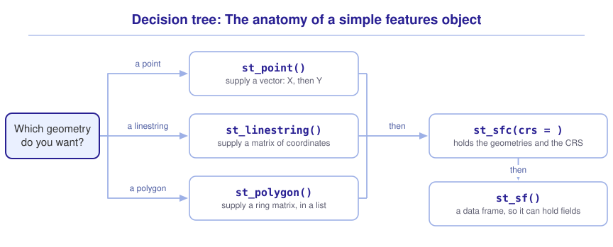
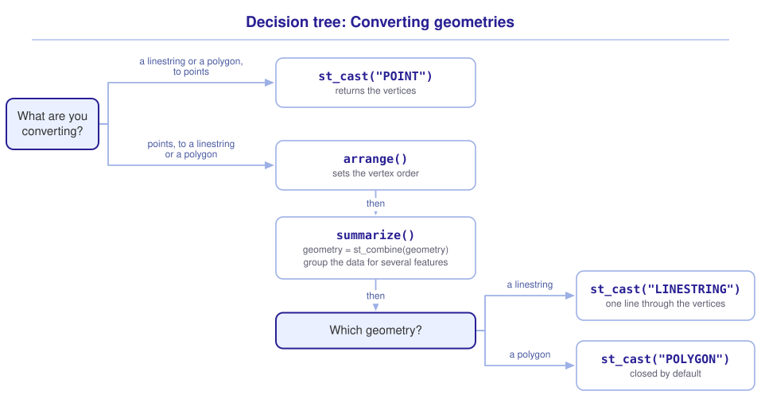

```{r}
#| include: false

library(webexercises)

source("src/r/course_functions.R")
source("src/r/reference_lookup.R")

lesson_refs <- find_lesson_references()
```
<hr>

## Overview

{.intro_image fig-alt="Course logo"}

Simple features are a formal, international standard ([ISO 19125-1](https://committee.iso.org/sites/tc211/home/projects/projects---complete-list/iso-19125-1.html)) for representing the spatial location of objects on computers. The *sf* package implements this standard in R using:

* An **sf** object: A data frame that contains the geometry, attributes, and coordinate reference system (CRS) information.
* **Simple Features Geometry (sfg)**: The geometry of an individual simple feature.
* **Simple Features Geometry List Column Object (sfc)**: A list column with the geometry of all simple features in a dataset. *Note: sfc objects may contain CRS information.*

In this lesson, we will explore how to build sf objects and convert between geometry types. Although I do not typically make many sf objects from scratch (sometimes I do!), doing so is a useful exercise so that we might better understand *the anatomy of an sf object*. These are objects in our R session, not files on disk. An ESRI Shapefile is one of the formats we could use to save them.

## Data for this lesson

Please click on the button below to explore the metadata for this lesson!

<button class="accordion">Metadata</button>
::: panel
In this lesson, we will explore:

```{r}
#| echo: false
#| output: asis

lesson_metadata(.dataset = "states") %>%
  cat()
```
:::

## Set up your session

Please start with a clean RStudio session. Check that your **Global Environment** and **session history** are empty.

1. Create a new script file and save it as `scripts/constructing_simple_features.R`.

2. Add metadata as a comment at the top of the file, then add a code section called "setup".

3. Leave a blank line after the section break, then include and run the following:

:::{style="margin-left: 40px"}
```{r}
#| results: hide
#| message: false

library(sf)
library(tidyverse)
```
:::

4. We will use the `states.shp` file provided with this module as a background for the sf objects that we create. We will read in the file and subset to states in the Northeastern and Southern US:

:::{style="margin-left: 40px"}
```{r}
states <-
  st_read("data/raw/shapefiles/states.shp") %>%
  filter(
    REGION %in% c("Norteast", "South")
  )
```


As in ***3.2 Introduction to spatial vector data***, read the metadata first. You can suppress that output in later runs by adding `quiet = TRUE` to `st_read()`.

*Note: "Norteast" is spelled that way in the supplied data, so we use that spelling in `filter()`.*
:::

5. Let's also set the theme across our plots to `theme_void()`:

:::{style="margin-left: 40px"}
```{r}
theme_set(
  new = theme_void()
)
```
:::

## Simple features anatomy

### sfg

The coordinates of a location represent the location's **geometry**. In the *sf* package, we represent an individual geometry as a **simple feature geometry (sfg)** object. We can create an sfg for a location by supplying a vector of X and Y coordinates to the `st_point()` function:

```{r}
c(-90.0216, 33.65646) %>%
  st_point()
```

:::{class="mysecret"}
<i class="fa fa-user-secret" aria-hidden="true" style = "font-size: 150%; padding-right: 5px;"></i>For the coordinate pairs used here, supply longitude before latitude (X, Y).
:::

Let's look at the object class:

```{r}
c(-90.0216, 33.65646) %>%
  st_point() %>%
  class()
```

This is an `sfg` object with `POINT` geometry and `XY` coordinates. Importantly, an sfg object contains the geometry but no CRS. We can plot coordinate values without a CRS, but we cannot place them on the Earth with confidence. `geom_sf()` does not assume EPSG 4326 when the CRS is missing! Let's add the CRS in the next step.

### sfc

An sfg object can only contain a single geometry (e.g., a single point). Objects that contain multiple geometries store those geometries in a **simple feature geometry list column (sfc)**. We can transform a geometry to an sfc object with `st_sfc()`:

```{r}
c(-90.0216, 33.65646) %>%
  st_point() %>%
  st_sfc()
```

Notice in the printed output, above, that an sfc object can include a CRS (which is `NA` here). We can provide a CRS with the `crs = ` argument of the `st_sfc()` function. Here, I am using the CRS of the states file, which is EPSG 4269 (North American Datum 1983):

```{r}
c(-90.0216, 33.65646) %>%
  st_point() %>%
  st_sfc(crs = 4269)
```

Exploring the class of the object gives a clue of its structure:

```{r}
c(-90.0216, 33.65646) %>%
  st_point() %>%
  st_sfc(crs = 4269) %>%
  class()
```

The class `sfc_POINT` denotes a geometry list that contains points. Here, it contains just one `POINT` geometry and carries the CRS we supplied. It is not part of a data frame yet, but it will become the geometry column when we create an sf object.

Now that we have supplied the CRS, let's map the point. Recall from ***3.2 Introduction to spatial vector data*** that `geom_sf()` draws the geometries of an sf or sfc object. Each call adds a layer, so we will use one for the `states` background and another for our point:

```{r}
#| fig-alt: "A point at Avalon, Mississippi, over a background map of the Northeastern and Southern US states."

states %>%
  ggplot() +

  # Map state layer:

  geom_sf() +

  # Map point:

  geom_sf(
    data =
      c(-90.0216, 33.65646) %>%
      st_point() %>%
      st_sfc(crs = 4269),
    size = 3
  )
```

*Note: The top layer on the map, created with a second call of `geom_sf()`, used a different data layer than the one that was passed to `ggplot()`. Because of this, we had to specify a data argument for that layer (`data = ...`).*

:::{class="mysecret"}
<i class="fa fa-user-secret" aria-hidden="true" style = "font-size: 150%; padding-right: 5px;"></i>Notice in the above that we added the states layer first to the map -- that is because `ggplot()` positions the layers in the order that they were created. If we had added states *after* our point, our point would not show up on the map!
:::

### sf

An sfc object contains location information (geometry and CRS), but it does not contain any other data. This is where a **simple features (sf)** object comes in -- it is a container that stores data and location information. We can convert an sfc object to an sf object with the function `st_sf()`:

```{r}
c(-90.0216, 33.65646) %>%
  st_point() %>%
  st_sfc(crs = 4269) %>%
  st_sf()
```

Compare this output with the sfc output above: "Geometry set for 1 feature" has become "Simple feature collection with 1 feature and 0 fields". We can dig into this a bit by exploring the class of the sf object:

```{r}
c(-90.0216, 33.65646) %>%
  st_point() %>%
  st_sfc(crs = 4269) %>%
  st_sf() %>%
  class()
```

Here, we see that the object has class `sf` *and* `data.frame`. Each *feature* occupies a row in the data frame and has a geometry. The *fields* are the variables associated with each feature and are represented by columns in the data frame. Because an sf object is a data frame, we can work with these objects just as we would with traditional data frames. These coordinates represent the location of John Hurt's home in Avalon, Mississippi. Let's add this information to our data:

```{r}
c(-90.0216, 33.65646) %>%
  st_point() %>%
  st_sfc(crs = 4269) %>%
  st_sf() %>%
  mutate(Landmark = "Avalon")
```

::: now_you
 [Check your understanding]{style="padding-left: 0.5em;"}

Which object class contains a geometry, a CRS, *and* the fields that describe each feature?

`r longmcq(c("sfg", "sfc", answer = "sf", "A matrix of coordinates"))`

True or false: An sfc object can contain a CRS.

`r torf(TRUE)`
:::

## Interlude: tibbles and tribbles

For the remainder of this exercise, we will generate a small table of locations by hand. Typically, data frames are created by column, supplying a vector of values for each. Here are two of our locations:

```{r}
tibble(
  Landmark = c("Avalon", "Train station"),
  x = c(-90.0216, -79.07005),
  y = c(33.65646, 35.91097)
)
```

When I generate a small data frame like this, I think that it is much more straightforward (and more communicative) to generate a tibble with the row-wise function `tribble()` (see `?tribble`). Here is the full set of locations. We specify the column headers with tilde (`~`) and separate the columns with a comma:

```{r}
landmarks_df <-
  tribble(
    ~ Landmark,         ~ x,        ~ y,
    "Avalon",            -90.02160, 33.65646,
    "Train station",     -79.07005, 35.91097,
    "Smithsonian-Mason", -78.16464, 38.88697,
    "Gaslight Cafe",     -74.00044, 40.72979,
    "Newport",           -71.33749, 41.47934
  )
```

I really like the above method because the data you input *looks like* the table that you are creating!

:::{class="mysecret"}
<i class="fa fa-user-secret" aria-hidden="true" style = "font-size: 150%; padding-right: 5px;"></i>Why did I capitalize "Landmark" ... doesn't that go against my "snake_case" rules for variables? It certainly does! I capitalize variable names *only* when that variable will become the title of a plot legend. There are other ways around this, but I find this method to be the most straightforward.
:::

## Geometry types


There are a number of different simple feature geometry types (see [`vignette("sf1")`, *Simple feature geometry types*](https://r-spatial.github.io/sf/articles/sf1.html#simple-feature-geometry-types){target="_blank"}), but the most common are:

* **Points**: Zero-dimensional geometry containing a single point
* **Linestrings**: One-dimensional geometry containing a sequence of points connected by straight lines
* **Polygons**: Two-dimensional geometry containing a sequence of points forming a closed ring of straight lines

:::{class="mysecret"}
<i class="fa fa-user-secret" aria-hidden="true" style = "font-size: 150%; padding-right: 5px;"></i>In linestrings and polygons, the points used to define the geometry are called **vertices**. These include the endpoints of a line.
:::

### Points

We covered how to generate a single point above. The method used was meant to illustrate the anatomy of an sf object, and is a bit cumbersome in practice. It is much simpler to use `st_as_sf()`, supplying the coordinate columns and the CRS just as we did in ***3.2 Introduction to spatial vector data***:

```{r}
landmarks <-
  landmarks_df %>%
  st_as_sf(
    coords = c("x", "y"),
    crs = 4269
  )

landmarks
```

Let's have a look:

```{r}
#| fig-alt: "Five landmarks over the states map: Avalon, Train station, Smithsonian-Mason, Gaslight Cafe, and Newport. Each landmark has a different color."

states %>%
  ggplot() +
  geom_sf() +
  geom_sf(
    data = landmarks,
    aes(color = Landmark),
    size = 3
  )
```

### Linestrings

To generate a linestring, you must supply a matrix of points. Here, we will use our `landmarks_df` data frame as the basis for our line and conduct the following operations:

1. Use `select()` to remove all columns except for longitude and latitude (in that order)
2. Convert the data frame to a matrix of coordinates with `as.matrix()`
3. Create a linestring geometry with `st_linestring()`
4. Convert the geometry to a simple features column with `st_sfc()`
5. Convert the object to sf with `st_sf()`

```{r}
my_pilgrimage <-
  landmarks_df %>%
  select(!Landmark) %>%
  as.matrix() %>%
  st_linestring() %>%
  st_sfc(crs = 4269) %>%
  st_sf()
```

Let's have a look:

```{r}
#| fig-alt: "A line connects Avalon, Train station, Smithsonian-Mason, Gaslight Cafe, and Newport in that order. Colored points identify the landmarks."

states %>%
  ggplot() +
  geom_sf() +
  geom_sf(data = my_pilgrimage) +
  geom_sf(
    data = landmarks,
    aes(color = Landmark),
    size = 3
  )
```

**The order of the rows in your matrix matters!** Lines are drawn between points in the order of the rows. For example, watch what happens when I sort the data frame alphabetically by `Landmark`:

```{r}
#| fig-alt: "Sorting alphabetically changes the route to Avalon, Gaslight Cafe, Newport, Smithsonian-Mason, and Train station, creating a different path through the same locations."

confused_pilgrimage <-
  landmarks_df %>%
  arrange(Landmark) %>%
  select(!Landmark) %>%
  as.matrix() %>%
  st_linestring() %>%
  st_sfc(crs = 4269) %>%
  st_sf()

states %>%
  ggplot() +
  geom_sf() +
  geom_sf(data = confused_pilgrimage) +
  geom_sf(
    data = landmarks,
    aes(color = Landmark),
    size = 3
  )
```

### Polygons

To create a polygon with `st_polygon()`, we supply a list of coordinate matrices. Each matrix describes a ring, with one row per vertex and columns in X, Y order. The first ring is the outer boundary, and any additional rings represent holes. Here, we only need one ring. What's crucial, though, is that the ring needs to be **closed**. In other words, you *must* repeat your starting point!

```{r}
my_poly_list <-
  tribble(
    ~ Landmark,          ~ x,       ~ y,
    "Avalon",            -90.02160, 33.65646,
    "Train station",     -79.07005, 35.91097,
    "Newport",           -71.33749, 41.47934,
    "Gaslight Cafe",     -74.00044, 40.72979,
    "Smithsonian-Mason", -78.16464, 38.88697,
    "Avalon",            -90.02160, 33.65646
  ) %>%
  select(!Landmark) %>%
  as.matrix() %>%
  list()
```

*Note: In the above I added the `Landmark` column only so you could observe the points that will define the resultant object.*

We can then follow a similar chained process to the above:

1. Create a polygon geometry with `st_polygon()`
2. Convert the geometry to a simple features column with `st_sfc()`
3. Convert the object to sf with `st_sf()`

```{r}
#| fig-alt: "A cyan polygon connects Avalon, Train station, Newport, Gaslight Cafe, Smithsonian-Mason, and back to Avalon. Colored points mark the vertices."

my_poly <-
  my_poly_list %>%
  st_polygon() %>%
  st_sfc(crs = 4269) %>%
  st_sf()

states %>%
  ggplot() +
  geom_sf() +
  geom_sf(
    data = my_poly,
    fill = "#33eeff",
    alpha = 0.5
  ) +
  geom_sf(
    data = landmarks,
    aes(color = Landmark),
    size = 3
  )
```

As an astute observer, you probably noticed that I sneakily switched the order of points in the dataset. **The order of points really matters when creating a polygon!** Let's see what happens when we use the original point order:

```{r}
messy_poly <-
  landmarks_df %>%
  bind_rows(
    slice(landmarks_df, 1)
  ) %>%
  select(!Landmark) %>%
  as.matrix() %>%
  list() %>%
  st_polygon() %>%
  st_sfc(crs = 4269) %>%
  st_sf()
```

:::{class="mysecret"}
<i class="fa fa-user-secret" aria-hidden="true" style = "font-size: 150%; padding-right: 5px;"></i>The use of `bind_rows()` and `slice()` above was a bit of a sneaky way to ensure that the start and end of the polygon are at the same point. The `bind_rows()` function combines two data frames by row. The `slice()` function subsets the data (in this case) to just the first row.
:::

Let's have a look:

```{r}
#| fig-alt: "The original landmark order produces a tangled cyan polygon: Avalon, Train station, Smithsonian-Mason, Gaslight Cafe, Newport, and back to Avalon. The closing edge crosses another edge."

states %>%
  ggplot() +
  geom_sf() +
  geom_sf(
    data = messy_poly,
    fill = "#33eeff",
    alpha = 0.5
  ) +
  geom_sf(
    data = landmarks,
    aes(color = Landmark),
    size = 3
  )
```

The above shows that you really have to consider the order of points when creating a polygon from scratch!

::: now_you
 [Check your understanding]{style="padding-left: 0.5em;"}

True or false: To create a polygon from scratch, the first and last vertices supplied must be the same point.

`r torf(TRUE)`

A linestring is created from a matrix of coordinates. What determines the order in which the vertices are connected?

`r longmcq(c(answer = "The order of the rows in the matrix", "The alphabetical order of the feature names", "The longitude of each vertex, from west to east", "The CRS of the object"))`
:::

## Converting geometries


Converting between geometries is a fairly common task and is a good bit more straightforward than generating geometries from scratch (at least once you have learned a trick or two).

### From lines & polygons to points

The primary `sf` tool for converting between geometries is the function `st_cast()`. We supply the object that we would like to convert (a.k.a. "cast") and the type of geometry that we would like to convert to, in all caps. For example, let's cast our linestring `my_pilgrimage` back to points:

```{r}
my_pilgrimage %>%
  st_cast("POINT")
```

... and plot the results:

```{r}
#| fig-alt: "Casting the pilgrimage line to points leaves five locations over the states map, with no connecting line."

states %>%
  ggplot() +
  geom_sf() +
  geom_sf(
    data =
      my_pilgrimage %>%
      st_cast("POINT"),
    size = 3
  )
```

The above might not be very surprising -- `st_cast()` returned the vertices of the linestring.

Because we used these same points to generate our polygon `my_poly`, casting the polygon to points yields equivalent point locations:

```{r}
my_poly %>%
  st_cast("POINT")
```

Notice that the coordinates for Avalon appear twice because we repeated them to close the ring.

What is worth considering, however, is the number of vertices it takes to generate a shape. Let's look at North Carolina:

```{r}
#| fig-alt: "North Carolina as a polygon, with comparatively straight northern and southern borders and more intricate western and coastal borders."

states %>%
  filter(NAME == "North Carolina") %>%
  ggplot() +
  geom_sf()
```

We can see in the above that the northern boundary of the state (the border between North Carolina and Virginia) is nearly a straight line and follows a latitudinal band. The southern border of the state (the North Carolina-Georgia and North Carolina-South Carolina borders) is also quite simple. The western (North Carolina-Tennessee) and eastern (the Atlantic coast) borders of the state are much more complex because they are defined by natural features. Let's see what this looks like when we cast the geometry from polygon to point:

```{r}
#| fig-alt: "The vertices of North Carolina shown as points. Points are more densely packed along the intricate western and coastal boundaries than along the straighter borders."
#| warning: false

states %>%
  filter(NAME == "North Carolina") %>%
  st_cast("POINT") %>%
  ggplot() +
  geom_sf()
```

:::{class="mysecret"}
<i class="fa fa-user-secret" aria-hidden="true" style = "font-size: 150%; padding-right: 5px;"></i>Because there is a vertex at every turning point of the polygon, complex shapes contain many more points than simple shapes. Complex shapes therefore require much more of our computer's memory to process. We will cover this in some depth in a future lesson.
:::

### From points to lines

Converting points to lines is not quite as straightforward. Let's start by reminding ourselves what our point geometry looks like for our `landmarks` point object:

```{r}
landmarks
```

We can see that each point occupies a row in the `sf` data frame. Recall that each of the rows in the geometry column represents a single feature. As such, simply casting the features to a linestring geometry type is not very useful:

```{r}
landmarks %>%
  st_cast("LINESTRING")
```

In the above, notice that, although the geometry column has been converted to a linestring, each line only contains a single point!

We could extract the coordinates with `st_coordinates()` and build the line from a matrix, just as we did above. But that means supplying the CRS again. I prefer to work with the spatial object that we already have.

Our preferred method relies on a **MULTIPOINT** geometry, which represents several points as one feature. This requires a bit of a trick. We use `st_combine()` to collect the points, wrapped inside `dplyr::summarize()` to collapse the rows into a single feature:

```{r}
landmarks %>%
  summarize(
    geometry = st_combine(geometry)
  )
```

Here, `st_combine()` collects the geometries without resolving their boundaries. In ***3.6 Geometric operations with sf***, we will use `st_union()` to calculate a geometric union, which dissolves shared polygon boundaries. For now, we just want to collect our points before connecting them.

We can then cast these data to a linestring geometry with `st_cast()`:

```{r}
landmarks %>%
  summarize(
    geometry = st_combine(geometry)
  ) %>%
  st_cast("LINESTRING")
```

This connects the landmarks in the same order as `my_pilgrimage`, with the CRS retained.

Although the above method may take some getting used to, I think it is much more straightforward than the method used to build the linestring from a matrix of coordinates.

:::{class="mysecret"}
<i class="fa fa-user-secret" aria-hidden="true" style = "font-size: 150%; padding-right: 5px;"></i>If you need to generate multiple lines, the `summarize()` and `st_combine()` functions can also be run on grouped data by including a grouping variable with `group_by()` or `summarize(..., .by = ...)`.
:::

#### What if we wanted to change the order of points?

To address this, we have to do a bit of a trick. We can `mutate()` the points object, supply a new column that represents the preferred order of points, and then sort the data based on that column:

```{r}
landmarks %>%
  mutate(
    order =
      c(
        1,
        3:2,
        4:5
      )
  ) %>%
  arrange(order)
```

Let's see how it looks (here, I am using a new function, `geom_sf_text()`, to draw text instead of points):

```{r}
#| fig-alt: "Numbers show the proposed order: 1 at Avalon, 2 at Smithsonian-Mason, 3 at Train station, 4 at Gaslight Cafe, and 5 at Newport. The route will double back south from 2 to 3."
#| warning: false

states %>%
  ggplot() +
  geom_sf() +
  geom_sf_text(
    data =
      landmarks %>%
      mutate(
        order =
          c(
            1,
            3:2,
            4:5
          )
      ) %>%
      arrange(order),
    aes(label = order),
    size = 8
  )
```

If we are satisfied with the order of our points, we can cast these points to a line as above:

```{r}
#| fig-alt: "The reordered line goes from Avalon to Smithsonian-Mason, south to Train station, then northeast to Gaslight Cafe and Newport."

states %>%
  ggplot() +
  geom_sf() +
  geom_sf(
    data =
      landmarks %>%
      mutate(
        order =
          c(
            1,
            3:2,
            4:5
          )
      ) %>%
      arrange(order) %>%
      summarize(
        geometry = st_combine(geometry)
      ) %>%
      st_cast("LINESTRING")
  )
```

:::{class="mysecret"}
<i class="fa fa-user-secret" aria-hidden="true" style = "font-size: 150%; padding-right: 5px;"></i>I often use this method to generate paths from tracking data. In this use case, the data are sorted by the date or time of detection.
:::

:::{class="mysecret"}
<i class="fa fa-user-secret" aria-hidden="true" style = "font-size: 150%; padding-right: 5px;"></i>
You may also want to explore `geom_path()` and `geom_line()`! These use X and Y coordinate columns rather than an sf geometry column, with grouping to separate lines. `geom_path()` connects points in row order, while `geom_line()` connects them in order of X.
:::

### From points to polygons

As you might imagine, converting points to polygons represents our most complex use case. However, it is actually a bit more straightforward than creating a polygon from scratch and, if we understand how to cast points to linestrings, only the geometry type changes!

As with lines, we combine the points with `st_combine()` inside `summarize()`, then pass the output to `st_cast()`:

```{r}
landmarks %>%
  summarize(
    geometry = st_combine(geometry)
  ) %>%
  st_cast("POLYGON")
```

*Note: When you use `st_cast("POLYGON")`, the polygon generated is closed by default!*

We used the original point order, so this is the same messy polygon we created before ... we need to ensure that the order of the vertices produces the polygon we intended. Luckily, we've already learned how we may order points (see *What if we wanted to change the order of points?*, above). We can generate our desired polygon by arranging the data frame prior to casting the points:

```{r}
#| fig-alt: "After arranging the points, the cyan polygon follows Avalon, Train station, Newport, Gaslight Cafe, Smithsonian-Mason, and back to Avalon, matching the intended polygon."

states %>%
  ggplot() +
  geom_sf() +
  geom_sf(
    data =
      landmarks %>%
      mutate(
        order =
          c(
            1:2,
            5,
            4:3
          )
      ) %>%
      arrange(order) %>%
      summarize(
        geometry = st_combine(geometry)
      ) %>%
      st_cast("POLYGON"),
    fill = "#33eeff",
    alpha = 0.5
  )
```

:::{class="mysecret"}
<i class="fa fa-user-secret" aria-hidden="true" style = "font-size: 150%; padding-right: 5px;"></i>Similar to lines, multiple polygons can be generated with the above method by grouping data with `group_by()` or `summarize(..., .by = ...)`.
:::

## Putting it all together

At this point my hope is that you have a mental model for how a simple features object is put together. Building one from coordinates might look something like this (click to expand):

{.zoomable data-title="Decision tree: The anatomy of a simple features object" data-pdf-key="sf_anatomy" fig-alt="To construct a point, supply a vector of X and Y coordinates to st_point(). For a linestring, supply a coordinate matrix to st_linestring(). For a polygon, supply a list of ring-coordinate matrices to st_polygon(), repeating the first coordinate at the end of each ring. Pass the geometry to st_sfc() and supply the CRS, then use st_sf() to create a data frame that can hold fields."}



Converting an object that already exists is a separate question, with a tree of its own (click to expand):

{.zoomable data-title="Decision tree: Converting geometries" data-pdf-key="converting_geometries" fig-alt="To extract the vertices of a line or polygon, use st_cast('POINT'). To connect points, first set their order with arrange(), then combine their geometries with geometry = st_combine(geometry) inside summarize(). Group the data first if you need separate features. Use st_cast('LINESTRING') to connect the vertices as a line, or st_cast('POLYGON') to form a polygon, which is closed automatically."}



::: {.callout-note}

These trees are a visualization of *my* mental model for these functions. It is totally okay if your model differs! What is important is that you have a *working* model, a system in place that allows you to retrieve the function or functions that you need to solve a problem.

:::

## Take-home points

* An **sfg** represents one geometry. An **sfc** is a list of geometries and can carry a CRS. An **sf** is a data frame with an sfc column and the fields that describe each feature.
* Supply coordinate columns in X, Y order, which is longitude, latitude for the geographic coordinates used here.
* The most common geometry types are **points** (zero-dimensional), **linestrings** (one-dimensional), and **polygons** (two-dimensional, formed by a closed ring). In lines and polygons, points are known as **vertices**.
* Vertex order matters: lines are drawn between points in row order, and a polygon must start and end at the same point.
* `st_cast()` converts an object from one geometry type to another. Casting a line or polygon to `"POINT"` returns its vertices, and complex shapes contain many more vertices than simple shapes.
* To convert a points object to a single line or polygon, combine the features with `st_combine()` inside of `summarize()`, then cast the result. Arrange the rows first to control the vertex order, and group the data to generate multiple lines or polygons.

## Exercises

::: now_you
 [Test your knowledge!]{style="font-size: 1.25em; padding-left: 0.5em;"}

1. Now build a line of your own! Use the three coordinate pairs below to create an sf object with one linestring, visiting the sites in the order **B, A, C**. The coordinates use EPSG 4269. Try it before looking at my answer.

   ```{r}
   sites <-
     tribble(
       ~ site, ~ x, ~ y,
       "A",    -79,  36,
       "B",    -80,  35,
       "C",    -78,  37
     )
   ```

   [Click here to see my answer]{.answer_link data-answer="a-3-3-build-line"}

   ::: {.answer_body #a-3-3-build-line}

   ```{r}
   sites %>%
     slice(2, 1, 3) %>%
     select(x, y) %>%
     as.matrix() %>%
     st_linestring() %>%
     st_sfc(crs = 4269) %>%
     st_sf()
   ```

   The result has one feature with `LINESTRING` geometry. Its coordinates start at B (-80, 35), pass through A (-79, 36), and end at C (-78, 37). The order comes from the rows supplied to `st_linestring()`.

   :::

2. Two state polygons cover a similar area. One has a detailed coastline stored with thousands of vertices, while the other has straight borders stored with only a few vertices. Which statement is true?

   `r longmcq(c(answer = "The polygon with more vertices requires more memory to store its coordinates", "The two polygons contain the same number of vertices", "The polygon with fewer vertices requires more memory to store its coordinates", "The number of vertices is determined by the CRS"))`

3. Match each function to its role in constructing or converting a simple features object:

   ```{r}
   #| echo: false
   #| results: asis

   matching_game(
     .pairs =
       tribble(
         ~ left,                                            ~ right,
         "Create a point geometry from a coordinate pair",  "st_point()",
         "Store geometries in a list column with a CRS",    "st_sfc()",
         "Convert a geometry list column to a data frame",  "st_sf()",
         "Convert an object between geometry types",        "st_cast()"
       ),
     .id = "match-3-3-functions"
   )
   ```

4. Parsons problem: Reorder the lines below to convert the points object `landmarks` to a single polygon. One line applies a function that expects a list of coordinate matrices rather than a simple features object. Leave it in the trash.

   <div class="parsons-problem">
   <div id="p-3-3-01-trash" class="sortable-code"></div>
   <div id="p-3-3-01-sortable" class="sortable-code"></div>
   <div style="clear: both;"></div>
   <button id="p-3-3-01-check" class="parsons-btn parsons-btn-check" type="button">Check My Order</button>
   <button id="p-3-3-01-reset" class="parsons-btn parsons-btn-reset" type="button">Shuffle Again</button>
   <p id="p-3-3-01-feedback" class="parsons-feedback"></p>
   </div>

   <script>
   window.parsonsProblems = window.parsonsProblems || [];
   window.parsonsProblems.push({
     id: "p-3-3-01",
     maxDistractors: 1,
     code: "landmarks %>%\n  summarize(\n    geometry = st_combine(geometry)\n  ) %>%\n    st_polygon() %>% #distractor\n  st_cast(\"POLYGON\")"
   });
   </script>
:::


