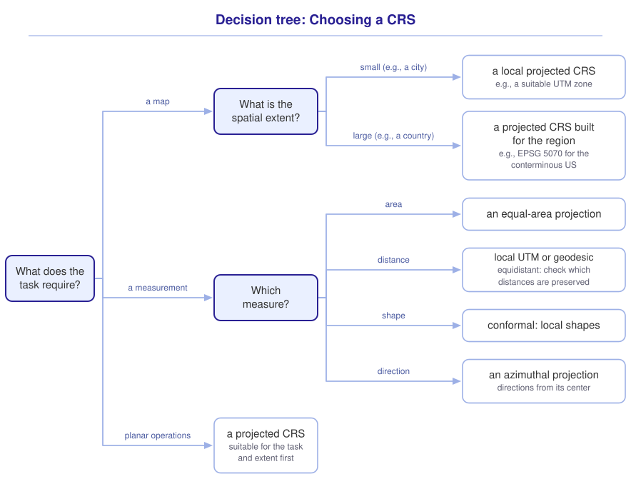

```{r}
#| include: false

library(webexercises)
library(sf)
library(tidyverse)

source("src/r/course_functions.R")
source("src/r/reference_lookup.R")

lesson_refs <- find_lesson_references()
```

<hr>

<div>
{.intro_image fig-alt="Course logo"}

Which sampling sites fall within a protected area? How far has an invasive species spread? Our answers depend on locations being represented accurately. A **coordinate reference system** (CRS) is the reference system that allows us to define the location of a geometry on the surface of the Earth. Without a CRS, -77.05 and 38.89 could describe degrees of longitude and latitude, meters east and north of some origin, or something else entirely. In ***3.2 Introduction to spatial vector data***, we transformed spatial data to a different CRS as a pre-processing step.

In completing this lesson, you will learn how to:

* Describe the components of geodetic and projected coordinate reference systems
* Read the well-known text representation of a CRS with `st_crs()`
* Transform coordinates with `st_transform()`, and distinguish transformation from assigning a CRS
* Choose a CRS that is appropriate for a given task

**Important!** Before starting this tutorial, be sure that you have completed all preliminary and previous lessons!

</div>

## Data for this lesson

<button class="accordion">Please click on the button below to explore the metadata for this lesson!</button>
::: panel
In this lesson, we will explore:

```{r}
#| echo: false
#| output: asis

lesson_metadata(
  .dataset =
    c(
      "dc_census.geojson",
      "sites.csv",
      "states"
    )
) %>%
  cat()
```
:::

## Set up your session

Please complete the following to ensure that you are working in a clean session:

1. Please ensure that your **Global Environment** is empty.
2. In the *History* tab of your **workspace pane**, ensure that your **session history** is empty.

Now that we are working in a clean session:

1. Create a script file.
2. Save your script file as `scripts/coordinate_reference_systems.R`.
3. Add metadata as a comment on the top of the file.
4. Following your metadata, create a new **code section** and call it "`setup`".
5. Following your section header, attach the *sf* package and the packages that comprise the **core tidyverse**, then run `source_script_module_3.R` (see ***3.2 Introduction to spatial vector data***).

At this point, your script should look something like:

```{r}
#| eval: false

# My code for the coordinate reference systems tutorial

# setup --------------------------------------------------------

library(sf)
library(tidyverse)

# Load the source script:

source("scripts/source_script_module_3.R")
```

```{r}
#| include: false

source("scripts/source_script_module_3.R")
```

Next, we will read in and pre-process the data for this lesson. Let's start with a "Now you!" challenge:

::: now_you
 [Now you!]{style="font-size: 1.25em; padding-left: 0.5em;"}

In a single piped statement:

* Read in the shapefile `states.shp`
* Clean the field names with `clean_names()`
* Subset the fields to `name`, renaming the field to `state`
* Assign the name `states` to the resultant object in your global environment.

*Hint: We read and pre-processed shapefiles in this way in **3.2 Introduction to spatial vector data**.*

[Click here to see my answer]{.answer_link data-answer="a-3-4-states"}

::: {.answer_body #a-3-4-states}

```{r}
#| results: hide

states <-

  # Read in the shapefile:

  st_read(
    "data/raw/shapefiles/states.shp",
    quiet = TRUE
  ) %>%

  # Clean the field names:

  clean_names() %>%

  # Subset to the field of interest and rename:

  select(state = name)
```

:::
:::

We will also use a GeoJSON file of census tracts in the District of Columbia. Here, `census` refers to the projected DC dataset, not the larger `census.shp` dataset from 3.2:

```{r}
#| results: hide

# Read in and pre-process DC census data:

census <-
  st_read(
    "data/raw/shapefiles/dc_census.geojson",
    quiet = TRUE
  ) %>%
  clean_names() %>%
  select(
    geoid,
    income,
    population
  )
```

... and a tabular dataset of Neighborhood Nestwatch sampling sites:

```{r}
# Read in the site locations:

sites <-
  read_csv("data/raw/sites.csv")
```

## The components of a CRS

A CRS locates a geometry on the surface of the Earth with a set of components:

* A **datum**, which anchors a model of the Earth's shape (a reference ellipsoid) to the Earth
* A coordinate system, which defines the axes along which coordinates are measured and the units of those coordinates
* For some coordinate reference systems, a **projection**, which is a mathematical transformation from coordinates on a curved reference surface to coordinates on a flat map.

We work with two kinds of CRS in this course. A **geographic** CRS records longitude and latitude in angular units, usually decimal degrees. The *sf* package labels these as **geodetic** in its printed output, so we use that term here. A **projected** CRS records locations on a flat coordinate grid in linear units, typically meters.

Both kinds are present in our data for this lesson. Please highlight and run `states`:

```{r}
#| echo: false

states
```

The metadata line `Geodetic CRS:  NAD83` reports the kind of CRS and its name. Now please highlight and run `census`:

```{r}
#| echo: false

census
```

Here, the line reads `Projected CRS: WGS 84 / UTM zone 18N`. The bounding box of `states` is expressed in decimal degrees, whereas that of `census` is expressed in meters.

::: now_you
 [Check your understanding]{style="padding-left: 0.5em;"}

True or false: A projected CRS expresses locations in angular units, usually decimal degrees.

`r torf(FALSE)`

The bounding box of a simple features object spans values from roughly 300,000 to 330,000 along the X axis. What should you do before interpreting those values?

`r longmcq(c(answer = "Check the CRS and its units with st_crs()", "Assume the values are meters because they are large", "Assign EPSG 4326 without consulting the metadata", "Divide by 1,000 to convert the values to degrees"))`
:::

## Read a CRS

The complete description is written in **well-known text** (WKT), the international standard for representing coordinate reference systems. We print it with `st_crs()` (see ***3.2 Introduction to spatial vector data***).

### The WKT of a geodetic CRS

Let's read the CRS of `states`:

```{r}
st_crs(states)
```

The WKT is organized as a set of nested bracketed sections. For a geodetic CRS:

* `GEOGCRS` names the CRS ("NAD83")
* `DATUM` and `ELLIPSOID` describe the model of the Earth's surface. Here, 6378137 is the model's equatorial radius in meters
* `PRIMEM` defines the **prime meridian**, which is the location of 0&deg; longitude
* `CS` and `AXIS` define the latitude and longitude axes. `ANGLEUNIT` states that both use degrees
* The final, outermost `ID` provides the EPSG code of the CRS. Other `ID` entries identify individual components.

*Note: Although this WKT lists latitude before longitude, supply X then Y (longitude, latitude) in the sf examples here.*

### The WKT of a projected CRS

Now let's read the CRS of `census`:

```{r}
st_crs(census)
```

The WKT of a projected CRS describes its underlying geographic CRS, the projection, and the projected coordinate system:

* `PROJCRS` names the CRS ("WGS 84 / UTM zone 18N")
* `BASEGEOGCRS` describes the geodetic CRS that the projection is applied to. Here, this is WGS 84, the reference system used by GPS. EPSG 4326 identifies its two-dimensional geographic CRS. *Note: The `ENSEMBLE` and `MEMBER` sections record successive versions of the WGS 84 datum.*
* `CONVERSION` describes the projection. `METHOD` names Transverse Mercator, and `PARAMETER` defines values such as the longitude that the projection is centered on
* `CS` and `AXIS` define Cartesian easting (E) and northing (N) axes. `LENGTHUNIT` states that both use meters
* `USAGE` states the purpose (`SCOPE`) and geographic extent (`AREA`) that the CRS is intended for
* The final, outermost `ID` provides the EPSG code of the CRS.

::: mysecret

 [Read the `USAGE` section before adopting a CRS!]{style="font-size: 1.25em; padding-left: 0.5em;"}

The `AREA` section describes the region between 78&deg;W and 72&deg;W, which contains the District of Columbia. Distortion can increase outside that area. Check that the CRS suits your whole study region before measuring.
:::

### Extract components of a CRS

We can extract components from the object returned by `st_crs()` with the `$` operator. In ***3.2 Introduction to spatial vector data***, we extracted the EPSG code:

```{r}
st_crs(census)$epsg
```

We can also extract the units of the CRS:

```{r}
st_crs(census)$units_gdal
```

Knowing the units is necessary for interpreting coordinates and measurements. Here, a difference of 500 between eastings represents 500 meters along the grid's X axis, not necessarily the full distance between the points.

::: now_you
 [Now you!]{style="font-size: 1.25em; padding-left: 0.5em;"}

Extract the EPSG code and the units of the CRS of `states`.

*Hint: Both values can also be verified against the printed WKT.*

[Click here to see my answer]{.answer_link data-answer="a-3-4-extract"}

::: {.answer_body #a-3-4-extract}

```{r}
# Extract the EPSG code:

st_crs(states)$epsg

# Extract the units:

st_crs(states)$units_gdal
```

:::
:::

## Geodetic coordinate reference systems

Longitude and latitude describe angular positions relative to the prime meridian and equator on the reference ellipsoid. One degree of longitude spans about 111 kilometers at the equator and shrinks toward zero at the poles.

Longitude and latitude are widely used across mapping platforms, and we can calculate distances and areas with methods that account for the Earth's curvature. Processing time and memory use depend on the operation and the data, not just the CRS!

Displaying longitude and latitude on a flat map is another matter. Let's map `states` in its current CRS:

```{r}
#| fig-alt: "Conterminous US states displayed in longitude and latitude. Meridians are straight and parallel, stretching east-west dimensions at northern latitudes relative to southern latitudes."

states %>%
  ggplot() +
  geom_sf() +
  theme_bw()
```

Have a look at the **graticule**, the grid of longitude and latitude lines. Ten degrees of longitude spans the same width on the page along the Canadian border as along the Gulf coast. On Earth, that span is shorter along the Canadian border, so the northern states are stretched east to west on this map.

::: mysecret

 [How does *sf* measure a curved surface?]{style="font-size: 1.25em; padding-left: 0.5em;"}

By default, *sf* uses the S2 geometry library for many operations on longitude/latitude data. S2 models the Earth as a sphere, where the shortest path follows an arc of a **great circle**. This accounts for curvature, but a sphere is still an approximation of the Earth. We can also use ellipsoidal methods when we need that additional precision.
:::

## Projected coordinate reference systems

There are also trade-offs associated with projected coordinate systems. Flattening the Earth makes planar calculations possible, but introduces distortion. Depending on the operation and data, planar calculations can be faster than spherical ones. Speed alone is not a reason to choose a CRS.

Different projections preserve different properties. An equal-area projection preserves relative areas, while a conformal projection preserves local angles and shapes. No projection preserves area, shape, distance, and direction everywhere! We will use those trade-offs to choose a CRS below.

Let's map `states` in EPSG 5070, an equal-area projection built for the conterminous United States:

```{r}
#| fig-alt: "The same states in NAD83 / Conus Albers, EPSG 5070. Parallels curve and meridians converge. The projection preserves relative state areas, and Montana has a different outline than in the longitude-latitude display."

states %>%
  st_transform(crs = 5070) %>%
  ggplot() +
  geom_sf() +
  theme_bw()
```

The parallels now curve and the meridians converge. This is how the graticule appears in this Albers projection, not a test for whether any map is equal-area. Compare the shape of Montana between the two maps. In this projection, the areas of the states are drawn in accurate proportion to one another (i.e., the map is equal-area).

::: now_you
 [Check your understanding]{style="padding-left: 0.5em;"}

True or false: An equal-area projection also preserves every distance on the map.

`r torf(FALSE)`

Which is an advantage of a suitable projected CRS for local planar operations?

`r longmcq(c(answer = "Coordinates are in linear units on a flat grid, with small distortion over the study area", "The results are always more accurate", "Every operation uses less time and memory", "Projected data do not require a datum"))`
:::

## Transform data to another CRS

Recall that `st_transform()` recalculates coordinates using an EPSG code or `st_crs()` of an object whose CRS we want to match. Let's compare the coordinates of `sites` before and after transformation.

Our metadata states that the site locations were recorded in EPSG 4326, so we supply that CRS to `st_as_sf()`:

```{r}
sites_sf <-
  sites %>%
  st_as_sf(
    coords = c("lon", "lat"),
    crs = 4326
  )

sites_sf
```

The geometry column contains longitude and latitude values in decimal degrees. Now let's transform the object to the CRS of `census`:

```{r}
sites_sf %>%
  st_transform(
    st_crs(census)
  )
```

The site `apple` is in the same location in both printouts. Its coordinates changed from degrees of longitude and latitude to meters of easting and northing.

### Transforming is not assigning

The `crs = ` argument of `st_as_sf()` does not transform coordinates. It assigns a CRS to values that do not yet have one, and the values themselves are unchanged. Notice what happens when we assign the wrong CRS at the point of conversion:

```{r}
sites %>%
  st_as_sf(
    coords = c("lon", "lat"),
    crs = 32618
  )
```

The metadata now reports a projected CRS, but the coordinate values are unchanged. The easting -76.95 is interpreted in meters rather than degrees of longitude. The object is in the wrong place, even though the conversion ran without an error!

::: mysecret

 [Convert tabular data with the CRS in which the data were recorded!]{style="font-size: 1.25em; padding-left: 0.5em;"}

It is super, super, super important that tabular data are converted to sf objects using the same CRS in which the data were recorded. Any transformation of the coordinates has to come after the data are read in!
:::

::: now_you
 [Now you!]{style="font-size: 1.25em; padding-left: 0.5em;"}

Parsons problem: Reorder the lines below to read in `sites.csv`, convert it to a simple features object, and transform the object to the CRS of `census`. One line assigns a CRS that the data were not recorded in. Leave it in the trash.

<div class="parsons-problem">
<div id="p-3-4-01-trash" class="sortable-code"></div>
<div id="p-3-4-01-sortable" class="sortable-code"></div>
<div style="clear: both;"></div>
<button id="p-3-4-01-check" class="parsons-btn parsons-btn-check" type="button">Check My Order</button>
<button id="p-3-4-01-reset" class="parsons-btn parsons-btn-reset" type="button">Shuffle Again</button>
<p id="p-3-4-01-feedback" class="parsons-feedback"></p>
</div>

<script>
window.parsonsProblems = window.parsonsProblems || [];
window.parsonsProblems.push({
  id: "p-3-4-01",
  maxDistractors: 1,
  code: "read_csv(\"data/raw/sites.csv\") %>%\n  st_as_sf(\n    coords = c(\"lon\", \"lat\"),\n    crs = 4326\n  ) %>%\n    crs = 32618 #distractor\n  st_transform(\n    st_crs(census)\n  )"
});
</script>
:::

## Choose a CRS

One of the most common questions I am asked when assisting colleagues and students with their spatial data is "*which CRS should I choose?*" This is a reasonable question, because the number of choices can be overwhelming (you can see suggested coordinate systems for your study area at <a href="https://jjimenezshaw.github.io/crs-explorer/" target = "_blank">this website</a>). Regardless of which CRS you choose, it is important not to get "stuck" in one projected or geodetic CRS. Each comes with trade-offs, and the task at hand determines which CRS is appropriate.

### Choosing a CRS for a map

For a local map, a suitable local projected CRS, such as the appropriate UTM zone, is often a good starting point. Longitude/latitude displays can also be useful, but a small extent alone does not guarantee little distortion, especially near the poles. For a regional map, choose a projection designed for that region and the property you want to show. EPSG 5070 is useful when relative area matters across the conterminous United States.

### Choosing a CRS for a measurement

For planar measurements, choose a projection that preserves the property you need:

* Comparing or summing **areas** calls for an equal-area projection
* Measuring **distances** requires checking which distances are preserved. An azimuthal equidistant projection preserves distances from its center, not between every pair of locations. A suitable UTM CRS is often useful for approximate local distances
* Preserving local **angles and shapes** calls for a conformal projection
* Preserving **directions from a chosen center** calls for an azimuthal projection.

For distances across a large region, consider a **geodesic** method on geographic data. These methods measure along the curved surface. Choose the measurement method along with the CRS.

*Note: We will begin measuring distances and areas in R in ***3.6 Geometric operations with sf***.*

### Choosing a CRS for spatial operations

When an operation depends on planar units, such as the distance, area, and buffer calculations in ***3.6 Geometric operations with sf***, use a projected CRS that is appropriate for the task and spatial extent. After identifying suitable CRSs, the number and complexity of the geometries can help determine which object is more efficient to transform (see ***3.2 Introduction to spatial vector data***).

### Choosing a CRS for a small spatial extent

The **Universal Transverse Mercator** (UTM) system divides the Earth into 60 zones, generally 6&deg; wide in longitude, each with a central meridian. UTM is conformal and keeps distortion small within an appropriate zone. For a city or county, this can be a great starting point. See the [PROJ guide to UTM](https://proj.org/en/stable/operations/projections/utm.html){target="_blank"} for the zone layout.

::: mysecret

 [Check that the UTM zone suits your study area!]{style="font-size: 1.25em; padding-left: 0.5em;"}

Choose a UTM zone that suits your study area. Distortion increases away from its central meridian, so do not assume that one zone is suitable for a study spanning several zones. Crossing a zone boundary does not suddenly make the data unusable.
:::

UTM coordinates are **eastings** (X) and **northings** (Y), measured in meters. The **false easting** and **false northing** are offsets built into the CRS, not the coordinate values themselves:

* The central meridian has an easting of **500,000 meters**. A point 100 grid meters east of it has an easting of 500,100 meters.
* In the Northern Hemisphere, northing is zero at the equator and increases northward. In the Southern Hemisphere, a false northing of **10,000,000 meters** is assigned at the equator, with values decreasing southward.

These offsets keep coordinates positive within the intended zone. They do not remove projection distortion.

::: mysecret

 [Eastings and northings can be handy in the field!]{style="font-size: 1.25em; padding-left: 0.5em;"}

If I am attempting to locate a set of coordinates and my GPS unit is set to degrees, the target coordinates indicate the direction to travel, but not the distance. With my GPS unit set to the same UTM CRS as the target coordinates, the difference between my coordinates and the target is an approximate distance in meters along each of the grid's axes!
:::

Probably the biggest challenge associated with using a UTM CRS is choosing the zone, hemisphere, and datum. The District of Columbia lies near 77&deg;W, within zone 18 (78&deg;W to 72&deg;W). It is north of the equator, so we need a Northern Hemisphere CRS.

Luckily, the authors of our textbook provide [a handy function](https://r.geocompx.org/reproj-geo-data.html#which-crs){target="_blank"}, `lonlat_to_utm()`, to find a **WGS 84 UTM EPSG code** from a longitude/latitude pair. Our copy is in `source_script_module_3.R`, so it is already available. Let's try it for DC:

```{r}
lonlat_to_utm(
  c(-77, 38)
)
```

This returns 32618, the EPSG code assigned to `census`. With the same longitude south of the equator, the WGS 84 code would be 32718. Other datums have different EPSG codes for the same zone. Our helper uses the regular six-degree zones, so verify its suggestion for locations near the antimeridian or in the exceptional zones around Norway and Svalbard. Polar regions need a different system.

Now compare the appearance of DC in two projected CRSs. First, let's use Conus Albers (EPSG 5070):

```{r}
#| fig-alt: "DC census tracts in Conus Albers, EPSG 5070. The longitude graticule tilts across the city because DC is east of the projection's central meridian."

census %>%
  st_transform(crs = 5070) %>%
  ggplot() +
  geom_sf() +
  theme_bw()
```

The graticule's longitude lines tilt across this map rather than running vertically, because the city sits far from the longitude on which this projection is centered. In the UTM CRS assigned to the object, the longitude lines run nearly vertical:

```{r}
#| fig-alt: "The same DC census tracts in WGS 84 / UTM zone 18N. Longitude lines are nearly vertical at this location. The orientation differs from the Albers view, but orientation alone does not establish measurement accuracy."

census %>%
  ggplot() +
  geom_sf() +
  theme_bw()
```

Here, UTM keeps local distortion small and the longitude lines nearly vertical. The tilt in the Albers map is not, by itself, evidence of inaccurate areas or distances.

::: now_you
 [Now you!]{style="font-size: 1.25em; padding-left: 0.5em;"}

The bounding box of `sites_sf` spans longitudes of roughly -77.4 to -76.5. Determine the UTM zone of the sites and the EPSG code of its WGS 84 Northern Hemisphere CRS.

*Hint: Supply `lonlat_to_utm()` with a representative longitude/latitude pair. Then check the CRS name with `st_crs()` and `$Name`.*

[Click here to see my answer]{.answer_link data-answer="a-3-4-utm"}

::: {.answer_body #a-3-4-utm}

```{r}
# Determine the EPSG code for the WGS 84 UTM CRS:

lonlat_to_utm(
  c(-77, 39)
)

st_crs(32618)$Name
```

The sites are in UTM zone 18N. EPSG 32618 identifies WGS 84 / UTM zone 18N. The zone alone does not specify the datum. Because the sites span a small spatial extent within a single UTM zone, this is an appropriate CRS for mapping the sites or measuring the distances between them.

:::
:::

## Putting it all together

At this point, my hope is that you have a mental model for what a CRS is and how to work with one. Choosing a CRS for a task might look something like this (click to expand):

{.zoomable data-title="Decision tree: Choosing a CRS" data-pdf-key="choosing_a_crs" fig-alt="Choose a CRS for the task and study area. For a local map, consider a suitable local projected CRS such as UTM. For a regional map, use a projection designed for the region and intended property. For area, use an equal-area projection. For distance, consider local UTM or geodesic measurement, and check which distances an equidistant projection preserves. A conformal projection preserves local angles and shapes. An azimuthal projection preserves directions from its center. For planar operations, choose a suitable projected CRS before considering transformation cost."}



::: {.callout-note}

This tree is a visualization of *my* mental model for this process. It is totally okay if your model differs! What is important is that you have a *working* model, a system in place that allows you to retrieve the tools that you need to solve a problem.

:::

## Take-home points

* A **coordinate reference system** locates a geometry on Earth using a datum, a coordinate system with defined units, and, for projected CRSs, a projection.
* The **geographic** CRSs used here record longitude and latitude in angular units and are labeled **geodetic** by *sf*. A **projected** CRS records locations on a flat grid in linear units, typically meters.
* Use `st_crs()` to read the **well-known text** description of a CRS. Check its datum, units, projection (if present), and area of use.
* `st_transform()` recalculates coordinates. The `crs = ` argument of `st_as_sf()` assigns a CRS without changing coordinate values. Supply the CRS in which the data were recorded.
* No projection preserves area, shape, distance, and direction everywhere. Equal-area projections preserve area, conformal projections preserve local angles, and equidistant and azimuthal projections preserve specified distances and directions. Check which ones!
* Use a suitable projected CRS when an operation depends on planar units. Choose the CRS based on the task and spatial extent before considering the cost of transforming each object.
* A suitable UTM CRS keeps distortion small at local extents. Its coordinates are eastings and northings in meters, and the full CRS also specifies a datum and hemisphere.

## Exercises

::: now_you
 [Test your knowledge!]{style="font-size: 1.25em; padding-left: 0.5em;"}

1. In the WKT of a projected CRS, which section describes the projection and its parameters?

   `r longmcq(c("BASEGEOGCRS", answer = "CONVERSION", "DATUM", "USAGE"))`

2. True or false: `st_transform()` and the `crs = ` argument of `st_as_sf()` both recalculate the coordinate values of an object.

   `r torf(FALSE)`

3. A colleague recorded animal locations with a GPS unit set to EPSG 4326 and would like to analyze them in EPSG 32618. Which sequence of operations produces a correct simple features object?

   `r longmcq(c(answer = "Convert the data with st_as_sf(), supplying crs = 4326, then transform the object with st_transform(), supplying crs = 32618", "Convert the data with st_as_sf(), supplying crs = 32618", "Convert the data with st_as_sf(), supplying crs = 32618, then transform the object with st_transform(), supplying crs = 4326", "Transform the data frame with st_transform(), supplying crs = 32618, then convert it with st_as_sf()"))`

4. You want to compare the areas of protected lands across the conterminous United States. Which kind of projection minimizes distortion for this task?

   `r longmcq(c("A conformal projection", answer = "An equal-area projection", "An equidistant projection", "An azimuthal projection"))`

5. Match each task to a suitable choice. The choices assume that the CRS covers the study area:

   ```{r}
   #| echo: false
   #| results: asis

   matching_game(
     .pairs =
       tribble(
         ~ left,                               ~ right,
         "Map a single city",                  "A suitable UTM CRS for the city",
         "Measure distances from one central field station", "An azimuthal equidistant projection centered on the station",
         "Conduct distance and buffer operations", "A suitable projected CRS for the task and extent",
         "Compare the areas of features",      "An equal-area projection"
       ),
     .id = "match-3-4-crs"
   )
   ```

6. Two simple features objects are assigned different coordinate reference systems. Why can their coordinate values not be compared directly?

   `r longmcq(c(answer = "The same coordinate values describe different locations in different reference systems", "Objects with different CRSs cannot be printed together", "A geodetic CRS contains no coordinate values", "Coordinate values can only be compared when both objects are geodetic"))`
:::


