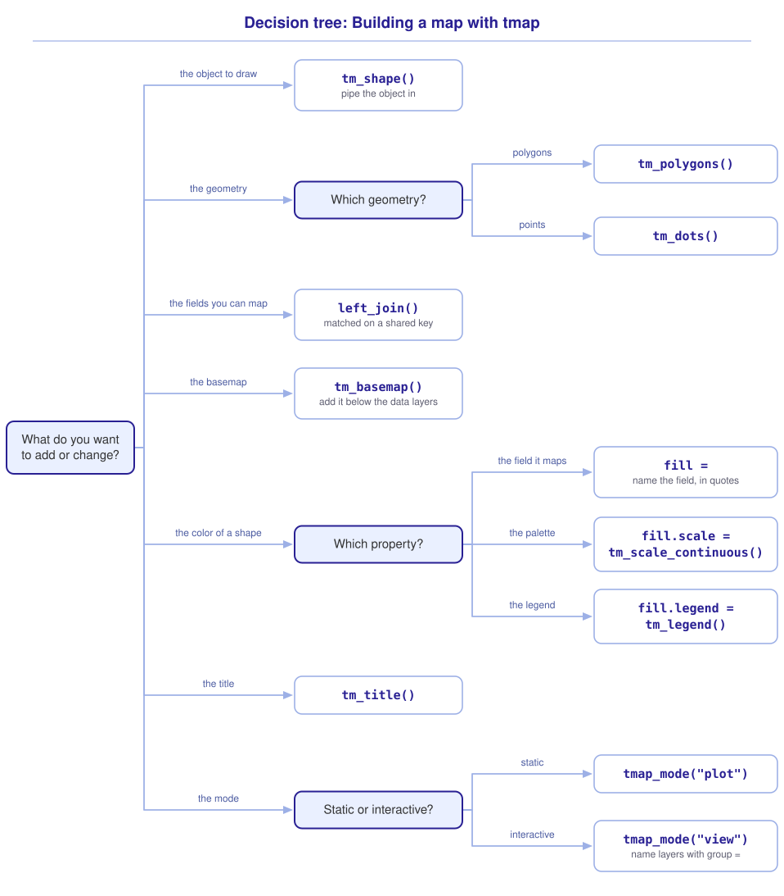

```{r}
#| include: false

library(sf)
library(tidyverse)
library(tmap)
library(webexercises)

source("src/r/course_functions.R")
source("src/r/reference_lookup.R")

lesson_refs <-
  find_lesson_references(
    .lesson_path = "modules/module_3/3.5_introduction_to_tmap.qmd"
  )

tmap_options(
  component.autoscale = FALSE
)
```

<hr>

<div>
{.intro_image fig-alt="Course logo"}

Now that we have covered the basics of spatial data processing, we can start to build visually appealing and useful maps with the *tmap* package. Let's map census tracts and bike-share locations in DC!

In this lesson, you will learn how to:

* Make static and interactive maps with *tmap*
* Map polygon and point geometries
* Add tabular attributes to a simple features object with `left_join()`
* Layer multiple simple features objects on a map
* Add a basemap, title, legend, and accessible color palette
* Assign names to layers of an interactive map

*Note: This lesson uses **tmap version 4**. Check yours with `packageVersion("tmap")`. Many online examples use older syntax. Version 3 examples often put palette and legend settings directly in the geometry function. See the [version 4 guide](https://r-tmap.github.io/tmap/articles/01_tmap_intro_v4.html).*

**Important!** Before starting this tutorial, be sure that you have completed all preliminary and previous lessons.

</div>

## Data for this lesson

Please click on the button below to explore the metadata for this lesson!

<button class="accordion">Metadata</button>
::: panel
In this lesson, we will explore:

```{r}
#| echo: false
#| output: asis

lesson_metadata(
  .dataset =
    c(
      "capital_bike_share_locations.csv",
      "census",
      "dc_census"
    ),
  .variables =
    list(
      `census` =
        c(
          "GEOID",
          "STATEFP",
          "ALAND",
          "AWATER"
        ),
      `dc_census` =
        c(
          "GEOID",
          "INCOME",
          "POPULATION"
        )
    )
) %>%
  cat()
```
:::

## Set up your session

Please complete the following to ensure that you are working in a clean session:

1. Please ensure that your **Global Environment** is empty.
2. In the *History* tab of your **workspace pane**, ensure that your **session history** is empty.

Now that we are working in a clean session:

1. Create a script file.
2. Save your script file as `scripts/tmap_tutorial.R`.
3. Add metadata as a comment at the top of the file.
4. Following your metadata, create a new **code section** and call it "`setup`".
5. Following your section header, attach the *sf*, *tmap*, and core tidyverse packages.
6. Load `scripts/source_script_module_3.R`.
7. Read `census.shp`, subset to the District of Columbia, and maintain the field `GEOID`.
8. Read `dc_census.shp`, convert it to a tibble, and maintain and rename the fields `GEOID`, `INCOME`, and `POPULATION`.
9. Read `capital_bike_share_locations.csv`, change the field names to lowercase, and convert the data to a simple features object.

At this point, your script should look something like:

```{r}
#| message: false
#| warning: false

# My code for the tmap tutorial

# setup --------------------------------------------------------

library(sf)
library(tmap)
library(tidyverse)

# Load the source script:

source("scripts/source_script_module_3.R")

# Census data:

census <-
  st_read(
    "data/raw/shapefiles/census.shp",
    quiet = TRUE
  ) %>%
  filter(STATEFP == "11") %>%
  select(GEOID)

# Census attributes:

census_attributes <-
  st_read(
    "data/raw/shapefiles/dc_census.shp",
    quiet = TRUE
  ) %>%
  as_tibble() %>%
  select(
    GEOID,
    income = INCOME,
    population = POPULATION
  )

# Bike-share data:

bikes <-
  read_csv(
    "data/raw/capital_bike_share_locations.csv",
    show_col_types = FALSE
  ) %>%
  clean_names() %>%
  st_as_sf(
    coords = c("longitude", "latitude"),
    crs = 4326
  )
```

## Build a tmap

Making a tmap requires us to:

1. Use `tm_shape()` to identify the simple features object associated with a layer.
2. Provide a geometry function, such as `tm_polygons()` or `tm_dots()`, that determines how the object is drawn.

Let's pipe our `census` object into `tm_shape()` and add its polygon geometry:

```{r}
#| fig-alt: "DC census tract polygons, showing the boundaries before mapping an attribute."

census %>%
  tm_shape() +
  tm_polygons()
```

Like *ggplot2*, *tmap* combines the accumulated map on the left of `+` with the component on the right.

### Add attributes with `left_join()`

Recall from ***2.6 Tidy data*** that `left_join()` adds fields by matching a shared key. A simple features object is also a data frame, so we can add attributes the same way.

Both objects contain `GEOID`. Let's use it to add `income` and `population` to `census`:

```{r}
census <-
  census %>%
  left_join(
    census_attributes,
    by = join_by(GEOID)
  )
```

With one attribute row per `GEOID`, this join retains each tract and its geometry. This is a **non-spatial join**, matching keys rather than locations. We will examine joins more explicitly in Module 4.

Now let's fill our polygons by population. In version 4, `fill = ` specifies the interior color, as in *ggplot2*. Name the target field in quotes:

```{r}
#| fig-alt: "DC census tracts colored by population count. The legend groups counts into intervals, and tract areas differ."

census %>%
  tm_shape() +
  tm_polygons(
    fill = "population"
  )
```

*Note: These colors show people per tract, not population density. Tracts differ in area.*

::: now_you
 [Check your understanding]{style="padding-left: 0.5em;"}

Which function identifies the simple features object used by a map layer?

`r longmcq(c(answer = "tm_shape()", "tm_polygons()", "tmap_mode()", "tm_title()"))`

True or false: `tm_polygons()` determines how a polygon object is drawn.

`r torf(TRUE)`

Why can we use `left_join()` rather than a spatial join to add the census attributes?

`r longmcq(c(answer = "The objects contain matching values in the shared key GEOID", "Both objects contain polygon geometries", "left_join() matches features by their locations", "Every census tract has the same population"))`
:::

## Add a basemap

`tm_basemap()` draws tiles beneath the data. We place the call first for readability, but its position does not determine the stacking order.

Let's add the OpenStreetMap basemap below our census polygons:

```{r}
#| fig-alt: "Semi-transparent DC population polygons over OpenStreetMap streets in Web Mercator."

tm_basemap("OpenStreetMap") +

  # Add census data:

  census %>%
  tm_shape(crs = 3857) +
  tm_polygons(
    fill = "population",
    fill_alpha = 0.5
  )
```

The `fill_alpha = ` argument controls the transparency of the polygon fill. A value of 0 is fully transparent and a value of 1 is fully opaque.

`crs = 3857` sets the map to Web Mercator, the CRS of these tiles. *tmap* transforms the display without changing `census`. We do not need to convert it to EPSG 4326 first.

*Note: Basemap tiles require internet access. A downloaded interactive map may lack uncached tiles when offline.*

## Legends, titles, and colors

In version 4, each visual variable has its own legend settings. For polygon fill, use `fill.legend = ` with `tm_legend()`:

```{r}
#| fig-alt: "The same DC population map with the fill legend titled Population."

tm_basemap("OpenStreetMap") +
  census %>%
  tm_shape(crs = 3857) +
  tm_polygons(
    fill = "population",
    fill_alpha = 0.5,
    fill.legend =
      tm_legend(title = "Population")
  )
```

We can add a title with `tm_title()`:

```{r}
#| fig-alt: "The population map with a Population legend and the title DC population by census tract."

tm_basemap("OpenStreetMap") +
  census %>%
  tm_shape(crs = 3857) +
  tm_polygons(
    fill = "population",
    fill_alpha = 0.5,
    fill.legend =
      tm_legend(title = "Population")
  ) +
  tm_title("DC population by census tract")
```

Check that the palette suits your data and audience. You can explore palettes and color-vision checks with `cols4all::c4a_gui()`:

```{r}
#| eval: false

cols4all::c4a_gui()
```

The first population map grouped counts into intervals. A continuous scale assigns colors along a gradient without those classes. Set the color scale with `fill.scale = `. Here we use the continuous, perceptually uniform plasma palette from the viridis family:

```{r}
#| fig-alt: "DC population mapped to a continuous plasma scale, with lower counts purple and higher counts yellow. Transparency blends the colors with the basemap."

tm_basemap("OpenStreetMap") +
  census %>%
  tm_shape(crs = 3857) +
  tm_polygons(
    fill = "population",
    fill_alpha = 0.5,
    fill.scale =
      tm_scale_continuous(
        values = "matplotlib.plasma"
      ),
    fill.legend =
      tm_legend(title = "Population")
  ) +
  tm_title("DC population by census tract")
```

Transparency mixes these colors with the basemap. Check the finished map for contrast, not just the palette!

## Layer geometries

Add `tm_shape()` when switching spatial objects. Multiple geometry layers can use the same object. Let's add Capital Bikeshare locations with `tm_dots()`:

```{r}
#| fig-alt: "Capital Bikeshare locations drawn over the DC population polygons and OpenStreetMap basemap, with a Population legend and map title."

tm_basemap("OpenStreetMap") +

  # Add census polygons:

  census %>%
  tm_shape(crs = 3857) +
  tm_polygons(
    fill = "population",
    fill_alpha = 0.5,
    fill.scale =
      tm_scale_continuous(
        values = "matplotlib.plasma"
      ),
    fill.legend =
      tm_legend(title = "Population")
  ) +

  # Add bike-share points:

  bikes %>%
  tm_shape() +
  tm_dots(size = 0.05) +
  tm_title("DC population and bike-share locations")
```

The order of the layers matters. The census layer is drawn first, and the bike-share points are drawn on top of it.

::: now_you
 [Now you!]{style="font-size: 1.25em; padding-left: 0.5em;"}

Modify the map above so that the bike-share points are larger and blue. Use `size = ` and `fill = ` inside of `tm_dots()`.

[Click here to see my answer]{.answer_link data-answer="a-3-5-dots"}

::: {.answer_body #a-3-5-dots}

```{r}
#| fig-alt: "The same population and bike-share map with larger blue points. The population legend and map title are retained."

tm_basemap("OpenStreetMap") +
  census %>%
  tm_shape(crs = 3857) +
  tm_polygons(
    fill = "population",
    fill_alpha = 0.5,
    fill.scale =
      tm_scale_continuous(
        values = "matplotlib.plasma"
      ),
    fill.legend =
      tm_legend(title = "Population")
  ) +
  bikes %>%
  tm_shape() +
  tm_dots(
    fill = "blue",
    size = 0.1
  ) +
  tm_title("DC population and bike-share locations")
```

:::
:::

## From static maps to interactive maps

`"plot"` mode produces static maps for reports and publications:

```{r}
tmap_mode("plot")
```

I prefer to explore my data interactively. We can create an interactive map by setting the mode to `"view"`:

```{r}
tmap_mode("view")
```

Take a moment to explore the output:

```{r}
census %>%
  tm_shape(crs = 3857) +
  tm_polygons(
    fill = "population",
    fill_alpha = 0.5,
    fill.scale =
      tm_scale_continuous(
        values = "matplotlib.plasma"
      ),
    fill.legend =
      tm_legend(title = "Population"),
    group = "Census tracts"
  ) +
  bikes %>%
  tm_shape() +
  tm_dots(
    group = "Bike-share locations",
    size = 0.05
  )
```

You can switch basemaps, turn layers on or off, inspect features, and zoom in and out. The `group = ` argument sets the name of each layer in the layer control.

Before moving on, return to static mode for the remaining lessons:

```{r}
tmap_mode("plot")
```

## Putting it all together

At this point, my hope is that you have a mental model for building a tmap. Mine looks like this (click to expand):

{.zoomable data-title="Decision tree: Building a map with tmap" data-pdf-key="tmap" fig-alt="To draw a spatial object, pipe it into tm_shape() and add a geometry function: tm_polygons() for polygons and tm_dots() for points. To map a field that the object does not yet hold, add it with left_join(), matched on a shared key. To place tiles beneath the data, use tm_basemap(). To color a shape by a field, name that field in quotes with fill =, set its palette with fill.scale = and tm_scale_continuous(), and set its legend with fill.legend = and tm_legend(). To title the map, use tm_title(). To switch between static and interactive output, use tmap_mode('plot') or tmap_mode('view'), naming layers with group = for the interactive layer control."}



::: {.callout-note}

This tree is a visualization of *my* mental model for these functions. It is totally okay if your model differs! What is important is that you have a *working* model, a system in place that allows you to retrieve the function or functions that you need to solve a problem.

:::

## Take-home points

* A tmap is built from layers. `tm_shape()` identifies the simple features object, and a geometry function such as `tm_polygons()` or `tm_dots()` determines how it is drawn.
* Plot components and layers are added with `+`.
* `left_join()` adds attributes by a shared key. Check that the attribute table has one row per key.
* `fill = ` maps a field to polygon or point color. The associated scale and legend are controlled with `fill.scale = ` and `fill.legend = `.
* `tm_basemap()` adds a basemap below the spatial-data layers.
* Add `tm_shape()` when switching spatial objects, followed by a geometry function.
* `tmap_mode("plot")` creates static maps, and `tmap_mode("view")` creates interactive maps.
* In interactive maps, `group = ` assigns an informative name to a layer.

## Exercises

::: now_you
 [Test your knowledge!]{style="font-size: 1.25em; padding-left: 0.5em;"}

1. Which pair of functions draws a polygon simple features object called `parks`?

   `r longmcq(c(answer = "parks %>% tm_shape() + tm_polygons()", "parks %>% tm_polygons() + tm_shape()", "tm_shape() %>% tm_polygons(parks)", "ggplot(parks) + tm_polygons()"))`

2. Which function changes a map from static to interactive output?

   `r longmcq(c("tm_view()", "tm_basemap()", answer = "tmap_mode()", "tm_shape()"))`

3. True or false: Two geometry layers can use the same spatial object after one `tm_shape()` call.

   `r torf(TRUE)`

4. A map contains polygons and points. Which layer should normally be added last so that it remains visible?

   `r longmcq(c(answer = "The points", "The polygons", "The basemap", "Layer order has no effect"))`
:::


