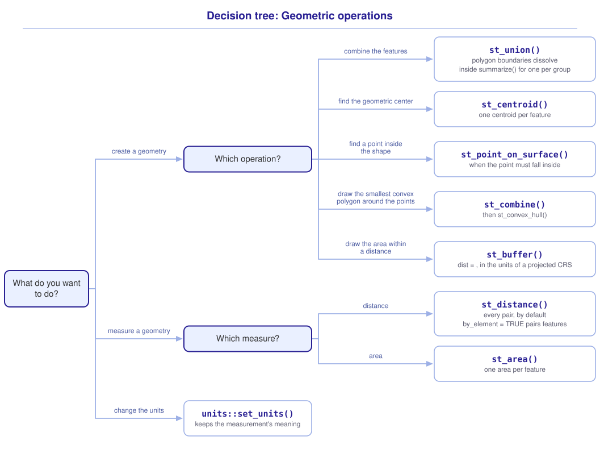

```{r}
#| include: false

library(sf)
library(tidyverse)
library(tmap)
library(webexercises)

source("src/r/course_functions.R")
source("src/r/reference_lookup.R")

lesson_refs <- find_lesson_references()
```

<hr>

<div>
{.intro_image fig-alt="Course logo"}

Simple features objects do more than store and display locations. Their geometries allow us to answer questions about the size, distance, and spatial arrangement of ecological features. In this lesson, we will apply the structure and coordinate reference system concepts from the previous lessons to operations that modify or measure geometries.

In completing this lesson, you will learn how to:

* Aggregate geometries with `st_union()`
* Calculate the centroid of a polygon or set of points with `st_centroid()`
* Calculate distances with `st_distance()`
* Work with the units attached to spatial measurements
* Calculate polygon areas with `st_area()`
* Create spatial buffers with `st_buffer()`

**Important!** Before starting this tutorial, be sure that you have completed all preliminary and previous lessons!

</div>

## Data for this lesson

Please click on the button below to explore the metadata for this lesson!

<button class="accordion">Metadata</button>
::: panel
In this lesson, we will explore:

```{r}
#| echo: false
#| output: asis

lesson_metadata(
  .dataset =
    c(
      "counties.geojson",
      "dc_census.geojson",
      "observatory_nets.geojson"
    ),
  .variables =
    list(
      `counties.geojson` =
        c(
          "GEOID",
          "NAME",
          "STATE_NAME"
        ),
      `dc_census.geojson` =
        c(
          "GEOID",
          "INCOME",
          "POPULATION"
        )
    )
) %>%
  cat()
```
:::

## Set up your session

Please complete the following to ensure that you are working in a clean session:

1. Please ensure that your **Global Environment** is empty.
2. In the *History* tab of your **workspace pane**, ensure that your **session history** is empty.

Now that we are working in a clean session:

1. Create a script file.
2. Save your script file as `scripts/geometric_operations.R`.
3. Add metadata as a comment at the top of the file.
4. Following your metadata, create a new **code section** and call it "`setup`".
5. Attach the *sf*, *tmap*, and core tidyverse packages.
6. Load `scripts/source_script_module_3.R`, then read and preprocess the three simple features objects below.

At this point, your script should look something like:

```{r}
#| message: false
#| warning: false

# My code for the geometric operations tutorial

# setup --------------------------------------------------------

library(sf)
library(tmap)
library(tidyverse)

# Load the source script:

source("scripts/source_script_module_3.R")

# United States counties:

counties <-
  st_read(
    "data/raw/shapefiles/counties.geojson",
    quiet = TRUE
  ) %>%
  set_names(
    names(.) %>%
      tolower()
  ) %>%
  st_transform(crs = 5070)

# District of Columbia census tracts:

dc_census <-
  st_read(
    "data/raw/shapefiles/dc_census.geojson",
    quiet = TRUE
  ) %>%
  clean_names() %>%
  select(geoid, income, population) %>%
  st_transform(crs = 32618)

# Bird Observatory mist-net locations:

observatory_nets <-
  st_read(
    "data/raw/shapefiles/observatory_nets.geojson",
    quiet = TRUE
  ) %>%
  clean_names() %>%
  st_transform(crs = 32618)
```

The counties use an equal-area CRS built for the conterminous United States. The two District of Columbia objects use UTM zone 18N, a projected CRS appropriate for local measurements around Washington, DC. Because both CRSs use meters, numeric distances supplied to the operations below can be interpreted in meters. Recall from ***3.4 The coordinate reference system*** that the most appropriate CRS depends on the task and spatial extent.

## Spatial aggregation

Sometimes our polygons, multipolygons, and points contain more features than are needed. To address this, we use a process called **spatial aggregation**, which combines features.

### Aggregate polygons

For polygons, aggregation can also be called **dissolving** because boundaries between features are removed. The *sf* package uses `st_union()` to dissolve boundaries.

Let's subset the counties to the District of Columbia, Maryland, and Virginia:

```{r}
counties_dmv <-
  counties %>%
  filter(
    state_name %in%
      c(
        "District of Columbia",
        "Maryland",
        "Virginia"
      )
  )
```

If we apply `st_union()` to the entire object, every county is combined into a single geometry:

```{r}
counties_dmv %>%
  st_union()
```

To dissolve boundaries within groups of polygons, we can use `summarize()`. We group the data by the field that should define each resultant feature and combine the geometries with `st_union()`:

```{r}
states_dmv <-
  counties_dmv %>%
  summarize(
    geometry = st_union(geometry),
    .by = state_name
  )

states_dmv
```

Let's have a look:

```{r}
states_dmv %>%
  tm_shape() +
  tm_polygons(
    fill = "state_name",
    fill.legend =
      tm_legend(title = "State")
  )
```

The county boundaries have been dissolved, but the boundary around each state remains.

### Aggregate points

We can also combine point features. Let's look at `observatory_nets`, which represents the locations where Tara and I mist-net birds outside of our office at the Bird Observatory:

```{r}
observatory_nets
```

Each feature is a point. When we aggregate the geometry, the points become a single multipoint feature:

```{r}
observatory_nets %>%
  st_union()
```

Like polygons, points can also be aggregated by a grouping field:

```{r}
observatory_nets %>%
  summarize(
    geometry = st_union(geometry),
    .by = region
  )
```

::: now_you
 [Check your understanding]{style="padding-left: 0.5em;"}

What does `st_union()` do when it is applied to all features of a polygon object?

`r longmcq(c(answer = "Combines the features and dissolves their internal boundaries", "Converts the polygons to points", "Adds their areas as a field", "Transforms their CRS"))`

True or false: Grouping before unioning geometries allows one resultant geometry to be created for each group.

`r torf(TRUE)`
:::

## Centroids

The **centroid** of a feature is its geometric center. We can use `st_centroid()` to calculate this location.

When applied to a polygon object with multiple features, `st_centroid()` returns the centroid of each feature. The code below returns the centroid of each state within `states_dmv`:

```{r}
states_dmv %>%
  tm_shape() +
  tm_polygons() +
  states_dmv %>%
  st_centroid() %>%
  tm_shape() +
  tm_dots(
    fill = "red",
    size = 0.1
  )
```

::: mysecret
 [Centroids can fall outside polygons!]{style="font-size: 1.25em; padding-left: 0.5em;"}

The centroid of a concave or multipart polygon may fall outside of the polygon. When an interior label or representative point is required, `st_point_on_surface()` is often a better choice.
:::

Because `st_centroid()` calculates the centroid of each feature, applying it directly to individual point features is not very interesting. If we aggregate all of our points first, we can calculate the centroid of the entire set:

```{r}
observatory_centroid <-
  observatory_nets %>%
  st_union() %>%
  st_centroid()

observatory_centroid
```

Likewise, if we aggregate points by banding region, we can calculate the centroid of each region:

```{r}
observatory_regions_centroids <-
  observatory_nets %>%
  summarize(
    geometry = st_union(geometry),
    .by = region
  ) %>%
  st_centroid()

observatory_regions_centroids
```

Let's plot the net locations and regional centroids:

```{r}
observatory_nets %>%
  tm_shape() +
  tm_dots(
    fill = "region",
    size = 0.08,
    group = "Mist nets"
  ) +
  observatory_regions_centroids %>%
  tm_shape() +
  tm_dots(
    fill = "red",
    size = 0.15,
    group = "Regional centroids"
  )
```

## Distance

We can calculate the distance between simple features objects, or between features within them, using `st_distance()`. For example, we can calculate the distance between the Lincoln Memorial and the center of our mist-netting area.

First, let's create the Lincoln Memorial point. Its coordinates were recorded in EPSG 4326, so we assign that CRS and then transform the point to the CRS of `observatory_centroid`:

```{r}
lincoln_memorial <-
  st_point(
    c(-77.05016, 38.88942)
  ) %>%
  st_sfc(crs = 4326) %>%
  st_transform(
    st_crs(observatory_centroid)
  )
```

Now we can calculate the distance:

```{r}
lincoln_memorial %>%
  st_distance(
    observatory_centroid,
    by_element = TRUE
  )
```

The numerical distance is followed by its units (`[m]`). This output is a units-class object. We can convert between units with `units::set_units()`:

```{r}
lincoln_memorial %>%
  st_distance(
    observatory_centroid,
    by_element = TRUE
  ) %>%
  units::set_units("km")
```

The argument `by_element = TRUE` pairs the first feature of one object with the first feature of the other, the second with the second, and so on. The two objects must therefore contain the same number of features. The default, `by_element = FALSE`, calculates every pairwise distance and returns a matrix.

For example, we can calculate the distance from every mist net to the observatory centroid:

```{r}
observatory_nets %>%
  st_distance(observatory_centroid)
```

Because there is one centroid, the matrix contains one column. We can add those distances to the point object by extracting that column:

```{r}
observatory_nets %>%
  mutate(
    dist_to_center_m =
      st_distance(
        .,
        observatory_centroid
      )[, 1]
  )
```

A common task in spatial ecology is to calculate the pairwise distances among all features in an object. These distances form a **distance matrix**:

```{r}
observatory_nets %>%
  st_distance()
```

::: now_you
 [Now you!]{style="font-size: 1.25em; padding-left: 0.5em;"}

Calculate the distance from each regional centroid in `observatory_regions_centroids` to the Lincoln Memorial. Convert the result to kilometers.

[Click here to see my answer]{.answer_link data-answer="a-3-6-distance"}

::: {.answer_body #a-3-6-distance}

```{r}
observatory_regions_centroids %>%
  st_distance(lincoln_memorial) %>%
  units::set_units("km")
```

:::
:::

## Area

We are commonly asked to calculate the area of polygon features. For example, perhaps we want to generate a map of population density by census tract in the District of Columbia.

We can calculate the area of each census tract with `st_area()` and add these data as a new field with `mutate()`:

```{r}
dc_census %>%
  mutate(
    area = st_area(.)
  )
```

Like `st_distance()`, the output is a units object. Here, the units are square meters. We can convert this to square kilometers with `units::set_units()` and calculate population density:

```{r}
dc_census_density <-
  dc_census %>%
  mutate(
    area =
      st_area(.) %>%
      units::set_units("km^2"),
    population_density = population / area
  )

dc_census_density
```

Let's map the result:

```{r}
dc_census_density %>%
  tm_shape() +
  tm_polygons(
    fill = "population_density",
    fill.scale =
      tm_scale(
        values = "brewer.or_rd",
        style = "quantile"
      ),
    fill.legend =
      tm_legend(
        title = "Population density per square km"
      )
  )
```

### The area occupied by a set of points

If we want a simple polygon describing the area occupied by a set of points, one option is the **minimum convex polygon**, the smallest convex polygon that contains every point. This is often applied in spatial ecology as a rough estimate of an individual's home range, although there are much better methods.

To generate a minimum convex polygon, we first aggregate the points with `st_union()` and then generate the polygon with `st_convex_hull()`:

```{r}
observatory_hull <-
  observatory_nets %>%
  st_union() %>%
  st_convex_hull()

observatory_hull
```

We can then calculate the area occupied by the convex hull:

```{r}
observatory_hull %>%
  st_area()
```

## Spatial buffers

In spatial ecology, and lots of other fields, it is often necessary to evaluate the environment around a feature. One method for doing so is creating a **spatial buffer**, which describes the area within a specified distance of a point, line, or polygon.

We can create a buffer polygon with `st_buffer()`. We supply the object that we would like to buffer and the distance from the feature. Because `observatory_centroid` uses a projected CRS measured in meters, `dist = 2000` creates a buffer extending 2,000 meters from the centroid:

```{r}
observatory_centroid_buffer <-
  observatory_centroid %>%
  st_buffer(dist = 2000) %>%
  st_sf()

observatory_centroid_buffer
```

Let's map the centroid and its buffer:

```{r}
observatory_centroid_buffer %>%
  tm_shape() +
  tm_borders(lwd = 1.5) +
  observatory_centroid %>%
  tm_shape() +
  tm_dots(
    fill = "red",
    size = 0.1
  )
```

If we have multiple features, a buffer is drawn around each feature. For example, Tara will guide our team in conducting fixed-radius point counts at the center of each mist-netting region. We can help the team visualize a 50-meter radius around each centroid:

```{r}
observatory_regions_centroids %>%
  st_buffer(dist = 50) %>%
  tm_shape() +
  tm_borders(
    col = "blue",
    lwd = 1.5
  ) +
  observatory_regions_centroids %>%
  tm_shape() +
  tm_dots(
    fill = "red",
    size = 0.1
  )
```

Sometimes a single ring is not enough. During point counts, our field teams may bin observations within several distance classes. We will return to the construction of multiple buffers in ***4.3 Applying iteration to GIS in R***, where it becomes a useful application of iteration.

::: now_you
 [Check your understanding]{style="padding-left: 0.5em;"}

Why must the CRS units be considered before supplying a numeric distance to `st_buffer()`?

`r longmcq(c(answer = "The buffer distance is interpreted using the coordinate units of the object", "A buffer can only be created in EPSG 4326", "The CRS determines the number of features", "st_buffer() transforms the object automatically"))`

True or false: Buffering an object with three point features returns one buffer around each point unless the geometries are combined first.

`r torf(TRUE)`
:::

## Putting it all together

At this point, my hope is that you have a mental model for the geometric operations in this lesson. Choosing among them might look something like this (click to expand):

{.zoomable data-title="Decision tree: Geometric operations" data-pdf-key="geometric_operations" fig-alt="To create a geometry: combine features and dissolve polygon boundaries with st_union(), which returns one geometry per group when the data are grouped; find the geometric center of each feature with st_centroid(); find a point that falls inside the shape with st_point_on_surface(); draw the smallest polygon around a set of points with st_convex_hull(), combining the points first; and draw the area within a distance of a feature with st_buffer(), whose dist = argument is read in the units of the CRS. To measure a geometry, use st_distance(), which returns every pairwise distance unless by_element = TRUE pairs corresponding features, and st_area(), which returns one area per feature. To convert a measurement to other units, use units::set_units()."}



::: {.callout-note}

This tree is a visualization of *my* mental model for these functions. It is totally okay if your model differs! What is important is that you have a *working* model, a system in place that allows you to retrieve the function or functions that you need to solve a problem.

:::

## Take-home points

* `st_union()` combines geometries and dissolves the boundaries among polygon features. When used with grouped data, it creates one combined geometry for each group.
* `st_centroid()` returns the geometric center of each feature. Aggregate point features before calculating the centroid of the set.
* `st_distance()` returns pairwise distances by default. `by_element = TRUE` instead pairs corresponding features.
* Spatial measurements retain units. Use `units::set_units()` to convert them without discarding their meaning.
* `st_area()` calculates polygon area. Choose a CRS appropriate for the spatial extent and measurement before interpreting the result.
* `st_convex_hull()` creates the smallest convex polygon containing a geometry.
* `st_buffer()` creates a polygon extending a supplied distance from a geometry. The meaning of that numeric distance depends on the CRS.

## Exercises

::: now_you
 [Test your knowledge!]{style="font-size: 1.25em; padding-left: 0.5em;"}

1. Which operation removes the internal county boundaries while maintaining one feature for each state?

   `r longmcq(c(answer = "Summarize by state and combine geometry with st_union()", "Apply st_centroid() to every county", "Apply st_buffer() to the county object", "Transform every county to the same CRS"))`

2. You apply `st_distance()` to an object containing eight points without supplying a second object. What is returned?

   `r longmcq(c(answer = "An 8 by 8 pairwise-distance matrix", "A vector containing eight areas", "A single distance", "Eight buffer polygons"))`

3. Match each function to the geometric operation that it completes:

   ```{r}
   #| echo: false
   #| results: asis

   matching_game(
     .pairs =
       tribble(
         ~ left,                                  ~ right,
         "Dissolve boundaries",                  "st_union()",
         "Calculate a geometric center",         "st_centroid()",
         "Measure a polygon",                    "st_area()",
         "Create an area within a set distance", "st_buffer()"
       ),
     .id = "match-3-6-geometric-operations"
   )
   ```

4. A researcher wants a 500-meter buffer around every sampling point. Which order of operations is appropriate?

   `r longmcq(c(answer = "Transform the points to an appropriate projected CRS measured in meters, then call st_buffer(dist = 500)", "Assign EPSG 4326 and call st_buffer(dist = 500)", "Call st_area() and then st_buffer()", "Union all points and call st_buffer(dist = 500)"))`
:::


