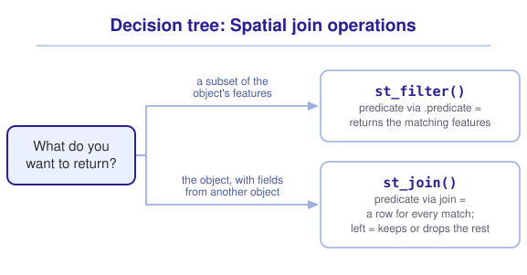
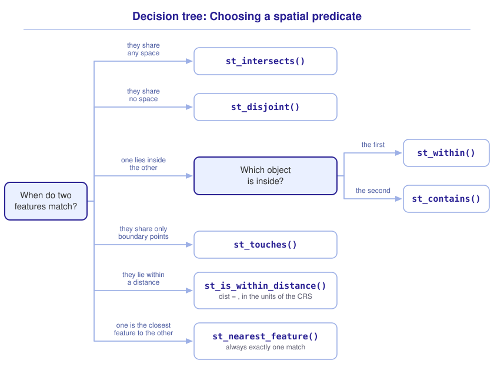

```{r}
#| include: false

library(webexercises)
library(sf)
library(tidyverse)

source("src/r/course_functions.R")
source("src/r/reference_lookup.R")

lesson_refs <- find_lesson_references()
```

<hr>

<div>
{.intro_image fig-alt="Course logo"}

Many of the questions that we ask in ecology relate to the proximity between geospatial data. Examples of proximity questions include:

* Which of our sampling sites are located within a protected area?
* How many observations of an invasive species occurred in each county?
* Which stream is closest to a nest?

Each question describes a relationship between the features of two spatial datasets, and none of them can be answered with the values in the fields. A **spatial join** is a join conducted between two shapefile objects based on overlapping or non-overlapping geometries. When we joined two tables with `left_join()` (see ***2.6 Tidy data***), the match was defined by a shared key column. In a spatial join, the match is defined by location. In this lesson, we will learn how to state a spatial relationship as a question that R can evaluate, and how to use the answer to subset the features of a simple features object or add fields to it.

In completing this lesson, you will learn how to:

* Test the relationship between two geometries with **spatial predicate** functions, such as `st_intersects()`
* Subset the features of a simple features object by location with `st_filter()`
* Add fields to a simple features object by location with `st_join()`
* Recognize when a spatial join returns unmatched or duplicated features

**Important!** Before starting this tutorial, be sure that you have completed all preliminary and previous lessons!

</div>

## Data for this lesson

<button class="accordion">Please click on the button below to explore the metadata for this lesson!</button>
::: panel
In this lesson, we will explore:

```{r}
#| echo: false
#| output: asis

lesson_metadata(
  .dataset =
    c(
      "dc_census.geojson",
      "rock_creek_park.geojson",
      "sites.csv"
    )
) %>%
  cat()
```
:::

## Set up your session

Please complete the following to ensure that you are working in a clean session:

1. Please ensure that your **Global Environment** is empty.
2. In the *History* tab of your **workspace pane**, ensure that your **session history** is empty.

Now that we are working in a clean session:

1. Create a script file.
2. Save your script file as `scripts/spatial_joins.R`.
3. Add metadata as a comment on the top of the file.
4. Following your metadata, create a new **code section** and call it "`setup`".
5. Following your section header, attach the *sf* package and the packages that comprise the **core tidyverse**, then run `source_script.R`.

At this point, your script should look something like:

```{r}
#| eval: false

# My code for the spatial joins tutorial

# setup --------------------------------------------------------

library(sf)
library(tidyverse)

source("modules/module_3/scripts/source_script.R")
```

```{r}
#| include: false

source("modules/module_3/scripts/source_script.R")
```

Next, create a new code section called "`read and pre-process data`". We will read in a shapefile of census tracts in the District of Columbia:

```{r}
#| results: hide

# DC census tracts:

census <-
  st_read(
    "data/raw/shapefiles/dc_census.geojson",
    quiet = TRUE
  ) %>%
  clean_names() %>%
  select(
    geoid,
    income,
    population
  )
```

... and a shapefile of the land parcels that make up Rock Creek Park, a National Park that bisects the city:

```{r}
#| results: hide

# Rock Creek Park parcels:

parks <-
  st_read(
    "data/raw/shapefiles/rock_creek_park.geojson",
    quiet = TRUE
  ) %>%
  select(name)
```

Let's read in our final dataset as a "Now you!" challenge:

::: now_you
 [Now you!]{style="font-size: 1.25em; padding-left: 0.5em;"}

In a single piped statement:

* Read in the tabular dataset `sites.csv`;
* Convert the data to a simple features object, using the CRS in which the locations were recorded (see the metadata above);
* Assign the resultant object to your global environment with the name `sites`.

*Hint: We converted tabular data to a simple features object with `st_as_sf()` in **3.2 Introduction to shapefiles**, and chose the CRS to supply in **3.4 The coordinate reference system**.*

[Click here to see my answer]{.answer_link data-answer="a-3-5-sites"}

::: {.answer_body #a-3-5-sites}

```{r}
sites <-

  # Read in the site locations:

  read_csv("data/raw/sites.csv") %>%

  # Convert to a simple features object:

  st_as_sf(
    coords = c("lon", "lat"),
    crs = 4326
  )
```

:::
:::

The census tracts describe the socioeconomic setting of the city, the park parcels describe a protected area within it, and the sites are Neighborhood Nestwatch sampling locations in the greater Washington DC region. No field is shared among these objects. Location is the only information that connects them.

## Spatial predicates

In a join between two tables, each row of one table is tested for a match in the other. In a spatial join, a match is defined by a **spatial predicate**, which is a logical test of the relationship between two geometries. *Note: Recall that a **predicate** is a logical test (i.e., it returns `TRUE` or `FALSE`).*

The predicate that we will use most often is `st_intersects()`, which tests whether two geometries share any space. We supply the following arguments:

* The object whose features we are asking about (typically passed to the function via a pipe)
* The object that the features are compared against

Let's ask which census tracts each of our sites intersects:

```{r}
#| error: true

sites %>%
  st_intersects(census)
```

This generated an error, because the CRS of `sites` is EPSG 4326 and the CRS of `census` is EPSG 32618. The same coordinate values describe different locations in different reference systems (see ***3.4 The coordinate reference system***), so a comparison between them is not meaningful. We can address this by transforming `sites` to the CRS of `census`. Because we will use `sites` throughout this lesson, let's make the transformation a part of our pre-processing statement:

```{r}
sites <-
  read_csv("data/raw/sites.csv") %>%

  # Convert to a simple features object:

  st_as_sf(
    coords = c("lon", "lat"),
    crs = 4326
  ) %>%

  # Transform to the CRS of the census data:

  st_transform(
    st_crs(census)
  )
```

*Note: Recall from **3.4 The coordinate reference system** that a projected CRS is the better choice when conducting spatial operations. Because the census tracts contain many more vertices than the sites, we transform the sites to the CRS of the census data rather than the reverse (see **3.2 Introduction to shapefiles**).*

With both objects in the same CRS, we can run the test:

```{r}
sites %>%
  st_intersects(census)
```

`st_intersects()` returns a list with one element for each feature of `sites`. Each element contains the row numbers of the features of `census` that the site intersects. In the printed output, we can read that the sixth site is located within the census tract stored in row 84, and that the first five sites intersect no tract at all (the sites include locations in suburban Maryland, and the census tracts describe the District of Columbia alone).

### The family of spatial predicates

Every spatial predicate answers a different question, and each is a variation of the same test. The predicates that we will use in this course include:

* `st_intersects()` tests whether two geometries share any space;
* `st_disjoint()` tests whether two geometries share no space (the opposite of `st_intersects()`);
* `st_within()` tests whether the first geometry is completely inside the second;
* `st_contains()` tests whether the first geometry completely contains the second;
* `st_touches()` tests whether two geometries share boundary points but no interior points;
* `st_is_within_distance()` tests whether two geometries are within a supplied distance of one another.

Notice that `st_within()` and `st_contains()` describe the same relationship from opposite directions. The order in which we supply the objects therefore matters. Below, we ask whether each *site* is within a *tract*:

```{r}
sites %>%
  st_within(census)
```

... and whether each *tract* contains a *site*:

```{r}
census %>%
  st_contains(sites)
```

The first statement returns a list with an element for each site, and the second returns a list with an element for each tract. The matches are the same pairs of features, read from opposite directions.

The `st_is_within_distance()` predicate accepts a distance, in the units of the CRS, through the `dist = ` argument. Our data are in a UTM CRS, so the following tests which sites are located within 2,000 meters of a park parcel:

```{r}
sites %>%
  st_is_within_distance(
    parks,
    dist = 2000
  )
```

::: mysecret

 [Where do the predicates come from?]{style="font-size: 1.25em; padding-left: 0.5em;"}

The simple features standard defines every geometry by its interior, its boundary, and its exterior. For a polygon, the interior is the enclosed area, the boundary is the ring that encloses it, and the exterior is everything else. Each spatial predicate is defined by which of these components two geometries share. For example, two geometries *touch* when their boundaries share at least one point and their interiors share none. The full set of predicates, including `st_crosses()`, `st_overlaps()`, `st_covers()`, and `st_equals()`, is described in `?geos_binary_pred`.
:::

::: now_you
 [Now you!]{style="font-size: 1.25em; padding-left: 0.5em;"}

Before running any code, predict what `census %>% st_intersects(parks)` returns. How long is the resultant list, and what do the values in each element represent?

[Click here to see my answer]{.answer_link data-answer="a-3-5-predict"}

::: {.answer_body #a-3-5-predict}

```{r}
census %>%
  st_intersects(parks)
```

The list contains one element for each of the census tracts, and the values in each element are the row numbers of the park parcels that the tract shares space with. Most elements are empty, because most tracts do not intersect the park.

:::
:::

::: now_you
 [Check your understanding]{style="padding-left: 0.5em;"}

Which spatial predicate tests whether two geometries share boundary points but no interior points?

`r longmcq(c("st_intersects()", "st_within()", answer = "st_touches()", "st_disjoint()"))`

True or false: A spatial predicate can be applied to two objects with different coordinate reference systems.

`r torf(FALSE)`
:::

## Subset features by location

Reading a list of row numbers is rarely our goal. We usually want to act on the answer. In ***2.1 Introduction to subsetting and extraction***, we used `filter()` to subset the rows of a data frame by the values in its columns. The *sf* function `st_filter()` subsets the features of a simple features object by their relationship to the features of another object. We supply the following arguments:

* The object to subset (typically passed to the function via a pipe)
* The object that the features are compared against
* The spatial predicate that defines a match (`.predicate = `; `st_intersects` by default)

Let's subset our sites to those that intersect a census tract:

```{r}
sites %>%
  st_filter(census)
```

The features of `sites` that intersect a tract are returned with every field intact, and the features that intersect no tract are removed. We can see this on a map:

```{r}
census %>%
  ggplot() +
  geom_sf() +
  geom_sf(
    data =
      sites %>%
      st_filter(census)
  ) +
  theme_void()
```

To use a different definition of a match, we supply a predicate function to the `.predicate = ` argument, along with any arguments that the predicate requires. Below, we subset the census tracts to those within 500 meters of a park parcel:

```{r}
census %>%
  st_filter(
    parks,
    .predicate = st_is_within_distance,
    dist = 500
  )
```

*Note: The predicate is supplied without quotes or parentheses, because we are providing the function itself rather than calling it.*

Mapping the result places the subset in context:

```{r}
census %>%
  ggplot() +
  geom_sf() +
  geom_sf(
    data =
      census %>%
      st_filter(
        parks,
        .predicate = st_is_within_distance,
        dist = 500
      ),
    fill = "#FBEC5D"
  ) +
  geom_sf(data = parks) +
  theme_void()
```

::: mysecret

 [A feature is kept when the predicate is satisfied for *any* feature!]{style="font-size: 1.25em; padding-left: 0.5em;"}

`st_filter()` keeps a feature when the predicate returns `TRUE` for at least one feature of the second object. This makes `st_disjoint` misleading inside of `st_filter()`. It may seem that the following statement returns the sites outside of the census tracts:

```{r}
sites %>%
  st_filter(
    census,
    .predicate = st_disjoint
  )
```

Every site was returned! Each site, including every site inside the district, is disjoint from at least one of the census tracts. We will subset to unmatched features with a different tool below.
:::

::: now_you
 [Now you!]{style="font-size: 1.25em; padding-left: 0.5em;"}

Subset `sites` to the sites within 2,000 meters of a park parcel and map the result, with the park parcels as a background layer.

*Hint: The predicate and its distance argument are supplied in the same way as the census tract example above.*

[Click here to see my answer]{.answer_link data-answer="a-3-5-filter"}

::: {.answer_body #a-3-5-filter}

```{r}
parks %>%
  ggplot() +
  geom_sf() +
  geom_sf(
    data =
      sites %>%
      st_filter(
        parks,
        .predicate = st_is_within_distance,
        dist = 2000
      )
  ) +
  theme_void()
```

:::
:::

::: now_you
 [Check your understanding]{style="padding-left: 0.5em;"}

True or false: `st_filter()` removes the fields of the object that it subsets.

`r torf(FALSE)`

How is a non-default predicate supplied to `st_filter()`?

`r longmcq(c(answer = "As a function name, without quotes or parentheses, to the .predicate = argument", "As a character value to the .predicate = argument", "As a completed function call, such as st_touches(census)", "The predicate of st_filter() cannot be changed"))`
:::

## Add fields by location

In ***2.2 Introduction to mutation***, we used `mutate()` to add columns to a data frame. The *sf* function `st_join()` adds the fields of one simple features object to another, matching features with a spatial predicate. We supply the following arguments:

* The object to add fields to (typically passed to the function via a pipe)
* The object that provides the fields
* The spatial predicate that defines a match (`join = `; `st_intersects` by default)
* Whether unmatched features are maintained (`left = `; `TRUE` by default)

Let's join the census fields to our sites:

```{r}
sites %>%
  st_join(census)
```

Each site that intersects a tract received that tract's `geoid`, `income`, and `population` values. Each site that intersects no tract was maintained, with `NA` in every added field. The geometry of the resultant object is the geometry of `sites`, because the first object supplied to a spatial join provides the features and the second provides the fields.

Those `NA` values are informative! Because an unmatched feature receives `NA`, we can subset to the sites outside of the district by filtering on a missing value (see ***2.1 Introduction to subsetting and extraction***):

```{r}
sites %>%
  st_join(census) %>%
  filter(
    is.na(geoid)
  )
```

This is the subset that `st_disjoint` could not return above.

When we are only interested in the matched features, we can supply `left = FALSE`:

```{r}
sites %>%
  st_join(
    census,
    left = FALSE
  )
```

The features returned are the same sites that `st_filter()` returned, and the census fields are attached. Favor `st_filter()` when you want to subset features. Favor `st_join()` when you want the fields of the second object.

### One feature can match many features

A join returns a row for *every* match. When a feature satisfies the predicate with more than one feature of the second object, that feature is returned more than once. Let's join the park parcel names to the census tracts and compare the number of features before and after the join:

```{r}
nrow(census)

census %>%
  st_join(parks) %>%
  nrow()
```

The join returned more features than the object that we supplied! We can identify the duplicated features by counting the records for each `geoid` (see ***2.3 Grouped operations and summarizing***):

```{r}
census %>%
  st_join(parks) %>%
  as_tibble() %>%
  count(geoid) %>%
  filter(
    n > 1
  )
```

Each of these census tracts intersects two park parcels, so each is represented by two rows in the resultant object. A spatial join can change the number of rows that represent a feature, and any summary that we calculate from the result will count those features twice. Always compare the number of features before and after a join!

*Note: Recall that `as_tibble()` converts a data frame to a tibble (see **Preliminary Lesson 4: Objects**). In the statement above, the conversion removes the spatial structure of the joined object before we count its rows. We will explore why this is a useful habit in **3.7 Spatial and non-spatial joins in practice**.*

### Join to the nearest feature

The predicates above define a match by shared space. The `st_nearest_feature()` predicate instead matches each feature to the single closest feature of the second object. Below, we determine the park parcel that is nearest to each site:

```{r}
sites %>%
  st_join(
    parks,
    join = st_nearest_feature
  )
```

Every site received a `name`, because every site has a nearest parcel. Use this predicate with caution, because a match is returned regardless of the distance to that nearest feature. The sites in suburban Maryland were matched to park parcels many kilometers away. When a match is only meaningful within some distance, use `st_is_within_distance` and interpret unmatched features with care.

::: now_you
 [Now you!]{style="font-size: 1.25em; padding-left: 0.5em;"}

Add the census fields to the park parcels, maintaining only the parcels that intersect a tract. Before you run your statement, predict whether the resultant object will contain more than four features.

*Hint: A parcel that spans several tracts is matched by each of them.*

[Click here to see my answer]{.answer_link data-answer="a-3-5-join"}

::: {.answer_body #a-3-5-join}

```{r}
parks %>%
  st_join(
    census,
    left = FALSE
  )
```

The resultant object contains many more than four features. Each parcel intersects many census tracts, and the join returns a row for every parcel-tract match.

:::
:::

## Putting it all together

At this point my hope is that you have a mental model for spatial joins. Choosing the operation might look something like this (click to expand):

{.zoomable data-title="Decision tree: Spatial join operations" data-pdf-key="spatial_join_operation" fig-alt="Decision tree. The first question is what you want to return. A subset of an object's features gives st_filter(), whose predicate is supplied with .predicate = , and every field of the object is maintained. The object with fields added from another object gives st_join(), whose predicate is supplied with join = , and which returns a row for every match, with left = determining whether unmatched features are maintained."}



Choosing the predicate that defines a match is a separate question, with a tree of its own (click to expand):

{.zoomable data-title="Decision tree: Choosing a spatial predicate" data-pdf-key="spatial_predicates" fig-alt="Decision tree. The first question is how a match should be defined. Sharing any space gives st_intersects(). Sharing no space gives st_disjoint(). One geometry completely inside another gives st_within() when the first object is inside the second, and st_contains() when the first object contains the second. Sharing only boundary points gives st_touches(). Lying within a distance gives st_is_within_distance(), with the distance supplied to dist = in the units of the CRS. Being the closest feature gives st_nearest_feature(), which always returns exactly one match."}



::: {.callout-note}

As in ***2.1 Introduction to subsetting and extraction***, these trees are a visualization of *my* mental model for these functions. It is totally okay if your model differs! What is important is that you have a *working* model, a system in place that allows you to retrieve the function or functions that you need to solve a problem.

:::

## Take-home points

* A **spatial join** is a join conducted between two shapefile objects based on overlapping or non-overlapping geometries. Location, rather than a shared key, connects the tables.
* A **spatial predicate** is a logical test of the relationship between two geometries. `st_intersects()` tests for shared space, and each member of the predicate family tests a different relationship.
* A predicate returns a list with one element for each feature of the first object, containing the row numbers of the matching features of the second object.
* `st_within()` and `st_contains()` describe the same relationship from opposite directions, so the order in which the objects are supplied determines the result.
* Both objects in a spatial operation must share the same CRS. Transform the object with the fewest vertices to the CRS of the more complex object.
* `st_filter()` subsets the features of an object by location, and every field of the object is maintained. A feature is kept when the predicate is satisfied for *any* feature of the second object.
* `st_join()` adds the fields of the second object to the first. Unmatched features are maintained with `NA` values by default, and `left = FALSE` removes them.
* A spatial join returns a row for every match, so a feature that matches several features is duplicated in the result. Compare the number of features before and after a join.
* `st_nearest_feature()` matches every feature to its single closest counterpart, regardless of the distance between them.

## Exercises

::: now_you
 [Test your knowledge!]{style="font-size: 1.25em; padding-left: 0.5em;"}

1. `st_within(sites, census)` and `st_contains(census, sites)` identify the same pairs of features. How do the resultant objects differ?

   `r longmcq(c(answer = "The first returns a list with an element for each site, and the second returns a list with an element for each tract", "The first tests boundaries and the second tests interiors", "They do not differ", "The first returns a simple features object and the second returns a list"))`

2. True or false: `st_filter(sites, census)` and `st_join(sites, census, left = FALSE)` return the same features.

   `r torf(TRUE)`

3. A simple features object of 200 features is passed to `st_join()`, and the resultant object contains 208 features. Why?

   `r longmcq(c("Eight features of the second object were appended to the result", answer = "Some features satisfied the predicate with more than one feature of the second object, and a row is returned for every match", "The join added eight fields", "Unmatched features were duplicated"))`

4. You would like to subset a shapefile of nests to those inside of a management area. A colleague suggests `st_filter(nests, management_area, .predicate = st_disjoint)` to find the nests *outside* of the area instead. The management area contains several polygons. What does their statement return?

   `r longmcq(c(answer = "Every nest that is disjoint from at least one polygon, which may include every nest in the data", "The nests outside of every polygon", "An error, because st_disjoint may not be supplied to .predicate", "An empty simple features object"))`

5. Match each question to the spatial predicate that answers it:

   ```{r}
   #| echo: false
   #| results: asis

   matching_game(
     .pairs =
       tribble(
         ~ left,                                        ~ right,
         "Which sites fall inside a tract?",            "st_within()",
         "Which tracts share a border, and no interior space, with this tract?", "st_touches()",
         "Which sites lie within 500 meters of a stream?", "st_is_within_distance()",
         "Which stream is closest to each nest?",       "st_nearest_feature()"
       ),
     .id = "match-3-5-predicates"
   )
   ```

6. Parsons problem: Reorder the lines below to read in `sites.csv`, convert it to a simple features object, transform it to the CRS of `census`, and subset it to the sites within 1,000 meters of a park parcel. One line supplies the predicate incorrectly. Leave it in the trash.

   <div class="parsons-problem">
   <div id="p-3-5-01-trash" class="sortable-code"></div>
   <div id="p-3-5-01-sortable" class="sortable-code"></div>
   <div style="clear: both;"></div>
   <button id="p-3-5-01-check" class="parsons-btn parsons-btn-check" type="button">Check My Order</button>
   <button id="p-3-5-01-reset" class="parsons-btn parsons-btn-reset" type="button">Shuffle Again</button>
   <p id="p-3-5-01-feedback" class="parsons-feedback"></p>
   </div>

   <script>
   window.parsonsProblems = window.parsonsProblems || [];
   window.parsonsProblems.push({
     id: "p-3-5-01",
     maxDistractors: 1,
     code: "read_csv(\"data/raw/sites.csv\") %>%\n  st_as_sf(\n    coords = c(\"lon\", \"lat\"),\n    crs = 4326\n  ) %>%\n  st_transform(\n    st_crs(census)\n  ) %>%\n  st_filter(\n    parks,\n    .predicate = st_is_within_distance,\n    dist = 1000\n  )\n    .predicate = st_is_within_distance(1000) #distractor"
   });
   </script>
:::


