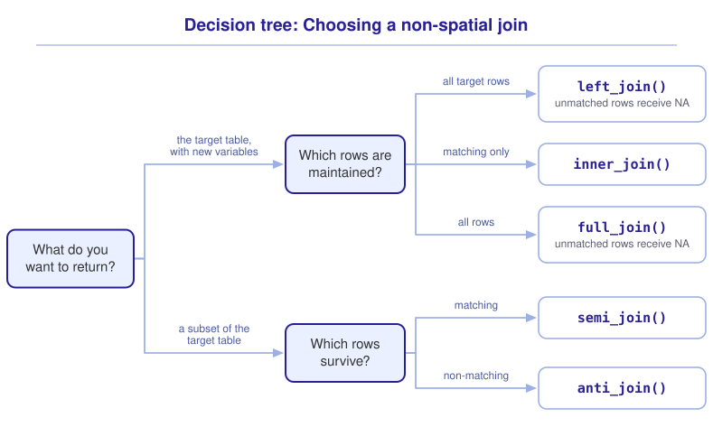

```{r}
#| include: false

library(webexercises)
library(sf)
library(tidyverse)

source("src/r/course_functions.R")
source("src/r/reference_lookup.R")

lesson_refs <- find_lesson_references()
```

<hr>

<div>
{.intro_image fig-alt="Course logo"}

The spotted lanternfly (*Lycorma delicatula*) is an invasive pest species whose spread is of commercial and ecological concern. In this lesson, we will use community science observations of the species to describe its spread across the eastern United States. Every tool that this task requires is one that we have developed in this module: reading and pre-processing shapefiles (***3.2 Introduction to shapefiles***), choosing and transforming a CRS (***3.4 The coordinate reference system***), spatial joins (***3.5 Spatial joins***), and non-spatial joins (***3.6 Introduction to joining data frames***). This lesson is primarily practice, and most of its code will be written by you!

In completing this lesson, you will learn how to:

* Choose between a spatial and a non-spatial join for a given task
* Apply filtering and mutating joins, spatial and non-spatial, in a single workflow
* Map the results of a join

**Important!** Before starting this tutorial, be sure that you have completed all preliminary and previous lessons!

</div>

## Data for this lesson

<button class="accordion">Please click on the button below to explore the metadata for this lesson!</button>
::: panel
In this lesson, we will explore:

```{r}
#| echo: false
#| output: asis

lesson_metadata(
  .dataset =
    c(
      "counties.geojson",
      "spotted_lanternfly.rds",
      "states"
    ),
  .variables =
    list(
      `counties.geojson` =
        c(
          "STATEFP",
          "COUNTYFP",
          "GEOID",
          "NAME",
          "STUSPS",
          "STATE_NAME",
          "ALAND",
          "AWATER"
        )
    )
) %>%
  cat()
```
:::

## Video content

In the video below, the following content is outdated (I have updated the script, but not the video):

* You no longer need to include `library(tidyverse)` *and* `library(lubridate)`. The package *lubridate* has now been added as a core package of the tidyverse.
* I (once again) use single quotes in this video and recommend using double-quotes.
* When using `!c(..., ...., ...)` I now place each argument on its own line to ensure that the arguments are indented two spaces underneath the function call.
* In the first "Now you!" challenge I ask you to "Add the following files to your global environment ..." -- this language is incorrect and should be something more like "read the files and assign them to names in your global environment".
* While not a part of the course style guide, I now prefer hanging parentheses over collapsed parentheses.
* In places where the code can be modernized a bit (using `join_by()` and `.by =`), I have included alternate versions under `# Note: ...`.



## Set up your session

Please complete the following to ensure that you are working in a clean session:

1. Please ensure that your **Global Environment** is empty.
2. In the *History* tab of your **workspace pane**, ensure that your **session history** is empty.

Now that we are working in a clean session:

1. Create a script file.
2. Save your script file as `scripts/spatial_and_nonspatial_joins.R`.
3. Add metadata as a comment on the top of the file.
4. Following your metadata, create a new **code section** and call it "`setup`".
5. Following your section header, attach the *sf* package and the packages that comprise the **core tidyverse**, then run `source_script.R`.

At this point, your script should look something like:

```{r}
#| eval: false

# My code for the spatial and non-spatial joins tutorial

# setup --------------------------------------------------------

library(sf)
library(tidyverse)

source("modules/module_3/scripts/source_script.R")
```

```{r}
#| include: false

source("modules/module_3/scripts/source_script.R")
```

Because our maps in this lesson do not require a graticule, let's also set the theme for all of our plots to `theme_void()` (see ***3.3 Constructing and converting shapefiles***):

```{r}
# Set the default theme for this session:

theme_set(
  new = theme_void()
)
```

Next, create a new code section called "`read and pre-process data`" and read in the data with the following challenges:

::: now_you
 [Now you!]{style="font-size: 1.25em; padding-left: 0.5em;"}

In a single piped statement:

* Read in the shapefile `states.shp`;
* Clean the field names with `clean_names()`;
* Subset the fields to `name`, renaming the field to `state`;
* Transform the object to EPSG 5070;
* Assign the resultant object to your global environment with the name `states`.

*Hint: We chose EPSG 5070, a projected CRS built for the conterminous United States, because this lesson maps the whole country and conducts spatial operations (see **3.4 The coordinate reference system**).*

[Click here to see my answer]{.answer_link data-answer="a-3-7-states"}

::: {.answer_body #a-3-7-states}

```{r}
#| results: hide

states <-

  # Read in the shapefile:

  st_read(
    "data/raw/shapefiles/states.shp",
    quiet = TRUE
  ) %>%

  # Clean the field names:

  clean_names() %>%

  # Subset to the field of interest and rename:

  select(state = name) %>%

  # Transform to a projected CRS for the conterminous US:

  st_transform(crs = 5070)
```

:::
:::

The lanternfly observations are stored as a tabular dataset. We will subset the data to research-grade observations (i.e., observations whose species identification has been confirmed by the iNaturalist community) and remove the fields that this lesson does not use:

```{r}
# Read in and pre-process the lanternfly observations:

lanternfly_tabular <-
  read_rds("data/raw/spotted_lanternfly.rds") %>%

  # Subset to research-grade observations:

  filter(
    quality_grade == "research"
  ) %>%

  # Remove fields that we will not use:

  select(
    !c(
      description,
      image_url,
      place_guess,
      quality_grade,
      user
    )
  )

lanternfly_tabular
```

::: now_you
 [Now you!]{style="font-size: 1.25em; padding-left: 0.5em;"}

The metadata states that the observation coordinates were recorded in EPSG 4326. In a single piped statement:

* Convert `lanternfly_tabular` to a simple features object, using only its coordinate columns;
* Transform the object to the CRS of `states`;
* Assign the resultant object to your global environment with the name `lanternfly_sf`.

*Hint: Supply `select(longitude:latitude)` before converting, so that the object contains no fields that we do not need. Recall from **3.4 The coordinate reference system** that the conversion must use the CRS in which the data were recorded.*

[Click here to see my answer]{.answer_link data-answer="a-3-7-lanternfly"}

::: {.answer_body #a-3-7-lanternfly}

```{r}
lanternfly_sf <-
  lanternfly_tabular %>%

  # Subset to the coordinate columns:

  select(longitude:latitude) %>%

  # Convert to a simple features object:

  st_as_sf(
    coords = c("longitude", "latitude"),
    crs = 4326
  ) %>%

  # Transform to the CRS of states:

  st_transform(
    st_crs(states)
  )
```

:::
:::

## Choose the join

Our first question is which states have spotted lanternfly observations. We can answer this question with a **filtering join**, and we have two kinds available:

* A non-spatial `semi_join()` (see ***3.6 Introduction to joining data frames***), because `lanternfly_tabular` and `states` share a `state` column;
* A spatial `st_filter()` (see ***3.5 Spatial joins***), because `lanternfly_sf` and `states` share a location.

Let's answer the question both ways:

::: now_you
 [Now you!]{style="font-size: 1.25em; padding-left: 0.5em;"}

1. Subset `states` to states with lanternfly observations using `semi_join()`, with `lanternfly_tabular` as the source table.

   *Hint: The tables share the key column `state`.*

   [Click here to see my answer]{.answer_link data-answer="a-3-7-semi"}

   ::: {.answer_body #a-3-7-semi}

   ```{r}
   states %>%
     semi_join(
       lanternfly_tabular,
       by = join_by(state)
     )
   ```

   :::

2. Subset `states` to states with lanternfly observations using `st_filter()`, with `lanternfly_sf` as the source object.

   *Hint: The default predicate is the one that this question requires.*

   [Click here to see my answer]{.answer_link data-answer="a-3-7-stfilter"}

   ::: {.answer_body #a-3-7-stfilter}

   ```{r}
   states %>%
     st_filter(lanternfly_sf)
   ```

   :::
:::

The two statements returned the same states. When both joins are available, which should we choose?

::: mysecret

 [Prefer a non-spatial join whenever the data allow one!]{style="font-size: 1.25em; padding-left: 0.5em;"}

The spatial version may look simpler, but spatial joins are computationally expensive. This spatial join took more than 10 times longer to process than the tabular join, and the time penalty increases with the size and complexity of the spatial objects. Use tabular joins whenever your objects share a key column, and save spatial joins for instances in which you have no alternative.
:::

Before conducting a non-spatial join between a tabular dataset and a shapefile, we should verify that the shared column uses the same values in both tables. The `state` columns of both objects are character vectors that spell state names in full. We can check for values of `lanternfly_tabular` that have no match in `states` with `anti_join()` (see ***3.6 Introduction to joining data frames***):

```{r}
lanternfly_tabular %>%
  anti_join(
    states,
    by = join_by(state)
  ) %>%
  pull(state) %>%
  unique()
```

The character value "Ontario" has no match in `states`, because a small number of observations occurred in Canada. Unmatched key values are dropped by a filtering join, which is the behavior that we want here.

Let's map our subset, with the full `states` object as a background layer (see ***2.5 Introduction to data visualization with ggplot***):

```{r}
states %>%
  semi_join(
    lanternfly_tabular,
    by = join_by(state)
  ) %>%
  ggplot() +
  geom_sf(data = states) +
  geom_sf(fill = "#FBEC5D")
```

::: now_you
 [Check your understanding]{style="padding-left: 0.5em;"}

A shapefile and a tabular dataset share a key column. Why does this lesson recommend a non-spatial join?

`r longmcq(c(answer = "Spatial joins are computationally expensive, and the tabular join returns the same result", "Spatial joins cannot be conducted between a shapefile and a tabular dataset", "Non-spatial joins are more accurate", "Shapefiles do not support filtering joins"))`

True or false: Before joining on a shared column, we should verify that the column uses the same values in both tables.

`r torf(TRUE)`
:::

## Map the number of observations per state

Our next question is how *many* observations have occurred in each state, which requires a **mutating join**. We will build the map in three steps: summarize the observations, join the summary to the states, and plot the result.

::: now_you
 [Now you!]{style="font-size: 1.25em; padding-left: 0.5em;"}

1. Using `lanternfly_tabular`, generate a summary table with a row for each state and a column, `n`, that contains the number of observations in that state.

   *Hint: We counted the records in each group in **2.3 Grouped operations and summarizing**.*

   [Click here to see my answer]{.answer_link data-answer="a-3-7-summary"}

   ::: {.answer_body #a-3-7-summary}

   ```{r}
   lanternfly_tabular %>%
     summarize(
       n = n(),
       .by = state
     )
   ```

   Or:

   ```{r}
   #| eval: false

   lanternfly_tabular %>%
     count(state)
   ```

   :::

2. Join the summary table to `states` with `left_join()`, maintaining every state.

   *Hint: Pipe the summary into the join and supply `states` as the target table with the placeholder (`.`) as the source table, so that the resultant object is a simple features object.*

   [Click here to see my answer]{.answer_link data-answer="a-3-7-left"}

   ::: {.answer_body #a-3-7-left}

   ```{r}
   lanternfly_tabular %>%
     summarize(
       n = n(),
       .by = state
     ) %>%
     left_join(
       states,
       .,
       by = join_by(state)
     )
   ```

   :::
:::

::: mysecret

 [The class of the target table is the class of the result!]{style="font-size: 1.25em; padding-left: 0.5em;"}

Only the class of the target table is maintained during a join. If we had supplied the summary table as the target, the resultant object would be a tibble rather than a simple features object, and `geom_sf()` would fail when we attempt to map it. The placeholder lets us pipe the summary into the join while `states` serves as the target.
:::

We can now map the result. Because we used `left_join()`, states with no observations were maintained with an `NA` in `n`, and we can assign those states a color with the `na.value = ` argument:

```{r}
lanternfly_tabular %>%
  summarize(
    n = n(),
    .by = state
  ) %>%
  left_join(
    states,
    .,
    by = join_by(state)
  ) %>%
  ggplot() +
  aes(fill = n) +
  geom_sf() +
  scale_fill_viridis_c(
    option = "plasma",
    na.value = "#dcdcdc"
  )
```

## When there is no shared key

The workflow above depended on `lanternfly_tabular` containing a `state` column. Location data often contain coordinates and nothing else, and `lanternfly_sf` is exactly that (we built it from the coordinate columns alone). To summarize such data by state, we first add the `state` field with a mutating spatial join, then proceed as above:

1. Join the `states` fields to `lanternfly_sf` with `st_join()`;
2. Convert the resultant object to a tibble with `as_tibble()`;
3. Summarize the number of observations per state;
4. Join the summary to `states` with `left_join()`;
5. Map the result.

::: now_you
 [Now you!]{style="font-size: 1.25em; padding-left: 0.5em;"}

Complete steps 1 through 3 above: add the `state` field to `lanternfly_sf`, convert the result to a tibble, and count the observations in each state.

*Hint: The default predicate of `st_join()` is the one that this task requires.*

[Click here to see my answer]{.answer_link data-answer="a-3-7-stjoin"}

::: {.answer_body #a-3-7-stjoin}

```{r}
lanternfly_sf %>%

  # Add the state field:

  st_join(states) %>%

  # Convert to a tibble:

  as_tibble() %>%

  # Count the observations per state:

  summarize(
    n = n(),
    .by = state
  )
```

:::
:::

::: mysecret

 [Convert to a tibble before you summarize a shapefile!]{style="font-size: 1.25em; padding-left: 0.5em;"}

When using `summarize()` with a shapefile, always convert the object to a tibble before passing the object to the `summarize()` function. This greatly reduces the memory required to conduct the operation! In the above, excluding `as_tibble()` nearly doubles the amount of time needed to process the operation and *more than* doubles the amount of memory the operation takes.
:::

The remaining steps are the workflow that we completed in the previous section. Here is the full statement, from points to map:

```{r}
lanternfly_sf %>%

  # Add the state field:

  st_join(states) %>%

  # Convert to a tibble:

  as_tibble() %>%

  # Count the observations per state:

  summarize(
    n = n(),
    .by = state
  ) %>%

  # Join the summary to states:

  left_join(
    states,
    .,
    by = join_by(state)
  ) %>%

  # Map the result:

  ggplot() +
  aes(fill = n) +
  geom_sf() +
  scale_fill_viridis_c(
    option = "plasma",
    na.value = "#dcdcdc"
  )
```

## Applying the workflow to counties

States are a coarse unit for describing the spread of an invasive species. Let's close this lesson by mapping the number of observations per *county* in the affected states. This is the same workflow at a finer scale, and it combines both kinds of join:

1. Read in and pre-process the counties shapefile;
2. Subset the counties to those within states that have lanternfly observations (a non-spatial filtering join);
3. Add each county's `geoid` to the lanternfly points (a mutating spatial join);
4. Count the observations per county;
5. Join the counts to the counties (a non-spatial mutating join);
6. Map the result.

::: now_you
 [Now you!]{style="font-size: 1.25em; padding-left: 0.5em;"}

1. Read in `counties.geojson`, clean the field names, subset the fields to `geoid` and `state_name`, and transform the object to the CRS of `states`. Assign the resultant object to the name `counties`.

   [Click here to see my answer]{.answer_link data-answer="a-3-7-counties"}

   ::: {.answer_body #a-3-7-counties}

   ```{r}
   #| results: hide

   counties <-
     st_read(
       "data/raw/shapefiles/counties.geojson",
       quiet = TRUE
     ) %>%
     clean_names() %>%
     select(geoid, state_name) %>%
     st_transform(
       st_crs(states)
     )
   ```

   :::

2. Subset `counties` to counties in states with lanternfly observations, using a non-spatial filtering join with `lanternfly_tabular` as the source table. Assign the resultant object to the name `counties_lanternfly`.

   *Hint: The key columns do not share a name. We addressed this situation in **3.6 Introduction to joining data frames**.*

   [Click here to see my answer]{.answer_link data-answer="a-3-7-counties-semi"}

   ::: {.answer_body #a-3-7-counties-semi}

   ```{r}
   counties_lanternfly <-
     counties %>%
     semi_join(
       lanternfly_tabular,
       by =
         join_by(state_name == state)
     )
   ```

   :::

3. Count the lanternfly observations per county: join the `geoid` field of `counties_lanternfly` to `lanternfly_sf` with a mutating spatial join, convert the result to a tibble, and count the observations for each `geoid`.

   [Click here to see my answer]{.answer_link data-answer="a-3-7-county-counts"}

   ::: {.answer_body #a-3-7-county-counts}

   ```{r}
   lanternfly_sf %>%
     st_join(
       counties_lanternfly %>%
         select(geoid)
     ) %>%
     as_tibble() %>%
     summarize(
       n = n(),
       .by = geoid
     )
   ```

   :::

4. Join the counts to `counties_lanternfly`, maintaining only the counties with at least one observation, and map the result with `scale_fill_viridis_c(option = "plasma")`. Add the affected states, `states %>% st_filter(lanternfly_sf)`, as a background layer.

   *Hint: An `inner_join()` maintains only the rows with matching key values, so no `na.value = ` argument is required.*

   [Click here to see my answer]{.answer_link data-answer="a-3-7-county-map"}

   ::: {.answer_body #a-3-7-county-map}

   ```{r}
   lanternfly_sf %>%

     # Add each county's geoid to the points:

     st_join(
       counties_lanternfly %>%
         select(geoid)
     ) %>%

     # Convert to a tibble:

     as_tibble() %>%

     # Count the observations per county:

     summarize(
       n = n(),
       .by = geoid
     ) %>%

     # Join the counts to the counties:

     inner_join(
       counties_lanternfly,
       .,
       by = join_by(geoid)
     ) %>%

     # Map the result:

     ggplot() +

     # Background states:

     geom_sf(
       data =
         states %>%
         st_filter(lanternfly_sf)
     ) +

     # Affected counties:

     geom_sf(
       aes(fill = n),
       color = NA
     ) +
     scale_fill_viridis_c(option = "plasma") +

     # State borders:

     geom_sf(
       data =
         states %>%
         st_filter(lanternfly_sf),
       fill = NA
     )
   ```

   :::
:::

## Putting it all together

Every join in this module, spatial and non-spatial, is an answer to two questions: what connects the tables, and what do you want to return? Choosing a join might look something like this (click to expand):

{.zoomable data-title="Decision tree: Choosing a join" data-pdf-key="choosing_a_join" fig-alt="Decision tree. The first question is what connects the tables. When the tables share key values, the next question is what you want to return: a subset of the target table gives semi_join() for matching keys and anti_join() for non-matching keys, and the target table with new variables gives left_join() to maintain all target rows, inner_join() to maintain matching rows only, and full_join() to maintain all rows of both tables. When the tables share only location, the next question is again what you want to return: a subset of the target object's features gives st_filter(), and the target object with new fields gives st_join()."}



::: {.callout-note}

As in ***2.1 Introduction to subsetting and extraction***, this tree is a visualization of *my* mental model for these functions. It is totally okay if your model differs! What is important is that you have a *working* model, a system in place that allows you to retrieve the function or functions that you need to solve a problem.

:::

## Take-home points

* When two tables share a key column, a non-spatial join and a spatial join can both answer the same question. Prefer the non-spatial join, because spatial joins are computationally expensive.
* Before joining on a shared column, verify that the column uses the same values in both tables. `anti_join()` returns the key values that have no match.
* Only the class of the target table is maintained during a join. Supply the simple features object as the target, using the placeholder (`.`) when the source table arrives by pipe, so that the result can be mapped.
* To summarize point data by polygon when no key is shared, add the polygon's key field to the points with `st_join()`, convert the result to a tibble, summarize, and join the summary back to the polygons.
* Convert a shapefile to a tibble with `as_tibble()` before summarizing it.
* A `left_join()` maintains unmatched target rows with `NA` values, which `na.value = ` can color on a map. An `inner_join()` maintains matching rows only.

## Exercises

::: now_you
 [Test your knowledge!]{style="font-size: 1.25em; padding-left: 0.5em;"}

1. A shapefile of watersheds and a tabular dataset of water quality samples both contain a `watershed_id` column. Which join should you use to add the sample values to the watersheds, and why?

   `r longmcq(c(answer = "A non-spatial join, because the tables share a key column and spatial joins are computationally expensive", "A spatial join, because one of the tables is a shapefile", "A spatial join, because the tables have different numbers of rows", "Either join, because they are equivalent in every way"))`

2. True or false: In `left_join(states, ., by = join_by(state))`, the placeholder supplies the piped object as the target table.

   `r torf(FALSE)`

3. You summarize a simple features object without converting it to a tibble first. What is the consequence?

   `r longmcq(c(answer = "The operation requires far more time and memory", "An error is generated", "The grouping variable is dropped", "The resultant object contains duplicated rows"))`

4. After `st_join()`, a point that falls outside of every polygon is:

   `r longmcq(c(answer = "Maintained, with NA in each field added by the join", "Removed from the resultant object", "Matched to the nearest polygon", "Duplicated"))`

5. Parsons problem: Reorder the lines below to count the lanternfly observations per state and map the result. Two lines accomplish the same step; use the one that maintains the simple features class of `states`. Leave the other in the trash.

   <div class="parsons-problem">
   <div id="p-3-7-01-trash" class="sortable-code"></div>
   <div id="p-3-7-01-sortable" class="sortable-code"></div>
   <div style="clear: both;"></div>
   <button id="p-3-7-01-check" class="parsons-btn parsons-btn-check" type="button">Check My Order</button>
   <button id="p-3-7-01-reset" class="parsons-btn parsons-btn-reset" type="button">Shuffle Again</button>
   <p id="p-3-7-01-feedback" class="parsons-feedback"></p>
   </div>

   <script>
   window.parsonsProblems = window.parsonsProblems || [];
   window.parsonsProblems.push({
     id: "p-3-7-01",
     maxDistractors: 1,
     code: "lanternfly_sf %>%\n  st_join(states) %>%\n  as_tibble() %>%\n  summarize(\n    n = n(),\n    .by = state\n  ) %>%\n  left_join(\n    states,\n    .,\n    by = join_by(state)\n  ) %>%\n    left_join(states, by = join_by(state)) %>% #distractor\n  ggplot() +\n  aes(fill = n) +\n  geom_sf()"
   });
   </script>
:::


