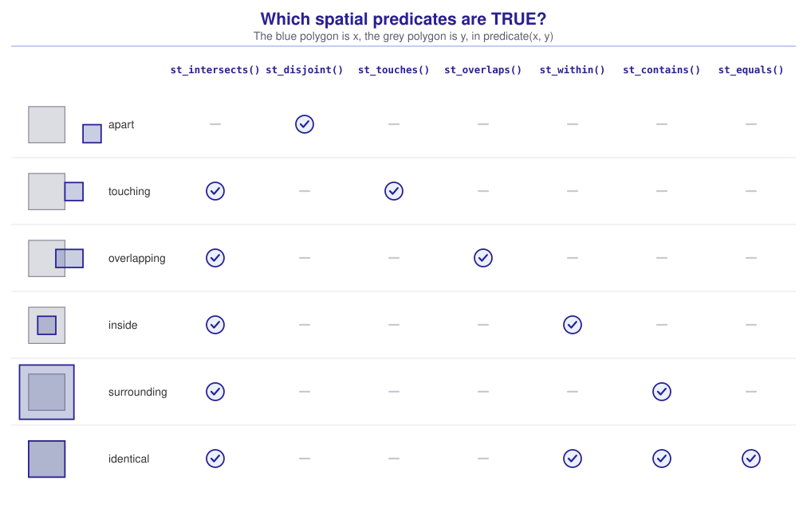
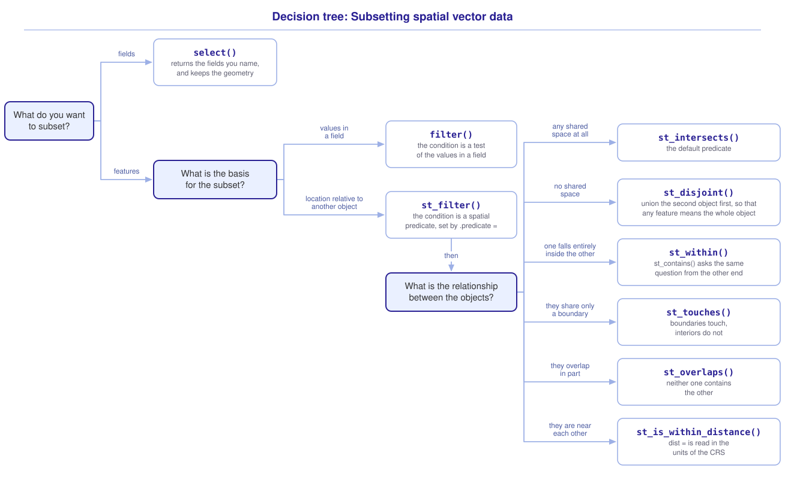

```{r}
#| include: false

library(sf)
library(tidyverse)
library(tmap)
library(webexercises)

source("src/r/course_functions.R")
source("src/r/reference_lookup.R")

lesson_refs <- find_lesson_references()
```

<hr>

<div>
{.intro_image fig-alt="Course logo"}

We often want to reduce a spatial object to a subset of its features (rows). We have used `filter()` to do so based on values in a field (column). In this lesson, we will explore subsetting features based on the relative geographic position of spatial vector objects -- **spatial filtering**. Spatial filtering allows us to subset features to just those of immediate interest (e.g., observations of wildebeest in a protected area, nests within a specified distance of a sampling patch, or counties adjacent to a river). The *sf* function `st_filter()` performs the operation, and the relationship that it tests is a **spatial predicate**, a logical test of how two geometries are arranged. In this lesson, we will explore how to conduct spatial filtering and which spatial predicates to use for given subsetting operations. You will learn how to:

* Subset the features of a spatial object by their location relative to another object with `st_filter()`
* Describe the condition a spatial filter tests, and name it with a **spatial predicate**
* Map the result of a filter, and use the map to check a filter that surprises you
* Choose the predicate that matches the question you are asking

**Important!** Before starting this tutorial, be sure that you have completed all preliminary and previous lessons!

</div>

## Data for this lesson

<button class="accordion">Please click on the button below to explore the metadata for this lesson!</button>
::: panel
In this lesson, we will explore:

```{r}
#| echo: false
#| output: asis

lesson_metadata(
  .dataset =
    c(
      "dc_census.geojson",
      "rock_creek_park.geojson",
      "district_birds.rds"
    ),
  .tables = list(district_birds.rds = "sites")
) %>%
  cat()
```
:::

## Set up your session

Please complete the following to ensure that you are working in a clean session:

1. Please ensure that your **Global Environment** is empty.
2. In the *History* tab of your **workspace pane**, ensure that your **session history** is empty.

Now that we are working in a clean session:

1. Create a script file.
2. Save your script file as `scripts/spatial_filtering.R`.
3. Add metadata as a comment on the top of the file.
4. Following your metadata, create a new **code section** and call it "`setup`".
5. Following your section header, attach *sf*, *tmap*, and the packages that comprise the **core tidyverse**, then load the module 3 source script.

At this point, your script should look something like:

```{r}
#| eval: false

# My code for the spatial filtering tutorial

# setup --------------------------------------------------------

library(sf)
library(tmap)
library(tidyverse)

# Load the source script:

source("scripts/source_script_module_3.R")

# Draw interactive maps over a topographic basemap:

tmap_mode("view")

tmap_options(basemap.server = "Esri.WorldTopoMap")
```

```{r}
#| include: false

source("scripts/source_script_module_3.R")
tmap_mode("view")
tmap_options(basemap.server = "Esri.WorldTopoMap")
```

Next, create a code section called "`read and pre-process data`". We will read the census tracts of the District of Columbia, subset them to the fields we need, and clean the field names:

```{r}
census <-
  st_read(
    "data/raw/shapefiles/dc_census.geojson",
    quiet = TRUE
  ) %>%
  clean_names() %>%
  select(
    geoid,
    income,
    population
  )
```

```{r}
#| echo: false

census
```

The printed object carries a `geometry` field that we did not name. `select()` subsets the fields of a simple features object and keeps the geometry with them, because the geometry is what makes the object spatial rather than a field we chose to keep.

We will also read the parcels that make up Rock Creek Park. These data use EPSG 32618, which is also the CRS of the census tracts:

```{r}
parks <-
  st_read(
    "data/raw/shapefiles/rock_creek_park.geojson",
    quiet = TRUE
  ) %>%
  clean_names()
```

```{r}
#| echo: false

parks
```

Finally, we will read the banding sites. The sites are stored as a data frame within a list, with longitude and latitude in separate fields. We will extract this data frame and convert it to a simple features object as we did in ***3.2 Introduction to spatial vector data***:

```{r}
sites <-
  read_rds("data/raw/district_birds.rds") %>%
  pluck("sites") %>%
  st_as_sf(
    coords = c("long", "lat"),
    crs = 4326
  )
```

```{r}
#| echo: false

sites
```

Before we subset anything, let's look at what we have. The census tracts cover the District, the park runs through the middle of it, and the banding sites are spread across the wider region:

```{r}
#| fig-alt: "An interactive map of the greater Washington DC region. The census tracts of the District are grey, the parcels of Rock Creek Park are green and run north to south through the northwest of the city, and the banding sites are red points spread well beyond the District into suburban Maryland and Virginia."

# Add the census tracts layer:

census %>%
  tm_shape() +
  tm_polygons(
    fill = "grey92",
    col = "grey40",
    lwd = 0.5,
    group = "Census tracts"
  ) +

  # Add the park parcels layer:

  parks %>%
  tm_shape() +
  tm_polygons(
    fill = "forestgreen",
    fill_alpha = 0.5,
    group = "Rock Creek Park"
  ) +

  # Add the banding sites layer:

  sites %>%
  tm_shape() +
  tm_dots(
    fill = "red",
    size = 0.5,
    group = "Banding sites"
  )
```

Pan and zoom, and click a site to read its identifier. Many of the sites fall well outside the census tracts, and the park overlaps tracts rather than falling inside one. Those two relationships are what we subset on below.

*Note:* *tmap* reprojects layers for display, so it drew these three together even though `sites` uses a different CRS from the other two. The functions that compare geometries do not reproject, and we will see what happens when they disagree once we begin filtering on location.

## Filtering using values stored in a column

The `census` object contains fields in addition to its geometry. Suppose that we want the census tracts with a median household income greater than \$100,000. That value is stored in the `income` field, so `filter()` can subset the tracts for us:

```{r}

# Subset census to where the median household income is greater than $100,000:

census %>%
  filter(income > 100000)
```

We get 33 of the 179 tracts. The count reports how many tracts were returned, and a map reports which:

```{r}
#| fig-alt: "The census tracts of the District in grey, with the 33 tracts above $100,000 in median household income filled gold. Most of the gold tracts form a single block in the west of the District, and a smaller group falls near the center."

# Plot all census data:

census %>%
  tm_shape() +
  tm_polygons(
    fill = "grey92",
    col = "grey40",
    lwd = 0.5,
    group = "All tracts"
  ) +

  # Subset census to where the median household income is greater than
  # $100,000:

  census %>%
  filter(income > 100000) %>%
  tm_shape() +
  tm_polygons(
    fill = "gold",
    col = "grey40",
    lwd = 0.5,
    group = "Income above $100,000"
  )
```

Most of the tracts that we subset form a single block in the west of the District, and a smaller group falls near the center.

## When the value is not stored in a column

Now suppose that we want the banding sites that occur within the District. Let's look at what `sites` stores:

```{r}
sites
```

Each feature stores a `site_id` and a geometry. The value of `site_id` identifies the site, and no field records the city or the state, so `filter()` has no value to test.

The information that we need is in the geometries. A site occurs within the District when its point falls on one of the census tracts, which is a relationship between two geometries rather than a value in a column.

## Filtering on location

`st_filter()` is the *sf* function that subsets features by location. We pipe the object that we want to subset into `st_filter()` and supply another spatial object for comparison:

```{r}
#| error: true

sites %>%
  st_filter(census)
```

The call returns the error `st_crs(x) == st_crs(y) is not TRUE`. The `sites` object uses EPSG 4326 and the `census` object uses EPSG 32618. The same pair of coordinate values describes a different location in each CRS (see ***3.4 The coordinate reference system: Why it matters and how to use it***), so *sf* requires a shared CRS before comparing the geometries.

I prefer to transform data during pre-processing. Please return to your `read and pre-process data` section and add `st_transform()` to the code block that read in the data, such that `sites` and `census` share the same CRS:

```{r}
sites <-
  read_rds("data/raw/district_birds.rds") %>%
  pluck("sites") %>%
  st_as_sf(
    coords = c("long", "lat"),
    crs = 4326
  ) %>%
  st_transform(
    st_crs(census)
  )
```

*Note: We transform the sites rather than the census tracts because the tracts store far more vertices, and transforming them would require more calculations.*

::: mysecret
 [Every spatial comparison requires a shared CRS!]{style="font-size: 1.25em; padding-left: 0.5em;"}

The functions in this lesson return `st_crs(x) == st_crs(y) is not TRUE` when the CRSs of the input objects differ. If you receive this error, transform one object to the CRS of the other. CRS transformation belongs in your pre-processing rather than within the spatial comparison.
:::

With both objects in the same CRS, `st_filter()` runs without error:

```{r}

# Subset to sites in DC:

sites %>%
  st_filter(census)
```

`st_filter()` returns 8 of the 80 banding sites. Let's take a look on the map:

```{r}
#| fig-alt: "The same map with only the filtered sites drawn. Eight red points remain, all of them on grey census tracts and clustered in and around Rock Creek Park in the northwest of the District. The points in Maryland and Virginia are gone."

# Add the census tracts layer:

census %>%
  tm_shape() +
  tm_polygons(
    fill = "grey92",
    col = "grey40",
    lwd = 0.5,
    group = "Census tracts"
  ) +

  # Subset to sites in DC:

  sites %>%
  st_filter(census) %>%
  tm_shape() +
  tm_dots(
    fill = "red",
    size = 0.7,
    group = "Sites in the District"
  )
```

Compare this with the map above. The sites beyond the tracts are gone, and the sites drawn here are the ones whose points fall on a tract. That relationship between the two geometries is the whole of what the filter tested.

Like `filter()`, `st_filter()` returns a subset of the rows from the input object. The returned object contains the `site_id` and geometry fields from `sites`, but does not include fields from `census`. We will use spatial joins to add fields from another spatial object in ***4.3 Spatial joins***.

The object supplied through the pipe is the object that `st_filter()` subsets and returns. This means that the order of the objects determines the type of features in the result.

::: now_you
 [Now you!]{style="font-size: 1.25em; padding-left: 0.5em;"}

Return the census tracts that Rock Creek Park runs through, rather than the sites.

*Hint: `st_filter()` returns a subset of the rows of the object that we pipe into it. Which of the two objects do you want rows of?*

[Click here to see my answer]{.answer_link data-answer="a-4-1-reverse"}

::: {.answer_body #a-4-1-reverse}

```{r}
census %>%
  st_filter(parks)
```

`st_filter()` returns 19 census tracts because `census` is the object that we filtered. Reversing the order would return the park parcels that intersect a census tract.

:::
:::

## The condition is a spatial predicate

We did not explicitly define the spatial relationship in the previous call because `st_filter()` used its default predicate.

A **predicate** is a test that returns `TRUE` or `FALSE`. For example, `wing > 80` is the predicate that `filter()` evaluates for each row. A **spatial predicate** is a logical test of the relationship between two geometries. We supply the predicate function to the `.predicate = ` argument of `st_filter()`:

```{r}
sites %>%
  st_filter(
    census,
    .predicate = st_intersects
  )
```

The result has not changed because the default value of `.predicate = ` is `st_intersects`. This predicate returns `TRUE` when two geometries share any space.

*Note: We supply the predicate as a function without parentheses. `st_filter()` applies this function to pairs of features.*

Changing the predicate changes the spatial relationship that subsets the object. Suppose that we want the banding sites that occur inside Rock Creek Park. `st_within()` returns `TRUE` when one geometry occurs entirely within another:

```{r}

# Subset to sites within a park parcel:

sites %>%
  st_filter(
    parks,
    .predicate = st_within
  )
```

`st_filter()` returns four sites, and the map reports where they are:

```{r}
#| fig-alt: "The parcels of Rock Creek Park in green, with four red banding sites drawn on them. Each point falls inside a parcel rather than merely near it."

# Map parks:

parks %>%
  tm_shape() +
  tm_polygons(
    fill = "forestgreen",
    fill_alpha = 0.4,
    group = "Rock Creek Park"
  ) +

  # Subset to sites within a park parcel:

  sites %>%
  st_filter(
    parks,
    .predicate = st_within
  ) %>%
  tm_shape() +
  tm_dots(
    fill = "red",
    size = 0.7,
    group = "Sites in the park"
  )
```

Comparing the sites against the park rather than against the tracts changed the question, and the map shows the four sites that occur within a park parcel rather than anywhere in the District.

For these data, `st_within()` and `st_intersects()` return the same four sites, because none of them lies exactly on a parcel boundary. A point on the boundary intersects the parcel but is not within it. The predicate begins to matter in general when both objects have area, which the next sections take up.

With `filter()`, we write a condition based on values stored in a field. With `st_filter()`, we choose a spatial predicate that represents the relationship in our question.

## The other predicates

A function can return a valid object when we supply the wrong predicate, so the result is only as good as the choice we made before we read it.

`st_intersects()` returns `TRUE` whenever two geometries share any point. This includes geometries that overlap, share a boundary, or occur within one another. The other predicates test more specific spatial relationships.

The figure below shows several arrangements of two polygons and identifies the predicates that return `TRUE` for each arrangement. Read across a row to compare the predicates for an arrangement, or down a column to compare the arrangements for a predicate (click to expand):

{.zoomable data-title="Which spatial predicates are TRUE?" data-pdf-key="spatial_predicate_matrix" fig-alt="A table of six arrangements of two polygons against seven predicates. When the polygons are apart, only st_disjoint() is true. When they touch along an edge, st_intersects() and st_touches() are true. When they overlap partially, st_intersects() and st_overlaps() are true. When x is inside y, st_intersects() and st_within() are true. When x surrounds y, st_intersects() and st_contains() are true. When the polygons are identical, st_intersects(), st_within(), st_contains(), and st_equals() are all true. st_intersects() is true for every arrangement except apart, and st_disjoint() is true only for apart."}



`st_intersects()` and `st_disjoint()` represent complementary relationships. `st_disjoint()` returns `TRUE` exactly when `st_intersects()` returns `FALSE`. The predicates between them name a particular relationship, and the sections below take them one at a time.

`st_equals()` appears in the figure as well. It returns `TRUE` when two geometries occupy exactly the same space, which no pair of our objects does.

### One geometry surrounds another: `st_contains()`

`st_within()` and `st_contains()` describe reverse relationships, so the order of the objects determines which one we use. `st_within()` returns `TRUE` when the piped object occurs within the object it is compared against, and `st_contains()` returns `TRUE` when it surrounds that object.

Suppose that we want the census tracts that surround a whole park parcel:

```{r}
tracts_containing <-
  census %>%
  st_filter(
    parks,
    .predicate = st_contains
  )
```

```{r}
#| echo: false

tracts_containing
```

One of the 19 tracts that intersect the park surrounds a whole parcel. Zoom in on the gold tract to find it, because it is the smallest of the four:

```{r}
#| fig-alt: "The census tracts of the District in grey with the green parcels of Rock Creek Park drawn over them, and a single gold tract on the eastern edge of the main parcel. The parcel that this tract surrounds is too small to see at the scale of the District."

# Add the census tracts layer:

census %>%
  tm_shape() +
  tm_polygons(
    fill = "grey92",
    col = "grey40",
    lwd = 0.5,
    group = "All tracts"
  ) +

  # Add a layer of tracts containing a parcel:

  tracts_containing %>%
  tm_shape() +
  tm_polygons(
    fill = "gold",
    col = "grey40",
    lwd = 0.5,
    group = "Tracts containing a parcel"
  ) +

  # Add the park parcels layer:

  parks %>%
  tm_shape() +
  tm_polygons(
    fill = "forestgreen",
    fill_alpha = 0.6,
    group = "Rock Creek Park"
  )
```

The main parcel is a ribbon several kilometers long that crosses many tract boundaries, so no tract surrounds it.

### One geometry covers part of another: `st_overlaps()`

`st_overlaps()` returns `TRUE` when two geometries of the same dimension share part of their interiors, and each also covers area the other does not. A tract that surrounds a parcel does not satisfy it, because the parcel covers no area outside the tract.

Suppose that we want the tracts the park crosses, rather than the tract that surrounds a parcel whole:

```{r}

# Subset to tracts that overlap a park parcel:

census %>%
  st_filter(
    parks,
    .predicate = st_overlaps
  )
```

We get 18 tracts, which are the 19 that intersect a parcel without the tract that surrounds one:

```{r}
#| fig-alt: "The census tracts of the District in grey, with 18 gold tracts running north to south beneath the green parcels of Rock Creek Park. Each gold tract covers part of the park and part of the city around it."

# Add the census tracts layer:

census %>%
  tm_shape() +
  tm_polygons(
    fill = "grey92",
    col = "grey40",
    lwd = 0.5,
    group = "All tracts"
  ) +

  # Subset to tracts that overlap a park parcel:

  census %>%
  st_filter(
    parks,
    .predicate = st_overlaps
  ) %>%
  tm_shape() +
  tm_polygons(
    fill = "gold",
    col = "grey40",
    lwd = 0.5,
    group = "Tracts overlapping the park"
  ) +

  # Add the park parcels layer:

  parks %>%
  tm_shape() +
  tm_polygons(
    fill = "forestgreen",
    fill_alpha = 0.6,
    group = "Rock Creek Park"
  )
```

### Two geometries share only a boundary: `st_touches()`

For two polygons, `st_touches()` returns `TRUE` when they share a boundary and no interior area. For polygons that divide an area between them, such as census tracts, this is the test for a shared edge.

Suppose that we want the tracts adjacent to the tract we returned with `st_contains()`:

```{r}

# Subset to tracts that share a boundary with that tract:

census %>%
  st_filter(
    tracts_containing,
    .predicate = st_touches
  )
```

We get 8 tracts, and they surround it:

```{r}
#| fig-alt: "The census tracts of the District in grey. One tract north of the center is filled dark red, and the eight tracts around it are filled gold, forming a ring."

# Add the census tracts layer:

census %>%
  tm_shape() +
  tm_polygons(
    fill = "grey92",
    col = "grey40",
    lwd = 0.5,
    group = "All tracts"
  ) +

  # Subset to tracts that share a boundary with that tract:

  census %>%
  st_filter(
    tracts_containing,
    .predicate = st_touches
  ) %>%
  tm_shape() +
  tm_polygons(
    fill = "gold",
    col = "grey40",
    lwd = 0.5,
    group = "Adjacent tracts"
  ) +

  # Add a layer of the tract we started from:

  tracts_containing %>%
  tm_shape() +
  tm_polygons(
    fill = "firebrick",
    fill_alpha = 0.7,
    col = "grey40",
    lwd = 0.5,
    group = "The tract we started from"
  )
```

The same call with the default predicate would also return the tract we started from, because a geometry shares space with itself. `st_touches()` excludes it, because a geometry shares its whole interior with itself rather than a boundary alone.

::: mysecret
 [Where the predicates come from]{style="font-size: 1.25em; padding-left: 0.5em;"}

The simple features standard defines a geometry in terms of its **interior**, **boundary**, and **exterior**. For a polygon, the interior is the enclosed area, the boundary is the ring surrounding this area, and the exterior is the area outside the polygon. Each predicate is defined by the intersections among these parts. For example, two geometries satisfy `st_touches()` when their interiors do not intersect and the boundary of at least one of them intersects the other's boundary or interior. That is more general than the polygon case in the main line: a point has an empty boundary, and a point sitting on a polygon's boundary satisfies `st_touches()` while failing `st_within()`.

*sf* exposes more predicates than the figure above shows. They are listed together in `?geos_binary_pred`.

For unprojected objects, *sf* calculates distance on the sphere and interprets a numeric value supplied to `dist = ` in meters rather than degrees. For these data, `dist = 1000` returns the same features whether the objects are projected or unprojected. A numeric value that you intended to represent degrees would instead be interpreted as meters without returning a CRS error.
:::

::: now_you
 [Now you!]{style="font-size: 1.25em; padding-left: 0.5em;"}

Predict what `census %>% st_filter(parks, .predicate = st_touches)` returns, then run it. The tracts and the parcels are drawn on the maps above.

*Hint: for two polygons, `st_touches()` requires a shared boundary and no shared interior area.*

[Click here to see my answer]{.answer_link data-answer="a-4-1-predict"}

::: {.answer_body #a-4-1-predict}

```{r}
census %>%
  st_filter(
    parks,
    .predicate = st_touches
  )
```

No features. For two polygons, `st_touches()` requires a shared boundary and no shared interior area. Every tract that the park reaches shares interior area with it: 18 overlap a parcel and one contains a parcel. No tract borders a parcel along an edge alone, so no pair satisfies the predicate.

An empty result is the signal to check the predicate against the arrangement, rather than to conclude that the park and the tracts are unrelated.

:::
:::

## When "any" is not the question

A negative predicate requires additional care because `st_filter()` retains a feature when the predicate returns `TRUE` for any feature of the second object.

Suppose that we want to return the census tracts that do not intersect Rock Creek Park. Because `st_disjoint()` tests whether two geometries share no space, we might try the following:

```{r}

# Subset to tracts disjoint from a park parcel:

census %>%
  st_filter(
    parks,
    .predicate = st_disjoint
  )
```

The call returns all 179 census tracts, including the tracts that intersect the park. This result follows from how `st_filter()` evaluates a predicate against an object with several features.

The `parks` object contains several separate parcels. `st_filter()` retains a census tract when `st_disjoint()` returns `TRUE` for **any** park parcel. A tract that intersects one parcel remains disjoint from the other parcels, so the call retains every tract.

Let's map what the filter returned:

```{r}
#| fig-alt: "Every census tract in the District drawn in orange, with the green parcels of Rock Creek Park drawn over several of them. The filter returned tracts that the park crosses."

# Subset to tracts disjoint from a park parcel:

census %>%
  st_filter(
    parks,
    .predicate = st_disjoint
  ) %>%
  tm_shape() +
  tm_polygons(
    fill = "orange",
    fill_alpha = 0.5,
    col = "grey40",
    lwd = 0.5,
    group = "Tracts the filter returned"
  ) +

  # Add the park parcels layer:

  parks %>%
  tm_shape() +
  tm_polygons(
    fill = "forestgreen",
    group = "Rock Creek Park"
  )
```

The park overlaps tracts that the filter returned. Each of those tracts is disjoint from at least two of the four parcels, and that is enough for `st_filter()` to retain it.

**`st_filter()` retains a feature when the predicate returns `TRUE` for any feature of the second object.** This behavior typically matches our intended use of a positive predicate. With a negative predicate, being disjoint from at least one feature is not the same as being disjoint from every feature.

### Combining the second object

We can combine the park parcels into a single geometry before filtering, so that "any feature" and "the whole park" describe the same thing:

```{r}

# Subset to tracts disjoint from the whole park:

census %>%
  st_filter(
    st_union(parks),
    .predicate = st_disjoint
  )
```

The call returns 160 census tracts. Let's confirm that the park no longer overlaps any of them:

```{r}
#| fig-alt: "The 160 retained census tracts in orange, with a gap running north to south through the northwest of the District where the green parcels of Rock Creek Park are drawn. No orange tract falls beneath the park."

# Subset to tracts disjoint from the whole park:

census %>%
  st_filter(
    st_union(parks),
    .predicate = st_disjoint
  ) %>%
  tm_shape() +
  tm_polygons(
    fill = "orange",
    fill_alpha = 0.5,
    col = "grey40",
    lwd = 0.5,
    group = "Tracts away from the park"
  ) +

  # Add the park parcels layer:

  parks %>%
  tm_shape() +
  tm_polygons(
    fill = "forestgreen",
    group = "Rock Creek Park"
  )
```

I use `st_union()` here because the predicate then compares each census tract to a single geometry representing the park. This makes the spatial relationship easier for me to interpret.

::: mysecret
 [Map the result before you trust a filter!]{style="font-size: 1.25em; padding-left: 0.5em;"}

If a count surprises you, map the returned features against the object you compared them to. The map can show you the spatial relationship that produced the result, which a count cannot.
:::

## Distance as a condition

`st_is_within_distance()` tests whether two geometries occur within a specified distance of one another. We supply this distance to the `dist = ` argument. For a projected CRS, the numeric value is interpreted using the distance units of the CRS (see ***3.4 The coordinate reference system: Why it matters and how to use it***).

Our objects use EPSG 32618, which has distance units of meters. Suppose that we want the census tracts within 500 meters of a park parcel, whether or not they reach it:

```{r}

# Subset to tracts within 500 meters of a park parcel:

census %>%
  st_filter(
    parks,
    .predicate = st_is_within_distance,
    dist = 500
  )
```

We get 35 census tracts, compared with the 19 that intersect a park parcel. `st_filter()` passes `dist = ` and other arguments for the predicate to the predicate function.

The map reports where the additional tracts are. They form a border around the tracts that the park reaches:

```{r}
#| fig-alt: "The census tracts of the District in grey, with 35 gold tracts running north to south around the green parcels of Rock Creek Park. The gold band is wider than the park, reaching a ring of tracts beyond the ones the park runs through."

# Add the census tracts layer:

census %>%
  tm_shape() +
  tm_polygons(
    fill = "grey92",
    col = "grey40",
    lwd = 0.5,
    group = "All tracts"
  ) +

  # Subset to tracts within 500 meters of a park parcel:

  census %>%
  st_filter(
    parks,
    .predicate = st_is_within_distance,
    dist = 500
  ) %>%
  tm_shape() +
  tm_polygons(
    fill = "gold",
    col = "grey40",
    lwd = 0.5,
    group = "Tracts within 500 m"
  ) +

  # Add the park parcels layer:

  parks %>%
  tm_shape() +
  tm_polygons(
    fill = "forestgreen",
    fill_alpha = 0.6,
    group = "Rock Creek Park"
  )
```

::: now_you
 [Now you!]{style="font-size: 1.25em; padding-left: 0.5em;"}

Return the banding sites that fall within 1,000 meters of a Rock Creek Park parcel, and map them over the park with *tmap*.

*Hint: `st_filter()` passes `dist = ` on to the predicate. You will find the mapping functions in ***3.5 Introduction to tmap***.*

[Click here to see my answer]{.answer_link data-answer="a-4-1-distance"}

::: {.answer_body #a-4-1-distance}

```{r}

# Subset to sites within 1,000 meters of a park parcel:

sites %>%
  st_filter(
    parks,
    .predicate = st_is_within_distance,
    dist = 1000
  )
```

`st_filter()` returns 5 sites, all of which occur within the District. The other 3 sites within the District are more than one kilometer from a park parcel.

```{r}
#| fig-alt: "The parcels of Rock Creek Park in green, with the five banding sites within one kilometer of them marked in red. Four fall in or beside the northern parcel and one beside the parkway that runs south toward the Potomac."

# Add the park parcels layer:

parks %>%
  tm_shape() +
  tm_polygons(
    fill = "forestgreen",
    fill_alpha = 0.4,
    group = "Rock Creek Park"
  ) +

  # Subset to sites within 1,000 meters of a park parcel:

  sites %>%
  st_filter(
    parks,
    .predicate = st_is_within_distance,
    dist = 1000
  ) %>%
  tm_shape() +
  tm_dots(
    fill = "red",
    size = 0.4,
    group = "Banding sites"
  )
```

:::
:::

## Putting it all together

Subsetting a spatial object runs through the same short sequence of questions every time: what we want to subset, whether the subset is based on fields or on location, and, for location, which spatial relationship we mean. My model for making those choices looks like this (click to expand):

{.zoomable data-title="Decision tree: Subsetting spatial vector data" data-pdf-key="subsetting_spatial_data" fig-alt="Decision tree for subsetting spatial vector data. The first question is what you want to subset. To subset fields, use select(), which returns the fields you name and keeps the geometry. To subset features, the next question is what the subset is based on. For values in a field, use filter(), whose condition is a test of the values in a field. For location relative to another object, use st_filter(), whose condition is a spatial predicate set by the .predicate argument; the next question is then what the relationship between the objects is. For any shared space at all, use st_intersects(), the default predicate. For no shared space, use st_disjoint(), unioning the second object first so that any feature means the whole object. For one object falling entirely inside the other, use st_within(); st_contains() asks the same question from the other end. For objects that share only a boundary, use st_touches(), where boundaries touch and interiors do not. For objects that overlap in part, use st_overlaps(), where neither one contains the other. For objects that are near each other, use st_is_within_distance(), whose dist argument is read in the units of the CRS."}



::: {.callout-note}

This tree is a visualization of *my* mental model for these functions. It is totally okay if your model differs! What is important is that you have a *working* model, a system in place that allows you to retrieve the function or functions that you need to solve a problem.

:::

## Take-home points

* `select()` subsets the fields of a simple features object and keeps the geometry with them. `filter()` and `st_filter()` subset its features.
* `st_filter()` subsets the features of an object by their location relative to another object. Like `filter()`, it returns rows of the object it was given and adds no fields.
* The condition a spatial filter tests is a **spatial predicate**, named through `.predicate = ` as a function without parentheses. Further arguments are passed through to it.
* `st_intersects()` is the default predicate. It returns `TRUE` when two geometries share any space.
* Map the result of a filter against the object you compared it to. The map reports the relationship the predicate tested, which a count cannot.
* Spatial joins use the same predicate functions, supplied to `join = ` rather than `.predicate = ` (***4.3 Spatial joins***).
* `st_within()` and `st_contains()` describe reverse relationships, so the result depends on the order of the objects.
* `st_overlaps()` requires each geometry to cover area the other does not, so it excludes a feature that surrounds the other one whole. For two polygons, `st_touches()` requires a shared boundary and no shared area, which is the test for polygons that divide an area between them.
* `st_filter()` retains a feature when the predicate returns `TRUE` for *any* feature of the second object. Use `st_union()` to combine the features of the second object before applying a negative predicate to the full geometry.
* For projected objects, `st_is_within_distance()` interprets the `dist = ` argument using the distance units of the CRS.

## Exercises

::: now_you
 [Test your knowledge!]{style="font-size: 1.25em; padding-left: 0.5em;"}

1. You want every census tract that Rock Creek Park reaches. Which statement returns them?

`r longmcq(c(answer = "census %>% st_filter(parks)", "census %>% st_filter(parks, .predicate = st_disjoint)", "parks %>% st_filter(census)", "census %>% st_intersects(parks)"))`

2. `st_filter()` is called on an object of 40 points against an object of 6 polygons. What is the largest number of features the result can contain?

`r longmcq(c(answer = "40", "6", "240", "46"))`

3. A colleague reports that filtering their tracts with `.predicate = st_disjoint` against a five-parcel park returned every tract. What happened?

`r longmcq(c(answer = "A tract only has to be disjoint from one parcel to be retained", "st_disjoint() cannot be used with st_filter()", "The two objects use different coordinate reference systems", "st_filter() ignores the .predicate argument"))`

4. Match each situation to the predicate that returns it. Click a situation, then click its predicate; when you are finished, select **Check My Matches**.

```{r}
#| echo: false
#| results: asis

matching_game(
  .id = "m-4-1-01",
  .pairs =
    tibble(
      left =
        c(
          "The tracts that share any space with the park",
          "The tracts that share no space with the park, once its parcels are combined into a single geometry",
          "The tracts that share a boundary with a given tract, and no interior area",
          "The tracts that contain part of a park parcel, where that parcel also extends beyond the tract",
          "The park parcels that occur entirely within a single census tract",
          "The tracts that surround a whole park parcel",
          "The tracts within 500 meters of a park parcel, whether or not they share space with it"
        ),
      right =
        c(
          "<code>st_intersects()</code>",
          "<code>st_disjoint()</code>",
          "<code>st_touches()</code>",
          "<code>st_overlaps()</code>",
          "<code>st_within()</code>",
          "<code>st_contains()</code>",
          "<code>st_is_within_distance()</code>"
        )
    )
)
```

5. True or false: `st_filter()` adds the fields of the second object to the features it returns.

`r torf(FALSE)`
:::


