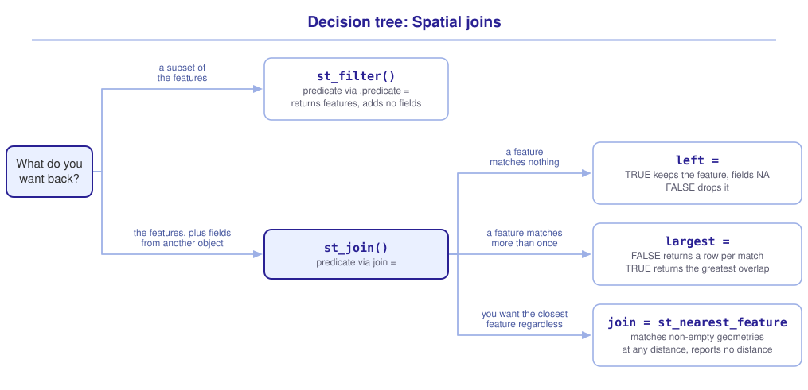

```{r}
#| include: false

library(sf)
library(tidyverse)
library(tmap)
library(webexercises)

source("src/r/course_functions.R")
source("src/r/reference_lookup.R")

lesson_refs <- find_lesson_references()
```

<hr>

<div>
{.intro_image fig-alt="Course logo"}

In lessons ***2.6 Tidy data*** and ***4.2 Non-spatial joins***, we joined tables using shared keys. What do we do when objects do not share a key? When working with spatial data, we can match their features using the relationship between their geometries. In ***4.1 Spatial filtering: Subsetting features by location***, we identified the banding sites in the District, but the returned object did not tell us which census tract contains each site or add tract-level income and population. A **spatial join** uses the relationship between geometries to match features and add the fields of one object to another. In this lesson, we will use spatial joins to describe where features occur, decide how unmatched and repeated matches should be handled, and count features within larger areas. You will learn how to:

* Add the fields of one simple features object to another with `st_join()`
* Control what a join returns for features that match nothing
* Recognize and control the row duplication that a join produces
* Join each feature to its nearest neighbor, and interpret the result with care
* Count the features of one object that occur within the features of another

**Important!** Before starting this tutorial, be sure that you have completed all preliminary and previous lessons!

</div>

## Data for this lesson

<button class="accordion">Please click on the button below to explore the metadata for this lesson!</button>
::: panel
In this lesson, we will explore:

```{r}
#| echo: false
#| output: asis

lesson_metadata(
  .dataset =
    c(
      "dc_census.geojson",
      "rock_creek_park.geojson",
      "district_birds.rds"
    ),
  .tables = list(district_birds.rds = "sites")
) %>%
  cat()
```
:::

## Set up your session

Please complete the following to ensure that you are working in a clean session:

1. Please ensure that your **Global Environment** is empty.
2. In the *History* tab of your **workspace pane**, ensure that your **session history** is empty.

Now that we are working in a clean session:

1. Create a script file.
2. Save your script file as `scripts/spatial_joins.R`.
3. Add metadata as a comment on the top of the file.
4. Following your metadata, create a new **code section** and call it "`setup`".
5. Following your section header, attach *sf*, *tmap*, and the packages that comprise the **core tidyverse**, then load the module 3 source script.

We will use the objects we built in ***4.1 Spatial filtering: Subsetting features by location***, so your `read and pre-process data` section reads the same three files:

```{r}
#| eval: false

# My code for the spatial joins tutorial

# setup --------------------------------------------------------

library(sf)
library(tmap)
library(tidyverse)

# Load the source script:

source("scripts/source_script_module_3.R")

# Draw interactive maps over a topographic basemap:

tmap_mode("view")

tmap_options(basemap.server = "Esri.WorldTopoMap")
```

```{r}
#| include: false

source("scripts/source_script_module_3.R")
tmap_mode("view")
tmap_options(basemap.server = "Esri.WorldTopoMap")
```

```{r}
# DC census tracts:

census <-
  st_read(
    "data/raw/shapefiles/dc_census.geojson",
    quiet = TRUE
  ) %>%
  clean_names() %>%
  select(
    geoid,
    income,
    population
  )

# Rock Creek Park parcels:

parks <-
  st_read(
    "data/raw/shapefiles/rock_creek_park.geojson",
    quiet = TRUE
  ) %>%
  clean_names()

# Bird banding sites, transformed to the CRS of the census tracts:

sites <-
  read_rds("data/raw/district_birds.rds") %>%
  pluck("sites") %>%
  st_as_sf(
    coords = c("long", "lat"),
    crs = 4326
  ) %>%
  st_transform(
    st_crs(census)
  )
```

## Two functions, two questions

`st_filter()` and `st_join()` both compare two objects using a predicate. They differ in what they add to the returned object.

`st_filter()` returns a subset of the features from the first object without adding fields from the second. We use it to ask *which ones*.

`st_join()` returns the features from the first object and adds fields from the second. We use it to ask *what is there*.

```{r}
sites %>%
  st_join(census)
```

`st_join()` returns every site, and each site now contains the `geoid`, `income`, and `population` fields from `census`. The predicate determined which tract supplied those values.

## Three decisions in a spatial join

`st_join()` looks simple in that call because we used the defaults for three parts of a spatial join:

1. **Which predicate** defines a match, through the `join = ` argument.
2. **What happens to a feature that matches nothing**, through the `left = ` argument.
3. **What happens to a feature that matches more than one thing**, through the shape of the result and the `largest = ` argument.

### The predicate

`join = ` names the predicate, and it defaults to `st_intersects`. Every predicate from ***4.1 Spatial filtering: Subsetting features by location*** is available here, supplied the same way: as a function, written without parentheses.

*Note: Recall that `st_filter()` names its predicate with `.predicate = ` while `st_join()` names its predicate with `join = `. The argument differs, the predicates do not.*

We most often join points to the polygons that contain them, and `st_intersects` represents that relationship. When our question is about proximity rather than contact, we change the predicate and `st_join()` passes its argument on:

```{r}
sites %>%
  st_join(
    parks,
    join = st_is_within_distance,
    dist = 1000
  ) %>%
  filter(!is.na(name))
```

### Features that match nothing

Let's look again at the first join. The row count did not change, but only 8 sites occur within the District. We need to know what `st_join()` did with the other 72.

The *sf* function `st_drop_geometry()` removes the geometry column and returns an ordinary data frame. We use it whenever our question is about the fields rather than the shapes:

```{r}
sites %>%
  st_join(census) %>%
  st_drop_geometry() %>%
  summarize(
    matched = sum(!is.na(geoid)),
    unmatched = sum(is.na(geoid))
  )
```

`st_join()` retains them and assigns `NA` to each field supplied by `census`. This is a **left join**, which is the behavior of the default `left = TRUE`: every feature of the first object survives, whether or not anything matched it.

Setting `left = FALSE` returns an inner join instead, which keeps only the features that matched:

```{r}
sites %>%
  st_join(census, left = FALSE)
```

`st_join()` returns only the matched sites, and the census fields contain no `NA` values.

The choice between them depends on what the result is for. A left join keeps every feature of the first object and reports unavailable fields as `NA`. An inner join excludes features that did not match. Neither is inherently safer. Decide whether the unmatched features belong in the result.

::: mysecret
 [Count your rows before and after every join!]{style="font-size: 1.25em; padding-left: 0.5em;"}

Comparing `nrow()` before and after the join costs two lines and reveals both changes discussed in this lesson. A count that fell means an inner join excluded features you may have wanted. A count that rose means features matched more than once, which is the subject of the next section.
:::

### Features that match more than once

When each point intersects no more than one polygon, the default result contains one row per point. If a point intersects more than one polygon, it appears once per match.

The Rock Creek Park file contains four parcels, and some census tracts intersect more than one of them. Let's examine the row count:

```{r}
census %>%
  st_join(parks) %>%
  nrow()
```

The call returns 181 rows from 179 census tracts. A spatial join returns **a row for every match**, so a tract that intersects two parcels is returned twice, once with each parcel's fields:

```{r}
census %>%
  st_join(parks) %>%
  st_drop_geometry() %>%
  count(geoid) %>%
  filter(n > 1)
```

This duplication is difficult to notice because the result still has the structure of a table of census tracts. If we summarize the population of a duplicated tract, we count it twice.

When our question has one answer for each feature, we can supply `largest = TRUE` to return the match with the greatest overlap rather than every match:

```{r}
#| warning: false

census %>%
  st_join(parks, largest = TRUE) %>%
  nrow()
```

The call returns 179 rows, and each census tract now contains the fields of the parcel it shares the most area with.

*Note: `largest = TRUE` compares the area of overlap, so it needs the matched geometries to have area. With points, it still runs and still returns a single row for each feature. A point has no area, so the retained polygon is not chosen using a meaningful area of overlap. Use it where the overlap is real.*

::: now_you
 [Now you!]{style="font-size: 1.25em; padding-left: 0.5em;"}

Join the park parcels to the banding sites, keeping only the sites that matched. Before you run it, predict how many rows the result will hold, then check whether the join duplicated any site.

*Hint: Whether the unmatched sites are kept depends on `left = `. `count()` on the site identifier will find a duplicate.*

[Click here to see my answer]{.answer_link data-answer="a-4-3-duplicates"}

::: {.answer_body #a-4-3-duplicates}

```{r}
sites_in_parks <-
  sites %>%
  st_join(parks, left = FALSE)
```

```{r}
#| echo: false

sites_in_parks
```

```{r}
sites_in_parks %>%
  st_drop_geometry() %>%
  count(site_id) %>%
  filter(n > 1)
```

`st_join()` returns 4 sites, and none of them is duplicated. No banding site intersects more than one park parcel in these data.

:::
:::

## Joining to the nearest feature

When no feature matches, we may still want the closest feature. We supply `st_nearest_feature` to `join = ` in the same way that we supply a predicate:

```{r}
sites %>%
  st_join(census, join = st_nearest_feature) %>%
  st_drop_geometry() %>%
  summarize(
    rows = n(),
    unmatched = sum(is.na(geoid))
  )
```

The join leaves no site unmatched, and we should treat that result with suspicion. All but 8 of these sites occur outside the District, yet the result assigns each one a District census tract, with an income and a population attached.

`st_nearest_feature` is not a predicate. For non-empty geometries and a non-empty comparison object, it returns the closest feature at any distance and reports no distance. Measuring the distance is a separate step, and it is the step that makes the result readable.

The statement below has two parts worth reading slowly. `st_nearest_feature(sites, census)` returns the row position of the nearest tract for each site, so `census[...]` builds an object of tracts in the same order as `sites`. `by_element = TRUE` then tells `st_distance()` to compare the two objects row by row, giving a distance for each site rather than a distance for every site-tract pair:

```{r}
# Join each site to its nearest tract, with the distance:

sites %>%
  st_join(census, join = st_nearest_feature) %>%
  mutate(
    distance_to_tract =
      st_distance(
        .,
        census[st_nearest_feature(sites, census), ],
        by_element = TRUE
      )
  ) %>%
  st_drop_geometry() %>%
  arrange(
    desc(distance_to_tract)
  ) %>%
  slice_head(n = 3)
```

The site at the top of that list occurs 86 kilometers from the tract that it was joined to. The joined object contains no field that records this distance.

::: mysecret
 [Nearest does not mean nearby!]{style="font-size: 1.25em; padding-left: 0.5em;"}

For non-empty geometries, `st_nearest_feature` returns the closest feature however far away it is. The result does not report that distance. I use it only when every feature genuinely has a meaningful neighbor. Otherwise, I calculate the distance and set the threshold myself. `st_is_within_distance` states the threshold in the join and returns `NA` for features that fall outside it.
:::

::: now_you
 [Now you!]{style="font-size: 1.25em; padding-left: 0.5em;"}

Join the census tracts to the banding sites with `st_is_within_distance` and a threshold of five kilometers, then report how many rows came back and how many sites matched nothing.

*Hint: `st_is_within_distance` takes the threshold through `dist = `, and a distance with units is safer than a bare number.*

[Click here to see my answer]{.answer_link data-answer="a-4-3-within"}

::: {.answer_body #a-4-3-within}

```{r}
sites %>%
  st_join(
    census,
    join = st_is_within_distance,
    dist = units::set_units(5, "km")
  ) %>%
  st_drop_geometry() %>%
  summarize(
    rows = n(),
    unmatched = sum(is.na(geoid))
  )
```

The join returns 734 rows from 80 sites, and 56 sites have no tract within five kilometers. The threshold gives the join a condition that a feature can fail, and the row count went up rather than down: a site five kilometers from the District is that close to many tracts at once, so the third decision is back.

:::
:::

## Counting features inside features

We can now combine these operations to answer a question about the data: how many banding sites occur within each census tract?

Our question is about the tracts, so we supply the tracts first. The join returns a row for every tract-site match, and we use `summarize()` to return the tracts:

```{r}
sites_per_tract <-
  census %>%
  st_join(sites) %>%
  st_drop_geometry() %>%
  summarize(
    n_sites = sum(!is.na(site_id)),
    .by = geoid
  )

sites_per_tract %>%
  filter(n_sites > 0)
```

We have 4 census tracts that contain banding sites, and their counts total the 8 sites that we found in ***4.1 Spatial filtering: Subsetting features by location***.

Two details in that pipeline determine whether the count is correct. We counted with `sum(!is.na(site_id))` rather than `n()`, because a left join returns one row for an unmatched tract with `NA` in it, and `n()` would count that row as a site. And we dropped the geometry before summarizing, because the count is a property of the tract rather than of its shape, and carrying 179 polygons through the summary buys nothing.

To map the result, let's join it back to the tracts on `geoid`, which is a shared key rather than a location:

```{r}
#| fig-alt: "A choropleth of the District of Columbia counting banding sites per census tract. Four tracts hold sites, all of them in the northwest quarter: one holds four, one holds two, and two hold one each. Every other tract is zero."

# Add the census tracts layer:

census %>%
  left_join(
    sites_per_tract,
    by = join_by(geoid)
  ) %>%
  tm_shape() +
  tm_polygons(
    fill = "n_sites",
    fill.scale =
      tm_scale_continuous(
        values = "brewer.yl_gn_bu"
      ),
    fill.legend =
      tm_legend(title = "Banding sites")
  ) +
  tm_title("Banding sites per census tract")
```

That final join matched on a column rather than on a geometry. We used joins of that kind throughout ***4.2 Non-spatial joins***.

::: now_you
 [Now you!]{style="font-size: 1.25em; padding-left: 0.5em;"}

Count the banding sites inside each parcel of Rock Creek Park, keeping the parcels that hold none.

*Hint: Two parcels share a name, so a count grouped by name would report three parcels rather than four. `gis_id` identifies them.*

[Click here to see my answer]{.answer_link data-answer="a-4-3-parcels"}

::: {.answer_body #a-4-3-parcels}

```{r}
parks %>%
  st_join(sites) %>%
  st_drop_geometry() %>%
  summarize(
    n_sites = sum(!is.na(site_id)),
    .by = c(gis_id, name)
  )
```

One parcel contains 3 sites, another contains 1, and the remaining parcels contain none. Counting rows with `n()` would return a count of 1 for an empty parcel, because the unmatched parcel is still a row. Counting the non-missing site identifiers is what makes an empty parcel a zero.

:::
:::

## Putting it all together

The two functions and the decisions behind them fit together like this (click to expand):

{.zoomable data-title="Decision tree: Spatial joins" data-pdf-key="spatial_joins" fig-alt="To subset the features of an object by location, use st_filter(), naming the predicate with .predicate. It returns features and adds no fields. To add fields from another object, use st_join(), naming the predicate with join. Within st_join, decide what happens to a feature matching nothing. Left equals TRUE, the default, keeps it with NA fields, while left equals FALSE drops it. Then decide what happens to a feature matching more than once. The default returns a row for every match, while largest equals TRUE returns only the match with the greatest overlap. For non-empty geometries, passing join equals st_nearest_feature matches each feature to its closest neighbor at any distance and reports no distance."}



::: {.callout-note}

This tree shows how I choose between these functions. Your model may differ. What matters is that it helps you choose a function and predict what the returned object will contain.

:::

## Take-home points

* `st_join()` adds the fields of one simple features object to another, matching features by location rather than by a shared key.
* `join = ` names the predicate and defaults to `st_intersects`. Arguments belonging to the predicate, such as `dist = `, are supplied to `st_join()` alongside it.
* `left = TRUE`, the default, keeps every feature of the first object and fills unmatched fields with `NA`. `left = FALSE` returns only the features that matched.
* A spatial join returns a row for every match, so a feature that matches twice is returned twice. Compare `nrow()` before and after the join.
* `largest = TRUE` returns a single row for each feature, keeping the match with the greatest overlap.
* For non-empty geometries, `st_nearest_feature` matches each feature to its closest neighbor at any distance and reports no distance. Calculate the distance separately, or state a threshold with `st_is_within_distance`.
* `st_drop_geometry()` removes the geometry column and returns an ordinary data frame. We use it when our question is about the fields rather than the geometries.
* To count the features of one object that occur within another, we join and then `summarize()`. We count with `sum(!is.na(site_id))` rather than `n()`, because an unmatched feature still occupies a row.

## Exercises

::: now_you
 [Test your knowledge!]{style="font-size: 1.25em; padding-left: 0.5em;"}

1. An object of 50 points is joined to an object of 10 polygons with `st_join()`. No point intersects more than one polygon, and 12 points fall outside all of them. How many rows does the default result hold?

`r longmcq(c(answer = "50", "38", "12", "60"))`

2. The same join is run again with `left = FALSE`. How many rows now?

`r longmcq(c(answer = "38", "50", "12", "10"))`

3. A join of 200 census tracts to 6 overlapping watersheds returns 214 rows. What does the extra count tell you?

`r longmcq(c(answer = "The result contains 14 additional rows because some tracts intersect more than one watershed", "Fourteen tracts matched no watershed", "The two objects use different coordinate reference systems", "The join used st_nearest_feature"))`

4. You join point observations to a state boundary file with `join = st_nearest_feature` and every observation matches. Which statement is true?

`r longmcq(c(answer = "Some observations may be far outside every state, because the join reports no distance", "Every observation falls inside a state", "The join dropped the observations that did not match", "st_nearest_feature returns NA for distant features"))`

5. A point matches two overlapping polygons, and the objects are joined with `largest = TRUE`. What problem remains?

`r longmcq(c(answer = "The point has no area, so the retained polygon is not selected using a meaningful area of overlap", "It errors, because largest = TRUE requires two polygon layers", "It returns a row for every point-polygon match, as the default would", "Nothing: largest = TRUE is the correct way to reduce point matches"))`
:::


