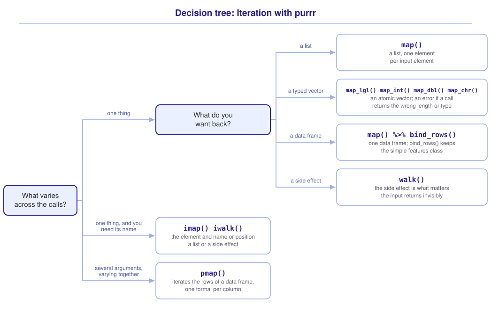

```{r}
#| include: false

library(sf)
library(tidyverse)
library(tmap)
library(webexercises)

source("src/r/course_functions.R")
source("src/r/reference_lookup.R")

lesson_refs <- find_lesson_references()
```

<hr>

<div>
{.intro_image fig-alt="Course logo"}

Spatial data processing often requires repeating the same sequence of operations on multiple data objects. For example, we typically read files, clean their field names, and transform them to a shared CRS. Written once per file, those statements become a long block of near-identical code in which a typo can return the wrong object without raising an error. **Iteration** applies an operation to each element of an object. We have, of course, used iteration before. Our grouped operations in ***2.3 Grouped operations and summarize***, including `across()` and `summarize()` with `.by = `, were iteration! We will use the *purrr* package to replace repeated statements with a single statement that describes the operation and an object that lists what to apply it to.

In completing this lesson, you will learn how to:

* Apply a function to every element of a list with `map()`
* Choose the appropriate *purrr* function for a given task
* Use the name of each element with `imap()`
* Write GeoJSON files with `st_write()` and `iwalk()`
* Vary more than one argument at a time with `pmap()`

**Important!** Before starting this tutorial, be sure that you have completed all preliminary and previous lessons!

</div>

## Data for this lesson

<button class="accordion">Please click on the button below to explore the metadata for this lesson!</button>
::: panel
In this lesson, we will explore:

```{r}
#| echo: false
#| output: asis

lesson_metadata(
  .dataset =
    c(
      "dc_forests.geojson",
      "dc_rivers.geojson",
      "rock_creek_park.geojson"
    )
) %>%
  cat()
```
:::

## Set up your session

Please complete the following to ensure that you are working in a clean session:

1. Please ensure that your **Global Environment** is empty.
2. In the *History* tab of your **workspace pane**, ensure that your **session history** is empty.

Now that we are working in a clean session:

1. Create a script file.
2. Save your script file as `scripts/iteration.R`.
3. Add metadata as a comment on the top of the file.
4. Following your metadata, create a new **code section** and call it "`setup`".
5. Following your section header, attach *sf*, *tmap*, and the packages that comprise the **core tidyverse**.
6. Create the folder `data/processed` if it does not already exist.

```{r}
#| eval: false

# My code for the iteration tutorial

# setup --------------------------------------------------------

library(sf)
library(tmap)
library(tidyverse)
```

```{r}
#| include: false

tmap_mode("plot")
```

**Note:** *purrr* is a core tidyverse package, so `library(tidyverse)` attaches it.

## The repetition we are removing

Three habitat layers describe the District: its wooded areas, its rivers, and the parcels of Rock Creek Park. We need three statements to read them using what we have learned so far:

```{r}
forests <-
  st_read(
    "data/raw/shapefiles/dc_forests.geojson",
    quiet = TRUE
  )

rivers <-
  st_read(
    "data/raw/shapefiles/dc_rivers.geojson",
    quiet = TRUE
  )

parks <-
  st_read(
    "data/raw/shapefiles/rock_creek_park.geojson",
    quiet = TRUE
  )
```

We wrote three statements that differ in two words each, and the next operation will require three more.

## Applying a function to every element

### Combining what differs into an object

We begin by putting the values that differ into an object. A list provides the file names, and we give each element a name that describes its layer:

```{r}
list(
  forests = "dc_forests.geojson",
  rivers = "dc_rivers.geojson",
  parks = "rock_creek_park.geojson"
)
```

`map()` applies a function to every element of a list or vector and returns a list of the results. We supply the following arguments:

* The object to iterate over, passed to the function by a pipe
* The function to apply to each element

The function is written as an anonymous function, `\(x) ...`. Here, `\` is shorthand for `function`, and `x` stands for the element currently being handled:

```{r}
layers <-
  list(
    forests = "dc_forests.geojson",
    rivers = "dc_rivers.geojson",
    parks = "rock_creek_park.geojson"
  ) %>%
  map(
    \(file) {
      st_read(
        str_c("data/raw/shapefiles/", file),
        quiet = TRUE
      )
    }
  )
```

We replaced three statements with one, and the names that we supplied were carried onto the result. `layers` is a list of simple features objects.

::: mysecret
 [Reading the lambda]{style="font-size: 1.25em; padding-left: 0.5em;"}

### A lambda function

In the R programming language, a **lambda** is an anonymous function created for a temporary task. Here, `\(file)` declares a new function whose single **formal** is named `file`, and everything in the braces is its **body** (see ***Preliminary Lesson 2: Environment & Functions***). `map()` calls that function once per element, binding `file` to the element it is handling. The name is ours: `\(x)` and `\(layer_name)` behave identically, and a name that says what the element is makes the body easier to read.

**Note:** An anonymous function can also be written as `function(x) ...`. The *purrr* functions also accept the formula shorthand `~ ...`, in which `.x` stands for the current element.
:::

## Choosing the function that returns what you need

`map()` always returns a list. When each call returns one value of the same type, we can ask for a simpler result.

### The typed variants

The typed variants return an atomic vector, and they return an error when a call returns the wrong length or an incompatible type. The suffix identifies the type returned:

* `map_lgl()` returns logical values
* `map_int()` returns integers
* `map_dbl()` returns doubles
* `map_chr()` returns characters

Returning to the repetitive code from ***Problem set 3***, let's simplify the operation with iteration. We will use `map_int()` and the formula shorthand to return the number of features in each spatial vector object:

```{r}
layers %>%
  map_int(
    ~ nrow(.x)
  )
```

We can also count the number of vertices:

```{r}
layers %>%
  map_int(
    ~ st_coordinates(.x) %>%
      nrow()
  )
```

We can determine the EPSG code of each object in the same way:

```{r}
layers %>%
  map_int(
    ~ st_crs(.x)$epsg
  )
```

The EPSG codes show that the layers do not share the same CRS: two are in EPSG 4326 and one is in EPSG 32618. We will buffer these objects later in the lesson, so let's use `map()` to transform every layer to the local projected CRS as we read the data:

```{r}
layers <-
  list(
    forests = "dc_forests.geojson",
    rivers = "dc_rivers.geojson",
    parks = "rock_creek_park.geojson"
  ) %>%
  map(
    \(file) {
      st_read(
        str_c("data/raw/shapefiles/", file),
        quiet = TRUE
      ) %>%
        st_transform(crs = 32618)
    }
  )
```

::: now_you
 [Now you!]{style="font-size: 1.25em; padding-left: 0.5em;"}

The function `st_geometry_type()` returns a factor object describing the type of geometry represented by each feature in a spatial vector object. Return the geometry type represented in each spatial vector object in `layers` as a character vector.

*Hint: Each layer contains one geometry type. `st_geometry_type()` returns one value for every feature, and `map_chr()` requires one value per layer.*

[Click here to see my answer]{.answer_link data-answer="a-4-4-geomtype"}

::: {.answer_body #a-4-4-geomtype}

```{r}
layers %>%
  map_chr(
    \(layer) {
      layer %>%
        st_geometry_type() %>%
        unique() %>%
        as.character()
    }
  )
```

`st_geometry_type()` returns one value per feature. Each layer contains one geometry type, so `unique()` reduces those repeated values to one before we convert it to a character value. `map_chr()` would fail if we returned the whole vector, because a character vector of 51 values does not fit in one element.

:::
:::

## Using the name of each element

For a named input, `imap()` uses a lambda function with two arguments: the element and its name. For an unnamed input, it supplies the element and its position:

```{r}
layers %>%
  imap(
    \(layer, layer_name) {
      layer %>%
        select(geometry) %>%
        mutate(habitat = layer_name)
    }
  )
```

This is especially useful when you want to combine lists into a single data frame while maintaining the list item name as a value:

```{r}
# Combine the labeled layers and count their features:

layers %>%
  imap(
    \(layer, layer_name) {
      layer %>%
        select(geometry) %>%
        mutate(habitat = layer_name)
    }
  ) %>%
  bind_rows() %>%
  st_drop_geometry() %>%
  count(habitat)
```

## Iterating for a side effect

### Writing one GeoJSON file

So far, we have read spatial vector files but have not written one from R. We write a simple features object as a GeoJSON file with `st_write()`:

```{r}
#| eval: false

st_write(
  layers$forests,
  "data/processed/forests_utm.geojson",
  delete_dsn = TRUE,
  quiet = TRUE
)
```

The first argument is the object to write and the second is the output path. The `.geojson` extension identifies the file format. `delete_dsn = TRUE` replaces a file already present at that path, and `quiet = TRUE` suppresses the printing of the file metadata.

Writing a file changes something outside the object returned in R. This change is a **side effect** of the function call.

### Writing several GeoJSON files

We have three objects to write, and the statement above would otherwise need to be repeated three times. `walk()` applies a function to every element for its side effect, ignores the returned values, and invisibly returns its input. `iwalk()` does the same while also supplying the name, or position, of each element.

We need the layer names to construct the file names, so we will use `iwalk()`:

```{r}
#| eval: false

layers %>%
  iwalk(
    \(layer, layer_name) {
      st_write(
        layer,
        str_c(
          "data/processed/",
          layer_name,
          "_utm.geojson"
        ),
        delete_dsn = TRUE,
        quiet = TRUE
      )
    }
  )
```

When you run the statement, it writes three files named `forests_utm.geojson`, `rivers_utm.geojson`, and `parks_utm.geojson`.

We could call `st_write()` from `map()` or `imap()`, but those functions would also build a list of returned values that we do not need. `iwalk()` communicates that the files are the result we want.

## Varying more than one argument

`map()` varies one thing. Some operations vary several at once, and the arguments belong together in a row.

Suppose that each habitat layer requires a buffer of its own width. The widths pair with the layers, so we store them in a table:

```{r}
buffer_spec <-
  tribble(
    ~ habitat_name, ~ distance,
    "forests",      50,
    "rivers",       100,
    "parks",        250
  )
```

```{r}
#| echo: false

buffer_spec
```

`pmap()` iterates over the rows of a data frame, calling its function with one argument per column. The formals take the column names:

```{r}
habitat_buffers <-
  buffer_spec %>%
  pmap(
    \(habitat_name, distance) {
      layers %>%
        pluck(habitat_name) %>%
        st_buffer(dist = distance) %>%
        st_union() %>%
        st_sf() %>%
        mutate(
          habitat = habitat_name,
          buffer_m = distance
        )
    }
  ) %>%
  bind_rows()

habitat_buffers %>%
  st_drop_geometry()
```

`pmap()` buffered each layer at its own distance and we combined the results. To add a fourth habitat, we add a row to `buffer_spec`, and the statement that does the work does not change.

::: now_you
 [Now you!]{style="font-size: 1.25em; padding-left: 0.5em;"}

Return the area of each buffered habitat in square kilometers, as a numeric vector, without building the combined object first.

*Hint: `pmap_dbl()` is the typed variant of `pmap()`. `st_union()` collapses the buffer to one geometry so that `st_area()` returns one value.*

[Click here to see my answer]{.answer_link data-answer="a-4-4-pmapdbl"}

::: {.answer_body #a-4-4-pmapdbl}

```{r}
buffer_spec %>%
  pmap_dbl(
    \(habitat_name, distance) {
      layers %>%
        pluck(habitat_name) %>%
        st_buffer(dist = distance) %>%
        st_union() %>%
        st_area() %>%
        units::set_units("km^2") %>%
        as.numeric()
    }
  )
```

About 19, 35, and 16 square kilometers, compared with the original 11.4, 18.4, and 7.7 square kilometers. Both the source geometries and buffer distances differ, so we cannot use these areas to compare the effect of buffer distance alone. Compare each result with the layer from which it was calculated.

:::
:::

Let's look at what we made:

```{r}
#| fig-alt: "Three buffered habitat layers in the District of Columbia drawn in one map, with wooded areas, rivers, and park parcels distinguished by fill color."

# Add the habitat buffers layer:

habitat_buffers %>%
  tm_shape() +
  tm_polygons(
    fill = "habitat",
    fill_alpha = 0.6,
    fill.legend =
      tm_legend(title = "Habitat")
  ) +
  tm_title("Buffered habitat layers")
```

::: now_you
 [Check your understanding]{style="padding-left: 0.5em;"}

Which function applies an operation to every element and returns its input rather than the results?

`r longmcq(c("map()", answer = "walk()", "imap()", "pmap()"))`

You need the number of features in each of six layers, as an integer vector. Which function returns it?

`r longmcq(c(answer = "map_int()", "map()", "walk()", "pmap()"))`

True or false: When its input is named, `imap()` calls its function with the element and the element's name.

`r torf(TRUE)`
:::

## Putting it all together

The *purrr* function you need follows from two questions: what varies, and what you want back (click to expand):

{.zoomable data-title="Decision tree: Iteration with purrr" data-pdf-key="iteration" fig-alt="To iterate with purrr, first ask what varies. If one thing varies, ask what you want back: a list from map(), a typed vector from map_lgl(), map_int(), map_dbl(), or map_chr(), a data frame from map() followed by bind_rows(), or a side effect from walk(), which invisibly returns its input. If one thing varies and you also need its name or position, use imap() to return a list or iwalk() for a side effect. Named inputs supply names and unnamed inputs supply positions. If several arguments vary together, put them in a data frame with one column per argument and use pmap(), whose function takes one formal per column."}



::: {.callout-note}

This tree shows how I choose among these functions. Your model may differ. What matters is that it helps you choose a function and predict what it returns.

:::

## Take-home points

* `map()` applies a function to every element of a list or vector and returns a list. The function is written as a lambda, `\(x) ...`, whose formal stands for the element being handled.
* Names on the input are carried onto the output, which is what a named list of file names buys you.
* `map_lgl()`, `map_int()`, `map_dbl()`, and `map_chr()` return atomic vectors, and raise an error when a call returns the wrong length or a type that cannot be converted.
* `imap()` calls its function with the element and its name when the input is named, or its position when the input is unnamed. This is how a list's names reach the data.
* `bind_rows()` combines the list returned by `imap()` into one simple features object after the layers share a CRS.
* `st_write()` writes a simple features object to a GeoJSON file. The `.geojson` extension identifies the file format, and `delete_dsn = TRUE` replaces an existing file at the same path.
* `walk()` and `iwalk()` iterate for a side effect and return their input.
* `pmap()` iterates over the rows of a data frame, with one formal per column, and is the tool when several arguments vary together.

## Exercises

::: now_you
 [Test your knowledge!]{style="font-size: 1.25em; padding-left: 0.5em;"}

1. `map()` is applied to a vector of five file names. What does it return?

`r longmcq(c(answer = "A list of five elements", "A data frame of five rows", "An atomic vector of five values", "A single simple features object"))`

2. You have a named list of spatial vector objects and want to add each object's list name as a field before combining the objects. Which function provides both the object and its name?

`r longmcq(c(answer = "imap()", "map_int()", "walk()", "pmap()"))`

3. You want to buffer eight layers, each at a distance recorded beside it in a table. Which function fits?

`r longmcq(c(answer = "pmap()", "map()", "imap()", "walk()"))`

4. Parsons problem: Reorder the lines below to read every habitat layer, transform each to EPSG 32618, and return the number of features in each as an integer vector. One line returns a list where an integer vector was asked for. Leave it in the trash.

<div class="parsons-problem">
<div id="p-4-4-01-trash" class="sortable-code"></div>
<div id="p-4-4-01-sortable" class="sortable-code"></div>
<div style="clear: both;"></div>
<button id="p-4-4-01-check" class="parsons-btn parsons-btn-check" type="button">Check My Order</button>
<button id="p-4-4-01-reset" class="parsons-btn parsons-btn-reset" type="button">Shuffle Again</button>
<p id="p-4-4-01-feedback" class="parsons-feedback"></p>
</div>

<script>
window.parsonsProblems = window.parsonsProblems || []; window.parsonsProblems.push({ id: "p-4-4-01", maxDistractors: 1, code: "list(\n  forests = \"dc_forests.geojson\",\n  rivers = \"dc_rivers.geojson\",\n  parks = \"rock_creek_park.geojson\"\n) %>%\n  map(\n    \\(file) {\n      st_read(\n        str_c(\"data/raw/shapefiles/\", file),\n        quiet = TRUE\n      )\n    }\n  ) %>%\n  map(\n    \\(layer) {\n      st_transform(layer, crs = 32618)\n    }\n  ) %>%\n  map(nrow) %>% #distractor\n  map_int(nrow)" });
</script>

5. You have a named list of spatial vector objects and want to write one file per object, using the list names to construct the file names. Which function fits?

`r longmcq(c(answer = "iwalk()", "map_int()", "map_chr()", "pmap()"))`
:::


