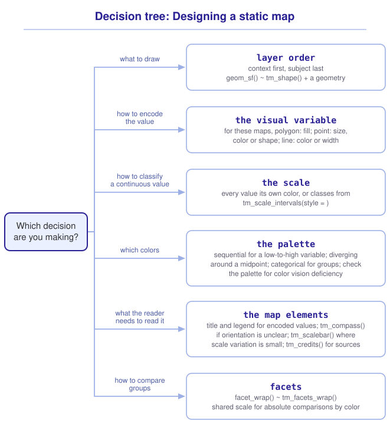

```{r}
#| include: false

library(sf)
library(tidyverse)
library(tmap)
library(webexercises)

source("src/r/course_functions.R")
source("src/r/reference_lookup.R")

lesson_refs <- find_lesson_references()
```

<hr>

<div>
{.intro_image fig-alt="Course logo"}

A map that we draw to inspect our data and a map that we prepare for a reader serve different purposes. A reader cannot ask us what a color represents, and cannot see the values that we saw while building the map. When most of the features are drawn in one shade, or the legend does not state what the colors represent, the map communicates less than the data support.

We have used *ggplot2* and *tmap* throughout the course. In this lesson, we will use their arguments to begin making the decisions that a reader depends on: what to draw, how to encode a value, how to classify a continuous variable, which colors to use, and which supporting elements to include.

In completing this lesson, you will learn how to:

* Order the layers of a map so the subject stays legible
* Encode a value with a visual variable and choose its scale
* Classify a continuous variable and see what the classification does to the map
* Add the elements a reader needs, and leave out the ones they do not
* Compare groups with faceted maps
* Choose between *ggplot2* and *tmap* for a given map

*This lesson is optional, and it pairs with ***5.5 Cartography II: Projection, context, and labels***, which is also optional. Nothing required later in the course depends on either, and the two together are what turn a map you made to look at into one you can publish.*

**Important!** Before starting this tutorial, be sure that you have completed all preliminary and previous lessons!

</div>

## Data for this lesson

<button class="accordion">Please click on the button below to explore the metadata for this lesson!</button>
::: panel
In this lesson, we will explore:

```{r}
#| echo: false
#| output: asis

lesson_metadata(
  .dataset =
    c(
      "dc_census.geojson",
      "rock_creek_park.geojson",
      "district_birds.rds"
    )
) %>%
  cat()
```
:::

## Set up your session

Please complete the following to ensure that you are working in a clean session:

1. Please ensure that your **Global Environment** is empty.
2. In the *History* tab of your **workspace pane**, ensure that your **session history** is empty.

Now that we are working in a clean session:

1. Create a script file.
2. Save your script file as `scripts/cartography.R`.
3. Add metadata as a comment on the top of the file.
4. Following your metadata, create a new **code section** and call it "`setup`".
5. Following your section header, attach *sf*, *tmap*, and the packages that comprise the **core tidyverse**, then load the module 3 source script.

```{r}
#| eval: false

# My code for the cartography tutorial

# setup --------------------------------------------------------

library(sf)
library(tmap)
library(tidyverse)

# Load the source script:

source("scripts/source_script_module_3.R")

# Draw static maps:

tmap_mode("plot")
```

```{r}
#| include: false

source("scripts/source_script_module_3.R")

tmap_mode("plot")
```

We will map the census tracts of the District, the parcels of Rock Creek Park, and the bird banding sites:

```{r}

# Subset census data and assign:

census <-
  st_read(
    "data/raw/shapefiles/dc_census.geojson",
    quiet = TRUE
  ) %>%
  clean_names() %>%
  select(
    geoid,
    income,
    population
  )

parks <-
  st_read(
    "data/raw/shapefiles/rock_creek_park.geojson",
    quiet = TRUE
  ) %>%
  clean_names()

sites <-
  read_rds("data/raw/district_birds.rds") %>%
  pluck("sites") %>%
  st_as_sf(
    coords = c("long", "lat"),
    crs = 4326
  ) %>%
  st_transform(
    st_crs(census)
  ) %>%
  st_filter(census)
```

*Note: We used `st_filter()` from ***4.1 Spatial filtering: Subsetting features by location*** to keep the banding sites that fall inside the District, because a map of the District should not carry points from outside it.*

## The decisions behind a map

A map that communicates is the result of a series of decisions, taken in this order:

1. **What to draw**, and in what order the layers are drawn.
2. **How to encode the value** the map is about.
3. **How to classify** that value, when it is continuous.
4. **Which colors** carry the classification.
5. **What the reader needs** in order to read the result.
6. **How to compare groups**, when the map is about a comparison.

The lesson closes with a seventh question: which of the two packages to use.

### What to draw

A map has a subject. We include the other layers to help the reader locate that subject, and we leave out a layer that does not.

*ggplot2* and *tmap* draw layers in the order that we write them, so we supply the subject last:

```{r}
#| fig-alt: "Census tracts of the District of Columbia drawn in pale grey with thin white borders, with the parcels of Rock Creek Park filled green on top, and bird banding sites drawn as dark points above both."

census %>%
  ggplot() +

  # Add geometries:

  geom_sf(
    fill = "grey92",
    color = "white",
    linewidth = 0.2
  ) +
  geom_sf(
    data = parks,
    fill = "darkseagreen",
    color = NA
  ) +
  geom_sf(
    data = sites,
    size = 2.4
  ) +

  # Modify the label and theme:

  labs(title = "Bird banding sites in the District of Columbia") +
  theme_void()
```

We drew the tract borders white and thin because they are a backdrop. If we drew them in black at the weight of the points, they would compete with the subject for the reader's attention, and there are 179 of them.

`theme_void()` removes the axes. Latitude and longitude gridlines are data about the map rather than data on it, and they belong on it only when the reader needs to read a coordinate off the page.

### Encoding a value

A map becomes a result when a value is encoded in something the reader can see. The **visual variable** is the property doing the encoding, and the choice among them is constrained by the geometry.

For the maps we build here, we will use **fill** for polygons, **size**, **color**, or **shape** for points, and **color** or **width** for lines.

Let's encode median household income by tract as fill:

```{r}
#| fig-alt: "A choropleth map of the District of Columbia showing median household income by census tract on a continuous viridis color scale, with the highest incomes concentrated in the northwest."

census %>%
  ggplot() +

  # Add geometry:

  geom_sf(
    aes(fill = income),
    color = "white",
    linewidth = 0.2
  ) +

  # Modify the scales:

  scale_fill_viridis_c(
    "Median income",
    labels = scales::label_dollar()
  ) +

  # Modify the label and theme:

  labs(title = "Median household income by census tract") +
  theme_void()
```

A map that encodes a value in the fill of an area is a **choropleth**. Choropleths are common in ecology and easy to make badly. The fill has to be divided into colors, and how we divide it changes what the reader sees.

### Classifying a continuous variable

The map above used a continuous scale: every value has its own color. The alternative is to cut the values into classes and give each class one color.

Neither is more correct. A continuous scale preserves the continuity of the data, and a classified scale is far easier to read a range off. What matters is that the classification is a choice, and that the default is not neutral.

Let's examine the distribution of income across the District. `geom_histogram()` draws the distribution of a continuous variable by counting the features that fall in each of a set of equal-width bins, and `scales::label_dollar()` formats the axis labels as currency:

```{r}
#| fig-alt: "A histogram of median household income across District of Columbia census tracts, showing a right-skewed distribution with most tracts below one hundred thousand dollars and a long tail extending past two hundred thousand."

census %>%
  ggplot() +

  # Map data to visual elements:

  aes(x = income) +

  # Add geometry:

  geom_histogram(
    bins = 30,
    fill = "grey40"
  ) +

  # Modify the scales:

  scale_x_continuous(labels = scales::label_dollar()) +

  # Modify the labels and theme:

  labs(
    title = "Median household income across census tracts",
    x = "Median income",
    y = "Tracts"
  ) +
  theme_bw()
```

The distribution is right-skewed: most tracts occur low in the range and a few occur far above the rest. What each classification does depends on that shape.

*Note: The histogram reports that it removed three rows. Those tracts carry `NA` for income, and a classification has nothing to do with them. They are drawn in the choropleth above in the grey that *ggplot2* reserves for missing values.*

**Equal intervals** cut the range into classes of equal width. `cut()` performs the division and returns the class each value falls in, so `table()` counts the tracts per class. Against a skewed variable, the classes fill unevenly:

```{r}
census %>%
  pull(income) %>%
  cut(
    breaks = 5,
    include.lowest = TRUE
  ) %>%
  table()
```

We get 76 tracts in the first class and four in the last. This classification would draw four fifths of the District in the two palest colors, and we would not see any difference among those tracts.

**Quantiles** cut the values so that each class holds approximately the same number of features. `quantile()` returns the values that divide the data that way:

```{r}
income_breaks <-
  census %>%
  pull(income) %>%
  quantile(
    probs =
      seq(
        from = 0,
        to = 1,
        by = 0.2
      ),
    na.rm = TRUE
  )
```

```{r}
#| echo: false

income_breaks
```

Four fifths of the tracts fall below \$97,596, and the highest reaches \$221,771. Those six values become the breaks:

```{r}
census %>%
  pull(income) %>%
  cut(
    breaks = income_breaks,
    include.lowest = TRUE
  ) %>%
  table()
```

We get 35 or 36 tracts in each class. The map uses its whole palette, and the price is that the classes describe unequal spans of income: the top class covers \$97,596 to \$221,771 while the third covers \$53,398 to \$71,546.

*tmap* states the classification through `tm_scale_intervals()`, whose `style = ` argument names the method:

```{r}
#| fig-alt: "A choropleth of median household income by census tract in the District of Columbia, classified into five quantile classes on a yellow-to-blue sequential palette."

# Add the census tracts layer:

census %>%
  tm_shape() +
  tm_polygons(
    fill = "income",
    col = "white",
    lwd = 0.5,
    fill.scale =
      tm_scale_intervals(
        style = "quantile",
        n = 5,
        values = "brewer.yl_gn_bu",
        label.format =
          tm_label_format(prefix = "$")
      ),
    fill.legend =
      tm_legend(title = "Median income")
  ) +
  tm_title("Median household income by census tract")
```

The `style = ` values this course uses:

* `"pretty"` places evenly spaced breaks at rounded values that are easy to read. It is the default, and the number of classes may differ from `n`.
* `"equal"` divides the range into classes of equal width.
* `"quantile"` places approximately the same number of features in each class.
* `"jenks"` places breaks to reduce the variation within each class.
* `"log10_pretty"` transforms the values first, which suits a variable spanning orders of magnitude.
* `"fixed"` uses the breaks you supply through `breaks = `.

::: mysecret
 [State the classification, and say what it was!]{style="font-size: 1.25em; padding-left: 0.5em;"}

Two maps of the same variable, classified two ways, can support opposite readings. That is not a flaw in the method, and it is a reason to treat the classification as part of the result rather than as a default you accepted. Name it in the caption, and where a threshold matters to the argument, set it yourself with `style = "fixed"` and `breaks = `.
:::

::: now_you
 [Now you!]{style="font-size: 1.25em; padding-left: 0.5em;"}

Map tract population with equal-interval classes, then again with quantile classes. Which map makes differences among the majority of tracts easier to see, and why?

*Hint: `style = ` inside `tm_scale_intervals()` names the classification.*

[Click here to see my answer]{.answer_link data-answer="a-4-5-classify"}

::: {.answer_body #a-4-5-classify}

```{r}
#| fig-alt: "Two choropleths of census tract population, the first classified by equal intervals and the second by quantiles."

# Add the census tracts layer:

census %>%
  tm_shape() +
  tm_polygons(
    fill = "population",
    fill.scale =
      tm_scale_intervals(
        style = "equal",
        n = 5,
        values = "brewer.yl_gn_bu"
      ),
    fill.legend =
      tm_legend(title = "Population")
  ) +
  tm_title("Population, equal intervals")

# Add the census tracts layer:

census %>%
  tm_shape() +
  tm_polygons(
    fill = "population",
    fill.scale =
      tm_scale_intervals(
        style = "quantile",
        n = 5,
        values = "brewer.yl_gn_bu"
      ),
    fill.legend =
      tm_legend(title = "Population")
  ) +
  tm_title("Population, quantiles")
```

The quantile map makes differences among most tracts easier to see because each color represents roughly the same number of tracts. Population is far less skewed than income, so the two classifications differ less here than they did above. The classification matters most where the distribution is uneven, which is why looking at the distribution comes first.

:::
:::

### Choosing colors

The choice of palette follows from what kind of variable the map is showing.

A **sequential** palette runs from light to dark and suits a variable with a low end and a high end, such as income or population. A **diverging** palette runs from one hue through a neutral middle to another, and suits a variable read against a meaningful midpoint, such as a change from a baseline. A **categorical** palette gives unrelated hues to unordered groups, such as habitat type.

Two constraints apply whatever the variable.

A palette should remain legible without relying on differences in hue alone. Around one in twelve men has a color vision deficiency, and a red-to-green scale is unreadable to many of them. The viridis palettes used above were built to survive that. The ColorBrewer palettes *tmap* names with a `brewer.` prefix are a mixed set: `RColorBrewer::brewer.pal.info` marks 27 of its 35 as colorblind-friendly, and the eight that are not include `Spectral`, `RdYlGn`, and `Set1`. The prefix is not a certification, so check the palette you picked.

Categories should be few. A legend with twelve colors asks the reader to hold all of them in mind while looking somewhere else.

*Note: `cols4all::c4a_gui()`, which I introduced in ***3.5 Introduction to tmap***, opens a palette browser with a color vision deficiency check built into it.*

::: now_you
 [Now you!]{style="font-size: 1.25em; padding-left: 0.5em;"}

Map each tract's income as a distance from the District's median, on a diverging palette centered on zero.

*Hint: `tm_scale_continuous()` takes `midpoint = `, which fixes the neutral color of a diverging palette to the value you choose.*

[Click here to see my answer]{.answer_link data-answer="a-4-5-diverging"}

::: {.answer_body #a-4-5-diverging}

```{r}
#| fig-alt: "A choropleth of the District of Columbia showing each census tract's median income as a distance from the District median, on a red-to-blue diverging palette centered on zero. Tracts in the northwest run blue, tracts east of the Anacostia run red, and tracts with no income value are grey."

# Express each tract's income as a distance from the District median:

census %>%
  mutate(
    income_gap = income - median(income, na.rm = TRUE)
  ) %>%
  tm_shape() +
  tm_polygons(
    fill = "income_gap",
    col = "white",
    lwd = 0.5,
    fill.scale =
      tm_scale_continuous(
        values = "brewer.rd_bu",
        midpoint = 0,
        label.format =
          tm_label_format(prefix = "$")
      ),
    fill.legend =
      tm_legend(title = "Income gap")
  ) +
  tm_title("Distance from the District median income")
```

`brewer.rd_bu` is already a diverging palette, and because `income_gap` holds both negative and positive values, tmap would set the midpoint to zero on its own and say so in a message if we left the argument out. We supply `midpoint = 0` anyway, because the argument records the reference point that the map is built on rather than leaving it to a default that depends on the values the data happen to hold.

:::
:::

### What the reader needs

In this course, a map carries a title and, where a visual variable encodes a value, a legend. We decide on the remaining elements case by case, and we add two of them more often than the map requires.

A **north arrow** tells the reader the direction of north. On a map whose orientation is obvious it adds nothing, and over an area large enough that true north is not one direction on the page it needs a caption saying what it points to, whether that is grid north or north at a stated place. Without one it will be read as more than it is. Add it when the map is rotated, or when the reader has no other cue.

A **scale bar** lets the reader estimate distance. Scale can vary with the CRS, latitude, direction, and extent, so a scale bar represents the scale at a reference location rather than promising that it holds everywhere on the map. Over a city, the variation is generally small enough for the scale bar to be useful across the frame. Over a continent, it may not be.

Our map covers the District, where variation in direction and scale across the frame is small. We will add both elements here so that you can see how, even though this map would remain legible without its north arrow:

```{r}
#| fig-alt: "The banding sites map with a north arrow in the top left and a scale bar in the bottom left, over grey census tracts and the green parcels of Rock Creek Park."

# Add the census tracts layer:

census %>%
  tm_shape() +
  tm_polygons(
    fill = "grey92",
    col = "white",
    lwd = 0.5
  ) +

  # Add the park parcels layer:

  parks %>%
  tm_shape() +
  tm_polygons(
    fill = "darkseagreen",
    col = NA
  ) +

  # Add the banding sites layer:

  sites %>%
  tm_shape() +
  tm_dots(size = 0.7) +
  tm_title("Bird banding sites in the District of Columbia") +
  tm_compass(
    type = "arrow",
    position = c("left", "top")
  ) +
  tm_scalebar(position = c("left", "bottom")) +
  tm_credits(
    "Sources: US Census Bureau, Open Data DC, and Neighborhood Nestwatch"
  )
```

We use `tm_credits()` to name the source. A reader who cannot locate the data cannot check the map against it.

::: now_you
 [Check your understanding]{style="padding-left: 0.5em;"}

Which classification gives every class the same number of features?

`r longmcq(c("equal", answer = "quantile", "pretty", "jenks"))`

You are mapping the difference between each tract's income and the District median. Which kind of palette fits?

`r longmcq(c(answer = "Diverging", "Sequential", "Categorical", "Any of them"))`

True or false: A scale bar is accurate across the whole of a continental map.

`r torf(FALSE)`
:::

### Comparing groups with facets

A map that answers "where" for several groups at once becomes unreadable quickly, because the groups overplot. **Faceting** draws a panel for each group. Using a shared scale allows the reader to compare values across the panels.

These panels use all 80 banding sites rather than the 8 we filtered to at the start, because 8 points spread across three panels show a reader very little. The rule we stated there still holds: the map is now of the region rather than of the District, and the title says so.

Let's count captures at each site by the diet of the bird, using the joins from ***4.2 Non-spatial joins***:

```{r}
birds_tables <-
  read_rds("data/raw/district_birds.rds")

captures_by_diet <-
  birds_tables %>%
  pluck("captures") %>%
  left_join(
    birds_tables %>%
      pluck("birds"),
    by = join_by(spp == species)
  ) %>%
  left_join(
    birds_tables %>%
      pluck("visits"),
    by = join_by(visit_id)
  ) %>%
  summarize(
    n_captures = n(),
    .by = c(site_id, diet)
  ) %>%
  left_join(
    birds_tables %>%
      pluck("sites"),
    by = join_by(site_id)
  ) %>%
  st_as_sf(
    coords = c("long", "lat"),
    crs = 4326
  )

captures_by_diet %>%
  st_drop_geometry() %>%
  count(diet)
```

In *ggplot2*, `facet_wrap()` does the work, exactly as it did in ***2.5 Introduction to data visualization with ggplot2***. `scale_color_viridis_c()` sets a continuous color scale that stays readable for a reader with a color vision deficiency, and `scale_size_continuous()` sets the scale that maps the count to the size of each point:

```{r}
#| fig-alt: "Three panels of banding sites across the greater Washington DC region, one each for granivores, insectivores and omnivores, with point size and color showing the number of captures. The granivore panel holds far fewer sites than the other two."

captures_by_diet %>%
  ggplot() +

  # Add geometry:

  geom_sf(
    aes(
      size = n_captures,
      color = n_captures
    )
  ) +

  # Modify the scales:

  scale_color_viridis_c("Captures") +
  scale_size_continuous("Captures") +

  # Divide the plot into facets:

  facet_wrap(~ diet) +

  # Modify the label and theme:

  labs(title = "Captures per site by diet, greater Washington DC") +
  theme_bw()
```

In *tmap*, `tm_facets_wrap()` does it:

```{r}
#| fig-alt: "The same three diet panels drawn with tmap, as dots whose fill color runs with the number of captures."

# Add the captures by diet layer:

captures_by_diet %>%
  tm_shape() +
  tm_dots(
    fill = "n_captures",
    fill.free = FALSE,
    size = 0.5,
    fill.scale =
      tm_scale_continuous(values = "viridis"),
    fill.legend =
      tm_legend(title = "Captures")
  ) +
  tm_facets_wrap(by = "diet") +
  tm_title("Captures per site by diet, greater Washington DC")
```

By default, `facet_wrap()` draws every panel on a shared scale, which is what allows a reader to compare values across them. A per-panel scale would make each panel legible on its own but prevent those color values from being compared across panels, so where a faceting function offers a per-panel option, leave it off.

*Note: *tmap* controls this through the `.free` member of a visual variable's family, so `fill.free = FALSE` holds one scale across the panels. Check the scale on the legend of a faceted map before you read anything off it.*

## Choosing between ggplot2 and tmap

Both packages draw every map in this lesson. They differ in what they assume.

*ggplot2* treats a map as a plot whose geometry happens to be spatial, so the layers, aesthetics, scales, and facets that we have used throughout the course apply without change, and a map can sit beside a scatterplot in the same figure. It has no concept of a map element: a scale bar or a north arrow has to come from elsewhere.

*tmap* treats a map as a map. Map elements, basemaps, and interactive output are built in, and the same statement draws a static figure or a web map depending on `tmap_mode()`.

The habit I want you to build is this one: use *ggplot2* when the map is one panel of a wider figure or when the plot vocabulary is what you need, and use *tmap* when the output is a map in its own right.

## Putting it all together

The decisions and the functions that carry them out fit together like this (click to expand):

{.zoomable data-title="Decision tree: Designing a static map" data-pdf-key="cartography" fig-alt="Designing a static map runs through six decisions. First, what to draw: order the layers with the subject last, drawn with geom_sf() in ggplot2 or tm_shape() plus a geometry function in tmap. Second, how to encode the value: for the maps in this lesson, use fill for polygons, size, color or shape for points, and color or width for lines. Third, how to classify a continuous value: a continuous scale gives every value its own color through scale_fill_viridis_c() or tm_scale_continuous(), while classes come from tm_scale_intervals() with style equal to pretty, equal, quantile, jenks, log10_pretty or fixed. Fourth, which colors: a sequential palette for a variable running low to high, a diverging palette read against a midpoint, a categorical palette for unordered groups, and a check of the chosen palette for color vision deficiency. Fifth, what the reader needs: a title, a legend when a visual variable encodes a value, a north arrow through tm_compass() when orientation is unclear, a scale bar through tm_scalebar() where scale variation across the frame is small, and a source through tm_credits(). Sixth, where the map compares groups, facet it with facet_wrap() or tm_facets_wrap() on a shared scale."}



::: {.callout-note}

This tree is a visualization of *my* mental model for these functions. It is totally okay if your model differs! What is important is that you have a *working* model, a system in place that allows you to retrieve the function or functions that you need to solve a problem.

:::

## Take-home points

* Layers are drawn in the order they are written. The subject goes last, and the layers below it are drawn to stay quiet.
* The geometry constrains which visual variables are useful. In the maps we built here, we used fill for polygons, size, color, or shape for points, and color or width for lines.
* A choropleth encodes a value in the fill of an area. What the reader sees depends on how the values are divided into colors.
* Look at the distribution before choosing a classification. Equal intervals fill unevenly against a skewed variable; quantiles fill approximately evenly and describe unequal spans.
* `tm_scale_intervals(style = )` names the classification. `"fixed"` with `breaks = ` states the thresholds yourself.
* A sequential palette suits a variable with a low and a high end, a diverging palette suits one read against a midpoint, and a categorical palette suits unordered groups. Choose one that survives a color vision deficiency.
* A title and a legend are needed. A north arrow is needed when orientation is unclear, and a scale bar is useful where scale variation across the map is small.
* Faceting compares groups through `facet_wrap()` or `tm_facets_wrap()`. Comparing absolute values by color across panels requires a shared scale.

## Exercises

::: now_you
 [Test your knowledge!]{style="font-size: 1.25em; padding-left: 0.5em;"}

1. Your choropleth of a right-skewed variable draws four fifths of its features in the two palest colors. Which classification produced it, and which would spread the features across the palette?

`r longmcq(c(answer = "Equal intervals produced it; quantiles would spread them", "Quantiles produced it; equal intervals would spread them", "Jenks produced it; pretty would spread them", "The palette is at fault rather than the classification"))`

2. You are mapping four habitat types with no order among them. Which palette fits?

`r longmcq(c(answer = "Categorical", "Sequential", "Diverging", "Continuous"))`

3. You are mapping a small study area, the map is rotated, and no graticule or familiar coastline indicates its orientation. Why would a north arrow help?

`r longmcq(c(answer = "It tells the reader the direction of north when the orientation is otherwise unclear", "It makes the scale constant across the map", "It identifies the CRS", "It is required on every map"))`

4. Parsons problem: Reorder the lines below to draw the census tracts as a backdrop with the banding sites on top, titled, with the axes removed. One line leaves the axes on the page, where the task asks for them to go. Leave it in the trash.

<div class="parsons-problem">
<div id="p-4-5-01-trash" class="sortable-code"></div>
<div id="p-4-5-01-sortable" class="sortable-code"></div>
<div style="clear: both;"></div>
<button id="p-4-5-01-check" class="parsons-btn parsons-btn-check" type="button">Check My Order</button>
<button id="p-4-5-01-reset" class="parsons-btn parsons-btn-reset" type="button">Shuffle Again</button>
<p id="p-4-5-01-feedback" class="parsons-feedback"></p>
</div>

<script>
window.parsonsProblems = window.parsonsProblems || []; window.parsonsProblems.push({ id: "p-4-5-01", maxDistractors: 1, code: "census %>%\n  ggplot() +\n  geom_sf(\n    fill = \"grey92\",\n    color = \"white\"\n  ) +\n  geom_sf(\n    data = sites,\n    size = 2.4\n  ) +\n  labs(title = \"Banding sites\") +\n  theme_minimal() #distractor\n  theme_void()" });
</script>

5. True or false: When each panel of a faceted map has its own color scale, colors cannot be used to compare absolute values across panels.

`r torf(TRUE)`

6. You are making a figure with a choropleth beside a scatterplot and want both panels to use the same aesthetics, scales, and themes. Which mapping package is the more natural starting point?

`r longmcq(c(answer = "ggplot2", "tmap", "sf", "Either package is required"))`
:::


