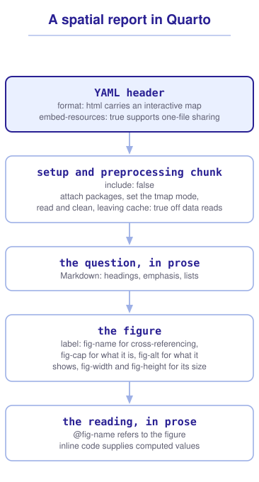

```{r}
#| include: false

library(sf)
library(tidyverse)
library(tmap)
library(webexercises)

source("src/r/course_functions.R")
source("src/r/reference_lookup.R")

lesson_refs <- find_lesson_references()
```

<hr>

<div>
{.intro_image fig-alt="Course logo"}

Analyzing data is only part of our job. We also need to communicate what the data represent, what we did with them, and what we learned. A script preserves the analysis, but it is rarely the best way to share that work with a collaborator.

I use Quarto to generate reports that bring prose, code, and output into a single document (and all of your lesson and problem sets!). Because the report is rendered from the analysis, its maps and reported values can be updated when the data or code change. In this lesson, we will use Quarto to turn a spatial analysis into a report that explains the data and communicates the results to collaborators.

In completing this lesson, you will learn how to:

* Describe the three parts of a Quarto document
* Control what a code chunk shows and what it hides
* Size a map, caption it, and describe it for a reader who cannot see it
* Produce a document that carries an interactive map to a collaborator
* Refer to a figure and to a computed number from within your prose

*This lesson is optional. Nothing later in the course depends on it, and everything in it will make your work easier to share.*

**Important!** Before starting this tutorial, be sure that you have completed all preliminary and previous lessons!

</div>

## Data for this lesson

<button class="accordion">Please click on the button below to explore the metadata for this lesson!</button>
::: panel
In this lesson, we will explore:

```{r}
#| echo: false
#| output: asis

lesson_metadata(
  .dataset =
    c(
      "dc_census.geojson",
      "district_birds.rds",
      "rock_creek_park.geojson"
    )
) %>%
  cat()
```
:::

## Set up your session

Please complete the following to ensure that you are working in a clean session:

1. Please ensure that your **Global Environment** is empty.
2. In the *History* tab of your **workspace pane**, ensure that your **session history** is empty.

Now that we are working in a clean session:

1. In RStudio, select *File* > *New File* > *Quarto Document*.
2. Give the document the title "Banding sites in the District" and your name as the author.
3. Choose *HTML* as the format and leave the visual editor unchecked, so that you can see the document's source.
4. Save the file as `reports/banding_sites.qmd`.

RStudio writes a document that contains example content. Please delete everything below the header and keep the header itself.

```{r}
#| include: false

source("scripts/source_script_module_3.R")

tmap_mode("plot")

census <-
  st_read(
    "data/raw/shapefiles/dc_census.geojson",
    quiet = TRUE
  ) %>%
  clean_names()

parks <-
  st_read(
    "data/raw/shapefiles/rock_creek_park.geojson",
    quiet = TRUE
  ) %>%
  clean_names()

all_sites <-
  read_rds("data/raw/district_birds.rds") %>%
  pluck("sites") %>%
  st_as_sf(
    coords = c("long", "lat"),
    crs = 4326
  ) %>%
  st_transform(
    st_crs(census)
  )

district_sites <-
  all_sites %>%
  st_filter(census)

park_sites <-
  all_sites %>%
  st_filter(parks)
```

## The three parts of a Quarto document

They are:

1. The **YAML header**, which states what kind of document this is and how it behaves.
2. **Markdown**, which is the prose.
3. **Code chunks**, which hold the analysis and produce the output.

When we render the document, Quarto runs the code, captures the output, and assembles the three parts into the file that we share.

### The YAML header

The header sits at the top of the file between two lines of three dashes. RStudio wrote a short one:

```yaml
---
title: "Banding sites in the District"
author: "Your name"
format: html
---
```

For spatial work, `format: html` is the option that matters most, because it is the only common format that can carry an interactive map. A PDF holds a picture, and a picture cannot be panned.

One option belongs in almost every spatial report I write:

```yaml
---
title: "Banding sites in the District"
author: "Your name"
format:
  html:
    embed-resources: true
    toc: true
---
```

Without `embed-resources`, Quarto writes the document's images, style sheets, and JavaScript into a folder named after the document, and the HTML file reads them from there. Emailing the HTML file alone sends a document whose map has been left behind. `embed-resources: true` writes the dependencies Quarto knows about, meaning its scripts, style sheets, and images, into the file itself. For a report of static maps, that makes a single file the whole report. An interactive map is the exception worth knowing: the *leaflet* library travels with the file, but the basemap tiles are fetched from a server when the page opens, so that report still needs a network.

*Note: An embedded report writes the coordinates of each interactive map into the file, so a report of several detailed layers becomes large. The *leaflet* library is written only once, regardless of how many maps there are. The geometry is what multiplies.*

::: mysecret
 [Render before you send, and open what you sent!]{style="font-size: 1.25em; padding-left: 0.5em;"}

How will you know that the file you are about to send is complete? Move the rendered file to a different folder and open it there. A document that reads its map from a sibling folder looks correct on your machine and arrives blank on someone else's, and I know of no other check that catches it.
:::

### Prose in Markdown

Markdown is a markup language. We write plain text with a few marks in it, and the renderer converts those marks into formatting.

The marks you will use most:

* `#`, `##`, and `###` at the start of a line make headings, from largest to smallest.
* `*text*` makes *italic* text, and `**text**` makes **bold** text.
* Backticks around `code` set it in a monospace font.
* A line beginning with `*` or `-` makes a bullet, and a line beginning with `1.` makes a numbered list.
* `[text](https://example.com)` makes a link.

A blank line separates paragraphs, and a blank line is required before a list. Markdown that runs a list into the paragraph above it renders as one long paragraph.

### Code chunks

A code chunk begins with three backticks and `{r}`, and ends with three backticks. Chunk options follow the opening line, each on its own line beginning with `#|`.

The options that govern what the reader sees:

* `echo: false` hides the code and shows the output. This is the option for a report written for someone who wants the result rather than the method.
* `include: false` runs the code and shows nothing. This is where the reading and preprocessing go.
* `eval: false` shows R code without running it, which is useful when a report explains an example that should not be evaluated.
* `warning: false` and `message: false` suppress warnings and messages that R or package code would otherwise add to the rendered document.

A spatial report usually opens with a chunk that the reader does not see. Let's examine one:

```{r}
#| eval: false

#| label: setup
#| include: false

library(sf)
library(tmap)
library(tidyverse)

source("scripts/source_script_module_3.R")

tmap_mode("plot")

census <-
  st_read(
    "data/raw/shapefiles/dc_census.geojson",
    quiet = TRUE
  ) %>%
  clean_names()

parks <-
  st_read(
    "data/raw/shapefiles/rock_creek_park.geojson",
    quiet = TRUE
  ) %>%
  clean_names()

all_sites <-
  read_rds("data/raw/district_birds.rds") %>%
  pluck("sites") %>%
  st_as_sf(
    coords = c("long", "lat"),
    crs = 4326
  ) %>%
  st_transform(
    st_crs(census)
  )

district_sites <-
  all_sites %>%
  st_filter(census)

park_sites <-
  all_sites %>%
  st_filter(parks)
```

The report builds every figure, table, and reported value from the objects that this chunk created, and the reader never sees the setup code or its output. We keep different names for all sites, District sites, and park sites because these objects answer different questions.

## Figures

A map in a report is a figure, and three options control how it arrives.

`fig-width` and `fig-height` set the size of the graphics device, in inches, that the map is drawn on. The size of the text on the map, relative to the map itself, depends on them: a map drawn small and enlarged by the browser has enormous labels.

`fig-cap` gives the figure a caption, which appears below it.

`fig-alt` gives the figure **alternative text**, which is what a screen reader announces in place of the image. Quarto writes it into the `alt` attribute of the generated image, and the [Quarto documentation](https://quarto.org/docs/authoring/figures.html) is explicit that "the figure caption, title, and alt text can all be different." An interactive map is not an image and has no `alt` attribute to receive it, so a report built on one needs its description in the prose or the caption instead.

Put together:

```{r}
#| eval: false

#| label: fig-income
#| fig-cap: "Median household income by census tract, in five quantile classes."
#| fig-alt: "A choropleth of the District of Columbia. The highest median incomes fall in the tracts west of Rock Creek Park, and the lowest in the tracts east of the Anacostia River."
#| fig-width: 7
#| fig-height: 6

# Add the census tracts layer:

census %>%
  tm_shape() +
  tm_polygons(
    fill = "income",
    fill.scale =
      tm_scale_intervals(
        style = "quantile",
        n = 5
      ),
    fill.legend =
      tm_legend(title = "Median income")
  )
```

A caption and alt text serve different purposes, and a map makes the difference clear. The caption states what the figure is. The alt text states what the figure shows, because a reader using a screen reader has the caption already and still has no idea where the high values are.

::: mysecret
 [Write the alt text from the pattern, not from the variables!]{style="font-size: 1.25em; padding-left: 0.5em;"}

"A map of income by census tract" repeats the caption and adds nothing for the reader. We write alt text for a map by naming the pattern: where the high values are, where the low ones are, and anything a sighted reader would remark on. If you cannot write that sentence, the map may not be making a point.
:::

::: now_you
 [Now you!]{style="font-size: 1.25em; padding-left: 0.5em;"}

Add a figure to `banding_sites.qmd` that draws the District sites over the census tracts, and give it a label, a caption, and alt text. The caption and the alt text must not say the same thing.

*Hint: The caption names the figure. The alt text names the pattern a sighted reader would see, which for this map is where the sites are and where they are not.*

[Click here to see my answer]{.answer_link data-answer="a-4-6-figalt"}

::: {.answer_body #a-4-6-figalt}

```{r}
#| eval: false

#| label: fig-sites
#| fig-cap: "Bird banding sites within the District of Columbia."
#| fig-alt: "A map of the District of Columbia with census tracts in grey and banding sites as black points. Seven sites form a cluster in the northwestern quarter of the District, with one site farther south. No sites appear in the eastern half or near the southern boundary."
#| fig-width: 7
#| fig-height: 6

# Add the census tracts layer:

census %>%
  tm_shape() +
  tm_polygons(
    fill = "grey92",
    col = "white",
    lwd = 0.5
  ) +

  # Add the banding sites layer:

  district_sites %>%
  tm_shape() +
  tm_dots(size = 0.7)
```

The caption is what belongs under the figure in a list of figures. The alt text is what a reader who cannot see the map needs in order to follow the sentence that refers to it, so it reports the clustering rather than repeating that the map exists.

:::
:::

## Referring to a figure and to a number

The label on that chunk was `fig-income`, and a label beginning with `fig-` makes the figure cross-referenceable. In the prose, `@fig-income` becomes a numbered link to it:

> Income is distributed unevenly across the District (@fig-income).

We can also take values in the prose from the code. **Inline code** is R written into a sentence, opened with `r` and a space and wrapped in backticks. The value replaces it when the document renders, which reduces the risk that a reported value falls out of date. The surrounding words still need to describe the object that we calculated. Typing this:

```markdown
Of the `r nrow(all_sites)` banding sites, `r nrow(district_sites)` fall inside the District.
```

... produces this:

> Of the 80 banding sites, 8 fall inside the District.

Change the data, render again, and the reported values change. Typing values by hand is how a report ends up contradicting its own analysis. Inline code reduces that risk, but it cannot rescue a sentence that asks the wrong question or refers to the wrong object.

::: now_you
 [Now you!]{style="font-size: 1.25em; padding-left: 0.5em;"}

In your `banding_sites.qmd`, write one sentence that reports how many of the banding sites fall inside the District. Then write a second sentence that reports how many fall inside Rock Creek Park. Take every number from the appropriate object rather than typing it.

*Hint: `all_sites`, `district_sites`, and `park_sites` answer different questions. The count of a simple features object is the count of its rows.*

[Click here to see my answer]{.answer_link data-answer="a-4-6-inline"}

::: {.answer_body #a-4-6-inline}

The sentences, written into the prose as inline code:

```markdown
Of the `r nrow(all_sites)` banding sites, `r nrow(district_sites)` fall inside the District. Rock Creek Park contains `r nrow(park_sites)` of the `r nrow(all_sites)` banding sites.
```

Each number comes from the object that answers the question around it. If the data change, the numbers update when the report is rendered. We still need to ensure that the words, objects, and calculations refer to the same analysis.

:::
:::

## Carrying an interactive map

A static map shows what we chose to show. An interactive map lets a reader pan to the part of the study area they care about and click a feature to read its values, which is why `format: html` was the option that mattered most in the header.

`tmap_mode("view")` switches *tmap* from drawing an image to drawing a map the reader can move, and the same *tmap* statement can usually be used in either mode:

```{r}
#| eval: false

#| label: fig-interactive
#| fig-cap: "Banding sites inside the District, on a basemap the reader can pan and zoom."

tmap_mode("view")

# Add the census tracts layer:

census %>%
  tm_shape() +
  tm_polygons(
    fill = "grey92",
    col = "white",
    lwd = 0.5
  ) +

  # Add the banding sites layer:

  district_sites %>%
  tm_shape() +
  tm_dots(
    fill = "red",
    size = 0.7
  )
```

Two things change once the map is interactive. It is not an image, so it has no `alt` attribute to receive `fig-alt`, and the description belongs in the caption or the prose. If the report must travel as a single HTML file, it also needs `embed-resources: true` so that the *leaflet* library is written into the file. The basemap tiles are still fetched when the page opens, so a reader without a network sees the features on an empty background.

`tmap_mode()` sets the mode for the rest of the document, so a static figure placed below this one would be drawn interactively as well. `tmap_leaflet()` converts a single *tmap* object to a Leaflet widget without changing the document's setting, and it is what I use when a report mixes the two.

## When the analysis is slow

Spatial operations are often the slowest step in a report. When a document takes several minutes to render, we render it less often, and the output falls behind the data.

`cache: true` on a chunk stores its results and reuses them on the next render, until the chunk's code changes:

```{r}
#| eval: false

#| label: buffers
#| cache: true

site_buffers <-
  district_sites %>%
  st_buffer(dist = 500)
```

The cache responds to the code rather than to the data. Quarto does not re-run a chunk whose code is unchanged, even when the file that it reads has been replaced, so a cached report can go stale without saying so. Delete the cache folder when your data change, and leave `cache: true` off the chunk that reads them.

## Putting it all together

A spatial report has a shape you can reuse, and the option that carries each step sits beside it (click to expand):

{.zoomable data-title="A spatial report in Quarto" data-pdf-key="quarto_report" fig-alt="A spatial report in Quarto runs top to bottom through five parts. The YAML header, where format html carries an interactive map and embed-resources true supports sharing one standalone file. A combined setup and preprocessing chunk marked include false attaches packages, sets the tmap mode, and reads and cleans the data, with cache true left off file-reading code. The question is written in Markdown prose. The figure is labeled fig-name for cross-referencing, with fig-cap for what it is, fig-alt for what it shows, and fig-width and fig-height for its size. The reading follows in prose, where at fig-name refers to the figure and inline code supplies computed values."}



::: {.callout-note}

This diagram is a visualization of *my* mental model for a spatial report. It is totally okay if your model differs! What is important is that you have a *working* model that helps you decide what belongs where and build a report that another person can use.

:::

::: now_you
 [Check your understanding]{style="padding-left: 0.5em;"}

Which chunk option runs the code and shows neither the code nor its output?

`r longmcq(c("echo: false", answer = "include: false", "eval: false", "warning: false"))`

You email only the rendered HTML file, and a locally generated static map is missing when your collaborator opens it. What was missing from the YAML header?

`r longmcq(c(answer = "embed-resources: true", "toc: true", "fig-alt", "cache: true"))`

True or false: A figure label must begin with `fig-` for `@` to cross-reference it.

`r torf(TRUE)`
:::

## Take-home points

* A Quarto document holds a YAML header, Markdown prose, and code chunks, and rebuilds them from the data at each render.
* `format: html` is the format that can carry an interactive map. A PDF carries a picture of one.
* `embed-resources: true` writes the document's dependencies into the file when the report needs to be shared as one standalone HTML file.
* `echo: false` hides code and shows output, `include: false` shows neither, and `eval: false` shows code without running it.
* `fig-width` and `fig-height` set the device the map is drawn on, and the size of its text follows from that.
* `fig-cap` says what the figure is and `fig-alt` says what it shows. A map's alt text names the pattern rather than the variables.
* A chunk labeled `fig-something` is cross-referenced in the prose with `@fig-something`.
* Inline code keeps reported values tied to the analysis, but the surrounding words must still describe the objects and calculations correctly.
* `cache: true` reuses a slow chunk's results and watches the code rather than the data.

## Exercises

::: now_you
 [Test your knowledge!]{style="font-size: 1.25em; padding-left: 0.5em;"}

1. You want a report that shows a map but never shows the code that drew it. Which option belongs on the chunk?

`r longmcq(c(answer = "echo: false", "include: false", "eval: false", "output: false"))`

2. Which statement about `fig-cap` and `fig-alt` is correct?

`r longmcq(c(answer = "The caption says what the figure is, while the alt text says what it shows. They can differ", "They are two names for the same option", "fig-alt replaces the caption when the image is missing", "fig-alt is only used for PDF output"))`

3. A cached chunk reads a shapefile that has since been replaced, and the report still shows the old map. Why?

`r longmcq(c(answer = "The cache is invalidated by a change to the chunk's code, not by a change to the file it reads", "Caching requires embed-resources to be set", "The chunk was also marked eval: false", "Interactive maps cannot be cached"))`

4. True or false: If you email only an HTML report that contains a static map, `embed-resources: true` allows the map to travel inside that file.

`r torf(TRUE)`
:::


