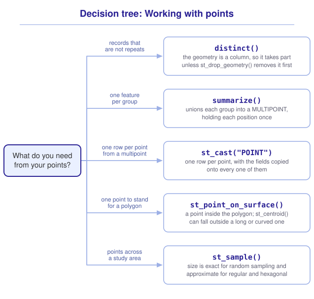

```{r}
#| include: false

library(sf)
library(tidyverse)
library(tmap)
library(webexercises)

source("src/r/course_functions.R")
source("src/r/reference_lookup.R")

lesson_refs <- find_lesson_references()
```

<hr>

<div>
{.intro_image fig-alt="Course logo"}

Community science datasets extend ecological observations beyond what field crews can collect. Their records also reflect how observations were submitted. Repeated submissions and separate observations at the same coordinates both appear as points. Before using these data, we need to decide what each record represents and what qualifies as a duplicate.

Spatial analyses can also modify or create points. In this lesson, we will use iNaturalist records and Rock Creek Park to combine observations, derive a point from a polygon, and generate survey locations. For each operation, we will examine what the returned rows and geometries represent.

In completing this lesson, you will learn how to:

* Determine whether geometry should be included when identifying duplicated records
* Use `summarize()` to combine point geometries within a group
* Separate the points in a multipoint into rows with `st_cast()`
* Place a point inside a polygon with `st_point_on_surface()`
* Draw a dense point layer with `fill_alpha = ` and with clustering
* Generate points across a study area with `st_sample()`
* Return the extent of an object with `st_bbox()` and build a geometry from it with `st_as_sfc()`

**Important!** Before starting this tutorial, be sure that you have completed all preliminary and previous lessons!

</div>

## Data for this lesson

<button class="accordion">Explore the metadata for this lesson</button>
::: panel
```{r}
#| echo: false
#| output: asis

lesson_metadata(
  .dataset = c("inat_2022_may.geojson", "rock_creek_park.geojson")
) %>%
  cat()
```
:::

## Set up your session

Begin with a clean session:

1. Ensure that your **Global Environment** is empty.
2. In the *History* tab of your **workspace pane**, ensure that your **session history** is empty.

Next:

1. Create a script file.
2. Save your script file as `scripts/focus_on_points.R`.
3. Add metadata as a comment on the top of the file.
4. Create a **code section** called "`setup`" after the metadata.
5. Attach *sf*, *tmap*, and the packages that comprise the **core tidyverse**, then load the module 3 source script.

Your script should look something like:

```{r}
#| eval: false

# My code for the focus on points tutorial

# setup --------------------------------------------------------

library(sf)
library(tmap)
library(tidyverse)

# Load the source script:

source("scripts/source_script_module_3.R")

# Draw interactive maps:

tmap_mode("view")
```

```{r}
#| include: false

source("scripts/source_script_module_3.R")
tmap_mode("view")
```

Next, create a code section called "`read and pre-process data`". Read a month of iNaturalist observations from the District and transform them to the projected CRS used throughout the course:

```{r}
inat <-
  st_read(
    "data/raw/shapefiles/inat_2022_may.geojson",
    quiet = TRUE
  ) %>%
  clean_names() %>%
  st_transform(32618)
```

Read Rock Creek Park, which is already recorded in that CRS:

```{r}
parks <-
  st_read(
    "data/raw/shapefiles/rock_creek_park.geojson",
    quiet = TRUE
  ) %>%
  clean_names()
```

View the observations:

```{r}
inat
```

Each row represents one observation and includes its date, observer, iconic taxon, scientific name, common name, and point geometry.

## Records that repeat

iNaturalist datasets are assembled from iNaturalist community contributions. There may be duplicates if an observer submits the same observation more than once. Duplicated records don't add any information about the observation.

`distinct()` returns the unique rows of a data frame (see ***2.1 Introduction to subsetting and extraction***). On a simple features object it behaves similarly, with a key difference that changes the answer:

```{r}
inat %>%
  distinct()
```

Here, matches are considered distinct only when coordinates (the `geometry` column) are also a perfect match.

Because `geometry` is a column, `distinct()` includes it in the comparison. Use `st_drop_geometry()` to exclude location:

```{r}
inat %>%
  st_drop_geometry() %>%
  distinct()
```

Without geometry, records that match in all remaining fields are duplicates even when their coordinates differ.

* Keep geometry when each record represents a sighting at a location.
* Drop geometry when you need a list of species, regardless of location.

::: mysecret
 [Decide what a duplicate is before you remove one!]{style="font-size: 1.25em; padding-left: 0.5em;"}

`distinct()` uses the columns that you specify to identify duplicated records. If you do not specify any columns, it uses every column, including `geometry`. Define a duplicate for your question, then specify the relevant columns.
:::

Naming columns restricts the comparison:

```{r}
inat %>%
  distinct(date, scientific_name)
```

By default, the result contains only the columns used in the comparison. `.keep_all = TRUE` returns the other columns from the first row of each set of matches:

```{r}
inat %>%
  distinct(
    date,
    scientific_name,
    .keep_all = TRUE
  )
```

::: now_you
 [Now you!]{style="font-size: 1.25em; padding-left: 0.5em;"}

Return one record per species, observer, and day, regardless of location. Keep every column of `inat`.

*Hint: Name the fields that define a duplicate.*

[Click here to see my answer]{.answer_link data-answer="a-5-1-distinct"}

::: {.answer_body #a-5-1-distinct}

```{r}
inat %>%
  distinct(
    date,
    user,
    scientific_name,
    .keep_all = TRUE
  )
```

Because `geometry` is not named, it is excluded from the comparison. `.keep_all = TRUE` retains the other fields and the geometry from the first matching row.

:::
:::

## Mapping many points

Community science datasets often record many observations in a small area. Points drawn on top of one another hide the records beneath them, and the reader cannot tell how many observations a symbol stands for. Two *tmap* arguments address this, and they answer different questions.

`fill_alpha = ` sets the transparency of a layer on a scale from 0 to 1. Overlapping transparent points accumulate color, so darker areas contain more records. Map the observations with transparent dots (see ***3.5 Introduction to tmap***):

```{r}
tm_shape(inat) +
  tm_dots(
    fill = "red",
    fill_alpha = 0.2
  )
```

Transparency shows where records concentrate, but not how many records are present. In view mode, *tmap* can group nearby points into a symbol labeled with the number of observations. Layer options are supplied with `opt_tm_dots()`, and `clustering = TRUE` turns the grouping on:

```{r}
tm_shape(inat) +
  tm_dots(
    options = opt_tm_dots(clustering = TRUE)
  )
```

The clusters divide as the reader zooms in, and each label reports the number of observations in its group.

::: mysecret
 [Transparency shows density, clustering reports counts!]{style="font-size: 1.25em; padding-left: 0.5em;"}

Transparency works in both *tmap* modes and is retained in a printed figure.

Clustering replaces the symbols with counts, and it is a view-mode feature only. A map rendered in plot mode draws every point and ignores the argument, so check a clustered map in plot mode before you put it in a report.
:::

## Gathering points into one feature

When observations are grouped by species and summarized, their point geometries are also combined.

Subset the bird observations:

```{r}
birds <-
  inat %>%
  filter(iconic_taxon_name == "Aves")
```

```{r}
#| echo: false

birds
```

Now summarize by species:

```{r}
by_species <-
  birds %>%
  group_by(common_name) %>%
  summarize(records = n())
```

```{r}
#| echo: false

by_species
```

After summarizing, `by_species` contains both `POINT` and `MULTIPOINT` geometries. Its geometry column therefore reports its type as `GEOMETRY`:

```{r}
by_species %>%
  st_geometry_type() %>%
  table()
```

A group with one observation retains a `POINT`. A group with observations at several positions has a `MULTIPOINT`, which stores those positions in one feature. `summarize()` applies `st_union()` to each group (see ***3.6 Geometric operations with sf***).

::: {.callout-note}

Recall that a geometry column is `GEOMETRY` when it contains more than one geometry type. Here, it contains both `POINT` and `MULTIPOINT` features.

:::

### Splitting a multipoint

`st_cast()` converts one geometry type to another (see ***3.3 Constructing and converting simple features***). Casting a `MULTIPOINT` to `POINT` creates one row and one `POINT` geometry for each stored position.

```{r}
by_species %>%
  filter(records > 1) %>%
  st_cast("POINT")
```

The `filter()` retains species with more than one record. In this dataset, those rows have `MULTIPOINT` geometries. `st_cast()` returns one row per stored point. We will consider a mixed geometry column below.

Each point becomes a row and retains the fields of its original feature. The warning describes the second change:

> repeating attributes for all sub-geometries for which they may not be constant

`common_name` remains accurate because every returned point represents that species. `records` describes the original group rather than an individual point.

::: mysecret
 [Where did the missing records go?]{style="font-size: 1.25em; padding-left: 0.5em;"}

The multipoint rows report 607 records, but casting them returns 588 points. The union retains each distinct position once, so two observations at the same coordinates become one point. However, `records = n()` still counts both observations. After a union, row count and point count answer different questions.
:::

::: now_you
 [Check your understanding]{style="padding-left: 0.5em;"}

An `sf` object has five rows. Each row contains a `MULTIPOINT` geometry with four points. How many rows will it have after `st_cast(x, "POINT")`?

`r longmcq(c(answer = "20", "5", "4", "9"))`

True or false: When `st_cast()` separates a `MULTIPOINT`, it recalculates the attribute values for each returned point.

`r torf(FALSE)`
:::

::: mysecret
 [Look at a geometry column before you cast it!]{style="font-size: 1.25em; padding-left: 0.5em;"}

Cast `by_species` without first filtering it. The object contains both `POINT` and `MULTIPOINT` geometries:

```{r}
by_species %>%
  st_cast("POINT") %>%
  nrow()
```

The result contains one row per species. Casting a `MULTIPOINT` directly to `POINT` retains only its first coordinate. This tells us that we need to the geometry types before casting.
:::

## A point that represents an area

Points derived from polygons can be used for labels, distance calculations, and spatial joins.

`st_centroid()` returns the center of mass of a geometry (see ***3.6 Geometric operations with sf***). A centroid may fall outside a long, curved, or ring-shaped polygon.

Rock Creek Park is represented by four polygons. Two are compact, while the other two are long, curved sections that follow parkways:

```{r}
parks
```

Determine whether each centroid falls within its polygon:

```{r}
parks %>%
  st_centroid() %>%
  st_within(
    parks,
    sparse = FALSE
  ) %>%
  diag()
```

`sparse = FALSE` returns a logical matrix with one row per centroid and one column per park polygon. `diag()` returns whether each centroid falls within its corresponding polygon. The centroids of the two long, curved polygons fall outside their boundaries.

Use `st_point_on_surface()` when a point must fall inside its polygon (see ***3.6 Geometric operations with sf***):

```{r}
parks %>%
  st_point_on_surface() %>%
  st_within(
    parks,
    sparse = FALSE
  ) %>%
  diag()
```

```{r}
#| fig-alt: "The four polygons representing Rock Creek Park are grey. Each polygon's centroid is red and its point on surface is blue. The red centroids of the two long, curved polygons fall outside their boundaries."

tm_shape(parks) +
  tm_polygons(fill = "grey80") +
  tm_shape(
    parks %>%
      st_centroid()
  ) +
  tm_dots(
    fill = "red",
    size = 0.6
  ) +
  tm_shape(
    parks %>%
      st_point_on_surface()
  ) +
  tm_dots(
    fill = "blue",
    size = 0.6
  )
```

For the two compact polygons, the centroid and point on surface are close together. The centroids of the two long, curved polygons fall outside their boundaries.

::: mysecret
 [A centroid does not have to fall inside its geometry!]{style="font-size: 1.25em; padding-left: 0.5em;"}

Choose the function based on what the point represents:

* Use `st_centroid()` for a geometric center or a distance from that center.
* Use `st_point_on_surface()` for a label or marker that must fall inside a polygon.
* Do not interpret a centroid or point on surface as a recorded species occurrence.
:::

::: now_you
 [Now you!]{style="font-size: 1.25em; padding-left: 0.5em;"}

Return one point for labeling Rock Creek Park as a whole.

*Hint: Combine the four park polygons before deriving the point (see ***3.6 Geometric operations with sf***).*

[Click here to see my answer]{.answer_link data-answer="a-5-1-label"}

::: {.answer_body #a-5-1-label}

```{r}
parks %>%
  st_union() %>%
  st_point_on_surface()
```

`st_union()` creates one multipolygon, and `st_point_on_surface()` returns one point from it. Reversing the operations returns one point per original polygon.

:::
:::

## Points we generate

Not all point locations are observed in the field. We may generate points to plan survey locations, select background locations for a species distribution model, or compare an observed spatial pattern to points placed at random.

`st_sample()` returns points drawn from within a geometry. We will use the following arguments:

* `x = `: the sampling area.
* `size = `: the requested number of points.
* `type = `: the sampling design. The default is `"random"`.

We will sample across the entire park. `set.seed()` makes the result reproducible.

```{r}
park_area <-
  parks %>%
  st_union()

set.seed(2026)

random_plots <-
  park_area %>%
  st_sample(size = 25)
```

```{r}
#| echo: false

random_plots
```

`st_sample()` returns an `sfc` object: geometries with a CRS, but no attribute fields.

Random sampling can leave gaps and clusters. Regular sampling places points on a grid:

```{r}
set.seed(2026)

regular_plots <-
  park_area %>%
  st_sample(
    size = 25,
    type = "regular"
  )

length(regular_plots)
```

Although `size = 25`, the call returns 29 points. For regular sampling, `size = ` determines the grid spacing rather than the exact count. Points outside the study area are discarded.

A **bounding box** is the smallest rectangle containing an object. `st_bbox()` returns its four coordinates, and `st_as_sfc()` constructs the polygon they describe:

```{r}
park_bbox <-
  park_area %>%
  st_bbox() %>%
  st_as_sfc()
```

```{r}
#| echo: false

park_bbox
```

The resulting polygon retains the original CRS.

Random sampling returns the requested number of points:

```{r}
set.seed(2026)

length(
  st_sample(park_area, size = 25)
)
```

Compare the two designs:

```{r}
#| fig-alt: "A tall, narrow black rectangle, the bounding box of Rock Creek Park, with the park itself drawn inside it in grey as a ribbon running north to south. Two sets of sample points lie on the park. The red points of the random design are unevenly spread, with gaps and clusters. The blue points of the regular design sit on an evenly spaced grid. Most of the rectangle is empty."

tm_shape(park_bbox) +
  tm_borders(col = "black") +
  tm_shape(park_area) +
  tm_polygons(fill = "grey80") +
  tm_shape(random_plots) +
  tm_dots(
    fill = "red",
    size = 0.5
  ) +
  tm_shape(regular_plots) +
  tm_dots(
    fill = "blue",
    size = 0.5
  )
```

Rock Creek Park covers about 28 percent of its bounding box. Most of the regular grid falls outside the park and is discarded.

::: mysecret
 [The designs available to st_sample()]{style="font-size: 1.25em; padding-left: 0.5em;"}

For polygons, `type = ` accepts `"random"`, `"regular"`, and `"hexagonal"`. A hexagonal design uses a triangular lattice with equal spacing between neighboring points. This produces more even directional spacing than a square grid.

`st_sample()` also accepts lines and points, and sampling a line returns positions along it.
:::

::: now_you
 [Check your understanding]{style="padding-left: 0.5em;"}

For a polygon `x`, which call returns the requested number of points?

`r longmcq(c(answer = 'st_sample(x, size = 40)', 'st_sample(x, size = 40, type = "regular")', 'st_sample(x, size = 40, type = "hexagonal")', "All of them"))`

True or false: The object returned by `st_sample()` has the same fields as the input object.

`r torf(FALSE)`
:::

## Putting it all together

The source and purpose of point data determine which operations are appropriate. My own model looks like this (click to expand):

{.zoomable data-title="Decision tree: Working with points" data-pdf-key="working_with_points" fig-alt="To decide what to do with a set of points, ask what you need from them. For records that are not repeats, use distinct(), remembering that the geometry is a column and so takes part in the comparison unless st_drop_geometry() removes it first. For one feature per group, use summarize(), which unions each group's point geometries and retains each distinct position once. Groups with several distinct positions become MULTIPOINT geometries. For one row per point from a multipoint, use st_cast() to POINT, which returns one row per point with the fields copied onto every one of them. For one point to stand for a polygon, use st_point_on_surface(), which returns a point inside the polygon where st_centroid() can fall outside a long or curved one. For points across a study area, use st_sample(), whose size argument is exact for random sampling and approximate for regular and hexagonal."}



::: {.callout-note}

This tree shows *my* mental model for these functions. Your model may differ. What matters is that it helps you retrieve the functions needed to solve a problem.

:::

## Take-home points

* `distinct()` compares the geometry column along with every other column, so dropping the geometry first changes the question and returns a different answer.
* `summarize()` unions the geometries of each group. A group with one distinct position returns a `POINT`, while a group with several distinct positions returns a `MULTIPOINT`. A column containing both reports its type as `GEOMETRY`.
* A union returns each distinct position once, so a count calculated before it can disagree with the number of points after it.
* Casting a `MULTIPOINT` to `"POINT"` returns one row per stored point and copies the fields onto each row. Casting a mixed `POINT` and `MULTIPOINT` column directly to `"POINT"` retains only the first coordinate of each `MULTIPOINT` and returns a warning.
* `st_centroid()` returns the center of mass, which for a long or curved polygon can fall outside it. `st_point_on_surface()` returns a point inside.
* `st_sample()` returns an `sfc` of points drawn within a geometry. `size = ` is exact for `type = "random"` and approximate for `"regular"` and `"hexagonal"`.
* `fill_alpha = ` makes overlapping points accumulate color, which shows where records concentrate. Clustering replaces the symbols with a count, in view mode only.
* `set.seed()` makes a sampling design reproducible.

## Exercises

::: now_you
 [Test your knowledge!]{style="font-size: 1.25em; padding-left: 0.5em;"}

1. Which statement returns one row per observer and combines that observer's locations into one geometry?

`r longmcq(c(answer = "inat %>% group_by(user) %>% summarize(records = n())", "inat %>% distinct(user, .keep_all = TRUE)", "inat %>% st_cast('MULTIPOINT')", "inat %>% group_by(user) %>% st_union()"))`

2. An `sf` object has eight rows. Each row contains a `MULTIPOINT` geometry with three points and a value in `records`. After `st_cast(x, "POINT")`, what happens to the `records` value from the first original row?

`r longmcq(c(answer = "It is copied to each of the three returned rows", "It is replaced by the number of points", "It is divided among the three returned rows", "It is replaced with NA"))`

3. A colleague places a label on each county of a state with `st_centroid()`, and one label lands in the ocean. What happened?

`r longmcq(c(answer = "The county is curved or has a concave shape, so its center of mass falls outside it", "The county is recorded in a geographic CRS", "st_centroid() cannot be used on a multipolygon", "The label was placed before the county was transformed"))`

4. Parsons problem: Reorder the lines to generate a reproducible grid of points within Rock Creek Park. Place the line for a different sampling design in the trash.

<div class="parsons-problem">
<div id="p-5-1-01-trash" class="sortable-code"></div>
<div id="p-5-1-01-sortable" class="sortable-code"></div>
<div style="clear: both;"></div>
<button id="p-5-1-01-check" class="parsons-btn parsons-btn-check" type="button">Check My Order</button>
<button id="p-5-1-01-reset" class="parsons-btn parsons-btn-reset" type="button">Shuffle Again</button>
<p id="p-5-1-01-feedback" class="parsons-feedback"></p>
</div>

<script>
window.parsonsProblems = window.parsonsProblems || []; window.parsonsProblems.push({ id: "p-5-1-01", maxDistractors: 1, code: "set.seed(2026)\n\nparks %>%\n  st_union() %>%\n  st_sample(\n    size = 25,\n    type = \"random\" #distractor\n    type = \"regular\"\n  )" });
</script>

5. True or false: When no columns are specified, `distinct()` uses the geometry column to identify duplicated rows in an `sf` object.

`r torf(TRUE)`
:::


