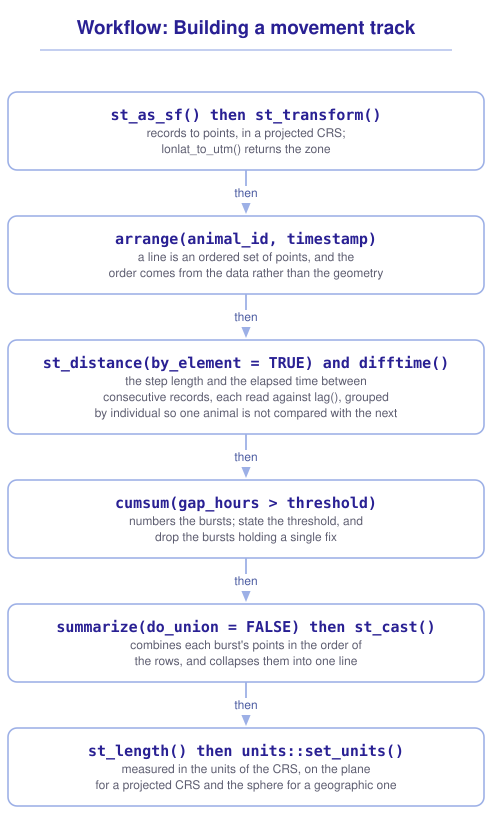

```{r}
#| include: false

library(sf)
library(tidyverse)
library(tmap)
library(webexercises)

source("src/r/course_functions.R")
source("src/r/reference_lookup.R")

lesson_refs <- find_lesson_references()
```

<hr>

<div>
{.intro_image fig-alt="Course logo"}

A **line** is an ordered set of points. GPS collars record positions rather than the paths traveled between them, so connecting consecutive positions assumes straight-line movement during each interval.

In this lesson, we will use collar records from African buffalo in Kruger National Park. We will order the positions, build and measure tracks, calculate the distance and elapsed time between consecutive records, and split tracks where the records contain long gaps. In completing this lesson, you will learn how to:

* Build a line from an ordered set of points with `summarize()` and `st_cast()`
* Use `arrange()` to set the order of the points before building a line
* Measure a path with `st_length()`
* Calculate the distance and the elapsed time between consecutive records
* Split a track at its gaps with `cumsum()` and a stated gap threshold

**Important!** Before starting this tutorial, be sure that you have completed all preliminary and previous lessons!

</div>

## Data for this lesson

<button class="accordion">Explore the metadata for this lesson</button>
::: panel
```{r}
#| echo: false
#| output: asis

lesson_metadata(
  .dataset = "kruger_buffalo.csv"
) %>%
  cat()
```
:::

## Set up your session

Begin with a clean session:

1. Ensure that your **Global Environment** is empty.
2. In the *History* tab of your **workspace pane**, ensure that your **session history** is empty.

Next:

1. Create a script file.
2. Save your script file as `scripts/focus_on_lines.R`.
3. Add metadata as a comment on the top of the file.
4. Create a **code section** called "`setup`" after the metadata.
5. Attach *sf*, *tmap*, and the packages that comprise the **core tidyverse**, then load the module 3 source script.

Your script should look something like:

```{r}
#| eval: false

# My code for the focus on lines tutorial

# setup --------------------------------------------------------

library(sf)
library(tmap)
library(tidyverse)

# Load the source script:

source("scripts/source_script_module_3.R")

# Draw interactive maps:

tmap_mode("view")
```

```{r}
#| include: false

source("scripts/source_script_module_3.R")
tmap_mode("view")
```

Next, create a code section called "`read and pre-process data`". Read the collar records, which are stored as a table of coordinates:

```{r}
buffalo <-
  read_csv(
    "data/raw/kruger_buffalo.csv",
    show_col_types = FALSE
  )
```

```{r}
#| echo: false

buffalo
```

Each row represents a single GPS fix and includes the name of the animal that wore the collar, the timestamp, and a longitude and latitude in decimal degrees.

We will calculate distances between GPS fixes in a projected CRS. `lonlat_to_utm()`, from the module 3 source script, returns the EPSG code of the UTM zone containing a coordinate. Return the code for the mean position of the records:

```{r}
buffalo_epsg <-
  lonlat_to_utm(
    c(
      buffalo %>%
        pull(longitude) %>%
        mean(),
      buffalo %>%
        pull(latitude) %>%
        mean()
    )
  )
```

```{r}
#| echo: false

buffalo_epsg
```

EPSG 32736 is UTM zone 36S, which covers the eastern edge of South Africa. Convert the records to points and transform them:

```{r}
fixes <-
  buffalo %>%
  st_as_sf(
    coords = c("longitude", "latitude"),
    crs = 4326
  ) %>%
  st_transform(buffalo_epsg)
```

```{r}
#| echo: false

fixes
```

## The order of the points is the line

A line is defined by its vertices and by the order in which they are connected.

Nothing in a simple features object enforces that order. The order of the rows determines the order of the coordinates when the line is built. Sort the fixes by animal and timestamp:

```{r}
fixes <-
  fixes %>%
  arrange(animal_id, timestamp)
```

::: mysecret
 [Sort before you build a line!]{style="font-size: 1.25em; padding-left: 0.5em;"}

A track built from unsorted fixes is still a valid `LINESTRING`, and neither the printed object nor its length identifies the incorrect sequence. Draw a track before you measure it.
:::

## One line per animal

We build the lines by combining points into a MULTIPOINT object using grouping and summarizing (see ***5.1 Focus on points: Occurrence records and sampling***). We'll add an additional argument, `do_union = FALSE` to combine each group's coordinates in the order of the rows:

```{r}
tracks <-
  fixes %>%
  group_by(animal_id) %>%
  summarize(
    fixes = n(),
    do_union = FALSE
  )
```

```{r}
#| echo: false

tracks
```

The default, `do_union = TRUE`, unions each group's points into a multipoint, which returns each distinct position once and discards the row order. `st_cast()` then builds the line from the stored coordinate order.

Cast each multipoint to a `LINESTRING`:

```{r}
tracks <-
  tracks %>%
  st_cast("LINESTRING")
```

```{r}
#| echo: false

tracks
```

Casting a multipoint to points returns one row per point (see ***5.1 Focus on points: Occurrence records and sampling***). Casting a multipoint to a line combines its points into one geometry, so the row count does not change.

`tm_lines()` adds line geometries to a *tmap*. Add one line per animal:

```{r}
#| fig-alt: "The tracks of six African buffalo in Kruger National Park, each drawn in its own color. Four of the tracks overlap in the south of the study area and two sit further north."

tm_shape(tracks) +
  tm_lines(
    col = "animal_id",
    col.legend =
      tm_legend(title = "Buffalo")
  )
```

::: now_you
 [Check your understanding]{style="padding-left: 0.5em;"}

One group of an `sf` object contains 200 `POINT` geometries. What does `summarize()` return for that group when `do_union` is left at its default?

`r longmcq(c(answer = "One MULTIPOINT feature holding each distinct position once, in no particular order", "One LINESTRING feature", "200 POINT features", "An error, because points cannot be summarized"))`

True or false: `st_cast(x, "LINESTRING")` on a column of multipoints returns one row for every vertex.

`r torf(FALSE)`
:::

## How far did it walk?

`st_length()` returns the length of a line with units. Measure each track:

```{r}
tracks <-
  tracks %>%
  mutate(
    path_length =
      st_length(geometry)
  )

tracks %>%
  st_drop_geometry()
```

The lengths are returned in meters. Convert them to kilometers with `units::set_units()` (see ***3.6 Geometric operations with sf***):

```{r}
tracks %>%
  mutate(
    path_km =
      units::set_units(path_length, "km")
  ) %>%
  st_drop_geometry()
```

Toni's collar recorded for eight months. The line built from its fixes is about 1,580 km long. That length is a property of the line rather than the distance the animal walked. The geometry contains no movement between fixes. If the fixes are accurate, the length is a lower bound on the path consistent with the recorded positions.

::: mysecret
 [Length depends on the CRS, and so does the answer]{style="font-size: 1.25em; padding-left: 0.5em;"}

`st_length()` calculates planar length in the linear units of a projected CRS. For a geographic CRS, *sf* calculates geodesic or spherical length and returns the result in meters. The same track can therefore return different values depending on the CRS and the geometry engine used.

```{r}
tracks %>%
  st_transform(4326) %>%
  st_length()
```

The difference here is a fraction of a percent, because UTM zone 36S is the correct zone for these data. A projection that is inappropriate for the region returns a larger difference, and neither result carries a warning. Choose the CRS for the calculation before you make it (see ***3.4 The coordinate reference system: Why it matters and how to use it***).
:::

## The steps between fixes

The path length describes the whole track. The individual steps describe the movement between consecutive fixes: the distance, the elapsed time, and the rate calculated from them.

Calculate them on `fixes` rather than on `tracks`, which no longer contain the individual records. We will use the following functions:

* `lag()` returns the previous value of a vector, with `NA` in the first position.
* `st_distance()` with `by_element = TRUE` compares two geometry columns row by row.
* `difftime()` returns the difference between two date-times, in the units named by its `units = ` argument.

```{r}
steps <-
  fixes %>%
  group_by(animal_id) %>%
  mutate(
    step_length =
      st_distance(
        geometry,
        lag(geometry),
        by_element = TRUE
      ),
    gap_hours =
      as.numeric(
        difftime(
          timestamp,
          lag(timestamp),
          units = "hours"
        )
      )
  ) %>%
  ungroup()

steps %>%
  st_drop_geometry() %>%
  slice_head(n = 6)
```

`lag()` returns `NA` for the first record of each animal, so `step_length` and `gap_hours` are `NA` in that row. Grouping by `animal_id` restricts `lag()` to the records of one animal, so the last fix of one animal is not used as the previous fix of the next.

::: {.callout-note}

Recall that `st_distance()` returns a matrix of every pairwise distance when it is given two objects (see ***3.6 Geometric operations with sf***). `by_element = TRUE` returns the distance between the geometries at the same position in each object, as a vector with one value per row.

:::

Dividing the two new columns gives a rate. It is built from the straight line between two fixes, so it is a **net displacement rate** rather than the speed the animal traveled at:

```{r}
steps %>%
  st_drop_geometry() %>%
  filter(gap_hours <= 1) %>%
  mutate(
    displacement_kph =
      (as.numeric(step_length) / 1000) / gap_hours
  ) %>%
  pull(displacement_kph) %>%
  summary()
```

The calculation uses the straight-line distance between fixes. If the positions are accurate, the net displacement rate does not exceed the animal's average speed along its actual path. The difference is unknown across a gap of several days.

::: now_you
 [Now you!]{style="font-size: 1.25em; padding-left: 0.5em;"}

Return the median hourly step length for each animal, using only the steps that followed a gap of an hour or less.

*Hint: `step_length` carries units, and `median()` will keep them (see ***3.6 Geometric operations with sf***).*

[Click here to see my answer]{.answer_link data-answer="a-5-2-steps"}

::: {.answer_body #a-5-2-steps}

```{r}
steps %>%
  st_drop_geometry() %>%
  filter(gap_hours <= 1) %>%
  summarize(
    median_step = median(step_length),
    .by = animal_id
  )
```

Dropping the geometry first makes this a summary of the records rather than of their positions. Leaving it on would return an `sf` object and would union each animal's points to build its geometry, which is unnecessary work.

```{r}
#| eval: false

# Or:

steps %>%
  st_drop_geometry() %>%
  filter(gap_hours <= 1) %>%
  group_by(animal_id) %>%
  summarize(
    median_step = median(step_length)
  )
```

:::
:::

## A line the data does not support

GPS collar records often contain gaps caused by dense canopy, loss of satellite contact, or low battery. The fixes on either side of a gap are observations, but the path between them was not observed.

Queen's collar has the longest gaps in the file. Subset Queen's records and return the steps that followed a gap of more than 24 hours:

```{r}
queen <-
  steps %>%
  filter(animal_id == "Queen")

queen %>%
  st_drop_geometry() %>%
  filter(gap_hours > 24) %>%
  select(
    timestamp,
    step_length,
    gap_hours
  )
```

The longest gaps are spanned by straight segments of 5 and 14 km. Build and measure Queen's full track:

```{r}
queen_track <-
  queen %>%
  summarize(do_union = FALSE) %>%
  st_cast("LINESTRING")

queen_track %>%
  st_length() %>%
  units::set_units("km")
```

A **burst** is a run of consecutive fixes with no gap longer than the selected threshold. `cumsum()` on a logical vector numbers the bursts: the value increases by one at each `TRUE` and is unchanged elsewhere.

```{r}
queen_bursts <-
  queen %>%
  mutate(
    burst =
      cumsum(
        replace_na(gap_hours > 24, TRUE)
      )
  )

queen_bursts %>%
  st_drop_geometry() %>%
  count(burst)
```

`replace_na(..., TRUE)` sets the value for the first row, whose `gap_hours` is `NA`, to `TRUE`. Treating it as the start of a burst numbers the first burst one rather than `NA`.

A line requires at least two vertices. Remove bursts containing one fix, then build one line per remaining burst:

```{r}
queen_lines <-
  queen_bursts %>%
  group_by(burst) %>%
  filter(n() > 1) %>%
  summarize(
    fixes = n(),
    do_union = FALSE
  ) %>%
  st_cast("LINESTRING")

queen_lines %>%
  mutate(
    length_km =
      units::set_units(
        st_length(geometry),
        "km"
      )
  ) %>%
  st_drop_geometry()
```

Their lengths sum to about 559 km, against 584 km for the single track. The difference of about 25 km is the four straight segments that are no longer drawn.

```{r}
#| fig-alt: "Queen's full track drawn as a thick grey line with the three burst lines drawn over it in color. Four straight grey segments have no colored line on them, marking the crossings the collar did not record."

tm_shape(queen_track) +
  tm_lines(
    col = "grey60",
    lwd = 3
  ) +
  tm_shape(queen_lines) +
  tm_lines(
    col = "burst",
    lwd = 2
  )
```

The grey line underneath is the whole track. Where no colored line covers it, the grey segment is a claim about eleven days of movement that rests on two fixes.

::: mysecret
 [State your gap threshold and keep it!]{style="font-size: 1.25em; padding-left: 0.5em;"}

There is no threshold that is correct for every study. A useful threshold depends on the sampling interval, the species, and the question. The value changes the path length, step length, displacement rate, and shape of the track on the map. State the threshold you used. A track built with an unstated threshold cannot be reproduced. A track built with no threshold reports a distance the study never recorded.
:::

::: now_you
 [Now you!]{style="font-size: 1.25em; padding-left: 0.5em;"}

Build a burst line for every animal rather than for Queen alone, using the same threshold of 24 hours.

*Hint: The bursts have to be numbered within each animal, and the lines have to be built within each animal too (see ***2.3 Grouped operations and summarizing***).*

[Click here to see my answer]{.answer_link data-answer="a-5-2-bursts"}

::: {.answer_body #a-5-2-bursts}

```{r}
steps %>%
  group_by(animal_id) %>%
  mutate(
    burst =
      cumsum(
        replace_na(gap_hours > 24, TRUE)
      )
  ) %>%
  group_by(animal_id, burst) %>%
  filter(n() > 1) %>%
  summarize(
    fixes = n(),
    do_union = FALSE,
    .groups = "drop"
  ) %>%
  st_cast("LINESTRING")
```

The first `group_by()` numbers the bursts within each animal, so that Cilla's first burst and Toni's first burst are both numbered one. The second groups on the animal and the burst, which returns one line per burst rather than one line per animal.

`.groups = "drop"` returns an ungrouped object. Without it, `summarize()` leaves the result grouped by `animal_id`, and the next operation in a pipeline inherits that grouping.

:::
:::

## Putting it all together

Building a track from records follows a fixed order, and the choices at each step affect the result. My own model for that looks like this (click to expand):

{.zoomable data-title="Workflow: Building a movement track" data-pdf-key="building_a_track" fig-alt="A workflow for building a movement track. First, st_as_sf() and st_transform() convert the records to points in a projected CRS, with lonlat_to_utm() returning the zone. Next, arrange() sorts by the individual and timestamp because a line is an ordered set of points and the order comes from the data rather than the geometry. Then st_distance() with by_element equal to TRUE, used with lag(), returns the step length and the elapsed time between consecutive records, grouped by individual. Next, cumsum() of the test that the gap exceeds a threshold numbers the bursts. State the threshold and drop the bursts holding a single fix. Then summarize() with do_union equal to FALSE combines each burst's points in the order of the rows, and st_cast() collapses them into a line. Finally, st_length() and units::set_units() measure the result. Projected geometries use planar measurement in the CRS units, while geographic geometries use geodesic or spherical measurement returned in meters."}



::: {.callout-note}

This workflow shows *my* mental model for these functions. Your model may differ. What matters is that it helps you retrieve the functions needed to solve a problem.

:::

## Take-home points

* A line is an ordered set of points, and the order comes from the data. `arrange()` on the individual and the timestamp is part of building a track, not part of presenting it.
* `summarize(do_union = FALSE)` combines a group's points in the order of the rows. The default unions them instead, which returns each distinct position once and discards the sequence.
* `st_cast()` to `"LINESTRING"` collapses each multipoint into one line, so the number of rows does not change.
* `st_length()` uses planar measurement in the linear units of a projected CRS. For a geographic CRS, *sf* uses geodesic or spherical measurement and returns meters.
* `st_distance(x, lag(x), by_element = TRUE)` returns the distance between consecutive records. Group by the individual so that one animal's last fix is not compared with the next animal's first.
* A track drawn across a long gap asserts a journey that was never recorded. Choose a gap threshold, number the bursts with `cumsum()` on the test, drop the bursts that contain one fix, and state the threshold you used.

## Exercises

::: now_you
 [Test your knowledge!]{style="font-size: 1.25em; padding-left: 0.5em;"}

1. An `sf` object of unsorted fixes is summarized with `do_union = FALSE` and cast to `"LINESTRING"`. What does the cast return?

`r longmcq(c(answer = "A valid LINESTRING whose vertices are in the wrong order", "An error naming the unsorted column", "A MULTIPOINT, because a line cannot be built from unsorted points", "A LINESTRING with the correct shape, because sf sorts the points itself"))`

2. Which argument of `summarize()` keeps the sequence of a group's points?

`r longmcq(c(answer = "do_union = FALSE", "is_coverage = TRUE", ".groups = \"drop\"", "by_element = TRUE"))`

3. A step spans eleven days. Its step length is divided by its elapsed time, with no filter applied to the gap length. What does the resulting value represent?

`r longmcq(c(answer = "The net displacement rate between recorded fixes, not movement speed during the gap", "The animal's mean movement speed during the gap", "An NA, because the gap is too long", "A value in the wrong units"))`

4. Parsons problem: Reorder the lines to return one line for each buffalo, measured in kilometers. Place the line that would discard the order of the fixes in the trash.

<div class="parsons-problem">
<div id="p-5-2-01-trash" class="sortable-code"></div>
<div id="p-5-2-01-sortable" class="sortable-code"></div>
<div style="clear: both;"></div>
<button id="p-5-2-01-check" class="parsons-btn parsons-btn-check" type="button">Check My Order</button>
<button id="p-5-2-01-reset" class="parsons-btn parsons-btn-reset" type="button">Shuffle Again</button>
<p id="p-5-2-01-feedback" class="parsons-feedback"></p>
</div>

<script>
window.parsonsProblems = window.parsonsProblems || []; window.parsonsProblems.push({ id: "p-5-2-01", maxDistractors: 1, code: "fixes %>%\n  arrange(animal_id, timestamp) %>%\n  group_by(animal_id) %>%\n  summarize(do_union = TRUE) %>% #distractor\n  summarize(do_union = FALSE) %>%\n  st_cast(\"LINESTRING\") %>%\n  mutate(\n    path_km = units::set_units(st_length(geometry), \"km\")\n  )" });
</script>

5. True or false: The length of a track is an estimate of the distance the animal walked.

`r torf(FALSE)`
:::


