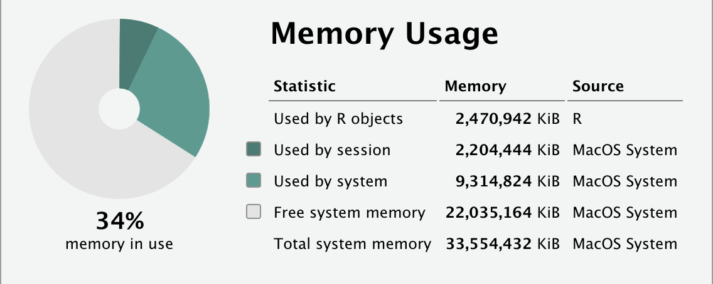

```{r, include = FALSE}
source("src/r/course_functions.R")
```
```{r setup, include=FALSE}
library(tidyverse)
library(DT)

knitr::opts_chunk$set(
  echo = TRUE,
  eval = TRUE,
  error = TRUE)

rm(has_annotations)
```

<hr>

<div>
{.intro_image}

One of the biggest problems that I see students face when conducting spatial analyses in R is errors associated with running out of memory. **Memory** is a temporary storage location (*though not the only one*) and the location on your computer where information is processed.

In this lesson, we are going to enhance our sf toolkit by learning how to better manage our R's memory usage through exploring and modifying shapefiles. Specifically, we will address how memory usage is impacted by:

* Subsetting fields with `select()`
* Dropping geometries with `as_tibble()`, `select()`, and `st_drop_geometry()`
* Subsetting features using `filter()`, `st_filter()`, and `st_intersection()`
* Combining spatial polygons with `st_union()` and `summarize()`
* Simplifying spatial polygons with `st_simplify()` and `rmapshaper::ms_simplify()`
* Spatial operations using projected vs. unprojected coordinate reference systems

Along the way, we will review the core functions associated with processing shapefile data with `sf` and explore a few steps that will improve your map-making skills!

**Important!** Before starting this tutorial, be sure that you have completed all preliminary and  previous lessons.

</div>

## Data for this lesson

Please click on the buttons below to explore the metadata for this lesson!

<button class="accordion">Metadata for this lesson</button>

::: panel

In this lesson, we will explore the following files:

**[census]{.mono} ([.dbf]{.mono}, [.prj]{.mono}, [.shp]{.mono}, [.shx]{.mono})**: A polygon shapefile of US Census tracts in the District of Columbia, Maryland, and Virginia. The data are in an unprojected coordinate system (datum = NAD83) with the EPSG code 4269 The data include (but are not limited to!) the following fields:

* [GEOID]{.mono}, character: The **primary key** key for each census tract.
* [STATEFP]{.mono}, character: A **foreign key** to the US state in the [states]{.mono} data.
* [ALAND]{.mono}, numeric: The area covered by land in each census tract, in square meters.
* [AWATER]{.mono}, numeric: The area covered by water in each census tract, in square meters.
* [income]{.mono}, numeric: The median income of each census tract.
* [population]{.mono}, numeric: The total population of each census tract.

**[counties.geojson]{.mono}** and **[counties_low_res.geojson]{.mono}**: A polygon shapefile of all counties in the United States obtained from US Census data using the *tigris* package. The data are in a projected Coordinate Reference System with the datum NAD83 and EPSG code 5070. Fields include (but are not limited to):

* [statefp]{.mono}, character: A **foreign key** to each US state in the [states]{.mono} data.
* [countyfp]{.mono}, character: An ID assigned to a given county in a given state.
* [geoid]{.mono}, character: The **primary key** key for each county (*Note: These values are a concatenation of [STATEFP]{.mono} and [COUNTYFP]{.mono}*).
* [name]{.mono}, character: The name of each county.
* [stusps]{.mono}, character: The two-letter postal code of the state each county is within.
* [state_name]{.mono}, character: The name of the state each county is within.
* [aland]{.mono}, numeric: The area covered by land in each census tract, in square meters.
* [awater]{.mono}, numeric: The area covered by water in each census tract, in square meters.

**[states]{.mono} ([.dbf]{.mono}, [.prj]{.mono}, [.shp]{.mono}, [.shx]{.mono})**: A polygon shapefile of US states (not including Hawaii). The data are in an unprojected Coordinate Reference System with the datum NAD83 and EPSG code 4269. The data include the following fields:

* [GEOID]{.mono}, character: The **primary key** key for each state.
* [NAME]{.mono}, character: The name of each state.
* [REGION]{.mono}, character: The region of the United States where each state is located.
* [AREA]{.mono}, numeric: The total area of each state, in square kilometers.
* [ttl__10]{.mono}, numeric: The total population of each state in 2010.
* [ttl__15]{.mono}, numeric: The total population of each state in 2015.

:::

## Before you begin

<a title = "Memory usage">

</img>
</a>
Proper management of your R sessions begins with proper management of your computer system overall. 

As shown in the image on the right, the Environment tab provides a handy way to quickly view the amount of memory you have allocated relative to the amount of memory you have available. If this wheel turns yellow, or red (the horror), you could be well on your way to major problems. Symptoms include simple functions running super slowly, warning messages that you ran out of memory ("Could not allocate vector ..."), or, in the worst case scenario, aborted R sessions.

Let's dig into the details a little further. In R Studio, click on the downward arrow next to the memory usage icon and then select "Memory Usage Report...". This provides a summary of memory usage by your R session ("Used by session") and your computer system ("Used by system"):


</img>

*Note: The two images above are from Posit's helpful document <a href="https://support.posit.co/hc/en-us/articles/1500005616261-Understanding-Memory-Usage-in-the-RStudio-IDE" target="_blank">Understanding Memory Usage in the RStudio IDE</a>.*

If you observe that your system is occupying a lot of memory, you might want to explore why. If you are on a Mac, use the *Activity Monitor* app (see "Memory" tab) to view memory usage by application. If you are on a Windows system, use the Task Manager (Ctrl + Shift + Esc). Once you have a sense of the memory your system is using *outside of R*:

1. Close any unused programs, especially if they are using a lot of memory
2. Close any internet browser tabs that you are not actively using (*Note: The Google Chrome extension <a href="https://chrome.google.com/webstore/detail/onetab/chphlpgkkbolifaimnlloiipkdnihall" target="_blank">OneTab</a> can be a great way to close tabs without losing them!*)
3. Check your Memory usage report again. Has it gone down? If not, and if you are running low on memory, you may want to restart your computer.

## Setup

1. Open R Studio and a new script file. Remember that it's best practice to start with a clean R Studio session!

2. Add a new code section and call it "setup"

3. After a space between your section break, include and run the following:

:::{style="margin-left: 40px"}
```{r results = 'hide', message = FALSE, warning = FALSE}
library(bench)
library(lobstr)
library(sf)
library(tmap)
library(tidyverse)
```
:::

4. Load the source script and set the ggplot theme and tmap mode for all plots in this lesson:

:::{style="margin-left: 40px"}
```{r}
# Load the source script:

source("src/r/gis_functions.R")

# Set the ggplot theme for our entire session:

theme_set(
  theme_void()
)

# Set the tmap_mode for our entire session:

tmap_mode("view")
```

Our source file loaded three functions, but we will only be using the function `clean_names()`. As such, please remove `lon_lat_to_utm` and `universal_plot_theme`:

```{r}
rm(lonlat_to_utm, universal_plot_theme)
```

:::

5. Now we will read in `states.shp`, `counties.geojson`, and `census.shp`. Let's do this as a "Now you!" challenge:

:::{.now_you}
<button class="accordion">&nbsp; In a single piped statement:

* Define a character vector of file paths to read in;
* Using a single `map()` function;
    * Read in each of the shapefiles;
    * Use a custom function from `gis_functions.R` to clean the names of the objects;
    * Transform the coordinate reference system (CRS) to EPSG 5070 (projected, Conus Albers);
* Assign the names `states`, `counties`, and `census` to the list;
* Store the list in our computer's memory by globally assigning the name `shapes`.

</button>
::: panel
```{r}

shapes <- 
  
  # Define a vector of file paths to read in:
  
  file.path(
    "data/raw/shapefiles",
    c(
      "states.shp", 
      "counties.geojson",
      "census.shp"
    )
  ) %>% 
  
  # Read and pre-process files:
  
  map(
    ~ st_read(.x, quiet = TRUE) %>% 
      clean_names() %>% 
      st_transform(crs = 5070)
  ) %>% 
  
  # Assign names to each list item:
  
  set_names(
    "states",
    "counties",
    "census"
  )
```

:::
Please the give the above a try and then click the button to see how I answered this question!
:::

:::{style="margin-left: 40px"}
We will no longer need to use the function `clean_names()` in this lesson. As such, please remove the name `clean_names` from your global environment:

```{r}
rm(clean_names)
```

:::

6. The coordinates (-77.075212, 38.90677) represent the location of one of my classrooms on the campus of Georgetown University. My students collected the data using a handheld GPS unit set to EPSG 4326 (CRS: unprojected World Geodetic System 1984). Let's read this in as another "Now you!" challenge:

:::{.now_you}
<button class="accordion">&nbsp; In a single piped statement:

* Create a tibble with the value -77.075212 in the `x` column and the value 38.90677 in the `y` column
* Convert to a shapefile with the CRS that the coordinates were recorded in
* Transform the CRS to EPSG 5070
* Globally assign the name `classroom` to the resultant object

</button>
::: panel
```{r}
classroom <-
  tibble(
    x = -77.075212,
    y = 38.90677) %>% 
  st_as_sf(
    coords = c("x", "y"), 
    crs = 4326
  ) %>% 
  st_transform(5070)
```
:::
Please the give the above a try and then click the button to see how I answered this question!
:::

## Memory evaluation tools

The packages *lobstr* and *bench* offer opportunities to evaluate our memory usage when working in R. This is incredibly important for working with spatial files because the data are often very large. If we do not manage our memory, we can get stuck waiting for processes to complete or, even worse, get the dreaded “out of memory” errors.

### Object size

When we assign a name to the global environment, the data associated with that name are typically stored temporarily in your computer's memory. Because spatial objects are often quite large, we want to limit the number of global assignments. Knowing the size of the objects stored is crucial, as it can help guide us in making decisions about how to manage our memory.

We can determine the current size of an object using `lobstr::obj_size()`. Let's see the size of the `counties` shapefile:

```{r}
obj_size(shapes$counties)
```

... and the `states` shapefile:

```{r}
obj_size(shapes$states)
```

Notice that the object size of the two shapefiles is reported on quite different scales. The `counties` data are on the scale of megabytes (MB, 1MB <span style="font-size: 18px;">&#8773;</span> 1.05 x 10<sup>6</sup> bytes) and the `states` data are in the scale of kilobytes (kB, 1kB = 1,024 bytes). With a bit of math, we would find that the `counties` shapefile is more than 90 times larger than `states`!

:::{.now_you}
<button class="accordion">&nbsp; How much memory is allocated to the `census` shapefile?</button>

::: panel

```{r}
obj_size(shapes$census)
```

:::

:::

:::{class="mysecret"}
<i class="fa fa-user-secret" aria-hidden="true" style = "font-size: 150%; padding-right: 5px;"></i>
As you might be aware, base R has a function for determining the size of an object, `utils::object.size()`. That function should be avoided, as it often returns inaccurate results -- estimates are often higher than the true memory usage. In the last module of this course you will have an opportunity to explore object sizes more deeply.
:::

### Benchmarking

Another important tool for optimizing your code is **benchmarking**. Benchmarking tools can assess the time it takes for our code to run and the memory allocated when doing so. There are a few different ways this can be done, but here we will use the function `bench::mark()` (we will look at different packages that can be used for this in the last module of the course).

Let's use benchmarking to explore the memory usage and time of execution for our line of code that read in `counties.geojson`. We supply the code that we would like to benchmark and the number of iterations. Iteration is this context means repeating the same process a set number of times in order to obtain accurate summary statistics:

```{r, eval = TRUE}
mark(
  st_read("data/raw/shapefiles/counties.geojson", quiet = TRUE),
  iterations = 5
)
```

*Note: I have set the number of iterations to just five. There is considerable variation in memory used and time taken when executing a function (e.g., your output likely differs from mine). When formally profiling code, I recommend using a minimum of 100 iterations.*

The results above provided more information than we need for the purposes of this lesson. Here, I'm interested in the median execution time, `median`, and the memory allocated to run the code, `mem_alloc`. Let's reduce our results to just those two variables:

```{r, eval = FALSE}
mark(
  st_read("data/raw/shapefiles/counties.geojson", quiet = TRUE),
  iterations = 5
) %>% 
  select(median, mem_alloc)
```

```{r, include = FALSE}
mark1 <-
  mark(
    st_read("data/raw/shapefiles/counties.geojson", quiet = TRUE),
    iterations = 5
  ) %>% 
  select(median, mem_alloc)
```

```{r, echo = FALSE}
mark1
```

It took `r round(mark1$median*1E3, 0)` milliseconds (1 x 10<sup>-3</sup> seconds) and roughly `r round(as.numeric(mark1$mem_alloc)/1048576, 0)` megabytes of memory to read in the file.

You might suspect that, because `counties` is much larger than `states`, R will read in the `states` file more quickly and the process will require less memory. Let's find out:

```{r, eval = FALSE}
mark(
  st_read("data/raw/shapefiles/states.shp", quiet = TRUE),
  iterations = 5
) %>% 
  select(median, mem_alloc)
```

```{r, include = FALSE}
mark2 <-
  mark(
    st_read("data/raw/shapefiles/states.shp", quiet = TRUE),
    iterations = 5
  ) %>% 
  select(median, mem_alloc)
```

```{r, echo = FALSE}
mark2
```

You would be correct! It took just `r round(mark2$median*1E6, 0)` microseconds (1 x 10<sup>-6</sup> seconds) and `r round(mark2$mem_alloc/1024, 0)` kilobytes of memory to read in the `states` file. In other words, it took over 300 times as long and nearly 60 times as much memory to read in the `counties` file!

Hopefully, it is clear that there is a cost for complexity when working with spatial objects in R. We will use both `obj_size` and `mark` to explore different ways of minimizing this cost.

:::{.now_you}
<button class="accordion">&nbsp; How long does it take to read in the `census` shapefile and how much memory is required to do so?</button>

::: panel
```{r}
mark(
  st_read("data/raw/shapefiles/census.shp", quiet = TRUE),
  iterations = 5
) %>% 
  select(median, mem_alloc)
```

:::

:::

```{r, echo = FALSE}
rm(mark1, mark2)
```

## Tabular subsets

Subsetting a shapefile is a straightforward way to reduce the amount of memory allocated to the file. Subsetting includes:

* Reducing the amount of information associated with each feature (i.e. subsetting fields).
* Removing the geometry associated with a shapefile.
* Reducing the number of features present.

### Subset fields

Reducing a data frame to just the fields that we are really interested in makes our output more tractable and also has an impact on our memory usage (albeit a somewhat minor one).

Let's look at the names of the fields in our `shapes$counties` shapefile:

```{r}
names(shapes$counties)
```

What if we were only interested in the state that each county is within? We can reduce the fields to just the field representing the primary key of the object, `geoid`, and the name of the state the county is within, `state_name`, and assign `counties` to our global environment:

```{r}
counties <-
  shapes$counties %>% 
  select(geoid, state_name)
```

Let's compare the amount of memory allocated to the original and reduced shapefiles:

```{r}
obj_size(shapes$counties)

obj_size(counties)
```

The above reduced the size of the file by about 15% -- that is a lot! 

Let's do the same with the `shapes$states` shapefile, subsetting the data to the fields `geoid`, `name`, and `region`:

```{r}
states <-
  shapes$states %>% 
  select(geoid:region)
```

:::{.now_you}
<button class="accordion">&nbsp; Compare the memory allocated to `shapes$states` and `states`.</button>

::: panel

```{r}
obj_size(shapes$states)

obj_size(states)
```

*Note: This yielded a much smaller reduction in memory allocated, but every little bit counts!*
:::

:::

:::{class="mysecret"}
<i class="fa fa-user-secret" aria-hidden="true" style = "font-size: 150%; padding-right: 5px;"></i>
If subsetting fields does not yield much of a difference in memory allocation, it suggests that a large proportion of the data associated with the shapefile is associated with the shapefile's geometry.
:::

Finally, let's also subset the fields within `shapes$census`. Before doing so, have a look at the fields in the original dataset:

```{r}
names(shapes$census)
```

Here, we will subset the data to the fields `geoid` and `population`:

```{r}
census <- 
  shapes$census %>%
  select(geoid, population)
```

:::{.now_you}
<button class="accordion">&nbsp; How does the memory allocated to `shapes$census` differ from `census`?</button>

::: panel

```{r}
obj_size(shapes$census)

obj_size(census)
```

:::

:::

We will no longer be working with any of the list items within `shapes`, so please free up memory by removing that assignment from your global environment:

```{r}
rm(shapes)
```

… and use the base R function ls() to view the current global assignments:

```{r}
ls()
```

### Drop geometries

We are sometimes only interested in the tabular data associated with a shapefile. If so, removing geometries can yield a huge reduction in memory allocation!

Let's remind ourselves of the memory allocated to our reduced `states` file:

```{r}
obj_size(states)
```

We can drop geometries using tidyverse functions by changing the file into a tibble and using negated selection to remove the `geometry` field:

```{r}
states %>% 
  as_tibble() %>% 
  select(!geometry)
```

... or use the *sf* function `st_drop_geometry()`:

```{r}
states %>% 
  st_drop_geometry() %>% 
  as_tibble()
```

*Note: `as_tibble()` was only necessary here because the data frame was not stored as a tibble.*

Let's see how much this would save us in terms of memory allocation:

```{r}
obj_size(
  states %>% 
    st_drop_geometry() %>% 
    as_tibble()
)
```

That is a truly *massive* difference!

To see why, let's see how many features are present in the `states` shapefile:

```{r}
nrow(states)
```

There are 49 features present in the data. We can use the function `st_geometry_type()` to observe the types of geometries present (*Note: I am including the argument `by_geometry = FALSE` to reduce the printed output*):

```{r}
st_geometry_type(
  states,
  by_geometry = FALSE
)
```

Each feature is a "MULTIPOLYGON" geometry -- thus each feature contains a number of nodes (and, in fact, a number of polygons). To see how many nodes are present, we can use the function `npts()` from the package *mapview*:

```{r, warning = FALSE, message = FALSE}
mapview::npts(states)
```

We can see that, although there are only 49 features present in the data, the geometry of the file contains over 3,500 points ... that is where most of the memory allocated to the file was hanging out!

:::{.now_you}
<button class="accordion">&nbsp; How many nodes are present in the `counties` shapefile?</button>

::: panel

```{r, warning = FALSE, message = FALSE}
mapview::npts(counties)
```

Over 200 thousand nodes!
:::

:::

:::{.now_you}
<button class="accordion">&nbsp; How many nodes are present in the `census` shapefile?</button>

::: panel

```{r, warning = FALSE, message = FALSE}
mapview::npts(census)
```

Over two million nodes!
:::

:::

<br>

:::{class="mysecret"}
<i class="fa fa-user-secret" aria-hidden="true" style = "font-size: 150%; padding-right: 5px;"></i>
Although we will continue to use `states`, `counties`, and `census` as shapefiles, the take home message here is that you should only do so if you need the spatial information contained in the object. If you do not, you should either drop the geometries and then remove the shapefile name from your global environment (e.g., `rm(states)`) or convert the object to a data frame *as you read it in*.
:::

### Subset features

Subsetting features (i.e., rows of an *sf* file) to just those of interest represents a crucial memory-saving step when processing or pre-processing shapefiles. Given that geometries occupy the greatest proportion of memory allocation when working with polygon shapefiles, reducing the number of features can really decrease the amount of memory allocated to your R session.

Let's look again at the names of the `states` dataset:

```{r}
names(states)
```

Perhaps we are interested in subsetting the data to the Eastern United States. Let's look at the options for the `regions` in the file:

```{r}
states %>% 
  distinct(region) %>% 
  pull()
```

The Eastern United States is comprised of the regions "Norteast" [sic] and "South". We can use `filter()` with the `%in%` operator to subset the shapefile to our regions of interest and plot the data: 

```{r}
states %>% 
  filter(
    region %in% c("Norteast", "South")
  ) %>% 
  ggplot() +
  geom_sf()
```

Those two states in the west are Oklahoma and Texas -- I've never known anyone from those states that consider themselves "Easterners". Let's also filter those two states from our dataset:

```{r}
states %>% 
  filter(
    region %in% c("Norteast", "South"),
    !name %in% c("Oklahoma", "Texas")
  ) %>% 
  ggplot() +
  geom_sf()
```

That looks reasonable, so let's store the reduced shapefile object (not the plot) to our computer's memory by globally assigning the name `states_east` to the object:

```{r}
states_east <- 
  states %>% 
  filter(
    region %in% c("Norteast", "South"),
    !name %in% c("Oklahoma", "Texas")
  )
```

... and compare the size of the two objects:

```{r}
obj_size(states)

obj_size(states_east)
```

The `states` object is more than twice the size of the `states_east` object! 

:::{.now_you}
<button class="accordion">&nbsp; Subset the `counties` shapefile to where the `state_name` is "District of Columbia", "Maryland", or "Virginia" and globally assign the name `counties_dmv` to the resultant object.</button>

::: panel

```{r}
counties_dmv <-
  counties %>% 
  filter(
    state_name %in%
      c(
        "District of Columbia",
        "Maryland",
        "Virginia"
      )
  )
```

:::

:::

:::{.now_you}
<button class="accordion">&nbsp; How much memory is allocated to `counties`?</button>

::: panel

```{r}
obj_size(counties)
```

:::

:::

:::{.now_you}
<button class="accordion">&nbsp; How much memory is allocated to `counties_dmv`?</button>

::: panel

```{r}
obj_size(counties_dmv)
```

:::

:::

:::{.now_you}
<button class="accordion">&nbsp; Free up memory by removing the original `counties` file</button>

::: panel

```{r}
rm(counties)
```

:::

:::

<br>
*Note: We will discuss spatial subsetting later in this lesson!*

## Spatial aggregation

Sometimes our polygons and multipolygons contain more divisions than are needed. To address this, we use a process called “dissolving” which removes inner boundaries. The `sf` package uses the function `st_union()` to dissolve boundaries.

Let's dissolve the boundaries between multipolygons in `states` and globally assign the shapefile with the name `conterminous_us` (**conterminous** shapes share boundaries):

```{r}
conterminous_us <-
  states %>% 
  st_union(is_coverage = TRUE)
```

*Note: The argument `is_coverage = TRUE` uses an optimized algorithm when dissolving boundaries between non-overlapping polygons.*

... and plot the output:

```{r}
conterminous_us %>% 
  ggplot() +
  geom_sf()
```

If we compare the memory allocated to the two objects, we can see clearly that the `states` shapefile takes up a lot more memory than our `conterminous_us` shapefile:

```{r}
obj_size(states)

obj_size(conterminous_us)
```

This is because the dissolved polygon shapefile only includes nodes on the outside border of the conterminous United States whereas the original states polygon also includes nodes associated with borders *between* states:

```{r}
mapview::npts(states)

mapview::npts(conterminous_us)
```

To dissolve the boundaries between groups of polygons in a shapefile, we can use dplyr's `summarize()` function. To do so, we:

* Group the data by the feature that we want to define each polygon;
* Combine the geometries with `st_union()`
* Assign the new geometries to the shapefile with the name `geometry`

```{r}
states_dmv <-
  counties_dmv %>% 
  summarize(
    geometry = st_union(geometry),
    .by = state_name
  )
```

As we might expect, the memory allocated to `states_dmv` is considerably less than `counties_dmv`:

```{r}
obj_size(states_dmv)

obj_size(counties_dmv)
```

Because the number of nodes has been reduced:

```{r}
mapview::npts(states_dmv)

mapview::npts(counties_dmv)
```

:::{class="mysecret"}
<i class="fa fa-user-secret" aria-hidden="true" style = "font-size: 150%; padding-right: 5px;"></i>
Dissolving boundaries can be useful when generating maps for publication. A key rule of **cartography** (the study and practice of making maps) is to include only enough detail that is necessary to convey your message. 

For example, if our readers are familiar with the overall shape of the conterminous United States, we might convey the location of our region of interest as:

```{r}
conterminous_us %>% 
  ggplot() +
  geom_sf(fill = "#eaeaea") +
  geom_sf(
    data = states_dmv,
    fill = "#fdda0d"
  )
```
:::

We will no longer be working with `conterminous_us`, so please free up memory by removing that assignment from your global environment:

```{r}
rm(conterminous_us)
```

... and use the base R function `ls()` to view the current global assignments:

```{r}
ls()
```

## Simplifying spatial polygons

Just as dissolving the boundaries between polygons or multipolygons reduces the memory allocated to a shape, reducing the number of nodes results in considerable memory savings.

Let's start by subsetting our `states_dmv` object to just the state of Virginia:

```{r}
virginia <-
  states_dmv %>% 
  filter(state_name == "Virginia")
```

Recall that a straight line only requires two nodes but that there is a node associated with each turn in the line. 

If we visually compare the `virginia` object that we derived from the `counties` file:

```{r}
virginia %>% 
  ggplot() +
  geom_sf()
```

... with the `states` file subset to Virginia:

```{r}
states %>% 
  filter(name == "Virginia") %>% 
  ggplot() +
  geom_sf()
```

... we might guess that there are much fewer nodes associated with Virginia in the `states` shapefile.

```{r}
mapview::npts(virginia)

states %>% 
  filter(name == "Virginia") %>% 
  mapview::npts()
```

... and, of course, we would be correct. Comparing this in terms of memory allocation reveals the expected consequences of this difference:

```{r}
obj_size(virginia)

states %>% 
  filter(name == "Virginia") %>% 
  obj_size()
```

The difference between the two shapefiles can be described as the **resolution** of the objects. In shapefiles, resolution describes the smallest distance between adjacent nodes.

:::{class="mysecret"}
<i class="fa fa-user-secret" aria-hidden="true" style = "font-size: 150%; padding-right: 5px;"></i>
Resolution is an important consideration for both memory allocation *and* map making. The use of shapefiles that contain too much detail is the most common mistake that I observe among novice cartographers. Again, we should only include as much detail as is necessary to convey our message. That being said, the Virginia shapefile that we derived from the `states` object may not have enough detail for our purposes. Luckily, if we start with a higher resolution file, we can set the resolution ourselves!
:::

### Simplifying single features

To set the resolution of a *single shapefile*, we can use the function `st_simplify()`. We supply the argument `dTolerance`, which describes the minimum distance between nodes, in the distance units of the CRS (typically meters). 

For example, let's generate a courser resolution version of our `virginia` file by defining a minimum distance of 2 km (2,000 meters) between nodes:

```{r}
virginia %>% 
  st_simplify(dTolerance = 2000) %>% 
  ggplot() +
  geom_sf()
```

We can observe both the original and simplified `virginia` plots by generating a facet plot:

```{r}
virginia %>% 
  mutate(shape = "fine resolution") %>% 
  bind_rows(
    virginia %>% 
      st_simplify(dTolerance = 2000) %>% 
      mutate(shape = "coarse resolution")
  ) %>% 
  ggplot() +
  geom_sf() +
  facet_wrap(~ shape)
```

The two plots look *nearly* identical, but are they? Notice the difference in allocated memory:

```{r}
obj_size(virginia)

virginia %>% 
  st_simplify(dTolerance = 2000) %>% 
  obj_size()
```

The memory allocated to the simplified polygon is just slightly over 1/5 that of the original polygon!

The difference, of course, is that the original polygon has more points than the simplified polygon:

```{r}
mapview::npts(virginia)

virginia %>% 
  st_simplify(dTolerance = 2000) %>% 
  mapview::npts()
```

:::{class="mysecret"}
<i class="fa fa-user-secret" aria-hidden="true" style = "font-size: 150%; padding-right: 5px;"></i>
Despite the remarkable improvement in memory allocation, use this very carefully. It is always safe to do (and recommended) when making maps. When you simplify a shape during data processing, however, you need to ensure that any processing steps that rely on spatial joins or data extracted across layers is unaffected. Failure to do so can greatly impact your results.
:::

#### Using a projected vs. unprojected CRS

When you use spatial functions like `st_simplify()`, there is often a little extra that has to happen under-the-hood if the CRS is unprojected. That is because the Earth is ellipsoid and math with ellipsoids is, well, difficult. 

Let's take a moment to compare the execution time and memory allocated to `st_simplify()` with our projected CRS and an unprojected one.

Transform `virginia` to EPSG 4326 and assign the name `virginia_4326` to your global environment.

```{r}
virginia_4326 <-
  virginia %>% 
  st_transform(crs = 4326)
```

Compare execution time for running `st_simplify()` on `virginia` and `virginia_4326`:

```{r}
mark(
  virginia %>% 
    st_simplify(dTolerance = 2000),
  iterations = 5
) %>% 
  select(median, mem_alloc)

mark(
  virginia_4326 %>% 
    st_simplify(dTolerance = 2000),
  iterations = 5
) %>% 
  select(median, mem_alloc)
```

We can see that the memory allocated and execution time is considerably higher for the unprojected CRS!

We will not use `virginia` or `virginia_4326` again, so please conserve your memory by removing both file names from your global environment:

```{r}
rm(virginia, virginia_4326)
```

... and use the base R function `ls()` to view the current global assignments:

```{r}
ls()
```

### Simplifying multiple features

The function `st_simplify()` *is not recommended* for simplifying shapefiles that contain multiple features. 

Let’s look what happens with our `states` file when we simplify the object to a distance tolerance of 10 km:

```{r}
states %>% 
  st_simplify(dTolerance = 10000) %>% 
  ggplot() +
  geom_sf()
```

So far, it looks pretty normal ... but is it? Let’s look a little more closely:

```{r}
states %>% 
  st_simplify(dTolerance = 10000) %>% 
  filter(region == "Norteast") %>% 
  ggplot() +
  geom_sf()
```

Notice the weird geometries? Look what happens when we set the tolerance even higher:

```{r}
states %>% 
  st_simplify(dTolerance = 1E5) %>% 
  ggplot() +
  geom_sf()
```

What a mess! Even at lower tolerances, where we may not notice any issues, problems are introduced to the geometries that can yield unexpected results. Specifically, nodes shared by polygons may not be maintained. Because of this ...

:::{class="mysecret"}
<i class="fa fa-user-secret" aria-hidden="true" style = "font-size: 150%; padding-right: 5px;"></i>
Never use `st_simplify()` to decrease the resolution of shapefiles that contain multiple features!
:::

To simplify shapefiles with more than one feature, we use `ms_simplify()` function from the package *rmapshaper*. We supply the shape that we would like to simplify and, instead of distance between nodes, the proportion of nodes to maintain in the data (`keep = ...`):

```{r}
states %>% 
  rmapshaper::ms_simplify(keep = 0.5) %>% 
  ggplot() +
  geom_sf()
```

In the plot above, I reduced the data to 50% of the nodes that were present in the original states file.

See what happens when we modify `keep` such that just 5% of the original nodes are maintained:

```{r}
states %>% 
  rmapshaper::ms_simplify(keep = 0.05) %>% 
  ggplot() +
  geom_sf()
```

Although the state polygons are greatly simplified, the shared nodes are maintained!

Simplifying multipolygons with `rmapshaper::ms_simplify()` greatly reduces the memory allocated to objects:

```{r}
obj_size(states)

states %>% 
  rmapshaper::ms_simplify(keep = 0.5) %>% 
  obj_size()

states %>% 
  rmapshaper::ms_simplify(keep = 0.05) %>% 
  obj_size()
```

*Note: When using `rmapshaper::ms_simplify()`, I have not found that processing time nor memory allocated is higher for unprojected shapefiles.*

Before proceeding, please free up memory by removing `classroom`, `counties_dmv`, `states`, and `states_east` from your global environment:

```{r}
rm(
  counties_dmv, 
  states,
  states_east
)
```

... and use the base R function `ls()` to view the current global assignments:

```{r}
ls()
```

### Joins and the CRS

Spatial join operations are reasonably fast and memory efficient *if* the data are projected. If you are using an unprojected CRS, however, these joins can be costly.

Let's transform our `census` and `classroom` shapefiles to an unprojected CRS (EPSG 4326):

```{r, warning = FALSE}
census_4326 <-
  census %>% 
  st_transform(crs = 4326)

classroom_4326 <-
  classroom %>% 
  st_transform(crs = 4326)
```

... and compare the length of time and memory allocated to conducting the `st_join()` with projected and unprojected data:

```{r, warning = FALSE}
mark(
  census %>% 
    st_join(
      classroom, 
      left = FALSE),
  iterations = 5
) %>% 
  select(median, mem_alloc)

mark(
  census_4326 %>% 
    st_join(
      classroom_4326, 
      left = FALSE),
  iterations = 5
) %>% 
  select(median, mem_alloc)
```

Although the memory allocated to the unprojected data was lower than that of the projected data (surprisingly -- I have not yet figured out why this is the case), it took *way* longer to run!

Let's see what it takes to run `st_intersection()` with projected and unprojected data:

```{r, warning = FALSE}
mark(
  census %>% 
    st_intersection(classroom),
  iterations = 5
) %>% 
  select(median, mem_alloc)

mark(
  census_4326 %>% 
    st_intersection(classroom_4326),
  iterations = 5
) %>% 
  select(median, mem_alloc)
```

In the case of `st_intersection()`, both processing time and memory allocated to the operation were increased for the unprojected shapefiles!

Please free up memory by removing `census_4326`, `classroom`, `classroom_4326`, and `shapes` from your global environment:

```{r}
rm(
  census_4326,
  classroom,
  classroom_4326,
  shapes
)
```

... and use the base R function `ls()` to view the current global assignments:

```{r}
ls()
```

## Summarizing

We have discussed this a bit -- unless your intent is to combine shapefiles, it is important to convert a shapefile into a data frame prior to running `summarize()`. Now that we have some benchmarking skills available to us, let's explore this by summarizing the population in the District of Columbia, Maryland, and Virginia.

Let's start by using a spatial join to add the `state_name` field (from `states_dmv`) to the `census` shapefile. This takes a bit of time due to the size of `census`, so we will globally assign the resultant object with the name `census_states`:

```{r, warning = FALSE}
census_states <- 
  census %>% 
  st_join(
    states_dmv %>% 
      select(state_name),
    largest = TRUE
  )
```

Now let's see how long it takes to `summarize` the object as a shapefile:

```{r}
mark(
  census_states %>% 
    group_by(state_name) %>% 
    summarize(
      population = sum(population, na.rm = TRUE)
    ),
  iterations = 5
) %>% 
  select(median, mem_alloc)
```

... and how long it takes to `summarize` the object as a tibble:

```{r}
mark(
  census_states %>% 
    as_tibble() %>% 
    group_by(state_name) %>% 
    summarize(
      population = sum(population, na.rm = TRUE)
    ),
  iterations = 5
) %>% 
  select(median, mem_alloc)
```

Unless you like waiting and the occasional out-of-memory error, using `summarize()` on tibbles is the hands-down winner!

## On being a ninja

*Give unto sf the things that are spatial*

I know I like to misuse quotes for the sake of nerd glory, but I think this is a good one. I have observed that lots of R users who dabble in the spatial realm have a split personality when it comes to dealing with spatial data. They are either working with spatial data or they are working with non-spatial data. It is important to recognize that it is possible to work with spatial and non-spatial data *at the same time*. Most spatial datasets have a non-spatial component. It is much more memory and time efficient to utilize the non-spatial elements as every-day-run-of-the-mill tibbles rather than force them into a spatial context. Elegant and memory-efficient GIS coding relies on maintaining objects as non-spatial files (or transforming them to non-spatial files), and bringing in the spatial components only when necessary.

## Reference

<button class="accordion">Glossary</button>
::: panel

-   **Conterminous**: Shapes (e.g., states in the United States or adjacent polygons) that share a boundary.
-   **Coordinate reference system (CRS)**: The reference system (may be projected or geographic) that allows us to define the location of a geometry on the surface of the Earth.
-   **Filtering join**: Subset a target table to only rows in which key values match (or are absent from) the keys within a source table.
-   **Foreign key**: A variable in a data frame that refers to the primary key of another data frame.
-   **Memory (RAM)**: A temporary storage location for instructions (functions) and data.
-   **Mutating join**: Use matching keys to add columns to a target table from a source table.
-   **Primary key**: A variable in a data frame that is used to identify unique records.
-   **Resolution** (shapefiles): The smallest distance between adjacent nodes.
-   **Spatial join**: A join conducted between two shapefile objects based on overlapping or non-overlapping geometries.
:::

<button class="accordion">Functions</button>
::: panel
**Important!** Primitive functions as well as functions in the *base* and *utils* packages, are loaded by default when you start an R session. Functions in *dplyr*, *readr*, *tibble*, *tidyr*, and *tidyverse* are loaded with `library(tidyverse)`.

::: function_table

```{r, message = FALSE, echo = FALSE}
render_function_table("functions_5.2_memory_and_shapefiles.csv")
```

:::

:::


<button class="accordion">Keyboard shortcuts</button>
::: panel


:::

<button class="accordion">R Studio panes</button>
::: panel

:::

