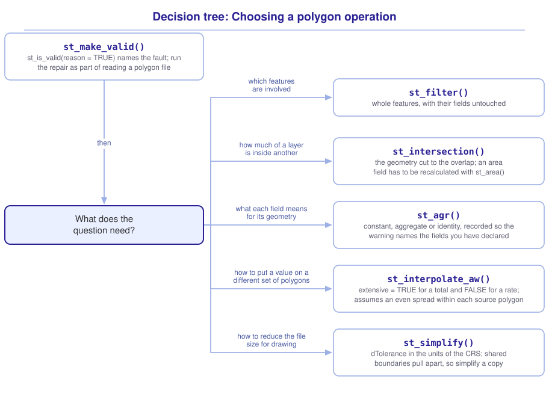

```{r}
#| include: false

library(sf)
library(tidyverse)
library(tmap)
library(webexercises)

source("src/r/course_functions.R")
source("src/r/reference_lookup.R")

lesson_refs <- find_lesson_references()
```

<hr>

<div>
{.intro_image fig-alt="Course logo"}

Measuring how much of one area falls inside another is a common task: the forest inside a park, the wetland inside a county, the habitat inside a proposed development. A **polygon** encloses an area, and its fields describe that geometry. A count of nesting pairs, a population total, or an area of canopy may describe the whole polygon on which it was recorded. After the polygon is cut, those values may no longer describe the geometry that remains. Before reporting a number from a cut layer, we need to decide which fields remain valid.

In this lesson, we will use National Park Service polygons, the District's wooded areas, Rock Creek Park, and the census tracts to repair an invalid geometry, cut one layer to another, move a value between two sets of polygons, and reduce the vertices of a layer. For each operation, we will examine what the returned geometries and fields represent.

In completing this lesson, you will learn how to:

* Test a geometry with `st_is_valid()` and repair it with `st_make_valid()`
* Choose between `st_filter()` and `st_intersection()` for a question about how much of one layer falls inside another
* Determine which fields remain valid after a cut, and record each relationship with `st_agr()`
* Move a value from one set of polygons to another with `st_interpolate_aw()`
* Reduce the vertices of a layer with `st_simplify()`, and identify where shared boundaries no longer match

**Important!** Before starting this tutorial, be sure that you have completed all preliminary and previous lessons!

</div>

## Data for this lesson

<button class="accordion">Explore the metadata for this lesson</button>
::: panel
```{r}
#| echo: false
#| output: asis

lesson_metadata(
  .dataset =
    c(
      "dc_national_parks.geojson",
      "dc_forests.geojson",
      "rock_creek_park.geojson",
      "dc_census.geojson"
    )
) %>%
  cat()
```
:::

## Set up your session

Begin with a clean session:

1. Ensure that your **Global Environment** is empty.
2. In the *History* tab of your **workspace pane**, ensure that your **session history** is empty.

Next:

1. Create a script file.
2. Save your script file as `scripts/focus_on_polygons.R`.
3. Add metadata as a comment on the top of the file.
4. Create a **code section** called "`setup`" after the metadata.
5. Attach *sf*, *tmap*, and the packages that comprise the **core tidyverse**, then load the module 3 source script.

Your script should look something like:

```{r}
#| eval: false

# My code for the focus on polygons tutorial

# setup --------------------------------------------------------

library(sf)
library(tmap)
library(tidyverse)

# Load the source script:

source("scripts/source_script_module_3.R")

# Draw interactive maps:

tmap_mode("view")
```

```{r}
#| include: false

source("scripts/source_script_module_3.R")
tmap_mode("view")
```

Next, create a code section called "`read and pre-process data`". Read every National Park Service polygon in the District, the city's wooded areas, Rock Creek Park, and the census tracts. The first two arrive in geographic coordinates and are transformed to the projected CRS used throughout the course; the other two are already recorded in it:

```{r}
nps <-
  st_read(
    "data/raw/shapefiles/dc_national_parks.geojson",
    quiet = TRUE
  ) %>%
  clean_names() %>%
  select(name) %>%
  st_transform(32618)

forests <-
  st_read(
    "data/raw/shapefiles/dc_forests.geojson",
    quiet = TRUE
  ) %>%
  clean_names() %>%
  select(gis_id, area) %>%
  st_transform(32618)

census <-
  st_read(
    "data/raw/shapefiles/dc_census.geojson",
    quiet = TRUE
  ) %>%
  clean_names() %>%
  select(
    geoid,
    income,
    population
  )
```

Rock Creek Park is represented by four polygons. The questions in this lesson are about the park rather than its pieces, so read it and combine them in one statement:

```{r}
park <-
  st_read(
    "data/raw/shapefiles/rock_creek_park.geojson",
    quiet = TRUE
  ) %>%
  clean_names() %>%
  st_union()
```

## Is this polygon a polygon?

Return the National Park Service polygons that fall inside Rock Creek Park:

```{r}
#| error: true

nps %>%
  st_intersection(park)
```

> TopologyException: side location conflict at 321985.12741633487 4316353.1381151555. This can occur if the input geometry is invalid.

A **valid** polygon follows the topology rules used by the geometry engine. Among other requirements, its rings are closed, its boundaries do not cross in invalid ways, and its holes fall inside the exterior ring. An invalid polygon is still a geometry and may read, print, and draw, but operations that compare interiors and boundaries may fail.

Test each geometry with `st_is_valid()`:

```{r}
nps %>%
  st_is_valid() %>%
  table()
```

One polygon fails the test, which was enough to stop `st_intersection()`. `reason = TRUE` returns a character description for every feature rather than a logical value. Valid features read `Valid Geometry`. Add the description as a column:

```{r}
nps %>%
  mutate(
    validity =
      st_is_valid(geometry, reason = TRUE)
  ) %>%
  st_drop_geometry() %>%
  slice_head(n = 6)
```

Return the invalid polygon:

```{r}
nps %>%
  filter(
    !st_is_valid(geometry)
  )
```

Return its description:

```{r}
nps %>%
  filter(
    !st_is_valid(geometry)
  ) %>%
  st_is_valid(reason = TRUE)
```

The coordinates in that description are the coordinates in the error message. A self-intersection is a boundary that crosses itself, so the geometry does not define an unambiguous interior at that location. The *side location conflict* reports the coordinate where the operation encountered that problem.

Repair the geometry with `st_make_valid()`:

```{r}
nps <-
  nps %>%
  st_make_valid()

nps %>%
  st_is_valid() %>%
  table()
```

Intersect the repaired polygons with the park:

```{r}
parcels_in_park <-
  nps %>%
  st_intersection(park)

nrow(parcels_in_park)
```

::: mysecret
 [Check validity as part of reading a file!]{style="font-size: 1.25em; padding-left: 0.5em;"}

The printed summary of a file does not report whether each geometry is valid. The failure may appear later, during an operation that compares interiors or boundaries, and its error may name a coordinate rather than a feature.

Add the test to your pre-processing:

```{r}
#| eval: false

layer <-
  st_read("some_file.geojson", quiet = TRUE) %>%
  clean_names() %>%
  st_transform(32618) %>%
  st_make_valid()
```

`st_make_valid()` also accepts layers that contain valid geometries, so it can repair a layer containing a mix of valid and invalid features. The returned geometries are topologically valid, although their coordinate representation may change.
:::

::: mysecret
 [Two engines, two answers about the same file]{style="font-size: 1.25em; padding-left: 0.5em;"}

*sf* does its geometric work with two engines. Projected data are handled by GEOS, which treats coordinates as points on a plane. With the default *sf* settings, geographic data are handled by s2, which treats them as points on a sphere. Check whether s2 is in use for geographic data with `sf_use_s2()`:

```{r}
sf_use_s2()
```

The two do not agree about what a valid polygon is. Read the polygons without transforming them, so that they stay in EPSG 4326 and s2 handles them:

```{r}
nps_4326 <-
  st_read(
    "data/raw/shapefiles/dc_national_parks.geojson",
    quiet = TRUE
  ) %>%
  clean_names()

nps_4326 %>%
  st_is_valid() %>%
  table()
```

Six polygons are invalid under s2 rather than one under GEOS, and the reasons differ. For these data, s2 rejects repeated vertices that GEOS accepts. The validity of a file depends on the engine that tests it.

This difference can explain why two workflows disagree about the validity of the same file. Transforming to a projected CRS early, as this course does throughout, places the analysis in GEOS.
:::

::: now_you
 [Check your understanding]{style="padding-left: 0.5em;"}

An `sf` object has 300 rows. `st_is_valid()` returns `TRUE` for 297 of them. What does `st_is_valid(x, reason = TRUE)` return?

`r longmcq(c(answer = "300 character values, one per feature", "3 character values, one per invalid feature", "A single character value naming the file", "300 logical values"))`

True or false: An invalid geometry causes an error when the file is read.

`r torf(FALSE)`
:::

## Subsetting and clipping

How much forest is there inside Rock Creek Park?

`st_filter()` subsets one layer by its position relative to another and keeps whole features (see ***4.1 Spatial filtering: Subsetting features by location***). Return the wooded areas that touch the park:

```{r}
forests_touching <-
  forests %>%
  st_filter(park)

nrow(forests_touching)
```

Sum their areas in hectares:

```{r}
forests_touching %>%
  st_area() %>%
  sum() %>%
  units::set_units("ha")
```

`st_filter()` keeps a patch that crosses the park boundary whole, so the part of that patch outside the park is included in the total.

`st_intersection()` returns the geometry that two objects share, cutting features to the overlap. Cut the wooded areas to the park:

```{r}
forests_in_park <-
  forests %>%
  st_intersection(park)

forests_in_park %>%
  st_area() %>%
  sum() %>%
  units::set_units("ha")
```

This total is thirty-seven hectares smaller, and it is the answer to the question. `st_intersection()` cut each patch at the park boundary, so the difference is the forest that lies outside it.

```{r}
#| fig-alt: "Rock Creek Park outlined in black with the seventeen wooded areas that touch it. The patches are drawn in pale green and the part of each that falls inside the park is drawn in dark green, so the pale margins are the area that subsetting counts and clipping does not."

tm_shape(forests_touching) +
  tm_polygons(fill = "palegreen") +
  tm_shape(forests_in_park) +
  tm_polygons(fill = "darkgreen") +
  tm_shape(park) +
  tm_borders(
    col = "black",
    lwd = 2
  )
```

The two operations answer different questions:

* Use `st_filter()` for which features are involved. The features are returned whole, with their fields unchanged.
* Use `st_intersection()` for how much of one layer falls inside another. The geometry is cut to the overlap, and the fields then have to be checked.

::: {.callout-note}

Recall that `st_filter()` returns rows and adds no fields (see ***4.1 Spatial filtering: Subsetting features by location***). `st_intersection()` returns the fields of both objects and a geometry that is the overlap of the two.

:::

### What the fields mean after a cut

The call to `st_intersection()` returned a warning:

> attribute variables are assumed to be spatially constant throughout all geometries

The forest layer has an `area` field recording the size of each patch. Compare it with the area of the cut geometry:

```{r}
forests_in_park %>%
  mutate(
    area_now =
      as.numeric(
        st_area(geometry)
      )
  ) %>%
  st_drop_geometry() %>%
  slice_head(n = 6)
```

The `area` field still reports the size of the whole patch, while the geometry is now a piece of that patch. Summed over those rows, the field totals 521 hectares against the geometry's 485. `st_intersection()` copies the field onto the piece without recalculating it.

What a cut does to a field's value depends on the kind of field:

* **Constant** over the geometry. Every part of the polygon has the same value as the whole: a land cover class, a management category, a soil type. Cutting the polygon leaves the value correct.
* **Aggregate** over the geometry. The value is a total for the whole polygon: an area, a population, a count of nests. Cutting the polygon makes the value wrong, and no rule recovers the right one from the geometry alone.
* **Identity** for the geometry. The value names this particular feature: a parcel identifier, a tract number. Cutting the polygon leaves a piece that is no longer the feature the name belongs to.

`st_agr()` records which kind each field is:

```{r}
st_agr(forests)
```

The relationships are unset, which is why the warning appears. Declare them with `st_set_agr()`:

```{r}
forests <-
  forests %>%
  st_set_agr(
    c(
      gis_id = "identity",
      area = "aggregate"
    )
  )

st_agr(forests)
```

::: mysecret
 [What st_agr() does, and what it does not do]{style="font-size: 1.25em; padding-left: 0.5em;"}

Setting the attribute-geometry relationship does not change any value. `st_intersection()` copies an aggregate field onto the pieces as before, and the `area` column remains incorrect.

The declaration silences the warning when every field is `"constant"` and leaves it in place otherwise. Declaring `area` as `"aggregate"` therefore keeps the warning, because cutting the geometry makes the stored value incorrect.

Use `st_agr()` to record what you know about your own data, so that the warning names fields that you have declared cannot survive the operation. A declaration does not repair an aggregate field.
:::

::: now_you
 [Now you!]{style="font-size: 1.25em; padding-left: 0.5em;"}

Recalculate the `area` field of `forests_in_park` so that it describes the cut geometry, and report the total in hectares.

*Hint: `st_area()` returns the area of each feature, and `units::set_units()` converts it (see ***3.6 Geometric operations with sf***).*

[Click here to see my answer]{.answer_link data-answer="a-5-3-area"}

::: {.answer_body #a-5-3-area}

```{r}
forests_in_park %>%
  mutate(
    area =
      units::set_units(
        st_area(geometry),
        "ha"
      )
  ) %>%
  summarize(
    total = sum(area)
  ) %>%
  st_drop_geometry()
```

Overwrite `area` rather than adding a column. The old value describes a polygon that is no longer in the object, and keeping both would leave two area columns.

This works because an area can be recalculated from the geometry.

:::
:::

## Moving a value between two sets of polygons

Census data are collected on tracts, habitat data are collected on patches, and their boundaries were created for different purposes.

**Areal interpolation** describes the process of estimating a value for one set of polygons from the values recorded on another, by assuming that the value is spread evenly within each of the source polygons. `st_interpolate_aw()` performs it. We will use the following arguments:

* `x = `: the object that contains the values, subset to the fields to be moved.
* `to = `: the object to estimate values for.
* `extensive = `: whether the field is a total that should be divided among the pieces.

Estimate the population inside Rock Creek Park:

```{r}
park_sf <-
  park %>%
  st_sf()

census %>%
  select(population) %>%
  st_interpolate_aw(
    to = park_sf,
    extensive = TRUE
  )
```

The result estimates about 16,600 residents inside the park.

Each tract's population was spread evenly across its area, and the park received the share assigned to the overlapping area. The calculation uses no information about land cover.

An **extensive** value is a total, and `extensive = TRUE` divides it among the pieces in proportion to their area. An **intensive** value is a rate or an average, and `extensive = FALSE` averages it across the pieces with their areas as the weights.

A median income is not a total, so pass it as an intensive value:

```{r}
census %>%
  filter(
    !is.na(income)
  ) %>%
  select(income) %>%
  st_interpolate_aw(
    to = park_sf,
    extensive = FALSE
  )
```

The result is an area-weighted mean of the tract medians. It is not the median income of the people who live inside the park, which no median of medians can recover. The same call with `extensive = TRUE` returns their sum instead, which is a number with no meaning:

```{r}
census %>%
  filter(
    !is.na(income)
  ) %>%
  select(income) %>%
  st_interpolate_aw(
    to = park_sf,
    extensive = TRUE
  )
```

::: mysecret
 [Interpolation is an estimate based on a strong assumption!]{style="font-size: 1.25em; padding-left: 0.5em;"}

`st_interpolate_aw()` assumes that the value is spread evenly inside each source polygon. Population, deer, and nitrogen are not spread evenly inside a census tract, a management unit, or a field.

Use areal interpolation when the target data are unavailable and the assumption is reasonable at the scale of the question. Report the result as an estimate and name the assumption:

* Interpolate onto the coarsest polygons the question allows. Fine-scale estimates imply spatial precision that the source data do not contain.
* Say in the methods that the value was areally interpolated, and from what.
:::

::: now_you
 [Check your understanding]{style="padding-left: 0.5em;"}

Which of these fields would be interpolated with `extensive = TRUE`?

`r longmcq(c(answer = "The number of households in a tract", "The median age of a tract", "The percentage of a tract covered by canopy", "The dominant land cover class of a tract"))`

True or false: `st_interpolate_aw()` returns a value that the source data recorded for the target polygons.

`r torf(FALSE)`
:::

## Fewer vertices

Count the vertices in the census tracts:

```{r}
count_vertices(census)
```

A tract boundary drawn for a map of the whole District needs a fraction of those vertices. A web page that loads the layer downloads all of them.

`st_simplify()` approximates a geometry with fewer vertices. Simplify the tracts:

```{r}
census_simple <-
  census %>%
  st_simplify(dTolerance = 100)

count_vertices(census_simple)
```

`dTolerance = ` is read in the units of the CRS, which for these tracts is meters.

Each polygon is simplified independently of the polygons beside it, so a boundary that two tracts shared is redrawn twice and the two redrawings need not match.

We can give `st_intersection()` one object rather than two. The call then breaks that object into its distinct regions and returns a column called `n.overlaps`, containing the number of original features that cover each region. A region covered by more than one tract is a place where two simplified boundaries disagree. Return those regions:

```{r}
overlaps <-
  census_simple %>%
  st_intersection() %>%
  filter(n.overlaps > 1)

nrow(overlaps)
```

Sum their areas:

```{r}
overlaps %>%
  st_area() %>%
  sum() %>%
  units::set_units("ha")
```

Where the redrawings pulled apart instead of overlapping, they leave gaps rather than overlaps, and this test does not count those.

`st_simplify()` takes a `preserveTopology = ` argument. Repeat the test with it set to `TRUE`:

```{r}
census %>%
  st_simplify(
    dTolerance = 100,
    preserveTopology = TRUE
  ) %>%
  st_intersection() %>%
  filter(n.overlaps > 1) %>%
  nrow()
```

`preserveTopology = TRUE` protects each geometry from destroying itself. The *sf* documentation states that *"topology is preserved only for single feature geometries, not for sets of them."* The argument does not apply to the relationship between polygons.

::: mysecret
 [Simplify for drawing, not for measuring!]{style="font-size: 1.25em; padding-left: 0.5em;"}

A simplified layer can have a different area, different neighbors, and different overlaps from the original. Anything measured on it is measured on a geometry that was simplified for drawing or storage.

Simplify a copy at the end of the workflow, for the map or the web page that needs it, and keep the full-resolution layer for the calculations. Where boundaries are shared, as in tracts, watersheds, and management units, the *rmapshaper* package simplifies the shared boundaries once rather than each polygon separately, with `ms_simplify()`.
:::

## Putting it all together

The operations in this lesson answer different questions about the same layer. My own model for choosing between them looks like this (click to expand):

{.zoomable data-title="Decision tree: Choosing a polygon operation" data-pdf-key="working_with_polygons" fig-alt="To choose a polygon operation, first repair the layer with st_make_valid(), using st_is_valid() with reason equal to TRUE to name the fault, and run the repair as part of reading a polygon file. Then ask what the question needs. For which features are involved, st_filter() returns whole features with their fields untouched. For how much of a layer falls inside another, st_intersection() returns the geometry cut to the overlap, and an area field then has to be recalculated with st_area(). For what each field means for its geometry, st_agr() records constant, aggregate or identity, so that the warning names fields you have declared. For a value on a different set of polygons, st_interpolate_aw() takes extensive equal to TRUE for a total and FALSE for a rate, and assumes an even spread within each source polygon. For fewer vertices for drawing, st_simplify() takes dTolerance in the units of the CRS, and shared boundaries pull apart, so simplify a copy."}



::: {.callout-note}

This tree shows *my* mental model for these functions. Your model may differ. What matters is that it helps you retrieve the functions needed to solve a problem.

:::

## Take-home points

* An invalid geometry may read and draw without complaint, then fail during an operation that compares interiors or boundaries. `st_is_valid(reason = TRUE)` names the problem, and `st_make_valid()` returns topologically valid geometry.
* Projected data are handled by GEOS. With the default *sf* settings, geographic data are handled by s2, and the engines can disagree about validity. Transforming early places the analysis in GEOS.
* `st_filter()` keeps whole features. `st_intersection()` cuts them to the overlap. A question about how much is inside needs the second; the first overstates the amount.
* A field is constant, aggregate, or identity with respect to its geometry, and `st_agr()` records that relationship. A cut leaves a constant field correct and an aggregate field wrong. An area can be recalculated with `st_area()`, while a count cannot be recovered from geometry alone.
* `st_interpolate_aw()` estimates a value for a new set of polygons by assuming it is spread evenly within each source polygon. `extensive = TRUE` divides a total. `extensive = FALSE` averages a rate.
* `st_simplify()` treats each polygon separately, so shared boundaries can pull apart into gaps and overlaps. `preserveTopology = TRUE` protects each geometry from itself and does not repair the relationship between them.

## Exercises

::: now_you
 [Test your knowledge!]{style="font-size: 1.25em; padding-left: 0.5em;"}

1. A wetland layer overlaps a reserve polygon. Which statement returns the area of wetland inside the reserve?

`r longmcq(c(answer = "wetland %>% st_intersection(reserve) %>% st_area() %>% sum()", "wetland %>% st_filter(reserve) %>% st_area() %>% sum()", "wetland %>% st_join(reserve) %>% st_area() %>% sum()", "reserve %>% st_area() %>% sum()"))`

2. A land cover layer has a `class` field and a `hectares` field. Which statement describes them correctly?

`r longmcq(c(answer = "class is constant and hectares is aggregate", "Both are constant", "Both are aggregate", "class is identity and hectares is constant"))`

3. A call to `st_intersection()` returns an error naming a coordinate and a side location conflict. What should be checked first?

`r longmcq(c(answer = "Whether either object holds an invalid geometry", "Whether the two objects share a CRS", "Whether either object holds an empty geometry", "Whether the coordinate falls outside the extent of the data"))`

4. Parsons problem: Reorder the lines to return the area of forest inside Rock Creek Park, in hectares, from a layer that may contain an invalid geometry. Place the line that would return the area of whole patches in the trash.

<div class="parsons-problem">
<div id="p-5-3-01-trash" class="sortable-code"></div>
<div id="p-5-3-01-sortable" class="sortable-code"></div>
<div style="clear: both;"></div>
<button id="p-5-3-01-check" class="parsons-btn parsons-btn-check" type="button">Check My Order</button>
<button id="p-5-3-01-reset" class="parsons-btn parsons-btn-reset" type="button">Shuffle Again</button>
<p id="p-5-3-01-feedback" class="parsons-feedback"></p>
</div>

<script>
window.parsonsProblems = window.parsonsProblems || []; window.parsonsProblems.push({ id: "p-5-3-01", maxDistractors: 1, code: "forests %>%\n  st_make_valid() %>%\n  st_filter(park) %>% #distractor\n  st_intersection(park) %>%\n  st_area() %>%\n  sum() %>%\n  units::set_units(\"ha\")" });
</script>

5. True or false: After the census tracts were simplified with `st_simplify()`, neighboring tracts still shared their boundaries.

`r torf(FALSE)`
:::


