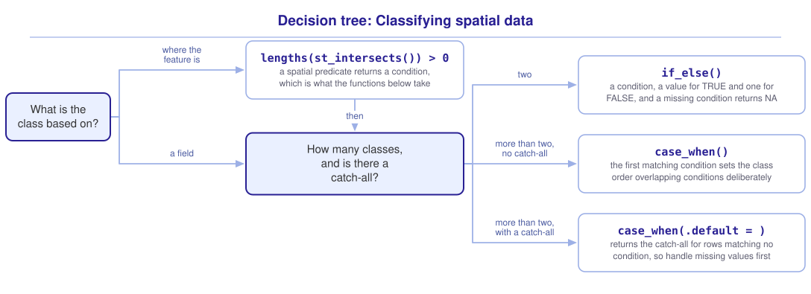

```{r}
#| include: false

library(sf)
library(tidyverse)
library(tmap)
library(webexercises)

source("src/r/course_functions.R")
source("src/r/reference_lookup.R")

lesson_refs <- find_lesson_references()
```

<hr>

<div>
{.intro_image fig-alt="Course logo"}

A conservation report often presents measurements as classes: high-quality and low-quality habitat, priority watersheds and the rest, or tracts with and without tree canopy. Those classes can guide management decisions, so the rule used to create them matters.

To **classify** a variable is to assign its values to a smaller set of labels according to a rule. A classified map omits the differences within each class. The reader cannot see where the class boundaries were drawn unless we report them.

In this lesson, we will use the District's census tracts and Rock Creek Park to create classes with `if_else()` and `case_when()`. For each operation, we will examine how missing values, overlapping conditions, and class boundaries affect the result.

In completing this lesson, you will learn how to:

* Use `if_else()` to classify a field into two classes, and determine what it returns for a row with a missing value
* Use `case_when()` to classify into more than two classes, and order overlapping conditions deliberately
* Determine whether `.default = ` should be used when a field has missing values
* Derive a class from a feature's location rather than from its fields
* State the rule that draws a class boundary in the legend or caption

**Important!** Before starting this tutorial, be sure that you have completed all preliminary and previous lessons!

</div>

## Data for this lesson

<button class="accordion">Explore the metadata for this lesson</button>
::: panel
```{r}
#| echo: false
#| output: asis

lesson_metadata(
  .dataset = c("dc_census.geojson", "rock_creek_park.geojson")
) %>%
  cat()
```
:::

## Set up your session

Begin with a clean session:

1. Ensure that your **Global Environment** is empty.
2. In the *History* tab of your **workspace pane**, ensure that your **session history** is empty.

Next:

1. Create a script file.
2. Save your script file as `scripts/categorizing_spatial_data.R`.
3. Add metadata as a comment on the top of the file.
4. Create a **code section** called "`setup`" after the metadata.
5. Attach *sf*, *tmap*, and the packages that comprise the **core tidyverse**, then load the module 3 source script.

Your script should look something like:

```{r}
#| eval: false

# My code for the categorizing spatial data tutorial

# setup --------------------------------------------------------

library(sf)
library(tmap)
library(tidyverse)

# Load the source script:

source("scripts/source_script_module_3.R")

# Draw interactive maps:

tmap_mode("view")
```

```{r}
#| include: false

source("scripts/source_script_module_3.R")
tmap_mode("view")
```

Next, create a code section called "`read and pre-process data`":

```{r}
census <-
  st_read(
    "data/raw/shapefiles/dc_census.geojson",
    quiet = TRUE
  ) %>%
  clean_names() %>%
  select(
    geoid,
    income,
    population
  )

parks <-
  st_read(
    "data/raw/shapefiles/rock_creek_park.geojson",
    quiet = TRUE
  ) %>%
  clean_names()
```

`income` is the median household income of each census tract, in dollars. Summarize the column:

```{r}
census %>%
  pull(income) %>%
  summary()
```

Three tracts have no income recorded, and the values that are recorded span an order of magnitude.

## Two classes

`if_else()` returns one value where a condition is `TRUE` and another where it is `FALSE`. We supply the following arguments:

* `condition = `: a logical test, evaluated for every row.
* `true = `: the value returned where the test holds.
* `false = `: the value returned where it does not.

Classify the tracts by income and count each class:

```{r}
census <-
  census %>%
  mutate(
    income_class =
      if_else(
        income > 100000,
        "high",
        "not high"
      )
  )

census %>%
  st_drop_geometry() %>%
  count(income_class)
```

`if_else()` evaluates its condition for every row. Where `income` is `NA`, `income > 100000` returns `NA` rather than `TRUE` or `FALSE`, so those tracts receive no class.

A feature with an `NA` class is drawn in the color assigned to missing values, and a reader may interpret it as a third class. Map the classified tracts:

```{r}
#| fig-alt: "The District's census tracts colored by income class, with three tracts drawn in the missing-value color because no median income was recorded for them."

tm_shape(census) +
  tm_polygons(
    fill = "income_class",
    fill.legend =
      tm_legend(title = "Median income")
  )
```

::: mysecret
 [Decide what a missing value means before you classify!]{style="font-size: 1.25em; padding-left: 0.5em;"}

An `NA` in a classified column can mean two different things, and the column does not distinguish between them:

* The value was never recorded. The tract has a median income, but the file does not contain it.
* The class does not apply. A tract with no households has no median income to record.

Show the missing values on the map, and name what they represent in the legend.
:::

::: now_you
 [Check your understanding]{style="padding-left: 0.5em;"}

`if_else(x > 10, "big", "small")` is called on a vector containing `4`, `NA` and `20`. What does it return?

`r longmcq(c(answer = '"small", NA, "big"', '"small", "small", "big"', 'An error naming the missing value', '"small", "big"'))`

True or false: A tract whose class is `NA` is left off a map drawn with `tm_polygons()`.

`r torf(FALSE)`
:::

## More than two classes

`case_when()` takes a sequence of two-sided formulas. The left side of each is a condition and the right side is the value returned where it holds. Classify the tracts into three income classes:

```{r}
census <-
  census %>%
  mutate(
    income_group =
      case_when(
        income < 50000 ~ "lower",
        income < 100000 ~ "middle",
        income >= 100000 ~ "upper"
      )
  )

census %>%
  st_drop_geometry() %>%
  count(income_group)
```

### The result depends on the order of the conditions

`case_when()` evaluates its conditions in the order they are written and returns the value of the *first* one that holds.

Reverse the first two conditions:

```{r}
census %>%
  mutate(
    wrong_group =
      case_when(
        income < 100000 ~ "middle",
        income < 50000 ~ "lower",
        income >= 100000 ~ "upper"
      )
  ) %>%
  st_drop_geometry() %>%
  count(wrong_group)
```

The `"lower"` class is empty. Every tract below fifty thousand dollars is also below one hundred thousand, so those tracts match the first condition and are labeled `"middle"`.

`case_when()` runs without a warning when a condition matches no rows. For nested thresholds like these, write the narrower condition before the wider condition. More generally, order overlapping conditions deliberately, then count the classes and check for an unexpected empty class.

### What `.default = ` does to a missing value

`case_when()` returns `NA` for a row that satisfies none of its conditions. `.default = ` supplies a value for those rows. Use it in place of the third condition:

```{r}
census %>%
  mutate(
    income_group =
      case_when(
        income < 50000 ~ "lower",
        income < 100000 ~ "middle",
        .default = "upper"
      )
  ) %>%
  st_drop_geometry() %>%
  count(income_group)
```

The upper class now contains every row that matched neither condition, because that is what `.default = ` returns.

A tract with no recorded income satisfies neither condition, so it receives `.default` along with the tracts above one hundred thousand dollars. Missing income has now been classified as high income.

::: mysecret
 [.default is not "everything else"]{style="font-size: 1.25em; padding-left: 0.5em;"}

`.default = ` is the value for every row that no condition matched, and a row whose value is missing matches no condition.

Where a classification has a genuine catch-all class, write the condition out rather than relying on `.default`, and let the missing values stay missing:

```{r}
#| eval: false

case_when(
  income < 50000 ~ "lower",
  income < 100000 ~ "middle",
  income >= 100000 ~ "upper"
)
```

Where you do want a catch-all, handle the missing values first so they cannot reach it:

```{r}
#| eval: false

case_when(
  is.na(income) ~ "not recorded",
  income < 50000 ~ "lower",
  income < 100000 ~ "middle",
  .default = "upper"
)
```
:::

::: now_you
 [Now you!]{style="font-size: 1.25em; padding-left: 0.5em;"}

Classify the tracts by population into "sparse" below 2,000 people, "moderate" below 5,000, and "dense" at 5,000 and above, and count the tracts in each class.

*Hint: For these nested thresholds, write the narrower condition first, and check what `summary()` says about missing values before you decide whether you need a class for them.*

[Click here to see my answer]{.answer_link data-answer="a-5-4-case"}

::: {.answer_body #a-5-4-case}

```{r}
census %>%
  mutate(
    density_class =
      case_when(
        population < 2000 ~ "sparse",
        population < 5000 ~ "moderate",
        population >= 5000 ~ "dense"
      )
  ) %>%
  st_drop_geometry() %>%
  count(density_class)
```

Writing the third condition out rather than using `.default = "dense"` returns the same answer here because `population` has no missing values. I prefer the explicit condition because a reader can see what the class means and a later missing value will remain missing.

:::
:::

## A class that comes from location

The previous classifications used fields. We can also classify a feature according to its spatial relationship with another object.

A spatial predicate can also be used to create a class (see ***4.1 Spatial filtering: Subsetting features by location***). `st_intersects()` identifies which park polygons intersect each tract, and `lengths()` counts those matches. Comparing the count with zero returns the condition needed by `if_else()`. Classify the tracts by whether they intersect the park:

```{r}
census <-
  census %>%
  mutate(
    park_access =
      if_else(
        lengths(
          st_intersects(geometry, parks)
        ) > 0,
        "on the park",
        "away from the park"
      )
  )

census %>%
  st_drop_geometry() %>%
  count(park_access)
```

The class is a column like any other. Summarize the tracts by park access. Add `na.rm = TRUE` so that tracts with no recorded income do not return a missing median:

```{r}
census %>%
  st_drop_geometry() %>%
  summarize(
    median_income =
      median(income, na.rm = TRUE),
    tracts = n(),
    .by = park_access
  )
```

The tracts on the park have a median household income half again as high as the tracts away from it.

::: {.callout-note}

In ***4.1 Spatial filtering: Subsetting features by location*** we supplied `st_intersects` to `st_filter()`, which used the predicate to select features. Called on its own, `st_intersects()` returns a sparse list instead: an element for each feature of the first object, holding the row positions of the features it matched, and an empty element where it matched nothing. `lengths()` returns the number of matches for each feature. Comparing that count with zero returns the logical vector `if_else()` needs.

:::

::: now_you
 [Check your understanding]{style="padding-left: 0.5em;"}

Which expression returns a logical vector suitable for `if_else()`?

`r longmcq(c(answer = "lengths(st_intersects(census, parks)) > 0", "st_intersects(census, parks)", "st_filter(census, parks)", "st_intersects(census, parks) > 0"))`

True or false: A class derived from a spatial predicate is stored differently from a class derived from a field.

`r torf(FALSE)`
:::

## Where the class boundaries come from

Classify the tracts at the median of the recorded incomes instead:

```{r}
census %>%
  st_drop_geometry() %>%
  count(
    at_median =
      if_else(
        income > median(income, na.rm = TRUE),
        "high",
        "not high"
      )
  )
```

Changing the one number in the call moves most of the city across the boundary, and leaves the tracts with no recorded income where they were.

Map both classifications:

```{r}
#| fig-alt: "The District's census tracts classified at one hundred thousand dollars. The high-income tracts form a small area in the northwest of the city."

tm_shape(census) +
  tm_polygons(
    fill = "income_class",
    fill.legend =
      tm_legend(title = "Above $100,000")
  )
```

```{r}
#| fig-alt: "The District's census tracts classified at the median income, with about half the city highlighted."

census %>%
  mutate(
    at_median =
      if_else(
        income > median(income, na.rm = TRUE),
        "high",
        "not high"
      )
  ) %>%
  tm_shape() +
  tm_polygons(
    fill = "at_median",
    fill.legend =
      tm_legend(title = "Above the median")
  )
```

Both thresholds are defensible. Neither rule is visible on the map, and a reader who sees only one map cannot reconstruct the other classification.

The rule that draws the boundary is a decision, wherever it is written. Here it is a number in `case_when()`. In *tmap*, it is the `style = ` argument of `tm_scale_intervals()` (see ***4.5 Cartography with ggplot2 and tmap***). The choice can substantially change the pattern shown, so it belongs in the legend or caption.

::: mysecret
 [State the rule wherever the map goes!]{style="font-size: 1.25em; padding-left: 0.5em;"}

A classified map is often separated from the script that produced it. Put the rule where it cannot be separated from the map:

* Name the threshold or classification method in the legend title or caption, such as *Above $100,000* or *Quantiles of median income*.
* Say how many classes there are and let the legend show their boundaries, rather than labeling them *low*, *medium*, and *high* alone.
* Where a threshold comes from a standard or a regulation, cite it. Where it comes from you, say that too.

Ask whether a reader who disagrees with your threshold could determine what the map would show with another threshold. If not, the map does not provide enough information to evaluate the analytical choice.
:::

## Putting it all together

Choosing how to classify starts with what kind of rule the class is. My own model for that looks like this (click to expand):

{.zoomable data-title="Decision tree: Classifying spatial data" data-pdf-key="classifying_spatial_data" fig-alt="To classify spatial data, first ask what the class is based on. A class based on location starts from lengths() of st_intersects() greater than zero, which returns a condition. A class based on a field goes directly to the next question: how many classes are needed, and is there a catch-all? For two classes, if_else() takes a condition, a value for TRUE, and a value for FALSE. A missing condition returns NA. For more than two classes, case_when() returns the value of the first condition that holds, so overlapping conditions must be ordered deliberately. With .default, every row that matched no condition receives the catch-all value, including rows with missing values unless those are handled first."}



::: {.callout-note}

This tree shows *my* mental model for these functions. Your model may differ. What matters is that it helps you retrieve the functions needed to solve a problem.

:::

## Take-home points

* `if_else()` returns a value for `TRUE` and another for `FALSE`, and `NA` for a row whose condition could not be evaluated. A comparison with a missing value is a missing answer.
* A feature whose class is `NA` is drawn in the missing-value color, which a reader may interpret as a class. Label it or handle it.
* `case_when()` returns the value of the first condition that holds. Order overlapping conditions deliberately. For nested thresholds, place the narrower condition first.
* `.default = ` collects the rows that matched no condition, and a row with a missing value matches no condition. Handle missing values explicitly before a catch-all.
* A spatial predicate returns a condition like any other, so a class can be derived from where a feature is rather than from what its fields say.
* The boundary between two classes can substantially change the pattern shown, and the map does not display the rule by itself. Name the rule in the legend or caption.

## Exercises

::: now_you
 [Test your knowledge!]{style="font-size: 1.25em; padding-left: 0.5em;"}

1. A `case_when()` runs `area > 10 ~ "large"` before `area > 100 ~ "very large"`. What does the second condition classify?

`r longmcq(c(answer = "Nothing, because every value it would match was already matched", "Only the features between 10 and 100", "Only the features above 100", "The features above 100, replacing their earlier class"))`

2. A map is drawn from a column that contains `NA` values. What does the map show?

`r longmcq(c(answer = "Every feature, with the NA features in the missing-value color", "Only the features with a class", "Every feature, with the NA features in the color of the first class", "Nothing, because the column cannot be mapped"))`

3. A published map classifies habitat patches as "core" and "edge" at a chosen threshold. A reviewer asks how sensitive the classes are to that threshold. What does the map tell them?

`r longmcq(c(answer = "Nothing, unless the threshold is stated in the legend or the caption", "The threshold, because it is implied by the class boundaries", "The threshold, because the legend lists the class names", "The full distribution, because the classes are drawn from it"))`

4. Parsons problem: Reorder the lines to classify the tracts into three income classes, leaving a tract with no recorded income unclassified. Place the line that supplies a catch-all in the trash.

<div class="parsons-problem">
<div id="p-5-4-01-trash" class="sortable-code"></div>
<div id="p-5-4-01-sortable" class="sortable-code"></div>
<div style="clear: both;"></div>
<button id="p-5-4-01-check" class="parsons-btn parsons-btn-check" type="button">Check My Order</button>
<button id="p-5-4-01-reset" class="parsons-btn parsons-btn-reset" type="button">Shuffle Again</button>
<p id="p-5-4-01-feedback" class="parsons-feedback"></p>
</div>

<script>
window.parsonsProblems = window.parsonsProblems || []; window.parsonsProblems.push({ id: "p-5-4-01", maxDistractors: 1, code: "census %>%\n  mutate(\n    income_group =\n      case_when(\n        income < 50000 ~ \"lower\",\n        income < 100000 ~ \"middle\",\n        .default = \"upper\" #distractor\n        income >= 100000 ~ \"upper\"\n      )\n  )" });
</script>

5. True or false: A reader who is shown one classified map, and is not told the threshold, can determine what the map would show under a different threshold.

`r torf(FALSE)`
:::


