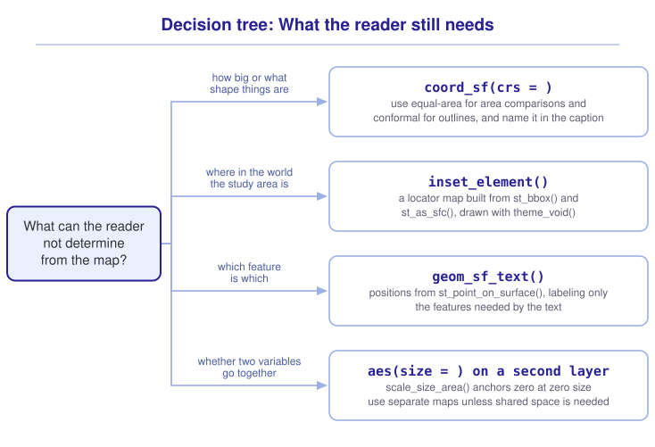

```{r}
#| include: false

library(sf)
library(spData)
library(patchwork)
library(tidyverse)
library(tmap)
library(webexercises)

source("src/r/course_functions.R")
source("src/r/reference_lookup.R")

lesson_refs <- find_lesson_references()
```

<hr>

<div>
{.intro_image fig-alt="Course logo"}

A map of a study area should provide enough context for a reader to locate it, judge its scale, and identify the features discussed in the text.

We have already chosen what to draw and how to encode a value (see ***4.5 Cartography with ggplot2 and tmap***). In this lesson, we will use buffalo tracks from Kruger National Park, Rock Creek Park, and the District's census tracts to set a projection, add a locator map, place labels, and draw two variables on one map.

In completing this lesson, you will learn how to:

* Set the projection of a map to suit the comparison the reader will make
* Add a locator map that places a study area in a wider region
* Add a north arrow and a scale bar, and judge when a map needs each
* Place labels so that each one falls on the feature it names
* Show two variables on one map, and determine when two maps serve the reader better

*This lesson is optional, and it follows ***4.5 Cartography with ggplot2 and tmap***, which is also optional. Nothing required later in the course depends on either.*

**Important!** Before starting this tutorial, be sure that you have completed all preliminary and previous lessons!

</div>

## Data for this lesson

<button class="accordion">Explore the metadata for this lesson</button>
::: panel
```{r}
#| echo: false
#| output: asis

lesson_metadata(
  .dataset =
    c(
      "kruger_buffalo.csv",
      "rock_creek_park.geojson",
      "dc_census.geojson"
    )
) %>%
  cat()
```

We will also use the `world` dataset from the *spData* package, a layer of country boundaries in EPSG 4326.
:::

## Set up your session

Begin with a clean session:

1. Ensure that your **Global Environment** is empty.
2. In the *History* tab of your **workspace pane**, ensure that your **session history** is empty.

Next:

1. Create a script file.
2. Save your script file as `scripts/cartography_ii.R`.
3. Add metadata as a comment on the top of the file.
4. Create a **code section** called "`setup`" after the metadata.
5. Attach *sf*, *spData*, *patchwork*, *tmap*, and the packages that comprise the **core tidyverse**, then load the module 3 source script.

Your script should look something like:

```{r}
#| eval: false

# My code for the cartography II tutorial

# setup --------------------------------------------------------

library(sf)
library(spData)
library(patchwork)
library(tmap)
library(tidyverse)

# Load the source script:

source("scripts/source_script_module_3.R")
```

```{r}
#| include: false

source("scripts/source_script_module_3.R")
```

*Note: We stay in `tmap_mode("plot")`, the default, throughout this lesson. These techniques apply to a map that will be printed or embedded in a report. An interactive map answers most of these questions by letting the reader pan and zoom.*

Next, create a code section called "`read and pre-process data`". Read the buffalo locations, Rock Creek Park, and the District's census tracts:

```{r}
buffalo <-
  read_csv(
    "data/raw/kruger_buffalo.csv",
    show_col_types = FALSE
  ) %>%
  st_as_sf(
    coords = c("longitude", "latitude"),
    crs = 4326
  )

parks <-
  st_read(
    "data/raw/shapefiles/rock_creek_park.geojson",
    quiet = TRUE
  ) %>%
  clean_names()

census <-
  st_read(
    "data/raw/shapefiles/dc_census.geojson",
    quiet = TRUE
  ) %>%
  clean_names() %>%
  select(
    geoid,
    income,
    population
  )
```

The country boundaries come from *spData*. Subset them to Africa:

```{r}
africa <-
  world %>%
  filter(continent == "Africa")
```

## The projection is a design decision

We previously chose a CRS so that a calculation would return the correct value (see ***3.4 The coordinate reference system: Why it matters and how to use it***). The CRS also determines the shape of the features drawn on a map.

`coord_sf()` sets the CRS used to draw a *ggplot2* map without changing the data. Draw Africa in three coordinate reference systems:

```{r}
#| fig-width: 11
#| fig-height: 4.5
#| fig-alt: "Three maps of Africa side by side. In EPSG 4326 the north and south of the continent are stretched east to west while the equatorial band is drawn true. In EPSG 3857 the north and south ends are stretched away from the equator in both directions. In the Africa Albers projection the meridians converge and the continent narrows toward the poles."

plain <-
  ggplot(africa) +
  geom_sf() +
  coord_sf(crs = 4326) +
  labs(title = "EPSG 4326") +
  theme_void()

mercator <-
  ggplot(africa) +
  geom_sf() +
  coord_sf(crs = 3857) +
  labs(title = "EPSG 3857, Web Mercator") +
  theme_void()

albers <-
  ggplot(africa) +
  geom_sf() +
  coord_sf(crs = "ESRI:102022") +
  labs(title = "Africa Albers Equal Area") +
  theme_void()

plain + mercator + albers
```

The same continent takes a different shape in each map, because `coord_sf()` drew each one in the CRS named by its `crs = ` argument.

EPSG 4326 plots longitude against latitude as though they were the same unit. Near the equator, a degree of each runs to about 111 km. Away from the equator a degree of longitude shrinks while a degree of latitude does not, so at 35 degrees a degree of longitude is 91 km against 111 km. Drawing the two at the same size stretches the map sideways by a fifth. The equatorial band is drawn approximately true, and the north and south of the continent are stretched east to west.

EPSG 3857, Web Mercator, is the CRS that web basemap tiles are served in. It holds the shape of small features close to true, and stretches areas away from the equator. On a continental map, that stretch is visible.

ESRI:102022, Africa Albers Equal Area, preserves area. A map of habitat, range, or protected area needs that property.

::: mysecret
 [Match the projection to the claim the map makes!]{style="font-size: 1.25em; padding-left: 0.5em;"}

A projection cannot preserve area, shape, distance, and direction at once. Choose the property the reader needs:

* Use an equal-area projection to compare the sizes of ranges, protected areas, or habitat classes.
* Use a conformal projection, which preserves local shape, for the outlines of small features.
* Use Web Mercator for a map going onto a web basemap, because the tiles are drawn in it. Web Mercator is close to conformal over a small area but is not a conformal projection, and it stretches area away from the equator.
* Use an appropriate UTM zone for a compact study area, where local distortion is small, as this course does for the District.

The projection is not visible on the map, so name it in the caption alongside the data source.
:::

::: {.callout-note}

*tmap* takes the same decision through `tm_shape()`, whose `crs = ` argument sets the CRS the layer is drawn in.

:::

::: now_you
 [Check your understanding]{style="padding-left: 0.5em;"}

A map compares the area of two national parks at different latitudes. Which projection should the map use?

`r longmcq(c(answer = "An equal-area projection", "Web Mercator, so it matches the basemap", "EPSG 4326, because it is unprojected", "Whichever projection the source file arrived in"))`

True or false: `coord_sf(crs = 3857)` transforms the data in the object it was given.

`r torf(FALSE)`
:::

## Saying where in the world this is

A map of the buffalo tracks shows a shape a reader cannot place. Kruger National Park is on the border of South Africa and Mozambique, and nothing on a map of the study area alone says so.

A **locator map** is a small second map, drawn at a wider extent, with the study area marked on it.

The marker is the study area's bounding box. `st_bbox()` returns the coordinates of the smallest rectangle containing every feature, and `st_as_sfc()` constructs the polygon they describe (see ***5.1 Focus on points: Occurrence records and sampling***).

```{r}
study_area <-
  buffalo %>%
  st_bbox() %>%
  st_as_sfc()
```

```{r}
#| echo: false

study_area
```

The locator map is an ordinary *ggplot2* map. Build it with `theme_void()`, which removes the axes, graticule, and background so that it does not compete with the main map:

```{r}
#| fig-width: 3
#| fig-height: 3
#| fig-alt: "A small map of Africa in pale grey with a red rectangle marking the study area on the eastern side of South Africa."

locator <-
  ggplot() +
  geom_sf(
    data = africa,
    fill = "grey90",
    color = "white"
  ) +
  geom_sf(
    data = study_area,
    fill = NA,
    color = "red",
    linewidth = 0.7
  ) +
  theme_void()
```

```{r}
#| echo: false

locator
```

Build the main map. The study area is tall and narrow, so the default longitude labels overlap. Use `scale_x_continuous()` with `breaks = ` to choose the labeled values:

```{r}
#| fig-width: 5
#| fig-height: 7
#| fig-alt: "The GPS fixes of six African buffalo in Kruger National Park, drawn as small transparent points that form two clusters, one in the north of the study area and one in the south."

tracks <-
  ggplot() +
  geom_sf(
    data = buffalo,
    size = 0.2,
    alpha = 0.2
  ) +
  scale_x_continuous(
    breaks = c(31.7, 31.9)
  ) +
  theme_bw()
```

```{r}
#| echo: false

tracks
```

*patchwork* places one plot inside another with `inset_element()`. Its `left = `, `bottom = `, `right = `, and `top = ` arguments give the edges of the inset as proportions of the enclosing panel. Place the locator inside the main map:

```{r}
#| fig-width: 5
#| fig-height: 7
#| fig-alt: "The buffalo fixes with a small locator map of Africa placed in the top right corner, the red rectangle on it showing where the study area sits."

tracks +
  inset_element(
    locator,
    left = 0.55,
    bottom = 0.78,
    right = 1,
    top = 1
  )
```

::: mysecret
 [What a locator map needs]{style="font-size: 1.25em; padding-left: 0.5em;"}

* Keep the locator visually subordinate to the main map. Use pale fills, and remove the graticule and axis text with `theme_void()`.
* Mark the study area with a symbol or a buffered box rather than with its true outline. A study area of a few kilometers is a dot at continental extent.
* Place the locator where it obscures the least important information. Examine the main map before choosing the corner.

*tmap* draws an inset with `tm_inset()`, which takes the second map as its first argument.
:::

::: now_you
 [Now you!]{style="font-size: 1.25em; padding-left: 0.5em;"}

Build a locator map for Rock Creek Park that shows the park's position inside the District's census tracts.

*Hint: The bounding box of the park is the study area, and the tracts are the wider extent.*

[Click here to see my answer]{.answer_link data-answer="a-5-5-locator"}

::: {.answer_body #a-5-5-locator}

```{r}
#| fig-width: 4
#| fig-height: 4
#| fig-alt: "A pale grey outline of the District of Columbia with a red rectangle marking the extent of Rock Creek Park down the middle of the city."

park_box <-
  parks %>%
  st_bbox() %>%
  st_as_sfc()

ggplot() +
  geom_sf(
    data = census,
    fill = "grey90",
    color = "white"
  ) +
  geom_sf(
    data = park_box,
    fill = NA,
    color = "red",
    linewidth = 0.7
  ) +
  theme_void()
```

Drawing the tracts with a white border rather than no border keeps the shape of the city legible without visually emphasizing a single tract. A locator map is read for its outline, so unnecessary internal detail reduces its clarity.

:::
:::

## Orientation and scale

A locator map says where the study area is. It does not say which way the map is turned, or how far it is across. ***4.5 Cartography with ggplot2 and tmap*** introduced `tm_compass()` for the first and `tm_scalebar()` for the second. Add both to a map of the park:

```{r}
#| fig-alt: "The four polygons representing Rock Creek Park in green, with a north arrow in the top right corner and a scale bar in the bottom left."

tm_shape(parks) +
  tm_polygons(
    fill = "darkgreen",
    fill_alpha = 0.3
  ) +
  tm_compass(
    type = "arrow",
    position = c("right", "top")
  ) +
  tm_scalebar(position = c("left", "bottom"))
```

A north arrow answers a question the reader has only sometimes. A map drawn north up, with coordinates along its edges, has already answered it. Add the arrow where the map is rotated, where the projection turns the meridians away from vertical, or where the frame carries no coordinates.

A scale bar states a distance that is true at one place on the map. Every projection distorts distance somewhere, so a bar is honest over a frame small enough that the distortion across it is negligible, and misleading across a continent.

::: {.callout-note}

An interactive map supplies its own scale bar and its own orientation, because the reader can zoom and the basemap carries place names. `tm_compass()` and `tm_scalebar()` are for the static map that goes into a report.

:::

## Labeling the features

Direct labels can make a map easier to read than a legend when only a few polygons are shown. A label needs a position inside the polygon it names (see ***5.1 Focus on points: Occurrence records and sampling***). One point on the surface of each park polygon:

```{r}
parks %>%
  st_point_on_surface()
```

`geom_sf_text()` draws the text of a field at the position of each feature. The positions are derived inside the map, so no intermediate object is left behind. Draw the park polygons and their labels:

```{r}
#| fig-width: 5
#| fig-height: 7
#| fig-alt: "The four polygons representing Rock Creek Park are green, with the name of each polygon written on it. The two long, curved polygons carry their labels along their length."

ggplot() +
  geom_sf(
    data = parks,
    fill = "darkgreen",
    alpha = 0.3,
    color = "darkgreen"
  ) +
  geom_sf_text(
    data =
      parks %>%
      st_point_on_surface(),
    aes(label = name),
    size = 2.5
  ) +
  theme_void()
```

Every label falls inside its polygon because `st_point_on_surface()` returns a point inside the geometry. `st_centroid()` would place the labels for the two long, curved polygons outside their boundaries.

::: mysecret
 [Label the features the reader needs!]{style="font-size: 1.25em; padding-left: 0.5em;"}

Labels often collide with one another, and too many labels can make a map difficult to read. Use labels selectively:

* Label the features the text refers to and leave the rest to the legend.
* Where the features form a size distribution, label the largest few. `slice_max()` returns them.
* Where labels still collide, `geom_text_repel()` from the *ggrepel* package moves them apart and draws a leader line. The label no longer falls exactly on its feature.

*tmap* draws labels with `tm_text()`, which takes the field name in quotes.
:::

## Two variables on one map

A choropleth encodes a variable in the fill of an area. When the question asks whether two variables occur in the same places, we can display them in the same panel.

A map can become difficult to read when one layer encodes several variables. Draw income in the fill of the tracts and population in the size of a point layer:

```{r}
#| fig-width: 6
#| fig-height: 6
#| fig-alt: "The District's census tracts filled by median income on a viridis scale, with an open circle on each tract whose area is proportional to the tract's population. The largest circles are spread across the city and do not follow the income pattern."

tract_points <-
  census %>%
  st_point_on_surface()

ggplot() +
  geom_sf(
    data = census,
    aes(fill = income),
    color = NA
  ) +
  geom_sf(
    data = tract_points,
    aes(size = population),
    shape = 21,
    fill = NA,
    color = "black"
  ) +
  scale_fill_viridis_c(name = "Median income") +
  scale_size_area(
    name = "Population",
    max_size = 4
  ) +
  theme_void()
```

`shape = 21` is an open circle whose outline and fill are set separately, so the circle can be drawn with no fill and the tract color read through it.

`scale_size_area()` draws a value of zero at a size of zero. The default size scale draws the smallest value in the data at a size the reader can still see, so the areas of its circles are not proportional to the values behind them. Anchoring at zero makes them proportional: a tract with twice the population gets a circle of twice the area.

Two variables in the same panel can be difficult to interpret. Before drawing a map like this one, ask whether the comparison requires the variables to share the same space. If it does not, draw two maps.

Where the two maps are of the same variable in different groups, that is faceting (see ***4.5 Cartography with ggplot2 and tmap***). Where they are of different variables, *patchwork* places them side by side with `+`, exactly as it did for the three projections above.

::: now_you
 [Check your understanding]{style="padding-left: 0.5em;"}

Why does `scale_size_area()` suit a population better than the default size scale?

`r longmcq(c(answer = "It draws a value of zero at zero size, so the areas of the circles are proportional to the values", "It maps the value to the area of the symbol, where the default maps it to the radius", "It guarantees that no two symbols overlap", "It is required whenever size is mapped to a numeric field"))`

True or false: A map showing two variables is easier to read than two maps showing one each.

`r torf(FALSE)`
:::

## Putting it all together

Each addition should answer a question that the reader cannot answer from the data layers alone. My own model looks like this (click to expand):

{.zoomable data-title="Decision tree: What the reader still needs" data-pdf-key="cartography_ii" fig-alt="To decide what a map still needs, ask what the reader cannot determine from it. If the reader cannot compare area or shape, coord_sf() with crs takes an equal-area code for comparing sizes and a conformal one for outlines. Name the projection in the caption. If the reader cannot locate the study area, inset_element() places a locator map built from st_bbox() and st_as_sfc() and drawn with theme_void(). If the reader cannot identify a feature, geom_sf_text() draws labels at positions from st_point_on_surface(). Label only the features needed by the text. If the reader needs to compare two variables in the same space, map the second variable to size on a second layer. scale_size_area() anchors a value of zero at a symbol size of zero. Use separate maps when the comparison does not require a shared panel."}



::: {.callout-note}

This tree shows *my* mental model for these functions. Your model may differ. What matters is that it helps you retrieve the functions needed to solve a problem.

:::

## Take-home points

* The shape of everything on a map depends on the CRS the map is drawn in. `coord_sf(crs = )` sets it for a *ggplot2* map and `tm_shape(crs = )` for a *tmap* one, and neither changes the data.
* An equal-area projection is what a map that compares sizes needs, and a conformal projection is what a map read for outlines needs. Web Mercator is neither. It is what web basemap tiles are drawn in. Name the projection in the caption.
* A locator map places the study area in a region the reader knows. Build the marker from `st_bbox()` and `st_as_sfc()`, draw the locator with `theme_void()`, and place it with `inset_element()`.
* `tm_compass()` draws a north arrow and `tm_scalebar()` draws a scale bar. A scale bar is honest over a frame where distance distortion is small.
* Labels go at `st_point_on_surface()` positions, so that every label falls on the feature it names.
* A second variable needs a second layer. `scale_size_area()` draws a value of zero at zero size, so the areas of the symbols are proportional to the values.
* Two maps side by side are often easier to read than two variables in one panel. Draw the single map when the comparison requires the same space.

## Exercises

::: now_you
 [Test your knowledge!]{style="font-size: 1.25em; padding-left: 0.5em;"}

1. A map compares the size of protected areas at latitudes from the equator to 60 degrees north. Which projection best supports that comparison?

`r longmcq(c(answer = "An equal-area projection", "Web Mercator", "EPSG 4326", "A single UTM zone"))`

2. Which function returns a geometry that can be drawn as the marker on a locator map?

`r longmcq(c(answer = "st_as_sfc() applied to the result of st_bbox()", "st_bbox() on its own", "st_bbox() applied to the result of st_as_sfc()", "st_union() applied to the study area"))`

3. A park is represented by four polygons. Two labels fall outside the polygons they name. Which function placed them?

`r longmcq(c(answer = "st_centroid(), whose result can fall outside a long or curved polygon", "st_point_on_surface(), which places labels on the boundary", "geom_sf_text(), which offsets labels by default", "st_bbox(), which returns the corner of the extent"))`

4. Parsons problem: Reorder the lines to draw the polygons representing Rock Creek Park with a label on each one. Place the line whose function can return a point outside its polygon in the trash.

<div class="parsons-problem">
<div id="p-5-5-01-trash" class="sortable-code"></div>
<div id="p-5-5-01-sortable" class="sortable-code"></div>
<div style="clear: both;"></div>
<button id="p-5-5-01-check" class="parsons-btn parsons-btn-check" type="button">Check My Order</button>
<button id="p-5-5-01-reset" class="parsons-btn parsons-btn-reset" type="button">Shuffle Again</button>
<p id="p-5-5-01-feedback" class="parsons-feedback"></p>
</div>

<script>
window.parsonsProblems = window.parsonsProblems || []; window.parsonsProblems.push({ id: "p-5-5-01", maxDistractors: 1, code: "park_labels <-\n  parks %>%\n  st_centroid() #distractor\n  st_point_on_surface()\n\nggplot() +\n  geom_sf(data = parks) +\n  geom_sf_text(\n    data = park_labels,\n    aes(label = name)\n  )" });
</script>

5. True or false: `theme_void()` is used on a locator map to make it render faster.

`r torf(FALSE)`
:::


