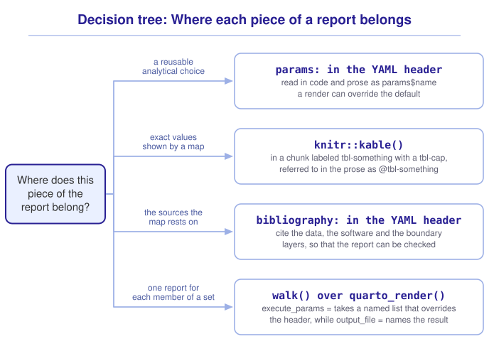

```{r}
#| include: false

library(sf)
library(tmap)
library(tidyverse)
library(webexercises)

tmap_mode("view")

source("src/r/course_functions.R")
source("src/r/reference_lookup.R")

lesson_refs <- find_lesson_references()
```

<hr>

<div>
{.intro_image fig-alt="Course logo"}

Monitoring programs often require the same analysis and report for each animal, reserve, or site. Writing a separate document for each one duplicates the workflow and makes the reports difficult to update consistently.

We previously built a Quarto document that can be regenerated from its data (see ***4.6 Communicating spatial data with Quarto***). A parameterized document also accepts arguments, so one source file can produce a separate report for each site. In this lesson, we will use buffalo collar records to declare parameters, render one report for each animal, present a map's values in a cross-referenced table, and cite the sources a map is built from.

In completing this lesson, you will learn how to:

* Declare parameters in a Quarto document's header and use them in its code
* Put an interactive map in a rendered report
* Render one report for each member of a set with `quarto_render()` and *purrr*
* Use `knitr::kable()` to present a map's values in a cross-referenced table
* Cite the source of every layer a map is built from

**Important!** Before starting this tutorial, be sure that you have completed all preliminary and previous lessons!

*Note: This lesson is optional. Nothing in the problem sets requires it. A report that can be regenerated allows collaborators and reviewers to check the analysis behind its results.*

</div>

## Data for this lesson

<button class="accordion">Explore the metadata for this lesson</button>
::: panel
```{r}
#| echo: false
#| output: asis

lesson_metadata(
  .dataset = "kruger_buffalo.csv"
) %>%
  cat()
```
:::

## Set up your session

Begin with a clean session:

1. Ensure that your **Global Environment** is empty.
2. In the *History* tab of your **workspace pane**, ensure that your **session history** is empty.

Create a script file, save it as `scripts/reports_that_scale.R`, add your metadata, and open a code section called "`setup`":

```{r}
#| eval: false

# My code for the reports that scale tutorial

# setup --------------------------------------------------------

library(sf)
library(quarto)
library(tmap)
library(tidyverse)

tmap_mode("view")
```

In RStudio:

1. Select *File* > *New File* > *Quarto Document*.
2. Give the document the title "Collar summary" and your name as the author.
3. Choose *HTML* as the format and leave the visual editor unchecked.
4. Save the file as `reports/collar_summary.qmd`.

Delete everything below the header and keep the header itself.

## A document that takes an argument

The report summarizes an animal's collar record. We will render it once for each animal, so the animal's name belongs in a parameter rather than in the document's code.

A **parameter** is a value declared in a document's YAML header that its code can read and that the render can override. Parameters go under a `params` key:

```yaml
---
title: "Collar summary"
author: "Your name"
format: html
params:
  animal: "Cilla"
  gap_hours: 24
---
```

Every value under `params` becomes an element of a list called `params`, available to every chunk in the document. Read the collar record for the animal named in the header:

```{r}
#| eval: false

fixes <-
  read_csv(
    "data/raw/kruger_buffalo.csv",
    show_col_types = FALSE
  ) %>%
  filter(animal_id == params$animal) %>%
  st_as_sf(
    coords = c("longitude", "latitude"),
    crs = 4326
  ) %>%
  st_transform(32736) %>%
  arrange(timestamp)
```

Inline expressions make parameters available to the prose as well as the code (see ***4.6 Communicating spatial data with Quarto***):

<pre><code>This report summarizes the collar record of &#96;r params$animal&#96;,
which was fitted with a GPS collar in Kruger National Park.
Positions separated by more than &#96;r params$gap_hours&#96; hours are
treated as a break in the record rather than as a journey.</code></pre>

::: mysecret
 [Put reusable analytical choices in params!]{style="font-size: 1.25em; padding-left: 0.5em;"}

`gap_hours` is a parameter for the same reason `animal` is: it states the gap threshold where the document, the render command, and the reader can see it (see ***5.2 Focus on lines: Paths through a landscape***).

A value belongs in `params` when a reader may need to know it or a reviewer may reasonably change it. A threshold, buffer distance, class boundary, year, or study area usually belongs there. A color, axis label, or figure width usually does not.
:::

::: now_you
 [Check your understanding]{style="padding-left: 0.5em;"}

A Quarto document declares `params: species: "Turdus migratorius"`. How does a code chunk read that value?

`r longmcq(c(answer = "params$species", "species", "@params$species", "get_param(\"species\")"))`

True or false: A parameter's value in the YAML header is fixed for every render of the document.

`r torf(FALSE)`
:::

## One report for each member of a set

We can render a document from R with the *quarto* package. `quarto_render()` takes the following arguments:

* `input = `: the document to render.
* `output_file = `: the name of the file to write.
* `execute_params = `: a named list of parameter values, which override the ones in the header.

Render one report:

```{r}
#| eval: false

library(quarto)

quarto_render(
  input = "reports/collar_summary.qmd",
  output_file = "collar_summary_toni.html",
  execute_params =
    list(animal = "Toni")
)
```

`walk()` applies a function for its effect rather than its return value (see ***4.4 Iteration with purrr***). Render one report for each animal:

```{r}
#| eval: false

animals <-
  read_csv(
    "data/raw/kruger_buffalo.csv",
    show_col_types = FALSE
  ) %>%
  distinct(animal_id) %>%
  pull(animal_id)

animals %>%
  walk(
    \(.animal) {
      quarto_render(
        input = "reports/collar_summary.qmd",
        output_file =
          str_c(
            "collar_summary_",
            str_to_lower(.animal),
            ".html"
          ),
        execute_params =
          list(animal = .animal)
      )
    }
  )
```

`str_c()` builds each file name from the animal's name, and `str_to_lower()` converts that name to lowercase. Each render writes its own HTML file, all of them built from the same document.

::: mysecret
 [Check the session and output location]{style="font-size: 1.25em; padding-left: 0.5em;"}

The document renders in its own R session, so objects in your global environment are not available to it. This course project sets `execute-dir: project`, so paths inside the document are resolved from the project root. In a project without that setting, Quarto uses the document's directory by default.

`output_file` names the file, not the directory. A report built from `reports/collar_summary.qmd` is written to `reports/`, beside the document. To write reports elsewhere, move them afterward or set an output directory in the project's `_quarto.yml`.
:::

::: now_you
 [Now you!]{style="font-size: 1.25em; padding-left: 0.5em;"}

Rewrite the call above so that each report is rendered with a gap threshold of 12 hours rather than the document's default.

*Hint: `execute_params` takes a list, and a list can contain more than one element.*

[Click here to see my answer]{.answer_link data-answer="a-5-6-params"}

::: {.answer_body #a-5-6-params}

```{r}
#| eval: false

animals %>%
  walk(
    \(.animal) {
      quarto_render(
        input = "reports/collar_summary.qmd",
        output_file =
          str_c(
            "collar_summary_",
            str_to_lower(.animal),
            ".html"
          ),
        execute_params =
          list(
            animal = .animal,
            gap_hours = 12
          )
      )
    }
  )
```

A parameter that `execute_params` supplies overrides the value in the header, and a parameter it does not supply keeps that value. The threshold is now stated in the script that built the reports rather than in the document.

:::
:::

## A map the reader can explore

An HTML report can carry an interactive map. The reader pans and zooms it, rather than choosing between a figure of the whole study area and a figure of the detail in it.

*tmap* draws an interactive map when its mode is `"view"` (see ***3.5 Introduction to tmap***). Set the mode once in the report's setup chunk, and every map in the document is interactive:

```{r}
#| eval: false

library(tmap)

tmap_mode("view")
```

Read Queen's collar record and map it:

```{r}
#| fig-alt: "An interactive map of the collar fixes recorded for the buffalo named Queen, drawn as red points over a basemap of Kruger National Park."

queen <-
  read_csv(
    "data/raw/kruger_buffalo.csv",
    show_col_types = FALSE
  ) %>%
  filter(animal_id == "Queen") %>%
  st_as_sf(
    coords = c("longitude", "latitude"),
    crs = 4326
  ) %>%
  st_transform(32736) %>%
  arrange(timestamp)

tm_shape(queen) +
  tm_dots(
    fill = "red",
    fill_alpha = 0.5
  )
```

The map is a widget stored in the HTML file, so it travels with the file. The widget needs an HTML format, and a report rendered to PDF or Word cannot carry one.

In `collar_summary.qmd` the object mapped is `fixes`, which `params$animal` selected.

## The numbers behind the map

A table provides the exact values that a reader may need to quote or compare.

Summarize each burst using the workflow from ***5.2 Focus on lines: Paths through a landscape***:

```{r}
bursts <-
  queen %>%
  mutate(
    gap_hours =
      as.numeric(
        difftime(
          timestamp,
          lag(timestamp),
          units = "hours"
        )
      ),
    burst =
      cumsum(
        replace_na(gap_hours > 24, TRUE)
      )
  ) %>%
  group_by(burst) %>%
  filter(n() > 1) %>%
  summarize(
    fixes = n(),
    start = min(timestamp),
    end = max(timestamp),
    do_union = FALSE
  ) %>%
  st_cast("LINESTRING") %>%
  mutate(
    length_km =
      as.numeric(
        units::set_units(
          st_length(geometry),
          "km"
        )
      )
  ) %>%
  st_drop_geometry()
```

```{r}
#| echo: false

bursts
```

The animal and the threshold are written out here so that this page can render on its own. In `collar_summary.qmd` they come from the header, as `params$animal` and `params$gap_hours`, and nothing else in the chunk changes.

`knitr::kable()` returns that data frame as a table the document can typeset. In `collar_summary.qmd`, the chunk has a `label` and a `tbl-cap`:

````markdown
```{r}
#| label: tbl-bursts
#| tbl-cap: "Continuous runs of collar fixes, with the distance of the path through each."

bursts %>%
  knitr::kable(
    col.names =
      c(
        "Burst",
        "Fixes",
        "First fix",
        "Last fix",
        "Path (km)"
      ),
    digits = 1
  )
```
````

A chunk labeled `tbl-something` is cross-referenced in the prose as `@tbl-something`, the same rule that applies to `fig-` (see ***4.6 Communicating spatial data with Quarto***). The prose then reads:

> The collar recorded `r nrow(bursts)` continuous runs of positions (`@tbl-bursts`).

::: {.callout-note}

Recall that a cross-reference renders as the word *Table* and a number, and that the number is worked out at render time (see ***4.6 Communicating spatial data with Quarto***). Adding a table above this one renumbers both, and the prose follows.

:::

`col.names = ` provides reader-facing column names. A column called `length_km` becomes *Path (km)* in the report.

## Citing what the map is made of

Every layer on a map has a source, and a report that does not state its sources cannot be checked.

Quarto reads citations from a BibTeX file named in the header:

```yaml
---
title: "Collar summary"
format: html
bibliography: references.bib
---
```

Create that file yourself. In RStudio, select *File* > *New File* > *Text File*, and save it as `reports/references.bib`, beside the report that names it.

The entry in `references.bib` for the data this lesson uses looks like this:

```
@misc{cross2016buffalo,
  author       = {Cross, Paul C. and Bowers, Jessica A. and Hay, Craig T. and
                  Wolhuter, Johan and Buss, Peter and Hofmeyr, Markus and
                  du Toit, Johan T. and Getz, Wayne M.},
  title        = {Data from: Nonparameteric kernel methods for constructing
                  home ranges and utilization distributions},
  year         = {2016},
  publisher    = {Movebank Data Repository},
  doi          = {10.5441/001/1.j900f88t}
}
```

The prose cites it by its key:

> Collar records for six African buffalo were obtained from the Movebank Data
> Repository [@cross2016buffalo].

Quarto formats the citation and builds a reference list at the end of the document.

::: mysecret
 [Cite the data, the software, and the boundary!]{style="font-size: 1.25em; padding-left: 0.5em;"}

A reproducible map should cite:

* **The data.** A dataset has authors and, increasingly, a DOI. A data repository provides its citation.
* **The software.** `citation("sf")` returns the reference for *sf*, and the same call works for every package a report depends on.
* **The boundaries.** A protected area layer, an administrative boundary, and a land cover map each have a producer, a date, and a resolution. Two versions of the same layer may return different areas, so identify the version used in the analysis.
:::

::: now_you
 [Check your understanding]{style="padding-left: 0.5em;"}

A chunk is labeled `tbl-sites`. How is it referred to in the prose?

`r longmcq(c(answer = "The @ prefix before tbl-sites", "The # prefix before tbl-sites", "Square brackets around tbl-sites", "ref() around tbl-sites"))`

True or false: A report that names its data source in the methods still needs the layer's version or download date.

`r torf(TRUE)`
:::

## Putting it all together

A report that scales separates reusable analytical choices from the document that applies them. My own model for where each part belongs looks like this (click to expand):

{.zoomable data-title="Decision tree: Where each piece of a report belongs" data-pdf-key="reports_that_scale" fig-alt="To decide where a piece of a report belongs, ask what the piece is. A reusable analytical choice goes in the params block of the YAML header, where code and prose read it as params dollar name and a render can override it. The exact values behind a map go in a chunk labeled tbl-something with a tbl-cap, referred to in the prose as at-tbl-something and formatted with knitr::kable(). The sources used to build the map go in a bibliography entry in the YAML header. Cite the data, software, and boundary layers so the report can be checked. To create one report for each member of a set, use walk() over quarto_render(). execute_params takes a named list that overrides the header, and output_file names the file written."}



::: {.callout-note}

This tree shows *my* mental model for these functions. Your model may differ. What matters is that it helps you retrieve the functions needed to solve a problem.

:::

## Take-home points

* A `params` block in the YAML header declares values that the document's code reads as `params$name` and that a render can override.
* Reusable analytical choices belong in `params`, where the reader and reviewer can see them. Examples include a threshold, buffer distance, study area, or year.
* `quarto_render()` renders a document from R. `execute_params = ` supplies a named list of parameter values and `output_file = ` names the file it writes.
* `walk()` over a set of values renders one report per value, from one document.
* A document renders in its own R session, so it cannot use objects from your global environment. In this course project, `execute-dir: project` resolves paths from the project root.
* A chunk labeled `tbl-something`, with a `tbl-cap`, is cross-referenced in the prose as `@tbl-something`. `col.names = ` in `kable()` renames the columns for a reader.
* `tmap_mode("view")` in a report's setup chunk makes every *tmap* in it interactive. The widget is stored in the HTML file and needs an HTML format.
* `bibliography: ` in the header names a BibTeX file, and a citation key in the prose becomes a formatted citation and a reference list entry. Cite the data, the software, and the boundary layers.

## Exercises

::: now_you
 [Test your knowledge!]{style="font-size: 1.25em; padding-left: 0.5em;"}

1. Which of these values belongs in a document's `params` block?

`r longmcq(c(answer = "The buffer distance used to define the study area", "The width of the figures", "The color palette of the map", "The name of the author"))`

2. A document renders from a script and fails with an object-not-found error. The same code runs correctly in your current session. What is the likely cause?

`r longmcq(c(answer = "The report depends on an object in the global environment", "quarto_render() cannot read csv files", "The parameter was supplied in the YAML header", "The document includes a bibliography"))`

3. What does `execute_params` do to a parameter that the document's header already declares?

`r longmcq(c(answer = "It overrides it for that render", "It is ignored, because the header takes precedence", "It raises an error naming the duplicate", "It appends a second value to the parameter"))`

4. Parsons problem: Reorder the lines to render one report per animal, each named after the animal. Place the line that would assign the same name to every report in the trash.

<div class="parsons-problem">
<div id="p-5-6-01-trash" class="sortable-code"></div>
<div id="p-5-6-01-sortable" class="sortable-code"></div>
<div style="clear: both;"></div>
<button id="p-5-6-01-check" class="parsons-btn parsons-btn-check" type="button">Check My Order</button>
<button id="p-5-6-01-reset" class="parsons-btn parsons-btn-reset" type="button">Shuffle Again</button>
<p id="p-5-6-01-feedback" class="parsons-feedback"></p>
</div>

<script>
window.parsonsProblems = window.parsonsProblems || []; window.parsonsProblems.push({ id: "p-5-6-01", maxDistractors: 1, code: "animals %>%\n  walk(\n    \\(.animal) {\n      quarto_render(\n        input = \"reports/collar_summary.qmd\",\n        output_file = \"collar_summary.html\", #distractor\n        output_file = str_c(\"collar_summary_\", str_to_lower(.animal), \".html\"),\n        execute_params = list(animal = .animal)\n      )\n    }\n  )" });
</script>

5. True or false: A map's data source only needs to be cited when the data are not publicly available.

`r torf(FALSE)`
:::


