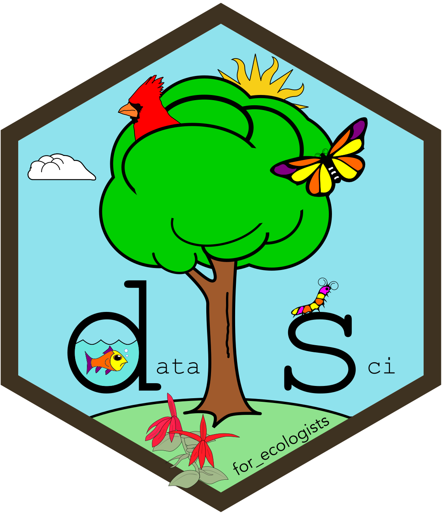

```{r}
#| include: false

source("src/r/course_functions.R")
source("src/r/reference_lookup.R")

module_refs <- find_module_references(6)
```
<hr>

<div>
{.intro_image fig-alt="Course logo"}

Modules 3 through 5 focused on vector data: separate [features]{.term term="Feature"}, each with a [geometry]{.term} and [fields]{.term term="Field"} of its own. Many ecological measurements describe a continuous surface instead. Elevation, temperature, canopy cover and land cover are recorded across a landscape, and [rasters]{.term term="Raster"} store those measurements on a grid.

In this module, we will use *terra* to read, modify and combine rasters. The *tidyterra* [package]{.term} extends familiar *dplyr* verbs and *ggplot2* layers to raster [objects]{.term term="Object"}. In this module you will learn:

* What a raster is and how a `SpatRaster` represents its grid and [values]{.term term="Value"}
* How to build classes out of a quantity, and how to work with a raster whose values are already classes
* How to put rasters from different sources onto a shared grid
* How to combine rasters with the vector data of the previous modules
* How to write a raster to a file without changing its values
* Optionally, how to let a reader explore a raster through a small Shiny app

</div>

## Module overview

* **6.1 Introduction to rasters with terra**: Build the raster mental model, read and draw a `SpatRaster`, work with its layers, and filter values without changing the grid.
* **6.2 Categorical rasters**: Read the labels and colors carried by a categorical raster, build classes from a quantity, and merge existing classes by changing their codes rather than only their names.
* **6.3 Changing the grid: Resolution, extent and projection**: Identify the differences between two raster grids, then use `project()`, `aggregate()`, `disagg()` or `resample()` to put them onto a useful shared grid.
* **6.4 Rasters and vectors together**: Crop and mask a raster with a vector, extract raster values at vector locations, and move between raster and vector representations.
* **6.5 An introduction to Shiny** (optional): Build a small app that lets a reader change an elevation threshold and see the result.

**Problem set**: The parks of Washington, D.C.

## Getting started

Download [module_6_data.zip](module_6_data.zip){download} and:

* Place the folder `gis_scbi` inside `data/raw`. *Note: Please place the folder itself in that location, not the files within it, and do not change its name.*
* Place any `*.tif` files that are not inside that folder in `data/raw/rasters`.

Every lesson also loads `source_script_module_3.R` from `scripts`, which supplies `clean_names()` and `lonlat_to_utm()`.

Run the following to [install]{.term} or update the packages from this module:

```{r}
#| eval: false

install.packages(
  c(
    "shiny",
    "terra",
    "tidyterra"
  )
)
```

***Important!*** Large raster operations may write intermediate results to temporary files. Keep enough free disk space for those files as well as the output you intend to save. If an operation fails while processing a large raster, check available disk space as well as [memory]{.term}.

## Data for Module 6

<button class="accordion">Please click on the button below to explore the data that we will use in this module!</button>
::: panel

```{r}
#| echo: false
#| output: asis

cat(dataset_markdown(.module = 6))
```

:::

## Readings and resources

### Optional readings

Lovelace, Nowosad & Muenchow, *Geocomputation with R*:

-   [2.3: Raster data](https://r.geocompx.org/spatial-class#raster-data){target="_blank"}
-   [4.3: Spatial operations on raster data](https://r.geocompx.org/spatial-operations#spatial-ras){target="_blank"}
-   [6: Raster-vector interactions](https://r.geocompx.org/raster-vector){target="_blank"}

Hernangómez, D. (2023). Using the tidyverse with terra objects: the tidyterra package. *Journal of Open Source Software*, 8(91), 5751. [https://doi.org/10.21105/joss.05751](https://doi.org/10.21105/joss.05751){target="_blank"}

-   [5.3: Geometry operations on raster data](https://r.geocompx.org/geometry-operations#geo-ras){target="_blank"}
-   [7.8: Reprojecting raster geometries](https://r.geocompx.org/reproj-geo-data#reproj-ras){target="_blank"}

### Documentation and cheatsheets

-   [terra](https://rspatial.github.io/terra/){target="_blank"}
-   [tidyterra](https://dieghernan.github.io/tidyterra/){target="_blank"}
-   [Spatial manipulation with sf](https://github.com/rstudio/cheatsheets/blob/main/sf.pdf){target="_blank"}


