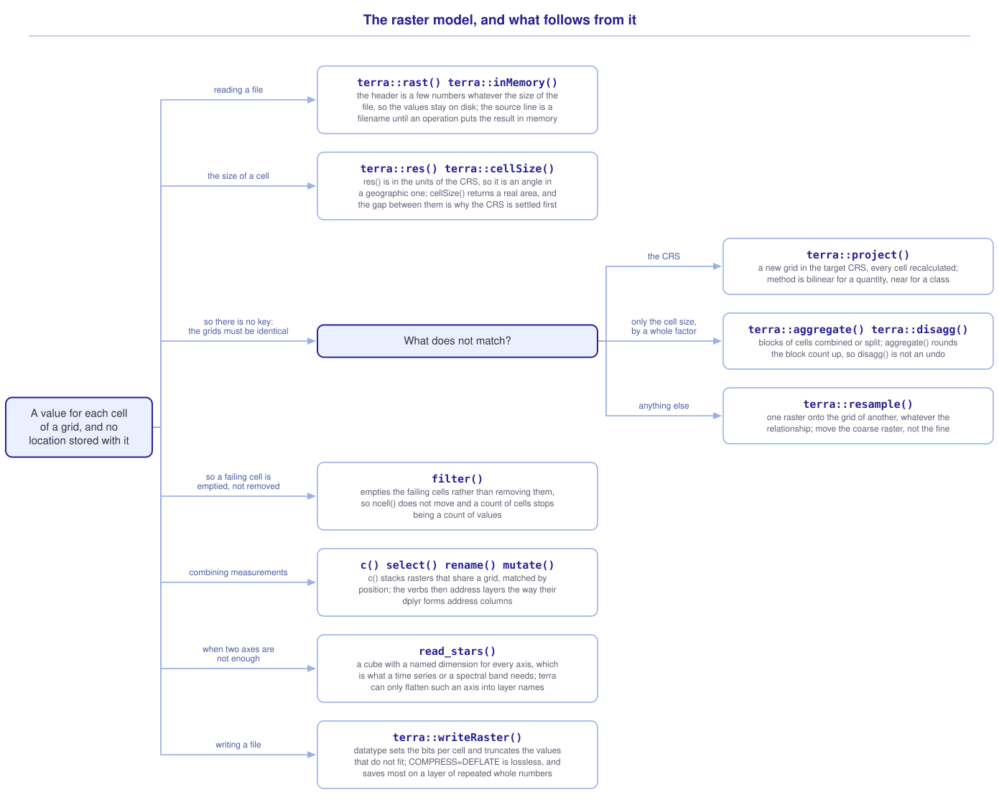

```{r}
#| include: false

library(tidyterra)
library(stars)
library(sf)
library(tidyverse)
library(webexercises)

source("src/r/course_functions.R")
source("src/r/reference_lookup.R")

lesson_refs <- find_lesson_references()
```

<hr>

<div>
{.intro_image fig-alt="Course logo"}

**Rasters represent data across a continuous surface**, and they are used to characterize environmental features such as land cover, elevation and temperature. With them we can measure the steepness of the terrain around a field site, the forest cover within a kilometer of a road, or the area of a park that sits above a given elevation.

A **raster** is a **grid** of equally sized **cells**, each with a value. **The location of a cell is not part of the data.** It is calculated from the coordinates of one corner of the grid, the size of a cell, and the cell's row and column.

Material covered will include:

* Reading a raster with `rast()`, and what its printed anatomy is for
* Why the values can stay on disk, and how to tell whether they have
* What `resolution` means, and why it is not always a distance
* Putting two rasters onto one grid with `project()`, `aggregate()`, `disagg()` and `resample()`
* Handling a raster with the *dplyr* verbs that *tidyterra* provides
* *stars*, and the case the grid model does not cover
* Writing a raster, and choosing a data type that keeps its values

**Important!** Before starting this tutorial, be sure that you have completed all preliminary and previous lessons!

</div>

## Data for this lesson

<button class="accordion">Please click on the button below to explore the metadata for this lesson!</button>
::: panel
In this lesson, we will explore:

```{r}
#| echo: false
#| output: asis

lesson_metadata(
  .dataset =
    c(
      "scbi_dem.tif",
      "scbi_canopy_cover.tif",
      "dc_stack.tif"
    )
) %>%
  cat()
```
:::

## Set up your session

Please complete the following to ensure that you are working in a clean session:

1. Please ensure that your **Global Environment** is empty.
2. In the *History* tab of your **workspace pane**, ensure that your **session history** is empty.

Now that we are working in a clean session:

1. Create a script file.
2. Save your script file as `scripts/introduction_to_rasters.R`.
3. Add metadata as a comment on the top of the file.
4. Following your metadata, create a new **code section** and call it "`setup`".
5. Following your section header, attach the *tidyterra*, *stars* and *sf* packages and the packages that comprise the **core tidyverse**, then load the module 3 source script.

At this point, your script should look something like:

```{r}
#| eval: false

# My code for the introduction to rasters tutorial

# setup --------------------------------------------------------

library(tidyterra)
library(stars)
library(sf)
library(tidyverse)

# Load the source script:

source("scripts/source_script_module_3.R")
```

```{r}
#| include: false

source("scripts/source_script_module_3.R")
```

*tidyterra* is attached, because its whole purpose is to supply *dplyr* verbs that we then call bare. The **core tidyverse** goes last, which is the rule from ***1.2 Getting started***: the package whose names you want to win goes at the bottom. The package that supplies most of this module is not on the list at all.

### Why *terra* is not attached

*terra* supplies most of the functions in this module, and because three of its function names collide with names the tidyverse already uses, we never write `library(terra)`.

The reason is in what the package exports. Some of its function names are names the tidyverse already uses: `extract()`, `intersect()` and `union()`. Attaching *terra* after the tidyverse rebinds them, and R reports one:

> `Attaching package: 'terra'`
> `The following object is masked from 'package:tidyr':`
> `    extract`

That one is safe twice over: the message names it, and a bare `extract()` afterwards stops rather than answering:

```{r}
#| error: true

tibble(v = "a-1") %>%
  terra::extract(v, "([a-z])-([0-9])")
```

An error is something you can find. The other two are not announced, because *terra* supplies them as methods rather than as functions. Writing `terra::` reaches what a bare call would reach once *terra* is attached, so a masked `intersect()` can be seen at work on two data frames:

```{r}
tibble(x = 1:3) %>%
  terra::intersect(tibble(x = 2:4))
```

*dplyr*'s `intersect()` returns the rows the two tables share. This returns an empty list, with no error and no warning. `terra::union()` is no better:

```{r}
tibble(x = 1:3) %>%
  terra::union(tibble(x = 2:4))
```

Two tables in, a list of two vectors out, and the failure appears somewhere unrelated to where it was made.

The `terra::` prefix removes the problem rather than managing it, and it names the source of a call at the point where it is read. This module mixes *terra*, *tidyterra*, *stars* and *sf*, often within one pipe, and `terra::project()` says which of them supplies `project()`.

::: mysecret
 [The alternative, if you would rather attach it]{style="font-size: 1.25em; padding-left: 0.5em;"}

There is a second way to make a masked name safe, and it is common enough in other people's code to be worth recognizing.

The *conflicted* package turns every ambiguous name into an error at the moment you call it. Attach it first, attach *terra* normally, and a bare call to a masked name returns this instead of a result:

> `[conflicted] extract found in 2 packages.`
> `Either pick the one you want with ::`
> `Or declare a preference with conflicts_prefer()`

`conflicts_prefer(tidyr::extract)` at the top of the script then settles it once, for every call below.

Both share one principle: **a masked name should never be resolved by accident.** This course takes the prefix, which needs no extra package and says where a function comes from, but *conflicted* is the better tool in someone else's script.
:::

### Read the data

`rast()` reads a raster file. Create a code section called "`read and pre-process data`" and read the campus elevation model:

```{r}
dem <-
  terra::rast("data/raw/gis_scbi/scbi_dem.tif")
```

::: now_you
 [Now you!]{style="font-size: 1.25em; padding-left: 0.5em;"}

Add two more reads to your `read and pre-process data` section:

* `scbi_canopy_cover.tif`, from the same folder, assigned to the name `canopy`;
* `dc_stack.tif`, from `data/raw/rasters`, assigned to the name `dc`.

[Click here to see my answer]{.answer_link data-answer="a-6-1-read"}

::: {.answer_body #a-6-1-read}

```{r}
# Percent canopy cover over the campus:

canopy <-
  terra::rast("data/raw/gis_scbi/scbi_canopy_cover.tif")

# Four layers of land cover for the District:

dc <-
  terra::rast("data/raw/rasters/dc_stack.tif")
```

:::
:::

### Draw it

`geom_spatraster()` is *tidyterra*'s layer for a `SpatRaster`. Let's look at the elevation model:

```{r}
#| fig-alt: "Elevation across the SCBI campus, in longitude and latitude. A ridge crosses the north of the extent and a valley runs out of the southwest corner, holding the lowest elevations on the map."

ggplot() +
  geom_spatraster(data = dem) +
  scale_fill_hypso_c() +
  theme_bw()
```

The raster is named in `data = ` inside the geom rather than piped into `ggplot()`, because a `SpatRaster` is not a data frame. Nothing is named in `aes()`: there is one value per cell, and `fill` is where it goes. `scale_fill_hypso_c()` is one of *tidyterra*'s continuous fill scales, named for the hypsometric tints of a topographic map.

The console reported something else as well:

> `<SpatRaster> resampled to 500316 cells for plotting`

There are more cells in `dem` than pixels on the screen, so a coarser version was drawn, about half a million cells by default. `maxcell = ` raises that ceiling when a small detail has to be visible. **What you are looking at is a sample of the grid.** A calculation reads the file; only the display is coarsened.

## How a raster is built

### Calculating where a cell is

A position calculation needs the origin, the cell size, and the cell's row and column. `xyFromCell()` does that arithmetic:

```{r}
terra::xyFromCell(dem, 1)
```

Ask for the cell beside it, and subtract:

```{r}
terra::xyFromCell(dem, 2) - terra::xyFromCell(dem, 1)
```

The y has not moved and the x has moved by `3.08642e-05`. That number is not stored anywhere per cell — it is the **resolution**:

```{r}
terra::res(dem)
```

`xyFromCell()` looked nothing up. It multiplied an index by a step and added an origin.

The calculation runs in both directions, so a coordinate can find its cell:

```{r}
terra::cellFromXY(
  dem,
  terra::xyFromCell(dem, 1)
)
```

Cell 1, back again. **There is no geometry column because there is nothing to put in it.**

### The same values, stored as points

Storing nothing per cell is what makes a raster cheap. Take the elevation model, coarsen it enough to handle quickly, and write it out twice: once as a raster, and once as one point per cell.

```{r}
small <-
  dem %>%
  terra::aggregate(
    fact = 10,
    fun = "mean",
    na.rm = TRUE
  )

terra::ncell(small)
```

5,850 cells:

```{r}
# Write the same values both ways, into temporary files:

raster_file <- tempfile(fileext = ".tif")

point_file <- tempfile(fileext = ".gpkg")

small %>%
  terra::writeRaster(raster_file, overwrite = TRUE)

small %>%
  terra::as.points() %>%
  st_as_sf() %>%
  st_write(point_file, quiet = TRUE)
```

And compare:

```{r}
file.size(raster_file)

file.size(point_file)
```

Thirty times the storage for the same values. In the raster there are about four bytes per value and nothing per location; in the vector file each value comes with a coordinate pair, a geometry type and an index. That ratio is why a raster is the model of choice for anything measured everywhere.

### Reading the printed summary

```{r}
dem
```

Read that summary as what a position calculation needs rather than as a list of properties:

**`dimensions`** and **`resolution`** are the index range and the step. **`extent`** is the origin the steps start from, and **`coord. ref.`** is the CRS those coordinates belong to. Together they are enough to calculate a place on Earth from a cell number, and nothing else about position is in a raster file.

**`source`** is the last line before the layer's own description. It names a *file* rather than `memory`, and the next section is about why. The label itself moves: `source(s)` when the values are in memory, and `sources` when they came from more than one file.

::: now_you
 [Check your understanding]{style="padding-left: 0.5em;"}

A `SpatRaster` reports `dimensions: 500, 400, 3`. How many cells does it hold?

`r longmcq(c(answer = "200,000", "600,000", "1,200", "500"))`

True or false: the coordinates of every cell are stored in a `SpatRaster`.

`r torf(FALSE)`
:::

## Reading a header without reading the values

`rast()` did not read the values. It read the header: the origin, the step and the counts above. *terra*'s documentation for the `SpatRaster` class puts it plainly, that an object of the class "can point to one or more files on disk that hold the cell values, and/or it can hold these values in memory". `inMemory()` reports which state an object is in:

```{r}
terra::inMemory(dem)
```

A header is a few numbers whatever the size of the file. Values are read when something asks for them, which is why a raster operation that seems instant may have done nothing yet.

An operation that calculates new values has to put them somewhere, and *terra* keeps them in memory when they fit:

```{r}
dem %>%
  terra::aggregate(fact = 50) %>%
  terra::inMemory()
```

Print such an object and the `source` line reads `memory` rather than a filename. **Reading `source` is how you tell a raster whose values are on disk from one whose values are in your session**, and it is the first thing to check when yesterday's script will not run today.

When the values do not fit, *terra* writes them to a temporary file instead, as ***Module 6: Raster data with terra*** describes. `inMemory()` then returns `FALSE` for a raster that holds calculated values, and `source` names a file in a temporary folder rather than one of yours.

`global()` summarizes a whole layer:

```{r}
dem %>%
  terra::global(
    c(
      "mean",
      "sd",
      "min",
      "max"
    )
  )
```

::: now_you
 [Now you!]{style="font-size: 1.25em; padding-left: 0.5em;"}

Return the mean of each of the four layers of `dc`, ignoring missing cells, and say why the `land` layer's mean is what it is.

[Click here to see my answer]{.answer_link data-answer="a-6-1-global"}

::: {.answer_body #a-6-1-global}

```{r}
dc %>%
  terra::global(
    "mean",
    na.rm = TRUE
  )
```

One row per layer, named by the layer. `land` is 1 in every cell that holds a value, so its mean is 1. In that layer the information is in the pattern of missing cells rather than in a range of values. Look at the values of a file before building on them.

:::
:::

## A resolution is not always a distance

The `resolution` of the elevation model is `3.08642e-05`. That is not a length. The file is in a geographic CRS, so a cell is `3.08642e-05` **degrees** on a side, and a degree of longitude is a different distance at the equator than it is in Virginia.

`cellSize()` turns that into an area on the ground:

```{r}
dem %>%
  terra::cellSize(unit = "m") %>%
  terra::global("mean")
```

About nine square meters, so roughly a three-meter cell. **The number in `resolution` answers a different question than the one people ask of it.**

A cell in a geographic CRS is not square on the ground and not the same size across the raster, so any calculation involving an area or a distance is meaningless until the raster is projected. A neighborhood, a buffer and a slope are all such calculations.

::: now_you
 [Check your understanding]{style="padding-left: 0.5em;"}

A raster prints `resolution : 0.0002777778, 0.0002777778` and `coord. ref. : lon/lat WGS 84`. What is the size of a cell?

`r longmcq(c(answer = "About 0.0003 degrees on a side, which is a different distance in each direction", "About 0.0003 meters on a side", "About 28 meters on a side, everywhere on Earth", "It cannot be worked out without the extent"))`

True or false: `cellSize()` returns the same value for every cell of a raster in a geographic CRS.

`r torf(FALSE)`
:::

## Because there is no stored position, there is no key

Two data frames are joined on a key: ***4.3 Non-spatial joins*** matched rows by a shared value, and it did not matter what order either table was in. Two rasters have no key. There is a value and an index for each cell, and the only thing that can pair a cell in one raster with a cell in another is **the same place in the same grid**.

So an operation between two rasters is arithmetic between two arrays, position against position, and *terra* stops when the arrays do not line up:

```{r}
#| error: true

dem + canopy
```

> `[+] extents do not match`

`canopy` covers the same ground as `dem` and its values are sound. The grid is not the same:

```{r}
canopy
```

79 rows by 82 columns against 745 by 778, at a resolution about nine times coarser, over an extent that differs in the fourth decimal place. **A join would have matched the rows whatever their order.** There is no join, so the grid has to be repaired.

The question to ask is always the same: *what does not match?*

### The coordinate reference systems differ

`project()` builds a new grid in a target CRS and calculates each of its cells from the old one. `lonlat_to_utm()`, from ***3.4 The coordinate reference system: Why it matters and how to use it***, takes the coordinates of a place and returns the EPSG code of its UTM zone. The place we want is the middle of the raster, so we take its extent with `st_bbox()` and `st_as_sfc()` (see ***5.1 Focus on points: Occurrence records and sampling***), reduce that rectangle to its center with `st_centroid()` (see ***3.6 Geometric operations with sf***), and read the center's longitude and latitude out of the geometry with `st_coordinates()`:

```{r}
utm_epsg <-
  dem %>%
  st_bbox() %>%
  st_as_sfc() %>%
  st_centroid() %>%
  st_coordinates() %>%
  lonlat_to_utm()
```

```{r}
#| echo: false

utm_epsg
```

With the code in hand, `project()` takes it as a character string:

```{r}
dem %>%
  terra::project(
    str_c("EPSG:", utm_epsg)
  )
```

855 rows by 707 columns where there were 745 by 778, and a resolution of 3.059843 meters where there was an angle.

Every cell of the new grid has a **new** value, calculated from whichever old cells fell near its position, because a projected grid cannot be laid over a geographic one cell for cell. **A projection is a resampling.**

### Only the cell size differs, by a whole factor

When two grids share an origin and a CRS and differ only in how finely they are cut, the repair is arithmetic on blocks. `aggregate()` combines them:

```{r}
dem %>%
  terra::aggregate(
    fact = 10,
    fun = "mean",
    na.rm = TRUE
  )
```

`fact = 10` means blocks of ten cells by ten, and `fun = ` names the statistic that combines them.

The result is 75 by 78. 745 rows do not divide into blocks of ten, and `aggregate()` rounds the number of blocks *up*, so the last row and column of blocks hang over the edge of the data:

```{r}
dem %>%
  terra::aggregate(
    fact = 10,
    fun = "mean"
  ) %>%
  is.na() %>%
  terra::global("sum")
```

152 missing cells, one for every block that reached past the edge. `na.rm = TRUE`, omitted from the call above, calculates those blocks from the cells they do cover.

That rounding is why the round trip does not come home:

```{r}
dem %>%
  terra::aggregate(
    fact = 10,
    fun = "mean",
    na.rm = TRUE
  ) %>%
  terra::disagg(fact = 10) %>%
  dim()
```

Against the raster it started from:

```{r}
dim(dem)
```

750 by 780 against 745 by 778. **`disagg()` is not an undo.** It splits each cell into a block of identical values, so it recovers the cell size and neither the shape of the grid nor the detail that `aggregate()` averaged away.

::: now_you
 [Check your understanding]{style="padding-left: 0.5em;"}

A raster of 30-meter cells is aggregated with `fact = 3`. What is the resolution of the result?

`r longmcq(c(answer = "90 meters", "10 meters", "30 meters", "It depends on the function supplied to fun ="))`

True or false: `disagg()` recovers the values that `aggregate()` combined.

`r torf(FALSE)`
:::

### Anything else about the grids differs

Whole factors are a special case, and `canopy` is not one: its origin is offset from `dem`'s and its cell size is not a round multiple. `resample()` takes a target raster and calculates a value for each of *its* cells:

```{r}
canopy %>%
  terra::resample(
    dem,
    method = "bilinear"
  )
```

The dimensions, resolution and extent are `dem`'s, and the values are `canopy`'s. The two can now be added.

**The raster to move is the coarse one.** Resampling the fine raster onto the coarse grid averages away detail that was measured. Resampling the coarse one onto the fine grid adds no detail, and loses none.

### `method = ` has to suit what the values are

`method = ` decides how each new value is calculated, in `project()` and `resample()` alike. `"bilinear"` averages the four nearest cells, which is right for a quantity. `"near"` copies the nearest cell, which is the only correct choice for a class.

An average of two class codes is a third class code. The `nlcd` layer of `dc` is coded 11, 21, 22, 23, 24, 31, 41 and onward, and the mean of 21 and 41 is 31 — a code in that same scheme, and nothing downstream can tell it from a measured one.

*terra* chooses for you when it can: `project()` and `resample()` default to `near` when the first layer is categorical and to `bilinear` when it is numeric. Whether a layer is categorical is recorded in the file, and the four layers of `dc` are not:

```{r}
terra::is.factor(dc)
```

`FALSE` four times, so the codes in `nlcd` are a quantity as far as *terra* can tell, and the default there is the wrong one. **When the values are classes, name the method.**

::: mysecret
 [Every repair is a guess, so make as few as you can]{style="font-size: 1.25em; padding-left: 0.5em;"}

Each repair above calculates new values from old ones, and each loses a little.

**Decide the CRS of an analysis before you begin.** Projecting a raster twice is worse than projecting it once, and transforming back and forth as each question comes up is worse still.

**Where a raster and a vector have to share a CRS, move the vector.** `st_transform()` recalculates a vector's coordinates and nothing else, because the geometry is the data, and a raster cannot be moved without resampling its values. The rule holds until the raster is the thing being measured in real units, at which point it has to be projected regardless.
:::

::: now_you
 [Now you!]{style="font-size: 1.25em; padding-left: 0.5em;"}

Return a two-layer raster of elevation and canopy cover, in UTM zone 17N, at a ten-meter resolution.

*Hint: `project()` takes a `SpatRaster` as its target as readily as a CRS string, and given one it uses that raster's whole grid.*

[Click here to see my answer]{.answer_link data-answer="a-6-1-utm"}

::: {.answer_body #a-6-1-utm}

```{r}
# Build the target grid once:

dem_utm <-
  dem %>%
  terra::project(
    str_c("EPSG:", utm_epsg),
    res = 10
  )

# Move canopy onto it and stack the two:

c(
  dem_utm,
  canopy %>%
    terra::project(
      dem_utm,
      method = "bilinear"
    )
) %>%
  rename(
    elevation = 1,
    canopy = 2
  )
```

Handing `project()` the target raster does the work of `project()` and `resample()` together, and the two grids are then identical because they were built from the same specification.

:::
:::

## Because the grid stays rectangular, `filter()` empties cells rather than removing them

*tidyterra* supplies the *dplyr* verbs for a `SpatRaster`, and they mean what they have always meant. `filter()` is the exception, and predicting its result before running it is the fastest way to see why.

A row of a data frame can be dropped because nothing else depends on where it sat. A raster is a rectangle indexed by row and column, and a rectangle has no way to hold a gap. Rows and columns can be trimmed from the edge, which is how a raster is cut to a smaller area, but the cells that fail a condition are scattered through the middle. They stay where they are:

```{r}
dem %>%
  rename(elevation = 1) %>%
  filter(elevation > 350)
```

Notice that the dimensions, the extent and the cell count all came back identical. What changed is that every cell failing the condition is now `NA`:

```{r}
dem %>%
  rename(elevation = 1) %>%
  filter(elevation > 350) %>%
  is.na() %>%
  terra::global("sum")
```

486,530 cells are now empty. What is left is the ground above 350 meters, and `not.na()` counts it:

```{r}
dem %>%
  rename(elevation = 1) %>%
  filter(elevation > 350) %>%
  terra::not.na() %>%
  terra::global("sum")
```

::: mysecret
 [Filtering a raster does not make it smaller]{style="font-size: 1.25em; padding-left: 0.5em;"}

**Anything you count afterward has to say what it is counting.** `ncell()` has not moved and the number of values has, so a count of cells and a count of values are now different numbers. A percentage calculated from the wrong one is wrong by however much of the raster you emptied.

**`filter()` is not how you make a large raster manageable.** A raster of mostly `NA` occupies as much memory as the raster it came from, because the empty cells are still cells. The operations that make a raster smaller are the ones in the previous section: they change the grid.
:::

## A second measurement is a second layer

A rigid grid makes stacking free: once two rasters agree on a grid, `c()` puts them into one object as separate **raster layers**.

```{r}
campus <-
  c(
    dem,
    canopy %>%
      terra::resample(
        dem,
        method = "bilinear"
      )
  ) %>%
  rename(
    elevation = 1,
    canopy = 2
  )
```

```{r}
#| echo: false

campus
```

Two layers, one grid. There is no key and no join here either. The layers are matched **by position**, which is the same fact that stopped the addition above.

With the layers aligned, the verbs address them as they address columns. `select()` keeps layers:

```{r}
campus %>%
  select(canopy)
```

And `mutate()` calculates a new one, cell against cell. Height above the lowest point on the grid is one that terrain work asks for often:

```{r}
# The lowest elevation on the campus grid:

low_point <-
  campus %>%
  select(elevation) %>%
  terra::global("min") %>%
  pull(min)

campus %>%
  mutate(
    relative_elevation = elevation - low_point
  )
```

Three layers now, and the third was calculated cell by cell without using a coordinate.

::: now_you
 [Now you!]{style="font-size: 1.25em; padding-left: 0.5em;"}

Return a raster of the District holding canopy cover only where impervious surface is below ten percent, then count the cells that still hold a value.

*Hint: `filter()` empties the cells that fail and `select()` drops a layer, so one of them has to come first.*

[Click here to see my answer]{.answer_link data-answer="a-6-1-sheltered"}

::: {.answer_body #a-6-1-sheltered}

```{r}
dc %>%

  # Empty the cells over ten percent impervious:

  filter(imp < 10) %>%

  # Keep the canopy layer:

  select(canopy) %>%

  # Count the cells that still hold a value:

  terra::not.na() %>%
  terra::global("sum")
```

`filter()` has to come first. Dropping the `imp` layer before filtering on it leaves nothing to test, and `filter()` stops with `object 'imp' not found`.

:::
:::

## When two axes are not enough

Everything above rests on a grid with two axes. Measurements often have three. The District file we read at the start has four layers, and *terra* calls them layers because a grid has no other name for them:

```{r}
dc %>%
  names()
```

Canopy, impervious surface, land cover class and a layer of ones. Four different measurements, stacked, and nothing distinguishes that arrangement from one measurement recorded in four months. Those months would be stored the same way, as four names on one grid, with their order in time recorded nowhere but in the names.

*stars* is the package for that case. It treats a raster as one instance of a **data cube**: an array with named dimensions, of which x and y are two, and time or band or depth can be more.

```{r}
dem_stars <-
  read_stars("data/raw/gis_scbi/scbi_dem.tif")
```

```{r}
#| echo: false

dem_stars
```

The print has an **attributes** section, which is the variables in the cube, and a **dimensions** table, which describes its axes. That table is our position arithmetic written out and named: `from` and `to` are the index range, `offset` is the origin, `delta` is the step, and `refsys` is the CRS.

Something there is absent from a printed `SpatRaster`. `delta` on the y axis is **negative**. The rows run north to south while the coordinate runs south to north, and the sign is where that is recorded. The same orientation is there in a `SpatRaster` and is nowhere in its printed summary.

The attribute name, `scbi_dem.tif`, is taken from the file. Read the same four-layer District file and the difference from *terra* is immediate:

```{r}
read_stars("data/raw/rasters/dc_stack.tif")
```

One attribute on **three** dimensions, where `rast()` gave four layers on two. The fourth measurement became a position on a `band` axis. *terra* stacks, *stars* adds an axis, and an axis can be summarized along.

::: mysecret
 [Which package, and why]{style="font-size: 1.25em; padding-left: 0.5em;"}

*terra* is the package for raster work on a grid: map algebra, terrain, extraction, and anything where speed over a large grid matters. That is most of this module.

*stars* is the package for data whose third axis is real: a time series of one grid, a spectral cube, a depth profile. A name cannot be averaged along, and a dimension can. *stars* also handles rectilinear and curvilinear grids, which the origin-and-step model in this lesson cannot describe.
:::

::: now_you
 [Check your understanding]{style="padding-left: 0.5em;"}

A `stars` dimension table shows `delta` on the y axis as `-30`. What does the sign mean?

`r longmcq(c(answer = "The rows run from north to south, against the direction the coordinate increases", "The cells are 30 units wide and the raster is upside down", "The y coordinates are negative", "The raster is in a southern-hemisphere CRS"))`

True or false: a monthly time series of one grid is better held as one layer per month than as a dimension of a cube.

`r torf(FALSE)`
:::

## Writing a raster, and the values that survive it

In a raster file each value occupies a fixed number of bits, and `datatype = ` sets how many. The setting is not a formatting preference: it determines which of your values are kept.

```{r}
#| eval: false

campus %>%
  terra::writeRaster(
    "data/processed/campus.tif",
    overwrite = TRUE
  )
```

The default is `FLT4S`, four-byte floating point. It is the type the elevation model already carries on disk, which `terra::datatype()` reports:

```{r}
terra::datatype(dem)
```

Write it with that default and with a two-byte integer, and compare what each produces:

```{r}
# The same elevation model at two data types:

default_file <- tempfile(fileext = ".tif")

integer_file <- tempfile(fileext = ".tif")

dem %>%
  terra::writeRaster(default_file, overwrite = TRUE)

dem %>%
  terra::writeRaster(
    integer_file,
    datatype = "INT2S",
    overwrite = TRUE
  )

file.size(default_file)

file.size(integer_file)
```

Under a fifth of the size. Now read the integer file back and take its maximum:

```{r}
integer_file %>%
  terra::rast() %>%
  terra::global("max")
```

391, where the elevation model reached 391.7271. **The write did not fail. It truncated the decimals, and the file it produced is valid.** This is `as.integer()` from ***Preliminary Lesson 3: Values*** applied to a whole file, and it is silent for the same reason: an integer type has nowhere to store a decimal, so the decimal is dropped rather than reported. Know the range and precision of what you write before choosing a type.

### Compression saves what the values allow

A GeoTIFF written by *terra* is compressed before you ask for it. `terra::describe()` reports the settings GDAL recorded in the file, and one of them names the method:

```{r}
default_file %>%
  terra::describe() %>%
  str_subset("COMPRESSION")
```

LZW. How much that method saves depends on the values it is given. Write the same elevation model with compression switched off, and again with DEFLATE:

```{r}
# The elevation model, uncompressed and with DEFLATE:

none_file <- tempfile(fileext = ".tif")

deflate_file <- tempfile(fileext = ".tif")

dem %>%
  terra::writeRaster(
    none_file,
    gdal = "COMPRESS=NONE",
    overwrite = TRUE
  )

dem %>%
  terra::writeRaster(
    deflate_file,
    gdal = "COMPRESS=DEFLATE",
    overwrite = TRUE
  )

file.size(none_file)

file.size(deflate_file)
```

The uncompressed file is 2,324,144 bytes, which is *smaller* than the 2,369,174 of the LZW default. LZW replaces repeated byte sequences with shorter codes, and an elevation surface stored as four-byte floating point contains few repeats, so the codes cost more than they save. DEFLATE, a different method on the same values, reaches 1,935,732, about a sixth off the uncompressed size.

Now the land cover layer, which holds a small set of whole numbers repeated across the whole grid:

```{r}
# Land cover, uncompressed and with DEFLATE:

nlcd_none <- tempfile(fileext = ".tif")

nlcd_deflate <- tempfile(fileext = ".tif")

dc %>%
  select(nlcd) %>%
  terra::writeRaster(
    nlcd_none,
    gdal = "COMPRESS=NONE",
    overwrite = TRUE
  )

dc %>%
  select(nlcd) %>%
  terra::writeRaster(
    nlcd_deflate,
    gdal = "COMPRESS=DEFLATE",
    overwrite = TRUE
  )

file.size(nlcd_none)

file.size(nlcd_deflate)
```

1,782,593 down to 91,557, a saving of 95 percent from the method that took a sixth off the elevation model. **Compression is lossless, and the size it reaches is a property of the values rather than of the setting.** `gdal = ` passes creation options through to the GDAL driver underneath, and `COMPRESS=DEFLATE` is the one I set on a raster of classes.

::: now_you
 [Check your understanding]{style="padding-left: 0.5em;"}

A raster of percent canopy cover holds values from 0 to 93.99999. It is written with `datatype = "INT1U"`, which stores whole numbers from 0 to 255, of which 255 is reserved for `NA`. What comes back when it is read?

`r longmcq(c(answer = "Whole numbers from 0 to 93", "The original values, unchanged", "NA everywhere above 93", "An error when the file is written"))`

True or false: `gdal = "COMPRESS=DEFLATE"` changes the values stored in the file.

`r torf(FALSE)`
:::

## Putting it all together

Every function above follows from the structure this lesson opened with: a value for each cell of a grid, and no location stored with it. My own model looks like this (click to expand):

{.zoomable data-title="The raster model, and what follows from it" data-pdf-key="raster_model" fig-alt="A figure showing the structure of a raster and what follows from it: a value for each cell of a grid, and no location stored with it. Reading a file: rast() describes a raster without reading its values, inMemory() reports whether the values have been read, and the source line is either memory or a filename. The size of a cell: res() returns an angle in a geographic CRS, and cellSize() returns a real area whatever the CRS. Because there is no key, two rasters combine only on an identical grid, so ask what does not match: for the coordinate reference system, project() builds a new grid and recalculates every cell, with method bilinear for a quantity and near for a class; for only the cell size by a whole factor, aggregate() combines blocks and disagg() splits them, and aggregate() rounds the number of blocks up so the round trip does not return the grid; for anything else, resample() moves one raster onto the grid of another, and the coarse raster is the one to move. filter() empties the failing cells rather than removing them, so ncell() does not move and a count of cells stops being a count of values. Combining measurements: c() stacks rasters matched by position, and select(), rename() and mutate() address the layers as a data frame verb addresses columns. When two axes are not enough: read_stars() returns a data cube with a named dimension for every axis, which is what a time series or a spectral band needs. Writing a file: datatype in writeRaster() sets the bits per cell and truncates the values that do not fit, and COMPRESS=DEFLATE is lossless and saves most on a layer of repeated whole numbers."}



::: {.callout-note}

This figure is a visualization of *my* mental model for these functions. It is totally okay if your model differs! What is important is that you have a *working* model, a system that lets you retrieve the function you need to solve a problem.

:::

## Take-home points

* A raster is a grid of equally sized cells, each with a value. The location of a cell is not stored; it is calculated from one corner of the grid, the cell size, and the cell's row and column.
* *terra* is never attached. `library(terra)` rebinds `extract()`, `intersect()` and `union()` without reporting it, so its functions are called as `terra::rast()`.
* A header is a few numbers whatever the size of the file, so `rast()` describes a raster without reading its values. `inMemory()` and the `source` line report which state an object is in.
* `resolution` is measured in the units of the CRS, so it is an angle in a geographic CRS and a length in a projected one. `cellSize()` returns a real area either way.
* Cells are matched by position because there is nothing else to match them on, so two rasters combine only on an identical grid. `[+] extents do not match` is what a mismatch returns.
* Every repair of a grid recalculates values. `project()` for a CRS, `aggregate()` and `disagg()` for a whole factor, `resample()` for anything else — and `method = "near"` rather than `"bilinear"` whenever the values are classes.
* `filter()` empties the cells that fail rather than removing them, so `ncell()` does not move and a count of cells stops being a count of values.
* `c()` stacks rasters that share a grid, and *tidyterra*'s `select()`, `rename()` and `mutate()` then address layers as their *dplyr* forms address columns.
* A *stars* object is an array with named dimensions, which is what a measurement with a third axis needs. *terra* can only flatten such an axis into layer names.
* `datatype = ` in `writeRaster()` sets the bits per cell, and a type too small truncates the values rather than returning an error.

## Exercises

::: now_you
 [Test your knowledge!]{style="font-size: 1.25em; padding-left: 0.5em;"}

1. Why can two rasters not be combined the way two data frames are joined?

`r longmcq(c(answer = "There is no position stored per cell, so there is nothing to match on but the grid itself", "Rasters have no columns to use as a key", "terra has not implemented a join for rasters", "The join would be too slow over that many cells"))`

2. A script that ran yesterday now fills the machine's memory. The rasters have not changed. What should be checked first?

`r longmcq(c(answer = "Whether an operation put the values in memory, which the source line reports", "Whether the files moved", "Whether the CRS changed", "Whether the resolution is in degrees"))`

3. Two rasters share a CRS and a resolution, and an operation between them still returns `extents do not match`. What is the fix?

`r longmcq(c(answer = "resample() one onto the other, because the grids are offset from one another", "project() one of them, because the CRS strings differ", "aggregate() one of them, because the cell sizes differ", "There is none: rasters with different extents cannot be combined"))`

4. A land cover raster is projected with `method = "bilinear"`. What is wrong with the result?

`r longmcq(c(answer = "The new cells are averages of class codes, which are codes for classes nobody measured", "Nothing: bilinear is the default and the default is correct", "The classes are preserved but the extent is wrong", "The result will be missing wherever any input cell was missing"))`

5. Parsons problem: Reorder the lines below to return a two-layer raster named `elevation` and `canopy`, on the elevation grid, in UTM zone 17N. Canopy cover is a percentage. One line supplies the resampling method that a class needs rather than the one a quantity needs. Leave it in the trash.

<div class="parsons-problem">
<div id="p-6-1-01-trash" class="sortable-code"></div>
<div id="p-6-1-01-sortable" class="sortable-code"></div>
<div style="clear: both;"></div>
<button id="p-6-1-01-check" class="parsons-btn parsons-btn-check" type="button">Check My Order</button>
<button id="p-6-1-01-reset" class="parsons-btn parsons-btn-reset" type="button">Shuffle Again</button>
<p id="p-6-1-01-feedback" class="parsons-feedback"></p>
</div>

<script>
window.parsonsProblems = window.parsonsProblems || []; window.parsonsProblems.push({ id: "p-6-1-01", maxDistractors: 1, code: "dem_utm <-\n  dem %>%\n  terra::project(\"EPSG:32617\") %>%\n  rename(elevation = 1)\n\ncanopy_utm <-\n  canopy %>%\n  terra::project(dem_utm, method = \"near\") #distractor\n  terra::project(dem_utm, method = \"bilinear\")\n\ncampus_utm <-\n  c(dem_utm, canopy_utm)" });
</script>

6. `filter()` is called on a raster of 1,000 cells, and 400 of them satisfy the condition. What does `ncell()` return for the result?

`r longmcq(c(answer = "1,000", "400", "600", "It depends on the shape of the region that satisfied the condition"))`

7. True or false: writing a raster with `datatype = "INT2S"` returns an error when the values have decimals.

`r torf(FALSE)`

8. `geom_spatraster()` draws a raster of two million cells and prints a message about resampling. What was drawn?

`r longmcq(c(answer = "A coarsened version, of about half a million cells", "The whole raster, at full detail", "The first half million cells of the grid", "Nothing: the raster is too large to draw"))`

9. True or false: `xyFromCell()` has to read a raster's values to return the coordinates of a cell.

`r torf(FALSE)`
:::


