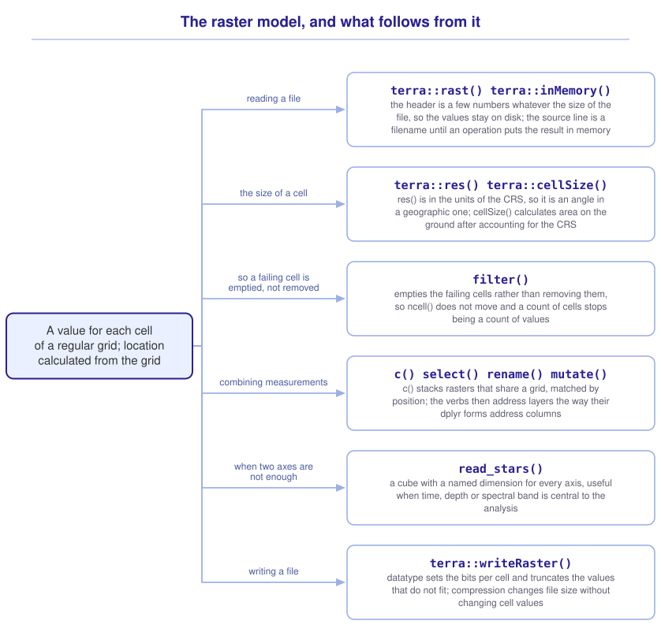

```{r}
#| include: false

library(tidyterra)
library(sf)
library(tidyverse)
library(webexercises)

source("src/r/course_functions.R")
source("src/r/reference_lookup.R")

lesson_refs <- find_lesson_references()
```

<hr>

<div>
{.intro_image fig-alt="Course logo"}

Rasters represent measurements or classes across an area, and are used to characterize environmental features such as land cover, elevation, and temperature. With them we can measure the forest cover within a kilometer of a road, identify the highest ground in a park, or describe how temperature varies across a region.

A **raster** divides an area into a regular **grid** of rows and columns. Each **cell** covers part of that area, and each raster layer stores a [value]{.term} for every cell. A cell's location is calculated from the grid rather than stored in a geometry column.

In this introductory lesson, we will build that mental model before we begin modifying raster data. We will read and draw rasters, examine how their grids determine location, work with multiple layers, and filter values without changing the grid.

In completing this lesson, you will learn how to:

* Read a raster with `rast()` and interpret its printed summary
* Distinguish among a raster's grid, cells, layers, and values
* Determine whether a raster's values remain on disk
* Summarize the values of a raster with `global()`
* Interpret `resolution` and determine whether it represents a distance
* Use the *dplyr* verbs that *tidyterra* provides for rasters
* Explain what happens to cells that fail a filter

**Important!** Before starting this tutorial, be sure that you have completed all preliminary and previous lessons!

</div>

## Data for this lesson

<button class="accordion">Please click on the button below to explore the metadata for this lesson!</button>
::: panel
In this lesson, we will explore:

```{r}
#| echo: false
#| output: asis

lesson_metadata(
  .dataset =
    c(
      "scbi_dem.tif",
      "dc_stack.tif"
    )
) %>%
  cat()
```
:::

## Set up your session

Please complete the following to ensure that you are working in a clean [session]{.term}:

1. Please ensure that your **[Global Environment]{.term}** is empty.
2. In the *History* [tab]{.term} of your **[workspace pane]{.term}**, ensure that your **[session history]{.term}** is empty.

Now that we are working in a clean session:

1. Create a [script]{.term} file.
2. Save your script file as `scripts/introduction_to_rasters.R`.
3. Add [metadata]{.term} as a comment on the top of the file.
4. Following your metadata, create a new **[code section]{.term}** and call it "`setup`".
5. Following your section header, attach *tidyterra* and *sf*, followed by the [packages]{.term term="Package"} that comprise the **core tidyverse**, then load the module 3 [source script]{.term}.

At this point, your script should look something like:

```{r}
#| eval: false

# My code for the introduction to rasters tutorial

# setup --------------------------------------------------------

library(tidyterra)
library(sf)
library(tidyverse)

# Load the source script:

source("scripts/source_script_module_3.R")
```

```{r}
#| include: false

source("scripts/source_script_module_3.R")
```

Notice that *terra* is not attached. We will write every *terra* [function]{.term} with the `terra::` prefix, as in `terra::rast()`, which names the [package]{.term} at the point of the call. The *tidyterra* package allows us to use *dplyr* verbs and  *ggplot2* layers when working with raster data.

## Reading raster data

A raster represents an area by assigning values to a regular grid. The grid describes the locations, while the layers describe what was measured or classified at those locations.

`terra::rast()` reads a raster file. Let's create a code section called "`read and pre-process data`" and read the elevation model for the Smithsonian Conservation Biology Institute:

```{r}
dem <-
  terra::rast("data/raw/gis_scbi/scbi_dem.tif")
```

*Note: `dem` stands for "Digital Elevation Model".*

Highlight and run `dem` to print the metadata of the raster:

```{r}
#| echo: false

dem
```

The printed summary reports the information that defines the raster grid:

* **class** identifies this object as a `SpatRaster`.
* **dimensions** reports the number of rows, columns, and layers. The rows and columns determine the number of cells in the grid. *Note: These cells are sometimes referred to as pixels.*
* **resolution** reports the width and height of each cell in the units of the coordinate reference system (CRS). This is also called the **grain size** of the raster.
* **extent** reports the outer coordinates of the grid in the units of the CRS. It is conceptually similar to a bounding box for spatial vectors.
* **coord. ref.** identifies the CRS of those coordinates. *terra* prints it differently than *sf*, but both describe the same property.

The elevation grid has 745 rows and 778 columns, so it contains 579,610 cells. Each cell represents values at a location, and its position can be calculated from the grid's extent, resolution, row, and column. The raster therefore does not need a geometry column or a stored coordinate pair for every cell.

Notice that the file's single layer is named `Layer_1` on disk. We can use the *tidyterra* function `rename()` change the name of a layer by position. Let's rename the layer as we read it:

```{r}
dem <-
  terra::rast("data/raw/gis_scbi/scbi_dem.tif") %>%
  rename(elevation = 1)
```

Highlight and run `dem` to print the metadata of the raster:

```{r}
#| echo: false

dem
```

::: now_you
 [Now you!]{style="font-size: 1.25em; padding-left: 0.5em;"}

Also read the following file in your `read and pre-process data` section:

* `dc_stack.tif`, from `data/raw/rasters`, assigned to the name `dc`.

[Click here to see my answer]{.answer_link data-answer="a-6-1-read"}

::: {.answer_body #a-6-1-read}

```{r}
# Washington, D.C. land cover, four layers:

dc <-
  terra::rast("data/raw/rasters/dc_stack.tif")
```

:::
:::

### Layers and values

A **raster layer** records a measurement or class across the grid. The elevation model has a single layer, so every cell can contain an elevation value. The `dc` raster has four layers, so every cell can contain four values at the same location. Adding a layer adds another value at each location; it does not add more cells to the grid.

The remaining lines of the printed summary describe the layers and their values:

* **source** identifies the file that supplies the values.
* **name** reports the name of each layer.
* **min value** and **max value** report the range of values in each layer.

A cell remains part of the grid when its value is `NA`. The value is missing, but the cell and its location remain. This distinction will matter when we filter and count raster data later in the lesson.

::: now_you
 [Check your understanding]{style="padding-left: 0.5em;"}

A `SpatRaster` reports `dimensions : 500, 400, 3`. The first two layers have no missing values, and the third has 100,000 missing values. How many cells does the grid contain?

`r longmcq(c(answer = "200,000", "600,000", "1,200", "500"))`

How many nonmissing values does the raster contain?

`r longmcq(c(answer = "500,000", "600,000", "300,000", "100,000"))`

Which information allows R to calculate the location of a cell?

`r longmcq(c(answer = "The extent, resolution, row, and column", "The minimum and maximum values", "The source and layer name", "A coordinate pair stored with every value"))`
:::

## Visualizing raster data

`geom_spatraster()` is *tidyterra*'s layer for a `SpatRaster`, and `scale_fill_hypso_c()` supplies the continuous hypsometric tints used on a topographic map. Let's look at the elevation model:

```{r}
#| fig-alt: "Elevation across the SCBI campus, in longitude and latitude. A ridge crosses the north of the extent and a valley runs out of the southwest corner, holding the lowest elevations on the map."

ggplot() +

  # Add geometries:

  geom_spatraster(data = dem) +

  # Define scale elements:

  scale_fill_hypso_c() +

  # Modify the theme:

  theme_bw()
```

The raster is named in `data = ` inside the geom rather than piped into `ggplot()`, because a `SpatRaster` is not a [data frame]{.term}. Nothing is named in `aes()`: there is a single value per cell, and that is defined in `fill`.

*Note: The "hypso" in* `scale_fill_hypso_c()` *stands for hypsometric data, which are data that describe elevation. The "_c" portion stands for "continuous".*

The console reported something else as well:

> `<SpatRaster> resampled to 500316 cells for plotting`

There are more cells in `dem` than pixels on the screen, so *tidyterra* drew a coarser representation of the grid. Only the display changed; the raster data remain at their original resolution.

## Values on disk and in memory

`rast()` read the file's header, including its grid, layer names, value ranges, and source. It did not load all 579,610 elevation values into memory. A `SpatRaster` may reference cell values in files on disk or retain them in memory. `inMemory()` reports whether the values are currently held in memory:

```{r}
terra::inMemory(dem)
```

Regardless of how large a raster is, its header is small. *terra* accesses the cell values when an operation requires them and can process file-backed values without retaining the entire raster in memory. This behavior allows a `SpatRaster` to work with a file much larger than the available memory. **The `source` line identifies the source of the values, while `inMemory()` reports whether they are held in the current session.**

## Summarizing raster values

Printing a `SpatRaster` reports its structure and metadata rather than printing every cell value. `global()` accesses those values and [summarizes]{.term} an entire layer. Its second argument names the summary or summaries to calculate:

```{r}
dem %>%
  terra::global(
    c(
      "mean",
      "sd",
      "min",
      "max"
    )
  )
```

`global()` returns a row for each layer and a column for each requested summary. It may read values from disk to complete the calculation, but it does not place the full raster in the returned data frame.

::: now_you
 [Check your understanding]{style="padding-left: 0.5em;"}

You call `global()` on a file-backed raster. After returning the summary, must the raster's values remain in memory?

`r torf(FALSE)`

Which result provides the clearest evidence that the values remain file-backed?

`r longmcq(c(answer = "The source is a filename and inMemory() returns FALSE", "The raster has a CRS", "global() returns a data frame", "The raster has multiple layers"))`
:::

::: now_you
 [Now you!]{style="font-size: 1.25em; padding-left: 0.5em;"}

Return the mean of each of the four layers of `dc`, ignoring missing cells, and say why the `land` layer's mean is what it is.

[Click here to see my answer]{.answer_link data-answer="a-6-1-global"}

::: {.answer_body #a-6-1-global}

```{r}
dc %>%
  terra::global(
    "mean",
    na.rm = TRUE
  )
```

Each layer appears in its own row. `land` is 1 in every cell that has a value, so its mean is 1. In that layer the information is in the pattern of missing cells rather than in a range of values. Look at the values of a file before building on them.

:::
:::

## Raster resolution and cell area

The `resolution` of the elevation model is `3.08642e-05`. That is not a length. The file is in a geographic CRS, so a cell is `3.08642e-05` **degrees** on a side, and a degree of longitude is a different distance at the equator than it is at 39°N, where this campus sits.

We use `cellSize()` to turn that into an area on the ground:

```{r}
dem %>%
  terra::cellSize(unit = "m") %>%
  terra::global("mean")
```

About nine square meters, so roughly a three-meter cell. The number in `resolution` is not the distance across a cell, although it is often treated as a distance.

A cell in a geographic CRS is not square on the ground, and its area can vary across a large raster. The value returned by `res()` therefore cannot be treated as a distance. `cellSize()` accounts for the CRS when it calculates area. We still need to check the assumptions made by functions that use distance.

::: now_you
 [Check your understanding]{style="padding-left: 0.5em;"}

A raster prints `resolution : 0.0002777778, 0.0002777778` and `coord. ref. : lon/lat WGS 84`. What is the size of a cell?

`r longmcq(c(answer = "About 0.0003 degrees on a side, which is a different distance in each direction", "About 0.0003 meters on a side", "About 28 meters on a side, everywhere on Earth", "It cannot be worked out without the extent"))`

True or false: `cellSize()` returns the same value for every cell of a raster in a geographic CRS.

`r torf(FALSE)`
:::

Two raster layers can be calculated together only when their grids match (we will explore this in ***6.3 Changing the grid: Resolution, extent and projection***). For now, we will use files that already share a grid or align the grids before building a multi-layer example.

## Multi-layer rasters

A `SpatRaster` can hold several **raster layers** on the same grid. The `dc` file already holds canopy cover, impervious surface, land cover and a layer marking land cells:

```{r}
dc
```

Once rasters share a grid, `c()` stacks their layers in a single `SpatRaster`. To make that operation visible, we can separate two layers of `dc` and stack them again:

```{r}
dc_surfaces <-
  c(
    dc %>%
      select(canopy),
    dc %>%
      select(imp)
  ) %>%
  rename(impervious = imp)
```

```{r}
#| echo: false

dc_surfaces
```

The layers match **by position**, so `c()` accepts only rasters that share a grid. ***6.3 Changing the grid: Resolution, extent and projection*** explains how to make grids agree when they come from different files.

With the layers aligned, we can use dplyr verbs on layers as we use them on columns in a data frame. For example, we can use `select()`to subset the layers in a raster:

```{r}
dc_surfaces %>%
  select(canopy)
```

Likewise, we can use `mutate()` to calculates a new layer. For example, a common terrain measure is height above the lowest point on the grid:

```{r}
# Lowest campus elevation:

low_point <-
  dem %>%
  terra::global("min") %>%
  pull(min)

dem %>%
  mutate(
    relative_elevation = elevation - low_point
  )
```

`mutate()` calculated the new layer at each grid position without matching coordinates.

::: now_you
 [Now you!]{style="font-size: 1.25em; padding-left: 0.5em;"}

Return a raster of the Washington, D.C. area holding canopy cover only where impervious surface is below ten percent, then count the cells that still hold a value.

*Hint: `filter()` empties the cells that fail and `select()` drops a layer, so `filter()` must come first.*

[Click here to see my answer]{.answer_link data-answer="a-6-1-sheltered"}

::: {.answer_body #a-6-1-sheltered}

```{r}
dc %>%

  # Drop cells over 10% impervious:

  filter(imp < 10) %>%

  # Keep the canopy layer:

  select(canopy) %>%

  # Count remaining cells:

  terra::not.na() %>%
  terra::global("sum")
```

`filter()` has to come first. Dropping the `imp` layer before [filtering]{.term} on it leaves nothing to test, and `filter()` stops with `object 'imp' not found`.

:::
:::

## Filtering raster values

`filter()` acts on cell values, but it cannot remove scattered cells without changing the regular grid. A row of a data frame can be dropped because nothing else depends on where it sat. A raster cell has a fixed position relative to every other cell, so cells cannot be removed from the middle of the grid. Instead, the cells that fail a condition remain in place and their values become `NA`:

```{r}
dem %>%
  filter(elevation > 350)
```

Notice that the dimensions, extent, and number of cells are unchanged. `ncell()` returns the number of cells in the grid, including cells that hold `NA`:

```{r}
dem %>%
  filter(elevation > 350) %>%
  terra::ncell()
```

The number of cells did not change, so count the empty cells instead:

```{r}
dem %>%
  filter(elevation > 350) %>%
  is.na() %>%
  terra::global("sum")
```

`not.na()` returns `TRUE` for each cell that still has a value, so summing the result counts the cells above 350 meters:

```{r}
dem %>%
  filter(elevation > 350) %>%
  terra::not.na() %>%
  terra::global("sum")
```

::: mysecret
 [Filtering a raster does not make it smaller]{style="font-size: 1.25em; padding-left: 0.5em;"}

**When you count anything afterward, state what is being counted.** `ncell()` has not changed and the number of nonmissing values has, so a count of cells and a count of values are now different numbers.

**`filter()` is not how you make a large raster manageable.** The filtered result has the same grid and the same number of cell positions. Operations that reduce the dimensions or extent change the grid. We introduce them in ***6.3 Changing the grid: Resolution, extent and projection*** and ***6.4 Rasters and vectors together***.
:::

::: now_you
 [Now you!]{style="font-size: 1.25em; padding-left: 0.5em;"}

By default, `cellSize()` calculates an area for every cell in the grid. Set `mask = TRUE` to maintain cells that are `NA` in the input as `NA` in the result.

Return the total area above 350 meters in hectares. Use the cell values to identify the area, then calculate and sum the areas of those cells. Why would `ncell()` give the wrong answer?

[Click here to see my answer]{.answer_link data-answer="a-6-1-high-area"}

::: {.answer_body #a-6-1-high-area}

```{r}
dem %>%
  filter(elevation > 350) %>%
  terra::cellSize(
    mask = TRUE,
    unit = "ha"
  ) %>%
  terra::global(
    "sum",
    na.rm = TRUE
  )
```

`ncell()` counts every position in the grid, including the cells whose values became `NA`. It returns the size of the original grid as a number of cells. It does not calculate the area above 350 meters.

:::
:::

## Putting it all together

Every function above follows from the structure this lesson opened with: each layer stores a value at every cell of a regular grid, and the grid determines the location. My own model looks like this (click to expand):

{.zoomable data-title="The raster model, and what follows from it" data-pdf-key="raster_model" fig-alt="A figure showing the structure of a raster and what follows from it: each layer stores a value at every cell of a regular grid, with location calculated from the grid rather than stored beside each value. rast() reads the header and points to values that may remain on disk, while inMemory() reports whether values are held in memory. res() reports cell dimensions in the units of the CRS, while cellSize() calculates area on the ground. filter() empties failing cells rather than removing them, so ncell() does not change. c() stacks rasters that share a grid, and select(), rename() and mutate() address their layers."}



::: {.callout-note}

This figure is a visualization of *my* mental model for these functions. It is totally okay if your model differs! What is important is that you have a *working* model, a system that lets you retrieve the function you need to solve a problem.

:::

## Take-home points

* A raster is a regular grid of rows and columns. Each layer stores a value at every cell, and adding a layer adds values rather than locations.
* A cell remains part of the grid when its value is `NA`. Location is calculated from the grid rather than stored beside each value.
* *terra* is not attached, and every *terra* function in this module appears with the `terra::` prefix. *tidyterra* provides the *dplyr* verbs and the *ggplot2* layers for a raster, and those appear without a prefix.
* A raster header is small relative to its cell values, so `rast()` can describe the grid without reading all of those values. The `source` line identifies their source, and `inMemory()` reports whether they are held in the current session.
* `resolution` is measured in the units of the CRS, so it is an angle in a geographic CRS and a length in a projected CRS. `cellSize()` returns a real area either way.
* `filter()` empties the cells that fail rather than removing them, so `ncell()` does not change and a count of cells stops being a count of values.
* `c()` stacks rasters that share a grid, and *tidyterra*'s `select()`, `rename()` and `mutate()` then operate on layers as their *dplyr* forms operate on columns.

## Exercises

::: now_you
 [Test your knowledge!]{style="font-size: 1.25em; padding-left: 0.5em;"}

1. A script that ran yesterday now fills the computer's memory. The rasters have not changed. What should be checked first?

`r longmcq(c(answer = "Whether the values are now held in memory, which inMemory() reports", "Whether the files moved", "Whether the CRS changed", "Whether the resolution is in degrees"))`

2. Parsons problem: Reorder the lines below to count the cells above 350 meters. Leave the line that counts every cell in the raster rather than the cells that still have a value in the trash.

<div class="parsons-problem">
<div id="p-6-1-01-trash" class="sortable-code"></div>
<div id="p-6-1-01-sortable" class="sortable-code"></div>
<div style="clear: both;"></div>
<button id="p-6-1-01-check" class="parsons-btn parsons-btn-check" type="button">Check My Order</button>
<button id="p-6-1-01-reset" class="parsons-btn parsons-btn-reset" type="button">Shuffle Again</button>
<p id="p-6-1-01-feedback" class="parsons-feedback"></p>
</div>

<script>
window.parsonsProblems = window.parsonsProblems || []; window.parsonsProblems.push({ id: "p-6-1-01", maxDistractors: 1, code: "cells_above_350 <-\n  dem %>%\n  filter(elevation > 350) %>%\n  terra::ncell() #distractor\n  terra::not.na() %>%\n  terra::global(\"sum\")" });
</script>

3. `filter()` is called on a raster of 1,000 cells, and 400 of them satisfy the condition. Which pair of results is correct?

`r longmcq(c(answer = "ncell() returns 1,000 and the sum of not.na() returns 400", "ncell() returns 400 and the sum of not.na() returns 400", "ncell() returns 1,000 and the sum of not.na() returns 600", "ncell() returns 400 and the sum of not.na() returns 1,000"))`

4. You need the mean elevation of cells above 350 meters. Which statement answers the question?

`r longmcq(c(answer = "dem %>% filter(elevation > 350) %>% terra::global(\"mean\", na.rm = TRUE)", "dem %>% filter(elevation > 350) %>% terra::ncell()", "dem %>% terra::global(\"mean\") %>% filter(elevation > 350)", "dem %>% select(elevation) %>% terra::global(\"mean\")"))`

5. `geom_spatraster()` draws a raster of 2,000,000 cells and prints a message about resampling. A colleague worries that the original raster was changed. Which explanation is correct?

`r longmcq(c(answer = "Only the display was coarsened. The raster retains its original grid and values", "The raster was permanently reduced to about 500,000 cells", "The first 500,000 cells replaced the original raster", "The raster values were averaged and saved to the source file"))`

6. A `SpatRaster` contains 200,000 cells and three layers. You use `mutate()` to calculate a fourth layer from the first two. What changes?

`r longmcq(c(answer = "The raster has the same 200,000 cells and can hold 800,000 values", "The raster has 800,000 cells and four values", "The raster has the same 200,000 cells and still holds 600,000 values", "The raster gains another grid with 200,000 cells"))`
:::


