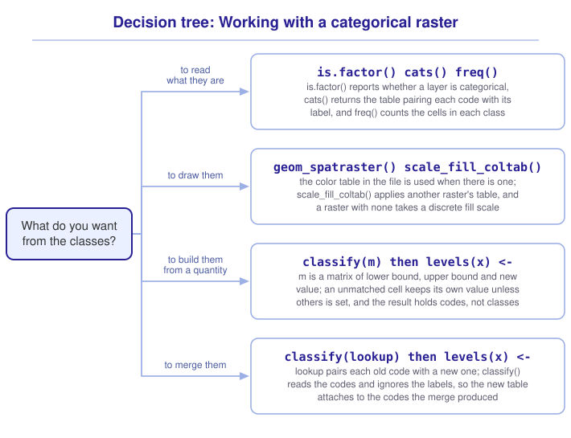

```{r}
#| include: false

library(terra)
library(tidyterra)
library(sf)
library(tidyverse)
library(webexercises)

source("src/r/course_functions.R")
source("src/r/reference_lookup.R")

lesson_refs <- find_lesson_references()
```

<hr>

<div>
{.intro_image fig-alt="Course logo"}

A cell of an elevation raster holds a quantity. Subtract one cell from another and the difference is a number of meters, average a neighborhood and the average is an elevation, and every arithmetic operation in ***6.5 Map algebra*** rests on that.

A cell of a land cover raster holds a code. Class 21 is roads and class 41 is forest, and the average of the two is class 31, which is barren ground that neither cell contained. The number in the cell is a name written as a number, and every operation that treats it as a quantity returns something false.

A **categorical raster** stores a code for every cell and a table pairing each code with its label. This lesson is about that table: reading it, drawing from it, building one from a quantity, and changing it.

In completing this lesson, you will learn how to:

* Recognize a categorical raster and read the table of labels it carries
* Count the cells of each class with `freq()`
* Draw a categorical raster from the color table stored in its file, and from a scale of your own
* Build classes from a quantity with `classify()`
* Merge classes without changing the cells by accident

**Important!** Before starting this tutorial, be sure that you have completed all preliminary and previous lessons!

</div>

## Data for this lesson

<button class="accordion">Please click on the button below to explore the metadata for this lesson!</button>
::: panel
In this lesson, we will explore:

```{r}
#| echo: false
#| output: asis

lesson_metadata(
  .dataset =
    c(
      "scbi_lc.tif",
      "scbi_dem.tif",
      "lc_key_warren_county_va.csv"
    )
) %>%
  cat()
```
:::

## Set up your session

Please complete the following to ensure that you are working in a clean session:

1. Please ensure that your **Global Environment** is empty.
2. In the *History* tab of your **workspace pane**, ensure that your **session history** is empty.

Now that we are working in a clean session:

1. Create a script file.
2. Save your script file as `scripts/categorical_rasters.R`.
3. Add metadata as a comment on the top of the file.
4. Following your metadata, create a new **code section** and call it "`setup`".
5. Following your section header, attach *terra*, *tidyterra*, *sf*, and the packages that comprise the **core tidyverse**, then load the module 3 source script.

At this point, your script should look something like:

```{r}
#| eval: false

# My code for the categorical rasters tutorial

# setup --------------------------------------------------------

library(terra)
library(tidyterra)
library(sf)
library(tidyverse)

# Load the source script:

source("scripts/source_script_module_3.R")
```

```{r}
#| include: false

source("scripts/source_script_module_3.R")
```

Create a code section called "`read and pre-process data`". We read the land cover map of the campus and the elevation model of the same ground:

```{r}
lc <-
  rast("data/raw/gis_scbi/scbi_lc.tif")

dem <-
  rast("data/raw/gis_scbi/scbi_dem.tif")
```

## What a categorical raster carries

Printing the land cover raster returns the same anatomy that ***6.1 Introduction to raster data*** took apart, with two lines the elevation raster did not have:

```{r}
lc
```

`color table` reports that the file carries a color for each class, which we return to below. `categories` names the column holding the labels. `min value` and `max value` appear for both rasters, and here they report class names rather than numbers.

`is.factor()` reports whether a layer is categorical:

```{r}
is.factor(lc)
```

`cats()` returns the table that maps each stored value to its label. It returns one table per layer, in a list, so the first table is the one this single-layer raster holds:

```{r}
cats(lc)[[1]]
```

The cells hold the numbers in `value`. The labels in `category` are attached to the raster in the same way that the levels of a factor are attached to a vector, which is the arrangement ***Preliminary Lesson 3: Values*** introduced with `factor()`.

`freq()` counts the cells in each class:

```{r}
lc %>%
  freq() %>%
  arrange(desc(count))
```

This file was clipped from a land cover map of Warren County, Virginia, and the campus sits in forest with pasture around it.

::: mysecret
 [The codes are not consecutive, and the gaps carry meaning]{style="font-size: 1.25em; padding-left: 0.5em;"}

The values in this table run 13, 21, 22, 23, 24, 25 and onward rather than 1 to 19. Land cover schemes are usually built as a hierarchy, and here the tens digit is the setting: the twenties are developed ground, the forties are woodland, the sixties are riverine wetlands, the eighties are pasture and hay.

The units digit is what sits on that setting, which is why tree canopy is not gathered in one place. `Tree Canopy Over Roads` is 24 and `Tree Canopy Over Structures` is 25, both in the twenties with the pavement they stand over, while `Forest` is 41 and `Riverine Wetlands Tree Canopy` is 64. A question about tree cover has to collect classes from three of these groups, which is the work the last section of this lesson does.

A raster whose codes have gaps is a perfectly ordinary categorical raster, so never renumber one to close them. The gaps are room the scheme left for classes this county does not have.
:::

::: now_you
 [Now you!]{style="font-size: 1.25em; padding-left: 0.5em;"}

How much of this extent is forest, as a proportion of the cells that hold a class?

*Hint: `freq()` returns a data frame, and the rest is arithmetic you have done since ***2.3 Grouped operations and summarizing***.*

[Click here to see my answer]{.answer_link data-answer="a-6-2-forest"}

::: {.answer_body #a-6-2-forest}

```{r}
lc %>%
  freq() %>%
  mutate(
    proportion = count / sum(count)
  ) %>%
  filter(value == "Forest")
```

Dividing by `sum(count)` rather than by `ncell(lc)` is what makes this a proportion of the classified cells. The two agree here, because this file has no missing cells, and they part company the moment a raster has any.

You will learn alternative solutions to this problem in a future lesson.

:::
:::

## Drawing the classes

A land cover file often carries a **color table**, a color for each class stored inside the file, and `geom_spatraster()` uses it when it is there:

```{r}
#| fig-alt: "Land cover around the SCBI campus. Forest covers most of the area in dark green, with pasture in pale yellow to the east and south, and a cluster of roads and structures at the campus itself."

ggplot() +
  geom_spatraster(data = lc)
```

That map needed no scale, and the greens and yellows are the ones the agency that published the file chose. `coltab()` returns the table itself, as a data frame of red, green, blue and alpha for each value.

A categorical raster with no color table draws in the default *ggplot2* colors for a discrete variable, which carry no meaning about land cover or anything else. `scale_fill_coltab()` is what puts a color table back:

```{r}
#| eval: false

ggplot() +
  geom_spatraster(data = some_raster) +
  scale_fill_coltab(data = lc)
```

Reach for it when a raster has been through an operation that dropped its colors, or when you want one raster drawn in the colors of another. A raster that still carries its own table needs no scale at all, and adding one returns the message that a fill scale is already present.

## Building classes from a quantity

Elevation is a quantity, and a question about slope position wants classes. `classify()` turns one into the other. Given a matrix of three columns it reads them as a lower bound, an upper bound, and the value to assign to everything between them:

```{r}
elevation_bands <-
  matrix(
    c(
      224, 250, 1,
      250, 300, 2,
      300, 350, 3,
      350, 400, 4
    ),
    ncol = 3,
    byrow = TRUE
  )

dem %>%
  classify(elevation_bands) %>%
  freq()
```

Four bands were asked for and five rows came back. The extra row holds one cell at value `224`, and that cell is the lowest point in the raster:

```{r}
dem %>%
  global(c("min", "max"))
```

The intervals are closed on the right and open on the left, so a cell sitting exactly on the lowest bound falls into no interval at all. **A value that `classify()` does not match keeps the value it had.** The cell held 224.4741 meters, and 224 is what rounding that to an integer produces, so an elevation walked into the result wearing a class code.

::: mysecret
 [Two arguments, and which one you want]{style="font-size: 1.25em; padding-left: 0.5em;"}

*terra*'s documentation for `others = ` reads: "If not `NULL` all values that are not matched are set to this value. Otherwise they retain their original value." That default is what let the elevation through.

`include.lowest = TRUE` widens the first interval to include its lower bound, which is what this raster needs:

```{r}
elevation_zones <-
  dem %>%
  classify(
    elevation_bands,
    include.lowest = TRUE
  )

elevation_zones %>%
  freq()
```

`others = NA` is the other answer, and it is the one to reach for when a value outside every interval is a value you want to lose rather than to keep. Use it whenever the bounds are meant to cover the data rather than to select part of it, because an unmatched cell is then a mistake you want made visible rather than a class you did not ask for.
:::

Now count the classes:

```{r}
is.factor(elevation_zones)
```

`FALSE`. `classify()` wrote codes, and codes are numbers. The result is a raster of 1, 2, 3 and 4 that R will happily average, and the labels have to be attached separately:

```{r}
levels(elevation_zones) <-
  tibble(
    value = 1:4,
    zone =
      c(
        "Valley floor",
        "Lower slope",
        "Upper slope",
        "Ridge"
      )
  ) %>%
  as.data.frame()

elevation_zones %>%
  freq()
```

The counts did not move and the values are now names. `levels(x) <- ` takes a data frame whose first column is the stored value and whose second is the label, and the name of that second column becomes the raster's category name.

```{r}
is.factor(elevation_zones)
```

A raster built this way carries no color table, because nothing put one there. Give it a discrete fill scale of your own:

```{r}
#| fig-alt: "The SCBI landscape divided into four elevation zones, drawn in a yellow-to-brown ramp. The valley floor runs as a narrow band from the southwest to the northeast, with the ridge classes on the high ground on either side."

ggplot() +
  geom_spatraster(data = elevation_zones) +
  scale_fill_brewer(
    palette = "YlOrBr",
    na.value = "transparent"
  ) +
  labs(fill = "Zone")
```

::: now_you
 [Check your understanding]{style="padding-left: 0.5em;"}

A raster holds elevations from 100 to 900 meters and is classified with bounds at 200, 400 and 600. What happens to a cell holding 750 meters?

`r longmcq(c(answer = "It keeps the value 750", "It is set to NA", "It joins the highest class", "classify() returns an error"))`

True or false: `classify()` returns a categorical raster.

`r torf(FALSE)`
:::

## Merging classes

The land cover file distinguishes nineteen classes, several of which are the same thing seen through different lenses. Three of them are tree canopy over something impervious, and a question about tree cover wants them merged.

The county's land cover key carries a coarser grouping alongside the detailed one:

```{r}
lc_key <-
  read_csv(
    "data/raw/gis_scbi/lc_key_warren_county_va.csv",
    show_col_types = FALSE
  ) %>%
  clean_names() %>%
  select(
    value,
    detailed = landuse,
    general = genlanduse
  )

lc_key %>%
  head(6)
```

Joining that key to the raster's own category table pairs each stored code with the group it belongs to:

```{r}
groups <-
  lc %>%
  cats() %>%
  pluck(1) %>%
  left_join(
    lc_key,
    join_by(value)
  ) %>%
  mutate(
    group_id =
      as.integer(
        factor(general)
      )
  )

groups %>%
  select(
    value,
    category,
    general,
    group_id
  ) %>%
  head(6)
```

Now the merge. The move that suggests itself is to write the new labels over the old ones:

```{r}
relabelled <- lc

levels(relabelled) <-
  groups %>%
  select(value, general) %>%
  as.data.frame()

relabelled %>%
  freq() %>%
  head(8)
```

Three separate rows read `Tree Canopy over Impervious`. The labels changed and the cells did not: the three classes still hold three different codes, so `freq()` still counts them separately. **Relabelling is not reclassifying.**

The cells have to change, and `classify()` is what changes them. Given two columns, `classify()` reads them as an old value and a new one, which is what a set of codes needs:

```{r}
general_cover <-
  lc %>%
  classify(
    groups %>%
      select(value, group_id) %>%
      as.matrix()
  )

levels(general_cover) <-
  groups %>%
  distinct(group_id, general) %>%
  arrange(group_id) %>%
  as.data.frame()

general_cover %>%
  freq() %>%
  arrange(desc(count))
```

The three canopy-over-impervious rows have become one, holding the sum of the three: 22,181 plus 549 plus 4,791.

The second `levels(general_cover) <- ` is the step to watch. `classify()` returned codes, exactly as it did for the elevation bands, and the labels it pairs them with have to be the new group names against the new group codes. Pairing the group names with the codes the raster held before the merge attaches a table for values that no longer exist, and every cell reads `NA`.

::: mysecret
 [Two functions replace values, and only one of them reads the codes]{style="font-size: 1.25em; padding-left: 0.5em;"}

*terra*'s note under `?classify` reads: "classify works with the 'raw' values of categorical rasters, ignoring the levels (labels, categories). To change the labels of categorical rasters, use `subst` instead."

So `classify()` never sees the labels, and a lookup of codes is what it wants. `subst()` is the opposite: on a categorical raster it matches the `from` values against the labels, so handing it the codes returns

> `[subst] all 'from' values are missing, returning a copy of 'x'`

and a raster identical to the one you started with. A warning rather than an error, and a result that looks like a result.

The two are worth keeping straight by what they read rather than by what they do, because both of them replace values:

* `classify()` reads the codes. Use it to merge or bin classes.
* `subst()` reads the labels, on a raster that has them. Use it to replace one class with another by name.
:::

The sequence for a merge is the same every time:

1. Take the category table with `cats()`.
2. Build a lookup that pairs each old code with a new one.
3. `classify()` the codes.
4. Attach the new category table with `levels(x) <- `.

And check the result with `freq()`. The counts of the merged classes must sum to the counts of the classes that went into them, and that is one line of arithmetic you can do against the table you started from.

## Putting it all together

Every operation on a categorical raster is an operation on the table of labels, on the codes in the cells, or on both, and the trouble comes from doing one where the other was needed. My own model for that looks like this (click to expand):

{.zoomable data-title="Decision tree: Working with a categorical raster" data-pdf-key="categorical_rasters" fig-alt="To work with a categorical raster, ask what you want from the classes. To read what they are, is.factor() reports whether a layer is categorical, cats() returns the table pairing each stored code with its label, and freq() counts the cells in each class. To draw them, geom_spatraster() uses the color table stored in the file when there is one, and scale_fill_coltab() applies another raster's table, while a raster with no table takes a discrete fill scale such as scale_fill_brewer(). To build classes from a quantity, classify() takes a matrix of lower bound, upper bound and new value, where an unmatched cell keeps its own value unless others is set, and include.lowest widens the first interval to its lower bound; the result holds codes rather than classes, so attach the labels with levels of x assigned a data frame of value and label. To merge classes, take cats(), join a lookup, drop the categories with levels of x assigned NULL, classify() the codes, and attach the new table, because relabelling changes the labels and not the cells."}



::: {.callout-note}

This tree is a visualization of *my* mental model for these functions. It is totally okay if your model differs! What is important is that you have a *working* model, a system in place that allows you to retrieve the function or functions that you need to solve a problem.

:::

## Take-home points

* A categorical raster stores a code per cell and a table pairing each code with a label. `is.factor()` reports it, `cats()` returns the table, and `freq()` counts the cells in each class.
* The codes of a published classification are usually a hierarchy with gaps in it, and the gaps are part of the scheme rather than a defect to repair.
* `geom_spatraster()` draws a categorical raster in the color table stored in its file. A raster with no table takes a discrete fill scale, and `scale_fill_coltab()` applies the table of another raster.
* `classify()` with a matrix of three columns bins a quantity into intervals, closed on the right and open on the left.
* A value that `classify()` does not match keeps the value it had, so an unmatched cell arrives in the result as a class nobody asked for. `include.lowest = TRUE` catches the lowest bound and `others = NA` discards everything unmatched.
* `classify()` returns codes rather than classes. `levels(x) <- ` attaches the labels, taking a data frame of the stored value and the label.
* Writing new labels over a categorical raster changes the labels and not the cells. Merging classes means `classify()`ing the codes and attaching a new table to the codes that result.
* `classify()` reads the raw codes of a categorical raster and ignores its labels. `subst()` reads the labels, and returns a copy of the raster with a warning when it is handed codes.

## Exercises

::: now_you
 [Test your knowledge!]{style="font-size: 1.25em; padding-left: 0.5em;"}

1. A raster prints `categories : landcover` and `min value : Water`. What do its cells hold?

`r longmcq(c(answer = "A number for each cell, with a table pairing each number with a label", "The character string of the label in each cell", "A factor object in each cell", "Nothing until cats() is called"))`

2. `cats(x)` returns a list rather than a data frame. Why?

`r longmcq(c(answer = "A raster may hold several layers, and each one has its own table", "The table is stored on disk until it is needed", "The list holds the values and the labels separately", "cats() returns one element per class"))`

3. A categorical raster is drawn with `geom_spatraster()` and the classes come out in unfamiliar colors. What is the most likely reason?

`r longmcq(c(answer = "The raster carries no color table, so ggplot2 used its default discrete colors", "geom_spatraster() ignores color tables", "The raster is not categorical", "A continuous fill scale was applied"))`

4. Parsons problem: Reorder the lines below to merge the classes of `lc` into the groups held in `groups`, with the merged classes labelled. One line builds the table of labels from the codes the raster held before the merge, and it drops the column the line after it needs. Leave it in the trash.

<div class="parsons-problem">
<div id="p-6-2-01-trash" class="sortable-code"></div>
<div id="p-6-2-01-sortable" class="sortable-code"></div>
<div style="clear: both;"></div>
<button id="p-6-2-01-check" class="parsons-btn parsons-btn-check" type="button">Check My Order</button>
<button id="p-6-2-01-reset" class="parsons-btn parsons-btn-reset" type="button">Shuffle Again</button>
<p id="p-6-2-01-feedback" class="parsons-feedback"></p>
</div>

<script>
window.parsonsProblems = window.parsonsProblems || []; window.parsonsProblems.push({ id: "p-6-2-01", maxDistractors: 1, code: "general_cover <-\n  lc %>%\n  classify(\n    groups %>%\n      select(value, group_id) %>%\n      as.matrix()\n  )\n\nlevels(general_cover) <-\n  groups %>%\n  select(value, general) %>% #distractor\n  distinct(group_id, general) %>%\n  arrange(group_id) %>%\n  as.data.frame()" });
</script>

5. True or false: a value that falls outside every interval of a `classify()` matrix is set to `NA`.

`r torf(FALSE)`
:::


