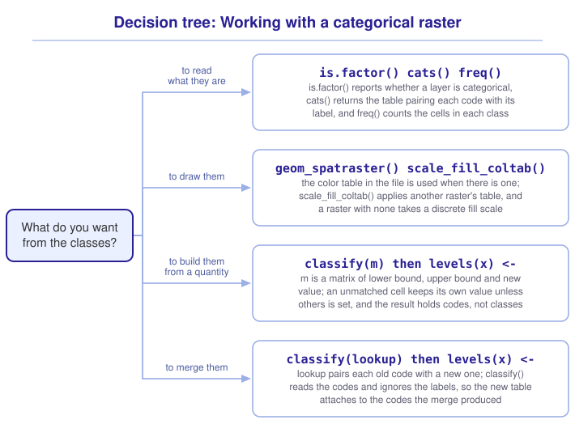

```{r}
#| include: false

library(tidyterra)
library(sf)
library(tidyverse)
library(webexercises)

source("src/r/course_functions.R")
source("src/r/reference_lookup.R")

lesson_refs <- find_lesson_references()
```

<hr>

<div>
{.intro_image fig-alt="Course logo"}

Published land-cover products are often designed for broad use rather than for a particular ecological question. Their classification schemes may distinguish tree canopy over roads from canopy over structures, although an analysis of total canopy cover would combine them. Other questions require us to derive classes from a continuous surface, such as elevation bands used to stratify sampling.

Both tasks require us to work with the codes stored in the raster cells and the table that associates those codes with class labels. Relabeling codes does not merge them, and a poorly defined interval can assign boundary values to the wrong class. The map may still look reasonable, so we need to inspect the codes and their frequencies when checking the result.

In this lesson, we will read and draw a published land-cover classification, build elevation classes with explicitly defined boundaries, and merge detailed land-cover classes into broader groups. These operations provide the foundation for using categorical rasters in later analyses.

In completing this lesson, you will learn how to:

* Recognize a categorical raster and read its table of class codes and labels
* Count the cells of each class with `freq()`
* Draw a categorical raster from the color table stored in its file or from a scale of your own
* Build classes from a quantity with `classify()`
* Distinguish relabeling from merging, then merge classes by changing their codes

**Important!** Before starting this tutorial, be sure that you have completed all preliminary and previous lessons!

</div>

## Data for this lesson

<button class="accordion">Please click on the button below to explore the metadata for this lesson!</button>
::: panel
In this lesson, we will explore:

```{r}
#| echo: false
#| output: asis

lesson_metadata(
  .dataset =
    c(
      "scbi_lc.tif",
      "scbi_dem.tif",
      "lc_key_warren_county_va.csv"
    )
) %>%
  cat()
```
:::

## Set up your session

Please complete the following to ensure that you are working in a clean [session]{.term}:

1. Please ensure that your **[Global Environment]{.term}** is empty.
2. In the *History* [tab]{.term} of your **[workspace pane]{.term}**, ensure that your **[session history]{.term}** is empty.

Now that we are working in a clean session:

1. Create a [script]{.term} file.
2. Save your script file as `scripts/categorical_rasters.R`.
3. Add [metadata]{.term} as a comment on the top of the file.
4. Following your metadata, create a new **[code section]{.term}** and call it "`setup`".
5. Following your section header, attach *tidyterra*, *sf*, and the [packages]{.term term="Package"} that comprise the **core tidyverse**, then load the module 3 [source script]{.term}.

At this point, your script should look something like:

```{r}
#| eval: false

# My code for the categorical rasters tutorial

# setup --------------------------------------------------------

library(tidyterra)
library(sf)
library(tidyverse)

# Load the source script:

source("scripts/source_script_module_3.R")
```

```{r}
#| include: false

source("scripts/source_script_module_3.R")
```

Create a code section called "`read and pre-process data`". Read the land-cover map of the campus and the elevation model of the same area:

```{r}
lc <-
  terra::rast("data/raw/gis_scbi/scbi_lc.tif")

dem <-
  terra::rast("data/raw/gis_scbi/scbi_dem.tif")
```

## Categorical raster structure

A categorical raster stores numeric codes in its cells and associates each code with a class label. Let's begin by printing the land-cover raster. It returns the same anatomy that we explored in ***6.1 Introduction to rasters with terra***, with additional entries for its categories and color table:

```{r}
lc
```

`categories` names the column containing the class labels, and `color table` reports that the file includes colors for those classes. For a categorical raster, `min value` and `max value` display class labels rather than the stored numeric codes.

`terra::is.factor()` reports whether a layer is categorical:

```{r}
terra::is.factor(lc)
```

`cats()` returns the table that maps each stored [value]{.term} to its label. It returns a table for each layer in a [list]{.term}, so this single-layer raster uses the first table:

```{r}
terra::cats(lc)[[1]]
```

The numbers in `value` are the codes stored in the raster cells. The labels in `category` give those codes meaning. This follows the same arrangement introduced with `factor()` in ***Preliminary Lesson 3: Values***: a vector stores values, and its [levels]{.term} associate those values with labels.

We use `freq()` to count the cells in each class:

```{r}
lc %>%
  terra::freq() %>%
  arrange(desc(count))
```

This file was clipped from a land cover map of Warren County, Virginia. Forest is the most common class in the campus extent, followed by pasture and hay.

::: mysecret
 [Land cover codes are not consecutive, and the gaps are meaningful]{style="font-size: 1.25em; padding-left: 0.5em;"}

The values in this table run 13, 21, 22, 23, 24, 25 and onward rather than 1 to 19. Land cover schemes are usually built as a hierarchy, and here the tens digit is the setting: the twenties are developed ground, the forties are woodland, the sixties are riverine wetlands, the eighties are pasture and hay.

The units digit distinguishes the cover within each setting, which is why tree canopy appears under several settings. `Tree Canopy Over Roads` is 24 and `Tree Canopy Over Structures` is 25, both in the twenties with the pavement they stand over, while `Forest` is 41 and `Riverine Wetlands Tree Canopy` is 64. A question about tree cover has to collect classes from several groups. We will explore this in the last section of this lesson.

It is common to have gaps in the class codes of a categorical raster. A missing code may represent a class that is absent from this raster or a place reserved in the broader classification scheme.
:::

::: now_you
 [Now you!]{style="font-size: 1.25em; padding-left: 0.5em;"}

How much of this extent is forest, as a proportion of the classified cells?

*Hint: `freq()` returns a data frame, and the rest is arithmetic you have done since ***2.3 Grouped operations and summarizing***.*

[Click here to see my answer]{.answer_link data-answer="a-6-2-forest"}

::: {.answer_body #a-6-2-forest}

```{r}
lc %>%
  terra::freq() %>%
  mutate(
    proportion = count / sum(count)
  ) %>%
  filter(value == "Forest")
```

Dividing by `sum(count)` rather than by `ncell(lc)` is what makes this a proportion of the classified cells. The two are equal here, because this file has no missing cells, and they differ whenever a raster has any.

:::
:::

## Visualizing categorical rasters

A land cover raster often includes a **color table**, which assigns a color to each class. When that table is present, we can draw the raster without defining a separate fill scale:

```{r}
#| fig-alt: "Land cover around the SCBI campus. Forest covers most of the area in dark green, with pasture in pale yellow to the east and south, and a cluster of roads and structures at the campus itself."

ggplot() +

  # Add geometries:

  geom_spatraster(data = lc)
```

The map above did not require an additional color scale because the publishing agency supplied the colors. `coltab()` returns a list containing the color table for each layer. For this single-layer raster, `coltab(lc)[[1]]` is a [data frame]{.term} of red, green, blue, and alpha values for each class:

```{r}
terra::coltab(lc)[[1]] %>%
  head()
```

A categorical raster with no color table draws in the default *ggplot2* colors for a discrete [variable]{.term}. Those colors provide no information about the land-cover classes. `scale_fill_coltab()` applies an existing color table:

```{r}
#| eval: false

ggplot() +

  # Add geometries:

  geom_spatraster(data = some_raster) +

  # Define scale elements:

  scale_fill_coltab(data = lc)
```

Use it when an operation has removed the colors or when another raster uses the same classes. A raster that already includes a color table does not need an additional scale. Adding a scale returns a message that a fill scale is already present.

## Classifying continuous values

Elevation is continuous, although an analysis may require discrete elevation zones. We might use those zones to distribute survey locations across an elevation gradient. `classify()` assigns ranges of raster values to new class codes. With a three-column [matrix]{.term}, the first two columns define the lower and upper boundaries of each range, and the third defines the new code.

We want to classify every nonmissing elevation, so we need to know the complete range of the data:

```{r}
elevation_range <-
  dem %>%
  terra::global(c("min", "max"))

elevation_range
```

We will divide that range into four zones. The minimum elevation defines the beginning of the first range, and 400 falls above the maximum:

```{r}
elevation_bands <-
  matrix(
    c(
      elevation_range$min, 250, 1,
      250, 300, 2,
      300, 350, 3,
      350, 400, 4
    ),
    ncol = 3,
    byrow = TRUE
  )

elevation_bands
```

Each row states that values between the first two numbers will be replaced by the code in the third column. Before applying that matrix, we have to decide what happens to values that fall exactly on a boundary.

### Class interval boundaries

Boundary rules are, frankly, among the more annoying parts of classification. A value of exactly 250 cannot belong to both the first and second zones, so we have to decide where it belongs. Parentheses and brackets describe that decision:

* `(` and `)` mark an **open** boundary, which excludes the boundary value.
* `[` and `]` mark a **closed** boundary, which includes the boundary value.

The `right = ` argument determines which side of each interval is closed. Its default is `right = TRUE`, which produces intervals such as `(224, 250]`. That interval includes 250 but excludes 224. With `right = FALSE`, the same interval becomes `[224, 250)`. It includes 224 but excludes 250.

As in our earlier lessons on classifying data, a small example makes the boundary rules easier to see. `cut()` uses the same `right = ` and `include.lowest = ` arguments, so we can examine the boundary values directly:

```{r}
tibble(
  elevation = c(224, 250, 300, 350, 400)
) %>%
  mutate(
    default =
      cut(
        elevation,
        breaks = c(224, 250, 300, 350, 400)
      ),
    include_lowest =
      cut(
        elevation,
        breaks = c(224, 250, 300, 350, 400),
        include.lowest = TRUE
      ),
    left_closed =
      cut(
        elevation,
        breaks = c(224, 250, 300, 350, 400),
        include.lowest = TRUE,
        right = FALSE
      )
  )
```

Compare the three results carefully:

* With the defaults, 224 becomes `NA` because `(224, 250]` excludes 224. The value 250 belongs to the first class because the right boundary is closed.
* With `include.lowest = TRUE`, 224 is included in the first class. The internal boundaries do not change, so 250 still belongs to the first class.
* With `right = FALSE`, 250 moves to the second class because `[250, 300)` includes 250. In this case, `include.lowest = TRUE` includes the highest value, 400, which would otherwise fall outside the final interval. Unfortunately, the argument name is particularly unhelpful in this case!

The important distinction is that `right = ` determines how every internal boundary is treated. `include.lowest = TRUE` adds the single outer boundary that would otherwise be excluded. It includes the lowest boundary when `right = TRUE` and the highest boundary when `right = FALSE`.

For our elevation zones, we will use the default `right = TRUE`. The first interval therefore includes elevations from the minimum through 250, the second includes values greater than 250 through 300, and so on. Because the minimum is also the lowest boundary in our matrix, we need `include.lowest = TRUE` to include it:

```{r}
elevation_zones <-
  dem %>%
  terra::classify(
    elevation_bands,
    include.lowest = TRUE
  )

elevation_zones %>%
  terra::freq()
```

Check that the result includes only the requested class codes and that their counts sum to the nonmissing values in `dem`. An unexpected class or a different total means that the boundaries and the data do not match.

::: mysecret
 [When the bounds do not cover the data]{style="font-size: 1.25em; padding-left: 0.5em;"}

A matrix that leaves part of the range uncovered does not produce an error. *A value that `classify()` does not match remains unchanged*, so it appears in the result beside the class codes. The `others = ` argument changes what happens to those unmatched values.

Bands that start at 250 leave every cell below 250 unmatched:

```{r}
dem %>%
  terra::classify(
    matrix(
      c(
        250, 300, 2,
        300, 350, 3,
        350, 400, 4
      ),
      ncol = 3,
      byrow = TRUE
    )
  ) %>%
  terra::freq() %>%
  head(4)
```

The requested class codes are followed by elevations that fell outside the matrix. `freq()` rounds the values it prints, which is why 224.4741 appears here as 224. A leftover elevation and a class code can therefore look identical in this table once the elevations are small [integers]{.term term="Integer"}.

`others = NA` is the remedy for a value outside every interval:

```{r}
dem %>%
  terra::classify(
    matrix(
      c(
        250, 300, 2,
        300, 350, 3,
        350, 400, 4
      ),
      ncol = 3,
      byrow = TRUE
    ),
    others = NA
  ) %>%
  terra::freq()
```

Use it whenever the bands are meant to select part of the range rather than cover all of it, because unmatched cells should then become `NA` rather than remain as values you did not classify. If the goal is to classify the full range, do not use `others = NA` to hide an incomplete matrix. Repair the boundaries instead.
:::

The resulting raster contains numeric class codes but does not yet have a category table:

```{r}
terra::is.factor(elevation_zones)
```

`FALSE`. With the matrix used here, `classify()` assigned the numeric codes 1, 2, 3, and 4. Until we attach labels, R treats those values as a quantity and can calculate a meaningless average of the class codes. `levels(x) <- ` associates a category table with the raster. The first column contains the stored codes, and the second contains their labels:

```{r}
levels(elevation_zones) <-
  tibble(
    value = 1:4,
    zone =
      c(
        "Lowest elevation",
        "Lower elevation",
        "Higher elevation",
        "Highest elevation"
      )
  ) %>%
  as.data.frame()

elevation_zones %>%
  terra::freq()
```

The cell counts did not change, and `freq()` now displays the labels. The name of the table's second column becomes the raster's category name.

```{r}
terra::is.factor(elevation_zones)
```

Attaching labels does not add a color table. Give the raster a discrete fill scale of your own:

```{r}
#| fig-alt: "The SCBI landscape divided into four elevation zones, drawn in a yellow-to-brown ramp. The lowest elevations form a narrow band from the southwest to the northeast, with higher elevations on either side."

ggplot() +

  # Add geometries:

  geom_spatraster(data = elevation_zones) +

  # Define scale elements:

  scale_fill_brewer(
    palette = "YlOrBr",
    na.value = "transparent"
  ) +

  # Add labels:

  labs(fill = "Zone")
```

::: now_you
 [Check your understanding]{style="padding-left: 0.5em;"}

A raster represents elevations from 100 to 900 meters. Its classification matrix covers values from 100 through 600, and `others = ` is not supplied. What happens to a value of 750 meters?

`r longmcq(c(answer = "It remains 750", "It is set to NA", "It joins the highest class", "classify() returns an error"))`

With `right = TRUE`, two adjacent intervals are `(0, 10]` and `(10, 20]`. Which class includes a value of exactly 10?

`r longmcq(c(answer = "The first class", "The second class", "Both classes", "Neither class"))`

With `right = FALSE`, the final interval is `[10, 20)`. Which value does `include.lowest = TRUE` add to the classification?

`r longmcq(c(answer = "20", "10", "0", "Every internal boundary"))`

True or false: using a three-column classification matrix automatically attaches labels to the resulting codes.

`r torf(FALSE)`
:::

## Merging classes

The land-cover file assigns separate codes to tree canopy over roads, structures, and other impervious surfaces. A question about total tree cover may require those detailed classes to share a broader class. This requires changing their codes, not simply giving them the same label.

The county's land-cover key includes both detailed and coarser groupings:

```{r}
lc_key <-
  read_csv(
    "data/raw/gis_scbi/lc_key_warren_county_va.csv",
    show_col_types = FALSE
  ) %>%
  clean_names() %>%
  select(
    value,
    detailed = landuse,
    general = genlanduse
  )

lc_key %>%
  head(6)
```

We need a consistent code for each group in the merged raster. Numbering only the groups present in this tile produces codes that can change with the tile, so `Impervious Roads` may be 5 here and 4 in the next county. We will build the group IDs from the complete county key instead:

```{r}
group_key <-
  lc_key %>%
  distinct(general) %>%
  arrange(general) %>%
  mutate(group_id = row_number())

group_key %>%
  head(6)
```

Joining both keys to the raster's own category table pairs each stored code with a group and a group code:

```{r}
groups <-
  lc %>%
  terra::cats() %>%
  pluck(1) %>%
  left_join(
    lc_key,
    by = join_by(value)
  ) %>%
  left_join(
    group_key,
    by = join_by(general)
  )

groups %>%
  select(
    value,
    category,
    general,
    group_id
  ) %>%
  head(6)
```

A code that appears in the raster but not in the key is assigned to `NA`, and every cell of that class becomes `NA` during [classification]{.term term="Classify or classification"} without a warning. Those cells are then absent from the `freq()` summary, so a check after the merge may not reveal the loss. Check the join before changing the raster:

```{r}
groups %>%
  filter(is.na(group_id))
```

An empty result confirms that every stored code has a group. Any returned row identifies a code that needs a group before we continue.

Relabeling the existing codes may seem sufficient:

```{r}
relabeled <- lc

levels(relabeled) <-
  groups %>%
  select(value, general) %>%
  as.data.frame()

relabeled %>%
  terra::freq() %>%
  head(8)
```

`Tree Canopy over Impervious` still appears on separate rows. The labels changed, but the classes retained their different codes, so `freq()` still counts them separately. **Relabeling is not reclassifying.**

The cell values have to change. Given two columns, `classify()` interprets them as an old code and a new code, which is what we need here:

```{r}
general_cover <-
  lc %>%
  terra::classify(
    groups %>%
      select(value, group_id) %>%
      as.matrix()
  )

levels(general_cover) <-
  groups %>%
  distinct(group_id, general) %>%
  arrange(group_id) %>%
  as.data.frame()

general_cover %>%
  terra::freq() %>%
  arrange(desc(count))
```

`Tree Canopy over Impervious` now appears once, and its count equals the combined counts of the source classes. This confirms that the codes were merged rather than merely relabeled.

The reclassification matrix returned new group codes, so the category table must pair those new codes with the group names. Pairing the group names with the original land-cover codes associates labels with values that the raster no longer uses, and every cell is displayed as `NA`.

To merge categorical raster classes:

1. Take the category table with `cats()`.
2. Build a lookup that pairs each old code with its new code.
3. `classify()` the codes.
4. Attach the new category table with `levels(x) <- `.

Finally, check the result with `freq()`. The counts of the merged classes must sum to the counts of the classes that went into them.

::: now_you
 [Check your understanding]{style="padding-left: 0.5em;"}

An analyst gives codes 24, 25, and 26 the same label, but `freq()` still returns three rows with that label. Why?

`r longmcq(c(answer = "The labels changed, but the cells still use three different codes", "freq() cannot count categorical rasters", "The category table needs three label columns", "The codes must be consecutive before they can be merged"))`

Which operation actually merges the three classes?

`r longmcq(c(answer = "Map the three old codes to a shared new code with classify(), then attach its label", "Assign the same label to all three old codes", "Arrange the category table by its label", "Remove the three rows from the category table"))`
:::

## Putting it all together

Working with a categorical raster means keeping track of two things: the codes in the cells and the table that gives those codes meaning. Some operations change the codes, some change the table, and some require both. My own model for choosing among them looks like this (click to expand):

{.zoomable data-title="Decision tree: Working with a categorical raster" data-pdf-key="categorical_rasters" fig-alt="To work with a categorical raster, ask what you want from the classes. To read what they are, terra::is.factor() reports whether a layer is categorical, cats() returns the table pairing each stored code with its label, and freq() counts the cells in each class. To draw them, geom_spatraster() uses a color table stored in the file when present. scale_fill_coltab() applies the table from another raster with the same classes, while a raster with no table takes a discrete fill scale such as scale_fill_brewer(). To build classes from a quantity, classify() takes a matrix containing a lower bound, an upper bound, and a new value. The right argument determines which side of each interval includes an internal boundary, and include.lowest adds the otherwise excluded outer boundary. Unmatched values remain unchanged unless others is set. In the matrix workflow used here, the result stores numeric codes, so labels are attached by assigning a data frame of codes and labels to levels of x. To merge classes, take cats(), join a lookup, classify() the codes, and attach the new table. Relabeling changes the labels but does not merge the codes in the cells."}



::: {.callout-note}

This tree is a visualization of *my* mental model for these [functions]{.term term="Function"}. It is totally okay if your model differs! What is important is that you have a *working* model, a system in place that allows you to retrieve the function or functions that you need to solve a problem.

:::

## Take-home points

* A categorical raster stores a code per cell and a table pairing each code with a label. `terra::is.factor()` reports it, `cats()` returns the table, and `freq()` counts the cells in each class.
* The codes of a published classification are usually a hierarchy with gaps in it, and the gaps are part of the scheme rather than a defect to repair.
* `geom_spatraster()` draws a categorical raster in the color table stored in its file. A raster with no table takes a discrete fill scale, and `scale_fill_coltab()` applies the table of another raster with the same classes.
* `classify()` with a matrix of three columns assigns ranges of values to new class codes. With `right = TRUE`, intervals are open on the left and closed on the right. With `right = FALSE`, they are closed on the left and open on the right.
* `include.lowest = TRUE` includes the outer boundary that would otherwise be excluded. That is the lowest boundary when `right = TRUE` and the highest boundary when `right = FALSE`.
* A value that `classify()` does not match remains unchanged, so an elevation may appear among the class codes. `others = NA` sets unmatched values to missing. The counts of a complete classification should sum to the number of nonmissing values in the original raster.
* With the matrices used in this lesson, `classify()` returns numeric codes rather than labeled classes. `levels(x) <- ` attaches the labels using a data frame of the stored codes and their labels.
* Writing new labels over a categorical raster changes the labels and not the cells. Merging classes means using `classify()` on the codes and attaching a new table to the codes that result.
* Build the IDs for merged classes from the complete key rather than deriving them separately from each tile, so that the IDs remain consistent across tiles.

## Exercises

::: now_you
 [Test your knowledge!]{style="font-size: 1.25em; padding-left: 0.5em;"}

1. A raster prints `categories : landcover` and `min value : Water`. What is assigned to its cells?

`r longmcq(c(answer = "A number for each cell, with a table pairing each number with a label", "The character string of the label in each cell", "A factor object in each cell", "Nothing until cats() is called"))`

2. `cats(x)` returns a list rather than a data frame. Why?

`r longmcq(c(answer = "A raster may include several layers, and each layer has its own table", "The table is stored on disk until it is needed", "The list separates the values from the labels", "cats() returns an element for each class"))`

3. A categorical raster is drawn with `geom_spatraster()` and the classes come out in unfamiliar colors. What is the most likely reason?

`r longmcq(c(answer = "The raster includes no color table, so ggplot2 used its default discrete colors", "geom_spatraster() ignores color tables", "The raster is not categorical", "A continuous fill scale was applied"))`

4. You intended to build four classes, but `freq()` returns five rows. What should you check first?

`r longmcq(c(answer = "Whether a value fell outside the intervals and retained its original value", "Whether the raster has five layers", "Whether two intervals were given the same class code", "Whether the category table contains a fifth label"))`

5. After merging classes, the counts returned by `freq()` sum to fewer cells than the original raster. What should you inspect first?

`r longmcq(c(answer = "Whether any joined row has a missing group_id", "Whether the category labels are in alphabetical order", "Whether the raster includes a color table", "Whether the group IDs are consecutive"))`
:::


