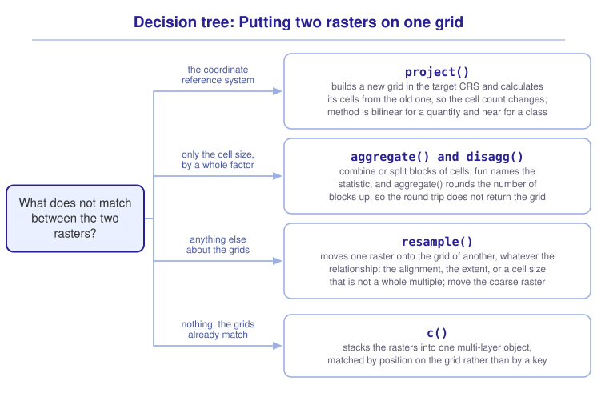

```{r}
#| include: false

library(terra)
library(tidyterra)
library(sf)
library(tidyverse)
library(webexercises)

source("src/r/course_functions.R")
source("src/r/reference_lookup.R")

lesson_refs <- find_lesson_references()
```

<hr>

<div>
{.intro_image fig-alt="Course logo"}

Two spatial vector objects can be compared whatever their extents, because each feature carries its own coordinates and `st_intersects()` will find the pairs. Two rasters cannot. An operation between rasters works cell against cell, and that only means something when the two grids are the same grid: the same cell size, the same alignment, the same extent, the same coordinate reference system.

Rasters arrive on the grids they were built for. An elevation model comes from one agency at one resolution, a canopy layer from another at another, and a climate surface from a third at a third, and each of those grids is right for the job it was made for. Getting them onto one grid is our job, and it is the pre-processing that raster work is mostly made of.

In completing this lesson, you will learn how to:

* Recognize the error that two mismatched grids produce
* Change the coordinate reference system of a raster with `project()`, and say what it does to the grid
* Make a raster coarser with `aggregate()` and finer with `disagg()`
* Put one raster onto the grid of another with `resample()`
* Choose a resampling method that suits the values a raster holds

**Important!** Before starting this tutorial, be sure that you have completed all preliminary and previous lessons!

</div>

## Data for this lesson

<button class="accordion">Please click on the button below to explore the metadata for this lesson!</button>
::: panel
In this lesson, we will explore:

```{r}
#| echo: false
#| output: asis

lesson_metadata(
  .dataset =
    c(
      "scbi_dem.tif",
      "scbi_canopy_cover.tif",
      "scbi_lc.tif"
    )
) %>%
  cat()
```
:::

## Set up your session

Please complete the following to ensure that you are working in a clean session:

1. Please ensure that your **Global Environment** is empty.
2. In the *History* tab of your **workspace pane**, ensure that your **session history** is empty.

Now that we are working in a clean session:

1. Create a script file.
2. Save your script file as `scripts/changing_the_grid.R`.
3. Add metadata as a comment on the top of the file.
4. Following your metadata, create a new **code section** and call it "`setup`".
5. Following your section header, attach *terra*, *tidyterra*, *sf*, and the packages that comprise the **core tidyverse**, then load the module 3 source script.

At this point, your script should look something like:

```{r}
#| eval: false

# My code for the changing the grid tutorial

# setup --------------------------------------------------------

library(terra)
library(tidyterra)
library(sf)
library(tidyverse)

# Load the source script:

source("scripts/source_script_module_3.R")
```

```{r}
#| include: false

source("scripts/source_script_module_3.R")
```

Create a code section called "`read and pre-process data`". Two rasters cover the campus: an elevation model, and a canopy cover layer at a coarser resolution.

```{r}
dem <-
  rast("data/raw/gis_scbi/scbi_dem.tif")

canopy <-
  rast("data/raw/gis_scbi/scbi_canopy_cover.tif")
```

## Two rasters, one grid

Suppose we want elevation and canopy cover in one object, so that a later question can use both. Adding them is meaningless, but it is the shortest way to find out whether the grids agree:

```{r}
#| error: true

dem + canopy
```

> `[+] extents do not match`

Every arithmetic operation, every `mutate()`, and every attempt to stack the two into one object will return that. Look at why:

```{r}
res(dem)

res(canopy)
```

```{r}
ext(dem)

ext(canopy)
```

`res()` returns the size of a cell and `ext()` returns the bounding box of the grid, both of which we first saw in the printed summary in ***6.1 Introduction to raster data***. The cells are different sizes and the boxes are in different places, and either on its own is enough to stop the operation.

`res(dem)` reports the same number in x and in y, which reads as a square cell. It is not one. Both numbers are in degrees, and a degree of longitude is shorter than a degree of latitude everywhere except the equator.

`cellSize()` returns the true area of every cell, in a unit named by its `unit = ` argument:

```{r}
dem %>%
  cellSize(unit = "m") %>%
  global(c("min", "max"))
```

About nine square meters, which for this raster is a cell of roughly 2.7 meters east to west and 3.4 meters north to south.

::: mysecret
 [What a rectangular cell costs]{style="font-size: 1.25em; padding-left: 0.5em;"}

Anything measured in cells rather than in meters measures a different distance in each direction on a raster like this one. A moving window of three cells by three cells is a rectangle on the ground, eight meters across and ten deep, and a distance calculated by counting cells is wrong by up to a fifth depending on which way it runs.

The ratio is not fixed either. It is the cosine of the latitude, so a raster spanning a wide range of latitudes has cells that change shape from the bottom of the file to the top, and no single correction fixes it. Projecting is the only repair.
:::

## Projecting a raster

`project()` changes the CRS of a raster. It cannot do what `st_transform()` does for a vector, which is to move each coordinate and leave everything else alone, because moving the corners of a grid does not leave a grid: the cells arrive rotated and no longer aligned to the axes. `project()` therefore builds a new grid in the target CRS and calculates a value for each of its cells from the old one.

SCBI is in UTM zone 17N, which `lonlat_to_utm()` from the module 3 source script returns:

```{r}
scbi_epsg <-
  lonlat_to_utm(
    c(-78.162, 38.890)
  )
```

```{r}
#| echo: false

scbi_epsg
```

```{r}
dem_utm <-
  dem %>%
  project(paste0("EPSG:", scbi_epsg))
```

```{r}
#| echo: false

dem_utm
```

The resolution is now about three meters, which is a number that can be pictured. Note what else changed. The dimensions are no longer 745 by 778, the extent is in meters, and the source line reads `memory` rather than a file name, because these values were calculated rather than read.

Compare the cell counts:

```{r}
ncell(dem)

ncell(dem_utm)
```

Projecting a raster resamples it. Every value in `dem_utm` was interpolated from the values around it in `dem`, so the two rasters do not hold the same numbers, and projecting back would not return the original.

::: mysecret
 [Project once, and project the right object!]{style="font-size: 1.25em; padding-left: 0.5em;"}

Each projection of a raster is a resampling, and each resampling loses a little detail. Projecting a raster twice is worse than projecting it once, so decide on the CRS of your analysis before you start rather than transforming back and forth as each question comes up.

Where a raster and a vector have to be brought together, project the *vector*. `st_transform()` moves a vector's coordinates exactly, and a raster cannot be moved exactly. The rule holds until the raster is the thing being measured in real units, at which point the raster has to be in a projected CRS regardless.
:::

The `method = ` argument decides how each new cell's value is calculated, and it has to suit the values:

* `"bilinear"` returns a weighted average of the four nearest cells. Use it for a continuous quantity, which is the default for one.
* `"near"` returns the value of the nearest cell. Use it for a class, which is the default for a categorical raster.

Averaging class codes is the failure the second option exists to prevent. Land cover class 21 is roads and class 41 is forest, and the average of the two is class 31, which is barren ground that neither cell contained.

## Coarser and finer

Two rasters can share a CRS and still not share a grid, because the cells are different sizes. `aggregate()` makes a raster coarser by combining blocks of cells:

```{r}
dem_coarse <-
  dem %>%
  aggregate(
    fact = 10,
    fun = "mean",
    na.rm = TRUE
  )
```

```{r}
#| echo: false

dem_coarse
```

`fact = 10` means blocks of ten cells by ten cells, so a hundred cells become one, and `fun = ` names the statistic that combines them. The resolution is ten times larger and the number of cells is about a hundredth of what it was.

`disagg()` goes the other way, splitting each cell into a block:

```{r}
dem %>%
  aggregate(
    fact = 10,
    fun = "mean",
    na.rm = TRUE
  ) %>%
  disagg(
    fact = 10,
    method = "bilinear"
  ) %>%
  dim()
```

```{r}
dim(dem)
```

750 by 780 against 745 by 778, so the round trip did not return the grid it started from. 745 rows do not divide into blocks of ten, and `aggregate()` rounds the count of blocks up rather than discarding the remainder, which leaves the last row and column of blocks hanging over the edge of the original extent.

That overhang is also where the missing values come from:

```{r}
dem %>%
  aggregate(
    fact = 10,
    fun = "mean"
  ) %>%
  is.na() %>%
  global("sum")
```

152 cells of the aggregated raster are `NA`, and every one of them is a block that reached past the edge of the data. `na.rm = TRUE` inside `aggregate()`, which the call above deliberately omitted, calculates those blocks from the cells they do cover.

::: now_you
 [Check your understanding]{style="padding-left: 0.5em;"}

A raster of 30-meter cells is aggregated with `fact = 3`. What is the resolution of the result?

`r longmcq(c(answer = "90 meters", "10 meters", "30 meters", "It depends on the function supplied to fun ="))`

True or false: `disagg()` recovers the values that `aggregate()` combined.

`r torf(FALSE)`
:::

## Onto another raster's grid

`aggregate()` and `disagg()` change a grid by whole factors, which is rarely enough. `resample()` puts a raster onto the grid of another raster, whatever the relationship between them:

```{r}
canopy_on_dem <-
  canopy %>%
  resample(
    dem,
    method = "bilinear"
  )
```

```{r}
#| echo: false

canopy_on_dem
```

The first argument is the raster being moved and the second is the raster whose grid it is being moved onto. The result has the **extent**, the **resolution** and the CRS of `dem`, and the values of `canopy`. **Bilinear interpolation** is the method that calculated them, weighting the four nearest cells of the source by how close each one is.

Now the operation that failed at the top of this lesson runs:

```{r}
dem + canopy_on_dem
```

That sum is still meaningless, and it is the test that the grids agree. In practice the next step is to combine the two into one multi-layer object, which is what a shared grid is for:

```{r}
campus <-
  c(dem, canopy_on_dem)

names(campus) <-
  c("elevation", "canopy")
```

```{r}
#| echo: false

campus
```

`c()` stacks rasters that share a grid into a **raster stack**, and it is the raster counterpart of the joins in ***4.3 Non-spatial joins***. The layers are matched by position on the grid rather than by a key, which is why the grid has to be identical first.

::: mysecret
 [Resample the coarse raster, not the fine one!]{style="font-size: 1.25em; padding-left: 0.5em;"}

`resample()` will move a raster in either direction, and the direction changes what the result claims.

Moving a coarse raster onto a fine grid, as we did above, invents no information: each fine cell takes a value interpolated from the coarse cells around it, and the result is as coarse as it ever was while looking finer. That is usually acceptable, and it is worth saying in the methods.

Moving a fine raster onto a coarse grid with `"bilinear"` throws information away in a way that is harder to defend, because a weighted average of four cells is not the average of the block the coarse cell covers. Where the coarse grid is the target, `aggregate()` to something close to it first, then `resample()`.

And where the values are classes, both directions need `method = "near"`.
:::

::: now_you
 [Now you!]{style="font-size: 1.25em; padding-left: 0.5em;"}

Put the land cover raster onto the grid of the elevation raster, keeping its classes intact, and confirm that the classes survived.

*Hint: The values are classes rather than quantities, and `is.factor()` reports whether a layer is categorical (see ***6.1 Introduction to raster data***).*

[Click here to see my answer]{.answer_link data-answer="a-6-3-resample"}

::: {.answer_body #a-6-3-resample}

```{r}
lc <-
  rast("data/raw/gis_scbi/scbi_lc.tif")

lc_on_dem <-
  lc %>%
  resample(
    dem,
    method = "near"
  )

is.factor(lc_on_dem)
```

```{r}
lc_on_dem %>%
  freq() %>%
  arrange(desc(count)) %>%
  head(4)
```

`method = "near"` is what keeps the classes. With `"bilinear"` the call still runs, the categories are dropped, and the cells hold averages of the class codes, which name classes that were never there.

This is also a case of moving a fine raster onto a coarser grid: the land cover file has cells of about a meter and the elevation raster has cells of about three, so most of the land cover is being discarded. For a question about the class at a point that is fine. For a question about how much of each class there is, aggregate the land cover with `fun = "modal"` instead and say so.

You will learn alternative solutions to this problem in a future lesson.

:::
:::

## Putting it all together

Getting two rasters onto one grid is a sequence of questions, and each has one function that answers it. My own model for that looks like this (click to expand):

{.zoomable data-title="Decision tree: Putting two rasters on one grid" data-pdf-key="matching_grids" fig-alt="To put two rasters on one grid, ask what does not match between them. For the coordinate reference system, project() builds a new grid in the target CRS and calculates its cells from the old one, so the cell count changes, and method is bilinear for a quantity and near for a class. For only the cell size, by a whole factor, aggregate() and disagg() combine or split blocks of cells, fun names the statistic, and aggregate() rounds the number of blocks up, so the round trip does not return the grid. For anything else about the grids, resample() moves one raster onto the grid of another, whatever the relationship: the alignment, the extent, or a cell size that is not a whole multiple; move the coarse raster. For nothing, when the grids already match, c() stacks the rasters into one multi-layer object, matched by position on the grid rather than by a key."}



::: {.callout-note}

This tree is a visualization of *my* mental model for these functions. It is totally okay if your model differs! What is important is that you have a *working* model, a system in place that allows you to retrieve the function or functions that you need to solve a problem.

:::

## Take-home points

* An operation between two rasters works cell against cell, so the grids have to be identical. `[+] extents do not match` is what a mismatch returns.
* `res()` in a geographic CRS reports degrees, and a degree of longitude is shorter than a degree of latitude. `cellSize()` returns the true area of each cell in a unit you name.
* `project()` builds a new grid in the target CRS and calculates its values from the old one, so projecting a raster is a resampling and the cell count changes. Project a vector rather than a raster wherever the choice exists.
* `method = "bilinear"` averages the nearest cells and suits a quantity. `method = "near"` takes the nearest cell's value and is what a class needs.
* `aggregate()` combines blocks of cells with the statistic named by `fun = `, and `disagg()` splits each cell into a block. `aggregate()` rounds the number of blocks up, so the last row and column can reach past the data and return `NA`.
* `resample()` puts one raster onto another's grid. Move the coarse raster onto the fine grid rather than the reverse.
* `c()` stacks rasters that share a grid into one multi-layer object.

## Exercises

::: now_you
 [Test your knowledge!]{style="font-size: 1.25em; padding-left: 0.5em;"}

1. Two rasters share a CRS and a resolution, and an operation between them still returns `extents do not match`. What is the fix?

`r longmcq(c(answer = "resample() one onto the grid of the other", "project() one into the CRS of the other", "aggregate() one by the ratio of their resolutions", "c() them into one object, which aligns them"))`

2. A land cover raster is projected with `method = "bilinear"`. What is wrong with the result?

`r longmcq(c(answer = "The cells hold averages of class codes, which name classes that were not there", "The call returns an error naming the categorical layer", "The classes are kept but the cells are misaligned", "Nothing, because bilinear is the default for every raster"))`

3. Why does `project()` change the number of cells in a raster?

`r longmcq(c(answer = "It builds a new axis-aligned grid in the target CRS rather than moving the old cells", "It always aggregates by a factor of two", "It drops the cells that fall outside the target CRS", "It adds a row and a column of padding"))`

4. Parsons problem: Reorder the lines below to return a two-layer raster of elevation and canopy cover on the elevation grid, in UTM zone 17N. Canopy cover is a percentage. One line supplies the resampling method that a class needs rather than the one a quantity needs. Leave it in the trash.

<div class="parsons-problem">
<div id="p-6-3-01-trash" class="sortable-code"></div>
<div id="p-6-3-01-sortable" class="sortable-code"></div>
<div style="clear: both;"></div>
<button id="p-6-3-01-check" class="parsons-btn parsons-btn-check" type="button">Check My Order</button>
<button id="p-6-3-01-reset" class="parsons-btn parsons-btn-reset" type="button">Shuffle Again</button>
<p id="p-6-3-01-feedback" class="parsons-feedback"></p>
</div>

<script>
window.parsonsProblems = window.parsonsProblems || []; window.parsonsProblems.push({ id: "p-6-3-01", maxDistractors: 1, code: "dem_utm <-\n  dem %>%\n  project(\"EPSG:32617\")\n\ncanopy_utm <-\n  canopy %>%\n  project(\"EPSG:32617\") %>%\n  resample(dem_utm, method = \"near\") #distractor\n  resample(dem_utm, method = \"bilinear\")\n\ncampus <-\n  c(dem_utm, canopy_utm)" });
</script>

5. True or false: Projecting a raster and projecting it back returns the values it started with.

`r torf(FALSE)`
:::


