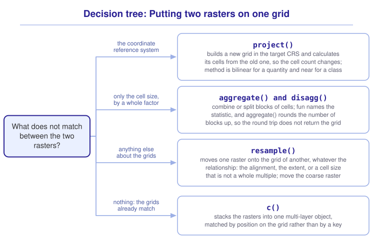

```{r}
#| include: false

library(tidyterra)
library(sf)
library(tidyverse)
library(webexercises)

source("src/r/course_functions.R")
source("src/r/reference_lookup.R")

lesson_refs <- find_lesson_references()
```

<hr>

<div>
{.intro_image fig-alt="Course logo"}

Raster layers assembled for the same study area rarely share a grid. Elevation, canopy cover, land cover, and climate products may differ in their coordinate reference systems, resolutions, extents, and alignments. A cell-by-cell calculation is meaningful only after matching positions in the rasters represent the same area on the ground.

Choosing a shared grid is part of the analysis. Its resolution determines the spatial detail retained, and the method used to calculate new cell values determines how the source data are represented. Continuous measurements can be interpolated or summarized, while categorical classes must retain valid class codes.

In this lesson, we will diagnose grid mismatches and choose an appropriate operation for resolving them. We will project, aggregate, disaggregate, and resample rasters, then verify that the resulting grid and values remain appropriate for the analysis.

In completing this lesson, you will learn how to:

* Recognize the error that two mismatched grids produce
* Project continuous and categorical rasters with methods suited to their values, then verify the result
* Make a raster coarser with `aggregate()` and finer with `disagg()`
* Put a raster onto the grid of another with `resample()`
* Choose a resampling method that suits the [values]{.term term="Value"} represented by a raster

**Important!** Before starting this tutorial, be sure that you have completed all preliminary and previous lessons!

</div>

## Data for this lesson

<button class="accordion">Please click on the button below to explore the metadata for this lesson!</button>
::: panel
In this lesson, we will explore:

```{r}
#| echo: false
#| output: asis

lesson_metadata(
  .dataset =
    c(
      "scbi_dem.tif",
      "scbi_canopy_cover.tif",
      "scbi_lc.tif"
    )
) %>%
  cat()
```
:::

## Set up your session

Please complete the following to ensure that you are working in a clean [session]{.term}:

1. Please ensure that your **[Global Environment]{.term}** is empty.
2. In the *History* [tab]{.term} of your **[workspace pane]{.term}**, ensure that your **[session history]{.term}** is empty.

Now that we are working in a clean session:

1. Create a [script]{.term} file.
2. Save your script file as `scripts/changing_the_grid.R`.
3. Add [metadata]{.term} as a comment on the top of the file.
4. Following your metadata, create a new **[code section]{.term}** and call it "`setup`".
5. Following your section header, attach *tidyterra*, *sf*, and the [packages]{.term term="Package"} that comprise the **core tidyverse**, then load the module 3 [source script]{.term}.

At this point, your script should look something like:

```{r}
#| eval: false

# My code for the changing the grid tutorial

# setup --------------------------------------------------------

library(tidyterra)
library(sf)
library(tidyverse)

# Load the source script:

source("scripts/source_script_module_3.R")
```

```{r}
#| include: false

source("scripts/source_script_module_3.R")
```

Create a code section called "`read and pre-process data`". Read the elevation model and the coarser canopy-cover raster for the same campus:

```{r}
dem <-
  terra::rast("data/raw/gis_scbi/scbi_dem.tif")

canopy <-
  terra::rast("data/raw/gis_scbi/scbi_canopy_cover.tif")
```

## Diagnosing grid mismatches

Suppose that we want to combine elevation and canopy cover in a multi-layer raster. `compareGeom()` tests whether the grids match. With `stopOnError = FALSE`, it returns a logical value instead of stopping the script. `messages = TRUE` also reports the first mismatch:

```{r}
terra::compareGeom(
  dem,
  canopy,
  stopOnError = FALSE,
  messages = TRUE
)
```

The result is `FALSE`, and the message identifies the extents as the first mismatch. Other pairs of rasters may first differ in their dimensions or CRS. An operation between mismatched rasters stops at the first of these differences:

```{r}
#| error: true

dem + canopy
```

Adding elevation and canopy cover does not answer a useful question. We use the calculation only to show the error produced by an operation between mismatched grids.

`res()` returns the size of a cell and `ext()` returns the [bounding box]{.term} of the grid. Both appear in the printed summary introduced in ***6.1 Introduction to rasters with terra***:

```{r}
terra::res(dem)

terra::res(canopy)
```

The cells are different sizes, and the grid extents also differ:

```{r}
terra::ext(dem)

terra::ext(canopy)
```

The **resolution** describes the cell size. The **extent** describes the outer boundaries of the grid. A third property, the **origin**, anchors the grid so that the cell boundaries align. Two rasters can have the same resolution but different origins, which means that their cell boundaries do not line up.

```{r}
terra::origin(dem)

terra::origin(canopy)
```

Any of these differences is enough to stop an operation that compares values cell by cell.

The grid boundaries make these differences easier to see. The following map draws the cells within a small window at the northwest corner of the campus:

```{r}
#| echo: false
#| fig-alt: "A square window of the two grids, drawn as outlines. The elevation cells are a fine grey mesh and the canopy cells are a coarse black lattice about nine times larger in each direction. No edge of the black lattice falls along an edge of the grey mesh, and the two grids begin and end in different places."

window <-
  terra::ext(
    -78.1740,
    -78.1728,
    38.9008,
    38.9020
  )

grid_cells <-
  bind_rows(
    dem %>%
      terra::crop(window) %>%
      terra::as.polygons(dissolve = FALSE) %>%
      st_as_sf() %>%
      mutate(raster = "elevation"),
    canopy %>%
      terra::crop(window) %>%
      terra::as.polygons(dissolve = FALSE) %>%
      st_as_sf() %>%
      mutate(raster = "canopy")
  ) %>%
  select(raster)

grid_cells %>%

  # Initialize the plot with the data:

  ggplot() +

  # Map data to visual elements:

  aes(
    color = raster,
    linewidth = raster
  ) +

  # Add geometries:

  geom_sf(fill = NA) +

  # Define scale elements:

  scale_color_manual(
    values =
      c(
        elevation = "grey70",
        canopy = "black"
      )
  ) +
  scale_linewidth_manual(
    values =
      c(
        elevation = 0.2,
        canopy = 0.6
      )
  ) +

  # Add labels:

  labs(
    color = NULL,
    linewidth = NULL
  ) +

  # Modify the theme:

  theme_void()
```

The canopy cells are about nine times the width of the elevation cells. Their edges do not align with the elevation grid, and the two grids begin and end in different places. Because both rasters use the same CRS, we will use `resample()` later in this lesson to place canopy cover on the elevation grid.

`res(dem)` reports the same number in x and in y, which may appear to describe a square cell. The cell is not square on the ground. Both numbers are in degrees, and outside the tropics a degree of longitude is shorter than a degree of latitude. Within about ten degrees of the equator the two are close to equal, and at the equator itself a degree of longitude is slightly the longer of the two.

`cellSize()` returns the true area of every cell, in a unit named by its `unit = ` argument:

```{r}
dem %>%
  terra::cellSize(unit = "m") %>%
  terra::global(c("min", "max"))
```

About nine square meters, which for this raster is a cell of roughly 2.7 meters east to west and 3.4 meters north to south.

::: mysecret
 [Optional: What a rectangular cell costs]{style="font-size: 1.25em; padding-left: 0.5em;"}

Anything measured in cells rather than in meters measures a different distance in each direction on this raster. A moving window of three cells by three cells is a rectangle on the ground, eight meters across and ten deep, and a distance calculated by counting cells is wrong by up to a fifth depending on which way it runs.

The ratio is not fixed either. It changes approximately with the cosine of latitude, so a raster spanning a wide range of latitudes has cells that change shape from the bottom of the file to the top. A projected CRS is the practical answer when an analysis needs planar distances or a fixed neighborhood on the ground.
:::

## Projecting a raster

We use `project()` to change the CRS of a raster. It cannot do what `st_transform()` does for a vector, which is to move each coordinate and leave everything else alone, because moving the corners of a grid does not leave a grid: the cells come out rotated and no longer aligned to the axes. `project()` therefore builds a new grid in the target CRS and calculates its values from the source grid.

SCBI is in UTM zone 17N. The elevation raster uses NAD83, so we will keep its [datum]{.term} and use NAD83 / UTM zone 17N (EPSG 26917):

```{r}
dem_utm <-
  dem %>%
  terra::project("EPSG:26917")
```

```{r}
#| echo: false

dem_utm
```

The resolution is now about three meters. The dimensions also changed, the extent is reported in meters, and the source line reads `memory` because *terra* calculated new values during the projection.

Compare the cell counts:

```{r}
terra::ncell(dem)

terra::ncell(dem_utm)
```

Projecting a raster requires resampling it. Every value in `dem_utm` was calculated from nearby values in `dem`, so projecting it back would not recover the original raster. The new grid is aligned with the axes of the projected CRS. Its corners extend beyond the source data and contain `NA`.

::: mysecret
 [Project once, and project the right object!]{style="font-size: 1.25em; padding-left: 0.5em;"}

Each [projection]{.term} of a raster is a resampling that can alter values or spatial detail. Decide on the CRS of the analysis before starting rather than transforming back and forth as each question comes up.

Where a raster and a vector have to be brought together, transform the *vector*. `st_transform()` changes the vector's [coordinates]{.term} without resampling a grid or changing its attribute values. That is true until the raster itself must be measured in planar units, at which point the raster needs a suitable projected CRS.
:::

The `method = ` argument determines how each new cell's value is calculated, and it has to suit the values:

* `"bilinear"` interpolates from nearby cells, weighting them by distance. Use it for a continuous quantity; it is the default for a continuous layer.
* `"near"` returns the value of the nearest cell. Use it for a class, which is the default for a [categorical raster]{.term}.
* `"mean"` and `"mode"` [summarize]{.term} the source cells that contribute to an output cell. Use `"mean"` for a quantity and `"mode"` for a class when `project()` creates larger cells.

Do not interpolate between class codes. In the classification used here, land-cover class 21 is roads and class 41 is forest. A value between them, such as 26.4, does not describe another type of land cover. The nearest-neighbor method retains the original codes.

### Projecting a categorical raster

A categorical raster has more to preserve than its grid and cell values. The integer codes must remain valid, the category table must continue to pair each code with its label, and a published color table may also be part of the file.

Let's read the land-cover raster introduced in ***6.2 Categorical rasters*** and project it with nearest-neighbor resampling:

```{r}
lc <-
  terra::rast("data/raw/gis_scbi/scbi_lc.tif")

lc_utm <-
  lc %>%
  terra::project(
    "EPSG:26917",
    method = "near"
  )
```

After projecting a categorical raster, confirm that the result remains categorical and retains its color table:

```{r}
terra::is.factor(lc_utm)

terra::has.colors(lc_utm)
```

Both checks return `TRUE`. With current versions of *terra*, `"near"` and `"mode"` preserve the category table and color table during projection. Although `"near"` is the default when the first layer is categorical, writing the method makes the decision visible in the script.

Compare that result with bilinear interpolation:

```{r}
lc %>%
  terra::project(
    "EPSG:26917",
    method = "bilinear"
  ) %>%
  terra::is.factor()
```

The result is `FALSE`. Bilinear interpolation created values between the original class codes, so those values no longer represent the published classes. *terra* also removed the category table and color table. Do not round the interpolated values or attach the original labels. Return to the original categorical raster and project it with `method = "near"`. When larger output cells should represent the most common contributing class, use `method = "mode"`.

::: mysecret
 [If the codes survive but the category table does not]{style="font-size: 1.25em; padding-left: 0.5em;"}

Some file formats or intervening operations may remove category metadata without changing the integer codes. First confirm that every value in the projected raster appears among the codes in the source category table. If the codes remain valid, restore the table and, where appropriate, its colors:

```{r}
#| eval: false

projected_raster %>%
  terra::freq() %>%
  filter(
    !value %in% terra::cats(source_raster)[[1]]$value
  )

levels(projected_raster) <-
  terra::cats(source_raster)[[1]]

terra::coltab(projected_raster) <-
  terra::coltab(source_raster)
```

If the projected raster contains values that are not source codes, return to the source raster and repeat the projection with a categorical method.
:::

::: now_you
 [Check your understanding]{style="padding-left: 0.5em;"}

Which method should be used to project a categorical land-cover raster?

`r longmcq(c(answer = "near", "bilinear", "mean", "sum"))`

Why would `bilinear` be inappropriate?

`r longmcq(c(answer = "It interpolates between class codes", "It changes the coordinate reference system", "It preserves the existing resolution", "It produces cells that are too small"))`

A projected land-cover raster contains decimal values and `terra::is.factor()` returns `FALSE`. What is the appropriate repair?

`r longmcq(c(answer = "Project the original raster again with near or mode", "Round the values and attach the original labels", "Convert the result to a factor with as.factor()", "Assign the original color table to the result"))`
:::

## Aggregating and disaggregating rasters

Two rasters can share a CRS and still not share a grid, because the cells are different sizes. We use `aggregate()` to make a raster coarser by combining blocks of cells:

```{r}
dem_coarse <-
  dem %>%
  terra::aggregate(
    fact = 10,
    fun = "mean",
    na.rm = TRUE
  )
```

```{r}
#| echo: false

dem_coarse
```

`fact = 10` means blocks of ten cells by ten cells, so each group of 100 cells becomes a single output cell, and `fun = ` names the statistic that combines them. The resolution is ten times larger and the number of cells is about a hundredth of what it was.

`disagg()` increases the number of cells by splitting each source cell into a block. Each new cell receives the value of its source cell:

```{r}
dem %>%
  terra::aggregate(
    fact = 10,
    fun = "mean",
    na.rm = TRUE
  ) %>%
  terra::disagg(fact = 10) %>%
  dim()
```

Against the dimensions of the raster it started from:

```{r}
dim(dem)
```

The dimensions do not match the original raster. `disagg()` increased the resolution of the aggregated raster, but it did not recover either the original grid or the values that `aggregate()` summarized.

::: mysecret
 [Optional: Why the dimensions changed]{style="font-size: 1.25em; padding-left: 0.5em;"}

745 rows do not divide into blocks of ten, and `aggregate()` rounds the count of blocks up rather than discarding the remainder. The last row and column of blocks therefore extend beyond the original extent. That overhang is also where the missing values come from:

```{r}
dem %>%
  terra::aggregate(
    fact = 10,
    fun = "mean"
  ) %>%
  is.na() %>%
  terra::global("sum")
```

The missing cells occur where blocks reached past the edge of the data. `na.rm = TRUE` inside `aggregate()`, which the call above deliberately omitted, calculates those blocks from the cells they do cover.
:::

::: now_you
 [Check your understanding]{style="padding-left: 0.5em;"}

A raster of 30-meter cells is aggregated with `fact = 3`. What is the resolution of the result?

`r longmcq(c(answer = "90 meters", "10 meters", "30 meters", "It depends on the function supplied to fun ="))`

True or false: `disagg()` recovers the values that `aggregate()` combined.

`r torf(FALSE)`
:::

## Resampling to a target grid

`aggregate()` and `disagg()` change cell size by whole factors. When two rasters use the same CRS but differ in their resolution, extent, or alignment, `resample()` places a raster on the grid of another:

```{r}
canopy_on_dem <-
  canopy %>%
  terra::resample(
    dem,
    method = "bilinear"
  )
```

```{r}
#| echo: false

canopy_on_dem
```

The first argument supplies the values, and the second supplies the target grid. The result uses the **extent**, **resolution**, alignment, and CRS of `dem`, with values calculated from `canopy`. Because canopy cover is a continuous percentage, **bilinear interpolation** calculates each new value from nearby source cells and weights them by distance.

Now the operation that failed at the top of this lesson runs:

```{r}
dem + canopy_on_dem
```

The sum still has no ecological meaning, but it now runs because the grids match. We can combine the aligned layers in a multi-layer raster:

```{r}
campus <-
  c(dem, canopy_on_dem)

names(campus) <-
  c("elevation", "canopy")
```

```{r}
#| echo: false

campus
```

`c()` combines rasters that share a grid as a **multi-layer raster**. Unlike the joins in ***4.2 Non-spatial joins***, no [key]{.term} matches the data. The layers correspond by their position on the grid, which is why the grids must be identical first.

::: mysecret
 [Choose the target grid for the question]{style="font-size: 1.25em; padding-left: 0.5em;"}

Either raster can supply the target grid, and that decision affects the spatial detail represented by the result.

Moving a coarse raster onto a fine grid, as we did above, does not add information. Each fine cell takes a value interpolated from nearby coarse cells, so the result has smaller cells without finer source information. State that change in the methods.

Moving a fine raster onto a coarse grid with `"bilinear"` does not summarize every source cell covered by the larger target cell. Where the coarse grid is the target, use `method = "mean"` for a quantity and `method = "modal"` for a class. I prefer to `aggregate()` first and then `resample()` when the ratio of the resolutions is a whole number and I want to inspect the intermediate raster.

For classes, use `method = "near"` when you need the nearest class and `method = "modal"` when a larger cell should represent the most common contributing class.

The spelling differs between the two functions. `project()` uses `method = "mode"`, while `resample()` uses `method = "modal"`. Yes, that is annoying enough to be worth writing down.
:::

::: now_you
 [Now you!]{style="font-size: 1.25em; padding-left: 0.5em;"}

Put the land cover raster onto the grid of the elevation raster, keeping its classes intact, and confirm that the classes were retained.

*Hint: The values are classes rather than quantities, and `terra::is.factor()` reports whether a layer is categorical (see ***6.2 Categorical rasters***).*

[Click here to see my answer]{.answer_link data-answer="a-6-3-resample"}

::: {.answer_body #a-6-3-resample}

```{r}
lc_on_dem <-
  lc %>%
  terra::resample(
    dem,
    method = "near"
  )

terra::is.factor(lc_on_dem)
```

`TRUE`. `freq()` reports the retained classes and their counts on the new grid:

```{r}
lc_on_dem %>%
  terra::freq() %>%
  arrange(desc(count)) %>%
  head(4)
```

`method = "near"` preserves the classes. With `"bilinear"` the call runs without a warning, the categories and the [color table]{.term} are dropped, and the result contains interpolated values such as 13.001 and 26.418, which are not class codes at all. `terra::is.factor()` detects the problem.

This is also a case of moving a fine raster onto a coarser grid: the land cover file has cells of about a meter and the elevation raster has cells of about three, so each target cell receives only the nearest class. That is appropriate when we need the class associated with a [point]{.term}. For a map of the dominant class on the coarser grid, use `method = "modal"`. To estimate the area of each class, summarize the original land cover raster rather than relying on a resampled copy.

:::
:::

## Putting it all together

Putting two rasters onto a shared grid requires a sequence of questions. The answer to each question points to the next operation. My own model looks like this (click to expand):

{.zoomable data-title="Decision tree: Putting two rasters on a shared grid" data-pdf-key="matching_grids" fig-alt="To put two rasters on a shared grid, ask what does not match between them. For the coordinate reference system, project() builds a new grid in the target CRS and calculates its values from the original. Use bilinear for a quantity and near for a class; after projecting a categorical raster, verify its category table and colors. For only the cell size, by a whole factor, aggregate() and disagg() combine or split blocks of cells, fun names the statistic, and aggregate() rounds the number of blocks up, so the round trip does not return the grid. When the CRSs match, resample() moves a raster onto the grid of another to match the alignment, the extent, or a cell size that is not a whole multiple. Choose the target grid for the scale of the analysis. When the grids already match, c() stacks the rasters as a multi-layer object, matched by position on the grid rather than by a key."}



::: {.callout-note}

This tree is a visualization of *my* mental model for these [functions]{.term term="Function"}. It is totally okay if your model differs! What is important is that you have a *working* model, a system in place that allows you to retrieve the function or functions that you need to solve a problem.

:::

## Take-home points

* An operation between two rasters works cell against cell, so the grids have to be identical. A mismatch returns an error naming the first difference, whether that is the extent, the rows and columns, or the CRS.
* `res()` in a geographic CRS reports degrees, and outside the tropics a degree of longitude is shorter than a degree of latitude. `cellSize()` returns the true area of each cell in a unit you name.
* `project()` builds a new grid in the target CRS and calculates its values from the source grid, so projecting a raster is a resampling and the cell count changes. When a raster and vector need the same CRS, transform the vector unless the analysis requires the raster in a projected CRS.
* `method = "bilinear"` interpolates from nearby cells and suits a quantity. `method = "near"` uses the nearest cell's value and suits a class. When creating larger cells, `project()` uses `"mean"` or `"mode"`, while `resample()` uses `"mean"` or `"modal"`.
* After projecting a categorical raster, use `terra::is.factor()` to confirm that the category table remains attached and `terra::has.colors()` when its published colors matter. If interpolation produced values outside the source codes, repeat the projection from the original raster with a categorical method.
* `aggregate()` combines blocks of cells with the statistic named by `fun = `, and `disagg()` splits each cell into a block. `aggregate()` rounds the number of blocks up, so the last row and column can reach past the data and return `NA`.
* `resample()` puts a raster onto another's grid when their CRSs match. Choose the target grid for the scale of the analysis, and remember that putting coarse data on a finer grid does not add information.
* `c()` stacks rasters that share a grid as a multi-layer object.

## Exercises

::: now_you
 [Test your knowledge!]{style="font-size: 1.25em; padding-left: 0.5em;"}

1. Two rasters share a CRS and a resolution, and an operation between them still returns `extents do not match`. What is the fix?

`r longmcq(c(answer = "resample() a raster onto the grid of the other", "project() a raster into the CRS of the other", "aggregate() a raster by the ratio of their resolutions", "c() them, which aligns the grids"))`

2. A land cover raster is projected with `method = "bilinear"`. What is wrong with the result?

`r longmcq(c(answer = "The categories are dropped and the result contains interpolated values that are not class codes", "The call returns an error naming the categorical layer", "The classes are kept but the cells are misaligned", "Nothing, because bilinear is the default for every raster"))`

3. Why does `project()` change the number of cells in a raster?

`r longmcq(c(answer = "It builds a new axis-aligned grid in the target CRS rather than moving the old cells", "It always aggregates by a factor of two", "It drops the cells that fall outside the target CRS", "It adds a row and a column of padding"))`

4. Parsons problem: Reorder the lines below to return a two-layer raster of elevation and canopy cover on the elevation grid, in UTM zone 17N. Canopy cover is a percentage. The distractor supplies the resampling method for a class rather than a quantity. Leave it in the trash.

<div class="parsons-problem">
<div id="p-6-3-01-trash" class="sortable-code"></div>
<div id="p-6-3-01-sortable" class="sortable-code"></div>
<div style="clear: both;"></div>
<button id="p-6-3-01-check" class="parsons-btn parsons-btn-check" type="button">Check My Order</button>
<button id="p-6-3-01-reset" class="parsons-btn parsons-btn-reset" type="button">Shuffle Again</button>
<p id="p-6-3-01-feedback" class="parsons-feedback"></p>
</div>

<script>
window.parsonsProblems = window.parsonsProblems || []; window.parsonsProblems.push({ id: "p-6-3-01", maxDistractors: 1, code: "dem_utm <-\n  dem %>%\n  terra::project(\"EPSG:26917\")\n\ncanopy_utm <-\n  canopy %>%\n  terra::project(\"EPSG:26917\") %>%\n  terra::resample(dem_utm, method = \"near\") #distractor\n  terra::resample(dem_utm, method = \"bilinear\")\n\ncampus <-\n  c(dem_utm, canopy_utm)" });
</script>

5. True or false: Projecting a raster and projecting it back returns the values it started with.

`r torf(FALSE)`
:::


