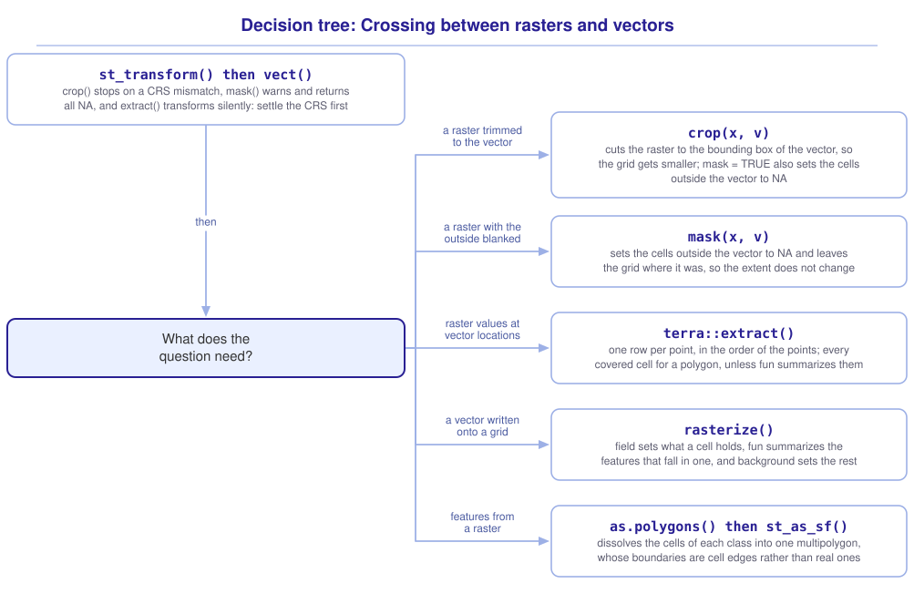

```{r}
#| include: false

library(terra)
library(tidyterra)
library(sf)
library(tidyverse)
library(webexercises)

source("src/r/course_functions.R")
source("src/r/reference_lookup.R")

lesson_refs <- find_lesson_references()
```

<hr>

<div>
{.intro_image fig-alt="Course logo"}

Few questions are answered by a raster alone. The elevation of the campus is a raster, the campus boundary is a polygon, the observations recorded on it are points, and the question is what the elevation was where each observation was made.

This lesson is about the operations that cross between the two data models: cutting a raster down to a vector, reading raster values at vector locations, turning a vector into a raster, and turning a raster back into a vector. Each of them has to reconcile a grid with a set of features, and each of them handles a disagreement about the coordinate reference system in its own way, which is where most of the trouble comes from.

In completing this lesson, you will learn how to:

* Convert between *sf* and *terra* objects with `vect()` and `st_as_sf()`
* Cut a raster down to a vector with `crop()` and `mask()`, and say what each of them does
* Read raster values at vector locations with `extract()`, for points and for polygons
* Turn a vector into a raster with `rasterize()`, and choose what a cell should hold
* Turn a raster into a vector with `as.polygons()`
* Predict what each of these does when the CRS of the raster and the vector disagree

**Important!** Before starting this tutorial, be sure that you have completed all preliminary and previous lessons!

</div>

## Data for this lesson

<button class="accordion">Please click on the button below to explore the metadata for this lesson!</button>
::: panel
In this lesson, we will explore:

```{r}
#| echo: false
#| output: asis

lesson_metadata(
  .dataset =
    c(
      "scbi_dem.tif",
      "scbi_lc.tif",
      "smsc_campus_scbi.geojson",
      "inat_scbi.geojson",
      "roads_scbi.geojson"
    )
) %>%
  cat()
```
:::

## Set up your session

Please complete the following to ensure that you are working in a clean session:

1. Please ensure that your **Global Environment** is empty.
2. In the *History* tab of your **workspace pane**, ensure that your **session history** is empty.

Now that we are working in a clean session:

1. Create a script file.
2. Save your script file as `scripts/rasters_and_vectors.R`.
3. Add metadata as a comment on the top of the file.
4. Following your metadata, create a new **code section** and call it "`setup`".
5. Following your section header, attach *terra*, *tidyterra*, *sf*, and the packages that comprise the **core tidyverse**, then load the module 3 source script.

At this point, your script should look something like:

```{r}
#| eval: false

# My code for the rasters and vectors tutorial

# setup --------------------------------------------------------

library(terra)
library(tidyterra)
library(sf)
library(tidyverse)

# Load the source script:

source("scripts/source_script_module_3.R")
```

```{r}
#| include: false

source("scripts/source_script_module_3.R")
```

Create a code section called "`read and pre-process data`". We will read the elevation and land cover rasters for the campus, and three vector files that cover the same ground:

```{r}
dem <-
  rast("data/raw/gis_scbi/scbi_dem.tif")

lc <-
  rast("data/raw/gis_scbi/scbi_lc.tif")

campus <-
  st_read(
    "data/raw/gis_scbi/smsc_campus_scbi.geojson",
    quiet = TRUE
  )

observations <-
  st_read(
    "data/raw/gis_scbi/inat_scbi.geojson",
    quiet = TRUE
  )

roads <-
  st_read(
    "data/raw/gis_scbi/roads_scbi.geojson",
    quiet = TRUE
  ) %>%
  clean_names() %>%
  select(name)
```

The rasters and the vectors are not in the same CRS. `crs()` is *terra*'s accessor for it, and `describe = TRUE` returns a data frame of the CRS's name, authority and code rather than the full definition:

```{r}
crs(dem, describe = TRUE)$code

st_crs(campus)$epsg
```

***6.3 Changing the grid: Resolution, extent and projection*** gave the rule that settles this: transform the vector, because a vector transforms exactly and a raster does not. We do it once, in pre-processing, for all three:

```{r}
raster_crs <-
  st_crs(dem)

campus <-
  st_transform(campus, raster_crs)

observations <-
  st_transform(observations, raster_crs)

roads <-
  st_transform(roads, raster_crs)
```

## Two packages, two classes

*sf* stores a vector as an `sf` object and *terra* stores one as a `SpatVector`. The *terra* functions in this lesson take a `SpatVector`, and `vect()` converts:

```{r}
campus_v <-
  vect(campus)
```

```{r}
#| echo: false

campus_v
```

`st_as_sf()` converts the other way, which is how a *terra* result rejoins the *sf* workflow we have used since module 3.

```{r}
campus_v %>%
  st_as_sf() %>%
  class()
```

::: mysecret
 [The conversion is cheap, and it is not free]{style="font-size: 1.25em; padding-left: 0.5em;"}

A `SpatVector` holds the same geometries and fields as the `sf` object it came from, so `vect()` and `st_as_sf()` round-trip without loss for everything this course does with them.

What does not survive is anything the *sf* class carries that *terra* has no place for, and the attribute-geometry relationship of ***5.3 Focus on polygons: Areas, and what happens when we cut them*** is the example that matters. `st_agr()` is an attribute of an `sf` object. Convert to a `SpatVector` and back, and the declaration is gone.

Recent versions of *terra* accept an `sf` object directly in many places and call `vect()` themselves. Writing the conversion out is still worth doing, because it is the line you will look at when a function reports a class it did not expect.
:::

## Cutting a raster down to a vector

Two operations reduce a raster to the area a vector covers, and they do different things.

`crop()` cuts the raster to the **bounding box** of the vector, which returns a smaller rectangle:

```{r}
campus_dem <-
  dem %>%
  crop(campus_v)
```

```{r}
#| echo: false

campus_dem
```

From 579,610 cells to 42,456, and the result is still a full rectangle with a value in every cell.

`mask()` sets every cell **outside** the vector to `NA`, and leaves the grid alone:

```{r}
campus_only <-
  campus_dem %>%
  mask(campus_v)

campus_only %>%
  is.na() %>%
  global("sum")
```

Same 42,456 cells, of which 22,785 now hold `NA`: the parts of the rectangle that the campus boundary does not cover.

```{r}
#| fig-alt: "Two panels of the same rectangle of elevation around the SCBI campus. The left panel is filled edge to edge. The right panel shows the same surface with everything outside the campus boundary blank, leaving an irregular shape."

ggplot() +
  geom_spatraster(data = campus_only) +
  geom_sf(
    data = campus,
    fill = NA,
    color = "red"
  ) +
  scale_fill_hypso_c()
```

Most questions want both, and `crop()` takes an argument that does them together:

```{r}
dem %>%
  crop(campus_v, mask = TRUE)
```

The order matters for speed rather than for the answer. `crop()` first means `mask()` has a small raster to work on.

::: mysecret
 [Three functions, three answers to the same CRS mismatch!]{style="font-size: 1.25em; padding-left: 0.5em;"}

We transformed the vectors in pre-processing. Here is what happens when nobody does.

Give `crop()` a vector in a different CRS and it stops:

```{r}
#| error: true

dem %>%
  crop(
    vect(
      st_transform(campus, 32617)
    )
  )
```

Give `mask()` the same thing and it warns, runs, and returns a raster in which **every** cell is `NA`. The vector's coordinates are in meters, the raster's are in degrees, and nothing on the grid falls inside a polygon sitting at a distance of seven hundred thousand:

```{r}
dem %>%
  mask(
    vect(
      st_transform(campus, 32617)
    )
  ) %>%
  is.na() %>%
  global("sum")
```

579,610 missing cells out of 579,610, with a warning rather than an error.

Give `extract()` the same thing and it transforms the vector for you, warns that it has done so, and returns the right answer.

Three functions in one package, three behaviors. **A CRS mismatch is checked at every boundary and handled differently at each one**, so transform in pre-processing rather than relying on any function to notice. Which function does which is worth less than the habit.
:::

## Reading raster values at vector locations

`extract()` returns the raster values at the locations of a vector, which is how a raster answers a question asked about features.

For points, it returns one row per point:

```{r}
elevations <-
  dem %>%
  terra::extract(
    vect(observations)
  )

elevations %>%
  head()
```

`ID` is the row number of the point in the vector, and `Layer_1` is the name of the raster layer. The result is a plain data frame rather than a spatial object, which is what makes it joinable:

```{r}
observations_with_elevation <-
  observations %>%
  mutate(
    elevation = elevations$Layer_1
  )

observations_with_elevation %>%
  st_drop_geometry() %>%
  head(4)
```

Binding the column on by position is safe here because `extract()` returns the rows in the order it was given them, one per point, with no matching involved.

A categorical raster returns the labels rather than the codes:

```{r}
land_cover <-
  lc %>%
  terra::extract(
    vect(observations)
  )

land_cover %>%
  count(category) %>%
  arrange(desc(n))
```

Most of the campus observations were recorded on impervious surfaces, which is what a dataset of what people photographed near the buildings and the roads looks like.

For polygons, `extract()` returns every cell the polygon covers, which is rarely what a question wants. `fun = ` summarizes them instead:

```{r}
dem %>%
  terra::extract(
    campus_v,
    fun = mean,
    na.rm = TRUE
  )
```

The mean elevation of the campus, in one row.

::: {.callout-note}

`terra::extract()` is written with its package prefix throughout this lesson because *tidyr* exports a function of the same name, and *tidyverse* is attached after *terra*. Without the prefix, the call reaches `tidyr::extract()`, which has no method for a `SpatRaster` and returns `no applicable method for 'extract' applied to an object of class "SpatRaster"`.

:::

::: now_you
 [Now you!]{style="font-size: 1.25em; padding-left: 0.5em;"}

Return the median elevation of the observations in each land cover class.

*Hint: Both `extract()` calls above return one row per observation, in the order of the observations.*

[Click here to see my answer]{.answer_link data-answer="a-6-4-extract"}

::: {.answer_body #a-6-4-extract}

```{r}
observations %>%
  st_drop_geometry() %>%
  mutate(
    elevation = elevations$Layer_1,
    land_cover = land_cover$category
  ) %>%
  summarize(
    observations = n(),
    median_elevation = median(elevation),
    .by = land_cover
  ) %>%
  arrange(desc(observations))
```

Dropping the geometry first makes this a summary of the records rather than of their positions, for the reason ***5.2 Focus on lines: Paths through a landscape*** gave.

The two columns are added together in one `mutate()` because both come from calls that returned one row per observation in the same order. Where that is not guaranteed, the safe form is a join on a key rather than a bind on position.

You will learn alternative solutions to this problem in a future lesson.

:::
:::

## Turning a vector into a raster

`rasterize()` writes a vector onto a grid. It takes the vector, a raster whose grid the result will use, and an argument saying what each cell should hold.

`field = ` writes a constant or a field of the vector:

```{r}
road_cells <-
  roads %>%
  vect() %>%
  rasterize(
    dem,
    field = 1
  )

road_cells %>%
  freq()
```

4,955 cells of the 579,610 have a road passing through them, and the rest are `NA` because `rasterize()` leaves a cell no feature reached empty.

`fun = ` summarizes the features that fall in a cell, which is how a set of points becomes a count:

```{r}
observation_counts <-
  observations %>%
  vect() %>%
  rasterize(
    aggregate(dem, fact = 20),
    fun = "length",
    background = 0
  )

observation_counts %>%
  global(c("max", "sum"))
```

The 320 observations are spread over a coarsened grid, and the busiest cell holds 81 of them. `background = 0` is what makes the empty cells zero rather than `NA`, which matters because a count of zero is a fact and a missing value is not.

```{r}
#| fig-alt: "A coarse grid over the campus area shaded by the number of iNaturalist observations in each cell. One cell at the campus buildings is far darker than the rest, and most cells hold none."

ggplot() +
  geom_spatraster(data = observation_counts) +
  scale_fill_whitebox_c(palette = "deep")
```

## Turning a raster into a vector

`as.polygons()` goes the other way, returning one polygon per class:

```{r}
lc_campus <-
  lc %>%
  crop(campus_v)

lc_polygons <-
  lc_campus %>%
  as.polygons()
```

```{r}
#| echo: false

lc_polygons
```

One feature per class rather than one per cell, because `as.polygons()` dissolves the cells of each class into a single multipolygon by default. The result is a `SpatVector`, and `st_as_sf()` returns it to the workflow we know:

```{r}
lc_polygons %>%
  st_as_sf() %>%
  mutate(
    area = st_area(geometry)
  ) %>%
  st_drop_geometry() %>%
  arrange(desc(area)) %>%
  head(4)
```

::: mysecret
 [Vectorize because the question needs features, not because vectors are familiar!]{style="font-size: 1.25em; padding-left: 0.5em;"}

A raster of a million cells becomes a vector of a million tiny squares unless the classes dissolve into a few large shapes, and the boundaries of those shapes are the edges of cells rather than the edges of anything on the ground. A forest patch vectorized from a 30-meter raster has a staircase for a boundary, and its perimeter is longer than the real one by an amount that depends only on the cell size.

Vectorize when the question is about features: how many patches, how large is each, which ones touch. Stay in the raster when the question is about the surface, because everything in ***6.5 Map algebra*** is faster and more honest on the grid it was measured on.
:::

::: now_you
 [Check your understanding]{style="padding-left: 0.5em;"}

`extract()` is called on a raster with a `SpatVector` of 50 points. How many rows does the result hold?

`r longmcq(c(answer = "50", "One per raster cell the points fall in, which may be fewer than 50", "One, holding the mean", "50 plus one for the header"))`

True or false: `crop()` returns a raster in which the cells outside the vector are `NA`.

`r torf(FALSE)`
:::

## Putting it all together

The operations that cross between a raster and a vector each answer a different question. My own model for that looks like this (click to expand):

{.zoomable data-title="Decision tree: Crossing between rasters and vectors" data-pdf-key="rasters_and_vectors" fig-alt="To cross between a raster and a vector, first st_transform() the vector into the CRS of the raster and then vect() it, because crop() stops on a mismatch, mask() warns and returns a raster of all NA, and extract() transforms silently. Then ask what the question needs. For a raster trimmed to the vector, crop() cuts the raster to the bounding box of the vector, so the grid gets smaller, and mask = TRUE also sets the cells outside the vector to NA. For a raster with the outside blanked, mask() sets the cells outside the vector to NA and leaves the grid where it was, so the extent does not change. For raster values at vector locations, terra::extract() returns one row per point, in the order of the points, and every covered cell for a polygon unless fun summarizes them. For a vector written onto a grid, rasterize() takes field for what a cell holds, fun to summarize the features that fall in one, and background for the rest. For features from a raster, as.polygons() dissolves the cells of each class into one multipolygon, whose boundaries are cell edges rather than real ones, and st_as_sf() returns it to the sf workflow."}



::: {.callout-note}

This tree is a visualization of *my* mental model for these functions. It is totally okay if your model differs! What is important is that you have a *working* model, a system in place that allows you to retrieve the function or functions that you need to solve a problem.

:::

## Take-home points

* `vect()` converts an `sf` object to a `SpatVector` and `st_as_sf()` converts it back.
* A CRS mismatch is handled differently by each function. `crop()` returns an error, `mask()` warns and returns a raster of all `NA`, and `extract()` transforms the vector and warns. Transform the vector in pre-processing rather than relying on any of them.
* `crop()` cuts a raster to the bounding box of a vector. `mask()` sets the cells outside the vector to `NA` and leaves the grid alone. `crop(mask = TRUE)` does both.
* `extract()` returns one row per point, in the order of the points, as a plain data frame. For a polygon it returns every covered cell unless `fun = ` summarizes them.
* `terra::extract()` needs its prefix, because *tidyr* exports `extract()` and is attached later.
* `rasterize()` writes a vector onto a grid. `field = ` sets what a cell holds, `fun = ` summarizes the features that fall in one, and `background = ` sets the cells that hold none.
* `as.polygons()` dissolves the cells of each class into one multipolygon. The boundaries it returns are cell edges rather than the edges of anything real.

## Exercises

::: now_you
 [Test your knowledge!]{style="font-size: 1.25em; padding-left: 0.5em;"}

1. You need the mean canopy cover inside each of forty watershed polygons. Which statement returns it?

`r longmcq(c(answer = "terra::extract(canopy, vect(watersheds), fun = mean, na.rm = TRUE)", "terra::extract(canopy, vect(watersheds))", "mask(canopy, vect(watersheds))", "rasterize(vect(watersheds), canopy, fun = mean)"))`

2. A colleague masks a raster with a polygon and every cell of the result is `NA`. What is the first thing to check?

`r longmcq(c(answer = "Whether the polygon and the raster are in the same CRS", "Whether the raster held any values to begin with", "Whether the polygon is valid", "Whether mask() was given the arguments in the wrong order"))`

3. Why does `rasterize()` need a raster as its second argument?

`r longmcq(c(answer = "It supplies the grid the result is written onto", "It supplies the values the cells will hold", "It is masked by the vector before the result is returned", "It sets the CRS the vector is transformed into"))`

4. Parsons problem: Reorder the lines below to return the mean elevation inside the campus boundary, as a single number. One line returns every cell the boundary covers instead of one summary of them. Leave it in the trash.

<div class="parsons-problem">
<div id="p-6-4-01-trash" class="sortable-code"></div>
<div id="p-6-4-01-sortable" class="sortable-code"></div>
<div style="clear: both;"></div>
<button id="p-6-4-01-check" class="parsons-btn parsons-btn-check" type="button">Check My Order</button>
<button id="p-6-4-01-reset" class="parsons-btn parsons-btn-reset" type="button">Shuffle Again</button>
<p id="p-6-4-01-feedback" class="parsons-feedback"></p>
</div>

<script>
window.parsonsProblems = window.parsonsProblems || []; window.parsonsProblems.push({ id: "p-6-4-01", maxDistractors: 1, code: "campus_elevation <-\n  dem %>%\n  terra::extract(campus_v) %>% #distractor\n  terra::extract(\n    campus_v,\n    fun = mean,\n    na.rm = TRUE\n  )" });
</script>

5. True or false: `as.polygons()` returns one polygon for every cell of the raster.

`r torf(FALSE)`
:::


