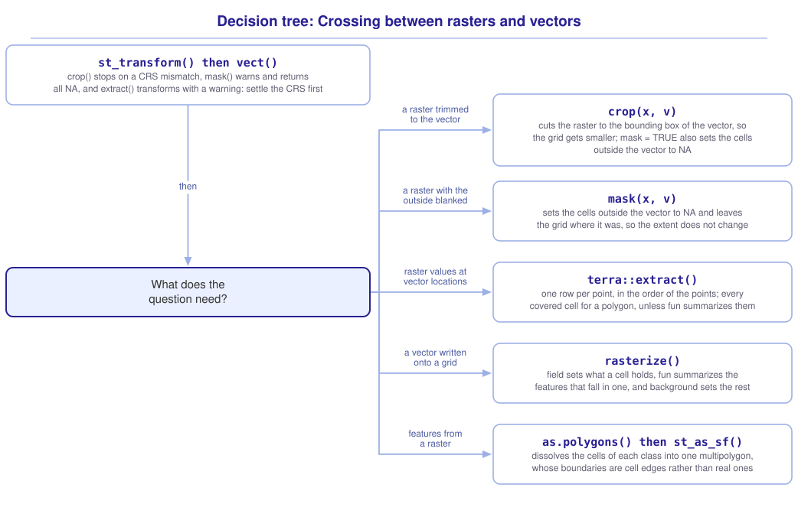

```{r}
#| include: false

library(tidyterra)
library(sf)
library(tidyverse)
library(webexercises)

source("src/r/course_functions.R")
source("src/r/reference_lookup.R")

lesson_refs <- find_lesson_references()
```

<hr>

<div>
{.intro_image fig-alt="Course logo"}

Ecological workflows routinely combine field observations and management boundaries with environmental rasters. We may need to attach elevation or land cover to survey locations, summarize canopy cover within management units, restrict a raster to a study boundary, or convert observations to counts across a regular grid.

Each question crosses between raster and vector data in a different direction. That direction determines the operation, the form of the result, and the assumptions made at cell and feature boundaries. The coordinate reference systems must also agree before the locations can be compared.

In this lesson, we will crop and mask rasters with vector boundaries, extract raster values at vector locations, rasterize vector features, and convert raster classes to polygons. We will track the grid, values, and vector features through each operation so that the resulting object matches the ecological question.

In completing this lesson, you will learn how to:

* Convert between *sf* and *terra* [objects]{.term term="Object"} with `vect()` and `st_as_sf()`
* Cut a raster down to a vector with `crop()` and `mask()` and say what each of them does
* Read raster values at vector locations with `extract()`, for points and for polygons
* Turn a vector into a raster with `rasterize()`, and choose the value assigned to each [cell]{.term}
* Turn a raster into a vector with `as.polygons()`
* Predict what each of these does when the CRS of the raster and the vector do not match

**Important!** Before starting this tutorial, be sure that you have completed all preliminary and previous lessons!

</div>

## Data for this lesson

<button class="accordion">Please click on the button below to explore the metadata for this lesson!</button>
::: panel
In this lesson, we will explore:

```{r}
#| echo: false
#| output: asis

lesson_metadata(
  .dataset =
    c(
      "scbi_dem.tif",
      "scbi_lc.tif",
      "smsc_campus_scbi.geojson",
      "inat_scbi.geojson",
      "roads_scbi.geojson"
    )
) %>%
  cat()
```
:::

## Set up your session

Please complete the following to ensure that you are working in a clean [session]{.term}:

1. Please ensure that your **[Global Environment]{.term}** is empty.
2. In the *History* [tab]{.term} of your **[workspace pane]{.term}**, ensure that your **[session history]{.term}** is empty.

Now that we are working in a clean session:

1. Create a [script]{.term} file.
2. Save your script file as `scripts/rasters_and_vectors.R`.
3. Add [metadata]{.term} as a comment on the top of the file.
4. Following your metadata, create a new **[code section]{.term}** and call it "`setup`".
5. Following your section header, attach *tidyterra*, *sf*, and the [packages]{.term term="Package"} that comprise the **core tidyverse**, then load the module 3 [source script]{.term}.

At this point, your script should look something like:

```{r}
#| eval: false

# My code for the rasters and vectors tutorial

# setup --------------------------------------------------------

library(tidyterra)
library(sf)
library(tidyverse)

# Load the source script:

source("scripts/source_script_module_3.R")
```

```{r}
#| include: false

source("scripts/source_script_module_3.R")
```

Create a code section called "`read and pre-process data`". Read the elevation and land-cover rasters for the campus, along with three vector files that cover the same area:

```{r}
dem <-
  terra::rast("data/raw/gis_scbi/scbi_dem.tif")

names(dem) <- "elevation"

lc <-
  terra::rast("data/raw/gis_scbi/scbi_lc.tif")

names(lc) <- "land_cover"

raster_crs <-
  st_crs(dem)

campus <-
  st_read(
    "data/raw/gis_scbi/smsc_campus_scbi.geojson",
    quiet = TRUE
  ) %>%
  st_transform(crs = raster_crs)

observations <-
  st_read(
    "data/raw/gis_scbi/inat_scbi.geojson",
    quiet = TRUE
  ) %>%
  st_transform(crs = raster_crs)

roads <-
  st_read(
    "data/raw/gis_scbi/roads_scbi.geojson",
    quiet = TRUE
  ) %>%
  clean_names() %>%
  select(name) %>%
  st_transform(crs = raster_crs)
```

The source vectors use a different CRS from the rasters. As described in ***6.3 Changing the grid: Resolution, extent and projection***, we identify the raster's CRS and transform each vector as we read it. Transforming the vectors changes their coordinates without resampling the raster values.

## Converting between sf and SpatVector objects

*sf* represents vector data as `sf` objects, and *terra* represents them as `SpatVector` objects. The *terra* [functions]{.term term="Function"} in this lesson use a `SpatVector`. `vect()` converts our `sf` campus boundary to that class:

```{r}
campus_v <-
  terra::vect(campus)
```

```{r}
#| echo: false

campus_v
```

`st_as_sf()` converts a `SpatVector` to an `sf` object and returns it to the workflow that we have used since module 3:

```{r}
campus_v %>%
  st_as_sf() %>%
  class()
```

::: mysecret
 [Optional: What conversion preserves]{style="font-size: 1.25em; padding-left: 0.5em;"}

A `SpatVector` preserves the [geometries]{.term term="Geometry"} and [fields]{.term term="Field"} that we use in this course, so `vect()` and `st_as_sf()` can move these objects between the two workflows.

What is lost is any `sf` attribute that a `SpatVector` cannot store. The attribute-geometry relationship from ***5.3 Focus on polygons: Boundaries, attributes, and areas*** is the example that matters here. `st_agr()` is an attribute of an `sf` object. Convert to a `SpatVector` and back, and the declaration is gone.

Recent versions of *terra* accept an `sf` object directly in many places and perform the conversion internally. I prefer to write the conversion out, because it is the line we can inspect when a function returns an error about the class of its input.
:::

## Cropping and masking with vector boundaries

`crop()` and `mask()` use a vector boundary for different purposes. `crop()` changes the rectangular extent of the grid, and `mask()` changes the values outside the vector.

`crop()` cuts the raster to the **[bounding box]{.term}** of the vector, which returns a smaller rectangle:

```{r}
campus_dem <-
  dem %>%
  terra::crop(campus_v)
```

```{r}
#| echo: false

campus_dem
```

`crop()` works in whole cells, so the result is the cell-aligned rectangle nearest the bounding box rather than the bounding box itself. The default, `snap = "near"`, rounds each edge to the nearest cell boundary, which can place an edge up to half a cell inside or outside the vector. Use `snap = "out"` wherever the vector has to be covered completely, such as before totaling area or biomass inside it.

The cropped grid is a smaller rectangle. It retains values both inside and outside the campus boundary.

`mask()` sets every cell **outside** the vector to `NA`, and leaves the [grid]{.term} alone:

```{r}
campus_only <-
  campus_dem %>%
  terra::mask(campus_v)

campus_only %>%
  is.na() %>%
  terra::global("sum")
```

The cells outside the campus boundary are now `NA`, while the extent and dimensions remain unchanged.

```{r}
#| fig-alt: "The rectangle of elevation around the SCBI campus with everything outside the campus boundary blank, leaving an irregular shape. The boundary itself is drawn over it as a red outline."

ggplot() +

  # Add geometries:

  geom_spatraster(data = campus_only) +
  geom_sf(
    data = campus,
    fill = NA,
    color = "red"
  ) +

  # Define scale elements:

  scale_fill_hypso_c()
```

When an analysis needs only the cells inside a vector, `crop()` takes an argument that performs both operations:

```{r}
dem %>%
  terra::crop(campus_v, mask = TRUE)
```

Running `crop()` first makes the subsequent mask faster because `mask()` processes a smaller raster. The combined call returns the same result.

::: now_you
 [Check your understanding]{style="padding-left: 0.5em;"}

You need a smaller raster that retains the full rectangular grid around a watershed. Which operation should you use?

`r longmcq(c(answer = "crop()", "mask()", "extract()", "rasterize()"))`

You need the cells outside the watershed to be `NA`. Which argument performs both steps in the same call?

`r longmcq(c(answer = "crop(mask = TRUE)", "crop(snap = TRUE)", "mask(crop = TRUE)", "extract(exact = TRUE)"))`
:::

::: mysecret
 [Optional: How these functions respond to a CRS mismatch]{style="font-size: 1.25em; padding-left: 0.5em;"}

We transformed the vectors during pre-processing. The following examples show why that step matters.

`crop()` compares [extents]{.term term="Extent"} rather than [coordinate reference systems]{.term term="Coordinate reference system"}. The extents of a raster in degrees and a vector in meters do not overlap, so it stops:

```{r}
#| error: true

dem %>%
  terra::crop(
    campus %>%
      st_transform(crs = 32617) %>%
      terra::vect()
  )
```

Give `mask()` the same mismatched vector and it warns, runs, and returns a raster in which **every** cell is `NA`. The vector's [coordinates]{.term} are in meters and the raster's are in degrees, so their coordinates occupy completely different numerical ranges:

```{r}
dem %>%
  terra::mask(
    campus %>%
      st_transform(crs = 32617) %>%
      terra::vect()
  ) %>%
  is.na() %>%
  terra::global("sum")
```

Every cell is missing, and the call returned a warning.

`extract()` may attempt an internal transformation and warn that it has done so. That is not a substitute for pre-processing because the attempted transformation can still fail.

`crop()` stopped because the two extents have no cells in common, not because it compared the [projections]{.term term="Projection"}. Two coordinate reference systems whose coordinates are close, such as NAD83 and WGS 84 in the same UTM zone, have overlapping extents, and `crop()` returns the wrong cells without a warning.

**Transform in pre-processing.** A CRS mismatch produces an error, a warning, a silent transformation, or a wrong answer, and which of those you receive depends on the function.
:::

## Extracting raster values at vector locations

`extract()` returns raster values at vector locations. We can then attach those values to the vector features or summarize them within polygon boundaries.

For points, it returns a row for each point:

```{r}
elevations <-
  dem %>%
  terra::extract(
    terra::vect(observations)
  )

elevations %>%
  head()
```

`ID` is the row number of the point in the vector, and the second column takes the name of the [raster layer]{.term}. This is why we named the layers when we read them. The result is a plain [data frame]{.term}, so we can add its values to the original features:

```{r}
observations_with_elevation <-
  observations %>%
  mutate(
    elevation =
      elevations %>%
      pull(elevation)
  )

observations_with_elevation %>%
  st_drop_geometry() %>%
  head(4)
```

Binding the column on by position is safe here because `extract()` returns a row for each point in the original order, with no matching involved.

For a [categorical raster]{.term}, `extract()` returns the labels rather than the codes:

```{r}
land_cover <-
  lc %>%
  terra::extract(
    terra::vect(observations)
  )

land_cover %>%
  count(land_cover) %>%
  arrange(desc(n))
```

Most of the campus observations were recorded on impervious surfaces, which is consistent with people photographing organisms near campus buildings and roads.

For polygons, `extract()` returns the values of the cells associated with each polygon, which is rarely the final answer a question requires. `fun = ` [summarizes]{.term term="Summarize"} them instead:

```{r}
dem %>%
  terra::extract(
    campus_v,
    fun = mean,
    na.rm = TRUE
  )
```

The result reports the mean campus elevation. By default, a cell contributes to the mean when the polygon includes its center, and every included cell receives equal weight.

That approximation is reasonable when a polygon covers many small cells. It can matter when the polygons are not much larger than the cells, such as small watersheds against a 463-meter climate grid. `exact = TRUE` calculates the fraction of each cell covered by the polygon and uses those fractions in the summary:

```{r}
dem %>%
  terra::extract(
    campus_v,
    fun = mean,
    na.rm = TRUE,
    exact = TRUE
  )
```

The two means are close here because the campus polygon covers thousands of small cells. The difference can be much larger when boundary cells account for a substantial part of a polygon.

::: {.callout-note}

Because *terra* is not attached, we've used the `terra::` prefix for every *terra* function in this module. The prefix is especially important for `extract()`, because the attached *tidyr* package exports a different function with that name. A bare `extract()` calls *tidyr* and returns `no applicable method for 'extract' applied to an object of class "SpatRaster"`.

:::

::: now_you
 [Now you!]{style="font-size: 1.25em; padding-left: 0.5em;"}

Return the median elevation of the observations in each land cover class.

*Hint: Both `extract()` calls above return a row for each observation, in the order of the observations.*

[Click here to see my answer]{.answer_link data-answer="a-6-4-extract"}

::: {.answer_body #a-6-4-extract}

```{r}
observations %>%
  st_drop_geometry() %>%
  mutate(
    elevation =
      elevations %>%
      pull(elevation),
    land_cover =
      land_cover %>%
      pull(land_cover)
  ) %>%
  summarize(
    observations = n(),
    median_elevation = median(elevation),
    .by = land_cover
  ) %>%
  arrange(desc(observations))
```

Dropping the geometry first makes this a summary of the records rather than of their positions, for the reason ***5.2 Focus on lines: Paths through a landscape*** gave.

The two columns are added in the same `mutate()` because both calls returned a row for each observation in the same order. Where that is not guaranteed, the safe form is a join on a [key]{.term} rather than a bind on position.

:::
:::

## Rasterizing vector features

`rasterize()` writes vector features onto an existing raster grid. Its first argument supplies the vector features, its second supplies the template grid, and `field = ` or `fun = ` determines the values assigned to the cells.

`field = ` writes a constant or a field of the vector:

```{r}
road_cells <-
  roads %>%
  terra::vect() %>%
  terra::rasterize(
    dem,
    field = 1
  )

road_cells %>%
  terra::freq()
```

Cells crossed by a road have the value 1. The remaining cells are `NA` because no road falls within them.

`fun = ` summarizes the features that fall in a cell, which is how a set of points becomes a count:

```{r}
observation_counts <-
  observations %>%
  terra::vect() %>%
  terra::rasterize(
    dem %>%
      terra::aggregate(fact = 20),
    fun = "length",
    background = 0
  )

observation_counts %>%
  terra::global(c("max", "sum"))
```

The sum confirms that every observation was counted, and the maximum identifies the cell with the greatest number of records. `background = 0` assigns zero to cells with no observations. Here, zero means that no observations were recorded, while `NA` would indicate a missing value.

```{r}
#| fig-alt: "A coarse grid over the campus area shaded by the number of iNaturalist observations in each cell. The cell at the campus buildings is far darker than the rest, and most cells contain no observations."

ggplot() +

  # Add geometries:

  geom_spatraster(data = observation_counts) +

  # Define scale elements:

  scale_fill_whitebox_c(palette = "deep")
```

## Converting raster classes to polygons

`as.polygons()` converts raster cells to polygon features. We will first limit the land-cover raster to the campus boundary:

```{r}
lc_campus <-
  lc %>%
  terra::crop(
    campus_v,
    mask = TRUE
  )

lc_polygons <-
  lc_campus %>%
  terra::as.polygons()
```

```{r}
#| echo: false

lc_polygons
```

By default, `as.polygons()` [dissolves]{.term term="Dissolve or Dissolving"} cells with the same class into a multipolygon. The result therefore includes a feature for each land-cover class represented on campus. It is a `SpatVector`, and `st_as_sf()` returns it to our *sf* workflow:

```{r}
lc_polygons %>%
  st_as_sf() %>%
  mutate(
    area = st_area(geometry)
  ) %>%
  st_drop_geometry() %>%
  arrange(desc(area)) %>%
  head(4)
```

::: mysecret
 [Vectorize because the question needs features, not because vectors are familiar!]{style="font-size: 1.25em; padding-left: 0.5em;"}

A raster of 1,000,000 cells becomes a vector of 1,000,000 tiny squares unless the classes dissolve into a few large shapes. The resulting boundaries follow cell edges rather than independently measured boundaries on the ground. A forest patch vectorized from a 30-meter raster has a stair-step boundary, and its measured perimeter depends on the cell size and the orientation of the grid.

Vectorize when the question is about features: how many patches, how large is each, which ones touch. Stay in the raster when the question is about the surface, because the operations in ***7.1 Map algebra*** are more direct on the grid where the values were measured.
:::

::: now_you
 [Check your understanding]{style="padding-left: 0.5em;"}

`extract()` is called on a raster with a `SpatVector` of 50 points. How many rows does the result contain?

`r longmcq(c(answer = "50", "A row for each raster cell containing a point, which may be fewer than 50", "A row containing the mean", "51, including a header row"))`

True or false: `crop()` returns a raster in which the cells outside the vector are `NA`.

`r torf(FALSE)`
:::

## Putting it all together

Each operation that crosses between a raster and a vector is used for a different question. My own model for that looks like this (click to expand):

{.zoomable data-title="Decision tree: Crossing between rasters and vectors" data-pdf-key="rasters_and_vectors" fig-alt="To cross between a raster and a vector, first st_transform() the vector into the CRS of the raster and then vect() it, because crop() stops on a mismatch, mask() warns and returns a raster of all NA, and extract() may attempt an internal transformation. Then ask what the question requires. For a raster trimmed to the vector, crop() reduces the raster to the bounding box of the vector, so the grid gets smaller, and mask = TRUE also sets the cells outside the vector to NA. For a raster with the outside set to missing, mask() sets the cells outside the vector to NA and does not change the extent. For raster values at vector locations, terra::extract() returns a row for each point in the original order, and every associated cell for a polygon unless fun summarizes them. For a vector converted to a raster, rasterize() uses field or fun to determine the cell values and background for cells with no features. For features from a raster, as.polygons() dissolves the cells of each class into a multipolygon, whose boundaries follow cell edges rather than independently measured boundaries, and st_as_sf() returns the result to the sf workflow."}



::: {.callout-note}

This tree is a visualization of *my* mental model for these functions. It is totally okay if your model differs! What is important is that you have a *working* model, a system in place that allows you to retrieve the function or functions that you need to solve a problem.

:::

## Take-home points

* `vect()` converts an `sf` object to a `SpatVector` and `st_as_sf()` converts it back.
* A CRS mismatch is handled differently by each function. `crop()` returns an error, `mask()` warns and returns a raster of all `NA`, and `extract()` may attempt an internal transformation. [Transform]{.term term="Transform or Transform (geometry)"} the vector in pre-processing rather than relying on any of them.
* `crop()` cuts a raster to the bounding box of a vector. `mask()` sets the cells outside the vector to `NA` and leaves the grid alone. `crop(mask = TRUE)` does both.
* `extract()` returns a row for each point, in the order of the points, as a plain data frame. For a polygon it returns every covered cell unless `fun = ` summarizes them.
* `terra::extract()` needs its prefix because the attached *tidyr* package also exports a function named `extract()`.
* `rasterize()` converts vector features to raster values on a template grid. `field = ` supplies the values, `fun = ` summarizes multiple features within each cell, and `background = ` sets the value for cells with no features.
* `as.polygons()` dissolves the cells of each class into a multipolygon. The resulting boundaries follow cell edges rather than independently measured boundaries on the ground.

## Exercises

::: now_you
 [Test your knowledge!]{style="font-size: 1.25em; padding-left: 0.5em;"}

1. You need the mean canopy cover inside each watershed polygon. Which statement returns it?

`r longmcq(c(answer = "terra::extract(canopy, terra::vect(watersheds), fun = mean, na.rm = TRUE)", "terra::extract(canopy, terra::vect(watersheds))", "terra::mask(canopy, terra::vect(watersheds))", "terra::rasterize(terra::vect(watersheds), canopy, fun = mean)"))`

2. A colleague masks a raster with a polygon and every cell of the result is `NA`. What is the first thing to check?

`r longmcq(c(answer = "Whether the polygon and the raster are in the same CRS", "Whether the raster contained any non-missing values", "Whether the polygon is valid", "Whether mask() was given the arguments in the wrong order"))`

3. Why does `rasterize()` need a raster as its second argument?

`r longmcq(c(answer = "It supplies the grid used by the result", "It supplies the values assigned to the cells", "It is masked by the vector before the result is returned", "It sets the CRS the vector is transformed into"))`

4. Parsons problem: Reorder the lines below to return the mean elevation inside the campus boundary as a single number. The distractor returns every cell covered by the boundary instead of summarizing them. Leave it in the trash.

<div class="parsons-problem">
<div id="p-6-4-01-trash" class="sortable-code"></div>
<div id="p-6-4-01-sortable" class="sortable-code"></div>
<div style="clear: both;"></div>
<button id="p-6-4-01-check" class="parsons-btn parsons-btn-check" type="button">Check My Order</button>
<button id="p-6-4-01-reset" class="parsons-btn parsons-btn-reset" type="button">Shuffle Again</button>
<p id="p-6-4-01-feedback" class="parsons-feedback"></p>
</div>

<script>
window.parsonsProblems = window.parsonsProblems || []; window.parsonsProblems.push({ id: "p-6-4-01", maxDistractors: 1, code: "campus_elevation <-\n  dem %>%\n  terra::extract(campus_v) %>% #distractor\n  terra::extract(\n    campus_v,\n    fun = mean,\n    na.rm = TRUE\n  )" });
</script>

5. True or false: `as.polygons()` returns a polygon for every cell of the raster.

`r torf(FALSE)`
:::


