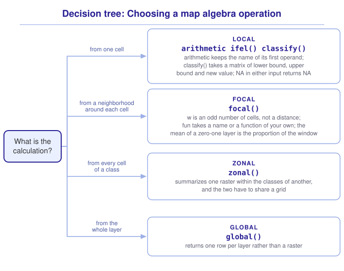

```{r}
#| include: false

library(terra)
library(tidyterra)
library(sf)
library(tidyverse)
library(webexercises)

source("src/r/course_functions.R")
source("src/r/reference_lookup.R")

lesson_refs <- find_lesson_references()
```

<hr>

<div>
{.intro_image fig-alt="Course logo"}

A raster is a grid of numbers, and the operations that make raster data useful are arithmetic on that grid. **Map algebra** describes calculating a new raster from one or more existing ones, and every such calculation belongs to one of four kinds, distinguished by how much of the raster each output cell is allowed to see.

A local operation sees one cell. A focal operation sees a neighborhood. A zonal operation sees every cell of a class. A global operation sees the whole layer. The four cover the calculations this course makes on a grid, and knowing which one a question needs is most of knowing how to answer it.

In completing this lesson, you will learn how to:

* Calculate a new raster from existing layers, cell by cell, with arithmetic, `ifel()` and `classify()`
* Summarize a neighborhood around every cell with `focal()`
* Summarize a raster within the classes of another with `zonal()`
* Summarize a whole layer with `global()`
* Merge the classes of a categorical raster, and say why relabelling does not do it

**Important!** Before starting this tutorial, be sure that you have completed all preliminary and previous lessons!

</div>

## Data for this lesson

<button class="accordion">Please click on the button below to explore the metadata for this lesson!</button>
::: panel
In this lesson, we will explore:

```{r}
#| echo: false
#| output: asis

lesson_metadata(
  .dataset =
    c(
      "scbi_dem.tif",
      "scbi_lc.tif",
      "smsc_campus_scbi.geojson"
    )
) %>%
  cat()
```
:::

## Set up your session

Please complete the following to ensure that you are working in a clean session:

1. Please ensure that your **Global Environment** is empty.
2. In the *History* tab of your **workspace pane**, ensure that your **session history** is empty.

Now that we are working in a clean session:

1. Create a script file.
2. Save your script file as `scripts/map_algebra.R`.
3. Add metadata as a comment on the top of the file.
4. Following your metadata, create a new **code section** and call it "`setup`".
5. Following your section header, attach *terra*, *tidyterra*, *sf*, and the packages that comprise the **core tidyverse**, then load the module 3 source script.

At this point, your script should look something like:

```{r}
#| eval: false

# My code for the map algebra tutorial

# setup --------------------------------------------------------

library(terra)
library(tidyterra)
library(sf)
library(tidyverse)

# Load the source script:

source("scripts/source_script_module_3.R")
```

```{r}
#| include: false

source("scripts/source_script_module_3.R")
```

Create a code section called "`read and pre-process data`". We read the elevation and land cover rasters and the campus boundary, transform the boundary to the CRS of the rasters, and clip the land cover to the campus:

```{r}
dem <-
  rast("data/raw/gis_scbi/scbi_dem.tif")

lc <-
  rast("data/raw/gis_scbi/scbi_lc.tif")

campus <-
  st_read(
    "data/raw/gis_scbi/smsc_campus_scbi.geojson",
    quiet = TRUE
  ) %>%
  st_transform(
    st_crs(lc)
  ) %>%
  vect()

lc_campus <-
  lc %>%
  crop(campus)
```

## Local operations

A **local operation** calculates each output cell from the cells at the same position in the input, and from nothing else. The grid never moves, so a local operation is the one kind that needs no decisions about neighborhoods or boundaries.

Arithmetic is local. Subtracting the mean elevation from every cell returns the height of each cell above or below the average:

```{r}
relative_elevation <-
  dem - global(dem, "mean")$mean
```

```{r}
#| echo: false

relative_elevation
```

Note the layer name. Arithmetic between a raster and a number keeps the name of the raster, so a layer called `Layer_1` that now holds a difference is still called `Layer_1`. Renaming the result is part of doing the calculation:

```{r}
names(relative_elevation) <- "height_above_mean"
```

`ifel()` is the raster form of `if_else()` from ***5.4 Categorizing spatial data***, and it takes the same three arguments: a condition, a value where the condition holds, and a value where it does not.

The land cover raster holds a class per cell. Three of its classes are impervious, and their codes come from the category table:

```{r}
impervious_codes <-
  lc_campus %>%
  cats() %>%
  pluck(1) %>%
  filter(
    category %in% c("Roads", "Structures", "Other Impervious")
  ) %>%
  pull(value)
```

```{r}
#| echo: false

impervious_codes
```

`ifel()` tests the codes rather than the labels, which is what the codes we just pulled are for:

```{r}
impervious <-
  ifel(
    lc_campus %in% impervious_codes,
    1,
    0
  )

names(impervious) <- "impervious"

freq(impervious)
```

Of the 427,469 cells in this rectangle, 96,796 are impervious, which is 22.6 percent of it.

`classify()` is local too, and it handles the case that `ifel()` cannot, which is more than two classes. ***6.2 Categorical rasters*** builds it in both of its forms, binning a quantity into intervals and mapping one set of codes onto another. Both calculate each output cell from the one input cell at the same position, which is what makes them local.

`NA` is the thing to watch in every local operation. An operation between two rasters returns `NA` wherever *either* input is `NA`, in exactly the way that `NA + 1` returns `NA` for a vector, so a calculation across four layers is missing wherever any one of them was. The missing cells of the inputs are usually at different edges, which makes the result's coverage smaller than any input's and easy to miss.

::: mysecret
 [Count the values of the result, not of the inputs]{style="font-size: 1.25em; padding-left: 0.5em;"}

`global()` with `!is.na()` is the check to run after any calculation across layers:

```{r}
#| eval: false

global(!is.na(result), "sum")
```

Where a layer's `NA` means zero rather than unknown, say so with `ifel(is.na(x), 0, x)` before the calculation, and not after it.
:::

::: now_you
 [Check your understanding]{style="padding-left: 0.5em;"}

Which of these is a local operation?

`r longmcq(c(answer = "Subtracting one raster layer from another", "Calculating the mean of every 3 by 3 neighborhood", "Calculating the mean elevation of each land cover class", "Calculating the mean of a whole layer"))`

True or false: `classify()` assigns `NA` to a value that falls outside every interval of its matrix.

`r torf(TRUE)`
:::

## Focal operations

A **focal operation** calculates each output cell from a neighborhood of cells around the same position. The neighborhood is a window that moves across the grid, and the value returned is a summary of whatever the window covers.

`focal()` takes the raster, a window, and the function that summarizes it:

```{r}
impervious_3 <-
  impervious %>%
  focal(
    w = 3,
    fun = "mean",
    na.rm = TRUE
  )
```

```{r}
#| echo: false

impervious_3
```

`w = 3` is a window of three cells by three cells, centered on the cell being calculated. The mean of a layer of zeroes and ones is the proportion of ones, so this raster holds the **proportion of a neighborhood that is impervious**, which is a more useful description of a place than whether one square meter of it happens to be paved.

The window size is the question. Compare what the layer looks like at three sizes:

```{r}
impervious_15 <-
  impervious %>%
  focal(
    w = 15,
    fun = "mean",
    na.rm = TRUE
  )

impervious_51 <-
  impervious %>%
  focal(
    w = 51,
    fun = "mean",
    na.rm = TRUE
  )

windows <-
  c(
    impervious,
    impervious_3,
    impervious_15,
    impervious_51
  )

names(windows) <-
  c("cell", "w_3", "w_15", "w_51")

windows %>%
  global(c("mean", "sd"), na.rm = TRUE)
```

The mean is the same in all four, at about 0.226. The standard deviation falls from 0.42 to 0.26 as the window grows. That is what a smoothing filter does and it is the reason to think about the window before choosing it: the total is preserved and the variation is not, so a window wider than the pattern you are studying will remove the pattern.

```{r}
#| fig-alt: "The proportion of a 51-cell neighborhood that is impervious across the campus rectangle. The buildings and the road network appear as a broad bright region through the middle, fading into dark forest at the edges."

ggplot() +
  geom_spatraster(data = impervious_51) +
  scale_fill_whitebox_c(palette = "deep")
```

`fun = ` accepts a function of your own as well as a name, which is how a focal operation answers a question that has no standard name:

```{r}
dem %>%
  focal(
    w = 3,
    fun = function(x) max(x) - min(x)
  ) %>%
  global(
    c("mean", "max"),
    na.rm = TRUE
  )
```

The elevation range within each three-cell neighborhood, which averages about a meter and a half and reaches eleven. ***6.6 Terrain, and seeing it*** returns to this as a named quantity.

::: mysecret
 [A window is measured in cells, not in meters!]{style="font-size: 1.25em; padding-left: 0.5em;"}

`w = 15` is fifteen cells. What that is on the ground depends entirely on the resolution of the raster, so the same call means fifteen meters on a one-meter raster and four hundred and fifty on a thirty-meter one.

Two consequences follow, and both have cost people results:

* A window chosen for one raster is meaningless on another. Decide the neighborhood in meters, then divide by the resolution to get `w`.
* In a geographic CRS the cells are not square, as ***6.3 Changing the grid: Resolution, extent and projection*** showed, so a square window is a rectangle on the ground. Project before running a focal operation whose size is supposed to mean something.

`w` must also be odd, so that the window has a center cell to be centered on.
:::

## Zonal and global summaries

A **zonal operation** summarizes one raster within the classes of another. The two rasters have to share a grid, so this is where the work of ***6.3 Changing the grid: Resolution, extent and projection*** is spent.

`resample()` puts the land cover onto the elevation grid, keeping its classes:

```{r}
lc_on_dem <-
  lc %>%
  resample(
    dem,
    method = "near"
  )
```

`zonal()` then takes the raster to summarize, the raster holding the zones, and the statistic:

```{r}
dem %>%
  zonal(
    lc_on_dem,
    fun = "mean",
    na.rm = TRUE
  ) %>%
  arrange(desc(Layer_1))
```

That table is a landscape read off a grid. The barren and pasture classes are at the top, the forest and canopy classes are in the band below them, and the four riverine classes are at the bottom, because the wetlands are in the valley the creek runs through. Nothing in either raster records a valley; the association falls out of two layers that share a grid.

A **global operation** summarizes a whole layer, and returns a table rather than a raster: one row per layer, and one column per statistic asked for.

```{r}
dem %>%
  global(
    c("mean", "sd", "min", "max"),
    na.rm = TRUE
  )
```

We have used `global()` throughout this module for exactly this. It is the fourth kind of map algebra, and it is the one that ends an analysis rather than continuing it.

::: now_you
 [Now you!]{style="font-size: 1.25em; padding-left: 0.5em;"}

Return the number of cells of each land cover class on the elevation grid, and the mean elevation of each, in one table, sorted from the most common class to the least.

*Hint: `zonal()` takes the same `fun = ` names that `global()` does, and one of them counts.*

[Click here to see my answer]{.answer_link data-answer="a-6-5-zonal"}

::: {.answer_body #a-6-5-zonal}

```{r}
cell_counts <-
  dem %>%
  zonal(
    lc_on_dem,
    fun = "notNA"
  ) %>%
  rename(cells = Layer_1)

mean_elevation <-
  dem %>%
  zonal(
    lc_on_dem,
    fun = "mean",
    na.rm = TRUE
  ) %>%
  rename(mean_elevation = Layer_1)

cell_counts %>%
  left_join(
    mean_elevation,
    join_by(category)
  ) %>%
  arrange(desc(cells))
```

`fun = "notNA"` counts the cells holding a value, which is the count a zonal summary wants: a class with no data in it should return zero rather than a count of cells that hold nothing.

The two calls are joined on `category` rather than bound by position. Both return one row per class of the zone raster, in the same order, so a bind would work here; the join is what keeps it working if either object is ever filtered, reordered, or built from a different zone raster.

```{r}
#| eval: false

# Or, using freq() for the counts:

lc_on_dem %>%
  freq() %>%
  select(
    category = value,
    cells = count
  ) %>%
  left_join(mean_elevation, join_by(category))
```

You will learn even more alternative solutions to this problem in a future lesson.

:::
:::

## Putting it all together

Choosing an operation starts with how much of the raster the answer is allowed to see. My own model for that looks like this (click to expand):

{.zoomable data-title="Decision tree: Choosing a map algebra operation" data-pdf-key="map_algebra" fig-alt="To choose a map algebra operation, ask what the calculation is. From one cell, the operation is local: arithmetic between layers or with a number, ifel() for two classes, and classify() with a three-column matrix of lower bound, upper bound and new value for more; arithmetic keeps the name of its first operand, and NA in either input returns NA. From a neighborhood around each cell, the operation is focal: focal() takes w as an odd number of cells rather than a distance and fun as a name or a function of your own, and the mean of a zero-one layer is the proportion of the window. From every cell of a class, the operation is zonal: zonal() summarizes one raster within the classes of another, and the two have to share a grid. From the whole layer, the operation is global: global() returns one row per layer rather than a raster."}



::: {.callout-note}

This tree is a visualization of *my* mental model for these functions. It is totally okay if your model differs! What is important is that you have a *working* model, a system in place that allows you to retrieve the function or functions that you need to solve a problem.

:::

## Take-home points

* Map algebra has four kinds, distinguished by how much of the raster each output cell is calculated from: local, focal, zonal and global.
* Arithmetic on a raster is local, and it keeps the layer name of its first operand. Rename the result as part of the calculation.
* `ifel()` is the raster form of `if_else()`, and it tests the codes of a categorical raster rather than its labels.
* A local operation returns `NA` wherever any input is `NA`, so count the values of the result rather than assuming they match the inputs.
* `focal()` summarizes a window of `w` cells around every cell. `w` is measured in cells rather than in meters, and it must be odd. The mean of a layer of zeroes and ones is the proportion of the window.
* A wider window preserves the mean and reduces the variation, so a window wider than the pattern removes the pattern.
* `zonal()` summarizes one raster within the classes of another, and the two must share a grid. `global()` summarizes a whole layer and returns one row per layer rather than a raster.

## Exercises

::: now_you
 [Test your knowledge!]{style="font-size: 1.25em; padding-left: 0.5em;"}

1. A raster of 10-meter cells is smoothed with a window meant to cover about 100 meters. What should `w` be?

`r longmcq(c(answer = "11", "10", "100", "1000"))`

2. Two layers are added and the result has more missing cells than either input. What happened?

`r longmcq(c(answer = "The inputs are missing in different places, and a local operation returns NA wherever either is NA", "The addition overflowed in the cells that are now missing", "The grids do not match and the extra cells were padded", "global() was called without na.rm = TRUE"))`

3. A raster is summarized in two ways: once with `global()` and once with `zonal()` against a raster of one single class. What is the difference between the results?

`r longmcq(c(answer = "None in the number, but zonal() returns a table with a column naming the class", "global() ignores NA and zonal() does not", "zonal() returns a raster and global() returns a number", "global() cannot take na.rm = TRUE"))`

4. Parsons problem: Reorder the lines below to return the proportion of a 15-cell neighborhood that is forest, from a land cover raster whose forest class has the code 41. One line supplies a window size that `focal()` rejects. Leave it in the trash.

<div class="parsons-problem">
<div id="p-6-5-01-trash" class="sortable-code"></div>
<div id="p-6-5-01-sortable" class="sortable-code"></div>
<div style="clear: both;"></div>
<button id="p-6-5-01-check" class="parsons-btn parsons-btn-check" type="button">Check My Order</button>
<button id="p-6-5-01-reset" class="parsons-btn parsons-btn-reset" type="button">Shuffle Again</button>
<p id="p-6-5-01-feedback" class="parsons-feedback"></p>
</div>

<script>
window.parsonsProblems = window.parsonsProblems || []; window.parsonsProblems.push({ id: "p-6-5-01", maxDistractors: 1, code: "forest_cover <-\n  ifel(\n    lc_campus == 41,\n    1,\n    0\n  ) %>%\n  focal(\n    w = 16, #distractor\n    w = 15,\n    fun = \"mean\",\n    na.rm = TRUE\n  )" });
</script>

5. True or false: `zonal()` requires the two rasters to share a grid.

`r torf(TRUE)`
:::


