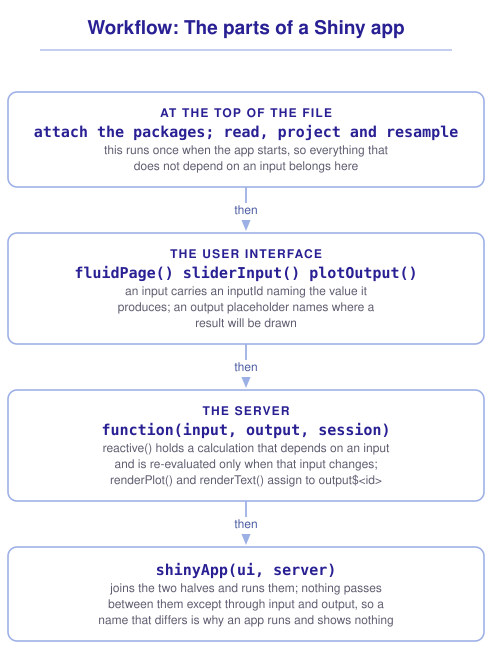

```{r}
#| include: false

library(shiny)
library(tidyterra)
library(sf)
library(tidyverse)
library(webexercises)

source("src/r/course_functions.R")
source("src/r/reference_lookup.R")

lesson_refs <- find_lesson_references()
```

<hr>

<div>
{.intro_image fig-alt="Course logo"}

A **Shiny app** is an interactive web application built with R. The user interface appears in a web browser, while an R session receives the inputs, performs the calculations, and returns updated figures, tables, text, or other output. During development, that R session runs on your computer. A deployed app typically runs R on a server that readers access through a web page.

Shiny is useful when we want a reader to explore how results change without editing or running the underlying code. The analyst defines the controls, the values they accept, and the calculations that respond to them. The reader interacts only with the choices provided through the app.

In this lesson, we will build an app that maps the area above a selected elevation and reports its size. The example is intentionally focused so that we can examine how the user interface, server, and reactive expressions connect. These components provide the foundation for the more complex applications introduced later in the course.

In completing this lesson, you will learn how to:

* Describe the two halves of a Shiny app and what passes between them
* Build an app that draws a raster and lets a reader change what it shows
* Explain what makes an expression reactive, and where the data should be read
* Run an app, and describe what deployment requires

*Note: This lesson is optional for Module 6. It provides the foundation for ***8.2 Advanced Shiny: Inputs from data, maps, events, and downloads***. This lesson is the shortest path from a `SpatRaster` to an app that lets a reader control the result.*

**Important!** Before starting this tutorial, be sure that you have completed all preliminary and previous lessons!

</div>

## Data for this lesson

<button class="accordion">Please click on the button below to explore the metadata for this lesson!</button>
::: panel
In this lesson, we will explore:

```{r}
#| echo: false
#| output: asis

lesson_metadata(
  .dataset = "scbi_dem.tif"
) %>%
  cat()
```
:::

## Set up your session

Please complete the following to ensure that you are working in a clean [session]{.term}:

1. Please ensure that your **[Global Environment]{.term}** is empty.
2. In the *History* [tab]{.term} of your **[workspace pane]{.term}**, ensure that your **[session history]{.term}** is empty.

This lesson introduces the [package]{.term} *shiny*:

```{r}
#| eval: false

install.packages("shiny")
```

Next:

1. Create a [script]{.term} file.
2. Save your script file as `app.R` in the root of your [project]{.term}, the folder that contains `data` and `scripts`.

When an app runs, its working directory is the folder that contains `app.R`. Saving the file at the root of the project means that paths such as `data/raw/gis_scbi/scbi_dem.tif` work in the app exactly as they do in your other scripts. Because the file is named `app.R`, RStudio displays a *Run App* button above it.

```{r}
#| include: false

source("scripts/source_script_module_3.R")
```

## Shiny user interfaces and servers

A single-file Shiny app contains a user interface, a server function, and a call to `shinyApp()` that combines them.

The **user interface**, usually assigned to `ui`, defines the controls and output locations displayed in the browser. It is a nested set of [function]{.term} calls that Shiny converts to HTML. Each control has an `inputId` that names the [value]{.term} available to the server.

The **server** is a function of `input`, `output`, and `session`. Values from interface controls are available through `input`, and the server assigns rendered results to `output`.

`shinyApp()` combines the user interface and server and runs the app.

Names connect the user interface and server. A control with `inputId = "cutoff"` is available to the server as `input$cutoff`. A plot assigned to `output$map` appears at `plotOutput("map")` in the user interface. These names must match for the server result to appear in the browser.

## Building a raster application

We will build an app that shows the area above an elevation selected by the user. Begin with the packages and data at the top of `app.R`, outside the user interface and server:

```{r}
#| eval: false

library(shiny)
library(tidyterra)
library(tidyverse)

dem <-
  terra::rast("data/raw/gis_scbi/scbi_dem.tif") %>%
  terra::project("EPSG:26917") %>%
  rename(elevation = 1)

cell_area <-
  dem %>%
  terra::cellSize(
    unit = "ha",
    transform = FALSE
  )
```

The [projection]{.term} follows ***6.3 Changing the grid: Resolution, extent and projection***. The file uses the NAD83 [datum]{.term}, so we retain it in the projected CRS. We also calculate `cell_area` here because the slider changes the elevation values included in the result, but it does not change the [grid]{.term}. The projected CRS uses meters, and `transform = FALSE` calculates planar cell area from those units.

Code at the top of the file runs when the app starts. The raster therefore does not need to be read or projected again when the slider changes. The server function runs separately for each browser session, and its reactive calculations update as the user changes an input.

Next, we will define the interface:

```{r}
#| eval: false

ui <-
  fluidPage(
    titlePanel("Elevation at SCBI"),
    sidebarLayout(
      sidebarPanel(
        sliderInput(
          inputId = "cutoff",
          label = "Show ground above (meters):",
          min = 224,
          max = 392,
          value = 300
        )
      ),
      mainPanel(
        plotOutput("map"),
        textOutput("area")
      )
    )
  )
```

`fluidPage()` defines the page, and `sidebarLayout()` divides it into a panel of controls and a panel of results. `sliderInput()` creates the elevation control. Its `inputId` names the value available to the server, `label` provides the displayed text, `min` and `max` define the available range, and `value` sets the starting position.

The `min` and `max` span the range of the raster, rounded outward. Rounding inward would prevent the slider from reaching the lowest or highest elevations. These fixed limits are appropriate because this app always uses the same raster. An app that accepts other elevation data should derive the limits with `global(dem, c("min", "max"))`.

Next, define the server. `input$cutoff` returns the current slider value. `reactive()` defines the elevation calculation that depends on that value, and we call the result as `high_ground()`. `renderPlot()` creates the plot assigned to `output$map`, while `renderText()` creates the text assigned to `output$area`.

```{r}
#| eval: false

server <-
  function(input, output, session) {
    high_ground <-
      reactive({
        dem %>%
          filter(elevation > input$cutoff)
      })

    output$map <-
      renderPlot({
        ggplot() +

          # Add geometries:

          geom_spatraster(data = high_ground()) +

          # Define scale elements:

          scale_fill_hypso_c(na.value = "grey90") +

          # Modify the theme:

          theme_void()
      })

    output$area <-
      renderText({
        hectares <-
          cell_area %>%
          terra::mask(high_ground()) %>%
          terra::global("sum", na.rm = TRUE) %>%
          pull(sum) %>%
          round(1)

        glue::glue("{hectares} hectares above {input$cutoff} meters")
      })
  }
```

And the call that runs it:

```{r}
#| eval: false

shinyApp(ui, server)
```

Click *Run App* in RStudio. Moving the slider now updates both the map and the sentence beneath it.

The `filter()` sets elevations below the threshold to `NA`. `mask()` applies that pattern of missing values to `cell_area`, so `global("sum")` returns the area above the threshold. Without the mask, the sum would include the full raster at every slider position.

`glue::glue()` builds the sentence displayed beneath the map. Text inside `{}` is evaluated as R code and inserted into the string, so the sentence includes both the calculated area and the current value of `input$cutoff`. The `glue::` prefix makes the function available without attaching the *glue* package.

::: {.callout-note}

Recall from ***6.1 Introduction to rasters with terra*** that `filter()` on a `SpatRaster` sets the failing cells to `NA` rather than removing them. The raster extent therefore remains unchanged as the slider moves, so the map does not jump around. The argument `na.value = "grey90"` draws the excluded ground.

:::

## Reactive expressions

An expression is **reactive** when its result depends on an input that can change. `reactive()` stores the result until a dependency changes, which allows several outputs to use the same calculation.

`high_ground` is a reactive expression, so we call it as `high_ground()` to return the filtered raster. When `input$cutoff` changes, the stored result becomes invalid. The next output that calls `high_ground()` triggers the calculation with the new cutoff.

Using `reactive()` rather than repeating the calculation provides two advantages:

**The filtered raster is calculated once per change, not twice.** Both `output$map` and `output$area` call `high_ground()`, and Shiny caches the value until `input$cutoff` changes.

**A change invalidates only the expressions that depend on that input.** A control that changes the map's colors does not require another elevation filter unless the filtering expression also refers to that control.

::: mysecret
 [Read your data outside the server!]{style="font-size: 1.25em; padding-left: 0.5em;"}

Reading, projecting or resampling inside a reactive or rendering expression makes the app repeat that work whenever a dependent input changes. A projection that takes two seconds makes the app respond slowly.

I recommend organizing the app by when each operation needs to run:

* At the top of the file, outside `ui` and `server`: read the files, project them, align their grids, and do anything else that does not depend on an input. This runs once.
* Inside `reactive()`: only what actually depends on an input.
* Inside `render*()`: only the drawing.

When pre-processing is slow, we can do it in a separate script and use `writeRaster()` to save the processed raster. The app can then read the finished file at the top of the script.
:::

::: mysecret
 [What `session` is for, and why a reactive is lazy]{style="font-size: 1.25em; padding-left: 0.5em;"}

The server function also includes `session`, and reactive expressions use lazy evaluation.

**`session` is the third argument and this app never uses it.** It represents the current user's connection. Functions that update a control from the server or run code when a connection closes use this object. We include it here because students will commonly encounter the full three-argument server function.

**A reactive is lazy as well as cached.** Shiny does not immediately recalculate `high_ground()` when the slider moves. It marks the stored result as invalid and calculates a new result when an output requests it. Shiny records the inputs used while evaluating the expression and uses those relationships to determine when the result becomes invalid.
:::

::: now_you
 [Check your understanding]{style="padding-left: 0.5em;"}

An app's server reads `input$year` inside a `reactive()`. When does that expression re-evaluate?

`r longmcq(c(answer = "After input$year changes, when an output next requests its value", "Every time any input changes", "Once, when the app starts", "Every second, until the app is closed"))`

True or false: A `SpatRaster` read at the top of an app file is re-read each time an input changes.

`r torf(FALSE)`
:::

::: now_you
 [Now you!]{style="font-size: 1.25em; padding-left: 0.5em;"}

Add a checkbox that lets the reader decide whether the ground below the selected elevation is drawn in grey or left transparent.

*Hint: `checkboxInput()` takes an `inputId`, a `label` and a starting `value`. The server reads the value as `input$show_excluded`.*

[Click here to see my answer]{.answer_link data-answer="a-6-5-background"}

::: {.answer_body #a-6-5-background}

In the interface, beneath the slider:

```{r}
#| eval: false

checkboxInput(
  inputId = "show_excluded",
  label = "Shade ground below the cutoff",
  value = TRUE
)
```

Then use that value in `renderPlot()`:

```{r}
#| eval: false

output$map <-
  renderPlot({
    excluded_color <-
      if_else(
        input$show_excluded,
        "grey90",
        NA_character_
      )

    ggplot() +

      # Add geometries:

      geom_spatraster(data = high_ground()) +

      # Define scale elements:

      scale_fill_hypso_c(na.value = excluded_color) +

      # Modify the theme:

      theme_void()
  })
```

The checkbox changes only how the missing cells are drawn, so the filtered raster does not need to be recalculated. `high_ground()` still depends only on `input$cutoff`.

:::
:::

## Running and deploying a Shiny application

*Run App* starts the app in an [R session]{.term} on your computer. Closing that session stops the app, and other users cannot access it.

To share the app, we must deploy it to a service that can run R and respond to users. This differs from publishing a rendered Quarto document, which produces files that can be served without an active R session. Common deployment options include:

* **shinyapps.io**, run by Posit, which the *rsconnect* package publishes to and which has a free tier. This is where the preliminary lessons of this course are hosted.
* **Posit Connect** or a **Shiny Server** of your own, which an institution runs.
* **shinylive**, which uses WebAssembly to run R and the app in the user's browser. It can be hosted as static files, but only packages available for webR can be used.

The deployment must include the app's data, and raster files can be large. An app that reads a 200 MB GeoTIFF will take longer to deploy and start. Aggregate the raster to the [resolution]{.term} required for the displayed map, save that version for the app, and retain the full-resolution file for the analysis.

## Putting it all together

The app works because each piece is placed according to when it should run and what it should return. My own model for that looks like this (click to expand):

{.zoomable data-title="Workflow: The parts of a Shiny app" data-pdf-key="shiny_app" fig-alt="A workflow for the parts of a Shiny app. At the top of the file, outside the user interface and server, attach the packages and read, project, and resample the data; this code runs once when the app starts. In the user interface, fluidPage() and sidebarLayout() define the layout. An input such as sliderInput() uses an inputId to name the value it produces, and an output placeholder such as plotOutput() or textOutput() identifies where a result will appear. In the server, a function of input, output, and session, reactive() defines a calculation that depends on an input. The renderPlot() and renderText() functions assign results to the output names used in the interface. shinyApp() combines the user interface and server and runs the app. Input and output names connect the two parts, so a mismatch can allow the app to run without displaying a result."}



::: {.callout-note}

This workflow is a visualization of *my* mental model for these functions. It is totally okay if your model differs! What is important is that you have a *working* model, a system in place that allows you to retrieve the function or functions that you need to solve a problem.

:::

## Take-home points

* A Shiny app includes a user interface, a server function, and a call to `shinyApp()`. Matching input and output names connect the user interface and server.
* Each input has an `inputId`. The server accesses its current value as `input$<id>`. A result assigned to `output$<id>` appears at the matching `plotOutput()` or `textOutput()` location in the user interface.
* Code at the top of the file runs once when the app starts, and the server function [body]{.term} runs once per reader. Place startup work, such as reading and projecting a raster, at the top of the file.
* `reactive()` defines an expression that Shiny can reuse. Shiny caches the result until a value used by the expression changes.
* `filter()` on a `SpatRaster` leaves the extent unchanged and sets failing cells to `NA`, which prevents the map from jumping as a control moves.
* Deploying an app means running R somewhere a reader can reach, through shinyapps.io, a server of your own, or shinylive. Include the required data, and aggregate a raster to the resolution used in the app.

## Exercises

::: now_you
 [Test your knowledge!]{style="font-size: 1.25em; padding-left: 0.5em;"}

1. An app runs, the controls appear, and the plot panel is blank. What is the first thing to check?

`r longmcq(c(answer = "That the name in plotOutput() matches the name assigned in output$", "That the raster was read inside the server", "That shinyApp() was called before the server was defined", "That the slider's min and max cover the data"))`

2. Why is `reactive()` preferable to repeating a calculation in two `render*()` blocks?

`r longmcq(c(answer = "Its result is cached and reused by both render blocks until a dependency changes", "It runs the calculation before the app starts", "It is the only way for the server to read an input", "It prevents the outputs from redrawing"))`

3. An app projects a large raster inside `renderPlot()` and responds too slowly to use. What is the fix?

`r longmcq(c(answer = "Project it once at the top of the file, outside both halves", "Move the projection into a reactive() so that it is cached", "Reduce the size of the plot", "Use renderImage() instead of renderPlot()"))`

4. Parsons problem: Reorder the lines below to make a server that draws the ground above a chosen elevation. The distractor reads the raster in a place that would re-read it on every change. Leave it in the trash.

<div class="parsons-problem">
<div id="p-6-5-01-trash" class="sortable-code"></div>
<div id="p-6-5-01-sortable" class="sortable-code"></div>
<div style="clear: both;"></div>
<button id="p-6-5-01-check" class="parsons-btn parsons-btn-check" type="button">Check My Order</button>
<button id="p-6-5-01-reset" class="parsons-btn parsons-btn-reset" type="button">Shuffle Again</button>
<p id="p-6-5-01-feedback" class="parsons-feedback"></p>
</div>

<script>
window.parsonsProblems = window.parsonsProblems || []; window.parsonsProblems.push({ id: "p-6-5-01", maxDistractors: 1, code: "server <-\n  function(input, output, session) {\n    high_ground <-\n      reactive({\n        dem <- terra::rast(\"data/raw/gis_scbi/scbi_dem.tif\") #distractor\n        dem %>%\n          filter(elevation > input$cutoff)\n      })\n\n    output$map <-\n      renderPlot({\n        ggplot() +\n          geom_spatraster(data = high_ground())\n      })\n  }" });
</script>

5. True or false: A Shiny app can be published in the same way as a rendered Quarto document.

`r torf(FALSE)`
:::


