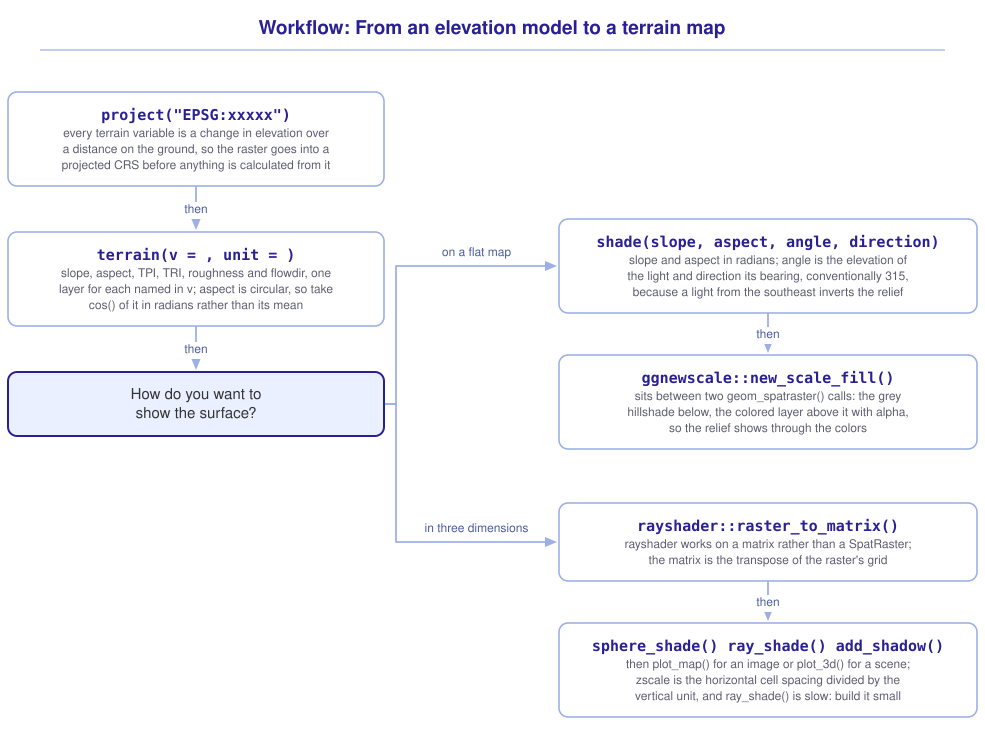

```{r}
#| include: false

library(terra)
library(tidyterra)
library(sf)
library(tidyverse)
library(webexercises)

source("src/r/course_functions.R")
source("src/r/reference_lookup.R")

lesson_refs <- find_lesson_references()
```

<hr>

<div>
{.intro_image fig-alt="Course logo"}

A digital elevation model holds one number per cell, and the questions people ask of a landscape are rarely about that number. Where the water goes, where the cold air pools, which slopes hold snow into spring, which ridge a road can be built along: each of those is a question about how elevation *changes* from one cell to the next, and each is answered by a focal operation on the elevation surface.

*terra* packages those operations under one function. This lesson covers what it returns, how to render terrain so that a reader can see it, and how to hand the surface to the *rayshader* package, which draws it in three dimensions.

In completing this lesson, you will learn how to:

* Calculate slope, aspect and other terrain variables with `terrain()`
* Explain what a terrain calculation assumes about the grid it runs on
* Build a hillshade with `shade()` and draw it
* Convert a `SpatRaster` into the matrix that *rayshader* works on
* Render a terrain surface in three dimensions

**Important!** Before starting this tutorial, be sure that you have completed all preliminary and previous lessons!

</div>

## Data for this lesson

<button class="accordion">Please click on the button below to explore the metadata for this lesson!</button>
::: panel
In this lesson, we will explore:

```{r}
#| echo: false
#| output: asis

lesson_metadata(
  .dataset = "scbi_dem.tif"
) %>%
  cat()
```
:::

## Set up your session

Please complete the following to ensure that you are working in a clean session:

1. Please ensure that your **Global Environment** is empty.
2. In the *History* tab of your **workspace pane**, ensure that your **session history** is empty.

This lesson uses one package the course has not needed before:

```{r}
#| eval: false

install.packages("rayshader")
```

Now that we are working in a clean session:

1. Create a script file.
2. Save your script file as `scripts/terrain.R`.
3. Add metadata as a comment on the top of the file.
4. Following your metadata, create a new **code section** and call it "`setup`".
5. Following your section header, attach *terra*, *tidyterra*, *rayshader*, *sf*, and the packages that comprise the **core tidyverse**, then load the module 3 source script.

At this point, your script should look something like:

```{r}
#| eval: false

# My code for the terrain tutorial

# setup --------------------------------------------------------

library(terra)
library(tidyterra)
library(rayshader)
library(sf)
library(tidyverse)

# Load the source script:

source("scripts/source_script_module_3.R")
```

```{r}
#| include: false

source("scripts/source_script_module_3.R")
```

Create a code section called "`read and pre-process data`". Every calculation in this lesson measures a change in elevation across a distance on the ground, so the raster goes into a projected CRS before anything else happens:

```{r}
dem <-
  rast("data/raw/gis_scbi/scbi_dem.tif") %>%
  project("EPSG:32617")

res(dem)
```

Cells of about three meters, in meters, which is what the rest of this lesson needs.

## Slope and aspect

`terrain()` calculates a terrain variable from an elevation raster. `v = ` names the variable and `unit = ` sets the units of the angular ones:

```{r}
slope <-
  dem %>%
  terrain(
    v = "slope",
    unit = "degrees"
  )
```

```{r}
#| echo: false

slope
```

Every cell now holds the steepness of the surface at that point, in degrees from horizontal. The steepest ground on this raster is close to sixty degrees, and it is the bank of the creek.

```{r}
#| fig-alt: "Slope across the SCBI landscape. The steepest ground forms a branching network of pale lines that trace the stream valleys and the edges of the ridges, with the flat ridge tops and the valley floor dark."

ggplot() +
  geom_spatraster(data = slope) +
  scale_fill_whitebox_c(palette = "muted")
```

That map is a drainage network drawn without any hydrology. Steep ground is where water has cut, so the steepest cells trace the streams.

`v = ` accepts more than one variable, and returns one layer for each:

```{r}
terrain_layers <-
  dem %>%
  terrain(
    v = c("slope", "aspect", "TPI", "roughness"),
    unit = "degrees"
  )

terrain_layers %>%
  global(
    c("mean", "min", "max"),
    na.rm = TRUE
  )
```

**`slope`** is the steepness of the surface.

**`aspect`** is the compass direction the surface faces, in degrees clockwise from north. In the northern hemisphere a south-facing slope receives more sun than a north-facing one, which is why aspect turns up in models of vegetation, snowpack and soil moisture in mountainous country.

**`TPI`**, the topographic position index, is the difference between a cell's elevation and the mean of its neighbors. It is positive on a ridge, negative in a valley, and near zero on a uniform slope, which makes it the simplest way to separate the three.

**`roughness`** is the difference between the highest and lowest cell in a neighborhood. We calculated exactly this in ***6.5 Map algebra*** with `focal()` and a function of our own, and `terrain()` supplies it under its usual name.

`terrain()` returns two more. **`TRI`**, the terrain ruggedness index, is the mean of the absolute differences between a cell and its neighbors, which is roughness rescaled so that a single outlying cell counts for less. **`flowdir`** is the direction water would run from each cell, coded so that the eight neighbors take the values 1, 2, 4, 8, 16, 32, 64 and 128.

::: mysecret
 [Never average an aspect!]{style="font-size: 1.25em; padding-left: 0.5em;"}

The mean in the table above is the trap. Aspect is measured in degrees around a circle, and 1 degree and 359 degrees are two degrees apart on the ground and 358 apart in arithmetic. The mean of the two is 180, which is due south, and both slopes face north.

Every summary that treats aspect as a number on a line is wrong in the same way, and no amount of care with `na.rm` fixes it. The usual answers:

* Classify aspect into compass sectors and count them, which turns a circular quantity into a categorical one.
* Transform it into something that is not circular. `cos(aspect)` in radians is a northness that runs from 1 due north to -1 due south, and `sin(aspect)` is the matching eastness.

The second is what a model wants, because northness varies smoothly with the thing aspect is usually standing in for, which is how much sun the ground receives.
:::

::: now_you
 [Now you!]{style="font-size: 1.25em; padding-left: 0.5em;"}

Return a raster of northness, and use it to report the mean slope of the north-facing ground and of the south-facing ground.

*Hint: `terrain()` returns aspect in radians when you ask it to, and `cos()` of that is the northness described above. Everything after that is `ifel()` and `zonal()` from ***6.5 Map algebra***.*

[Click here to see my answer]{.answer_link data-answer="a-6-6-northness"}

::: {.answer_body #a-6-6-northness}

```{r}
northness <-
  dem %>%
  terrain(
    v = "aspect",
    unit = "radians"
  ) %>%
  cos()

names(northness) <- "northness"

facing <-
  ifel(
    northness > 0,
    1,
    0
  )

names(facing) <- "facing"

slope %>%
  zonal(
    facing,
    fun = "mean",
    na.rm = TRUE
  )
```

Zone 1 is the ground with a northerly component to its aspect and zone 0 is the rest. On this landscape the two are within a degree of each other, which is what a set of stream valleys running in several directions looks like.

Splitting at zero is the crudest version of the classification the box above describes. A study of solar exposure would want sectors rather than halves, and `classify()` would build them from the aspect raster in degrees.

You will learn alternative solutions to this problem in a future lesson.

:::
:::

## Hillshade

A map of elevation in color tells a reader the value at each point and very little about the shape. A **hillshade** does the opposite: it calculates how brightly each cell would be lit by a light source in a given position, which is the cue the eye actually uses to read a landform.

`shade()` takes slope and aspect **in radians**, the elevation angle of the light, and its compass direction:

```{r}
slope_radians <-
  dem %>%
  terrain(
    v = "slope",
    unit = "radians"
  )

aspect_radians <-
  dem %>%
  terrain(
    v = "aspect",
    unit = "radians"
  )

hillshade <-
  shade(
    slope_radians,
    aspect_radians,
    angle = 45,
    direction = 315
  )
```

```{r}
#| echo: false

hillshade
```

`direction = 315` puts the light in the northwest, which is the convention in cartography and has been since long before computers. A light from the southeast makes most readers see the valleys as ridges and the ridges as valleys, an illusion strong enough that it survives being pointed out.

```{r}
#| fig-alt: "A grey hillshade of the SCBI landscape lit from the northwest. Ridges and stream valleys stand out in relief, with a branching valley system running from the northeast to the southwest and the campus buildings visible as small blocks."

ggplot() +
  geom_spatraster(data = hillshade) +
  scale_fill_gradient(
    low = "black",
    high = "white",
    guide = "none"
  ) +
  theme_void()
```

The usual finished product puts a colored layer over a hillshade, so that the reader gets the shape from the shading and the value from the color:

```{r}
#| fig-alt: "The SCBI landscape with elevation in a hypsometric green-to-brown ramp drawn semi-transparently over the grey hillshade, so that the terrain relief shows through the colors."

ggplot() +
  geom_spatraster(data = hillshade) +
  scale_fill_gradient(
    low = "black",
    high = "white",
    guide = "none"
  ) +
  ggnewscale::new_scale_fill() +
  geom_spatraster(
    data = dem,
    alpha = 0.6
  ) +
  scale_fill_hypso_c() +
  theme_void()
```

`ggnewscale::new_scale_fill()` is what lets one plot carry two fill scales. Without it the second `geom_spatraster()` would be drawn on the scale the first one set, and *ggplot2* would report that a fill scale is already present.

## Rayshader

*rayshader* renders an elevation surface as an image, and then as a three-dimensional scene. It does not work on a `SpatRaster`; it works on a plain matrix of elevations, so the first step is a conversion.

`raster_to_matrix()` performs it, and what it does is worth seeing because the shape changes:

```{r}
elevation_matrix <-
  matrix(
    as.numeric(
      values(dem)
    ),
    nrow = ncol(dem),
    ncol = nrow(dem)
  )

dim(dem)

dim(elevation_matrix)
```

The raster is 855 rows by 707 columns and the matrix is 707 by 855, because *rayshader* indexes a scene by x and then y where a raster is stored by row and then column. `rayshader::raster_to_matrix(dem)` does exactly the calculation above and is what you would write in practice; it is spelled out here so that the transpose is visible rather than mysterious.

The rendering pipeline is a chain of shading layers:

```{r}
#| eval: false

elevation_matrix %>%
  sphere_shade(texture = "imhof1") %>%
  add_shadow(
    ray_shade(
      elevation_matrix,
      zscale = 3
    ),
    max_darken = 0.5
  ) %>%
  plot_map()
```

* `sphere_shade()` colors the surface by the direction each part of it faces, using one of several built-in textures.
* `ray_shade()` traces rays from the sun and returns a map of what is in shadow, which is the calculation that gives *rayshader* its name.
* `add_shadow()` combines the two.
* `plot_map()` draws the result.

`zscale` is the argument to get right. *rayshader*'s documentation defines it as *"the ratio between the x and y spacing (which are assumed to be equal) and the z axis"*, so it is the horizontal cell spacing divided by the vertical unit. This raster's cells are about three meters apart and its elevations are in meters, which makes `zscale = 3`. A smaller number exaggerates the relief and a larger one flattens it, and a scene rendered at the wrong `zscale` is a landscape that does not exist.

The same chain ends in `plot_3d()` rather than `plot_map()` to open the scene in three dimensions:

```{r}
#| eval: false

elevation_matrix %>%
  sphere_shade(texture = "imhof1") %>%
  add_shadow(
    ray_shade(elevation_matrix, zscale = 3),
    max_darken = 0.5
  ) %>%
  plot_3d(
    elevation_matrix,
    zscale = 3,
    theta = 45,
    phi = 30
  )

render_snapshot("figures/scbi_3d.png")
```

`plot_3d()` takes the shaded image **and** the elevation matrix, because the image supplies the color and the matrix supplies the height. The scene opens in a window you can rotate and zoom with the mouse, and `render_snapshot()` writes what you are looking at to a file.

::: mysecret
 [Render a small raster first]{style="font-size: 1.25em; padding-left: 0.5em;"}

`ray_shade()` traces a ray from every cell toward the sun and tests it against the surface, so its cost grows with the number of cells and with the length of the rays. A full-resolution raster of a landscape can take minutes, and a scene you got wrong takes the same minutes again.

Build the chain on an aggregated version first:

```{r}
#| eval: false

small <-
  dem %>%
  aggregate(
    fact = 5,
    fun = "mean",
    na.rm = TRUE
  )
```

Get the texture, the `zscale` and the sun position right on that, then change one line to run it at full resolution. `aggregate()` by a factor of five reduces the cell count by twenty-five, which is the difference between iterating and waiting.

Note also that a scene opened by `plot_3d()` stays open until `rgl::rgl.close()` closes it, and that a second `plot_3d()` draws into the same window.
:::

## Putting it all together

Terrain analysis runs in a fixed order up to the point where the surface has to be shown, and the first step is the one people skip. My own model for that looks like this (click to expand):

{.zoomable data-title="Workflow: From an elevation model to a terrain map" data-pdf-key="terrain" fig-alt="A workflow from an elevation model to a terrain map. First project() puts the raster in a projected CRS, because every terrain variable is a change in elevation over a distance on the ground. Then terrain() returns slope, aspect, TPI, TRI, roughness and flowdir, one layer for each named in v, with unit setting degrees or radians; aspect is circular, so take cos() of it in radians rather than its mean. Then ask how you want to show the surface. On a flat map, shade() builds a hillshade from slope and aspect in radians, where angle is the elevation of the light and direction its bearing, conventionally 315, because a light from the southeast inverts the relief; then ggnewscale::new_scale_fill() sits between two geom_spatraster() calls, the grey hillshade below and the colored layer above it with alpha, so the relief shows through the colors. In three dimensions, rayshader::raster_to_matrix() converts the raster, because rayshader works on a matrix rather than a SpatRaster and the matrix is the transpose of the raster's grid; then sphere_shade(), ray_shade() and add_shadow() build the scene, and plot_map() returns an image or plot_3d() a scene, with zscale as the horizontal cell spacing divided by the vertical unit and ray_shade() slow enough to build on a small raster."}



::: {.callout-note}

This workflow is a visualization of *my* mental model for these functions. It is totally okay if your model differs! What is important is that you have a *working* model, a system in place that allows you to retrieve the function or functions that you need to solve a problem.

:::

## Take-home points

* Every terrain variable is a change in elevation over a distance on the ground, so the raster belongs in a projected CRS before `terrain()` runs on it.
* `terrain()` returns slope, aspect, TPI, TRI, roughness and flowdir, one layer per variable named in `v = `, with `unit = ` setting degrees or radians.
* Aspect is circular, so its mean is meaningless. Take `cos()` of aspect in radians for a northness, or classify it into compass sectors.
* `shade()` builds a hillshade from slope and aspect **in radians**, with `angle = ` for the elevation of the light and `direction = ` for its bearing. A light from the northwest is the convention, and a light from the southeast inverts the relief for most readers.
* A second fill scale in one plot needs `ggnewscale::new_scale_fill()`, which is what lets a colored layer sit over a hillshade.
* *rayshader* works on a matrix rather than a `SpatRaster`, and the matrix is the transpose: its rows are the columns of the raster.
* `zscale` is the horizontal cell spacing divided by the vertical unit, so a raster of 10-meter cells holding elevations in meters takes `zscale = 10`. Getting it wrong renders a landscape that does not exist.
* `ray_shade()` is expensive. Build the scene on an aggregated raster and change one line to run it at full resolution.

## Exercises

::: now_you
 [Test your knowledge!]{style="font-size: 1.25em; padding-left: 0.5em;"}

1. Why does `shade()` need slope and aspect rather than elevation?

`r longmcq(c(answer = "The brightness of a surface depends on the angle between it and the light, which slope and aspect describe", "Elevation is in the wrong units", "shade() cannot read a single-layer raster", "It uses elevation as well, supplied through the angle argument"))`

2. A colleague reports the mean aspect of a study area as 181 degrees and concludes that it faces south. What is wrong?

`r longmcq(c(answer = "Aspect is circular, so an arithmetic mean of it means nothing", "The mean should have been taken in radians", "Aspect is measured counterclockwise from east, so 181 is north", "Nothing, provided na.rm was set to TRUE"))`

3. A raster of 10-meter cells holds elevations in meters. What is the `zscale` that renders it at its true proportions?

`r longmcq(c(answer = "10", "1", "0.1", "It depends on the range of the elevations"))`

4. Parsons problem: Reorder the lines below to return a hillshade of the elevation model, lit from the northwest at forty-five degrees. `shade()` has no argument naming the units of what it is given, so one line hands it slope in degrees, which it accepts without complaint and which shades a landscape that does not exist. Leave it in the trash.

<div class="parsons-problem">
<div id="p-6-6-01-trash" class="sortable-code"></div>
<div id="p-6-6-01-sortable" class="sortable-code"></div>
<div style="clear: both;"></div>
<button id="p-6-6-01-check" class="parsons-btn parsons-btn-check" type="button">Check My Order</button>
<button id="p-6-6-01-reset" class="parsons-btn parsons-btn-reset" type="button">Shuffle Again</button>
<p id="p-6-6-01-feedback" class="parsons-feedback"></p>
</div>

<script>
window.parsonsProblems = window.parsonsProblems || []; window.parsonsProblems.push({ id: "p-6-6-01", maxDistractors: 1, code: "relief <-\n  shade(\n    terrain(dem, v = \"slope\", unit = \"degrees\"), #distractor\n    terrain(dem, v = \"slope\", unit = \"radians\"),\n    terrain(dem, v = \"aspect\", unit = \"radians\"),\n    angle = 45,\n    direction = 315\n  )" });
</script>

5. True or false: *rayshader* accepts a `SpatRaster` wherever it accepts an elevation matrix.

`r torf(FALSE)`
:::


