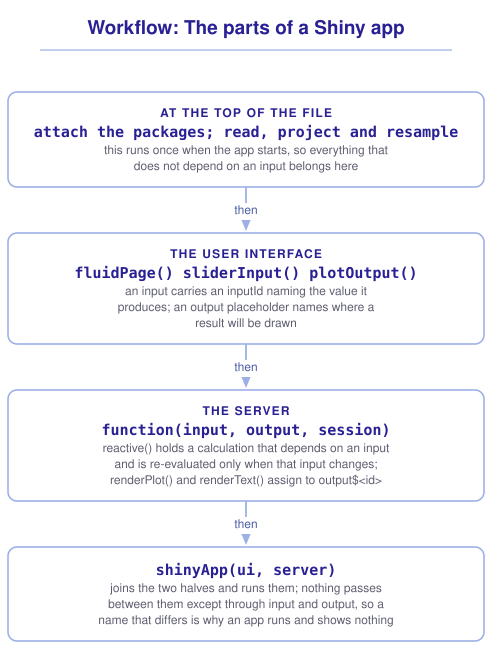

```{r}
#| include: false

library(shiny)
library(terra)
library(tidyterra)
library(sf)
library(tidyverse)
library(webexercises)

source("src/r/course_functions.R")
source("src/r/reference_lookup.R")

lesson_refs <- find_lesson_references()
```

<hr>

<div>
{.intro_image fig-alt="Course logo"}

Every map in this course so far has been finished before anybody looked at it. We chose the threshold, the classification and the extent, and the reader received the result of those choices with no way to ask what a different one would have shown.

A **Shiny app** is a web page whose server is running R. When a reader moves a slider, R recalculates and returns a new plot, which means the choices we have been making on the reader's behalf can be handed to them instead. That matters for raster work, because a raster is a surface that answers differently at every threshold, and one static map of it shows one of those answers.

In completing this lesson, you will learn how to:

* Describe the two halves of a Shiny app and what passes between them
* Build an app that draws a raster and lets a reader change what it shows
* Explain what makes an expression reactive, and where the data should be read
* Run an app, and say what deploying one requires

*Note: This lesson is optional. ***8.4 Introduction to shiny apps*** covers Shiny in more depth and in a form that is not spatial; this lesson is the shortest path from a `SpatRaster` to something a reader can drive.*

**Important!** Before starting this tutorial, be sure that you have completed all preliminary and previous lessons!

</div>

## Data for this lesson

<button class="accordion">Please click on the button below to explore the metadata for this lesson!</button>
::: panel
In this lesson, we will explore:

```{r}
#| echo: false
#| output: asis

lesson_metadata(
  .dataset = "scbi_dem.tif"
) %>%
  cat()
```
:::

## Set up your session

Please complete the following to ensure that you are working in a clean session:

1. Please ensure that your **Global Environment** is empty.
2. In the *History* tab of your **workspace pane**, ensure that your **session history** is empty.

This lesson uses one package the course has not needed before:

```{r}
#| eval: false

install.packages("shiny")
```

An app is a file rather than a script, and RStudio knows how to make one:

1. Select *File* > *New File* > *Shiny Web App*.
2. Name the application `elevation_app`, choose *Single File*, and save it inside your project.

RStudio writes a working app with some example content. Delete everything in it and keep the file.

```{r}
#| include: false

source("scripts/source_script_module_3.R")
```

## The two halves of an app

Every Shiny app is two objects and one call that joins them.

The **user interface** describes what the reader sees. It is a nested set of function calls that Shiny turns into HTML, and each control in it carries an `inputId` naming the value it produces.

The **server** is a function of `input`, `output` and `session`. It reads the values the interface produced through `input`, calculates whatever depends on them, and writes results back through `output`.

`shinyApp()` joins the two and runs them.

Nothing passes between the halves except through those two lists. A control named `cutoff` in the interface arrives in the server as `input$cutoff`, and an output assigned to `output$map` in the server is drawn wherever the interface put `plotOutput("map")`. Getting a name wrong in one half is the most common reason an app runs and shows nothing.

## An app that draws a raster

We will build an app that shows the ground above an elevation the reader chooses. Start with the data, read **once**, at the top of the file and outside both halves:

```{r}
#| eval: false

library(shiny)
library(terra)
library(tidyterra)
library(tidyverse)

dem <-
  rast("data/raw/gis_scbi/scbi_dem.tif") %>%
  project("EPSG:32617")
```

Code at the top of the file runs once when the app starts, and the server function runs once for each reader who opens the app. What runs again on every change is narrower than either: only the reactive and rendering expressions that read the input that changed. Reading a raster inside one of those would read it again on every movement of the slider.

Now the interface. One slider, one plot, one line of text:

```{r}
#| eval: false

ui <-
  fluidPage(
    titlePanel("Elevation at SCBI"),
    sidebarLayout(
      sidebarPanel(
        sliderInput(
          inputId = "cutoff",
          label = "Show ground above (meters):",
          min = 225,
          max = 390,
          value = 300
        )
      ),
      mainPanel(
        plotOutput("map"),
        textOutput("area")
      )
    )
  )
```

`fluidPage()` is the page, `sidebarLayout()` splits it into a panel of controls and a panel of results, and the three arguments of `sliderInput()` that matter are the `inputId` the server will read, the `label` the reader will see, and the range the slider covers.

The `min` and `max` are the range of the data, which we know from ***6.1 Introduction to raster data***. Hard-coding them is fine for one raster and wrong for an app that will be given another, and `global(dem, c("min", "max"))` is what replaces them when that day comes.

Then the server:

```{r}
#| eval: false

server <-
  function(input, output, session) {
    high_ground <-
      reactive({
        dem %>%
          filter(Layer_1 > input$cutoff)
      })

    output$map <-
      renderPlot({
        ggplot() +
          geom_spatraster(data = high_ground()) +
          scale_fill_hypso_c(na.value = "grey90") +
          theme_void()
      })

    output$area <-
      renderText({
        hectares <-
          high_ground() %>%
          cellSize(unit = "ha") %>%
          mask(high_ground()) %>%
          global("sum", na.rm = TRUE)

        paste0(
          round(hectares$sum, 1),
          " hectares above ",
          input$cutoff,
          " meters"
        )
      })
  }
```

And the call that runs it:

```{r}
#| eval: false

shinyApp(ui, server)
```

Click *Run App* in RStudio, and moving the slider redraws the map and rewrites the sentence beneath it.

::: {.callout-note}

Recall from ***6.1 Introduction to raster data*** that `filter()` on a `SpatRaster` sets the failing cells to `NA` rather than removing them. That is what makes this app work: the raster keeps its extent as the slider moves, so the map does not jump around, and `na.value = "grey90"` is what draws the excluded ground.

:::

## What makes an expression reactive

An expression is **reactive** when Shiny re-evaluates it after something it reads has changed, and returns the stored value otherwise. `reactive()` is the piece that repays understanding, and it is the piece that separates Shiny from an ordinary script.

`high_ground()` is not a raster. It is an expression that Shiny will evaluate when something needs its value, and re-evaluate when something it depends on has changed. Shiny works out what it depends on by watching which inputs are read while it runs, so nothing had to be declared.

Two things follow, and both are the reason to use `reactive()` rather than repeating the calculation:

**The filtered raster is calculated once per change, not twice.** Both `output$map` and `output$area` call `high_ground()`, and Shiny caches the value until `input$cutoff` changes.

**Nothing recalculates that did not need to.** An input the expression never reads is not a dependency, so adding a control that changes the map's colors will not re-run the filter.

::: mysecret
 [Read your data outside the server!]{style="font-size: 1.25em; padding-left: 0.5em;"}

The most common performance failure in a spatial Shiny app is reading, projecting or resampling inside a reactive or a rendering expression. Those are the parts that run again when an input changes, and a projection that takes two seconds makes an app that feels broken.

The order to work in:

* At the top of the file, outside `ui` and `server`: read the files, project them, resample them onto one grid, and do anything else that does not depend on an input. This runs once.
* Inside `reactive()`: only what actually depends on an input.
* Inside `render*()`: only the drawing.

Where the pre-processing is slow enough to be worth avoiding entirely, do it in a separate script and `write_rds()` the finished object, then have the app read that.
:::

::: mysecret
 [What `session` is for, and why a reactive is lazy]{style="font-size: 1.25em; padding-left: 0.5em;"}

Two things in the server signature repay a closer look.

**`session` is the third argument and this app never uses it.** It represents one reader's connection, and it is how an app does anything that concerns that reader rather than the data: updating a control from the server with `updateSliderInput()`, cleaning up with `session$onSessionEnded()`, or reading the size of their browser window. The signature carries it because most apps eventually need it.

**A reactive is lazy as well as cached.** Shiny does not recalculate `high_ground()` when the slider moves. It marks the value stale, and calculates it when something asks for it, which means an output on a tab nobody has opened costs nothing at all. That is why the dependency graph is worked out by watching which inputs are read rather than declared in advance: an expression that has never run has no dependencies yet.
:::

::: now_you
 [Check your understanding]{style="padding-left: 0.5em;"}

An app's server reads `input$year` inside a `reactive()`. When does that expression re-evaluate?

`r longmcq(c(answer = "When input$year changes and something needs its value", "Every time any input changes", "Once, when the app starts", "Every second, until the app is closed"))`

True or false: A `SpatRaster` read at the top of an app file is re-read each time an input changes.

`r torf(FALSE)`
:::

::: now_you
 [Now you!]{style="font-size: 1.25em; padding-left: 0.5em;"}

Add a second control to the app: a checkbox that turns the hillshade of ***6.6 Terrain, and seeing it*** on and off underneath the elevation.

*Hint: `checkboxInput()` takes an `inputId`, a `label` and a `value`, and returns `TRUE` or `FALSE`. The hillshade does not depend on the slider, so it does not belong in a `reactive()`.*

[Click here to see my answer]{.answer_link data-answer="a-6-7-hillshade"}

::: {.answer_body #a-6-7-hillshade}

At the top of the file, beside the elevation model:

```{r}
#| eval: false

slope <-
  dem %>%
  terrain(
    v = "slope",
    unit = "radians"
  )

aspect <-
  dem %>%
  terrain(
    v = "aspect",
    unit = "radians"
  )

hillshade <-
  shade(
    slope,
    aspect,
    angle = 45,
    direction = 315
  )
```

In the interface, beneath the slider:

```{r}
#| eval: false

checkboxInput(
  inputId = "relief",
  label = "Show the hillshade",
  value = TRUE
)
```

And in the server:

```{r}
#| eval: false

output$map <-
  renderPlot({
    base <- ggplot()

    if (input$relief) {
      base <-
        base +
        geom_spatraster(data = hillshade) +
        scale_fill_gradient(
          low = "black",
          high = "white",
          guide = "none"
        ) +
        ggnewscale::new_scale_fill()
    }

    base +
      geom_spatraster(
        data = high_ground(),
        alpha = 0.7
      ) +
      scale_fill_hypso_c(na.value = NA) +
      theme_void()
  })
```

The hillshade is calculated once, at the top of the file, because nothing about it depends on an input. Putting it in a `reactive()` would be harmless and would say something untrue about the app.

Building the plot up in an `if` rather than writing two `renderPlot()` blocks keeps the two versions of the map from drifting apart, and `ggnewscale::new_scale_fill()` is needed only on the branch that drew a first fill scale.

You will learn alternative solutions to this problem in a future lesson.

:::
:::

## Running an app, and sharing one

*Run App* starts the app on your own machine, and closing the window stops it. Nobody else can reach it, because the R session serving it is yours.

Putting an app somewhere other people can use it means putting R somewhere other people can reach, which is what makes deployment a different problem from publishing a Quarto document. A rendered document is a file; an app is a running program. The usual options:

* **shinyapps.io**, run by Posit, which the *rsconnect* package publishes to and which has a free tier. This is where the preliminary lessons of this course are hosted.
* **Posit Connect** or a **Shiny Server** of your own, which an institution runs.
* **shinylive**, which compiles an app to run in the reader's browser rather than on a server, at the cost of the packages it can use.

Whichever it is, a spatial app carries its data with it, and a raster is not a small file. An app that reads a two-hundred-megabyte GeoTIFF will be slow to deploy and slow to start. Aggregate the raster to the resolution the app actually draws at, save that, and keep the full-resolution file for the analysis.

## Putting it all together

An app is a small number of pieces in a fixed relationship, and most of the trouble comes from putting a piece in the wrong place. My own model for that looks like this (click to expand):

{.zoomable data-title="Workflow: The parts of a Shiny app" data-pdf-key="shiny_app" fig-alt="A workflow for the parts of a Shiny app. At the top of the file, outside both halves, attach the packages and read, project and resample the data: this runs once when the app starts. In the user interface, fluidPage() and sidebarLayout() lay out the page, an input such as sliderInput() carries an inputId naming the value it produces, and an output placeholder such as plotOutput() or textOutput() names where a result will be drawn. In the server, a function of input, output and session, reactive() holds a calculation that depends on an input and is re-evaluated only when that input changes, while renderPlot() and renderText() assign results to output by the names the interface used. shinyApp() joins the two halves and runs them. Nothing passes between the halves except through input and output, so a name that differs between them is why an app runs and shows nothing."}



::: {.callout-note}

This workflow is a visualization of *my* mental model for these functions. It is totally okay if your model differs! What is important is that you have a *working* model, a system in place that allows you to retrieve the function or functions that you need to solve a problem.

:::

## Take-home points

* A Shiny app is a user interface, a server function, and `shinyApp()` joining them. Nothing passes between the halves except through `input` and `output`, matched by name.
* An input carries an `inputId`, which the server reads as `input$<id>`. An output is assigned to `output$<id>` and drawn wherever the interface placed a matching `plotOutput()` or `textOutput()`.
* Code at the top of the file runs once when the app starts, and the server function body runs once per reader. Only the reactive and rendering expressions re-run when an input changes, so reading and projecting a raster belongs at the top.
* `reactive()` holds an expression that Shiny re-evaluates when something it reads has changed, and caches otherwise. Shiny works out the dependencies by watching which inputs are read.
* `filter()` on a `SpatRaster` keeps the extent and sets failing cells to `NA`, which is what keeps a map from jumping as a control moves.
* Deploying an app means running R somewhere a reader can reach, through shinyapps.io, a server of your own, or shinylive. The app carries its data, so aggregate a raster to the resolution the app draws at.

## Exercises

::: now_you
 [Test your knowledge!]{style="font-size: 1.25em; padding-left: 0.5em;"}

1. An app runs, the controls appear, and the plot panel is blank. What is the first thing to check?

`r longmcq(c(answer = "That the name in plotOutput() matches the name assigned in output$", "That the raster was read inside the server", "That shinyApp() was called before the server was defined", "That the slider's min and max cover the data"))`

2. Why is `reactive()` preferable to repeating a calculation in two `render*()` blocks?

`r longmcq(c(answer = "It is evaluated once per change and its value is reused by everything that calls it", "It runs the calculation before the app starts", "It is the only way for the server to read an input", "It prevents the outputs from redrawing"))`

3. An app projects a large raster inside `renderPlot()` and feels unusable. What is the fix?

`r longmcq(c(answer = "Project it once at the top of the file, outside both halves", "Move the projection into a reactive() so that it is cached", "Reduce the size of the plot", "Use renderImage() instead of renderPlot()"))`

4. Parsons problem: Reorder the lines below to make a server that draws the ground above a chosen elevation. One line reads the raster in a place that would re-read it on every change. Leave it in the trash.

<div class="parsons-problem">
<div id="p-6-7-01-trash" class="sortable-code"></div>
<div id="p-6-7-01-sortable" class="sortable-code"></div>
<div style="clear: both;"></div>
<button id="p-6-7-01-check" class="parsons-btn parsons-btn-check" type="button">Check My Order</button>
<button id="p-6-7-01-reset" class="parsons-btn parsons-btn-reset" type="button">Shuffle Again</button>
<p id="p-6-7-01-feedback" class="parsons-feedback"></p>
</div>

<script>
window.parsonsProblems = window.parsonsProblems || []; window.parsonsProblems.push({ id: "p-6-7-01", maxDistractors: 1, code: "server <-\n  function(input, output, session) {\n    high_ground <-\n      reactive({\n        dem <- rast(\"data/raw/gis_scbi/scbi_dem.tif\") #distractor\n        dem %>%\n          filter(Layer_1 > input$cutoff)\n      })\n\n    output$map <-\n      renderPlot({\n        ggplot() +\n          geom_spatraster(data = high_ground())\n      })\n  }" });
</script>

5. True or false: A Shiny app can be published in the same way as a rendered Quarto document.

`r torf(FALSE)`
:::


