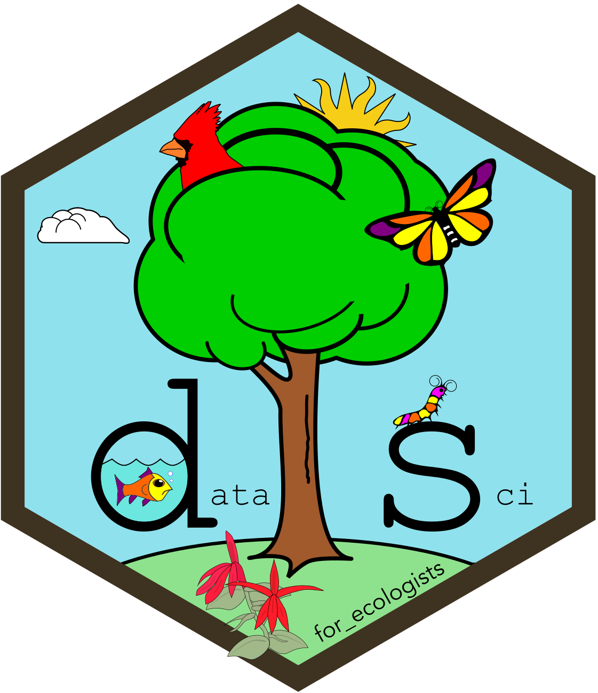

```{r}
#| include: false

source("src/r/course_functions.R")
```
<hr>

{.intro_image}

In the first lesson of this week, you learned how to create static websites using R Markdown (or Quarto). Although such websites may contain interactive features, interactivity is somewhat limited and requires coding in other languages. For example, the "Functions that you may use ..." buttons in your problem sets are written in JavaScript and CSS (Cascading Style Sheets). Any interactivity on a website is constrained by the programs available to the web server. When you run an R code chunk in an R Markdown or Quarto document, that code chunk is evaluated in program R on *your computer*, thus none of the interactive elements in a Markdown-generated website are powered by program R (at least not out-of-the-box). This is where *shiny* applications come in -- a *shiny* app is a website in which the web server is running program R. Because program R is running in the background, you can use R to develop interactive elements! For example, the preliminary lessons for this course (e.g., [Preliminary Lesson 2: Values](https://smbc.shinyapps.io/L1-rValues/ "https://smbc.shinyapps.io/L1-rValues/"){target="_blank"}) are *shiny* apps -- this is why you can write and evaluate code in the lessons. I use *shiny* apps for all sorts of things, from developing interactive content for middle school students (e.g., [Follow that bird!](https://smbc.shinyapps.io/followthatbird/){target="_blank"}), and even as a data entry portal for a participatory science project ([Neighborhood Nestwatch](https://smbc.shinyapps.io/NeighborhoodNestwatch/){target="_blank"}).

In this lesson (our last lesson of the course!), you will learn the core knowledge required to start developing your own shiny applications. Specifically, you will learn: 

* What a *shiny* app is
* How *shiny* apps are structured (User Interface and Server)
* The basics of "reactivity"
* A little bit of HTML
* How to develop a *shiny* dashboard app

## Video content: Shiny app basics

**Some notes**

This is actually the oldest video of the series and it shows! It was created for the very first iteration of our online Data Science course (which at one time included both GIS in R and data science content).

**Important!** The website for the written portion of this lesson can be a bit dodgy. If you have issues with disconnecting (you almost certainly will), I recommend knitting the RMarkdown file [dashboard_app.Rmd]{.mono}.

**Also note**: I unfortunately used `setwd()` in this lesson. This could have (and should have) been avoided. I never use `setwd()` in the real world!



## Tutorial content: A *shiny* dashboard

For the *shiny* dashboard portion of this lesson, I have created a *shiny* app tutorial. Please navigate to [this website](https://smbc.shinyapps.io/dashboard_app/){target="_blank"} to complete the tutorial. The content therein includes a written review of *shiny* app structure and you will generate a simple dashboard application.


