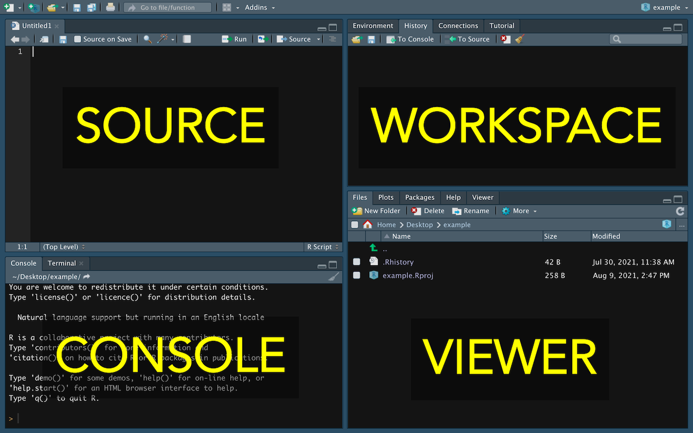

Throughout this class, I will refer to the panes (sections) of the R Studio window. This graphic should help you remember them:
</img>
*Note: I sometimes also describe the "workspace" pane as the "environment" pane.*
